# 在 20 分钟内构建和部署你的第一个供应链应用程序

> 原文：[`towardsdatascience.com/build-and-deploy-your-first-supply-chain-app-in-20-minutes/`](https://towardsdatascience.com/build-and-deploy-your-first-supply-chain-app-in-20-minutes/)

<mdspan datatext="el1764703043459" class="mdspan-comment">在供应链管理中</mdspan>，利用你的数据科学和数据分析技能很容易产生影响。

即使数据质量在大多数时候仍然是一个问题，你仍然可以通过向运营团队提供**见解**来找到解决问题的机会。

> 运营经理：“我应该招聘多少临时工才能以最低的成本满足我们的劳动力需求？”

当我在一家物流公司的供应链解决方案经理时，我通过将**数学原理**应用于解决我们仓库中的**运营问题**来学习数据科学。

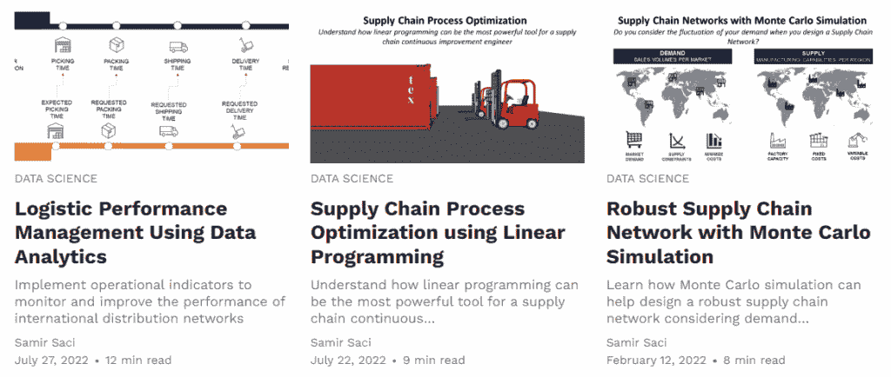

本博客先前文章中展示的分析解决方案示例 – (图片由 Samir Saci 提供)

它非常古老。

我在我的机器上运行 Python 脚本或 Jupyter 笔记本，并与我的同事分享结果。

直到我发现**Streamlit**，它让我能够轻松地将我的模型打包成我可以轻松部署的 Web 应用程序。

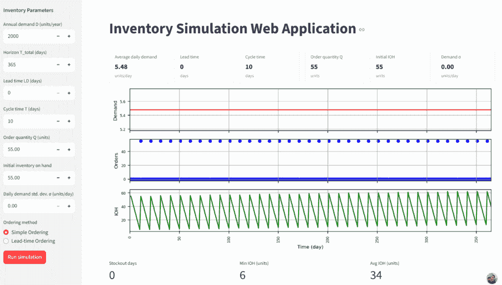

你将在本教程中构建的库存 Web 应用程序 – (图片由 Samir Saci 提供)

这对于任何供应链流程工程师或数据科学家来说都是至关重要的，他们需要学习如何**产品化分析工具**。

> 如何将 Python 代码转换为可操作的见解？

在这篇文章中，我将向你展示如何**转换**在**Jupyter Notebook**中构建的**模拟模型**，将其转换为完全功能性的**Web 应用程序**。

这个练习是我 YouTube 频道上的教程系列的一部分，我们使用 Python 来学习**供应链中的库存管理**。

你将学习我是如何将用 Python 脚本编写的核心模块转换为**一个交互式应用程序**，你可以用它来做以下事情：

+   模拟多个库存管理规则

+   测试不同交付**提前期**（LD 以天为单位）、**需求变化**（sigma 以件为单位）和**周期时间**（T 以天为单位）的几个场景

如果你对这些概念不熟悉，你仍然可以跟随这个教程，因为**我将在第一部分简要介绍它们**。

或者**你可以直接跳到第二部分**，该部分仅关注应用程序的创建和部署。

*注意：这是一个入门教程，旨在帮助你构建和部署你的第一个应用程序。如果你需要更具挑战性的练习，请查看结论中分享的案例研究。*

## 使用 Python 的库存管理模拟

### 库存管理是什么？

我在亚洲和欧洲合作的大多数零售商都使用嵌入在其 ERP 系统中的**基于规则的**方法来管理店铺订单。

> 你何时需要补充你的商店库存以避免缺货？

这些规则通常在企业管理资源计划（ERP）软件中实现，该软件向仓库管理系统（WMS）发送订单。

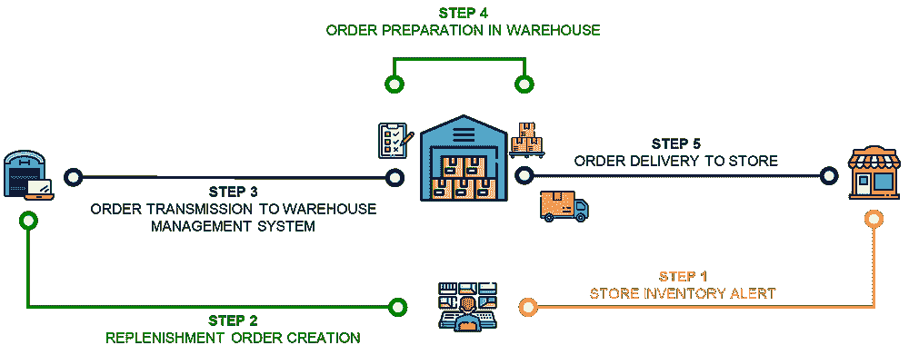

大多数大型零售公司中的商店补充流程 – （图片由 Samir Saci 提供）

目标是制定一项政策，以最小化订购、持有和短缺成本。

+   **订购成本**：下订单的固定成本

+   **持有成本**：为保持库存所需的变动成本（存储和资本成本）

+   **短缺成本**：因库存不足而无法满足客户需求（销售额损失、罚款）

我们将扮演零售公司的数据科学家，评估库存团队规则的有效性。

> 物流总监：“Samir，我们需要你的支持来了解为什么一些商店面临缺货，而其他商店库存过多。”

为了做到这一点，我们需要一个工具来模拟多个场景，并可视化关键参数对成本和库存可用性的影响。

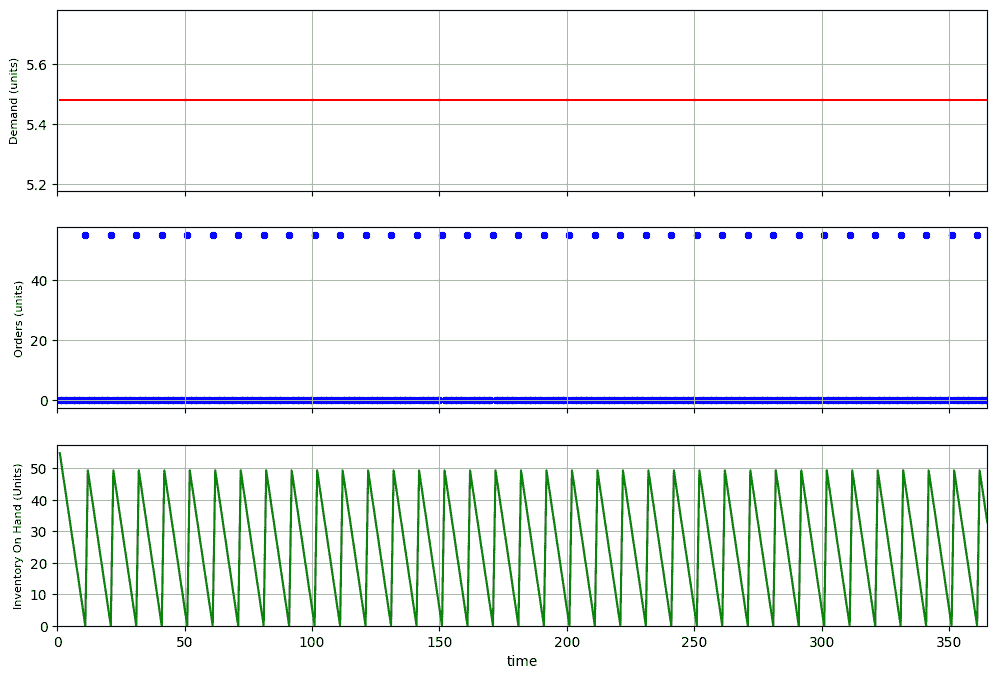

库存政策的可视化（红色：商店需求，蓝色：订单，绿色：现有库存） – （图片由 Samir Saci 提供）

在上面的图表中，你有一个包含以下规则的示例：

+   均匀的**需求分布**（即 σ = 0）

    *每天，您的商店将销售相同数量的商品。*

+   10 天的定期审查政策

    *你每 10 天补充一次商店的库存。*

+   提前期为 LD = 1 天的交货期。

    *如果你今天下单，你将明天收到货物。*

如您在绿色图表中看到的，您的**现有库存（IOH）**始终是**正值**（即您不会经历缺货）。

1.  如果你有 3 天的提前期呢？

1.  需求的可变性（σ > 0）会有什么影响？

1.  我们能否减少平均现有库存？

为了回答这些问题，我开发了一个使用 Jupyter Notebook 的模拟模型来生成可视化[在完整的教程中](https://youtu.be/1oRebt_Q0dY)。

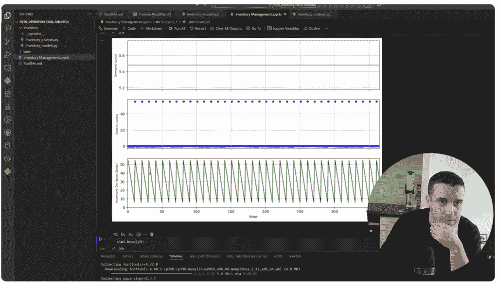

[完成端到端教程](https://youtu.be/1oRebt_Q0dY)，其中我解释了我是如何构建这个模型的 – （图片由 Samir Saci 提供）

在这篇文章中，我将简要介绍我在本教程中构建的核心功能，并展示我们将如何在 Streamlit 应用程序中**重用它们**。

***注意：**我将保持解释的高层次，以专注于 Streamlit 应用程序。对于详细信息，您可以稍后观看完整视频。*

## 您的库存模拟工具在 Jupyter Notebook 中

本教程的结果将作为我们**库存模拟 Streamlit 应用程序**的核心基础。

项目结构很简单，包含两个 Python 文件（.py）和一个**Jupyter Notebook**。

```py
tuto_inventory /
├─ Inventory Management.ipynb
└─ inventory/
├─ init.py
├─ inventory_analysis.py
└─ inventory_models.py
```

在 `inventory_models.py` 中，您可以找到一个包含我们模拟所有输入参数的 Pydantic 类。

```py
from typing import Optional, Literal
from pydantic import BaseModel, Field

class InventoryParams(BaseModel):
    """Base economic & demand parameters (deterministic daily demand)."""
    D: float = Field(2000, gt=0, description="Annual demand (units/year)")
    T_total: int = Field(365, ge=1, description="Days in horizon (usually 365)")
    LD: int = Field(0, ge=0, description="Lead time (days)")
    T: int = Field(10, ge=1, description="Cycle time (days)")
    Q: float = Field(0, ge=0, description="Order quantity (units)")
    initial_ioh: float = Field(0, description="Initial inventory on hand")
    sigma: float = Field(0, ge=0, description="Standard deviation of daily demand (units/day)")
```

这些运营参数包括

+   **需求分布**：总需求 `D` *(件)*，我们的模拟范围 `T_total` *(*件)* 和可变性 σ *(*件)*

+   **物流操作**：具有**交货提前期** `LD`（以天为单位）

+   **库存规则参数**：包括周期时间 `T`、订购数量 `Q` 和初始库存 `initial_ioh`

根据这些参数，我们想要模拟对我们分销链的影响：

+   需求分布：我们卖出了多少单位？

+   库存（绿色）：我们在商店有多少单位？

+   蓝色补货订单：我们何时以及订购了多少？


库存模拟可视化：需求（红色）/ 订单（蓝色）和库存（绿色） – (Image by Samir Saci)

在上面的例子中，你看到的是一个 10 天周期时间的定期审查策略的模拟。

> 我是如何生成这些视觉效果的？

这些函数是通过在 `inventory_analysis.py` 中创建的 `InventorySimulation` 类进行模拟的。

```py
class InventorySimulation:
    def __init__(self, 
                 params: InventoryParams):
        self.type = type
        self.D = params.D
        self.T_total = params.T_total
        self.LD = params.LD
        self.T = params.T
        self.Q = params.Q
        self.initial_ioh = params.initial_ioh
        self.sigma = params.sigma

        # # Demand per day (unit/day)
        self.D_day = self.D / self.T_total

        # Simulation dataframe
        self.sim = pd.DataFrame({'time': np.array(range(1, self.T_total+1))})
```

我们首先初始化函数的输入参数：

+   `order()` 代表周期性订购策略（你每 T 天订购 Q 单位）

+   `simulation_1()` 计算需求（销售）和订购策略对每天库存的影响

```py
class InventorySimulation:
    ''' [Beginning of the class] ''' 
    def order(self, t, T, Q, start_day=1):
        """Order Q starting at `start_day`, then every T days."""
        return Q if (t > start_day and ((t-start_day) % T) == 0) else 0
    def simulation_1(self):
        """Fixed-cycle ordering; lead time NOT compensated."""
        sim_1 = self.sim.copy()
        sim_1['demand'] = np.random.normal(self.D_day, self.sigma, self.T_total)
        T = int(self.T)
        Q = float(self.Q)
        sim_1['order'] = sim_1['time'].apply(lambda t: self.order(t, T, Q))
        LD = int(self.LD)
        sim_1['receipt'] = sim_1['order'].shift(LD, fill_value=0.0)
        # Inventory: iterative update to respect lead time
        ioh = [self.initial_ioh]
        for t in range(1, len(sim_1)):
            new_ioh = ioh[-1] - sim_1.loc[t, 'demand']
            new_ioh += sim_1.loc[t, 'receipt']
            ioh.append(new_ioh)
        sim_1['ioh'] = ioh
        for col in ['order', 'ioh', 'receipt']:
            sim_1[col] = np.rint(sim_1[col]).astype(int)
        return sim_1 
```

函数 `simulation_1()` 包含一个机制，根据商店需求（销售）和供应（补货订单）更新**库存**。

我本教程的目标是从两个基本规则开始，解释当你引入提前期时会发生什么，如下所示。

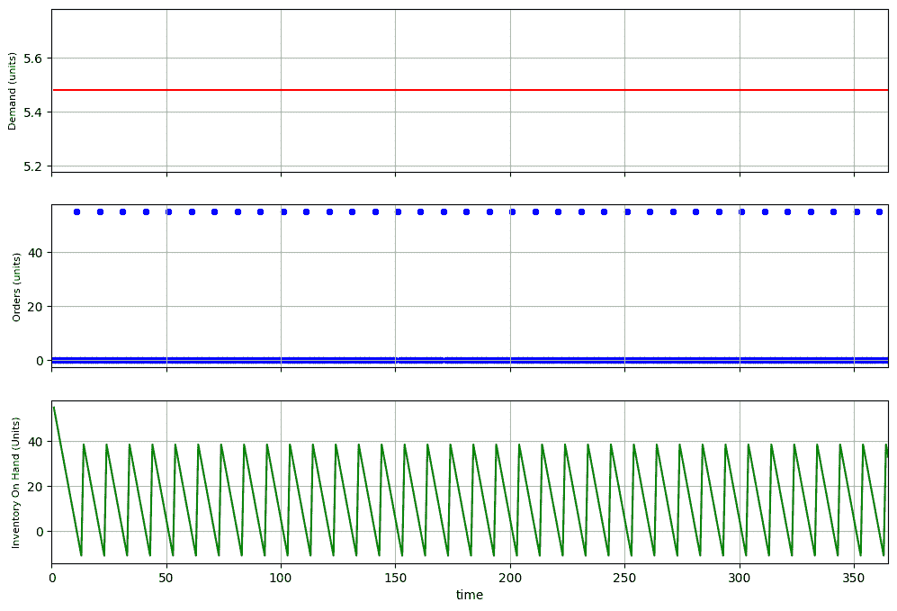

基本规则，提前期 LD = 3 天 – (Image by Samir Saci)

如绿色图表所示，商店经历了缺货情况。

由于延迟交货，他们的库存出现负数。

> 我们能做什么？也许增加订购数量 Q？

这就是我教程中尝试的内容；我们发现这个解决方案不起作用。

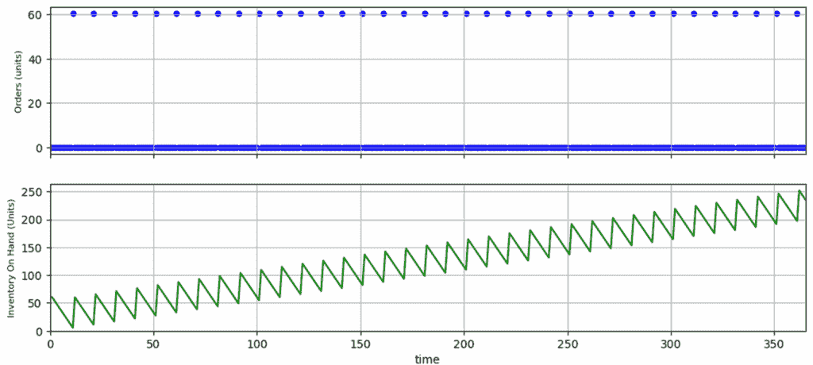

当你想增加 Q 以补偿额外的提前期时，这就是会发生的情况 – (Image by Samir Saci)

这两个场景突出了需要一种**改进的订购策略**来补偿提前期。

这就是我们教程的第二部分中添加这两个附加功能所构建的内容。

```py
class InventorySimulation:
    ''' [Beginning of the class] ''' 

    def order_leadtime(self, t, T, Q, LD, start_day=1):
        return Q if (t > start_day and ((t-start_day + (LD-1)) % T) == 0) else 0

    def simulation_2(self, method: Optional[str] = "order_leadtime"):
        """Fixed-cycle ordering; lead time NOT compensated."""
        sim_1 = self.sim.copy()
        LD = int(self.LD)
        sim_1['demand'] = np.maximum(np.random.normal(self.D_day, self.sigma, self.T_total), 0)
        T = int(self.T)
        Q = float(self.Q)
        if method == "order_leadtime":
            sim_1['order'] = sim_1['time'].apply(lambda t: self.order_leadtime(t, T, Q, LD))
        else:
            sim_1['order'] = sim_1['time'].apply(lambda t: self.order(t, T, Q))
        sim_1['receipt'] = sim_1['order'].shift(LD, fill_value=0.0)
        # Inventory: iterative update to respect lead time
        ioh = [self.initial_ioh]
        for t in range(1, len(sim_1)):
            new_ioh = ioh[-1] - sim_1.loc[t, 'demand']
            new_ioh += sim_1.loc[t, 'receipt']
            ioh.append(new_ioh)
        sim_1['ioh'] = ioh
        for col in ['order', 'ioh', 'receipt']:
            sim_1[col] = np.rint(sim_1[col]).astype(int)
        return sim_1 
```

这个想法相当简单。

在实践中，这意味着库存计划师必须在 `T - LD` 天创建补货订单以补偿提前期。

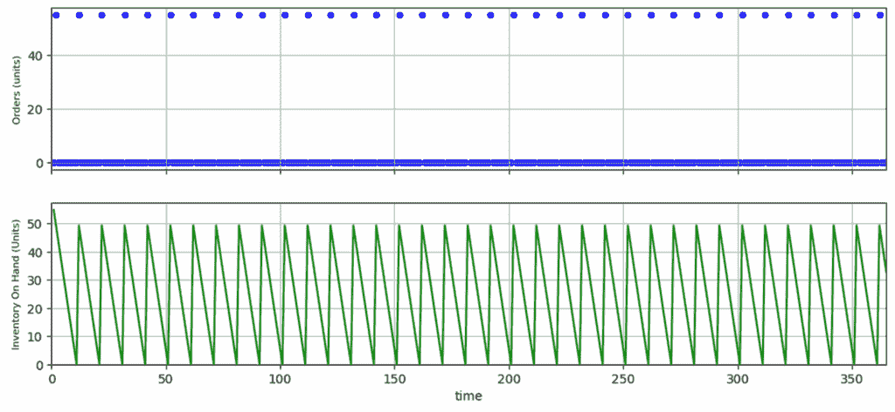

新订购策略的 4 天提前期 – (Image by Samir Saci)

这确保了商店在图表上显示的 `T` 天收到货物。

在本教程结束时，我们有一个完整的模拟工具，让你测试任何场景以熟悉库存管理规则。

如果你需要更多澄清，你可以在[这个逐步 YouTube 教程](https://youtu.be/1oRebt_Q0dY)中找到详细解释：

然而，我对结果并不满意。

> 为什么我们需要将这个功能包装成网络应用程序？

### 产品化这个模拟工具

正如你在视频中看到的，我手动在 Jupyter 笔记本中更改参数以测试不同的场景。

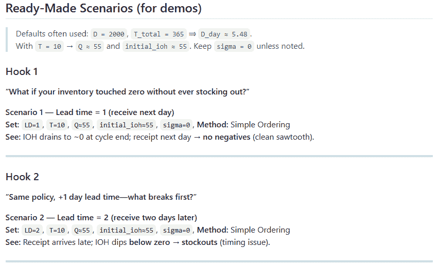

我们在教程中一起测试的场景示例 – (图片由 Samir Saci 提供)

对于我们这样的数据科学家来说，这很正常。

> 但是，你能想象我们的物流总监在 VS Code 中打开 Jupyter Notebook 来测试不同的场景吗？

我们需要将这个工具产品化，以便任何人都可以访问它，而无需编程或数据科学技能。

好消息，70% 的工作已经完成，因为我们已经有了核心模块。

在下一节中，我将解释我们如何将其打包成一个用户友好的分析产品。

## 使用 Streamlit 创建您的库存模拟应用

在本节中，我们将基于第一教程中的核心模块创建一个单页 Streamlit 应用。

您可以从克隆这个包含核心模拟的存储库开始，包括 `inventory_models.py` 和 `inventory_analysis.py`：[克隆此存储库](https://github.com/samirsaci/inventory-streamlit-app-starter/tree/main)。

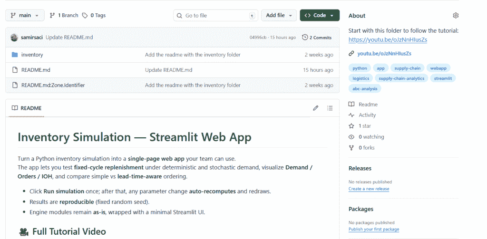

Github 存储库 Streamlit 应用启动器 – (图片由 Samir Saci 提供)

在您的本地机器上拥有这个存储库后，您可以按照教程操作，最终得到一个像这样的部署应用：


您将构建的库存网络应用：[在此访问](https://supplyscience-inventory.streamlit.app) – (图片由 Samir Saci 提供)

让我们开始吧！

### 项目设置

第一步是为项目创建一个本地 Python 环境。

因此，我建议您使用包管理器 uv：

```py
# Create a virtual environment and activate it
uv init
uv venv
source .venv/bin/activate

# Install
uv pip install -r requirements.txt
```

它将安装需求文件中列出的库：

```py
streamlit>=1.37
pandas>=2.0
numpy>=1.24
matplotlib>=3.7
pydantic>=2.0
```

我们包括 Streamlit、Pydantic 以及用于数据处理（numpy、pandas）和生成视觉（matplotlib）的库。

现在，您已经准备好构建您的应用。

### 创建您的 Streamlit 页面

创建一个名为：`app.py` 的 Python 文件

```py
import numpy as np
import matplotlib.pyplot as plt
import streamlit as st
from inventory.inventory_models import InventoryParams
from inventory.inventory_analysis import InventorySimulation
seed = 1991
np.random.seed(seed)

st.set_page_config(page_title="Inventory Simulation – Streamlit", layout="wide")
```

在此文件中，我们首先：

+   导入已安装的库和分析模块及其 Pydantic 类（用于输入参数）

+   定义用于生成随机分布的种子，该种子将用于生成变量需求

然后，我们开始使用 st.set_page_config() 创建页面，其中我们包括以下参数：

+   `page_title`：您应用的网页标题

+   `layout`：设置页面布局的选项

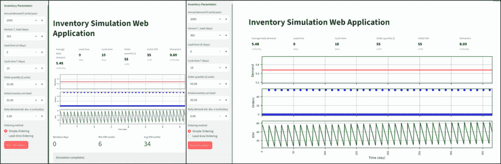

您的应用具有不同的布局（右侧为宽版） – (图片由 Samir Saci 提供)

通过将参数布局设置为“wide”，我们确保页面默认为宽版。

您现在可以运行您的应用，

```py
streamlit run app.py
```

运行此命令后，您可以使用终端中共享的本地 URL 打开您的应用：

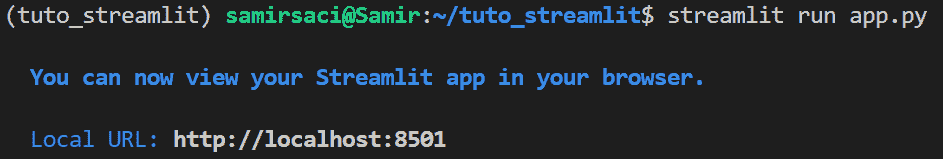

本地 URL 以访问您的应用

加载后，您将得到这个空白页面：


初始空白页面 – (图片由 Samir Saci 提供)

恭喜，您已经运行了您的应用！

如果您在这个阶段遇到任何问题，请检查以下内容：

+   本地 Python 环境已正确设置

+   您已经在 requirements 文件中安装了所有库。

现在我们可以开始构建我们的**库存管理应用**了。

### 带有库存管理参数的侧边栏

您还记得我们在 `inventory_models.py` 中定义的 Pydantic 类吗？

它们将作为我们应用程序的输入参数，我们将在 Streamlit 侧边栏中显示它们。

```py
with st.sidebar:
    st.markdown("**Inventory Parameters**")
    D = st.number_input("Annual demand D (units/year)", min_value=1, value=2000, step=50)
    T_total = st.number_input("Horizon T_total (days)", min_value=1, value=365, step=1)
    LD = st.number_input("Lead time LD (days)", min_value=0, value=0, step=1)
    T = st.number_input("Cycle time T (days)", min_value=1, value=10, step=1)
    Q = st.number_input("Order quantity Q (units)", min_value=0.0, value=55.0, step=10.0, format="%.2f")
    initial_ioh = st.number_input("Initial inventory on hand", min_value=0.0, value=55.0, step=1.0, format="%.2f")
    sigma = st.number_input("Daily demand std. dev. σ (units/day)", min_value=0.0, value=0.0, step=0.5, format="%.2f")
    method = st.radio(
        "Ordering method",
        options=["Simple Ordering", "Lead-time Ordering"],
        index=0
    )
    method_key = "order_leadtime" if method.startswith("Lead-time") else "order"

    run = st.button("Run simulation", type="primary")
    if run:
        st.session_state.has_run = True
```

在这个侧边栏中，我们包括：

+   使用 `st.markdown()` 创建的标题。

+   所有参数的数字输入字段，包括它们的最低值、默认值和增量步长值

+   一个用于选择排序方法（考虑或不考虑提前期）的单选按钮。

+   一个用于启动第一个模拟的按钮

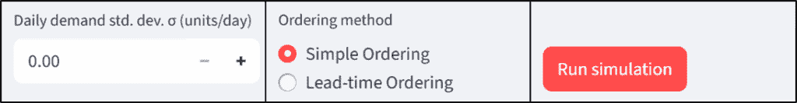

数字输入字段（左侧）/ 单选按钮（中间）和 Streamlit 按钮的示例（右侧）—— 图片由 Samir Saci 提供）

在这个块之前，我们应该添加一个会话状态变量：

```py
if "has_run" not in st.session_state:
    st.session_state.has_run = False
```

这个布尔值表示用户是否已经点击了模拟按钮。

如果是这样，当用户更改参数时，应用程序将自动重新运行所有计算。

太好了，现在您的 `app.py` 应该看起来像这样：

```py
import numpy as np
import matplotlib.pyplot as plt
import streamlit as st
from inventory.inventory_models import InventoryParams
from inventory.inventory_analysis import InventorySimulation
seed = 1991
np.random.seed(seed)

st.set_page_config(page_title="Inventory Simulation – Streamlit", layout="wide")

if "has_run" not in st.session_state:
    st.session_state.has_run = False

with st.sidebar:

    st.markdown("**Inventory Parameters**")
    D = st.number_input("Annual demand D (units/year)", min_value=1, value=2000, step=50)
    T_total = st.number_input("Horizon T_total (days)", min_value=1, value=365, step=1)
    LD = st.number_input("Lead time LD (days)", min_value=0, value=0, step=1)
    T = st.number_input("Cycle time T (days)", min_value=1, value=10, step=1)
    Q = st.number_input("Order quantity Q (units)", min_value=0.0, value=55.0, step=10.0, format="%.2f")
    initial_ioh = st.number_input("Initial inventory on hand", min_value=0.0, value=55.0, step=1.0, format="%.2f")
    sigma = st.number_input("Daily demand std. dev. σ (units/day)", min_value=0.0, value=0.0, step=0.5, format="%.2f")
    method = st.radio(
        "Ordering method",
        options=["Simple Ordering", "Lead-time Ordering"],
        index=0
    )
    method_key = "order_leadtime" if method.startswith("Lead-time") else "order"

    run = st.button("Run simulation", type="primary")
    if run:
        st.session_state.has_run = True
```

您可以查看您的应用程序，通常在刷新后窗口应该看起来像这样：

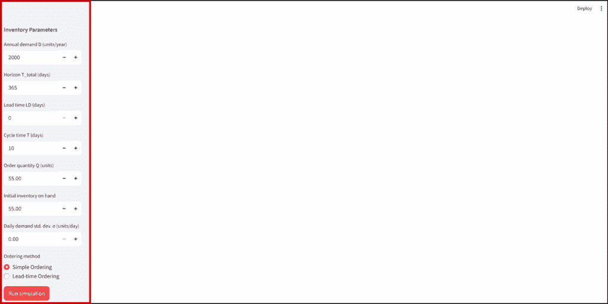

您的应用程序开始看起来像我们可以使用的东西了——（图片由 Samir Saci 提供）

在左侧，您有我们刚刚创建的侧边栏。

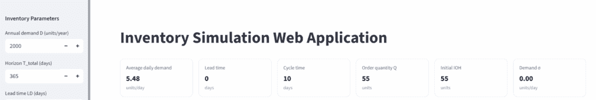

页面标题带有六个卡片，提醒所选参数——（图片由 Samir Saci 提供）

然后，为了美观和用户体验，我想添加一个标题和已使用参数的提醒。

> 为什么我要提醒使用的参数？

在窗口的左上角，您有一个按钮可以隐藏侧面板，如下所示。

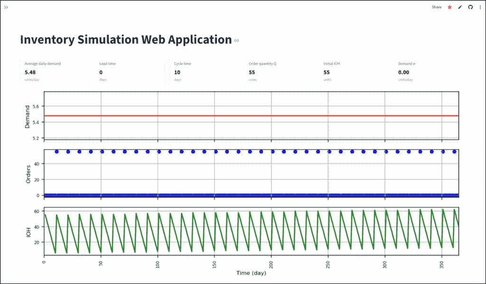

我们隐藏侧面板的 streamlit 应用程序——（图片由 Samir Saci 提供）

这有助于用户有更多空间来展示视觉内容。

然而，输入参数将被隐藏。

因此，我们需要在顶部添加一个提醒。

```py
st.title("Inventory Simulation Web Application")
# Selected Input Parameters
D_day = D / T_total
st.markdown("""
<style>
.quick-card{padding:.9rem 1rem;border:1px solid #eaeaea;border-radius:12px;background:#fff;box-shadow:0 1px 2px rgba(0,0,0,.03)}
.quick-card .label{font-size:.85rem;color:#5f6b7a;margin:0}
.quick-card .value{font-size:1.25rem;font-weight:700;margin:.15rem 0 0 0;color:#111}
.quick-card .unit{font-size:.8rem;color:#8a95a3;margin:0}
</style>
""", unsafe_allow_html=True)

def quick_card(label, value, unit=""):
    unit_html = f'<p class="unit">{unit}</p>' if unit else ""
    st.markdown(f'<div class="quick-card"><p class="label">{label}</p><p class="value">{value}</p>{unit_html}</div>', unsafe_allow_html=True)
```

在上面的代码片段中，我介绍了：

+   嵌入 Streamlit 的 CSS 样式以创建卡片。

+   `quick_card` 函数将使用其 `label`、`value` 和 `units` 为每个参数创建一个卡片。

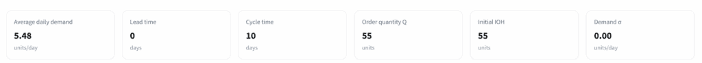

这里是带有标签、值和单位的卡片——（图片由 Samir Saci 提供）

然后，我们可以使用 streamlit 对象 `st.columns()` 在同一行生成这些卡片。

```py
c1, c2, c3, c4, c5, c6 = st.columns(6)
with c1:
    quick_card("Average daily demand", f"{D_day:,.2f}", "units/day")
with c2:
    quick_card("Lead time", f"{LD}", "days")
with c3:
    quick_card("Cycle time", f"{T}", "days")
with c4:
    quick_card("Order quantity Q", f"{Q:,.0f}", "units")
with c5:
    quick_card("Initial IOH", f"{initial_ioh:,.0f}", "units")
with c6:
    quick_card("Demand σ", f"{sigma:.2f}", "units/day")
```

第一行定义了使用 quick_card 函数放置卡片的六个列。

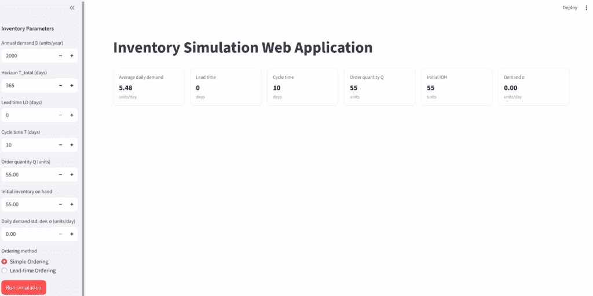

您的应用程序现在应该看起来像这样——（图片由 Samir Saci 提供）

我们可以继续到有趣的部分：将模拟工具集成到应用程序中。

> 在这个步骤中遇到任何问题或阻碍吗？您可以在视频的评论区使用，我会尽力尽快回答。

### 将库存模拟模块集成到 Streamlit 应用程序中

我们现在可以开始工作在主页面上了。

让我们想象一下，我们的物流总监来到这个页面，选择不同的参数，然后点击**“运行模拟”**。

这应该会触发模拟模块：

```py
if st.session_state.has_run:
    params = InventoryParams(
        D=float(D),
        T_total=int(T_total),
        LD=int(LD),
        T=int(T),
        Q=float(Q),
        initial_ioh=float(initial_ioh),
        sigma=float(sigma)
    )

    sim_engine = InventorySimulation(params)
```

在这段简短的代码中，我们做了很多事情：

+   我们使用`inventory_models.py`中的 Pydantic 类构建输入参数对象

    *这确保在运行模拟之前，每个值（需求、提前期、审查期、sigma...）都有正确的数据类型。*

+   我们从`inventory_analysis.py`创建模拟引擎`InventorySimulation`类

    *这个类包含我在第一个教程中开发的全部库存逻辑。*

用户界面不会有任何变化。

我们现在可以开始定义计算部分。

```py
if st.session_state.has_run:
    ''' [Previous block introduced above]'''
    if method_key == "order_leadtime":
        df = sim_engine.simulation_2(method="order_leadtime")
    elif method_key == "order":
        df = sim_engine.simulation_2(method="order")
    else:
        df = sim_engine.simulation_1()

    # Calculate key parameters that will be shown below the visual
    stockouts = (df["ioh"] < 0).sum()
    min_ioh = df["ioh"].min()
    avg_ioh = df["ioh"].mean()
```

首先，我们选择正确的排序方法。

根据侧边栏单选按钮中选择的排序规则，我们调用适当的模拟方法：

+   **method="order"**：是我最初向你展示的方法，我在添加提前期时未能保持库存的稳定性

+   **method="order_leadtime"**：是改进的方法，在 T - LD 天进行排序

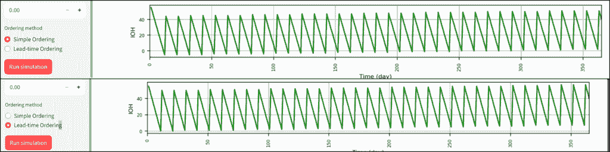

库存在手，负值在顶部（简单排序）与提前期排序 – （图片由 Samir Saci 提供）

存储在 pandas 数据框`df`中的结果用于计算关键指标，如**缺货**数量以及**最小**和**最大库存水平**。

现在我们有了模拟结果，让我们创建我们的可视化。

### 在 Streamlit 上创建库存模拟可视化

如果你跟随了本教程的视频版本，你可能已经注意到我复制并粘贴了来自第一个教程中创建的笔记本中的代码。

```py
if st.session_state.has_run:
    '''[Previous Blocks introduced above]'''
    # Plot
    fig, axes = plt.subplots(3, 1, figsize=(9, 4), sharex=True)  # ↓ from (12, 8) to (9, 5)
    # Demand
    df.plot(x='time', y='demand', ax=axes[0], color='r', legend=False, grid=True)
    axes[0].set_ylabel("Demand", fontsize=8)
    # Orders
    df.plot.scatter(x='time', y='order', ax=axes[1], color='b')
    axes[1].set_ylabel("Orders", fontsize=8); axes[1].grid(True)
    # IOH
    df.plot(x='time', y='ioh', ax=axes[2], color='g', legend=False, grid=True)
    axes[2].set_ylabel("IOH", fontsize=8); axes[2].set_xlabel("Time (day)", fontsize=8)
    # Common x formatting
    axes[2].set_xlim(0, int(df["time"].max()))
    for ax in axes:
        ax.tick_params(axis='x', rotation=90, labelsize=6)
        ax.tick_params(axis='y', labelsize=6)
    plt.tight_layout()
```

事实上，你用于在笔记本中原型设计的相同视觉代码也可以在你的应用中使用。

唯一的区别是，你不需要使用`plt.show()`，而是在这一节结束时使用：

```py
st.pyplot(fig, clear_figure=True, use_container_width=True) 
```

Streamlit 需要显式控制渲染，使用

+   **`fig`**，这是你之前创建的 Matplotlib 图形。

+   **`clear_figure=True`**，这是一个参数，在渲染后从内存中清除图形，以避免在参数更新时出现重复的图表。

+   **`use_container_width=True`** 使图表自动调整到 Streamlit 页面的宽度

在这个阶段，通常你的应用中会有以下内容：

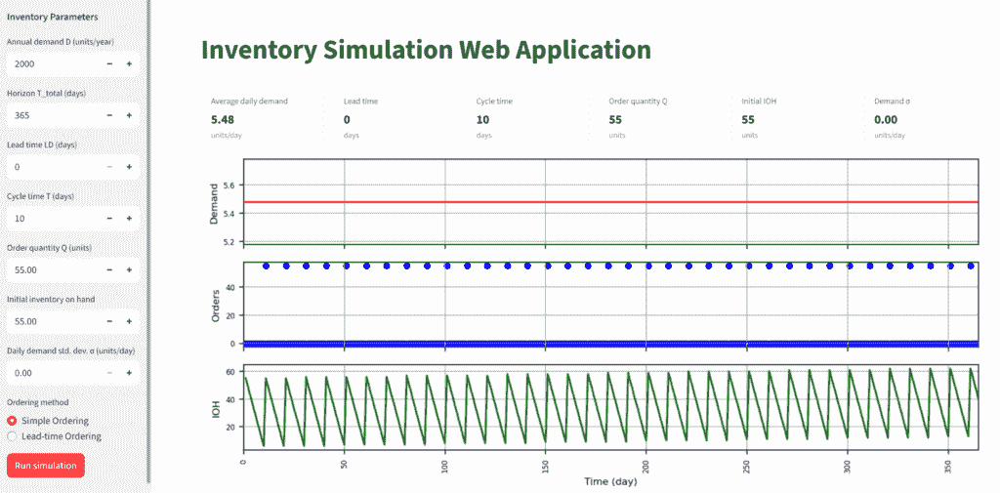

应用程序的屏幕截图，显示生成的可视化 – （图片由 Samir Saci 提供）

如果你尝试更改任何参数，例如，更改排序方法，你会看到视觉自动更新。

> 还剩下什么？

作为额外的好处，我添加了一个部分来帮助你发现 Streamlit 的额外功能。

```py
if st.session_state.has_run:
    '''[Previous Blocks introduced above]'''
    # Key parameters presented below the visual
    kpi_cols = st.columns(3)
    kpi_cols[0].metric("Stockout days", f"{stockouts}")
    kpi_cols[1].metric("Min IOH (units)", f"{min_ioh:,.0f}")
    kpi_cols[2].metric("Avg IOH (units)", f"{avg_ioh:,.0f}")

    # Message of information
    st.success("Simulation completed.")
```

除了我们在上一节中定义的列之外，我们还有：

+   `metric()` 生成一个干净且内置的 Streamlit 卡片

    *与我的自定义卡片不同，这里不需要 CSS。*

+   `st.success()` 显示一个绿色的成功横幅，通知用户结果已更新。

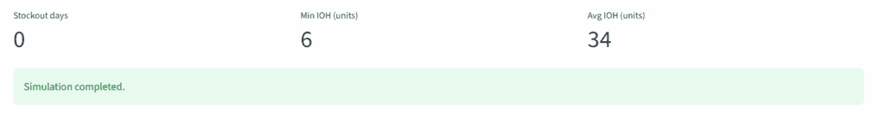

指标卡和成功信息 – (图片由 Samir Saci 提供)

这是我们需要的蛋糕上的樱桃，用于结束此应用。

您现在拥有了一个完整的应用，该应用可以自动生成可视化效果，并轻松测试场景，在您的机器上运行。

> 我们的物流总监怎么办？他如何使用它？

让我向您展示如何轻松地在 **Streamlit 社区云** 上免费部署它。

### 在 Streamlit 社区部署您的应用

您首先需要将您的代码推送到您的 GitHub，就像我这里所做的那样：[GitHub 仓库](https://github.com/samirsaci/inventory-streamlit-app/tree/main)。

然后您转到应用的右上角，并点击“部署”。

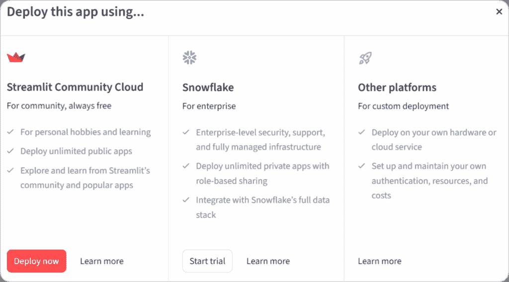(部署应用窗口 - 图片由 Samir Saci 提供)

部署应用窗口 – (图片由 Samir Saci 提供)

那么现在点击部署，并按照步骤提供对您的 GitHub 账户的访问权限（Streamlit 将自动检测您已将代码推送到 GitHub）。

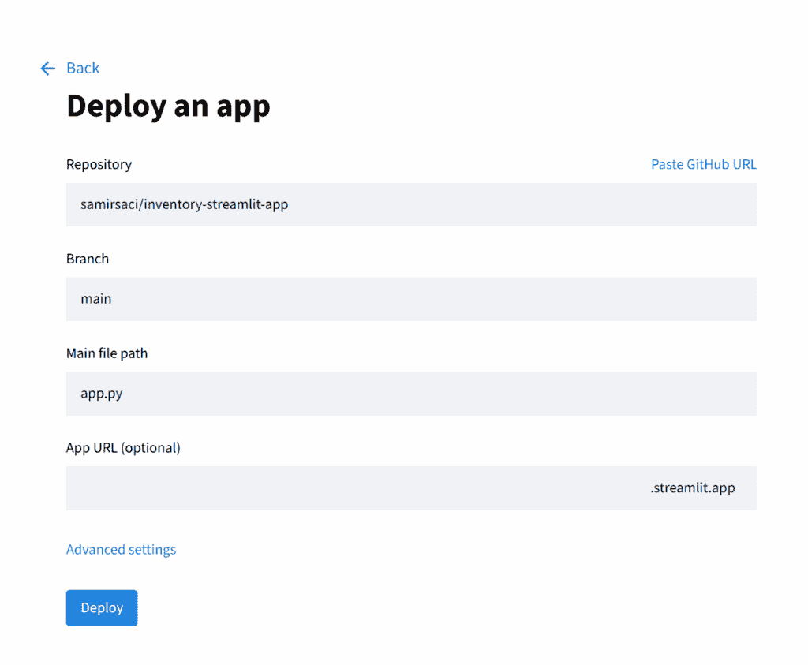

提供应用 URL – (图片由 Samir Saci 提供)

您可以创建一个自定义 URL：我的网址是 [supplyscience](https://supplyscience.streamlit.app)。

点击部署后，Streamlit 将将您重定向到您的已部署应用！

恭喜您，您已成功部署了您的第一个供应链分析 Streamlit 应用！

> 有任何问题？请随意 [查看完整教程](https://www.youtube.com/watch?v=FC8nULkvHcQ)。

欢迎使用评论来提问或分享您在 Streamlit 上部署的内容。

## 结论

我为 2018 年的我设计了这篇教程。

那时候，我足够了解 Python 和分析，可以为我的同事构建优化和模拟工具，但我还不知道如何将它们转化为真实的产品。

本教程是您迈向工业级分析解决方案的第一步。

您在这里构建的可能是非生产就绪的，但它是一个功能性的应用，您可以与我们的物流总监分享。

> 您需要其他应用的灵感吗？

### 如何完成此应用？

现在您有了部署供应链分析应用的剧本，您可能想通过添加更多模型来改进应用。

我有一些建议给您。

您可以按照这个逐步教程来实现 [使用帕累托分析和 ABC 图进行产品细分](https://youtu.be/Qglr9Yqa44I)。

您将学习如何部署像 ABC XYZ 这样的战略可视化，帮助零售公司管理他们的库存。

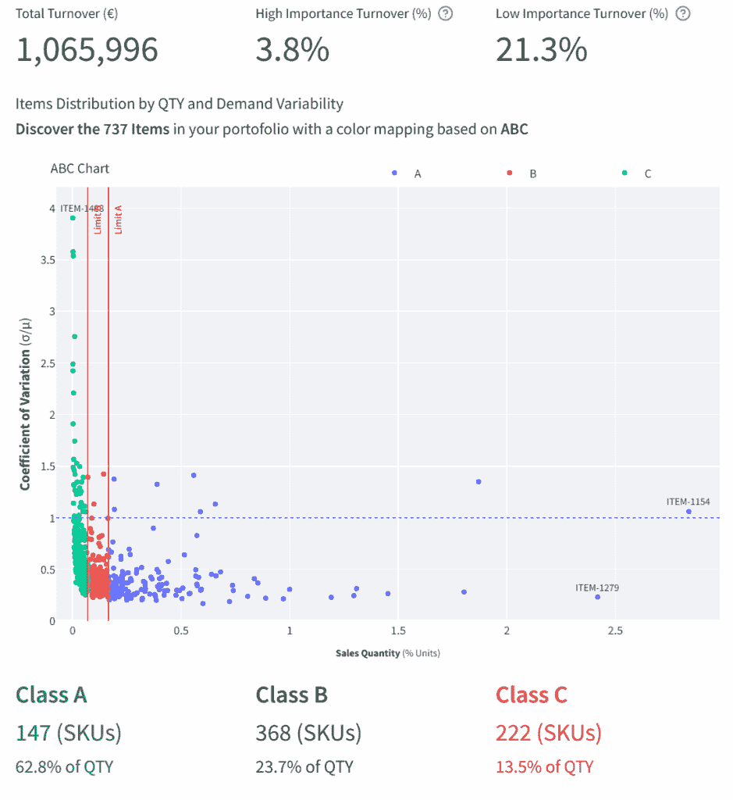

带有需求可变性分析的 ABC 图 – (图片由 Samir Saci 提供)

这可以轻松地实现您刚刚部署的应用的第二页。

如果需要，我可以撰写另一篇文章，专注于这个解决方案！

> 对库存管理感到厌倦了吗？

你可以在这份速查表中找到 80 多个 AI 与分析产品案例研究，这些研究支持供应链优化、业务盈利能力和流程自动化。[点击此处查看详情](https://bit.ly/supply-chain-cheat)。


[供应链分析速查表](https://bit.ly/supply-chain-cheat) – (图片由 Samir Saci 提供)

对于大多数在《数据科学向导》上发表的案例研究，你可以在 Streamlit 应用中找到可实现的源代码。

## 关于我

在[LinkedIn](https://www.linkedin.com/in/samir-saci/)和[Twitter](https://twitter.com/Samir_Saci_)上与我建立联系。我是一名使用数据分析来改善物流运营和降低成本的供应链工程师。

如需咨询或关于分析和可持续供应链转型的建议，请通过[Logigreen Consulting](https://www.logi-green.com/)联系我。

如果你对数据分析与供应链感兴趣，请查看我的网站。

[**Samir Saci | 数据科学 & 效率**](https://samirsaci.com/)
