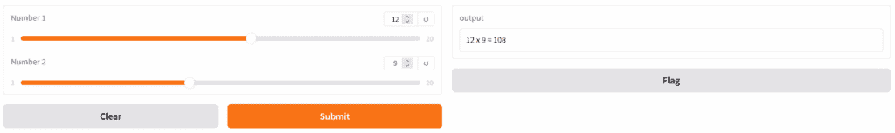
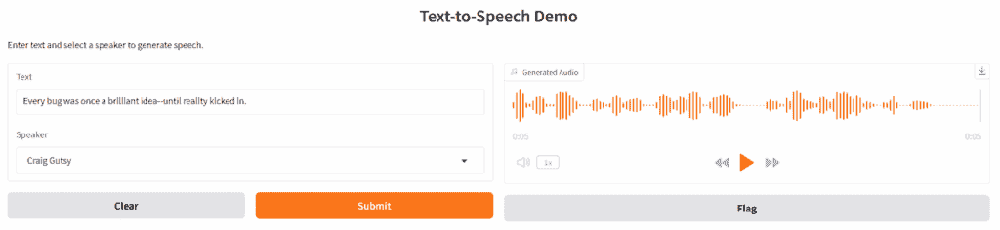
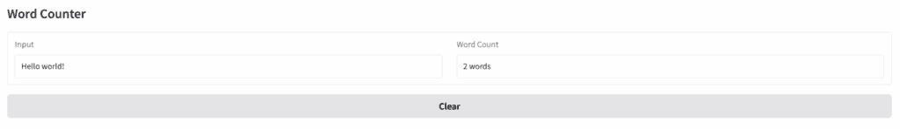
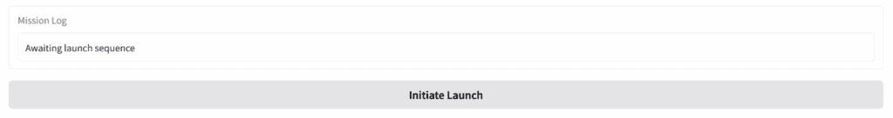

# 使用 Gradio 构建交互式机器学习应用

> 原文：[`towardsdatascience.com/build-interactive-machine-learning-apps-with-gradio/`](https://towardsdatascience.com/build-interactive-machine-learning-apps-with-gradio/)

作为与机器学习模型一起工作的开发者，你可能花费数小时编写脚本和调整超参数。但当涉及到分享你的工作或让其他人与你交互模型时，Python 脚本和可用 Web 应用之间的差距可能感觉巨大。[**Gradio**](https://www.gradio.app/)是一个开源 Python 库，它允许你将 Python 脚本转换为交互式 Web 应用，而无需前端专业知识。

在这篇博客中，我们将通过构建一个可以在[**AI PC**](https://www.intel.com/content/www/us/en/ai-pc/overview.html)或[**Intel® Tiber™ AI Cloud**](https://ai.cloud.intel.com/)上运行并与他人分享的**文本到语音**（TTS）Web 应用来有趣地、动手地学习 Gradio 的关键组件。（完全披露：作者与 Intel 有合作关系。）

## 我们项目的概述：一个 TTS Python 脚本

我们将开发一个基本的 Python 脚本，利用 Coqui TTS 库及其`xtts_v2`多语言模型。要继续这个项目，创建一个包含以下内容的`requirements.txt`文件：

```py
gradio
coqui-tts
torch
```

然后创建一个虚拟环境并使用以下命令安装这些库：

```py
pip install -r requirements.txt
```

或者，如果你正在使用 Intel Tiber AI Cloud，或者你的系统上已安装了[uv 包管理器](https://docs.astral.sh/uv/)，创建一个虚拟环境并使用以下命令安装库：

```py
uv init --bare
uv add -r requirements.txt
```

然后，你可以使用以下命令运行脚本：

```py
uv run <filename.py>
```

**注意**：为了与最近的依赖版本兼容，我们正在使用`[coqui-tts](https://pypi.org/project/coqui-tts/)`，它是原始 Coqui `[TTS](https://pypi.org/project/TTS/)`的分支。因此，不要尝试使用`pip install TTS`安装原始包。

接下来，我们可以为我们的脚本进行必要的导入：

```py
import torch
from TTS.api import TTS
```

目前，`TTS`为你提供了 94 个模型，你可以通过运行以下命令来列出：

```py
print(TTS().list_models())
```

对于这篇博客，我们将使用`XTTS-v2`模型，它支持 17 种语言和 58 种说话者声音。你可以通过以下方式加载模型并查看说话者：

```py
tts = TTS("tts_models/multilingual/multi-dataset/xtts_v2")

print(tts.speakers)
```

这里是一个生成语音并<mdspan datatext="el1751920506374" class="mdspan-comment">[保存到文件](https://contributor.insightmediagroup.io/wp-content/uploads/2025/07/bug.wav)</mdspan>的最小 Python 脚本：

```py
import torch
from TTS.api import TTS

tts = TTS("tts_models/multilingual/multi-dataset/xtts_v2")

tts.tts_to_file(
    text="Every bug was once a brilliant idea--until reality kicked in.",
    speaker="Craig Gutsy",
    language="en",
    file_path="bug.wav",
)
```

这个脚本可以工作，但它不是交互式的。如果你想让用户输入自己的文本，选择一个说话者，并立即获得音频输出呢？这正是 Gradio 的亮点所在。

## Gradio 应用的解剖结构

一个典型的 Gradio 应用由以下组件组成：

+   **接口**用于定义输入和输出

+   **组件**如`Textbox`、`Dropdown`和`Audio`

+   **函数**用于链接后端逻辑

+   **.launch()**启动应用，并可选择使用`share=True`选项共享应用。

`**Interface**` 类有三个核心参数：**fn**、**inputs** 和 **outputs**。将 `fn` 参数分配（或设置）为任何您想要用用户界面（UI）包装的 Python 函数。输入和输出接受一个或多个 Gradio 组件。您可以将这些组件的名称作为字符串传入，例如 `"textbox"` 或 `"text"`，或者为了更高的可定制性，传入一个类实例，如 `[Textbox()](https://www.gradio.app/main/docs/gradio/textbox)`。

```py
import gradio as gr

# A simple Gradio app that multiplies two numbers using sliders
def multiply(x, y):
    return f"{x} x {y} = {x * y}"

demo = gr.Interface(
    fn=multiply,
    inputs=[
        gr.Slider(1, 20, step=1, label="Number 1"),
        gr.Slider(1, 20, step=1, label="Number 2"),
    ],
    outputs="textbox",  # Or outputs=gr.Textbox()
)

demo.launch()
```



图片由作者提供

默认情况下，`**Flag**` 按钮出现在 Interface 中，以便用户可以标记任何“有趣”的组合。在我们的示例中，如果我们按下标记按钮，Gradio 将在 `.gradio\flagged` 下生成一个包含以下内容的 CSV 日志文件：

```py
Number 1,Number 2,output,timestamp

12,9,12 x 9 = 108,2025-06-02 00:47:33.864511
```

您可以通过在 Interface 中设置 `flagging_mode="never"` 来关闭此标记选项。

还请注意，我们可以通过在 Interface 中设置 `live=True` 来移除提交按钮并自动触发 `multiply` 函数。

## 将我们的 TTS 脚本转换为 Gradio 应用

如所示，Gradio 的核心概念很简单：您可以使用 `Interface` 类将您的 Python 函数包装在一个 UI 中。以下是您如何将 TTS 脚本转换为 Web 应用的方法：

```py
import gradio as gr
from TTS.api import TTS

tts = TTS("tts_models/multilingual/multi-dataset/xtts_v2")

def tts_fn(text, speaker):
    wav_path = "output.wav"
    tts.tts_to_file(text=text, speaker=speaker, language="en", file_path=wav_path)
    return wav_path

demo = gr.Interface(
    fn=tts_fn,
    inputs=[
        gr.Textbox(label="Text"),
        gr.Dropdown(choices=tts.speakers, label="Speaker"),
    ],
    outputs=gr.Audio(label="Generated Audio"),
    title="Text-to-Speech Demo",
    description="Enter text and select a speaker to generate speech.",
)
demo.launch()
```



图片由作者提供

<https://contributor.insightmediagroup.io/wp-content/uploads/2025/07/bug.wav?_=1>

[`contributor.insightmediagroup.io/wp-content/uploads/2025/07/bug.wav`](https://contributor.insightmediagroup.io/wp-content/uploads/2025/07/bug.wav)

只需几行代码，您就可以拥有一个 Web 应用，用户可以在其中输入文本、选择说话者并收听生成的音频——所有操作都在本地进行。分享此应用只需将最后一行替换为 `demo.launch(share=True)`，这会立即为您提供公共 URL。对于生产或持久托管，您可以在 [Hugging Face Spaces](https://huggingface.co/spaces) 上免费部署 Gradio 应用，或者在自己的服务器上运行它们。

## 除此之外：为高级用户提供的块

虽然 Interface 适用于大多数用例，但 Gradio 还提供了 `[**Blocks**](https://www.gradio.app/main/docs/gradio/blocks)`，这是一个更底层的 API，用于构建具有自定义布局、多个函数和动态交互的复杂、多步骤应用。使用 Blocks，您可以：

+   以行、列或选项卡的形式排列组件

+   将输出作为其他函数的输入链式连接

+   动态更新组件属性（例如，隐藏/显示、启用/禁用）

+   构建仪表板、多模态应用或甚至全功能的 Web UI

这只是一个简单的应用的示例，该应用在用户完成输入后立即计算单词数量，并允许用户通过单个按钮清除输入和输出。示例展示了如何使用 `[**Row**](https://www.gradio.app/main/docs/gradio/row)` 控制应用的布局，并展示了两个关键事件类型：`.change()` 和 `.click()`。

```py
import gradio as gr

def word_count(text):
    return f"{len(text.split())} word(s)" if text.strip() else ""

def clear_text():
    return "", ""

with gr.Blocks() as demo:
    gr.Markdown("## Word Counter")

    with gr.Row():
        input_box = gr.Textbox(placeholder="Type something...", label="Input")
        count_box = gr.Textbox(label="Word Count", interactive=False)

    with gr.Row():
        clear_btn = gr.Button("Clear")

    input_box.change(fn=word_count, inputs=input_box, outputs=count_box)
    clear_btn.click(
        fn=clear_text, outputs=[input_box, count_box]
    )  # No inputs needed for clear_text

demo.launch()
```



图片由作者提供

如果你对此类组件的类型感到好奇，可以尝试

```py
print(type(input_box))  # <class 'gradio.components.textbox.Textbox'>
```

注意，在运行时，你不能像变量一样直接“读取”`Textbox`的值。Gradio 组件不是与 Python 变量实时绑定——它们只是定义 UI 和行为。`Textbox`的实际值存在于客户端（浏览器中），并且只有在用户交互发生时（如`.click()`或`.change()`）才会传递到你的 Python 函数中。如果你正在探索高级流程（如维护或同步状态），Gradio 的[**状态**](https://www.gradio.app/guides/state-in-blocks)可能会有所帮助。

## 更新 Gradio 组件

在更新组件方面，Gradio 给你提供了一些灵活性。考虑以下两个代码片段——尽管它们看起来有些不同，但它们做的是同一件事：在按钮点击时更新`Textbox`内的文本。

**选项 1：直接返回新值**

```py
import gradio as gr

def update_text():
    return "Text successfully launched!"

with gr.Blocks() as demo:
    textbox = gr.Textbox(value="Awaiting launch sequence", label="Mission Log")
    button = gr.Button("Initiate Launch")

    button.click(fn=update_text, inputs=[], outputs=textbox)

demo.launch()
```

**选项 2：使用 `gr.update()`**

```py
import gradio as gr

def update_text():
    return gr.update(value="Text successfully launched!")

with gr.Blocks() as demo:
    textbox = gr.Textbox(value="Awaiting launch sequence", label="Mission Log")
    button = gr.Button("Initiate Launch")

    button.click(fn=update_text, inputs=[], outputs=textbox)

demo.launch()
```



图片由作者提供

那么，你应该使用哪一个呢？如果你只是更新组件的`value`，返回一个纯字符串（或数字，或组件期望的任何内容）是完全可以的。然而，如果你想更新其他属性——比如隐藏组件、更改其标签或禁用它——那么`gr.update()`就是你的选择。

理解 `gr.update()` 返回的对象类型也有帮助，以消除一些围绕它的神秘感。例如，在底层，`gr.update(visible=False)` 只是一个字典：

```py
{'__type__': 'update', 'visible': False}
```

这只是一个小的细节，但知道何时以及如何使用 `gr.update()` 可以让你的 Gradio 应用程序更加动态和响应。

如果你觉得这篇文章很有价值，请考虑与你的网络分享。有关更多 AI 开发教程内容，请访问 [Intel® AI 开发资源](https://www.intel.com/content/www/us/en/developer/topic-technology/artificial-intelligence/overview.html)。

请务必查看 [Hugging Face Spaces](https://huggingface.co/spaces)，那里有各种各样的机器学习应用，你可以通过查看他人的代码来学习，并与社区分享你的工作。

***致谢***

*作者感谢杰克·埃里克森对这篇文章早期草稿的反馈。*

**资源**

+   [Gradio 快速入门](https://www.gradio.app/guides/quickstart)

+   [Coqui TTS GitHub 页面](https://github.com/idiap/coqui-ai-TTS)

+   [介绍 Intel® Tiber™ AI Cloud：创新之门](https://levelup.gitconnected.com/introducing-intel-tiber-ai-cloud-2d635f1babb9)

+   [Gradio-Lite：完全在浏览器中运行的 Serverless Gradio](https://www.gradio.app/guides/gradio-lite)
