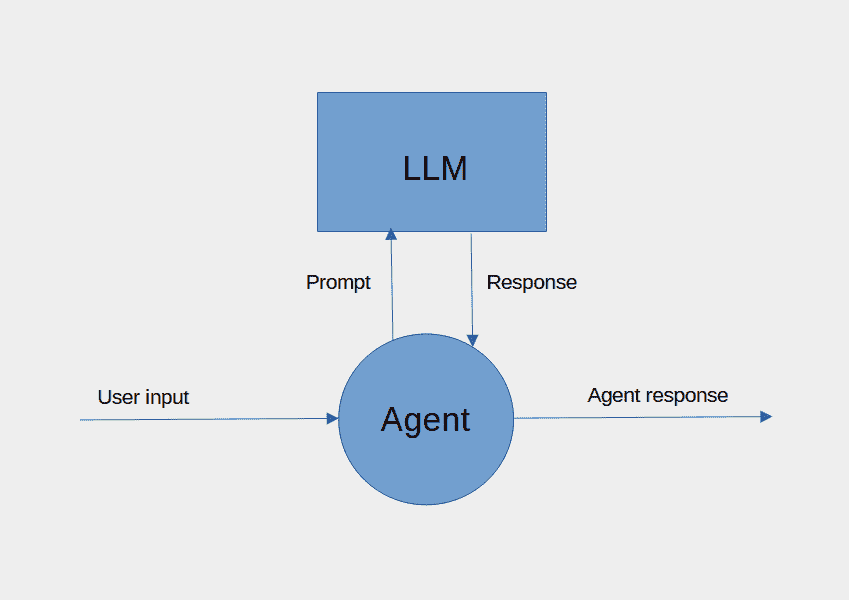
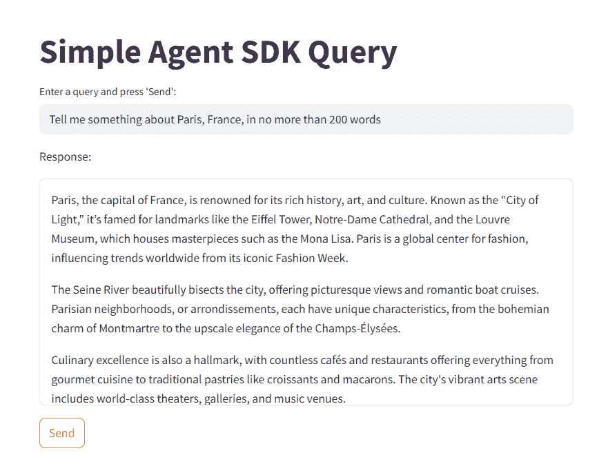
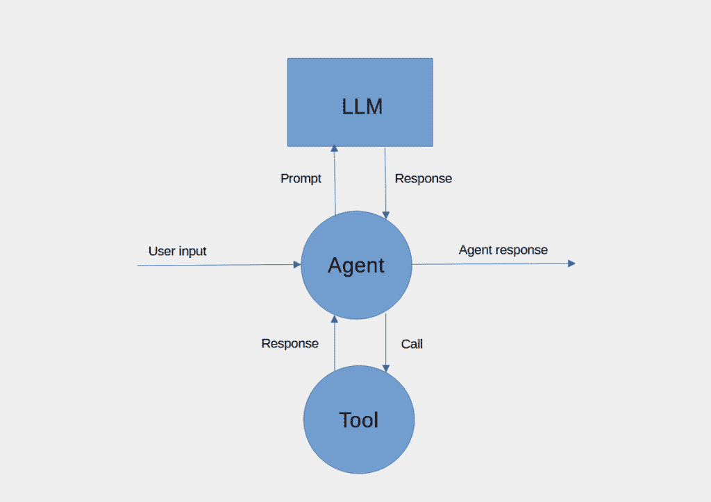
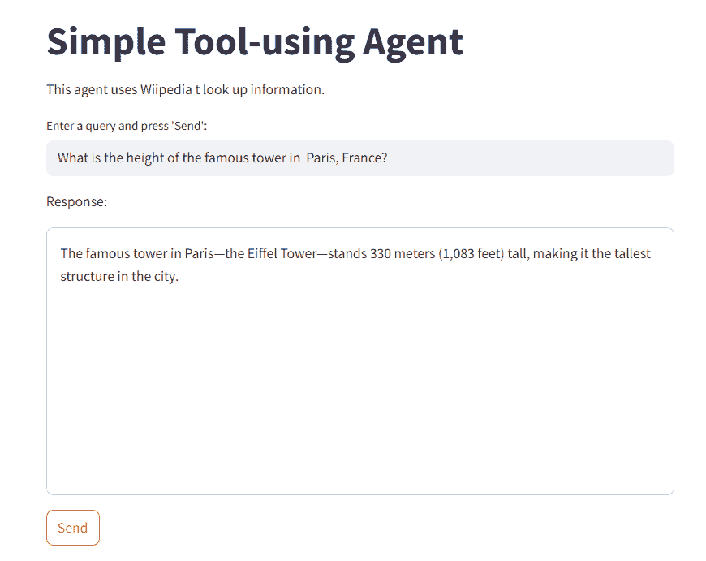
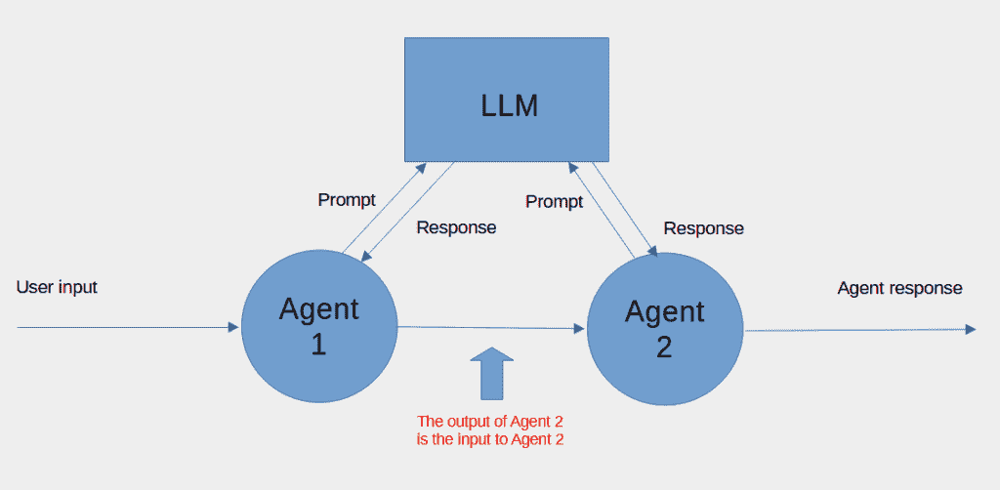
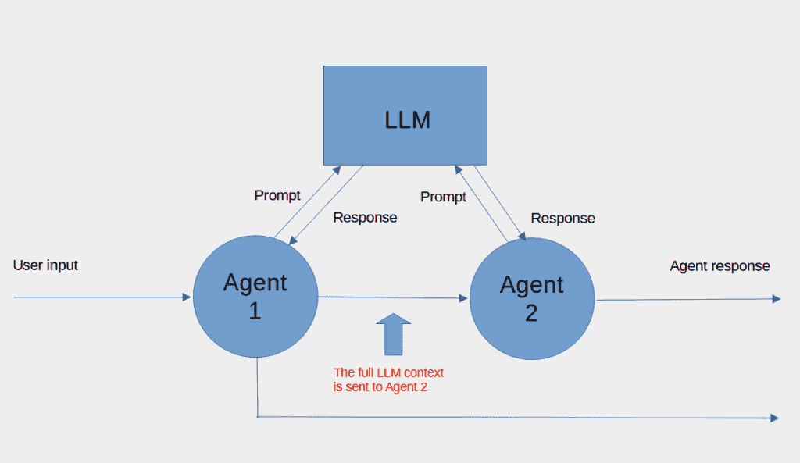
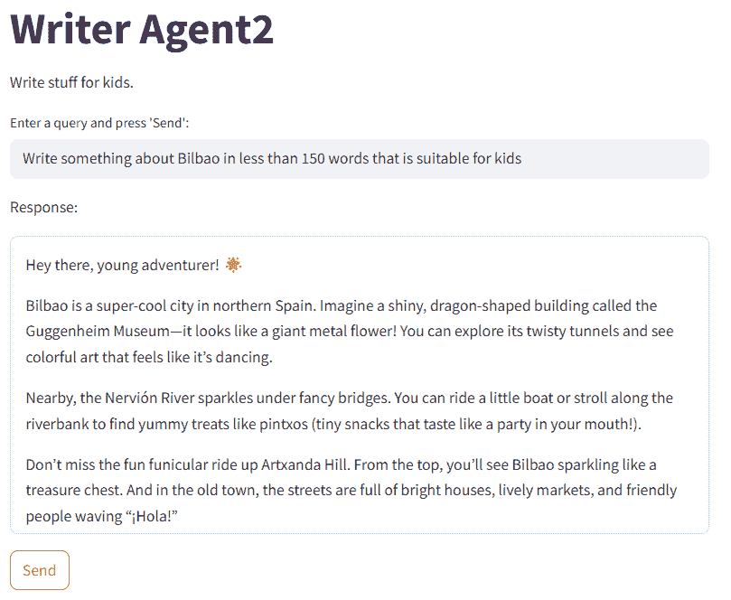
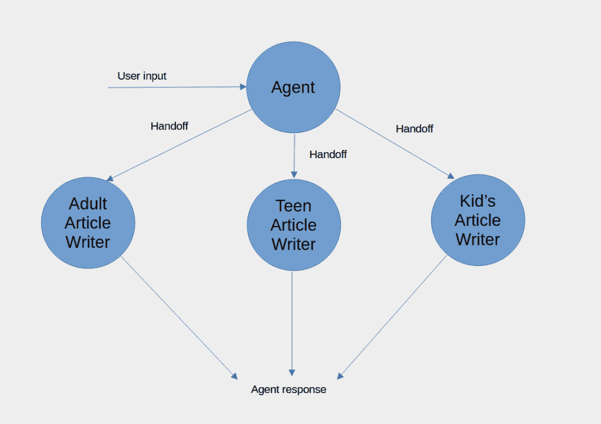
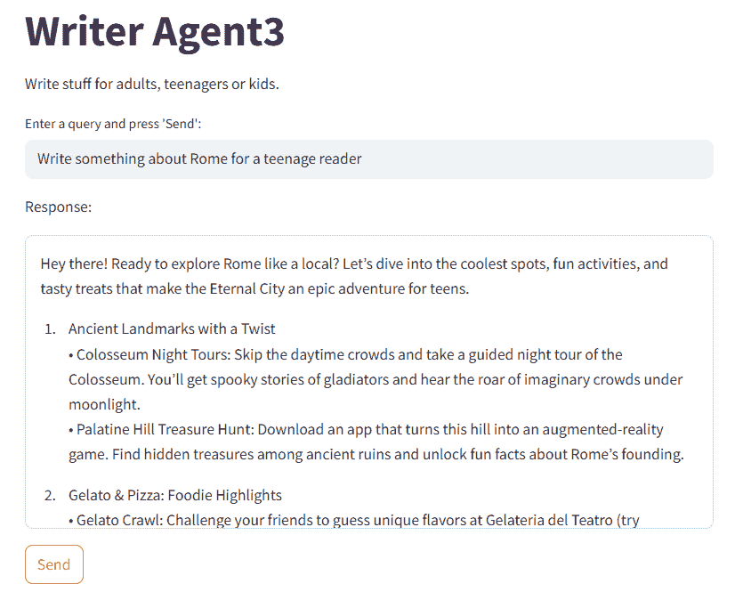
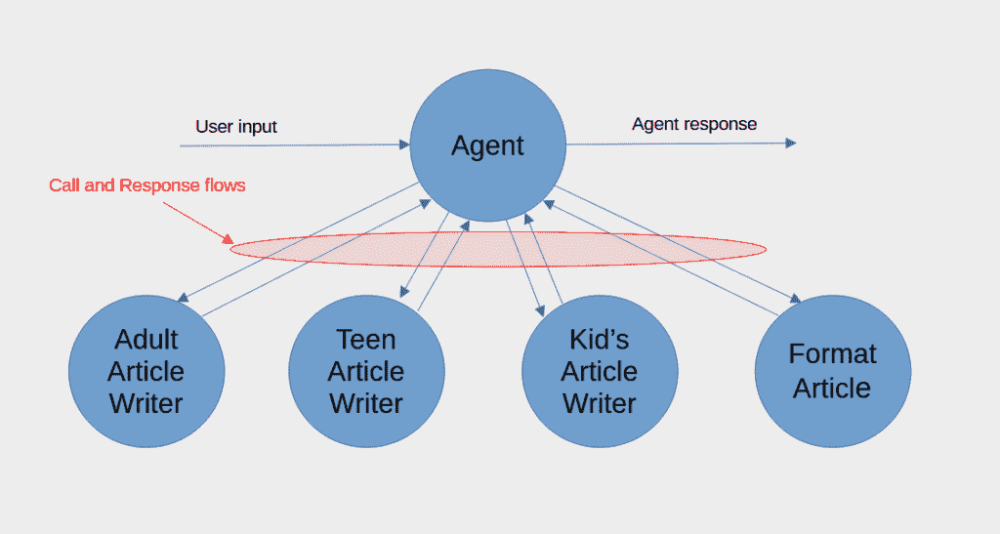

# 使用 OpenAI 的代理 SDK 构建多代理应用

> 原文：[`towardsdatascience.com/build-multi-agent-apps-with-openais-agent-sdk/`](https://towardsdatascience.com/build-multi-agent-apps-with-openais-agent-sdk/)

<mdspan datatext="el1750740264259" class="mdspan-comment">通过使用抽象层</mdspan>建立在基本简单思想之上的抽象层，一些代理框架开发者似乎认为复杂性是一种美德。

我倾向于遵循爱因斯坦的名言，“*一切都应该尽可能简单，但不能过于简单。*”所以，让我向你展示一个既容易使用又容易理解的框架。

OpenAI 对其他框架开发者的方法有耳目一新的不同之处：他们不试图变得聪明，而是试图变得清晰。

在这篇文章中，我将展示如何使用 OpenAI 的开源 SDK 构建多代理应用。

我们将看到如何构建一个简单的单代理应用，然后继续探索多代理配置。我们将涵盖工具调用、线性配置和分层配置、一个代理到另一个代理的转交，以及将代理作为工具使用。

具体来说，我们将看到以下示例：

+   对代理的简单调用

+   使用工具的代理

+   一个代理到另一个代理的转交

+   对多个代理的转交

+   使用代理作为工具

+   使用代理作为工具的分层代理编排

## 代理 SDK

代理 SDK 基于几个对代理和多代理系统至关重要的概念，并围绕它们构建了一个框架——它取代了[Swarm](https://github.com/openai/swarm)，这是 OpenAI 开发的一个教育框架，其中那些概念被识别并实现。Agent SDK 在 Swarm 的基础上构建并扩展了它，同时保持了其轻量级和简单的创始原则。

简单虽简单，但你可以用这个框架构建复杂的基于代理的系统，其中代理使用工具（可以是其他代理），可以将任务转交给其他代理，并且可以用多种巧妙的方式编排。

安装通过 pip 进行，或者使用你偏好的包管理工具，这个包叫做`openai-agents`。我偏好使用 UV，所以开始一个新项目时，我会做如下操作。

```py
uv init agentTest
cd agentTest
uv add openai-agents
```

## 对代理的简单调用

下面的图表展示了简单的代理调用。




一个简单的代理

这是一个数据流图，显示了运行中的代理作为一个进程，数据在其中流入和流出。启动进程的流程是用户提示；代理对 LLM 进行一次或多次调用并接收响应。当它完成任务后，它会输出代理响应。

下面我们看到了一个基本程序的代码，该程序使用 SDK 实现这个流程。它实例化了一个代理，给它起了一个名字和一些指令；然后运行它并打印结果。它与 OpenAI 文档中的第一个例子类似，但在这里我们将创建一个 Streamlit 应用。

首先，我们导入库。

```py
import streamlit as st
import asyncio from agents 
import Agent, Runner 
```

当然，我们需要 Streamlit 包和 `asyncio`，因为我们将会使用它的功能来等待智能体完成后再继续。接下来，我们从代理包中导入最小化内容，`Agent`（用于创建智能体）和 `Runner`（用于运行智能体）。

下面，我们定义创建和运行智能体的代码。

```py
agent = Agent(name="Assistant", instructions="You are a helpful assistant")

async def run_agent(input_string):
    result = await Runner.run(agent, input_string)
    return result.final_output 
```

此代码使用 OpenAI 的默认模型（并假设您已将有效的 API 密钥设置为环境变量——当然，您将被收费，但在这里，这不会花费太多。我只花了几个十分之一美分）。

首先，我们创建一个名为“Assistant”的智能体，并给它一些简单的指令，然后我们定义一个异步函数，该函数将使用用户提供的字符串（查询）来运行它。

`run` 函数是异步的；在继续之前，我们需要等待 LLM 完成操作，因此我们将使用 `asyncio` 来运行该函数。

我们使用 Streamlit 函数定义用户界面。

```py
st.title("Simple Agent SDK Query")

user_input = st.text_input("Enter a query and press 'Send':")

st.write("Response:")
response_container = st.container(height=300, border=True)

if st.button("Send"):
    response = asyncio.run(run_agent(user_input))
    with response_container:
        st.markdown(response)
```

这部分内容主要容易理解。用户会被提示输入一个查询并按下“发送”按钮。当按钮被按下时，`run_agent` 通过调用 `asyncio.run` 来运行。结果会在一个可滚动的容器中显示。下面是一个示例运行的截图。



您的结果可能会有所不同（LLMs 以不给出两次相同答案而闻名）。

要定义一个智能体，给它一个名称和一些指令。运行操作也很直接；传递智能体和一个查询。运行智能体会启动一个循环，直到得到最终答案才会结束。这个例子很简单，不需要多次运行循环，但调用工具的智能体可能需要经过几次迭代才能得到最终的答案。

结果很容易显示。正如我们所看到的，这是从 `Runner` 返回的值的 `final_output` 属性。

该程序为几个可能手动设置的参数使用默认值，例如 LLM 的模型名称和温度设置。代理 SDK 也默认使用 *响应 API*。这是一个仅限 OpenAI 的 API（至少到目前为止），因此如果您需要使用 SDK 与其他 LLM 一起使用，您必须切换到更广泛支持的聊天完成 API。

```py
from agents import set_default_openai_api
set_default_openai_api("chat_completions")
```

初始时，为了简单起见，我们将使用默认的响应 API。

## 使用工具的智能体

智能体可以使用工具，并且智能体与 LLM 一起决定需要使用哪些工具（如果需要的话）。

这里是一个显示使用工具的智能体的数据流图。



使用工具的智能体

它与简单的代理类似，但我们可以看到一个额外的过程，即代理利用的工具。当代理调用 LLM 时，响应将指示是否需要使用工具。如果需要，代理将进行该调用并将结果提交回 LLM。同样，LLM 的响应将指示是否需要另一个工具调用。代理将继续这个循环，直到 LLM 不再需要来自工具的输入。此时，代理可以响应用户。

下面是使用单个工具的单个代理的代码。

该程序由四个部分组成：

+   从`Agents`库和`wikipedia`（将用作工具）导入。

+   工具的定义——这只是一个带有`@function_tool`装饰器的函数。

+   定义使用工具的代理。

+   在 Streamlit 应用中运行代理并打印结果，与之前相同。

```py
import streamlit as st
import asyncio
from agents import Agent, Runner, function_tool
import wikipedia

@function_tool
def wikipedia_lookup(q: str) -> str:
    """Look up a query in Wikipedia and return the result"""
    return wikipedia.page(q).summary

research_agent = Agent(
    name="Research agent",
    instructions="""You research topics using Wikipedia and report on 
                    the results. """,
    model="o4-mini",
    tools=[wikipedia_lookup],
)

async def run_agent(input_string):
    result = await Runner.run(research_agent, input_string)
    return result.final_output

# Streamlit UI

st.title("Simple Tool-using Agent")
st.write("This agent uses Wikipedia to look up information.")

user_input = st.text_input("Enter a query and press 'Send':")

st.write("Response:")
response_container = st.container(height=300, border=True)

if st.button("Send"):
    response = asyncio.run(run_agent(user_input))
    with response_container:
        st.markdown(response)
```

工具查找维基百科页面，并通过标准库函数调用返回摘要。请注意，我们已经使用了类型提示和*docstring*来描述函数，以便代理可以弄清楚如何使用它。

接下来是代理的定义，我们可以看到比之前更多的参数：我们指定我们想要使用的模型和工具列表（在这个列表中只有一个）。

运行并打印结果与之前相同，并且它尽职尽责地返回一个答案（埃菲尔铁塔的高度）。



这是一个简单的使用工具的代理的测试，它只需要一次查找。更复杂的查询可能需要多次使用工具来收集信息。

例如，我问道：“*找出巴黎著名塔的名字，找出它的高度，然后找出其创造者的出生日期*”。这需要两次工具调用，一次获取关于埃菲尔铁塔的信息，第二次找出古斯塔夫·埃菲尔出生的时间。

这个过程不会反映在最终输出中，但我们可以通过查看代理结果的原始消息来看到代理经历的阶段。我为上面的查询打印了`result.raw_messages`，结果如下所示。

```py
[
0:"ModelResponse(output=[ResponseReasoningItem(id='rs_6849968a438081a2b2fda44aa5bc775e073e3026529570c1', summary=[], type='reasoning', status=None), 
ResponseFunctionToolCall(arguments='{"q":"Eiffel Tower"}', call_id='call_w1iL6fHcVqbPFE1kAuCGPFok', name='wikipedia_lookup', type='function_call', id='fc_6849968c0c4481a29a1b6c0ad80fba54073e3026529570c1', status='completed')], usage=Usage(requests=1, input_tokens=111, output_tokens=214, total_tokens=325), 
response_id='resp_68499689c60881a2af6411d137c13d82073e3026529570c1')"

1:"ModelResponse(output=[ResponseReasoningItem(id='rs_6849968e00ec81a280bf53dcd30842b1073e3026529570c1', summary=[], type='reasoning', status=None), 
ResponseFunctionToolCall(arguments='{"q":"Gustave Eiffel"}', call_id='call_DfYTuEjjBMulsRNeCZaqvV8w', name='wikipedia_lookup', type='function_call', id='fc_6849968e74ac81a298dc17d8be4012a7073e3026529570c1', status='completed')], usage=Usage(requests=1, input_tokens=940, output_tokens=23, total_tokens=963), 
response_id='resp_6849968d7c3081a2acd7b837cfee5672073e3026529570c1')"

2:"ModelResponse(output=[ResponseReasoningItem(id='rs_68499690e33c81a2b0bda68a99380840073e3026529570c1', summary=[], type='reasoning', status=None), 
ResponseOutputMessage(id='msg_6849969221a081a28ede4c52ea34aa54073e3026529570c1', content=[ResponseOutputText(annotations=[], text='The famous tower in Paris is the Eiffel Tower.  \n• Height: 330 metres (1,083 ft) tall  \n• Creator: Alexandre Gustave Eiffel, born 15 December 1832', type='output_text')], role='assistant', status='completed', type='message')], usage=Usage(requests=1, input_tokens=1190, output_tokens=178, total_tokens=1368), 
response_id='resp_6849968ff15481a292939a6eed683216073e3026529570c1')"
]
```

您可以看到有三个响应：前两个是两次工具调用的结果，最后一个是最终输出，它是从工具调用中获得的信息生成的。

当我们使用代理作为工具时，我们很快将再次看到工具，但现在我们将考虑如何使用多个协作的代理。

## 多个代理

许多代理应用只需要一个代理，这些已经远远超出了你在 LLM 聊天界面中找到的简单聊天补全，例如 ChatGPT。代理在循环中运行[Agents run in loops](https://medium.com/ai-advances/how-to-build-a-react-ai-agent-with-claude-3-5-and-python-95423f798640)，并且可以使用工具，使得单个代理也非常强大。然而，多个代理协同工作可以实现更复杂的行为。

与其简单的哲学一致，OpenAI 不试图整合代理编排抽象，如某些其他框架。但尽管设计简单，它支持构建简单和复杂的配置。

首先，我们将看看一个代理将控制权传递给另一个代理的移交。之后，我们将看到代理如何按层次结构组合。

## 移交

当一个代理决定它已经完成了其任务并将信息传递给另一个代理以进行进一步工作时，这被称为移交。

实现移交有两种基本方法：使用*代理性*移交，整个消息历史从第一个代理传递到第二个代理。这有点像当你打电话给银行，但第一个和你说话的人不知道你的具体情况，所以把你转接到知道的人那里。区别在于，在 AI 代理的情况下，新代理有记录所有对前一个代理所说的话。

第二种方法是*程序性*移交。这是指只将一个代理提供的信息传递给另一个代理（通过传统的编程方法）。

让我们先看看程序性移交。

### 程序性移交

有时新代理不需要知道整个交易的历史；可能只需要最终结果。在这种情况下，而不是完整的移交，你可以安排一个程序性移交，其中只将相关数据传递给第二个代理。



程序性移交

该图展示了两个代理之间通用的程序性移交。

下面是这个功能的一个示例，其中一个代理找到一个主题的信息，另一个代理则根据这些信息写一篇适合孩子的文章。

为了保持简单，我们在这个例子中不会使用我们的维基百科工具；相反，我们依赖于 LLM 的知识。

```py
import streamlit as st
import asyncio
from agents import Agent, Runner

writer_agent = Agent(
    name="Writer agent",
    instructions=f"""Re-write the article so that it is suitable for kids
                     aged around 8\. Be enthusiastic about the topic -
                     everything is an adventure!""",
    model="o4-mini",
)

researcher_agent = Agent(
    name="Research agent",
    instructions=f"""You research topics and report on the results.""",
    model="o4-mini",
)

async def run_agent(input_string):
    result = await Runner.run(researcher_agent, input_string)
    result2 = await Runner.run(writer_agent, result.final_output)
    return result2

# Streamlit UI

st.title("Writer Agent")
st.write("Write stuff for kids.")

user_input = st.text_input("Enter a query and press 'Send':")

st.write("Response:")
response_container = st.container(height=300, border=True)

if st.button("Send"):
    response = asyncio.run(run_agent(user_input))
    with response_container:
        st.markdown(response.final_output)
    st.write(response)
    st.json(response.raw_responses)
```

在上面的代码中，我们定义了两个代理：一个研究一个主题，另一个产生适合孩子的文本。

这种技术不依赖于任何特殊的 SDK 函数；它只是运行一个代理，获取`result`中的输出，并将其用作下一个代理的输入（输出在`result2`中）。这就像在传统编程中使用一个函数的输出作为下一个函数的输入一样。实际上，这正是它的本质。

### 代理移交

然而，有时一个代理需要知道之前发生的历史。这就是 OpenAI 代理移交的作用所在。

下面是表示代理移交的数据流图。您会看到它与程序性移交非常相似；区别在于传递给第二个代理的数据，以及，当移交不是必需时，第一个代理可能有一个可能的输出。



代理性移交

代码也与之前的示例相似。我稍微调整了指令，但主要区别是`researcher_agent`中的`handoffs`列表。这与我们声明工具的方式并不相似。

研究代理在完成其工作后允许将任务转交给儿童作家代理。这种效果是，儿童作家代理不仅接管了处理控制，而且还了解研究代理所做的工作以及原始提示。

然而，还有一个主要区别。代理需要决定是否进行转交。在下面的示例运行中，我指示代理为儿童编写一些合适的文本，因此它将任务转交给儿童作家代理。如果我没有指示它这样做，它将简单地返回原始文本。

```py
import streamlit as st
import asyncio
from agents import Agent, Runner

kids_writer_agent = Agent(
    name="Kids Writer Agent",
    instructions=f"""Re-write the article so that it is suitable for kids aged around 8\. 
                     Be enthusiastic about the topic - everything is an adventure!""",
    model="o4-mini",
)

researcher_agent = Agent(
    name="Research agent",
    instructions=f"""Answer the query and report the results.""",
    model="o4-mini",
    handoffs = [kids_writer_agent]
)

async def run_agent(input_string):
    result = await Runner.run(researcher_agent, input_string)
    return result

# Streamlit UI

st.title("Writer Agent2")
st.write("Write stuff for kids.")

user_input = st.text_input("Enter a query and press 'Send':")

st.write("Response:")
response_container = st.container(height=300, border=True)

if st.button("Send"):
    response = asyncio.run(run_agent(user_input))
    with response_container:
        st.markdown(response.final_output)
    st.write(response)
    st.json(response.raw_responses)
```

这不在截图里，但我添加了代码来输出`response`和`raw_responses`，这样您就可以在运行代码时看到转交操作。

下面是这个代理的截图。



代理可以拥有一系列可供使用的转交列表，并且它将智能地选择正确的代理（或无）进行转交。您可以看到这在客户服务场景中是多么有用，在客户服务场景中，可能需要通过一系列更专业的代理来升级困难的客户查询，每个代理都需要了解查询历史。

我们现在将探讨如何使用涉及多个代理的转交。

## 向多个代理转交

现在，我们将看到之前程序的新版本，其中研究代理根据读者的年龄选择将任务转交给不同的代理。

代理的职责是为三个受众群体生成文本：成年人、青少年和儿童。研究代理将收集信息，然后将其转交给其他三个代理之一。以下是数据流（请注意，为了清晰起见，我已排除与 LLM 的链接——每个代理都与 LLM 进行通信，但我们可以将其视为代理的内部功能）。



多代理转交

这里是代码。

```py
import streamlit as st
import asyncio

from agents import Agent, Runner, handoff

adult_writer_agent = Agent(
    name="Adult Writer Agent",
    instructions=f"""Write the article based on the information given that it is suitable for adults interested in culture.
                    """, 
    model="o4-mini",
)

teen_writer_agent = Agent(
    name="Teen Writer Agent",
    instructions=f"""Write the article based on the information given that it is suitable for teenagers who want to have a cool time.
                    """, 
    model="o4-mini",
)

kid_writer_agent = Agent(
    name="Kid Writer Agent",
    instructions=f"""Write the article based on the information given that it is suitable for kids of around 8 years old. 
                    Be enthusiastic!
                    """, 
    model="o4-mini",
)

researcher_agent = Agent(
    name="Research agent",
    instructions=f"""Find information on the topic(s) given.""",

    model="o4-mini",
    handoffs = [kid_writer_agent, teen_writer_agent, adult_writer_agent]
)

async def run_agent(input_string):
    result = await Runner.run(researcher_agent, input_string)
    return result

# Streamlit UI

st.title("Writer Agent3")
st.write("Write stuff for adults, teenagers or kids.")

user_input = st.text_input("Enter a query and press 'Send':")

st.write("Response:")
response_container = st.container(height=300, border=True)

if st.button("Send"):
    response = asyncio.run(run_agent(user_input))
    with response_container:
        st.markdown(response.final_output)
    st.write(response)
    st.json(response.raw_responses)
```

程序的结构相似，但现在我们有一组要转交的代理和它们在研究代理中的列表。各个代理中的指令是自我解释的，程序将正确响应如“为儿童写一篇关于法国巴黎的论文”或“为青少年”或“为成年人”之类的提示。研究代理将正确选择适合任务的作家代理。

下面的截图显示了为青少年写作的示例。



本例中提供的提示很简单。更复杂的提示可能会产生更好、更一致的结果，但这里的目的是展示技术，而不是构建一个聪明的应用程序。

这是一种合作方式；另一种是使用其他代理作为工具。这与我们之前看到的程序性移交并不太相似。

## 代理作为工具

运行代理就像调用一个函数一样调用工具。那么为什么不用代理作为智能工具呢？

我们不是将控制权交给新的代理，而是将其用作我们传递信息并从中获取信息的函数。

下面是一个数据流图，说明了这个想法。与移交不同，主要代理并没有将整体控制权交给另一个代理；相反，它明智地选择调用一个代理，就像调用一个工具一样。被调用的代理完成其工作后，将控制权交回调用代理。再次，为了清晰起见，省略了流向 LLM 的数据流。



下面是之前程序的修改版本截图。我们稍微改变了应用程序的本质。主要代理现在是一个旅行代理；它期望用户给它一个目的地以及它应该为哪个年龄段写作。UI 已更改，以便通过单选按钮选择年龄段。文本输入字段应该是目的地。


应用程序的逻辑已经进行了多项修改。UI 改变了信息输入的方式，这反映在提示的构建方式上——我们使用 f-string 将两份数据合并到提示中。

此外，我们现在还有一个额外的代理来格式化文本。其他代理类似（但请注意，提示已经改进），我们还使用结构化输出以确保输出的文本正是我们期望的。

然而，从根本上说，我们看到作者代理和格式化代理在研究代理中被指定为工具。

```py
import streamlit as st
import asyncio
from agents import Agent, Runner, function_tool
from pydantic import BaseModel

class PRArticle(BaseModel):
    article_text: str
    commentary: str

adult_writer_agent = Agent(
    name="Adult Writer Agent",
    instructions="""Write the article based on the information given that it is suitable for adults interested in culture. 
                    Be mature.""", 
    model="gpt-4o",
)

teen_writer_agent = Agent(
    name="Teen Writer Agent",
    instructions="""Write the article based on the information given that it is suitable for teenagers who want to have a good time. 
                    Be cool!""", 
    model="gpt-4o",
)

kid_writer_agent = Agent(
    name="Kid Writer Agent",
    instructions="""Write the article based on the information given that it is suitable for kids of around 8 years old. 
                    Be enthusiastic!""", 
    model="gpt-4o",
)

format_agent = Agent(
    name="Format Agent",
    instructions=f"""Edit the article to add a title and subtitles and ensure the text is formatted as Markdown. Return only the text of article.""", 
    model="gpt-4o",
)

researcher_agent = Agent(
    name="Research agent",
    instructions="""You are a Travel Agent who will find useful information for your customers of all ages.
                    Find information on the destination(s) given. 
                    When you have a result send it to the appropriate writer agent to produce a short PR text.
                    When you have the result send it to the Format agent for final processing.
                    """,
    model="gpt-4o",
    tools = [kid_writer_agent.as_tool(
                tool_name="kids_article_writer",
                tool_description="Write an essay for kids",), 
            teen_writer_agent.as_tool(
                tool_name="teen_article_writer",
                tool_description="Write an essay for teens",), 
            adult_writer_agent.as_tool(
                tool_name="adult_article_writer",
                tool_description="Write an essay for adults",),
            format_agent.as_tool(
                tool_name="format_article",
                tool_description="Add titles and subtitles and format as Markdown",
        ),],
    output_type = PRArticle
)

async def run_agent(input_string):
    result = await Runner.run(researcher_agent, input_string)
    return result

# Streamlit UI

st.title("Travel Agent")
st.write("The travel agent will write about destinations for different audiences.")

destination = st.text_input("Enter a destination, select the age group and press 'Send':")
age_group = st.radio(
    "What age group is the reader?",
    ["Adult", "Teenager", "Child"],
    horizontal=True,
)

st.write("Response:")
response_container = st.container(height=500, border=True)

if st.button("Send"):
    response = asyncio.run(run_agent(f"The destination is {destination} and reader the age group is {age_group}"))
    with response_container:
        st.markdown(response.final_output.article_text)
    st.write(response)
    st.json(response.raw_responses)
```

工具列表与之前看到的不同：

+   工具名称是代理名称加上`.agent_as_tool()`，这是一个使代理与其他工具兼容的方法。

+   工具需要几个参数——一个名称和一个描述。

另一个很有用的补充是使用*结构化输出*，如上所述。这使我们想要的文本与 LLM 可能想要插入的任何其他评论分开。如果你运行代码，你可以在`raw_responses`中看到 LLM 生成的附加信息。

使用结构化输出有助于产生一致的结果，并解决了我特别烦恼的一个问题。

我要求输出通过一个格式化代理来运行，该代理将结果格式化为 Markdown。这取决于 LLM，取决于提示，而且谁知道呢，也许还取决于一天中的时间或天气，但无论何时我认为我已经做对了，LLM 都会突然插入 Markdown 分隔符。所以，而不是一个干净的：

```py
## This is a header

This is some text
```

我反而得到：

```py
Here is your text formatted as Markdown:

''' Markdown  

# This is a header

This is some text  
'''
```

令人愤怒！

无论如何，答案似乎是要使用结构化输出。如果你要求它以你想要的文本格式化响应，加上一个名为“评论”或类似的东西的第二字段，它似乎会做正确的事情。任何 LLM 决定输出的额外内容都放在第二字段，而未经篡改的 Markdown 则放在文本字段中。

好吧，莎士比亚，这并不是：调整指令以使其更详细可能会得到更好的结果（当前的提示非常简单）。但它足以说明这种方法。

## 结论

这只是对 OpenAI 的代理 SDK 的表面了解。感谢阅读，希望你觉得它有用。我们看到了如何创建代理以及如何以不同的方式组合它们，我们还快速地看了一下结构化输出。

当然，这些例子很简单，但我希望它们说明了代理可以简单地编排，而不需要求助于复杂的抽象和难以驾驭的框架。

这里使用的代码采用了响应 API，因为这是默认设置。然而，它也应该与完成 API 以相同的方式运行。这意味着你不仅限于 ChatGPT，通过一些小技巧，这个 SDK 可以与任何支持 OpenAI 完成 API 的 LLM（大型语言模型）一起使用。

在[OpenAI 的文档](https://openai.github.io/openai-agents-python/)中还有很多东西可以探索。

* * *

+   *上述所有代码都可以在我的 GitHub 仓库中找到[这里](https://github.com/DataVizandAI/public_code/tree/main/openAI-Agent-SDK)。*

+   *除非另有说明，所有图像均为作者所有。*
