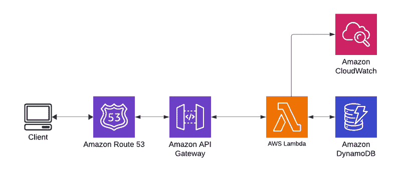
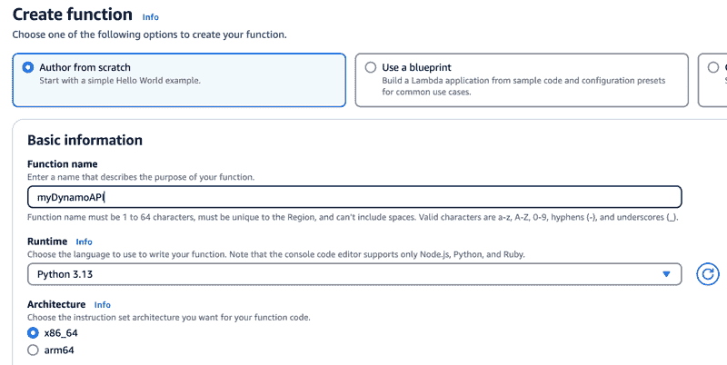
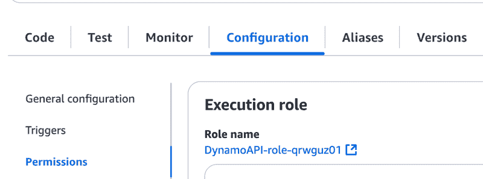
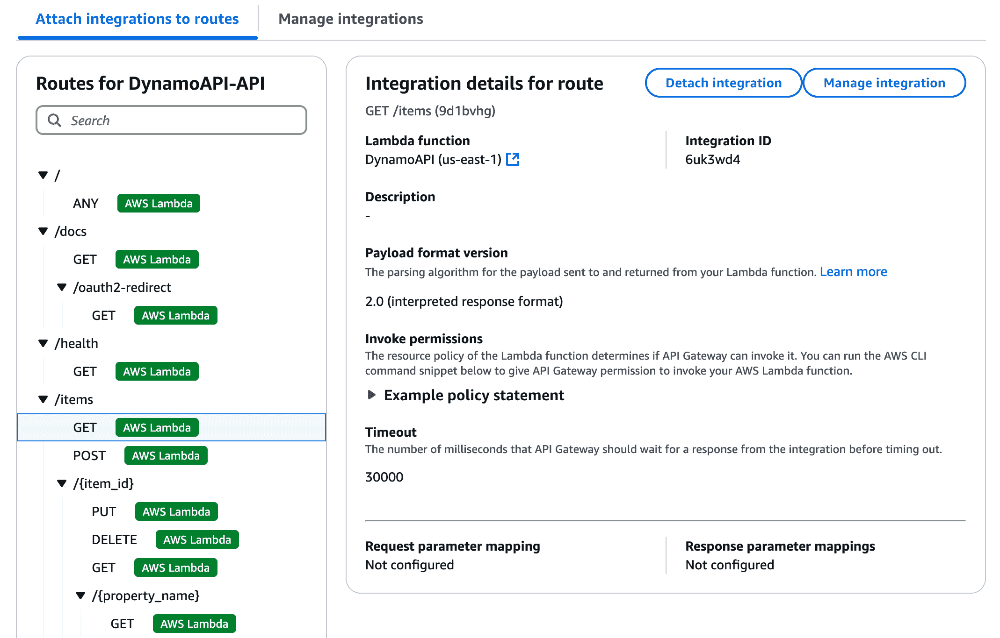
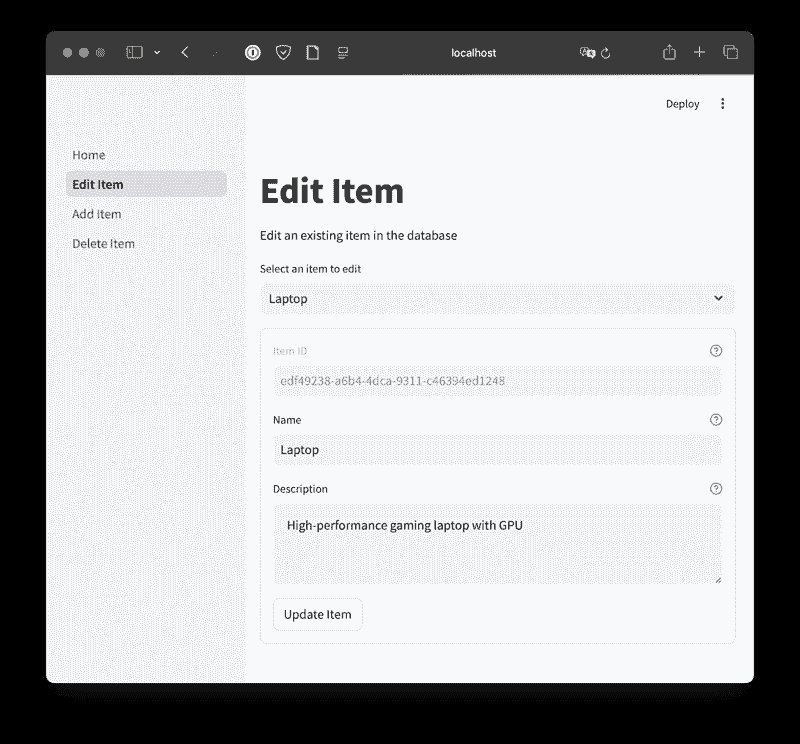

# 使用 Python 和 AWS 构建你的第一个 API

> 原文：[`towardsdatascience.com/build-your-first-api-with-python-and-aws-09f13bc7b62c/`](https://towardsdatascience.com/build-your-first-api-with-python-and-aws-09f13bc7b62c/)


图片由 [Lucas Campoi](https://unsplash.com/@campoilucas?utm_source=medium&utm_medium=referral) 在 [Unsplash](https://unsplash.com?utm_source=medium&utm_medium=referral) 提供

## 简介

今天，我们将在这篇文章中稍微偏离通常以 Snowflake 和数据仓库为中心的概念。我们将指导你创建自己的 API，该 API 位于存储在另一种数据库（DynamoDB）中的数据之上，然后构建一个小型网页前端来测试它。

你可能在日常工作中已经针对许多 API 进行了编码，但自己创建一个 API 是什么感觉呢？在这篇文章中，我们将向你展示如何创建一个 API，这样你就可以对云服务的工作方式有更多的了解，同时也希望能给你未来自己构建 API 提供灵感。

下图是我们今天要构建的内容的示意图：一个托管在 AWS Lambda 上的 API，全部使用 Python 编写，并连接到功能强大的 DynamoDB。然后，API 通过 AWS API Gateway 进行暴露，这允许我们为 API 添加如速率限制等保护措施。我们还使用了 Route 53（他们的域名管理工具）和 CloudWatch 进行日志记录。

让我们开始吧！



图片由作者提供

## 为什么需要 API？

正如所述，你肯定之前使用过 API。但它们是如何构建的？它们是如何帮助你获取数据的？让我们从一些潜在的优势开始。 

+   **抽象和解耦**：API 抽象了底层架构，因此用户不需要了解任何关于数据存储方式或如何查询系统的事情。你还可以集中业务规则、验证和转换，防止逻辑重复。

+   **增强安全性**：通过 API，你可以限制用户获取数据和与之交互的方式——他们能否更新记录？他们能否删除？你可以通过 API 暴露任何你想暴露的内容，从而防止不希望出现的错误。此外，你可以实现速率限制和节流，这可以防止对服务的滥用。

+   **可维护性**：通过为你的 API 添加版本控制（/v1、/v2），你可以安全地演进你的应用程序，而不会破坏旧版本。一个巨大的优势是，你可以更换数据存储的位置（也许你以后想迁移到 MySQL 或 Snowflake），API 可以保持 100% 与客户端兼容。你只需要更改 API 层中数据检索的位置。

+   **跨平台访问**：最后——我们正在构建的 API 与 Windows、Mac、Linux 和移动设备上的任何编程语言兼容。

## 在 DynamoDB 中存储数据

对于这个应用程序，我选择了 [DynamoDB](https://aws.amazon.com/dynamodb/)。DynamoDB 实际上非常出色，对其有所了解是必须的。它被称为 NoSQL 键值存储。有很多不同版本的此类数据库，但这是最受欢迎的之一。它看起来不像一系列的表，也不支持您典型的 SQL 语法或通常的表连接概念。相反，Dynamo 更喜欢去规范化模式，如果可能的话，所有数据都存储在单个表中。正因为如此，某些用例肯定不适合它。[在挑选之前](https://www.reddit.com/r/aws/comments/177sfoz/when_would_you_use_dynamodb_over_rds/)，先了解一下何时可以使用以及不应使用此类数据库。

要开始，我们需要在 DynamoDB 控制台中创建一个新的表，名为 Items。您现在需要处理的唯一设置是将分区键设置为`id`，这将代表我们数据的唯一标识符。

之后，我们可以使用 [AWS CLI](https://docs.aws.amazon.com/cli/latest/userguide/getting-started-install.html) 将项目添加到我们的新表中。您会注意到，我们不需要像使用 SQL 那样提前定义任何模式；我们只需添加键值对，并在添加时指定它们的数据类型。就这么简单。

```py
aws dynamodb put-item 
      --table-name Items 
      --item '{
      "id": {"S": "2"},
      "id": {"S": "6ec6736f-ae36-4091-9cc0-1d8a98babee1"},
      "name": {"S": "Smartphone"},
      "description": {"S": "Latest model with 5G capability"}
      }'
```

您可以通过创建四个或五个额外的项目来重复此过程。

注意：唯一标识符是以 [UUID4](https://en.wikipedia.org/wiki/Universally_unique_identifier) 值创建的。您可以使用 Python 或互联网上的任何数量[网站](https://www.uuidgenerator.net/)来创建一个。这对于您需要的任何数据标识符来说都是一个非常好的实践，因为创建的标识符之间几乎零碰撞的可能性，而且您不需要跟踪顺序或之前创建的值。只需简单地生成一个新的即可。

## 使用 FastAPI 构建路由

对于我们的 API，我们将使用库 [FastAPI](https://fastapi.tiangolo.com/)。FastAPI 是一个简单但具有生产质量的 Python API。首先，让我们在 FastAPI 中定义什么是路由。路由定义了一个客户端可以访问的特定端点（或 URL 路径），以及用于与该端点交互的 HTTP 方法（例如，GET、POST、PUT、DELETE）。让我们看看一个非常简单的健康检查示例：

```py
app = FastAPI ()

@app.get("/health")
async def health():
    logger.info("Health check endpoint accessed")
    return {"status": "healthy"}
```

这就是它的最基本形式！`@app.get` 装饰器告诉当 `<URL>/health` 被 ping 时，传入请求应该做什么。GET 是 HTTP 方法。我们可以继续使用这种模式来添加所有其他我们想要添加的端点，例如列出所有项目、创建新项目、编辑项目以及删除项目；也称为 CRUD 操作。让我们看看获取所有项目的路由。

```py
@app.get("/items", response_model=List[Dict[str, Any]])
async def get_items(table: Any = Depends(get_dynamodb)):
    logger.info("Handling GET request for all items")
    # Add request path logging
    logger.info("FastAPI root_path: %s", app.root_path)
    logger.info("FastAPI routes: %s", [route.path for route in app.routes])
    try:
        response = table.scan()
        items = response.get("Items", [])
        logger.info(f"Successfully retrieved {len(items)} items")
        return items
    except ClientError as e:
        --- ERROR HANDLING HERE ---
```

对于您想要实现的每个端点，这个过程都会重复。你只需确保你选择了正确的 HTTP 方法，并调用适当的 DynamoDB API 来对数据进行操作。

## 创建 Lambda 函数

接下来，我们想要将我们的 API 包裹在部署为 Lambda 函数所需的代码中。幸运的是，将一组正常的 Python 代码迁移到 Lambda 中并不涉及太多。我们可以做的主要事情之一是确保我们实现了日志记录。我们可以使用标准的 Python 日志记录模块，使用此包所做的任何操作都将自动写入 CloudWatch。

```py
# Configure logging for CloudWatch
logger = logging.getLogger()
logger.setLevel(logging.INFO)
# Lambda automatically captures logs from stdout/stderr and sends to CloudWatch
formatter = logging.Formatter(
    "%(asctime)s | %(levelname)s | %(name)s:%(funcName)s:%(lineno)d - %(message)s"
)
handler = logging.StreamHandler()
handler.setFormatter(formatter)
logger.addHandler(handler)
```

对于这个应用程序，我们需要做的最后一步是利用一个名为 Mangum 的包。Mangum 包充当适配器，将 ASGI（异步服务器网关接口）框架（如 FastAPI）与 AWS Lambda 和 API 网关桥接。它本质上允许您将 ASGI 应用程序作为无服务器函数部署到 AWS Lambda。

通常，像 FastAPI 这样的 ASGI 框架需要持久化的服务器来运行（例如，Uvicorn）。然而，AWS Lambda 是事件驱动的，并且是短暂的，没有在后台运行持久化的服务器。Mangum 通过允许 FastAPI 作为 AWS Lambda 处理器来弥合这一差距。所有这些都可以通过几行代码完成。

```py
from mangum import Mangum

# Create Lambda handler with API Gateway v2 configuration
lambda_handler = Mangum(app, lifespan="off", api_gateway_base_path="/default")
```

## 构建 Lambda 函数

首先，从 AWS 控制台创建一个新的 Lambda 函数。给它一个合适的名称，并确保选择正确的运行时环境，Python，以及适合您应用程序的任何版本。函数创建后，你可能想要更改的设置之一是超时。默认值为 3 秒，你可以安全地将它更改为 30 秒。这个设置可以在“常规配置”下找到。

## 创建函数



作者提供的图片

## 授予表访问权限

您需要通过将内联策略附加到与您的 Lambda 函数一起创建的角色来授予对您创建的 DynamoDB 表的访问权限。您可以从 Lambda 函数的配置选项卡和权限部分导航到那里。



作者提供的图片

```py
{
    "Version": "2012-10-17",
    "Statement": [
        {
            "Effect": "Allow",
            "Action": [
                "dynamodb:GetItem",
                "dynamodb:PutItem",
                "dynamodb:DeleteItem",
                "dynamodb:Scan",
                "dynamodb:Query",
                "dynamodb:UpdateItem"
            ],
            "Resource": "arn:aws:dynamodb:*:*:table/Items"
        }
    ]
}
```

## 部署函数

部署 Lambda 函数需要将您函数所需的所有内容打包到一个 zip 文件中，包括 AWS 可能不在 Lambda 环境中立即可用的库。由于 Lambda 有文件大小限制，**不要**打包已经安装的库，例如 boto3，Python AWS SDK。

为了简化这个过程，您可以创建一个 Bash 脚本来为您完成所有打包工作。只需运行此脚本来部署您的脚本及其任何更新。

```py
#!/bin/bash

# Remove existing files
rm -rf package lambda.zip lvenv

# Create and activate virtual environment
python3.9 -m venv lvenv
source lvenv/bin/activate

# Create package directory
mkdir -p package

# Install dependencies
pip install -r requirements.txt --target ./package

# Copy lambda function to package directory
cp lambda_function.py ./package/

# Create deployment package
cd package &amp;&amp; zip -r ../lambda.zip . &amp;&amp; cd ..

# Cleanup
deactivate
rm -rf lvenv package

# Update Lambda function
aws lambda update-function-code --function-name DynamoAPI --zip-file fileb://lambda.zip
```

## 使用 API 网关公开端点

此处的最后一步是将我们的 Lambda 函数通过 AWS API Gateway 公开。我们首先从 AWS 控制台的 Lambda 函数页面开始，将新的 API Gateway 附加到 Lambda 函数。选择添加触发器，然后选择 API Gateway。从这里，创建一个新的 API Gateway，选择 HTTP API 并将安全设置为开放。

此过程的下一步和最关键的一步是将路由映射到你的 Lambda 函数。这是一个简单的从 API Gateway 控制台执行的过程。导航到你的新创建的网关，从侧边栏选择路由。为 Lambda 函数中的每个路由创建一个新的路由。你还可以包括由 FastAPI 自动生成的路由，例如`/docs`。

在添加了所有路由后，通过侧边栏导航到集成部分，然后为每个路由将 Lambda 函数附加到端点。这将告诉 API 网关在收到来自路由的请求时应该触发什么。

**注意**：你还可以从控制台在节流下为你的 API 设置自定义速率限制。



图片由作者提供

## 使用 Streamlit 测试你的 API

如果你经常阅读这个博客，你知道我们非常喜欢 Streamlit。构建数据驱动应用程序的快速 UI 真是太容易了。所以，当然，我们用它来构建我们的 API 的小测试框架。

当你与 RESTful API 一起工作时，你将使用的一个核心概念是`requests`。这个包允许你进行我们在 API 中设置的各个网络 API 调用。让我们看看第一个，即 GET Items 路由。

```py
Import requests

# Configure API URL
API_URL = "https://api.dataknowsall.com"

# Fetch items from API
try:
    response = requests.get(f"{API_URL}/items")
    response.raise_for_status()  # Raise an exception for bad status codes
    items = response.json()
```

你会在 try 块中看到我们使用 requests.get 直接调用 API。这将返回包含你查询结果的`JSON`。在我们的例子中，我们可以直接从这个结果创建一个 Pandas DataFrame，并使用 Streamlit 的`st.dataframe()`函数显示它。

当涉及到我们 API 的其他动词（`POST, PUT, DELETE`）时，我们可以遵循类似的约定。让我们看看`EDIT`的代码。

```py
# Create the updated item dictionary
updated_item = {
    'id': selected_item['id'],
    'name': name,
    'description': description
}

# Update item using API
response = requests.put(f"{API_URL}/items/{selected_item['id']}", json=updated_item)
```

要更新记录，我们使用`requests.put`，然后根据我们的 API 规范传递 URL，最后包含更新项所需的`JSON`。在这种情况下，我们表中只有三个字段，我们可以简单地创建一个包含我们想要更新的键值对的字典。

注意：添加项 API 的模式完全相同，只是你使用`requests.post`。



图片由作者提供

和往常一样，你可以自由地查看 GitHub 上的完整工作源代码[GitHub](https://github.com/broepke/dynamo-api)。这是一个非常有趣的应用程序，你可以自己尝试！在仓库的 README 中有一些额外的设置和配置步骤，这可能有助于你设置自己的环境。

## 结论

总结来说，在 DynamoDB 之上使用 AWS 服务如 Lambda 和 API Gateway 构建自己的 API 不仅是一次有回报的经历，而且是一项实用的技能，它能增强你对基于云应用的理解。通过遵循本文中概述的步骤，你已经学会了如何创建一个强大且可扩展的 API，它可以轻松地与各种平台集成。无论你是想简化数据访问、提高安全性，还是仅仅探索新技术，这个项目都为你提供了一个在无服务器环境中进行 API 开发的全面介绍。随着你继续实验和磨练技能，请记住，可能性是无限的，在这里获得的知识可以应用于无数其他项目。祝您编码愉快！

*如果你喜欢阅读这样的故事，并想支持我作为作家，考虑注册成为 Medium 会员。每月仅需 5 美元，即可无限制地访问数千篇文章。如果你使用[我的链接](https://medium.com/@broepke/membership)注册，我将获得一小笔佣金，而无需额外费用。*
