# 使用 Ollama 和 Hugging Face 在 JupyterLab 中构建自己的 AI 编码助手

> 原文：[`towardsdatascience.com/build-your-own-ai-coding-assistant-in-jupyterlab-with-ollama-and-hugging-face/`](https://towardsdatascience.com/build-your-own-ai-coding-assistant-in-jupyterlab-with-ollama-and-hugging-face/)

[**Jupyter AI**](https://jupyter-ai.readthedocs.io/en/latest/index.html) 将生成式 [AI 功能](https://blog.jupyter.org/generative-ai-in-jupyter-3f7174824862) 直接引入到 <mdspan datatext="el1742588122661" class="mdspan-comment">Jupyter</mdspan> 界面。拥有本地 AI 助手可以确保隐私，减少延迟，并提供离线功能，使其成为开发者的强大工具。在这篇文章中，我们将学习如何使用 **Jupyter AI**、**Ollama** 和 **Hugging Face** 在 **JupyterLab** 中设置本地 AI 编码助手。到文章结束时，你将拥有一个完全功能的编码助手，它可以在 JupyterLab 中自动完成代码、修复错误、从头创建新笔记本等，如下面的截图所示。

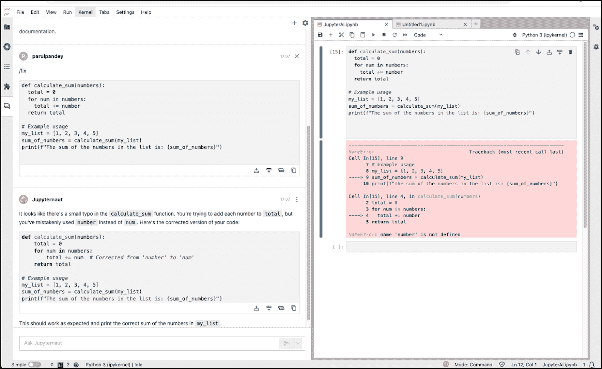

通过 Jupyter AI 在 Jupyter Lab 中的编码助手 | 图像由作者提供

> *⚠️ Jupyter AI 仍在积极开发中，因此某些功能可能会中断。截至撰写本文时，我已经测试了设置以确认其工作，但随着项目的演变，预期会有[潜在的变化](https://github.com/jupyterlab/jupyter-ai)。此外，助手的性能取决于你选择的模型，因此请确保你选择适合你用例的模型。*

# 什么是 Jupyter AI

首先明确一点——什么是 Jupyter AI？正如其名所示，Jupyter AI 是一个用于生成式 AI 的 JupyterLab 扩展。这个强大的工具可以将你的标准 Jupyter 笔记本或 JupyterLab 环境转变为生成式 AI 的游乐场。最好的部分？它还能够在 **Google Colaboratory** 和 **Visual Studio Code** 等环境中无缝工作。这个扩展承担了所有繁重的工作，在你的 Jupyter 环境中提供对各种模型提供者的访问（包括开源和闭源）。

# 安装和设置

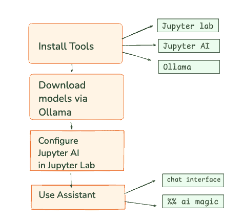

安装流程流程图 | 图像由作者提供

设置环境涉及三个主要组件：

+   JupyterLab

+   Jupyter AI 扩展

+   Ollama（用于本地模型服务）

+   [可选] Hugging Face（用于 [GGUF](https://huggingface.co/docs/hub/en/gguf) 模型）

> *老实说，让助手解决编码错误是容易的部分。棘手的是确保所有安装都已正确完成。因此，正确遵循步骤至关重要。*

## 1. 安装 Jupyter AI 扩展

建议为 Jupyter AI 创建一个[**新环境**](https://docs.python.org/3/library/venv.html)，以保持你的现有环境整洁有序。完成后，按照以下步骤操作。Jupyter AI 需要 **JupyterLab 4.x** 或 **Jupyter Notebook 7+**，所以请确保你已经安装了最新版本的 Jupyter Lab。你可以使用 pip 或 conda 安装/升级 JupyterLab：

```py
# Install JupyterLab 4 using pip
pip install jupyterlab~=4.0
```

接下来，按照以下步骤安装 Jupyter AI 扩展。

```py
pip install "jupyter-ai[all]"
```

这是安装的最简单方法，因为它包括了所有提供者的依赖关系（因此它支持 Hugging Face、Ollama 等，开箱即用）。截至目前，Jupyter AI 支持以下 [模型提供者](https://jupyter-ai.readthedocs.io/en/latest/users/index.html#model-providers)：

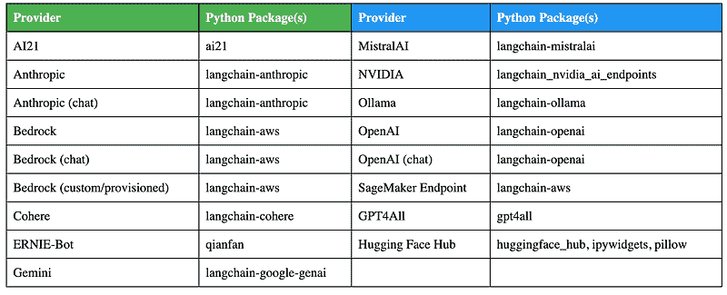

Jupyter AI 支持的模型提供者及其依赖关系 | 由作者从 [文档](https://jupyter-ai.readthedocs.io/en/latest/users/index.html#model-providers) 创建

如果你在安装 Jupyter AI 时遇到错误，请使用 `pip` 手动安装 Jupyter AI，不要使用 [all] 可选依赖组。这样你可以控制你的 Jupyter AI 环境中可用的模型。例如，要仅添加 Ollama 模型的支持来安装 Jupyter AI，请使用以下命令：

```py
pip install jupyter-ai langchain-ollama
```

依赖关系取决于模型提供者（见上表）。接下来，重新启动你的 JupyterLab 实例。如果你在左侧侧边栏中看到一个聊天图标，这意味着一切安装得都很完美。使用 Jupyter AI，你可以在笔记本中直接与模型聊天或使用内联魔法命令。

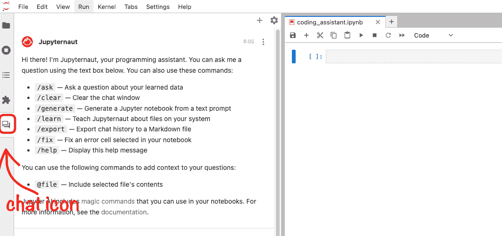

JupyterLab 中的原生聊天界面 | 图片由作者提供

## 2. 为本地模型设置 Ollama

现在 Jupyter AI 已经安装，我们需要用模型来配置它。虽然 Jupyter AI 可以直接与 Hugging Face 模型集成，但某些模型 [可能无法正常工作](https://github.com/jupyterlab/jupyter-ai/issues/576)。相反，Ollama 提供了一种更可靠的方式来本地加载模型。

[**Ollama**](https://ollama.com/) 是一个方便的工具，可以在本地运行大型语言模型。它允许你从其 [库](https://ollama.com/library) 下载预配置的 AI 模型。Ollama 支持所有主要平台（macOS、Windows、Linux），所以请选择适合你的操作系统的方法，从官方 [网站](https://ollama.com/download) 下载并安装它。安装后，通过运行以下命令来验证它是否正确设置：

```py
ollama --version
------------------------------
ollama version is 0.6.2
```

此外，确保你的 Ollama 服务器必须运行，你可以通过在终端中调用 *`ollama serve`* 来检查：

```py
$ ollama serve
Error: listen tcp 127.0.0.1:11434: bind: address already in use
```

如果服务器已经处于活动状态，你将看到上述错误，确认 Ollama 正在运行并使用中。

* * *

# 通过 Ollama 使用模型

## 选项 1：使用预配置的模型

Ollama 提供了一个[库](https://ollama.com/library)的预训练模型，您可以在本地**下载和运行**。要开始使用模型，请使用**pull**命令下载它。例如，要使用**`qwen2.5-coder:1.5b`**，请运行：

```py
ollama pull qwen2.5-coder:1.5b
```

这将在您的本地环境中下载模型。要确认模型是否已下载，请运行：

```py
ollama list
```

这将列出您使用 Ollama 在系统本地下载和存储的所有模型。

## 选项 2：加载自定义模型

如果您需要的模型不在 Ollama 的库中，您可以通过创建一个[**模型文件**](https://github.com/ollama/ollama/blob/main/docs/modelfile.md)来加载自定义模型，该文件指定了模型的来源。有关此过程的详细说明，请参阅[Ollama 导入文档](https://github.com/ollama/ollama/blob/main/docs/import.md)。

## 选项 3：直接从 Hugging Face 运行 GGUF 模型

Ollama 现在支持从 Hugging Face Hub 直接加载[**GGUF 模型**](https://huggingface.co/docs/hub/en/ollama)，包括公共和私有模型。这意味着如果您想直接从 Hugging Face Hub 使用 GGUF 模型，可以这样做，而无需像上面选项 2 中提到的需要自定义模型文件。

例如，要从 Hugging Face 加载一个`4-bit 量化 Qwen2.5-Coder-1.5B-Instruct 模型`：

1. 首先，在您的[本地应用设置](https://huggingface.co/settings/local-apps)下启用 Ollama。

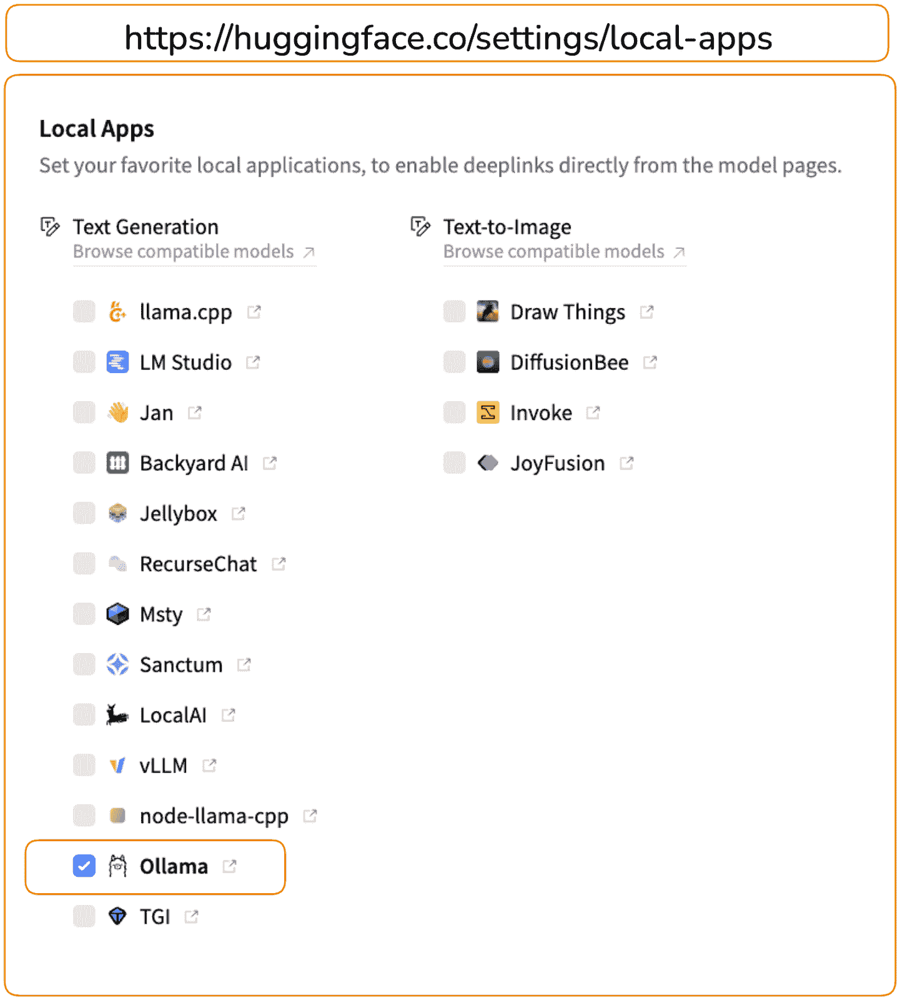

如何在 Hugging Face 的[本地应用设置](https://huggingface.co/settings/local-apps)下启用 Ollama | 图像由作者提供

2. 在模型页面，从下拉菜单中选择 Ollama，如下所示。

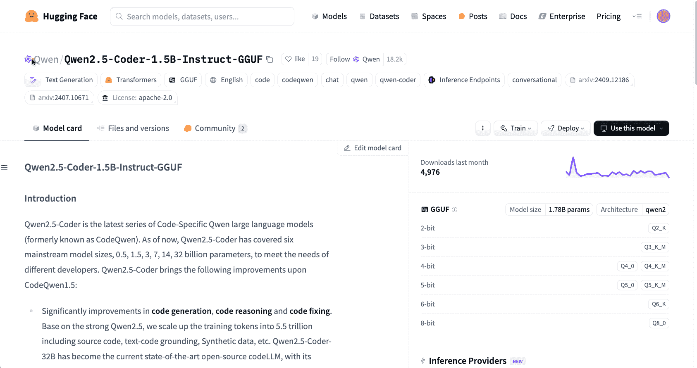

通过 Ollama 从 HuggingFace Hub 访问 GGUF 模型 | 图像由作者提供

# 配置 Jupyter AI 使用 Ollama

我们几乎完成了。在 JupyterLab 中，打开侧边栏上的 Jupyter AI **聊天界面**。在聊天面板的顶部或其设置（齿轮图标）中，有一个下拉菜单或字段用于选择**模型提供者**和模型 ID。选择**Ollama**作为提供者，并输入模型名称，确保与 Ollama 列表中终端显示的名称完全一致（例如，`qwen2.5-coder:1.5b`）。Jupyter AI 将连接到本地 Ollama 服务器并加载该模型以进行查询。由于这是本地操作，因此不需要 API 密钥。

+   根据您选择的模型设置语言模型、嵌入模型和内联补全模型。

+   保存设置并返回聊天界面。

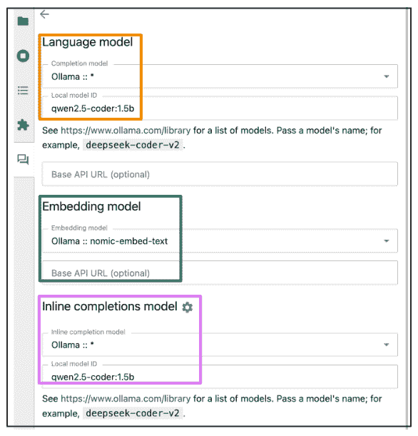

配置 Jupyter AI 使用 Ollama | 图像由作者提供

此配置通过 Ollama 将 Jupyter AI 与本地运行的模式链接起来。虽然内联补全应该通过此过程启用，但如果未启用，你可以通过手动点击位于 JupyterLab 界面底部栏的**Jupyternaut**图标（例如，模式：命令）来启用它。该图标位于**模式指示器**（例如，模式：命令）的左侧。这将打开一个下拉菜单，你可以从中选择“通过 Jupyternaut 启用补全”以激活此功能。

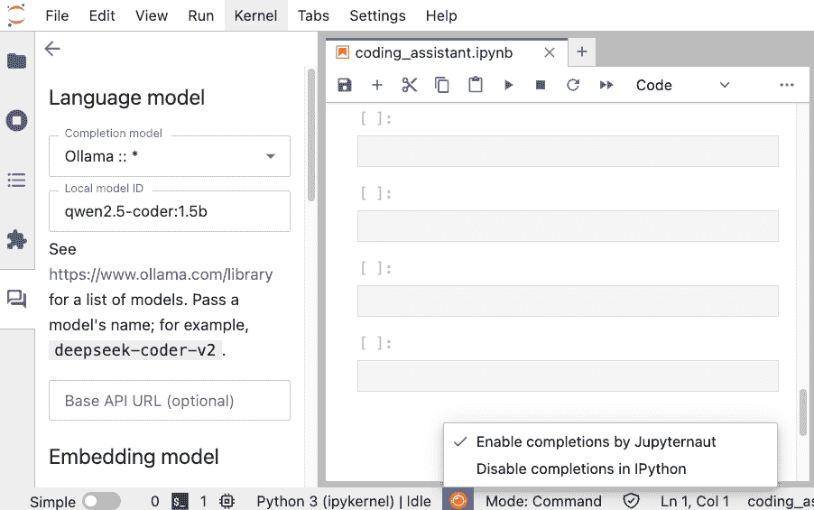

在笔记本中启用代码补全 | 图片由作者提供

# 使用 AI 编码助手

一旦设置好，你就可以使用 AI 编码助手来完成各种任务，如代码自动补全、调试帮助以及从头开始生成新代码。在此需要注意的是，你可以通过**聊天侧边栏**或直接在笔记本单元格中使用`%%ai 魔法命令`与助手交互。让我们看看这两种方式。

## 通过聊天界面使用编码助手

这非常简单。你只需与模型聊天即可执行操作。例如，以下是我们可以要求模型解释代码中的错误，然后通过在笔记本中选中代码来修复错误的方法。

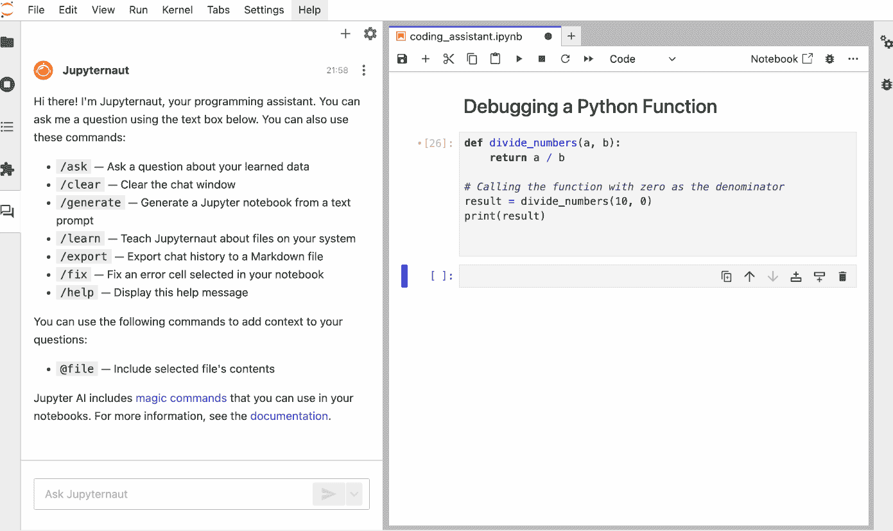

使用 Jupyter AI 通过聊天提供的调试帮助示例 | 图片由作者提供

你也可以要求 AI 从零开始为你生成执行特定任务的代码，只需用自然语言描述你需要的内容。以下是一个由 Jupyternaut 生成的 Python 函数，该函数返回所有小于等于给定正整数 N 的质数。

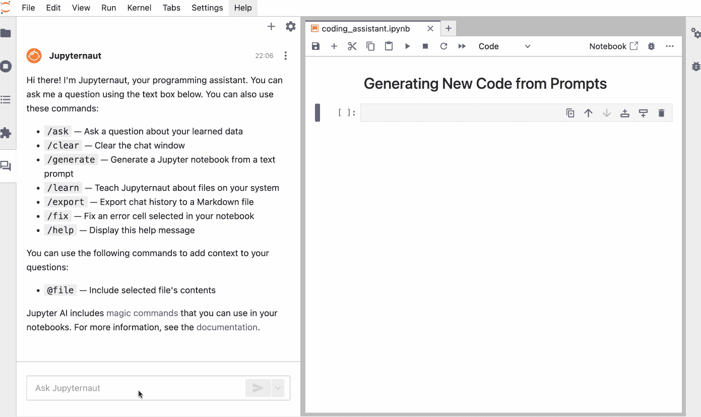

通过聊天使用 Jupyter AI 从提示生成新代码 | 图片由作者提供

## 通过笔记本单元格或 IPython shell 使用编码助手：

你还可以直接在 Jupyter 笔记本中与模型交互。首先，加载 IPython 扩展：

```py
%load_ext jupyter_ai_magics
```

现在，你可以使用`%%ai`单元格魔法通过指定的提示与所选的语言模型进行交互。让我们复制上面的例子，但这次在笔记本单元格内进行。

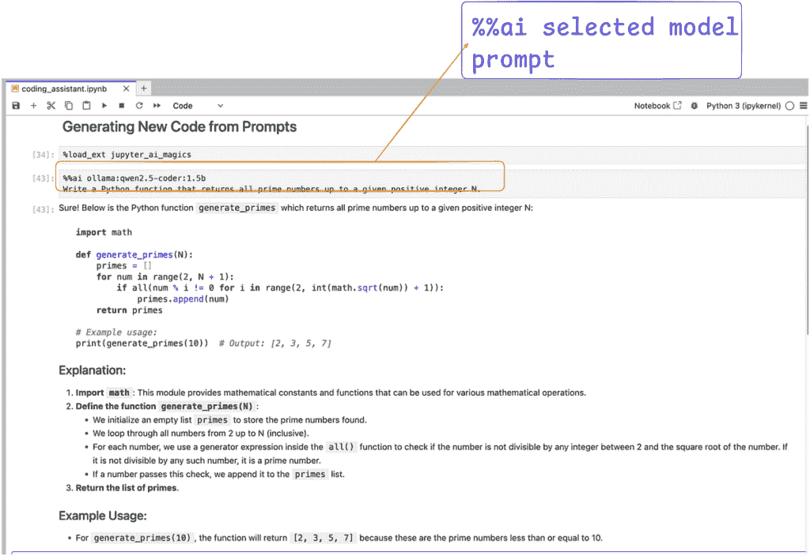

在笔记本中使用 Jupyter AI 从提示生成新代码 | 图片由作者提供

对于更多细节和选项，你可以参考官方[文档](https://jupyter-ai.readthedocs.io/en/latest/users/index.html#the-ai-and-ai-magic-commands)。

# 结论

如您从本文中可以判断，如果您已经安装并设置了正确的配置，Jupyter AI 可以让您轻松设置一个编码助手。我使用了一个相对较小的模型，但您可以从 Ollama 或 Hugging Face 支持的各种模型中选择。这里的关键优势在于使用本地模型提供了显著的好处：它增强了隐私性，减少了延迟，并降低了依赖专有模型提供商的程度。然而，使用 Ollama 在本地运行**大型模型**可能会消耗大量资源，所以请确保您有足够的 RAM**。**随着开源模型快速改进的步伐，即使使用这些替代方案，您也可以实现可比的性能。
