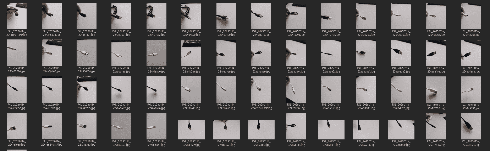
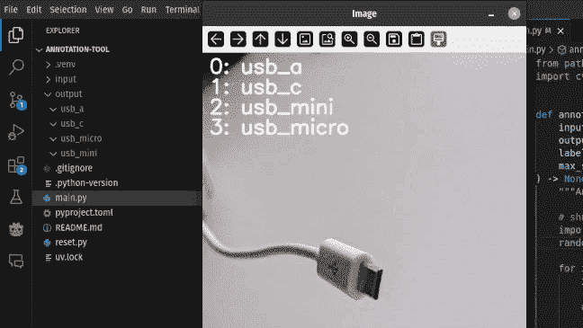
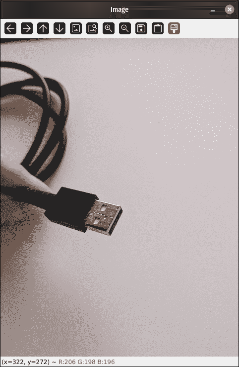
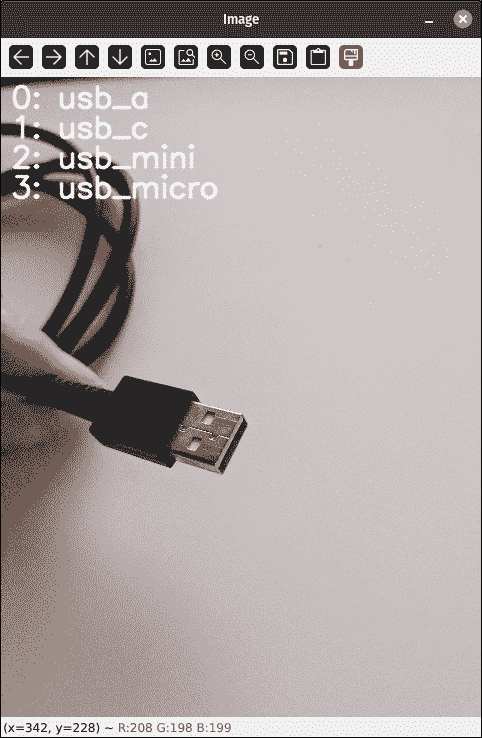

# 5 分钟内构建自己的图像分类标注工具

> 原文：[`towardsdatascience.com/build-your-own-annotation-tool-for-image-classification-in-5-minutes-c0549b644d15/`](https://towardsdatascience.com/build-your-own-annotation-tool-for-image-classification-in-5-minutes-c0549b644d15/)


AI 生成的图像

任何将机器学习应用于解决问题的时刻，目标都是以某种方式将一个 ***模型*** 调整到一些 ***数据*** 上。为了你的模型表现良好并泛化到未见过的数据，你需要确保你使用高质量的训练数据集。特别是在监督学习设置中，你需要确保你的数据被准确标记。

> 数据是机器学习最重要的部分。

无论你如何扩大你的模型，向它投入多少亿个参数，或者对数据集进行多少增强，糟糕的输入 ***不会神奇地变成高质量输出***。

根据你试图解决的问题，并不总是有足够的公共数据集可用。在这些情况下，你可能需要构建自己的数据集。然而，一开始你的数据很可能没有标记。让我向你展示，我们如何构建一个简单、快速的标注工具来从未标记的数据集中对图像数据进行分类。

## 演示

### 图像数据集



数据集样本

为了演示标注工具，我将使用我手机录制的图像数据集，目标是分类三种不同的 USB 连接器类型：USB-A、USB-C、Micro USB 和 Mini USB。一开始，所有图片将在输入目录中未标记。然后我们的标注工具应该一次向我们展示一张图片，并在指定类别后将其移动到相应的目录。



标注工具操作

## 指南

### 前提条件

如果你想跟上来，你应该安装 **opencv-python**。对于一些示例图片，你可以在项目仓库中的 [example 文件夹](https://github.com/trflorian/annotation-tool/tree/main/examples) 找到一些。

### 数据加载

首先，让我们从输入文件夹中加载我们的图片。我们可以使用来自 **pathlib** 的 **glob** 函数来查找所有具有 **jpg** 图片扩展名的文件。将结果传递给排序函数，我们确保图片按顺序处理。

```py
from pathlib import Path

input_path = Path("input")
input_img_paths = sorted(input_path.glob("*.jpg"))
```

让我们也准备输出目录，确保它存在。

```py
output_path = Path("output")
output_path.mkdir(parents=True, exist_ok=True)
```

我们可以通过循环我们的图像列表，并使用 **cv2.imread** 将图片加载到数组中。让我们显示图片并等待按键。通过将 **cv2.waitKey** 函数的延迟设置为 0，我们无限期地等待直到按键按下。然后我们确保可以通过按下 **Q** 来退出应用程序，最后我们关闭所有 **opencv** 窗口。

```py
import cv2

...

def annotate_images(
    input_img_paths: list[Path],
    output_path: Path,
)-> None:

    for img_path in input_img_paths:
        img = cv2.imread(str(img_path))

        cv2.imshow("Image", img)

        while True:
            key = cv2.waitKey(0)

            # Quit Annotation Tool
            if key == ord("q"):
                return

        cv2.destroyAllWindows()
```

> **注意：** 使用位与运算符（&）与 **0xFF** 结合，我们只查看按键的最后几位。这确保了即使例如 NumLock 被激活，数字仍然与 **ord** 函数对数字的处理结果相同。



### 标注

让我们定义我们的任务标签，在一个 **字符串** 的 **列表** 中。在我的情况下，我有四个标签用于不同的连接器：

```py
...

def annotate_images(
    input_img_paths: list[Path],
    output_path: Path,
    labels: list[str],
) -> None:
    ...

annotate_images(
    input_img_paths=input_img_paths,
    output_path=output_path,
    labels=["usb_a", "usb_c", "usb_mini", "usb_micro"],
)
```

现在我们希望数字键 0、1、2 和 3 将我们的图像分类到相应的标签文件夹。waitKey 函数中的 key 变量是一个整数，表示按下的字符的 unicode 码。为了检查按键是否是数字之一，我们需要使用 ***ord*** 函数将数字转换为 **unicode**，类似于我们检查 ***q*** 键来关闭窗口的方式。该函数期望一个长度为 1 的字符串，因此我们需要在传递给函数之前将索引转换为字符串。

```py
 ...

  while True:

    ...

    for i in range(len(labels)):
        if key == ord(str(i)):
            label = labels[i]
            print(f"Classified as {label}")

            # TODO: move to correct label folder

            break
```

要将图像移动到输出路径中的分类标签文件夹，我们可以使用 **pathlib** 中的 **/** 操作来连接路径，然后使用 **rename** 函数将文件移动到目标位置。

```py
...

if key == ord(str(i)):
    label = labels[i]
    print(f"Classified as {label}")

    output_img_path = output_path / label / img_path.name
    img_path.rename(output_img_path)

    break
```

在我们能够做到这一点之前，我们需要确保目标文件夹存在。因此，在循环之前，我们遍历所有标签并创建相应的文件夹。

```py
...

# create all classification folders
for label in labels:
    label_dir = output_path / label
    label_dir.mkdir(parents=True, exist_ok=True)

while True:
    ...
```

对于标签键检查，一个替代的更 *pythontic* 的方法是在循环之前创建一个按键 unicode 码到标签的映射。这样，我们就不需要在循环的每一步都遍历所有键。

```py
# mapping from key to label
labels_key_dict = {ord(str(i)): label for i, label in enumerate(labels)}

while True:
    ...

    if key in labels_key_dict:
        label = labels_key_dict[key]
        print(f"Classified as {label}")

        output_img_path = output_path / label / img_path.name
        img_path.rename(output_img_path)

        break
```

让我们也为键到标签的映射添加一个小帮助文本。

```py
for i, label in enumerate(labels):
    cv2.putText(
        img,
        f"{i}: {label}",
        (10, 30 + 30 * i),
        cv2.FONT_HERSHEY_SIMPLEX,
        1,
        (255, 255, 255),
        2,
        cv2.LINE_AA,
    )
```



## 结论

在这个教程中，你学习了如何为图像分类任务创建一个简单的注释工具。我们可以在这个工具上改进很多。我想进一步探索的是，不仅能够对图像进行分类，还能对图像进行分割并创建分割掩码。

当然，还有许多更复杂、更高级的工具可以简化你的标注过程。然而，有时一个非常简单的工具就足够了，尤其是在项目早期进行探索性数据分析时，你需要一个快速的概念验证。

本帖的完整代码可在我的 **GitHub** 上找到，如下所示。祝您编码愉快！

> [**GitHub – trflorian/annotation-tool**](https://github.com/trflorian/annotation-tool)

* * *

*本帖中的所有可视化都是由作者创建的。*
