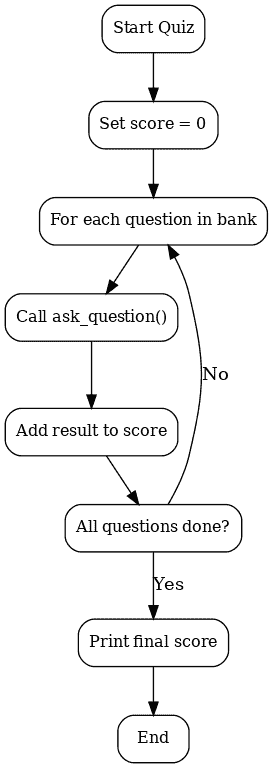

# 在 R 中构建命令行问答应用

> 原文：[`towardsdatascience.com/building-a-command-line-quiz-application-in-r/`](https://towardsdatascience.com/building-a-command-line-quiz-application-in-r/)

我在几年前开始了我的数据科学之旅，并意识到我获得的大部分经验往往围绕着数据分析和理论编码。

回顾过去，作为一名计算机科学专业的学生，我从中学到的其中一个好处是形成了对各种编程语言的深入理解。

尽管缺点是你拥有所有这些理论，但实践却很少或没有。

考虑到这一点，我挑战自己使用数据科学中最顶尖的编程语言之一：R 来构建一些东西。

并且，我知道你可能正在想：*为什么是 R，而不是 Python？*

好吧，请跟我再坚持一分钟。

根据 [StrataScratch 文章](https://www.stratascratch.com/blog/python-vs-r-for-data-science/)，近 20,000 名数据专业人士接受了调查，其中 31% 的人表示他们每天使用 R。

对我来说，那 31% 是一大块蛋糕，这让我开始思考。

如果 R 能够处理数百万行的数据，为什么我不也可以用它来练习与数据科学相关的编程基础呢？

有时候，作为数据科学家的最佳成长方式可能不是直接跳入机器学习库或分析大型数据集。它也可能来自于拥抱[持续学习](https://www.aspen.edu/altitude/upskilling-for-the-future-why-continuous-learning-is-critical-in-business-and-technology/)并逐渐扩展你的技能。

这正是激发我创建这个项目的灵感，一个在终端中运行的 R 的命令行问答应用。

它很简单，但它教授了你在构建更复杂的数据管道时所需的所有技能，例如控制流、输入处理和模块化函数。

在这篇文章中，我将一步一步地引导你了解这个过程，不仅分享代码，还分享我在过程中学到的经验。

* * *

## 处理用户输入

我在这里有点动情，因为这让我想起了第一次在 R 中使用 `readline()` 的情景。看到程序“等待”我输入一些内容，感觉就像我在和我的代码进行对话。

好吧，更多的编码，更少的怀旧。

就像大多数项目一样，我从小处开始，只从一个问题和答案检查开始。

```py
# First experiment: single question with basic input handling
# Bug note: without tolower(), "Abuja" vs "abuja" caused a mismatch
answer <- readline(prompt = "What is the capital of Nigeria? ")

if (tolower(trimws(answer)) == "abuja") {
  cat("✅ Correct!\n")
} else {
  cat("❌ Incorrect. The correct answer is Abuja.\n")
}
```

这个片段看起来很简单，但它引入了两个重要的观点：

+   `readline()` 允许在控制台中进行交互式输入。

+   `tolower()` + `trimws()` 帮助标准化响应（避免由于大小写或额外空格导致的匹配错误）。

当我第一次尝试时，我输入了“Abuja ”并带有尾随空格，它标记我输入错误。因此，我意识到清理输入和收集输入一样重要。

## 使用控制流和函数构建逻辑

最初，我把所有东西都堆叠在一个单独的 `if` 语句块中，但很快就变得混乱。

实话实说，这并不是我最好的决定。

它很快让我想起了结构化编程，将事物分解成函数通常可以使代码更干净、更容易阅读。

```py
# Turned the input logic into a reusable function
# Small bug fix: added trimws() to remove stray spaces in answers
ask_question <- function(q, a) {
  response <- readline(prompt = paste0(q, "\nYour answer: "))

  if (tolower(trimws(response)) == tolower(a)) {
    cat("✅ Correct!\n")
    return(1)
  } else {
    cat("❌ Wrong. The correct answer is:", a, "\n")
    return(0)
  }
}

# Quick test
ask_question("What is the capital of Nigeria?", "Abuja") 
```

使用函数最令人满意的感觉不仅仅是代码更干净，而且我意识到我终于在练习并磨练我的编程技能。

数据科学有点像学习 TikTok 舞蹈；只有当你开始亲自练习动作时，你才能真正理解它。

## 创建问题库

为了扩展问答，我需要一种方法来存储多个问题，而不是一次只硬编码一个问题。我的意思是，你可以这样做，但这并不真的高效。

这就是 R 列表结构的美丽之处；它足够灵活，可以同时容纳问题和它们的答案，这使得它非常适合我正在构建的内容。

```py
# Question bank: keeping it simple with a list of lists
# Note: started with just 2 questions before scaling up
quiz_questions <- list(
  list(question = "What is the capital of Nigeria?", answer = "Abuja"),
  list(question = "Which package is commonly used for data visualization in R?", answer = "ggplot2")
)

# Later I added more, but this small set was enough to test the loop first. 
```

在我寻求反馈的过程中，我向一个朋友分享了这些内容，他建议增加分类（如“地理”或“R 编程”），这实际上可能是一个很好的改进。

## 运行问答（遍历问题）

现在是时候进入有趣的部分了：遍历问题库，询问每个问题，并跟踪得分。这个循环是驱动整个应用程序的引擎。

为了使这一点更清晰，这里有一个简单的流程图来展示我所说的内容：



流程图（图片由作者提供）

在这个结构的基础上，以下是它在代码中的样子：

```py
# Running through the quiz with a score counter
# (I started with a for loop before wrapping this into run_quiz())
score <- 0

for (q in quiz_questions) {
  score <- score + ask_question(q$question, q$answer)
}

cat("📊 Your score is:", score, "out of", length(quiz_questions), "\n") 
```

## 最后的润色

为了使事情更加完善，我将逻辑封装到了`run_quiz()`函数中，使程序可重用且易于理解。

```py
# Wrapped everything in a single function for neatness
# This version prints a welcome message and total score
run_quiz <- function(questions) {
  score <- 0
  total <- length(questions)

  cat("👋 Welcome to the R Quiz Game!\n")
  cat("You will be asked", total, "questions. Good luck!\n\n")

  for (q in questions) {
    score <- score + ask_question(q$question, q$answer)
  }

  cat("🎉 Final score:", score, "out of", total, "\n")
}

# Uncomment to test
# run_quiz(quiz_questions) 
```

到这个时候，应用程序感觉已经完整了。它欢迎玩家，提出一系列问题，并以庆祝的信息显示最终得分。

真是 neat（整洁）。

## 样本运行

这是我用 R 控制台运行时的样子：

```py
👋 Welcome to the R Quiz Game!
You will be asked 2 questions. Good luck!

What is the capital of Nigeria?
Your answer: Abuja
✅ Correct!

Which package is commonly used for data visualization in R?
Your answer: ggplot
❌ Wrong. The correct answer is: ggplot2

🎉 Final score: 1 out of 2 
```

* * *

## 结论和收获

回顾过去，这个小项目教会了我一些可以直接应用到更大规模数据科学工作流程中的经验教训。一个用 R 语言编写的命令行问答游戏可能听起来微不足道，但请相信我，这实际上是一个强大的练习。

如果你正在学习 R，我建议尝试你自己的版本。添加更多问题，并打乱顺序。为了进一步挑战自己，你甚至可以限制回答时间。

编程不是关于达到终点线；它是关于保持在学习曲线上的。像这样的小项目让你不断前进——一次一个函数，一次一个循环，一次一个挑战。
