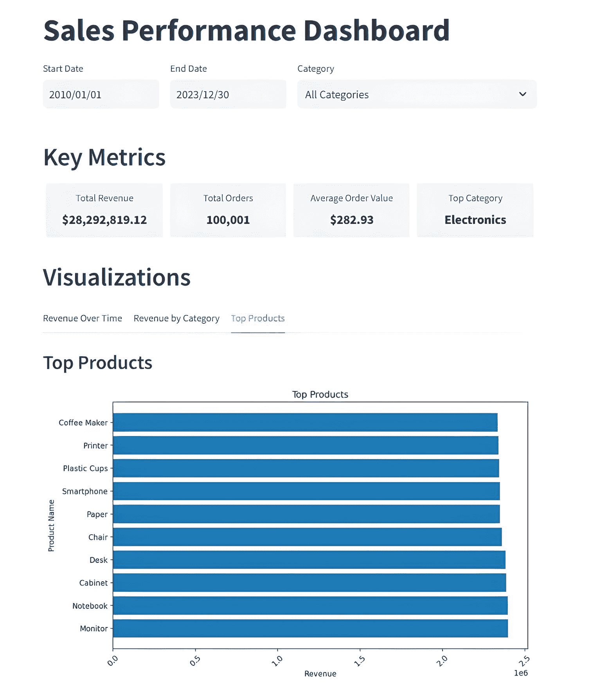
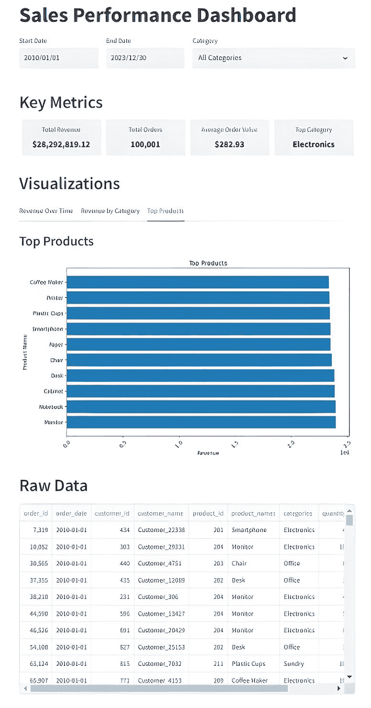

# 构建数据仪表盘

> 原文：[`towardsdatascience.com/building-a-data-dashboard-9441db646697/`](https://towardsdatascience.com/building-a-data-dashboard-9441db646697/)



作者图片

### 使用 Postgres 数据库的源数据

作为一名多年的 Python 数据工程师，我一直没有涉足数据仪表盘的生产。然而，随着基于 Python 的库如 Streamlit、Gradio 和 Taipy 的出现，这一切都发生了改变。

随着它们的引入，Python 程序员再也没有借口不使用它们来制作美观的前端和仪表盘。

在那时，唯一的其他选择是使用像 Tableau 或 AWS 的 Quicksight 这样的专业工具，或者——更糟糕的是——亲自动手使用 CSS、HTML 和 JavaScript。

所以，如果你之前从未使用过这些基于 Python 的新图形前端库，这篇文章就是为你准备的，因为我将带你了解如何使用这个最受欢迎的库之一——**`Streamlit.`**来编写一个数据仪表盘。

> 我的意图是，这将是一系列关于使用三个最受欢迎的基于 Python 的 GUI 库开发数据仪表盘文章的第一部分。除了这篇文章，我还计划发布关于 Gradio 和 Taipy 的文章，所以请留意。我将尽可能在每一个仪表盘中复制相同的布局和功能。我也会使用完全相同的数据，尽管格式不同，例如 CSV、数据库等。
> 
> 请注意，我与 Streamlit/Snowflake、Postgres 或本文中提到的任何其他公司或工具都没有任何联系或隶属关系。

### 什么是 Streamlit？

Streamlit 由 Adrien Treuille、Amanda Kelly 和 Thiago Teixeira 于 2018 年创立，当它引入开源 Python 框架以简化交互式数据应用的创建时，迅速在数据科学家和机器学习工程师中获得了人气。

2022 年 3 月，数据云公司 Snowflake 收购了 Streamlit，并将其功能整合到 Snowflake 生态系统中，以增强数据应用开发。

Streamlit 的开源框架已被广泛采用，下载量超过 800 万次，使用该平台构建的应用程序超过 150 万个。一个活跃的开发者和贡献者社区继续在它的持续发展和成功中扮演着重要角色。

### 我们将开发的内容

我们将开发一个数据仪表盘。我们的仪表盘源数据将存储在一个 Postgres 数据库表中，包含 10 万个合成销售记录。

老实说，数据的实际来源并不***那么***重要。它也可以是一个文本或 CSV 文件，SQLite，或者你可以连接到任何数据库。我选择 Postgres 是因为我在本地 PC 上有一份副本，使用起来很方便。

这就是我们的最终仪表盘将看起来像的样子。



作者图片

有四个主要部分。

+   顶行允许用户通过日期选择器和下拉列表分别选择特定的开始和结束日期以及/或产品类别。

+   第二行——关键指标——显示了所选数据的顶层摘要。

+   可视化部分允许用户选择三个图表之一来显示输入数据集。

+   原始数据部分正是其字面意义。这是所选数据的表格表示，有效地查看底层 Postgres 数据库表数据。

使用仪表板很简单。最初，显示整个数据集的统计数据。然后，用户可以使用显示顶部的 3 个选择字段来缩小数据焦点。图表、关键指标和原始数据部分会动态更改，以反映用户的选择。

### 基础数据

如前所述，仪表板的源数据包含在一个单独的 Postgres 数据库表中。数据是一组 10 万个合成销售相关数据记录。以下是 Postgres 表创建脚本供参考。

```py
CREATE TABLE IF NOT EXISTS public.sales_data
(
    order_id integer NOT NULL,
    order_date date,
    customer_id integer,
    customer_name character varying(255) COLLATE pg_catalog."default",
    product_id integer,
    product_names character varying(255) COLLATE pg_catalog."default",
    categories character varying(100) COLLATE pg_catalog."default",
    quantity integer,
    price numeric(10,2),
    total numeric(10,2)
)
```

以下是一些可以用来生成数据集的 Python 代码示例。请确保首先安装了 numpy 和 polars 库。

```py
# generate the 1m record CSV file
#
import polars as pl
import numpy as np
from datetime import datetime, timedelta

def generate(nrows: int, filename: str):
    names = np.asarray(
        [
            "Laptop",
            "Smartphone",
            "Desk",
            "Chair",
            "Monitor",
            "Printer",
            "Paper",
            "Pen",
            "Notebook",
            "Coffee Maker",
            "Cabinet",
            "Plastic Cups",
        ]
    )

    categories = np.asarray(
        [
            "Electronics",
            "Electronics",
            "Office",
            "Office",
            "Electronics",
            "Electronics",
            "Stationery",
            "Stationery",
            "Stationery",
            "Electronics",
            "Office",
            "Sundry",
        ]
    )

    product_id = np.random.randint(len(names), size=nrows)
    quantity = np.random.randint(1, 11, size=nrows)
    price = np.random.randint(199, 10000, size=nrows) / 100

    # Generate random dates between 2010-01-01 and 2023-12-31
    start_date = datetime(2010, 1, 1)
    end_date = datetime(2023, 12, 31)
    date_range = (end_date - start_date).days

    # Create random dates as np.array and convert to string format
    order_dates = np.array([(start_date + timedelta(days=np.random.randint(0, date_range))).strftime('%Y-%m-%d') for _ in range(nrows)])

    # Define columns
    columns = {
        "order_id": np.arange(nrows),
        "order_date": order_dates,
        "customer_id": np.random.randint(100, 1000, size=nrows),
        "customer_name": [f"Customer_{i}" for i in np.random.randint(2**15, size=nrows)],
        "product_id": product_id + 200,
        "product_names": names[product_id],
        "categories": categories[product_id],
        "quantity": quantity,
        "price": price,
        "total": price * quantity,
    }

    # Create Polars DataFrame and write to CSV with explicit delimiter
    df = pl.DataFrame(columns)
    df.write_csv(filename, separator=',',include_header=True)  # Ensure comma is used as the delimiter

# Generate 100,000 rows of data with random order_date and save to CSV
generate(100_000, "/mnt/d/sales_data/sales_data.csv")
```

### 设置我们的开发环境

在我们进入示例代码之前，让我们设置一个单独的开发环境。这样，我们做的不会干扰我们可能正在进行的其他项目的库、编程等版本。

我使用 Miniconda，但你可以使用最适合你的方法。

如果你想走 Miniconda 路线并且还没有安装，你必须首先安装 Miniconda。使用此链接获取，

> [**Miniconda – Anaconda 文档**](https://docs.anaconda.com/miniconda)

环境创建完成后，使用**`activate`**命令切换到该环境，然后**`pip install`**我们所需的 Python 库。

```py
#create our test environment
(base) C:Usersthoma>conda create -n streamlit_test python=3.12 -y
```

```py
# Now activate it
(base) C:Usersthoma>conda activate streamlit_test
```

```py
# Install python libraries, etc ...
(streamlit_test) C:Usersthoma>pip install streamlit pandas matplotlib psycopg2
```

### 代码

我会将代码分成几个部分，并在过程中解释每一个。

```py
#
# Streamlit equivalent of final Gradio app
#
import streamlit as st
import pandas as pd
import matplotlib.pyplot as plt
import datetime
import psycopg2
from psycopg2 import sql
from psycopg2 import pool

# Initialize connection pool
try:
    connection_pool = psycopg2.pool.ThreadedConnectionPool(
        minconn=5,
        maxconn=20,
        dbname="postgres",
        user="postgres",
        password="postgres",
        host="localhost",
        port="5432"
    )
except psycopg2.Error as e:
    st.error(f"Error creating connection pool: {e}")

def get_connection():
    try:
        return connection_pool.getconn()
    except psycopg2.Error as e:
        st.error(f"Error getting connection from pool: {e}")
        return None

def release_connection(conn):
    try:
        connection_pool.putconn(conn)
    except psycopg2.Error as e:
        st.error(f"Error releasing connection back to pool: {e}")
```

我们首先导入所有需要的外部库。接下来，我们设置一个**ThreadedConnectionPool**，它允许多个线程共享数据库连接池。随后是两个辅助函数，一个用于获取数据库连接，另一个用于释放它。对于简单的单用户应用程序来说，这是多余的，但在处理多个同时用户或线程在 Web 应用程序环境中访问数据库时是必需的。

* * *

```py
def get_date_range():
    conn = get_connection()
    if conn is None:
        return None, None
    try:
        with conn.cursor() as cur:
            query = sql.SQL("SELECT MIN(order_date), MAX(order_date) FROM public.sales_data")
            cur.execute(query)
            return cur.fetchone()
    finally:
        release_connection(conn)

def get_unique_categories():
    conn = get_connection()
    if conn is None:
        return []
    try:
        with conn.cursor() as cur:
            query = sql.SQL("SELECT DISTINCT categories FROM public.sales_data ORDER BY categories")
            cur.execute(query)
            return [row[0].capitalize() for row in cur.fetchall()]
    finally:
        release_connection(conn)

def get_dashboard_stats(start_date, end_date, category):
    conn = get_connection()
    if conn is None:
        return None
    try:
        with conn.cursor() as cur:
            query = sql.SQL("""
                WITH category_totals AS (
                    SELECT 
                        categories,
                        SUM(price * quantity) as category_revenue
                    FROM public.sales_data
                    WHERE order_date BETWEEN %s AND %s
                    AND (%s = 'All Categories' OR categories = %s)
                    GROUP BY categories
                ),
                top_category AS (
                    SELECT categories
                    FROM category_totals
                    ORDER BY category_revenue DESC
                    LIMIT 1
                ),
                overall_stats AS (
                    SELECT 
                        SUM(price * quantity) as total_revenue,
                        COUNT(DISTINCT order_id) as total_orders,
                        SUM(price * quantity) / COUNT(DISTINCT order_id) as avg_order_value
                    FROM public.sales_data
                    WHERE order_date BETWEEN %s AND %s
                    AND (%s = 'All Categories' OR categories = %s)
                )
                SELECT 
                    total_revenue,
                    total_orders,
                    avg_order_value,
                    (SELECT categories FROM top_category) as top_category
                FROM overall_stats
            """)
            cur.execute(query, [start_date, end_date, category, category, 
                                start_date, end_date, category, category])
            return cur.fetchone()
    finally:
        release_connection(conn)
```

**get_date_range**函数执行 SQL 查询以找到`order_date`列中的日期范围（`MIN`和`MAX`），并将两个日期作为元组返回：（开始日期，结束日期）。

**get_unique_categories**函数运行一个 SQL 查询以从`categories`列中获取唯一值。在将它们作为列表返回之前，它将类别名称（首字母大写）。

**get_dashboard_stats**函数执行一个包含以下部分的 SQL 查询：

+   **`category_totals`**：计算给定日期范围内的每个类别的总收入。

+   **`top_category`**: 查找收入最高的类别。

+   **`overall_stats`**: 计算总体统计：

+   总收入（`SUM(price * quantity)`）。

+   唯一订单总数（`COUNT(DISTINCT order_id)`）。

+   平均订单价值（总收入除以总订单数）。

它返回一个包含：

+   `total_revenue`: 指定期间的总收入。

+   `total_orders`: 独特订单数。

+   `avg_order_value`: 每订单平均收入。

+   `top_category`: 收入最高的类别。

* * *

```py
def get_plot_data(start_date, end_date, category):
    conn = get_connection()
    if conn is None:
        return pd.DataFrame()
    try:
        with conn.cursor() as cur:
            query = sql.SQL("""
                SELECT DATE(order_date) as date,
                       SUM(price * quantity) as revenue
                FROM public.sales_data
                WHERE order_date BETWEEN %s AND %s
                  AND (%s = 'All Categories' OR categories = %s)
                GROUP BY DATE(order_date)
                ORDER BY date
            """)
            cur.execute(query, [start_date, end_date, category, category])
            return pd.DataFrame(cur.fetchall(), columns=['date', 'revenue'])
    finally:
        release_connection(conn)

def get_revenue_by_category(start_date, end_date, category):
    conn = get_connection()
    if conn is None:
        return pd.DataFrame()
    try:
        with conn.cursor() as cur:
            query = sql.SQL("""
                SELECT categories,
                       SUM(price * quantity) as revenue
                FROM public.sales_data
                WHERE order_date BETWEEN %s AND %s
                  AND (%s = 'All Categories' OR categories = %s)
                GROUP BY categories
                ORDER BY revenue DESC
            """)
            cur.execute(query, [start_date, end_date, category, category])
            return pd.DataFrame(cur.fetchall(), columns=['categories', 'revenue'])
    finally:
        release_connection(conn)

def get_top_products(start_date, end_date, category):
    conn = get_connection()
    if conn is None:
        return pd.DataFrame()
    try:
        with conn.cursor() as cur:
            query = sql.SQL("""
                SELECT product_names,
                       SUM(price * quantity) as revenue
                FROM public.sales_data
                WHERE order_date BETWEEN %s AND %s
                  AND (%s = 'All Categories' OR categories = %s)
                GROUP BY product_names
                ORDER BY revenue DESC
                LIMIT 10
            """)
            cur.execute(query, [start_date, end_date, category, category])
            return pd.DataFrame(cur.fetchall(), columns=['product_names', 'revenue'])
    finally:
        release_connection(conn)

def get_raw_data(start_date, end_date, category):
    conn = get_connection()
    if conn is None:
        return pd.DataFrame()
    try:
        with conn.cursor() as cur:
            query = sql.SQL("""
                SELECT 
                    order_id, order_date, customer_id, customer_name, 
                    product_id, product_names, categories, quantity, price, 
                    (price * quantity) as revenue
                FROM public.sales_data
                WHERE order_date BETWEEN %s AND %s
                  AND (%s = 'All Categories' OR categories = %s)
                ORDER BY order_date, order_id
            """)
            cur.execute(query, [start_date, end_date, category, category])
            return pd.DataFrame(cur.fetchall(), columns=[desc[0] for desc in cur.description])
    finally:
        release_connection(conn)

def plot_data(data, x_col, y_col, title, xlabel, ylabel, orientation='v'):
    fig, ax = plt.subplots(figsize=(10, 6))
    if not data.empty:
        if orientation == 'v':
            ax.bar(data[x_col], data[y_col])
        else:
            ax.barh(data[x_col], data[y_col])
        ax.set_title(title)
        ax.set_xlabel(xlabel)
        ax.set_ylabel(ylabel)
        plt.xticks(rotation=45)
    else:
        ax.text(0.5, 0.5, "No data available", ha='center', va='center')
    return fig
```

**get_plot_data** 函数在给定的日期范围和类别内获取每日收入。它按天分组检索数据（`DATE(order_date)`），并计算每日收入（`SUM(price * quantity)`），然后返回一个包含列：`date`（日期）和 `revenue`（该日总收入）的 Pandas DataFrame。

**get_revenue_by_category** 函数在指定的日期范围内按类别分组获取收入总额。它按 `categories` 分组数据，并计算每个类别的收入（`SUM(price * quantity)`），按收入降序排列结果，并返回一个包含列：`categories`（类别名称）和 `revenue`（类别总收入）的 Pandas DataFrame。

**get_top_products** 函数在给定的日期范围和类别内检索按收入排名前 10 的产品。它按 `product_names` 分组数据，并计算每个产品的收入（`SUM(price * quantity)`），按收入降序排列产品，并在返回前将结果限制为前 10 个，返回一个包含列：`product_names`（产品名称）和 `revenue`（产品总收入）的 Pandas DataFrame。

**get_raw_data** 函数在指定的日期范围和类别内获取原始交易数据。

**plot_data** 函数接受一些数据（在一个 pandas DataFrame 中）以及你想要在 x 轴和 y 轴上绘制的列名。然后它创建一个条形图 - 无论是垂直还是水平，取决于选择的朝向 - 标记轴，添加标题，并返回完成的图表（一个 Matplotlib 图形）。如果数据为空，它将显示“没有可用数据”的消息，而不是尝试绘制任何内容。

* * *

```py
# Streamlit App
st.title("Sales Performance Dashboard")

# Filters
with st.container():
    col1, col2, col3 = st.columns([1, 1, 2])
    min_date, max_date = get_date_range()
    start_date = col1.date_input("Start Date", min_date)
    end_date = col2.date_input("End Date", max_date)
    categories = get_unique_categories()
    category = col3.selectbox("Category", ["All Categories"] + categories)

# Custom CSS for metrics
st.markdown("""
    <style>
    .metric-row {
        display: flex;
        justify-content: space-between;
        margin-bottom: 20px;
    }
    .metric-container {
        flex: 1;
        padding: 10px;
        text-align: center;
        background-color: #f0f2f6;
        border-radius: 5px;
        margin: 0 5px;
    }
    .metric-label {
        font-size: 14px;
        color: #555;
        margin-bottom: 5px;
    }
    .metric-value {
        font-size: 18px;
        font-weight: bold;
        color: #0e1117;
    }
    </style>
""", unsafe_allow_html=True)

# Metrics
st.header("Key Metrics")
stats = get_dashboard_stats(start_date, end_date, category)
if stats:
    total_revenue, total_orders, avg_order_value, top_category = stats
else:
    total_revenue, total_orders, avg_order_value, top_category = 0, 0, 0, "N/A"

# Custom metrics display
metrics_html = f"""
<div class="metric-row">
    <div class="metric-container">
        <div class="metric-label">Total Revenue</div>
        <div class="metric-value">${total_revenue:,.2f}</div>
    </div>
    <div class="metric-container">
        <div class="metric-label">Total Orders</div>
        <div class="metric-value">{total_orders:,}</div>
    </div>
    <div class="metric-container">
        <div class="metric-label">Average Order Value</div>
        <div class="metric-value">${avg_order_value:,.2f}</div>
    </div>
    <div class="metric-container">
        <div class="metric-label">Top Category</div>
        <div class="metric-value">{top_category}</div>
    </div>
</div>
"""
st.markdown(metrics_html, unsafe_allow_html=True)
```

此代码部分为在 Streamlit 仪表板中显示关键指标的主要结构。它：

1.  **设置页面标题**： "销售绩效仪表板"。

1.  **提供**开始/结束日期和类别选择的筛选器。

1.  **检索数据库中选择的筛选器的指标**（例如总收入、总订单等）。

1.  **应用自定义 CSS** 以在带有标签和值的框行中样式化这些指标。

1.  **在 HTML 块中显示指标**，确保每个指标都得到自己的样式容器。

* * *

```py
# Visualization Tabs
st.header("Visualizations")
tabs = st.tabs(["Revenue Over Time", "Revenue by Category", "Top Products"])

# Revenue Over Time Tab
with tabs[0]:
    st.subheader("Revenue Over Time")
    revenue_data = get_plot_data(start_date, end_date, category)
    st.pyplot(plot_data(revenue_data, 'date', 'revenue', "Revenue Over Time", "Date", "Revenue"))

# Revenue by Category Tab
with tabs[1]:
    st.subheader("Revenue by Category")
    category_data = get_revenue_by_category(start_date, end_date, category)
    st.pyplot(plot_data(category_data, 'categories', 'revenue', "Revenue by Category", "Category", "Revenue"))

# Top Products Tab
with tabs[2]:
    st.subheader("Top Products")
    top_products_data = get_top_products(start_date, end_date, category)
    st.pyplot(plot_data(top_products_data, 'product_names', 'revenue', "Top Products", "Revenue", "Product Name", orientation='h'))
```

此部分向仪表板此部分添加一个标题为“可视化”的标题。它创建三个选项卡，每个选项卡显示数据的不同图形表示：

选项卡 1：随时间推移的收入

+   使用`get_plot_data()`获取给定筛选条件的按日期划分的**收入数据**。

+   调用`plot_data()`生成一个**时间序列条形图**，其中日期在 x 轴上，收入在 y 轴上。

+   在第一个选项卡中显示图表。

选项卡 2：按类别划分的收入

+   使用`get_revenue_by_category()`获取按类别划分的**收入**。

+   调用`plot_data()`来创建按类别划分的**条形图**。

+   在第二个选项卡中显示图表。

选项卡 3：最佳产品

+   使用`get_top_products()`获取给定筛选条件的**按收入排名前 10 的产品**。

+   调用`plot_data()`来创建一个**水平条形图**（通过`orientation='h'`指示）。

+   在第三个选项卡中显示图表。

* * *

```py
 st.header("Raw Data")

raw_data = get_raw_data(
    start_date=start_date,
    end_date=end_date,
    category=category
)

# Remove the index by resetting it and dropping the old index
raw_data = raw_data.reset_index(drop=True)

st.dataframe(raw_data,hide_index=True)

# Add spacing
st.write("")
```

最后的部分以数据框的形式显示原始数据。用户可以上下滚动以查看所有可用的记录。

在末尾添加了一个空的`st.write("")`，以提供更好的视觉对齐空间。

### 运行应用

假设你将你的代码保存到一个名为 app.py 的文件中。你可以通过以下命令行运行它，

```py
(streamlit_test) C:Usersthoma> python -m streamlit run app.py
```

如果一切按预期工作，你将在运行上述命令后看到这个结果。

```py
 You can now view your Streamlit app in your browser.

  Local URL: http://localhost:8501
  Network URL: http://192.168.0.59:8501
```

点击显示的本地 URL，应该会弹出一个浏览器窗口，显示正在运行的 Streamlit 应用。

### 摘要

在这篇文章中，我尝试提供一个全面的指南，介绍如何使用 Streamlit 和 Postgres 数据库表作为数据源来构建交互式销售绩效仪表板。

Streamlit 是一个基于 Python 的现代开源框架，它简化了数据驱动型仪表板和应用程序的创建。我开发的仪表板允许用户通过日期范围和产品类别筛选数据，查看关键指标，如总收入和表现最佳类别，探索可视化，如收入趋势和最佳产品，并通过分页导航原始数据。

本指南包括从设置 Postgres 数据库和示例数据到创建用于查询数据、生成图表和处理用户输入的 Python 函数的完整实现。这种逐步方法展示了如何利用 Streamlit 的功能来创建用户友好且动态的仪表板，非常适合想要构建交互式数据应用的数据工程师和科学家。

虽然我使用了 Postgres 作为我的数据，但应该很容易修改代码以使用 CSV 文件或任何其他关系型数据库管理系统（RDBMS），如 SQLite，作为你的数据源。

* * *

> _ 现在就到这里。我希望你觉得这篇文章有用。如果你觉得有用，请点击[这个链接](https://medium.com/@thomas_reid)查看我的个人资料页面。从那里，你可以看到我其他发布的文章并订阅以获取我发布新内容的通知。_

如果你喜欢这个内容，Medium 认为你也会对以下文章感兴趣。

> [**使用 Numpy 加速 Pandas 代码**](https://towardsdatascience.com/speed-up-pandas-code-with-numpy-fdee76210794)
> 
> [**介绍 Deepseek 文件**](https://pub.towardsai.net/introducing-deepseek-artifacts-f6e34855560d)
