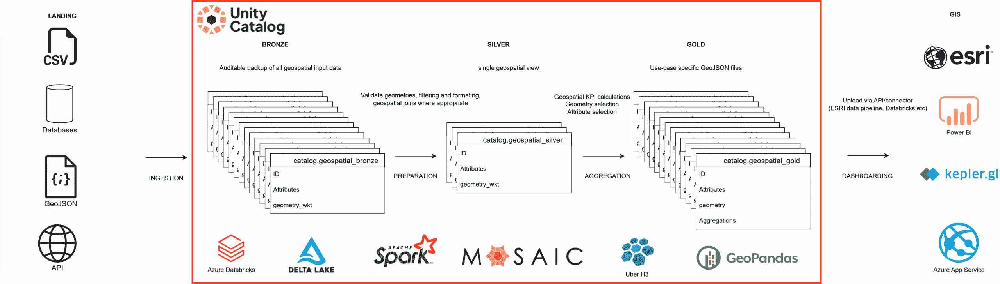
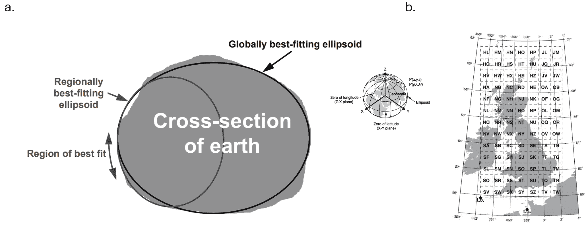
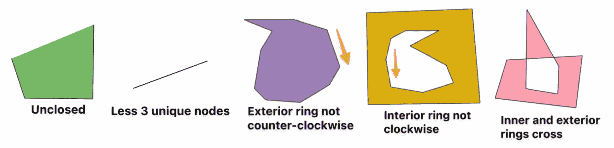
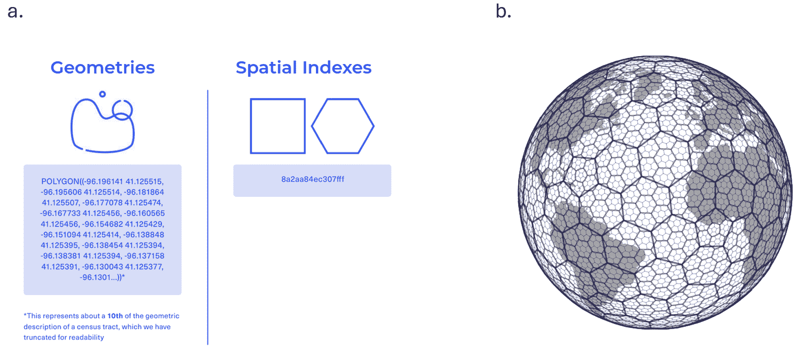
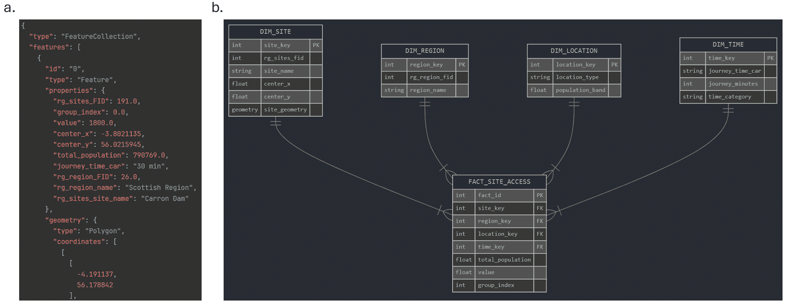
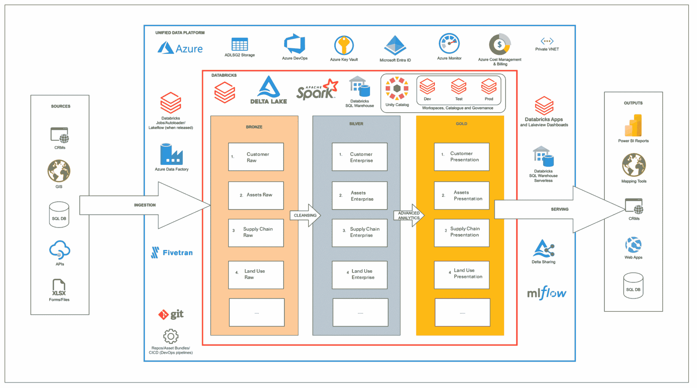
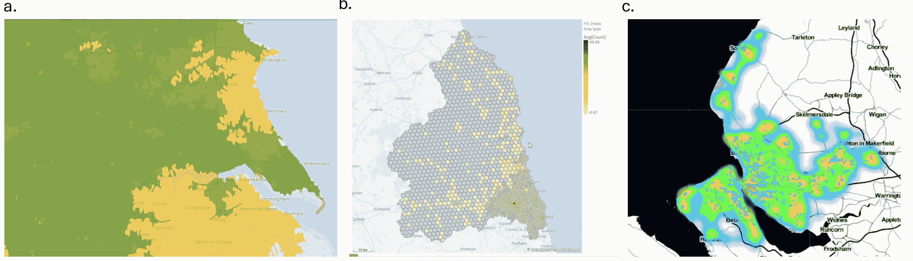

# 使用开源和 Databricks 构建 Geospatial Lakehouse

> 原文：[`towardsdatascience.com/building-a-geospatial-lakehouse-with-open-source-and-databricks-2/`](https://towardsdatascience.com/building-a-geospatial-lakehouse-with-open-source-and-databricks-2/)

## <mdspan datatext="el1761325882442" class="mdspan-comment">简介</mdspan>

与现实世界中的可测量过程相关的所有数据都具有地理空间方面。管理广泛地理区域资产或拥有需要考虑许多需要映射的地理属性层级的业务流程的组织，在开始使用这些数据来回答战略问题或优化时，将会有更复杂的地理空间分析需求。这些专注于地理空间的组织可能会对其数据提出以下这类问题：

> *我的多少资产位于地理边界内？*
> 
> *我的客户步行或开车到达一个地点需要多长时间？*
> 
> *我应该期望每单位面积的客流量密度是多少？*

所有这些都是有价值的地理空间查询，需要将多个数据实体集成到公共存储层中，并将地理空间连接（如点在多边形内操作和地理空间索引）扩展以处理涉及的输入。本文将讨论使用 Databricks 的功能以及利用 Spark 实现的开放源代码工具、常见的 Delta 表存储格式和 Unity Catalog [1] 的方法来扩展地理空间分析，重点关注矢量地理空间数据的批量分析。

## 解决方案概述

下面的图表总结了在 Databricks 中构建地理空间 Lakehouse 的开源方法。通过多种摄取模式（尽管通常通过公共 API）将地理空间数据集以各种格式存储到云存储中；在 Databricks 中，这可以是 Unity Catalog 目录和模式中的一个卷。地理空间数据格式主要包括矢量格式（GeoJSONs、.csv 和 Shapefiles .shp），它们表示经纬度点、线或多边形和属性，以及用于成像数据的栅格格式（GeoTIFF、HDF5）。使用 GeoPandas [2] 或基于 Spark 的地理空间工具，如 Mosaic [3] 或 H3 Databricks SQL 函数 [4]，我们可以在内存中准备矢量文件，并以 Delta 格式将它们保存到统一的青铜层，使用 Well Known Text (WKT) 作为任何点或几何形状的字符串表示。



*使用 Unity Catalog 和 Databricks 开源构建的地理空间分析工作流程概述。图片由作者提供。*

虽然青铜层到银层的转换代表了摄入数据的审计日志，但银层是数据准备以及所有上游用例中常见的地理空间连接可以应用的地方。完成的银层应代表一个单一的地理空间视图，并且可以作为企业数据模型的一部分与其他非地理空间数据集集成；它还提供了一个将多个青铜层表合并为核心地理空间数据集的机会，这些数据集可能具有多个属性和几何形状，在需要向上游聚合的基础粒度级别。金层随后是地理空间表示层，其中可以存储地理空间分析（如行程时间或密度计算）的输出。对于 Power BI 等仪表板工具的使用，输出可能以星型模式实现，而像 ESRI Online 这样的云 GIS 工具则更倾向于为特定的地图应用使用 GeoJSON 文件。

## 地理空间数据准备

除了在数据湖架构中统一多个单个数据源时面临的典型数据质量挑战（数据缺失、记录实践变化等）之外，地理空间数据还有其独特的数据质量和准备挑战。为了使矢量地理空间数据集互操作并易于在上游可视化，最好选择一个地理空间坐标系，如 WGS 84（广泛使用的国际 GPS 标准）。在英国，许多公共地理空间数据集将使用其他坐标系，如 OSGB 36，这是为提高英国地理特征的映射精度而进行的优化（此格式通常以东西向和南北向表示，而不是更典型的纬度和经度对）并且需要将这些数据集转换为 WGS 84，以避免下图中概述的下游映射中的不准确。



*地理空间坐标系统概述（a）以及 WGS 84 和 OSGB 36 在英国的叠加（b）。图片由[5]改编，并经作者许可。版权（c）2018 英国测量局*。

大多数地理空间库，如 GeoPandas、Mosaic 等，都内置了处理这些转换的功能，例如，从 Mosaic 文档中：

```py
df = (
  spark.createDataFrame([{'wkt': 'MULTIPOINT ((10 40), (40 30), (20 20), (30 10))'}])
  .withColumn('geom', st_setsrid(st_geomfromwkt('wkt'), lit(4326)))
)
df.select(st_astext(st_transform('geom', lit(3857)))).show(1, False)
+---------------------------------------------------------------------------------------------------------------------------------------------------------------------
|MULTIPOINT ((1113194.9079327357 4865942.279503176), (4452779.631730943 3503549.843504374), (2226389.8158654715 2273030.926987689), (3339584.723798207 1118889.9748579597))|
+--------------------------------------------------------------------------------------------------------------------------------------------------------------------------+ 
```

将 WGS84 坐标系的多点几何转换为 Web Mercator 投影格式。

另一个仅针对矢量地理空间数据的独特数据质量问题，是下图中概述的无效几何形状的概念。这些无效几何形状会破坏上游的 GeoJSON 文件或分析，因此最好修复它们或在必要时删除它们。大多数地理空间库都提供查找或尝试修复无效几何形状的功能。



*无效几何形状类型的示例。图片由[6]提供，并经作者许可。版权（c）2024 克里斯托夫·里希克*。

这些数据质量和准备步骤应该在 Lakehouse 层的早期阶段实施；我过去在青铜到银色步骤中做过这些，包括任何可重用的地理空间连接和其他转换。

## 地理空间连接和数据分析的扩展

银色/企业层的地理空间方面应理想地表示一个单一的地理空间视图，为所有上游聚合、分析、机器学习建模和人工智能提供数据。除了数据质量检查和修复外，有时将许多地理空间数据集通过聚合或并集进行整合以简化数据模型、简化上游查询并防止需要重新执行昂贵的地理空间连接是有益的。由于需要大量位来表示有时复杂的多边形几何形状以及进行许多成对比较的需要，地理空间连接通常计算成本非常高。

存在一些策略可以使这些连接更高效。例如，您可以简化复杂的几何形状，从而有效地减少表示它们所需的经纬度对的数量；有不同方法可以实现这一点，可能针对不同的期望输出（例如，保留面积或删除冗余点），并且这些可以在库中实现，例如在 Mosaic 中：

```py
df = spark.createDataFrame([{'wkt': 'LINESTRING (0 1, 1 2, 2 1, 3 0)'}])
df.select(st_simplify('wkt', 1.0)).show()
+----------------------------+
| st_simplify(wkt, 1.0)      |
+----------------------------+
| LINESTRING (0 1, 1 2, 3 0) |
+----------------------------+ 
```

扩展地理空间查询的另一种方法是使用下面图示中概述的地理空间索引系统。通过将点或多边形几何数据聚合到 H3 等地理空间索引系统中，可以以高度压缩的形式表示相同的信息，这种形式由一个简短的字符串标识符表示，该标识符映射到一组固定的多边形（具有可可视化的经纬度对），这些多边形覆盖全球，在不同分辨率的六边形/五边形区域内，可以在层次结构中向上/向下汇总。



*地理空间索引系统（压缩）[7] 的动机和 Uber [8] 的 H3 索引可视化。图像经作者许可改编。* 版权（c）CARTO 2023。版权（c）Uber 2018。

在 Databricks 中，H3 索引系统也针对与 Spark SQL 引擎的联合使用进行了优化，因此您可以编写如下查询的点在多边形连接，作为 H3 的近似，首先将点和多边形转换为所需分辨率的 H3 索引（res. 7，大约为 5km²），然后使用 H3 索引字段作为连接键：

```py
WITH locations_h3 AS (
    SELECT
        id,
        lat,
        lon,
        h3_pointash3(
            CONCAT('POINT(', lon, ' ', lat, ')'),
            7
        ) AS h3_index
    FROM locations
),
regions_h3 AS (
    SELECT
        name,
        explode(
            h3_polyfillash3(
                wkt,
                7
            )
        ) AS h3_index
    FROM regions
)
SELECT
    l.id AS point_id,
    r.name AS region_name,
    l.lat,
    l.lon,
    r.h3_index,
    h3_boundaryaswkt(r.h3_index) AS h3_polygon_wkt  
FROM locations_h3 l
JOIN regions_h3 r
  ON l.h3_index = r.h3_index; 
```

GeoPandas 和 Mosaic 也允许您在需要时进行无近似值的地理空间连接，但通常 H3 的使用对于连接和如密度计算等分析来说是一个足够精确的近似。使用云分析平台，您还可以利用 API，通过 Open Route Service [9] 等服务引入实时交通数据和行程时间计算，或使用 Open Street Map 的 Overpass API [10] 等工具丰富地理空间数据，添加额外的属性（例如，交通枢纽或零售地点）。

## 地理空间表示层

现在已经完成了一些地理空间查询和聚合操作，并且分析结果可以用于可视化，因此地理空间数据湖的表示层可以根据用于消费地图或从数据中派生的分析的下层工具进行结构化。下面的图示概述了两种典型方法。



*GeoJSON 特征集合 a)与维度建模的星型模式 b)作为地理空间表示层输出的数据结构比较。图片由作者提供。*

当提供云地理空间信息系统（GIS）如 ESRI Online 或其他带有地图工具的 Web 应用程序时，存储在金/表示层卷中的 GeoJSON 文件，包含创建地图或仪表板所需的所有必要数据，可以构成表示层。使用 FeatureCollection GeoJSON 类型，你可以创建一个嵌套的 JSON，包含多个几何形状和相关属性（“特征”），这些特征可能是点、线字符串或多边形。如果下游仪表板工具是 Power BI，则可能更倾向于星型模式，其中几何形状和属性可以建模为事实和维度，以充分利用其交叉过滤和度量支持，输出物化在表示层的 Delta 表中。

## 平台架构和集成

地理空间数据通常代表更广泛的企业数据模型和一系列分析以及 ML/AI 用例的一部分，这些将需要（理想情况下）一个云数据平台，以及一系列上游和下游集成来部署、编排并真正看到分析对组织有价值。下面的图示显示了我在过去处理地理空间数据时使用的一种 Azure 数据平台的高级架构。



*Azure 中地理空间数据湖的高级架构*。图片由作者提供。

数据使用各种 ETL 工具（如果可能，Databricks 本身就足够了）进行落地。在工作区（s）中维护着原始（青铜）、企业（银色）和表示（金色）层的马赛克模式，使用 Unity Catalog catalog.schema.table/volume 的层次结构生成每个用例层的分离（尤其是权限），如果需要的话。当可展示的输出准备好分享时，有各种数据共享、应用构建和仪表板以及 GIS 集成选项。

例如，使用 ESRI 云服务，ESRI 平台内的 ADLSG2 存储账户连接器允许将写入外部 Unity Catalog 卷（即 GeoJSON 文件）的数据拉入 ESRI 平台，以便集成到地图和仪表板中。一些组织可能更愿意将地理空间输出写入下游系统，如 CRM 或其他地理空间数据库。经过精心整理的地理空间数据和其聚合也经常用作输入特征到机器学习模型，并且与地理空间 Delta 表无缝工作。Databricks 正在开发各种集成到工作空间中的 AI 分析功能（例如，AI BI Genie [11] 和 Agent Bricks [12]），这些功能允许使用英语查询 Unity Catalog 中的数据，长期愿景可能是任何地理空间数据都能以与其他表格数据相同的方式与这些 AI 工具协同工作，唯一的可视化输出将是地图。

## 在此结束

最后，一切都是为了制作对决策有用的酷炫地图。下面的图示展示了我在过去几年中生成的几个地理空间分析输出。地理空间分析归结为了解诸如人们、事件或资产聚集在哪里，从 A 到 B 通常需要多长时间，以及从感兴趣属性（可能是栖息地、剥夺或某些风险因素）的分布来看，景观是什么样的。所有这些对于战略规划（例如，我在哪里放置消防站？）、了解您的客户基础（例如，谁在我位置 30 分钟内？）或运营决策支持（例如，这个星期五哪些位置可能需要额外的容量？）都是非常重要的。



*一些地理空间分析的示例。a) 行程时间分析 b) 使用 H3 的热点发现 c) 使用机器学习的热点聚类*。图片由作者提供。

感谢阅读，如果您有兴趣讨论或进一步阅读，请与我联系或查看以下参考文献。

[`www.linkedin.com/in/robert-constable-38b80b151/`](https://www.linkedin.com/in/robert-constable-38b80b151/)

## 参考文献

[1] [`learn.microsoft.com/en-us/azure/databricks/data-governance/unity-catalog/`](https://learn.microsoft.com/en-us/azure/databricks/data-governance/unity-catalog/)

[2] [`geopandas.org/en/stable/`](https://geopandas.org/en/stable/)

[3] [`databrickslabs.github.io/mosaic/`](https://databrickslabs.github.io/mosaic/)

[4] [`learn.microsoft.com/en-us/azure/databricks/sql/language-manual/sql-ref-h3-geospatial-functions`](https://learn.microsoft.com/en-us/azure/databricks/sql/language-manual/sql-ref-h3-geospatial-functions)

[5] [`www.ordnancesurvey.co.uk/documents/resources/guide-coordinate-systems-great-britain.pdf`](https://www.ordnancesurvey.co.uk/documents/resources/guide-coordinate-systems-great-britain.pdf)

[6] [`github.com/chrieke/geojson-invalid-geometry`](https://github.com/chrieke/geojson-invalid-geometry)

[7] [`carto.com/blog/h3-spatial-indexes-10-use-cases`](https://carto.com/blog/h3-spatial-indexes-10-use-cases)

[8] [`www.uber.com/en-GB/blog/h3/`](https://www.uber.com/en-GB/blog/h3/)

[9] [`openrouteservice.org/dev/#/api-docs`](https://openrouteservice.org/dev/#/api-docs)

[10] [`wiki.openstreetmap.org/wiki/Overpass_API`](https://wiki.openstreetmap.org/wiki/Overpass_API)

[11] [`www.databricks.com/blog/aibi-genie-now-generally-available`](https://www.databricks.com/blog/aibi-genie-now-generally-available)

[12] [`www.databricks.com/blog/introducing-agent-bricks`](https://www.databricks.com/blog/introducing-agent-bricks)
