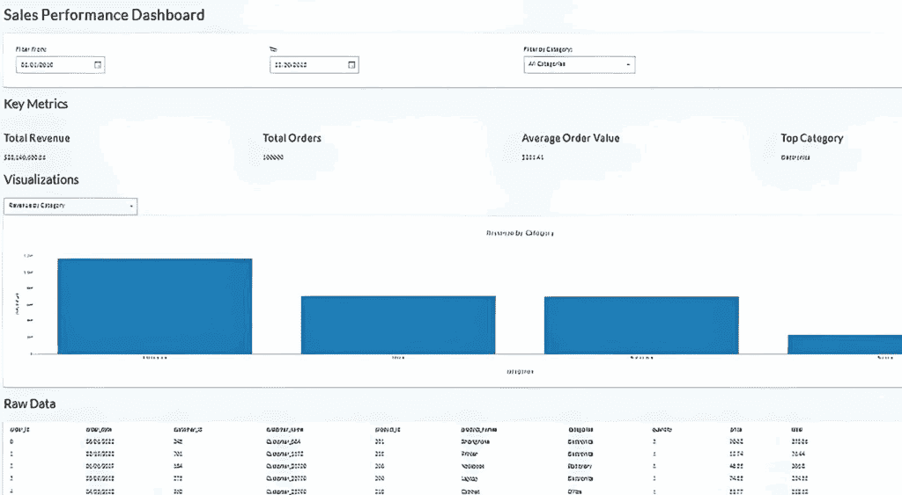

# 使用 Python 和 Taipy 构建现代仪表盘

> 原文：[`towardsdatascience.com/building-a-modern-dashboard-with-python-and-taipy/`](https://towardsdatascience.com/building-a-modern-dashboard-with-python-and-taipy/)

这是关于使用最新基于 Python 的开发工具（Streamlit、Gradio 和 Taipy）开发数据仪表盘的短系列文章中的第三篇文章。

每个仪表盘的数据源相同，但存储在不同的格式中。尽可能的，我会尝试使每个工具的实际仪表盘布局彼此相似，并具有相同的功能。

我已经写好了 Streamlit 和 Gradio 版本。Streamlit 版本从 Postgres 数据库获取源数据。Gradio 和 Taipy 版本从 CSV 文件获取数据。你可以在本文末尾找到那些其他文章的链接。

## 什么是 Taipy？

Taipy 是一个相对较新的基于 Python 的网络框架，在几年前变得突出。根据其网站，Taipy 是...

> “... ***一个用于快速构建生产就绪的前端和后端的开源 Python 库。无需了解任何 Web 开发知识！***”

Taipy 的目标受众是数据科学家、机器学习实践者和可能没有丰富前端开发经验的数据工程师，但他们通常精通 Python。Taipy 使得使用 Python 创建前端变得相对容易，因此这是一个双赢的局面。

你可以免费开始使用 Taipy。如果你需要将其作为企业的一部分使用，需要专用支持和可扩展性，则提供按月或按年付费的计划。他们的网站提供了更多信息，我将在本文末尾提供链接。

## 为什么选择 Taipy 而不是 Gradio 或 Streamlit？

正如我在本文和其他两篇文章中所示，你可以使用所有三个框架开发非常相似的结果，因此这引发了一个问题：为什么选择其中一个而不是另一个。

虽然 Gradio 在快速创建 ML 演示方面表现出色，而 Streamlit 在交互式数据探索方面非常出色，但它们都基于简化的原则，随着你的应用程序雄心的增长，这可能会成为一种限制。当你的项目需要从简单的脚本或演示过渡到强大、性能良好且易于维护的应用程序时，Taipy 就出现了。

如果你应该强烈考虑选择 Taipy 而不是 Streamlit/Gradio，

+   你的应用程序的性能至关重要

+   你的单个脚本文件变得越来越长且复杂。

+   你需要构建具有复杂导航的多页应用程序。

+   你的应用程序需要“如果...将会如何”场景分析或复杂的管道执行。

+   你正在为商业用户构建一个生产工具，而不仅仅是内部探索仪表盘。

+   你在一个团队中工作，需要一个干净、可维护的代码库。

简而言之，选择 **Gradio** 用于演示。选择 **Streamlit** 用于交互式探索。当你准备好构建高性能、可扩展和面向生产的企业级数据应用程序时，选择 **Taipy**。

## 我们将要开发

我们正在开发一个数据仪表板。我们的源数据将是一个包含 100,000 条合成销售记录的单个 CSV 文件。

数据的实际来源并不***那么***重要。它也可以存储为 Parquet 文件，SQLite 或 Postgres，或任何你可以连接的数据库。

这就是我们的最终仪表板将看起来像的样子。



作者提供的图片

有四个主要部分。

+   顶行允许用户使用日期选择器和下拉列表分别选择特定的起始和结束日期以及/或产品类别。

+   第二行，“**关键指标**”提供了所选数据的顶层摘要。

+   **可视化**部分允许用户选择三个图表中的一个来显示输入数据集。

+   **原始数据**部分正是它所声称的那样。所选数据的这种表格表示形式有效地显示了底层的 CSV 数据文件。

使用仪表板很简单。最初，会显示整个数据集的统计数据。用户可以使用显示顶部的 3 个选择字段来缩小数据焦点。图表、关键指标和原始数据部分会根据用户的选择动态更新。

## 源数据

如前所述，仪表板的源数据包含在一个单独的逗号分隔值（CSV）文件中。数据由 100,000 条合成销售相关记录组成。以下是文件的前十条记录。

```py
+----------+------------+------------+----------------+------------+---------------+------------+----------+-------+--------------------+
| order_id | order_date | customer_id| customer_name  | product_id | product_names | categories | quantity | price | total              |
+----------+------------+------------+----------------+------------+---------------+------------+----------+-------+--------------------+
| 0        | 01/08/2022 | 245        | Customer_884   | 201        | Smartphone    | Electronics| 3        | 90.02 | 270.06             |
| 1        | 19/02/2022 | 701        | Customer_1672  | 205        | Printer       | Electronics| 6        | 12.74 | 76.44              |
| 2        | 01/01/2017 | 184        | Customer_21720 | 208        | Notebook      | Stationery | 8        | 48.35 | 386.8              |
| 3        | 09/03/2013 | 275        | Customer_23770 | 200        | Laptop        | Electronics| 3        | 74.85 | 224.55             |
| 4        | 23/04/2022 | 960        | Customer_23790 | 210        | Cabinet       | Office     | 6        | 53.77 | 322.62             |
| 5        | 10/07/2019 | 197        | Customer_25587 | 202        | Desk          | Office     | 3        | 47.17 | 141.51             |
| 6        | 12/11/2014 | 510        | Customer_6912  | 204        | Monitor       | Electronics| 5        | 22.5  | 112.5              |
| 7        | 12/07/2016 | 150        | Customer_17761 | 200        | Laptop        | Electronics| 9        | 49.33 | 443.97             |
| 8        | 12/11/2016 | 997        | Customer_23801 | 209        | Coffee Maker  | Electronics| 7        | 47.22 | 330.54             |
| 9        | 23/01/2017 | 151        | Customer_30325 | 207        | Pen           | Stationery | 6        | 3.5   | 21                 |
+----------+------------+------------+----------------+------------+---------------+------------+----------+-------+--------------------+
```

这里有一些你可以使用的 Python 代码来生成数据集。它利用了 NumPy 和 Pandas Python 库，所以在运行代码之前请确保两者都已安装。

```py
# generate the 100000 record CSV file
#
import polars as pl
import numpy as np
from datetime import datetime, timedelta

def generate(nrows: int, filename: str):
    names = np.asarray(
        [
            "Laptop",
            "Smartphone",
            "Desk",
            "Chair",
            "Monitor",
            "Printer",
            "Paper",
            "Pen",
            "Notebook",
            "Coffee Maker",
            "Cabinet",
            "Plastic Cups",
        ]
    )
    categories = np.asarray(
        [
            "Electronics",
            "Electronics",
            "Office",
            "Office",
            "Electronics",
            "Electronics",
            "Stationery",
            "Stationery",
            "Stationery",
            "Electronics",
            "Office",
            "Sundry",
        ]
    )
    product_id = np.random.randint(len(names), size=nrows)
    quantity = np.random.randint(1, 11, size=nrows)
    price = np.random.randint(199, 10000, size=nrows) / 100
    # Generate random dates between 2010-01-01 and 2023-12-31
    start_date = datetime(2010, 1, 1)
    end_date = datetime(2023, 12, 31)
    date_range = (end_date - start_date).days
    # Create random dates as np.array and convert to string format
    order_dates = np.array([(start_date + timedelta(days=np.random.randint(0, date_range))).strftime('%Y-%m-%d') for _ in range(nrows)])
    # Define columns
    columns = {
        "order_id": np.arange(nrows),
        "order_date": order_dates,
        "customer_id": np.random.randint(100, 1000, size=nrows),
        "customer_name": [f"Customer_{i}" for i in np.random.randint(2**15, size=nrows)],
        "product_id": product_id + 200,
        "product_names": names[product_id],
        "categories": categories[product_id],
        "quantity": quantity,
        "price": price,
        "total": price * quantity,
    }
    # Create Polars DataFrame and write to CSV with explicit delimiter
    df = pl.DataFrame(columns)
    df.write_csv(filename, separator=',',include_header=True)  # Ensure comma is used as the delimiter
# Generate 100,000 rows of data with random order_date and save to CSV
generate(100_000, "/mnt/d/sales_data/sales_data.csv")
```

## 安装和使用 Taipy

安装 Taipy 很简单，但在编码之前，为所有工作设置一个单独的 Python 环境是最佳实践。我为此使用 Miniconda，但请随意使用适合您工作流程的任何方法。

如果你想要遵循 Miniconda 路线并且还没有安装它，你必须首先安装 Miniconda。

环境创建完成后，使用**‘activate’**命令切换到它，然后运行**‘pip install’**来安装我们所需的 Python 库。

```py
#create our test environment
(base) C:\Users\thoma>conda create -n taipy_dashboard python=3.12 -y

# Now activate it
(base) C:\Users\thoma>conda activate taipy_dashboard

# Install python libraries, etc ...
(taipy_dashboard) C:\Users\thoma>pip install taipy pandas
```

## 代码

我会逐步分解代码，并在进行中解释每个部分。

#### 第一部分

```py
from taipy.gui import Gui
import pandas as pd
import datetime

# Load CSV data
csv_file_path = r"d:\sales_data\sales_data.csv"

try:
    raw_data = pd.read_csv(
        csv_file_path,
        parse_dates=["order_date"],
        dayfirst=True,
        low_memory=False  # Suppress dtype warning
    )
    if "revenue" not in raw_data.columns:
        raw_data["revenue"] = raw_data["quantity"] * raw_data["price"]
    print(f"Data loaded successfully: {raw_data.shape[0]} rows")
except Exception as e:
    print(f"Error loading CSV: {e}")
    raw_data = pd.DataFrame()

categories = ["All Categories"] + raw_data["categories"].dropna().unique().tolist()

# Define the visualization options as a proper list
chart_options = ["Revenue Over Time", "Revenue by Category", "Top Products"]
```

此脚本为我们的 Taipy 可视化应用程序准备销售数据。它执行以下操作，

1.  导入所需的库，并从输入 CSV 中加载和预处理我们的源数据。

1.  计算派生指标，如收入。

1.  提取相关的过滤选项（类别）。

1.  定义可用的可视化选项。

#### 第二部分

```py
start_date = raw_data["order_date"].min().date() if not raw_data.empty else datetime.date(2020, 1, 1)
end_date = raw_data["order_date"].max().date() if not raw_data.empty else datetime.date(2023, 12, 31)
selected_category = "All Categories"
selected_tab = "Revenue Over Time"  # Set default selected tab
total_revenue = "$0.00"
total_orders = 0
avg_order_value = "$0.00"
top_category = "N/A"
revenue_data = pd.DataFrame(columns=["order_date", "revenue"])
category_data = pd.DataFrame(columns=["categories", "revenue"])
top_products_data = pd.DataFrame(columns=["product_names", "revenue"])

def apply_changes(state):
    filtered_data = raw_data[
        (raw_data["order_date"] >= pd.to_datetime(state.start_date)) &
        (raw_data["order_date"] <= pd.to_datetime(state.end_date))
    ]
    if state.selected_category != "All Categories":
        filtered_data = filtered_data[filtered_data["categories"] == state.selected_category]

    state.revenue_data = filtered_data.groupby("order_date")["revenue"].sum().reset_index()
    state.revenue_data.columns = ["order_date", "revenue"]
    print("Revenue Data:")
    print(state.revenue_data.head())

    state.category_data = filtered_data.groupby("categories")["revenue"].sum().reset_index()
    state.category_data.columns = ["categories", "revenue"]
    print("Category Data:")
    print(state.category_data.head())

    state.top_products_data = (
        filtered_data.groupby("product_names")["revenue"]
        .sum()
        .sort_values(ascending=False)
        .head(10)
        .reset_index()
    )
    state.top_products_data.columns = ["product_names", "revenue"]
    print("Top Products Data:")
    print(state.top_products_data.head())

    state.raw_data = filtered_data
    state.total_revenue = f"${filtered_data['revenue'].sum():,.2f}"
    state.total_orders = filtered_data["order_id"].nunique()
    state.avg_order_value = f"${filtered_data['revenue'].sum() / max(filtered_data['order_id'].nunique(), 1):,.2f}"
    state.top_category = (
        filtered_data.groupby("categories")["revenue"].sum().idxmax()
        if not filtered_data.empty else "N/A"
    )

def on_change(state, var_name, var_value):
    if var_name in {"start_date", "end_date", "selected_category", "selected_tab"}:
        print(f"State change detected: {var_name} = {var_value}")  # Debugging
        apply_changes(state)

def on_init(state):
    apply_changes(state)

import taipy.gui.builder as tgb

def get_partial_visibility(tab_name, selected_tab):
    return "block" if tab_name == selected_tab else "none"
```

设置默认的起始和结束日期以及初始类别。初始图表也将显示为**随时间变化的收入**。以下内容也设置了占位符和初始值：-

+   **total_revenue**. 设置为 `"$0.00"`。

+   **total_orders.** 设置为 `0`。

+   **avg_order_value.** 设置为 `"$0.00"`。

+   **top_category.** 设置为 `"N/A"`。

空的 DataFrame 设置为：-

+   **revenue_data.** 列为 `["order_date", "revenue"]`。

+   **category_data.** 列为 `["categories", "revenue"]`。

+   **top_products_data.** 列为 `["product_names", "revenue"]`。

定义了 `apply_changes` 函数。此函数在应用筛选器（如日期范围或类别）时触发，以更新状态。它更新以下内容：-

+   时间序列收入趋势。

+   类别间的收入分布。

+   按收入排名的前 10 个产品。

+   汇总指标（总收入、总订单数、平均订单价值、顶级类别）。

**on_change** 函数在用户可选择的任何组件更改时触发

**on_init** 函数在应用首次运行时触发。

**get_partial_visibility** 函数根据所选选项卡确定 UI 元素的 CSS `display` 属性。

#### 第三部分

```py
with tgb.Page() as page:
    tgb.text("# Sales Performance Dashboard", mode="md")

    # Filters section
    with tgb.part(class_name="card"):
        with tgb.layout(columns="1 1 2"):  # Arrange elements in 3 columns
            with tgb.part():
                tgb.text("Filter From:")
                tgb.date("{start_date}")
            with tgb.part():
                tgb.text("To:")
                tgb.date("{end_date}")
            with tgb.part():
                tgb.text("Filter by Category:")
                tgb.selector(
                    value="{selected_category}",
                    lov=categories,
                    dropdown=True,
                    width="300px"
                )

    # Metrics section
    tgb.text("## Key Metrics", mode="md")
    with tgb.layout(columns="1 1 1 1"):
        with tgb.part(class_name="metric-card"):
            tgb.text("### Total Revenue", mode="md")
            tgb.text("{total_revenue}")
        with tgb.part(class_name="metric-card"):
            tgb.text("### Total Orders", mode="md")
            tgb.text("{total_orders}")
        with tgb.part(class_name="metric-card"):
            tgb.text("### Average Order Value", mode="md")
            tgb.text("{avg_order_value}")
        with tgb.part(class_name="metric-card"):
            tgb.text("### Top Category", mode="md")
            tgb.text("{top_category}")

    tgb.text("## Visualizations", mode="md")
    # Selector for visualizations with reduced width
    with tgb.part(style="width: 50%;"):  # Reduce width of the dropdown
        tgb.selector(
            value="{selected_tab}",
            lov=["Revenue Over Time", "Revenue by Category", "Top Products"],
            dropdown=True,
            width="360px",  # Reduce width of the dropdown
        )

    # Conditional rendering of charts based on selected_tab
    with tgb.part(render="{selected_tab == 'Revenue Over Time'}"):
        tgb.chart(
            data="{revenue_data}",
            x="order_date",
            y="revenue",
            type="line",
            title="Revenue Over Time",
        )

    with tgb.part(render="{selected_tab == 'Revenue by Category'}"):
        tgb.chart(
            data="{category_data}",
            x="categories",
            y="revenue",
            type="bar",
            title="Revenue by Category",
        )

    with tgb.part(render="{selected_tab == 'Top Products'}"):
        tgb.chart(
            data="{top_products_data}",
            x="product_names",
            y="revenue",
            type="bar",
            title="Top Products",
        )

    # Raw Data Table
    tgb.text("## Raw Data", mode="md")
    tgb.table(data="{raw_data}")
```

此代码部分定义了整个页面的外观和行为，并分为几个子部分

#### **页面定义**

**tgp.page().** 代表仪表板的主要容器，定义了页面的结构和元素。

#### **仪表板布局**

+   在 Markdown 模式（`mode="md"`）下显示标题：**“销售绩效仪表板”**。

**筛选部分**

+   放置在一个 **卡片式部分** 中，使用 3 列布局 – `tgb.layout(columns="1 1 2")` – 来排列筛选器。

**筛选元素**

1.  **开始日期。** 一个日期选择器 `tgb.date("{start_date}")` 用于选择日期范围的开始。

1.  **结束日期。** 一个日期选择器 `tgb.date("{end_date}")` 用于选择日期范围的结束。

1.  **类别筛选器。**

+   一个下拉选择器 `tgb.selector` 用于按类别筛选数据。

+   使用 `categories` 填充，例如 `"All Categories"` 和数据集中的可用类别。

#### **关键指标部分**

在 4 列布局中显示四个 **指标卡** 的摘要统计信息：

+   **总收入。** 显示 `total_revenue` 值。

+   **总订单数。** 显示唯一订单的数量 (`total_orders`)。

+   **平均订单价值。** 显示 `avg_order_value`。

+   **顶级类别。** 显示贡献最多收入的类别名称。

#### **可视化部分**

+   一个下拉选择器允许用户在不同的可视化之间切换（例如，“随时间变化的收入”，“按类别划分的收入”，“顶级产品”）。

+   下拉宽度减少以实现紧凑的用户界面。

**条件渲染图表**

+   **随时间变化的收入。** 展示了 `revenue_data` 行图表，显示了随时间变化的收入趋势。

+   **按类别划分的收入。** 显示 `category_data` 条形图，以可视化类别间的收入分布。

+   **顶级产品。** 展示 `top_products_data` 条形图，显示了按收入排名前 10 的产品。

#### **原始数据表**

+   以表格格式显示原始数据集。

+   根据用户应用的筛选器（例如，日期范围、类别）动态更新。

#### 第四部分

```py
Gui(page).run(
    title="Sales Dashboard",
    dark_mode=False,
    debug=True,
    port="auto",
    allow_unsafe_werkzeug=True,
    async_mode="threading"
)
```

此最终简短部分在浏览器上渲染页面以供显示。

## 运行代码

收集所有上述代码片段并将它们保存到一个文件中，例如 taipy-app.py。确保你的源数据文件位于正确的位置，并在你的代码中正确引用。然后，你可以在命令行终端中输入以下内容来运行该模块，就像运行任何其他 Python 代码一样。

```py
python taipy-app.py
```

几秒钟后，你应该会看到一个浏览器窗口打开，显示你的数据应用程序。

## 摘要

在这篇文章中，我尝试提供一个全面的指南，使用 Taipy 和 CSV 文件作为数据源来构建交互式销售绩效仪表板。

我解释说 Taipy 是一个基于 Python 的现代开源框架，它简化了数据驱动仪表板和应用程序的创建。我还提供了一些为什么你可能想使用 TaiPy 而不是其他两个流行的框架（Gradio 和 Streamlit）的建议。

我开发的仪表板允许用户通过日期范围和产品类别筛选数据，查看关键指标，如总收入和表现最佳类别，探索可视化，如收入趋势和最佳产品，以及通过分页导航原始数据。

本指南提供了一个全面的实现，涵盖了从创建样本数据到开发用于查询数据、生成图表和处理用户输入的 Python 函数的整个流程。这种逐步方法展示了如何利用 Taipy 的功能来创建用户友好且动态的仪表板，非常适合想要构建交互式数据应用的数据工程师和科学家。

虽然我使用了 CSV 文件作为数据源，但修改代码以使用其他数据源，例如 SQLite 这样的关系型数据库管理系统（RDBMS），应该是简单的。

> 更多关于 Taipy 的信息，请访问他们的网站 [`taipy.io/`](https://taipy.io/)
> 
> 要查看我关于使用 Gradio 和 Streamlit 构建 data dashboards 的其他两篇 TDS 文章，请点击下面的链接。
> 
> [Gradio 仪表板](https://towardsdatascience.com/building-a-modern-dashboard-with-python-and-gradio/)
> 
> [Streamlit 仪表板](https://towardsdatascience.com/building-a-data-dashboard-9441db646697/)
