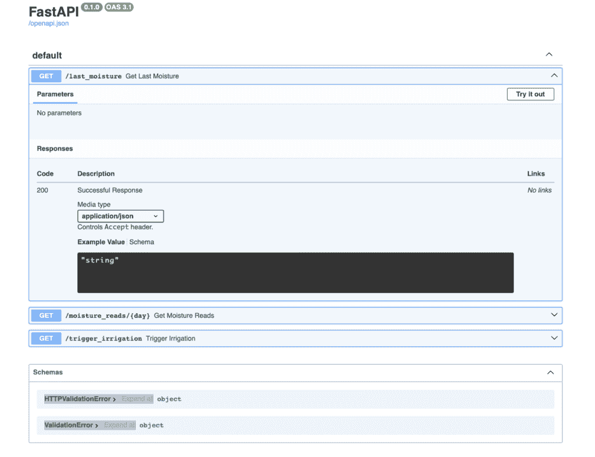

# 使用 FastAPI 为你的数据项目构建个人 API

> 原文：[`towardsdatascience.com/building-a-personal-api-for-your-data-projects-with-fastapi/`](https://towardsdatascience.com/building-a-personal-api-for-your-data-projects-with-fastapi/)

<mdspan datatext="el1745298385345" class="mdspan-comment">你有多少次</mdspan> 有一个混乱的 Jupyter Notebook，里面充满了复制粘贴的代码，只是为了重用一些数据处理逻辑？无论你是出于热情还是为了工作，如果你代码很多，那么你可能已经回答过“太多”。

你并不孤单。

也许你曾试图与同事分享数据或将最新的机器学习模型插入到光滑的仪表板中，但发送 CSV 或从头开始重建仪表板并不觉得正确。

**今天的解决方案（和主题）：为自己构建一个个人 API**。

在这篇文章中，我将向你展示如何设置一个轻量级、强大的 FastAPI 服务，以公开你的数据集或模型，并最终给你的数据项目带来应有的模块化。

无论你是独立的数据科学爱好者、有副业的在校学生，还是经验丰富的机器学习工程师，这都适合你。

不，我不是因为这个服务而得到报酬。那会很好，但现实远非如此。我只是碰巧喜欢使用它，并且我认为它值得分享。

让我们回顾一下今天的目录：

1.  什么是个人 API？（你为什么应该关心？）

1.  一些用例

1.  使用 FastAPI 设置

1.  结论

## 什么是个人 API？（你为什么应该关心？）

99% 的阅读者可能已经熟悉 API 概念。但对于那 1%，这里有一个简短的介绍，将在接下来的部分中通过代码进行补充：

**API**（应用程序编程接口）是一套规则和工具，允许不同的软件应用程序之间进行通信。它定义了“你可以要求程序做什么”，例如“给我天气预报”或“发送一条消息”。然后该程序在幕后处理请求并返回结果。

那么，什么是 **个人 API**？它本质上是一个小型的网络服务，以结构化、可重用的方式公开你的数据或逻辑。想象一下，它就像一个迷你应用程序，通过你的数据的 JSON 版本响应 HTTP 请求。

为什么这是个好主意？在我看来，它有以下几个优点：

+   如前所述，**可重用性**。我们可以从我们的笔记本、仪表板或脚本中使用它，而无需多次重写相同的代码。

+   **协作**：你的队友可以轻松通过 API 端点访问你的数据，而无需复制你的代码或在他们自己的机器上下载相同的数据集。

+   **便携性**：你可以在任何地方部署它——本地、云上、容器中，甚至是在 Raspberry Pi 上。

+   **测试**：需要测试新功能或模型更新？将其推送到你的 API，并立即在所有客户端（笔记本、应用程序、仪表板）上进行测试。

+   **封装和版本控制**：您可以版本化您的逻辑（v1、v2 等）并干净地将原始数据与处理逻辑分离。这对可维护性来说是一个巨大的优势。

而 FastAPI 非常适合这个用途。但让我们看看一些真正的用例，任何像我们这样的人都能从中受益于个人 API。

## 一些用例

不论您是数据科学家、分析师、ML 工程师，还是只在周末构建酷炫的东西，个人 API 都可以成为您的秘密生产力武器。以下是一些例子：

+   **模型即服务**（MASS）：在本地训练 ML 模型并通过类似`/predict`的端点将其公开。从这里开始的选项是无限的：快速原型设计、在前端集成……

+   **仪表盘就绪数据**：为 BI 工具或自定义仪表板提供预处理的、干净的、过滤后的数据集。您可以在 API 中集中逻辑，这样仪表板就可以保持轻量级，并且不会重新实现过滤或聚合。

+   **可重用数据访问层**：当您在一个包含多个 Notebooks 的项目上工作时，是否曾经发生过所有这些 Notebooks 的第一个单元格总是包含相同的代码的情况？好吧，如果将所有这些代码集中到您的 API 中，并通过单个请求完成，会怎么样？是的，您也可以将其模块化并调用一个函数来完成相同的任务，但创建 API 可以让您更进一步，能够轻松地从任何地方（而不仅仅是本地）使用它。

我希望您能理解这个观点。选项是无限的，就像它的有用性一样。

但让我们进入有趣的部分：构建 API。

## 使用 FastAPI 设置

和往常一样，首先使用您最喜欢的环境工具（venv、pipenv 等）设置环境。然后，使用`pip install fastapi uvicorn`安装 fastapi 和 uvicorn。让我们了解它们的作用：

+   **FastAPI**[1]：它是允许我们开发 API 的库，本质上。

+   **Uvicorn**[2]：它将允许我们运行 Web 服务器。

安装后，我们只需要一个文件。为了简单起见，我们将它命名为*app.py*。

让我们现在将一些上下文放入我们将要做什么：想象一下，我们正在为家里的蔬菜花园构建一个智能灌溉系统。灌溉系统相当简单：我们有一个湿度传感器，以一定的频率读取土壤湿度，我们希望在低于 30%时激活系统。

当然，我们希望本地自动化它，所以当它达到阈值时，它就开始滴水。但我们也对能够远程访问系统感兴趣，也许读取当前值，甚至在我们想要的时候触发水泵。这就是个人 API 能派上用场的时候。

这里是基本的代码，它将使我们能够做到这一点（注意，我正在使用另一个库，**duckdb**[3]，因为那是我存储数据的地方——但您也可以只使用 sqlite3、pandas 或您喜欢的任何东西）：

```py
 import datetime

from fastapi import FastAPI, Query
import duckdb

app = FastAPI()
conn = duckdb.connect("moisture_data.db")

@app.get("/last_moisture")
def get_last_moisture():
    query = "SELECT * FROM moisture_reads ORDER BY day DESC, time DESC LIMIT 1"
    return conn.execute(query).df().to_dict(orient="records")

@app.get("/moisture_reads/{day}")
def get_moisture_reads(day: datetime.date, time: datetime.time = Query(None)):
    query = "SELECT * FROM moisture_reads WHERE day = ?"
    args = [day]
    if time:
        query += " AND time = ?"
        args.append(time)

    return conn.execute(query, args).df().to_dict(orient="records")

@app.get("/trigger_irrigation")
def trigger_irrigation():
    # This is a placeholder for the actual irrigation trigger logic
    # In a real-world scenario, you would integrate with your irrigation system here
    return {"message": "Irrigation triggered"}
```

垂直阅读，这段代码将分为三个主要部分：

1.  导入

1.  设置 app 对象和数据库连接

1.  创建 API 端点

1 和 2 都相当直接，所以我们重点关注第三个。我在这里创建了 3 个端点，每个端点都有自己的函数：

+   `/last_moisture` 显示最后一个传感器值（最新的一个）。

+   `/moisture_reads/{day}` 对于查看单天的传感器读数很有用。例如，如果我想比较冬季和夏季的湿度水平，我会检查 `/moisture_reads/2024-01-01` 中的内容，并观察与 `/moisture_reads/2024-08-01` 的差异。

    但我也让它能够读取 GET 参数，如果我对检查特定时间感兴趣。例如：`/moisture_reads/2024-01-01?time=10:00`

+   `/trigger_irrigation` 会执行其名称所暗示的操作。

所以我们只缺少一个部分，即启动服务器。看看在本地运行它是多么简单：

```py
uvicorn app:app --reload
```

现在，我可以访问：

+   [`localhost:8000/last_moisture`](http://localhost:8000/last_moisture) 查看我的最新湿度

+   [`localhost:8000/moisture_reads/2024-01-01`](http://localhost:8000/moisture_reads/2024-01-01) 查看 2024 年 1 月 1 日的湿度水平。

+   [`localhost:8000/trigger_irrigation`](http://localhost:8000/trigger_irrigation) 启动抽水。

但这还没有结束。FastAPI 还提供了一个端点，可以在 [`localhost:8000/docs`](http://localhost:8000/docs) 找到，它展示了为我们 API 自动生成的交互式文档。在我们的案例中：



当 API 是协作的时，这非常有用，因为我们不需要检查代码就能看到我们能够访问的所有端点！

只需几行代码，实际上非常少，我们就能够构建我们自己的个人 API。显然，它可以变得更加复杂（可能也应该如此），但这不是今天的目的。

## 结论

只需几行 Python 代码和 FastAPI 的力量，你现在已经看到了如何通过个人 API 实现数据或逻辑的暴露是多么容易。无论你是构建智能灌溉系统、公开机器学习模型，还是厌倦了在笔记本之间重复编写相同的处理逻辑——这种方法为你的项目带来了模块化、协作和可扩展性。

这只是开始。你可以：

+   添加身份验证和版本控制

+   部署到云端或树莓派

+   将其链接到前端或 Telegram 机器人

+   将你的作品集变成一个活生生的项目中心

如果你曾经希望你的数据处理工作 *感觉* 像一个真正的产品——这就是你的入口。

如果你用它构建了什么酷炫的东西，请让我知道。或者更好的是，发送我你 `/predict`、`/last_moisture` 或你制作的任何 API 的 URL。我很想看看你有什么想法。

## 资源

[1] Ramírez, S. (2018). *FastAPI* (Version 0.109.2) [计算机软件]. https://fastapi.tiangolo.com

[2] Encode. (2018). *Uvicorn* (Version 0.27.0) [计算机软件]. [`www.uvicorn.org`](https://www.uvicorn.org/)

[3] Mühleisen, H., Raasveldt, M., & DuckDB Contributors. (2019). *DuckDB* (版本 0.10.2) [计算机软件]. [`duckdb.org`](https://duckdb.org/)
