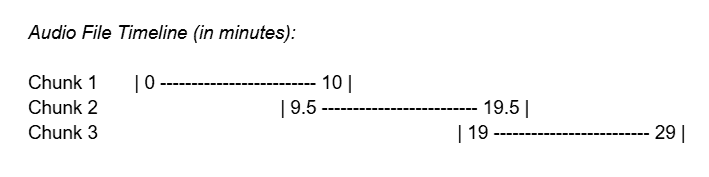
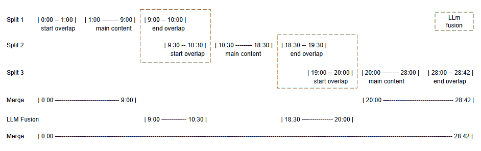
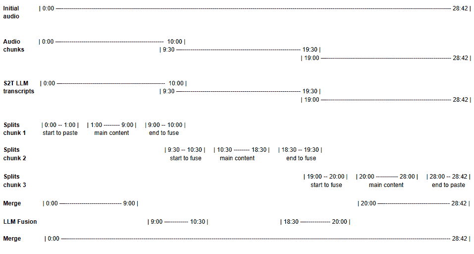

# 使用谷歌 Gemini 构建可扩展且准确的音频访谈转录管道

> 原文：[`towardsdatascience.com/building-a-scalable-and-accurate-audio-interview-transcription-pipeline-with-google-gemini/`](https://towardsdatascience.com/building-a-scalable-and-accurate-audio-interview-transcription-pipeline-with-google-gemini/)

**本文由 Ugo Pradère 和 David Haüet 合著**

<mdspan datatext="el1745629161913" class="mdspan-comment">转录访谈有多难？</mdspan>你将音频输入到 AI 模型中，等待几分钟，然后砰：完美的转录，对吧？嗯……并不完全是这样。

当涉及到准确转录长篇音频访谈时，尤其是当口语不是英语时，事情会变得更加复杂。你需要高质量的转录，可靠的说话人识别，精确的时间戳，所有这些都要在一个可承受的价格范围内。实际上并不简单。

在这篇文章中，我们将带您了解我们使用谷歌的 Vertex AI 和 Gemini 模型构建可扩展和现成转录管道的幕后之旅。从意外的模型限制到预算评估和时间戳漂移灾难，我们将向您展示真正的挑战以及我们如何解决它们。

无论你是构建自己的音频处理工具，还是对使用多模态模型构建的强大转录系统“内部”发生的事情感到好奇，你都会发现实用的见解，巧妙的工作方法和值得你花时间的经验教训。

## 项目背景和限制

在 2025 年初，我们启动了一个访谈转录项目，目标明确：构建一个能够转录法语访谈的系统，通常涉及一名记者和一位嘉宾，但不仅限于这种情况，持续时间从几分钟到超过一小时。预期的最终输出只是一个原始的转录文本，但必须反映自然对话的“书籍式”对话，确保忠实转录原始音频内容，同时具有良好的可读性。

在深入开发之前，我们对现有的解决方案进行了简短的市场调研，但结果从未令人满意：质量往往令人失望，价格对于密集使用来说肯定太高，在大多数情况下，两者兼而有之。在那个时刻，我们意识到需要一个定制的管道。

由于我们的组织参与谷歌生态系统，我们被要求使用谷歌 Vertex AI 服务。谷歌 Vertex AI 提供各种语音到文本（S2T）模型用于音频转录，包括专门的模型，如“Chirp”、“Latestlong”或“Phone call”，其名称已经暗示了它们预期的使用场景。然而，制作一个结合高精度、说话人分割和精确时间戳的完整访谈转录，特别是对于长录音来说，仍然是一个真正的技术和操作挑战。

## 初次尝试和限制

我们通过评估所有这些模型在我们的用例中启动了我们的项目。然而，经过广泛的测试后，我们很快得出以下结论：没有 Vertex AI 服务能够完全满足所有需求，并且能够以简单有效的方式实现我们的目标。总会有至少一个缺失的规范，通常是关于时间戳或说话人分割。

必须说，糟糕的 Google 文档在这个初步研究期间耗费了我们大量的时间。这促使我们请求与 Google Cloud 机器学习专家会面，试图找到解决我们问题的方法。经过快速的视频通话后，我们与 Google 代表的讨论很快证实了我们的结论：我们最初想要实现的目标并不像看起来那么简单。整个需求集不能由单一 Google 服务满足，并且必须开发一个定制的 VertexAI S2T 服务实现。

我们展示了我们的初步工作，并决定继续探索两种策略：

+   使用 Chirp2 生成长音频文件的转录和标记时间戳，然后使用 Gemini 进行说话人分割。

+   使用 Gemini 2.0 Flash 进行转录和说话人分割，尽管时间戳是近似的，并且标记输出长度需要循环。

与这些调查并行，我们还得考虑财务方面。这个工具将用于每月数百小时的转录。与文本不同，文本通常足够便宜，无需过多考虑，而音频可能会相当昂贵。因此，我们从探索一开始就包括了这一参数，以避免最终得到一个虽然可行但成本过高，无法在生产中利用的解决方案。

## 深入研究 Chirp2 的转录

我们开始更深入地研究 Chirp2 模型，因为它被认为是“同类最佳”的 Google S2T 服务。直接应用提供的文档产生了预期的结果。该模型证明非常有效，提供了良好的转录，并按以下 json 格式的输出进行逐词时间戳标记：

```py
"transcript":"Oui, en effet",
"confidence":0.7891818284988403
"words":[
  {
    "word":"Oui",
    "start-offset":{
      "seconds":3.68
    },
    "end-offset":{
      "seconds":3.84
    },
    "confidence":0.5692862272262573
  }
  {
    "word":"en",
    "start-offset":{
      "seconds":3.84
    },
    "end-offset":{
      "seconds":4.0
    },
    "confidence":0.758037805557251
  },
  {
    "word":"effet",
    "start-offset":{
      "seconds":4.0
    },
    "end-offset":{
      "seconds":4.64
    },
    "confidence":0.8176857233047485
  },
]
```

然而，随着项目的发展，运营团队增加了一个新的要求：转录必须尽可能忠实于原始音频内容，并包括小填充词、感叹词、拟声词甚至含糊不清的词语，这些词语可以增加对话的意义，通常来自非说话者，要么是在说话者的同一时间，要么是在说话者句子的末尾。我们谈论的是像“oui oui”、“en effet”这样的词语，但也是像（嗯，啊等）这样的简单表达，这在法语中很典型！实际上，用简单的“嗯嗯”来验证或更少见的反对某人观点并不罕见。在分析带有转录的 Chirp 时，我们注意到虽然这些小词中有一些是存在的，但许多这些表达却缺失了。这是 Chirp2 的第一个缺点。

在这种方法中，主要挑战在于执行日历化时重建说话者的句子。我们很快放弃了给 Gemini 提供采访上下文和转录文本，并要求它确定谁说了什么的想法。这种方法很容易导致错误的日历化。我们转而探索以紧凑的格式发送采访上下文、音频文件和转录内容，指示 Gemini 仅执行日历化和句子重建，而不重新转录音频文件。我们请求了 TSV 格式，这是一种理想的转录结构化格式：“易于阅读”以快速进行质量检查，易于算法处理，且轻量。其结构如下：

第一行包含说话者介绍：

*Diarization Speaker_1:speaker_name\Speaker_2:speaker_name\Speaker_3:speaker_name\Speaker_4:speaker_name 等.*

然后以下格式的转录：

*speaker_id\ttime_start\ttime_stop\text* *with:*

+   ***speaker:*** *数字说话者 ID（例如，1，2 等）*

+   ***time_start:*** *以 00:00:00 格式的段开始时间*

+   ***time_stop:*** *以 00:00:00 格式的段结束时间*

+   ***text:*** *对话段的转录文本*

一个示例输出：

> *Diarization Speaker_1:Lea Finch\Speaker_2:David Albec *
> 
> *1**00:00:00**00:03:00**嗨，安德鲁，你好吗？**
> 
> *2**00:03:00**00:03:00**好的，谢谢。**
> 
> *1**00:04:00**00:07:00**那么，让我们开始采访**
> 
> *2**00:07:00**00:08:00**好的。**
> 
> 提供给 LLM 的上下文简单版本：
> 
> *以下是记者 Lea Finch 对职业足球运动员 David Albec 的采访**

结果相当定性，看起来似乎实现了准确的日历化和句子重建。然而，并非得到完全相同的文本，它在几个地方似乎有所修改。我们的结论是，尽管我们给出了明确的指示，但 Gemini 可能不仅仅执行日历化，实际上还进行了部分转录。

我们在此还评估了使用这种方法进行转录的成本。以下是基于音频处理进行的近似计算：

Chirp2 价格/分钟：0.016 美元

Gemini 2.0 flash /分钟: 0,001875 美元

价格/小时：1,0725 美元

Chirp2 确实相当“昂贵”，在撰写本文时比 Gemini 2.0 flash 贵十倍，并且仍然需要 Gemini 处理音频进行日历化。因此，我们决定暂时放弃这种方法，探索仅使用全新的多模态 Gemini 2.0 Flash 的方法，它刚刚离开实验模式。

## 下一步：探索使用 Gemini flash 2.0 进行音频转录

我们向 Gemini 提供了访谈上下文和音频文件，要求以一致格式提供结构化输出。通过仔细构建符合标准 LLM 指南的提示，我们能够以高度精确度指定我们的转录要求。除了任何提示工程师可能会包含的典型元素外，我们还强调了几个关键指令，这对于确保高质量的转录至关重要（*以下为斜体注释)*）：

+   即使在句子中间，也要转录感叹词和拟声词。

+   保留单词的完整表达，包括俚语、侮辱性语言或不恰当的语言。=> *模型倾向于更改它认为不恰当的单词。对于这个具体点，我们不得不要求谷歌在我们的谷歌云项目中禁用安全规则*。

+   构建完整的句子，特别注意说话者在句子中发生的变化，例如当一个说话者完成另一个说话者的句子或打断时。=> *这样的错误会影响语音分离，并在整个转录中累积，直到上下文足够强大，使得 LLM 能够纠正*

+   将长单词或感叹词，如“euuuuuh”，规范化为“euh.”，而不是“euh euh euh euh euh …”。=> *这是一个我们遇到的经典错误，称为“重复错误”，下面将详细讨论*

+   在使用上下文确定谁是记者和谁是受访者的同时，通过声音语调识别说话者。=> *此外，我们还可以在提示中传递第一个说话者的信息*

初始结果在转录、语音分离和句子构建方面实际上相当令人满意。转录短测试文件让我们感觉项目几乎完成……直到我们尝试了更长的文件。

## 处理长音频和 LLM 令牌限制

我们对短音频剪辑的早期测试令人鼓舞，但将此过程扩展到更长的音频迅速揭示了新的挑战：最初看似简单扩展我们的管道，结果却变成了一个技术障碍。处理超过几分钟的文件确实揭示了一系列与模型约束、令牌限制和输出可靠性相关的问题：

1.  我们在处理长音频时遇到的第一问题就是令牌限制：输出令牌数量超过了最大允许值（MAX_INPUT_TOKEN = 8192），迫使我们通过反复调用 Gemini 并重新发送先前生成的转录、初始提示、延续提示和相同的音频文件来实施循环机制。

这里是我们使用的延续提示的一个例子：

*从上一个结果继续转录音频访谈。从先前生成的文本开始处理音频文件。不要从音频的开始处开始。务必小心地继续之前生成的内容，这些内容位于以下标签之间 <previous_result>.*

1.  使用这种转录循环处理大量数据输入似乎会显著降低 LLM 输出的质量，尤其是在时间戳方面。在这种配置下，时间戳可能会在一个小时的采访中漂移超过 10 分钟。如果我们认为几秒的偏差与我们的预期使用兼容，那么几分钟的偏差使得时间戳变得毫无用处。

我们对几分钟的短音频进行的初步测试结果显示，最大偏差为 5 到 10 秒，通常在达到最大输入令牌后的第一个循环后观察到显著的偏差。从这些实验观察中，我们得出结论，虽然这种循环技术在确保转录连续性方面做得相当好，但它不仅会导致累积的时间戳错误，而且会导致 LLM 时间戳精度的大幅下降。

1.  我们还遇到了一个反复出现且特别令人沮丧的错误：模型有时会陷入循环，重复相同的单词或短语数十行。这种行为使得整个转录部分变得不可用，通常看起来像这样：

*1 00:00:00 00:03:00 嗨，安德鲁，你好吗？ *

*2 00:03:00 00:03:00 好吧，谢谢。*

*2 00:03:00 00:03:00 好吧，谢谢*

*2 00:03:00 00:03:00 好吧，谢谢*

*2 00:03:00 00:03:00 好吧，谢谢。 *

*2 00:03:00 00:03:00 好吧，谢谢*

*2 00:03:00 00:03:00 好吧，谢谢。 *

*等等。*

这个错误似乎是不规则的，但在中等质量的音频中，例如背景噪音强烈、说话人距离较远的情况下，它出现的频率更高。在“现场”，这种情况很常见。同样，说话人的犹豫或词语重复似乎会触发它。我们仍然不知道这个“重复错误”的确切原因。Google Vertex 团队已经知道这个问题，但还没有提供明确的解释。

这个错误的后果特别有限：一旦发生，唯一可行的解决方案是从头开始重新转录。不出所料，音频文件越长，遇到这个问题的概率就越高。在我们的测试中，它影响了大约每三个运行中的一次，在超过一小时的录音中，这使得在如此条件下提供可靠的生产质量服务变得极其困难。

1.  更糟糕的是，在达到最大令牌“截止”后恢复转录需要每次重新发送整个音频文件。尽管我们只需要下一个段落，但 LLM 仍然会再次处理整个文件（而不输出转录），这意味着我们每次重发都被计费为整个音频的时长。

在实践中，我们发现通常在音频的第 15 到 20 分钟之间达到令牌限制。因此，转录一个长达一小时的采访通常需要 4 到 5 次单独的 LLM 调用，导致单个文件的总计计费相当于 4 到 5 小时的音频。

通过这个过程，音频转录的成本并不呈线性增长。虽然 15 分钟的音频会被计费为 15 分钟，但在单个 LLM 调用中，一个 1 小时的文件实际上可能有效成本为 4 小时，一个 2 小时的文件可能增加到 16 小时，遵循近二次模式（≈ 4^x，其中 x =小时数）。

这使得长音频处理不仅不可靠，而且对于长音频文件来说成本高昂。

## 转向分块音频转录

考虑到这些主要限制，并且对 LLM 处理基于文本的任务的能力更有信心，我们决定改变方法，将音频转录过程隔离出来，以保持高转录质量。高质量的转录确实是关键步骤，确保这一过程成为策略的核心是有意义的。

到这个时候，将音频分割成片段已成为理想的解决方案。不仅，它似乎可以大大提高时间戳的准确性，避免了 LLM 在循环和累积漂移后的时间戳性能下降，而且还能降低价格，因为每个片段理想情况下只会运行一次。虽然它引入了关于合并部分转录的新不确定性，但这种权衡似乎对我们有利。

因此，我们专注于将长音频分割成更短的片段，以确保单个 LLM 转录请求。在我们的测试中，我们观察到诸如重复循环或时间戳漂移等问题通常在大多数访谈的 18 分钟标记处开始。很明显，我们应该使用 15 分钟（或更短）的片段以确保安全。为什么不使用 5 分钟的片段呢？在我们看来，质量提升看起来微乎其微，而片段数量却增加了三倍。此外，较短的片段减少了整体上下文，这可能会损害说话人分割。

此外，这种设置极大地减少了重复错误，我们观察到它偶尔仍然会发生。为了提供尽可能好的服务，我们肯定希望找到一种有效的方法来解决这个问题，并且我们发现了之前令人烦恼的最大输入令牌：使用 10 分钟的片段，我们几乎可以肯定不会超过令牌限制。因此，如果达到令牌限制，我们就知道重复错误发生了，可以重新启动该片段的转录。这种方法实际上非常有效地识别和避免了错误。好消息。

## 修正音频片段的转录

在手头有了 10 分钟音频片段的良好转录后，我们在这个阶段对每个转录进行了算法后处理，以解决一些小问题：

+   移除转录内容开始和结束时添加的标题标签，如 tsv 或 json：

尽管优化了提示，但我们无法在不损害转录质量的情况下完全消除这种副作用。由于这很容易通过算法处理，我们选择这样做。

+   用名字替换说话人 ID：

仅通过姓名识别说话人开始于 LLM 有足够的上下文来确定谁是记者，谁是被采访者。这导致转录开始时存在不完整的日历化，早期部分使用数字 ID（片段中的第一个说话人=1 等）。此外，由于每个片段可能具有不同的 ID 顺序（第一个说话者是说话人 1），这会在合并过程中造成混淆。我们在转录过程中指示 LLM 仅使用 ID，并在第一行提供日历化映射。因此，在算法纠正过程中替换了说话人 ID，并移除了日历化标题。

+   很少会遇到格式不正确或空的转录行。这些行被删除，但我们向用户标记了一个注释：“此行格式问题”，以便用户至少意识到潜在的内容丢失，并最终手动纠正。在我们的最终优化版本中，这样的行非常罕见。

## 合并片段并保持内容连续性

在音频片段划分的前一阶段，我们最初尝试制作干净的切割片段。不出所料，这导致了在切割点丢失单词甚至整个句子。因此，我们自然转向重叠片段切割以避免这种内容丢失，并将重叠大小的优化留给片段合并过程。

由于片段之间没有干净的切割，算法合并片段的机会消失了。对于相同的音频输入，转录行输出可以相当不同，句子中的断点不同，甚至填充词或犹豫的表达方式也不同。在这种情况下，要制作一个有效的干净合并算法是复杂的，甚至可以说是不可能的。

这就留下了我们使用 LLM 选项。很快，一些测试证实 LLM 在重叠包括完整句子时能更好地合并片段。30 秒的重叠已经足够。以 10 分钟音频片段结构为例，这意味着以下片段切割：

+   第 1 次转录：0 到 10 分钟

+   第 2 次转录：9 分 30 秒到 19 分 30 秒

+   第 3 次转录：19 分钟到 29 分钟 …以此类推。



图片由作者提供

那些重叠的片段转录被之前描述的算法纠正，并发送给 LLM 进行合并以重建完整的音频转录。想法是发送完整的片段转录集，并附上提示指导 LLM 合并，并以 tsv 格式提供完整的合并音频转录，作为之前 LLM 转录步骤。在这种配置下，合并过程主要包含三个质量标准：

1.  确保转录连续性，不丢失或重复内容。

1.  调整时间戳以从上一个片段结束的地方继续。

1.  保留日历化。

如预期的那样，max_input_token 超出了限制，迫使我们进入 LLM 调用循环。然而，由于我们现在使用文本输入，我们对 LLM 的可靠性更有信心……可能太多。合并的结果在大多数情况下是令人满意的，但容易受到几个问题的困扰：标签插入、多行条目合并为单行、不完整的行，甚至是对访谈的幻觉性延续。尽管进行了许多提示优化，但我们无法实现足够可靠的结果以供生产使用。

与音频转录一样，我们确定了输入信息量是主要问题。我们发送了包含提示、要融合的转录部分集、与前一个转录大致相同数量的文本行，以及一些带有提示及其示例的更多文本行。这肯定太多了，无法精确应用我们的指令集。

优点是，使用这种分块方法，时间戳的准确性确实显著提高：我们在一个小时内保持了最多 5 到 10 秒的漂移。由于转录的开始应该具有最小的时间戳漂移，我们指示 LLM 使用“结束片段”的时间戳作为融合的参考，并通过每句一秒来纠正任何漂移。这使得切割点无缝，并保持了整体时间戳的准确性。

## 分割片段转录以进行完整转录重建

在类似于我们用于转录的解决方案的模块化方法中，我们决定对转录进行单独合并，以避免之前描述的问题。为此，每个 10 分钟的转录根据片段的 start_time 分为三个部分：

+   要合并的重叠片段：0 到 1 分钟

+   要粘贴的主要片段：1 到 9 分钟

+   要合并的重叠片段：9 到 10 分钟

*注意：由于每个片段，包括第一个和最后一个，都以相同的方式进行处理，因此第一个片段的开始重叠直接与主要片段合并，最后一个片段的结束重叠（如果有）相应地合并。*

然后将开始和结束部分成对发送以进行合并。正如预期的那样，输出质量显著提高，从而在转录片段之间实现了高效且可靠的合并。使用此程序，LLM 的响应证明非常可靠，并且在循环过程中没有遇到之前提到的任何错误。

*转录 28 分 42 秒音频的过程：*



图片由作者提供

## 完整转录重建

在这个最终阶段，唯一剩下的任务是从处理过的分割中重建完整的转录。为此，我们算法性地将主要内容片段与其相应的合并重叠交替组合。

## 整体流程概述

整个过程涉及 6 个步骤，其中 2 个由 Gemini 执行：

1.  将音频分割成重叠的音频片段

1.  将每个片段转录成部分文本转录（LLM 步骤）

1.  校正部分转录

1.  将音频片段转录分为开始、主要和结束文本分割

1.  将每对音频片段分割的开始和结束分割融合（LLM 步骤）

1.  重建完整的转录



图片由作者提供

整个过程大约需要每小时的转录时间花费 5 分钟，这是在异步工具中为用户应得的。考虑到幕后执行的工作量，这个价格相当合理，而且只需其他工具或预构建的 Google 模型（如 Chirp2）的一小部分价格。

我们考虑过的一项额外改进是时间戳校正，但最终决定不实施。我们观察到，每个片段末尾的时间戳通常比实际音频提前大约五秒钟。一个简单的解决方案可能是每两分钟算法性地递增调整时间戳大约一秒，以纠正大部分这种漂移。然而，我们选择不实施这种调整，因为这种小的差异对我们业务需求是可以接受的。

## 结论

为长访谈构建高质量、可扩展的转录流水线比仅仅选择“正确”的语音到文本模型要复杂得多。我们与 Google 的 Vertex AI 和 Gemini 模型的合作历程突显了围绕说话人分割、时间戳、成本效益和长音频处理的挑战，尤其是在旨在导出音频全部信息的情况下。

通过仔细的提示工程、智能音频分割策略和迭代优化，我们能够构建一个平衡准确性、性能和运营成本的稳健系统，将最初碎片化的过程转变为流畅、生产就绪的流水线。

尽管仍有改进空间，但这个工作流程现在已成为可扩展、高保真音频转录的坚实基础。随着 LLM 的持续发展和 API 的更加灵活，我们对未来能够实现更加简化的解决方案持乐观态度。

## 关键要点

+   **没有 Vertex AI S2T 模型能满足我们的所有需求**：Google Vertex AI 提供了专用模型，但每个模型在转录准确性、说话人分割或长音频的时间戳方面都有局限性。

+   **令牌限制和长提示会极大地影响转录质量**：Gemini 的输出令牌限制显著降低了长音频的转录质量，需要大量提示的循环策略，最终迫使我们转向更短的音频片段。

+   **分块音频转录和转录重建显著提高了质量和成本效益：** 将音频分割成 10 分钟重叠的段落，最小化了诸如重复句子和时间戳漂移等关键错误，从而实现了更高质量的结果和大幅降低的成本。

+   **仔细的提示工程仍然至关重要：** 提示的精确性，尤其是关于转录的日历化和插话，以及转录融合，被证明对于可靠的 LLM 性能至关重要。

+   **短转录融合合并最大化可靠性：** 将每个转录块分割成更小的段落，并从末尾开始合并重叠部分，这提供了高精度并避免了常见的 LLM 问题，如幻觉或格式错误。
