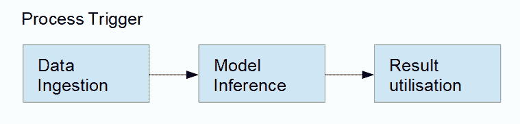
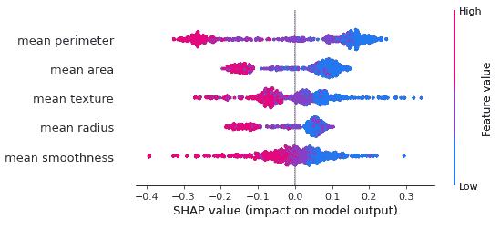
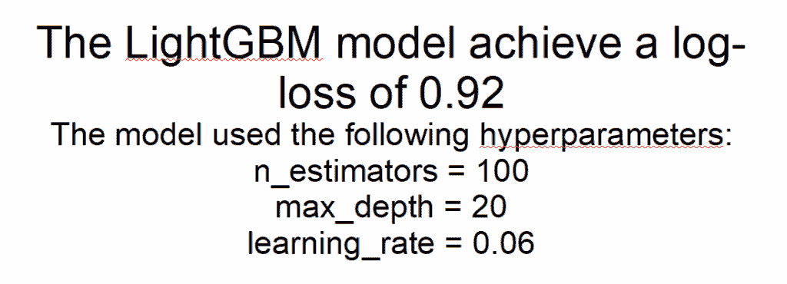
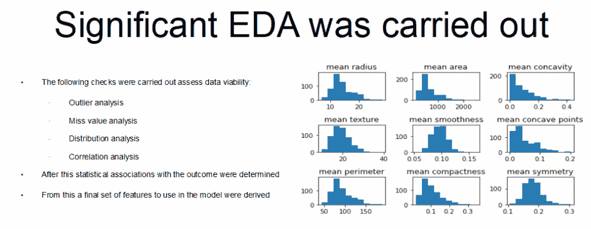
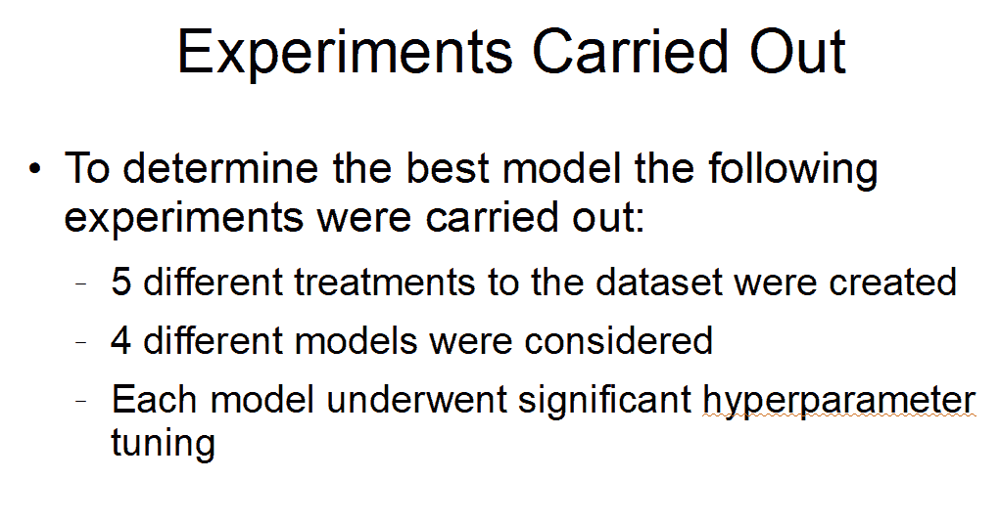

# 与利益相关者建立成功的关系

> 原文：[`towardsdatascience.com/building-a-successful-relationship-with-stakeholders-2/`](https://towardsdatascience.com/building-a-successful-relationship-with-stakeholders-2/)

## <mdspan datatext="el1760465182527" class="mdspan-comment">引言</mdspan>

作为数据科学家，你的工作是利用数据来解决业务问题并创造价值，通常是通过构建模型。这通常涉及运行一系列实验，其中许多想法被迭代，直到选择最佳解决方案作为商业提案的一部分。评估最佳模型通常是通过最小化或最大化某些性能指标来完成的，例如回归模型的均方误差或二元分类模型的 F1 分数。

然而，创建一个模型只是整体过程中的一个部分。围绕你的模型有两个重要的问题，即你的解决方案是否解决了原始问题，以及它能为业务带来多少利益。这些问题只能由你的项目利益相关者回答，因为他们设定了需求和成功标准。在理想的世界里，这些应该是明确定义的，但这种情况往往并不成立。可能需求在本质上相当模糊和广泛，有时只是简单地尝试防止客户流失或保护客户免受欺诈。在这种情况下，数据科学家和利益相关者将不得不共同努力来更好地细化这些问题，并定义成功意味着什么。为了做到这一点，他们必须达成共识，否则可能会导致沟通不畅和摩擦，这最终会导致项目失败。

在我的职业生涯中，我看到了利益相关者和数据科学家彼此说着不同的语言，一个面向业务，另一个面向数据。这种后果是，好的项目未能达到预期，未能获得应有的热情，导致它们无法部署。我相信，要成为一名伟大的数据科学家，你必须能够弥合业务和技术之间的差距。通过展示你的解决方案对业务成果的影响以及从中可以获得什么来获得利益相关者的支持是关键。在这篇文章中，我想概述一些帮助我在与更广泛的业务互动时提高沟通能力的理念。

## 翻译需求并报告性能

新项目的开始是一个繁忙的时期，有很多启动会议，汇集团队成员，以及设置访问要求等等。然而，作为数据科学家，你可能没有参与决定项目最初需求的那一部分。这是由利益相关者、产品所有者等成员完成的，通常是组织的管理层。这意味着在数据科学家加入之前，项目的高层次目标就已经确定。

由于需求已经确定，数据科学家可能会直接进入实验过程，而没有充分关注项目的目标。他们知道其总体目标，认为这足以让他们前进。然而，在这个时候花时间将业务问题细化为一组非常明确的需求至关重要。这确保了：

+   数据科学家和更广泛的业务之间没有歧义

+   对要解决的问题有清晰的理解

+   有明确的指标可以定义是否实现了目标

例如，让我们回到一个利益相关者想要保护客户免受欺诈的早期请求。这样的请求可能有多种可能的途径，而细化这一需求是确保你的项目达到目标的关键。因此，安排会议以允许提出后续问题至关重要。以下是一些例子：

+   我们是希望防止欺诈发生，还是通知客户他们处于风险之中？

+   我们是希望得到是/否的答案，还是更细致的答案？

+   我们是否希望决策更加自主，或者希望增强现有流程？

+   解决方案将多久执行一次？是离线批量还是在线实时？

+   我们是否需要了解任何运营限制？

例如，要求实时欺诈防御解决方案与预测客户在接下来的 30 天内可能面临欺诈风险非常不同。提出这些问题将帮助你找到你想要进一步调查的解决方案。

推理数据只是链条中的一步。图由作者提供。

项目实验的结束可能和开始一样忙碌。在这个时候，你需要选择你的最佳方案，并向业务部门展示。这是至关重要的，因为不能保证你的方案会被接受，并继续向前发展，最终成为新产品。将任何新的流程，如模型，投入实际状态都会带来成本，这些成本必须与收益相权衡。需要考虑谁负责其部署和监控，以及如果其性能不再满足要求时的维护。你需要考虑负面结果可能发生的频率，它们的潜在严重性，以及由此产生的任何后果。你可能需要考虑你的新流程引入的任何额外的运营影响。考虑一个欺诈检测平台，你需要思考：

+   你的检测器会错过多少欺诈交易？

+   你的检测器会错误地将真实交易分类为欺诈，并影响客户的情况会有多频繁？

+   将被标记为欺诈的交易总量是多少，并且是否有足够的运营能力调查所有这些事件？

为了克服任何疑虑或误解，你需要能够推销你的解决方案，仅仅构建它是不够的。在展示你的解决方案时，你应该：

### 从问题开始，而不是从技术开始

专注于你解决方案的技术专长，比如使用的模型或数据处理流程，是很诱人的。这就是你过去几个月的生活所在，你想要展示你已经非常努力地解决了这个问题。因此，当你向利益相关者展示时，你可能会倾向于谈论如何使用独热编码，执行均值插补，并使用 Optuna 库对 LightGBM 模型进行超参数调整。

这个问题的症结在于，利益相关者的优先级不是模型如何工作，而是它能做什么。他们关心的是业务问题是如何被回答的，以及可以从中获得什么好处。在这种情况下，我们需要重新思考我们如何呈现我们的结果，使其面向业务，并关注我们的解决方案解决了什么问题，而不是它是如何解决的。因此，我们应该少说一些像以下这样的句子：

> 我们开发了一个用于欺诈检测的 LightGBM 二分类模型

以及更多类似的情况

> 我们提出的解决方案提高了我们当前系统检测欺诈的能力

### 业务与模型性能

关于上述观点，过于关注报告模型性能是很常见的。像 F1、AUC 等指标提供了一个客观的方式来决定哪个模型最好，并且你希望将这些信息传达给利益相关者。对于数据科学家来说，0.8 的召回率和 0.9 的召回率之间的差异是显而易见的。

然而，对于利益相关者来说，模型的表现并不能告诉他们解决方案能为业务带来什么价值。他们需要知道它将对当前流程和程序产生什么影响。因此，数据科学家应该用业务层面的关键绩效指标来阐述模型的表现。一个好的想法是始终考虑：

它能赚钱、省钱还是节省时间？如果是的话，能节省多少？

明确量化你的解决方案带来的好处将有助于推动参与度，并极大地增加其被采用的机会。因此，我们应该少说：

> 我们的 LightGBM 模型实现了 0.9 的召回率

以及更多：

> 我们的解决方案每年可以检测到价值 1000 万英镑的欺诈行为

### 永远不要忽视可解释性

能够理解和证明你的解决方案为何做出这些决策，这对于与利益相关者建立信任至关重要。例如，如果你正在实施一个围绕接受抵押贷款申请的解决方案，那么在客户质疑这一决策时，能够证明为什么申请被拒绝是至关重要的。这也确保了模型没有吸收任何可能导致法律或监管问题的偏见或偏见。

可解释性还可以提供感觉检查或甚至挑战关于哪些信息有用的先入之见。所有这些都意味着在整个过程中嵌入可解释性可以给关心和考虑过问题的利益相关者提供保证。需要遵守的关键点是：

+   能够说出模型依赖哪些特征

+   能够用其特征来解释一个决策

这意味着要么坚持使用具有良好可解释性的模型（回归、决策树等），要么依赖第三方可解释性库（SHAP、LIME 等）。

知道为什么是关键。图片由作者提供。

## 以最大化参与度的方式展示结果

实验结束后，你已经选择了你的解决方案，下一步就是与利益相关者分享你的结果，以便他们批准。这通常以演示文稿的形式进行，你需要阐述问题并展示为什么你的解决方案是正确的选择。这是一个关键点，你必须能够与你的利益相关者进行清晰沟通。我见过一些好的提案因为演示文稿未能吸引观众甚至更糟糕的是让他们感到厌烦而失败。设计一个引人入胜的演示文稿是艺术和技能的结合，这是你需要积极工作的。

一些应该作为指导原则的一般性建议是：

### 了解你的受众和目标

当你开始撰写演示文稿时，你需要问自己：

> 我在尝试销售什么，我要把它卖给谁？

虽然仅仅为了展示你的工作而有一个演示有其价值，但如果你试图为你的项目争取支持，那么你应该专注于你试图传达的观点。试图在单个演示中涵盖太多内容会导致混乱，并可能导致你的整体信息被稀释。你应该问自己“我想让我的观众了解哪一件事”然后围绕这一点来构建你的演示

了解你观众的技伎和项目知识水平会影响你决定如何传达你的信息。如果你的利益相关者对主题非常熟悉，那么可以假设有背景知识。但如果不熟悉，那么你需要真正思考什么可以假设，什么不可以假设，以确保所有相关人员都能理解你的信息。如果你的利益相关者拥有更技术性的技能集，那么在方法上可以提供更多细节，但我建议尽量保持简洁。如前所述，我们想要强调项目的商业效益。

考虑你的观众需要了解什么。图片由作者提供。

### 风格很重要

能够跟随一个演示依赖于很多因素。你的观众必须同时听你说话并查看屏幕上的内容，因此你的演示风格将对他们的这种能力产生巨大影响。在设计演示时，以下这些技巧帮助我最大化其影响力：

+   使用主题：无论是来自你的公司还是来自股票网站，拥有预设的色彩方案、字体大小等都会产生很大影响

+   使用分区来引导视线：将重要点放在彩色框中可以帮助引导观众通过你的幻灯片

+   不要在文本和视觉上过度：不要写观众无法阅读的段落，并保持图表等视觉元素大而简洁

信息过载可能会让听众感到厌烦和困惑。图片由作者提供。

### 全是杀手，没有填充物

与利益相关者互动时，你的时间有限。你需要产生影响并吸引他们的注意力，同时向他们推销你的解决方案。因此，你需要找到背景、理论、解决方案和影响之间的平衡。所以你需要确保每一张幻灯片都能提供有用的信息。一些实现方式包括：

+   从结果开始：这不是一个神秘小说，最终会有一个重大揭露，要展示你的最佳状态，明确说出你正在销售的内容

+   使用标题来产生影响力：标题是幻灯片内容的总结，应该提供最重要的信息

+   以身作则：如果你试图解释事物是如何工作的，使用数据来支持你的观点。不要停留在抽象层面

时间有限，所以要充分利用。信息是基于需要知道的。图片由作者提供。

## 结论

在本文中，我讨论了与利益相关者互动的重要性，以帮助展示所提出的数据科学解决方案的价值。在您的工作中细化需求并以业务影响为导向可以确保您的结果易于解释并可采取行动。所有这些都体现在创建一个引人入胜且知识丰富的演示文稿中，作为一种向利益相关者展示您可以将需求转化为可执行成果的手段。
