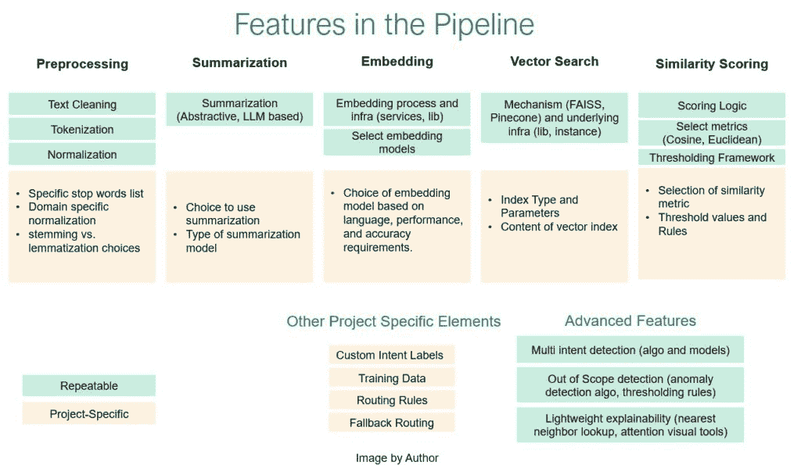

# 构建统一的意图识别引擎

> 原文：[`towardsdatascience.com/building-a-unified-intent-recognition-engine/`](https://towardsdatascience.com/building-a-unified-intent-recognition-engine/)

<mdspan datatext="el1758048011087" class="mdspan-comment">在人工智能驱动的</mdspan>系统中，理解用户意图是基本的，尤其是在我运营的客户服务领域。然而，在企业团队中，意图识别往往发生在孤岛中，每个团队为不同的产品构建定制的管道，从故障排除助手到聊天机器人和问题分类工具。这种冗余减缓了创新，并使扩展成为挑战。

## 在系统错综复杂中找出一个模式

在人工智能工作流程中，我们观察到一种模式——许多项目，尽管服务于不同的目的，但都涉及到理解用户输入并将它们分类为标签。每个项目都是独立地处理，有一些变化。一个系统可能将 FAISS 与 MiniLM 嵌入和 LLM 摘要配对用于热门话题，而另一个将关键词搜索与语义模型混合。虽然单独有效，但这些管道共享底层组件和挑战，这是合并的理想机会。

我们将它们梳理出来，并意识到它们都归结为同一个基本模式——清理输入，将其转换为嵌入，搜索相似示例，评分相似度，并分配标签。一旦你看到了这一点，就会觉得显而易见：为什么一遍又一遍地重建相同的管道？难道不是更好创建一个模块化系统，不同团队可以根据自己的需求进行配置，而不需要从头开始？这个问题让我们走上了我们现在称之为统一意图识别引擎（UIRE）的道路。

认识到这一点后，我们看到了一个机会。与其让每个团队构建一个一次性解决方案，我们不妨标准化核心组件，比如预处理、嵌入和相似度评分，同时为每个产品团队留出足够的灵活性，让他们可以插入自己的标签集、业务逻辑和风险阈值。这个想法成为了 UIRE 框架的基础。

## 为重用而设计的模块化框架

在其核心，UIRE 是一个由可重用部分和特定项目插件组成的可配置管道。可重用组件保持一致——文本预处理、嵌入模型、向量搜索和评分逻辑。然后，每个团队可以在其基础上添加自己的标签集、路由规则和风险参数。

这里是流程通常看起来是什么样的：

**输入 → 预处理 → 摘要 → 嵌入 → 向量搜索 → 相似度评分 → 标签匹配 → 路由**

我们这样组织组件：

+   **可重复组件：** 预处理步骤（如果需要）、摘要、嵌入和向量搜索工具（如 MiniLM、SBERT、FAISS、Pinecone）、相似度评分逻辑、阈值调整框架等。

+   **项目特定元素**：自定义意图标签、训练数据、业务特定的路由规则、根据风险调整的置信度阈值，以及可选的 LLM 总结选择。

这里有一个视觉表示来表示这一点：

这种设置的附加值几乎立即显现出来。在一个案例中，我们重新利用了一个现有的管道来解决一个新的分类问题，并在两天内将其投入使用。这通常需要我们从头开始构建时几乎两周的时间。这种先发优势意味着我们可以花更多的时间提高准确性、识别边缘情况以及尝试配置，而不是搭建基础设施。

更好的是，这种设计自然而然地具有前瞻性。如果一个新项目需要多语言支持，我们可以插入一个像 Jina-Embeddings-v3 这样的模型。如果另一个产品团队想要对图像或音频进行分类，通过更换嵌入模型，相同的向量搜索流程也可以在那里工作。核心保持不变。

## 将框架转变为持续增长的活库

统一引擎的另一个优点是建立共享的、活库的潜力。随着不同团队采用框架，他们的定制包括新的嵌入模型、阈值配置或预处理技术，可以贡献回一个公共库。随着时间的推移，这种集体智慧将产生一个全面的企业级最佳实践工具包，加速采用和创新。

这消除了许多企业中普遍存在的“孤岛系统”的常见困境。好主意被困在个别项目中。但有了共享的基础设施，实验、相互学习和稳步提升整体系统变得容易得多。

## 为什么这种方法很重要

对于拥有多个正在进行中的 AI 项目的大型组织，这种模块化系统提供了许多优势：

+   避免重复的工程工作并减少维护开销

+   加快原型设计和扩展，因为团队可以混合和匹配预构建的组件

+   让团队专注于真正重要的事情——提高准确性、细化边缘情况、微调体验，而不是重建基础设施

+   使其更容易扩展到新语言、业务领域，甚至图像和音频等数据类型

这种模块化架构与 AI 系统设计的发展方向相吻合。Sung 等人（2023 年）、Puig（2024 年）和 Tang 等人（2023 年）的研究突出了基于嵌入的可重复使用管道在意图分类中的价值。他们的工作表明，基于向量工作流程构建的系统比传统的单一分类器更具可扩展性、适应性和易于维护。

## 处理现实场景的高级功能

当然，现实世界的对话很少遵循干净、单一意图的模式。人们会提出混乱、层次分明、有时含糊不清的问题。这正是这种模块化方法真正发光的地方，因为它使得添加高级处理策略变得更加容易。你可以一次性构建这些功能，它们可以在其他项目中重复使用。

+   当查询同时询问多个问题时，进行多意图检测

+   检测超出范围的输入并标记它们，将它们路由到人工或备用答案

+   通过检索向量空间中最近邻的示例来解释决策是如何做出的，实现轻量级可解释性

这样的功能有助于 AI 系统保持可靠性，并减少最终用户在使用过程中的摩擦，即使产品扩展到越来越不可预测、高变异性环境中。

## 结束语

统一意图识别引擎与其说是一个打包的产品，不如说是一种智能扩展 AI 的实用策略。在开发这个概念时，我们认识到项目是独特的，部署在不同的环境中，需要不同级别的定制。通过提供具有大量灵活性的预构建组件，团队可以更快地移动，避免重复工作，并交付更智能、更可靠的系统。

根据我们的经验，这种设置的运用产生了有意义的成果——更快的部署时间、减少在冗余基础设施上的时间浪费，以及更多专注于准确性和具有大量未来进步潜力的边缘案例的机会。随着 AI 驱动的产品在各个行业中的不断增多，这样的框架可能成为构建可扩展、可靠和灵活系统的必要工具。

### 关于作者

Shruti Tiwari 是戴尔科技公司的 AI 产品经理，在那里她领导使用生成式 AI、代理框架和传统 AI 来提升企业客户支持的人工智能项目。她的工作在 VentureBeat、CMSWire 和 Product Led Alliance 上有所展示，并且她指导专业人士构建可扩展和负责任的 AI 产品。

Vadiraj Kulkarni 是戴尔科技公司的数据科学家，专注于构建和部署用于企业客户服务的多模态 AI 解决方案。他的工作涵盖了生成式 AI、代理式 AI 和传统 AI，以改善支持结果。他的工作在 VentureBeat 上发表，讨论了在多模态应用中应用代理框架。

### 参考文献：

1.  Sung, M., Gung, J., Mansimov, E., Pappas, N., Shu, R., Romeo, S., Zhang, Y., & Castelli, V. (2023). *预训练意图感知编码器用于零样本和少样本意图分类*. arXiv 预印本 arXiv:2305.14827. [`arxiv.org/abs/2305.14827`](https://arxiv.org/abs/2305.14827)

1.  Puig, M. (2024). *使用嵌入掌握意图分类：质心、神经网络和随机森林*. Medium. [`medium.com/@marc.puig/mastering-intent-classification-with-embeddings-34a4f92b63fb`](https://medium.com/@marc.puig/mastering-intent-classification-with-embeddings-34a4f92b63fb)

1.  Tang, Y.-C., Wang, W.-Y., Yen, A.-Z., & Peng, W.-C. (2023). *RSVP: 通过代理响应对比和生成预训练的客户意图检测*. arXiv 预印本 arXiv:2310.09773. [`arxiv.org/abs/2310.09773`](https://arxiv.org/abs/2310.09773)

1.  Jina AI GmbH. (2024). *Jina-Embeddings-v3 发布：一个多语言多任务文本嵌入模型*. arXiv 预印本 arXiv:2409.10173. [`arxiv.org/abs/2409.10173`](https://arxiv.org/abs/2409.10173)
