# 使用 FastAPI、PostgreSQL 和 Render 构建视频游戏推荐系统：第二部分

> 原文：[`towardsdatascience.com/building-a-video-game-recommender-system-with-fastapi-postgresql-and-render-part-2/`](https://towardsdatascience.com/building-a-video-game-recommender-system-with-fastapi-postgresql-and-render-part-2/)

## 入门

在 [第一部分](https://towardsdatascience.com/building-video-game-recommender-systems-with-fastapi-postgresql-and-render-part-1) 中，我们介绍了利用 FastAPI 和 PostgreSQL 设置棋盘游戏推荐系统的过程。在第二部分中，我们继续这个项目，并展示如何将此项目部署到云服务，在这种情况下是 Render，使其对用户可访问。

为了让这一切成为现实，我们将设置我们的 PostgreSQL 数据库在 Render 上，用我们的数据填充它，将 FastAPI 应用程序 Docker 化，并最终将其部署到 Render 网络应用中。

## 目录

1.  在 Render 上部署 PostgreSQL 数据库

1.  将 FastAPI 应用作为 Render 网络应用部署

    – Docker 化我们的应用程序

    – 将 Docker 镜像推送到 DockerHub

    – 从 DockerHub 拉取到 Render

## 使用工具

+   Render

+   Docker Desktop

+   Docker Hub

## 在 Render 上部署

现在我们有一个 PostgreSQL 数据库和一个本地运行的 FastAPI 应用程序，是时候将其部署到可以由前端应用程序或最终用户（通过 Swagger）访问的云服务上了。对于这个项目，我们将使用 Render；Render 是一个云平台，对于小型项目来说，它提供的设置体验比 AWS 和 Azure 等大型云服务提供商更为直接。

要开始，请导航到 [Render](https://render.com/) 并创建一个新账户，然后你可以通过选择下面的“新建项目”按钮来创建一个新项目。注意，在撰写本文时，Render 提供了一个试用期，应该允许你在第一个月内免费跟随。我们称这个项目为 fastapi-test，创建后我们将进入该项目。

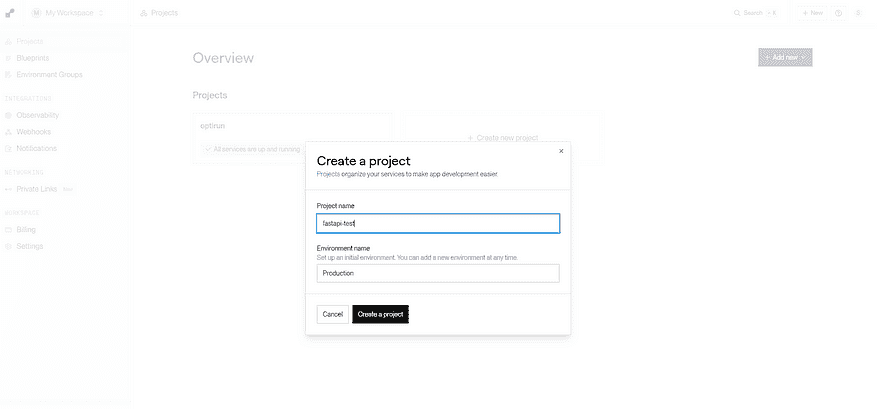

图 2：Render 中的新建项目

每个项目都包含该项目在自包含环境中运行所需的所有内容。在这种情况下，我们需要两个组件：一个数据库和我们的 FastAPI 应用程序的网络服务器。让我们从创建我们的数据库开始。

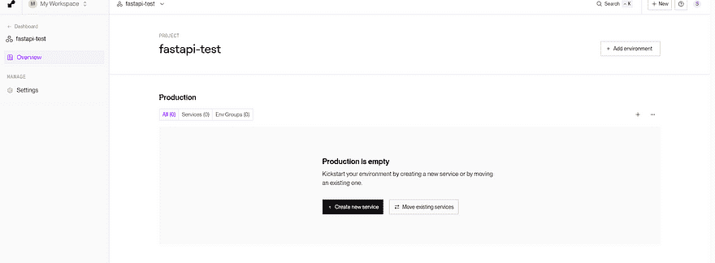

图 3：FastAPI 项目

这非常简单，我们选择如图 3 所示的“创建新服务”，然后选择“Postgres”。随后我们将导航到如图 4 所示的字段来设置数据库。我们命名我们的数据库为“fastapi-database”并选择免费层开始。Render 只允许你在有限的时间内使用免费层的数据库，但对于这个示例来说足够了，如果你需要长期维护数据库，价格非常合理。

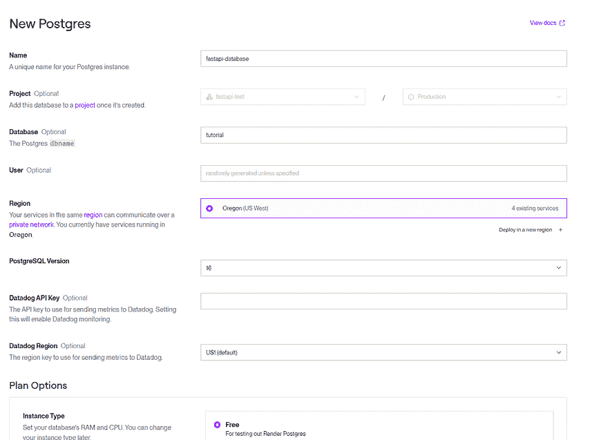

图 4：Render 上的 Postgres 设置

在输入我们的数据库信息并选择“创建”后，设置数据库将花费一分钟时间，随后你会看到如图 5 所示的屏幕。我们将在我们的.env 文件中保存内部数据库 URL 和外部数据库 URL 变量，因为我们需要这些来从我们的 FastAPI 应用程序中进行连接。然后我们可以使用外部数据库 URL 变量（从我们的本地机器连接是在渲染环境之外）来测试我们的数据库连接，并在设置 FastAPI 应用程序之前从我们的本地机器创建表。

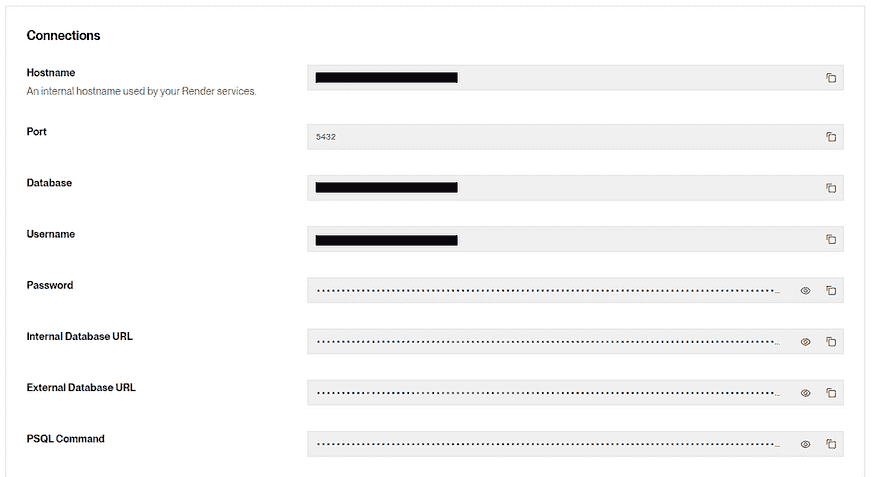

图 5：Render 数据库凭据

我们随后运行我们的测试数据库连接脚本，该脚本尝试使用外部数据库 URL 变量作为连接字符串来连接到我们的数据库并创建一个测试表。请注意，我们的外部数据库 URL 是数据库的完整连接字符串，因此我们可以将其作为单个输入传递。成功的运行应该会输出如图 6 所示的打印结果。

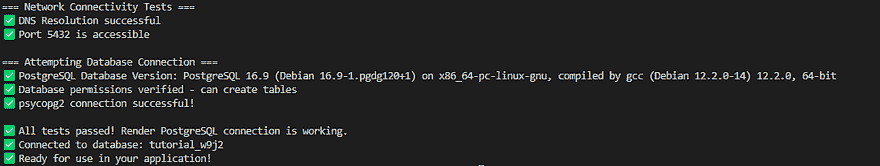

图 6：从我们的本地机器成功连接到数据库

```py
from sqlalchemy import create_engine
from sqlalchemy.orm import sessionmaker, Session
from sqlalchemy.ext.declarative import declarative_base
import os
from dotenv import load_dotenv
from utils.db_handler import DatabaseHandler
import pandas as pd
import uuid
import sys
from sqlalchemy.exc import OperationalError
import psycopg2

# Load environment variables from .env file (override=True reloads changed values)
load_dotenv(override=True)
# loaidng external database URL
database_url = os.environ.get("External_Database_Url")
if not database_url:
    print("❌ External_Database_Url not found in environment variables")
    print("Please check your .env file contains: External_Database_Url=your_render_postgres_url")
    sys.exit(1)
print(f"Database URL loaded: {database_url[:50]}...")
# Parse the database URL to extract components for testing
from urllib.parse import urlparse
import socket
def parse_database_url(url):
    """Parse database URL to extract connection components"""
    parsed = urlparse(url)
    return {
        'host': parsed.hostname,
        'port': parsed.port or 5432,
        'database': parsed.path.lstrip('/'),
        'username': parsed.username,
        'password': parsed.password
    }
db_params = parse_database_url(database_url)
def test_network_connectivity():
    """Test network connectivity to Render PostgreSQL endpoint"""
    print("\n=== Network Connectivity Tests ===")
    # 1\. Test DNS resolution
    try:
        ip_address = socket.gethostbyname(db_params['host'])
        print(f"✅ DNS Resolution successful")
    except socket.gaierror as e:
        print(f"❌ DNS Resolution failed: {e}")
        return False

    # 2\. Test port connectivity
    try:
        sock = socket.socket(socket.AF_INET, socket.SOCK_STREAM)
        sock.settimeout(10)  # 10 second timeout
        result = sock.connect_ex((db_params['host'], int(db_params['port'])))
        sock.close()

        if result == 0:
            print(f"✅ Port {db_params['port']} is accessible")
            return True
        else:
            print(f"❌ Port {db_params['port']} is NOT accessible")
            print("   This might indicate a network connectivity issue")
            return False
    except Exception as e:
        print(f"❌ Port connectivity test failed: {e}")
        return False
# Run connectivity tests
network_ok = test_network_connectivity()
if not network_ok:
    print("\n🔍 TROUBLESHOOTING STEPS:")
    print("1\. Check your internet connection")
    print("2\. Verify the Render PostgreSQL URL is correct")
    print("3\. Ensure your Render PostgreSQL instance is active")
    print("4\. Check if there are any Render service outages")
    sys.exit(1)
print("\n=== Attempting Database Connection ===")
# connect to the database using psycopg2
try:
    conn = psycopg2.connect(
            host=db_params['host'],
            database=db_params['database'],
            user=db_params['username'],
            password=db_params['password'],
            port=db_params['port'],
            connect_timeout=30  # 30 second timeout
        )

    # If the connection is successful, you can perform database operations
    cursor = conn.cursor()

    # Example: Execute a simple query
    cursor.execute("SELECT version();")
    db_version = cursor.fetchone()
    print(f"✅ PostgreSQL Database Version: {db_version[0]}")

    # Test creating a simple table to verify permissions
    cursor.execute("CREATE TABLE IF NOT EXISTS connection_test (id SERIAL PRIMARY KEY, test_time TIMESTAMP DEFAULT NOW());")
    conn.commit()
    print("✅ Database permissions verified - can create tables")

    cursor.close()
    conn.close()
    print("✅ psycopg2 connection successful!")

except psycopg2.OperationalError as e:
    print(f"❌ Database connection failed: {e}")
    if "timeout" in str(e).lower():
        print("\n🔍 TIMEOUT TROUBLESHOOTING:")
        print("- Check your internet connection")
        print("- Verify the Render PostgreSQL URL is correct")
        print("- Check if Render service is experiencing issues")
    elif "authentication" in str(e).lower():
        print("\n🔍 AUTHENTICATION TROUBLESHOOTING:")
        print("- Verify the database URL contains correct credentials")
        print("- Check if your Render PostgreSQL service is active")
        print("- Ensure the database URL hasn't expired or changed")
    sys.exit(1)
except Exception as e:
    print(f"❌ Unexpected error: {e}")
    sys.exit(1)
# If we get here, connection was successful, so exit the test
print(f"\n✅ All tests passed! Render PostgreSQL connection is working.")
print(f"✅ Connected to database: {db_params['database']}")
print("✅ Ready for use in your application!") 
```

## 加载数据库

既然我们已经验证了可以从我们的本地机器连接到数据库，现在是时候设置我们的数据库表并填充它们了。为了加载我们的数据库，我们将使用我们的 src/load_database.py 文件，我们在本文开头已经详细介绍了这个脚本的各个部分，所以这里不会进一步详细说明。唯一值得注意的是，我们再次使用外部数据库 URL 作为连接字符串，然后在最后，我们使用我们在 DatabaseHandler 类中定义的 test_table 函数。这个函数尝试连接到传递给它的表名，并返回该表中的行数。

运行此脚本应该会产生如图 11 所示的输出，其中每个表都已创建，然后在最后我们再次检查我们可以从它们返回数据，并显示输出行与输入行匹配。

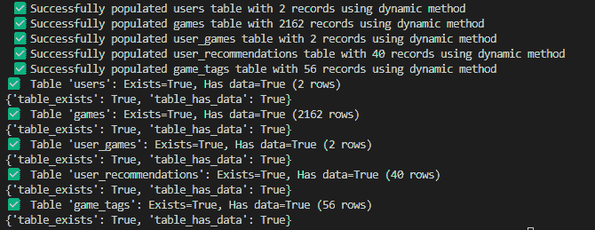

图 7：数据库成功填充

```py
from sqlalchemy import create_engine
from sqlalchemy.orm import sessionmaker, Session
from sqlalchemy.ext.declarative import declarative_base
import os
from dotenv import load_dotenv
from utils.db_handler import DatabaseHandler
import pandas as pd
import uuid
import sys
from sqlalchemy.exc import OperationalError
import psycopg2

# Load environment variables from .env file
load_dotenv(override=True)

# Construct PostgreSQL connection URL for Render
URL_database = os.environ.get("External_Database_Url")

# Initialize DatabaseHandler with the constructed URL
engine = DatabaseHandler(URL_database)

# loading initial user data
users_df = pd.read_csv("Data/steam_users.csv")
games_df = pd.read_csv("Data/steam_games.csv")
user_games_df = pd.read_csv("Data/steam_user_games.csv")
user_recommendations_df = pd.read_csv("Data/user_recommendations.csv")
game_tags_df = pd.read_csv("Data/steam_game_tags.csv")

# Defining queries to create tables
user_table_creation_query = """CREATE TABLE IF NOT EXISTS users (
    id UUID PRIMARY KEY,
    username VARCHAR(255) UNIQUE NOT NULL,
    password VARCHAR(255) NOT NULL,
    email VARCHAR(255) NOT NULL,
    role VARCHAR(50) NOT NULL
    )
    """
game_table_creation_query = """CREATE TABLE IF NOT EXISTS games (
    id UUID PRIMARY KEY,
    appid VARCHAR(255) UNIQUE NOT NULL,
    name VARCHAR(255) NOT NULL,
    type VARCHAR(255),
    is_free BOOLEAN DEFAULT FALSE,
    short_description TEXT,
    detailed_description TEXT,
    developers VARCHAR(255),
    publishers VARCHAR(255),
    price VARCHAR(255),
    genres VARCHAR(255),
    categories VARCHAR(255),
    release_date VARCHAR(255),
    platforms TEXT,
    metacritic_score FLOAT,
    recommendations INTEGER
    )
    """

user_games_query = """CREATE TABLE IF NOT EXISTS user_games (
    id UUID PRIMARY KEY,
    username VARCHAR(255) NOT NULL,
    appid VARCHAR(255) NOT NULL,
    shelf VARCHAR(50) DEFAULT 'Wish_List',
    rating FLOAT DEFAULT 0.0,
    review TEXT
    )
    """
recommendation_table_creation_query = """CREATE TABLE IF NOT EXISTS user_recommendations (
    id UUID PRIMARY KEY,
    username VARCHAR(255),
    appid VARCHAR(255),
    similarity FLOAT
    )
    """

game_tags_creation_query = """CREATE TABLE IF NOT EXISTS game_tags (
    id UUID PRIMARY KEY,
    appid VARCHAR(255) NOT NULL,
    category VARCHAR(255) NOT NULL
    )
    """

# Running queries to create tables
engine.delete_table('user_recommendations')
engine.delete_table('user_games')
engine.delete_table('game_tags')
engine.delete_table('games')
engine.delete_table('users')

# Create tables
engine.create_table(user_table_creation_query)
engine.create_table(game_table_creation_query)
engine.create_table(user_games_query)
engine.create_table(recommendation_table_creation_query)
engine.create_table(game_tags_creation_query)

# Ensuring each row of each dataframe has a unique ID
if 'id' not in users_df.columns:
    users_df['id'] = [str(uuid.uuid4()) for _ in range(len(users_df))]
if 'id' not in games_df.columns:
    games_df['id'] = [str(uuid.uuid4()) for _ in range(len(games_df))]
if 'id' not in user_games_df.columns:
    user_games_df['id'] = [str(uuid.uuid4()) for _ in range(len(user_games_df))]
if 'id' not in user_recommendations_df.columns:
    user_recommendations_df['id'] = [str(uuid.uuid4()) for _ in range(len(user_recommendations_df))]
if 'id' not in game_tags_df.columns:
    game_tags_df['id'] = [str(uuid.uuid4()) for _ in range(len(game_tags_df))]

# Populates the 4 tables with data from the dataframes
engine.populate_table_dynamic(users_df, 'users')
engine.populate_table_dynamic(games_df, 'games')
engine.populate_table_dynamic(user_games_df, 'user_games')
engine.populate_table_dynamic(user_recommendations_df, 'user_recommendations')
engine.populate_table_dynamic(game_tags_df, 'game_tags')

# Testing if the tables were created and populated correctly
print(engine.test_table('users'))
print(engine.test_table('games'))
print(engine.test_table('user_games'))
print(engine.test_table('user_recommendations'))
print(engine.test_table('game_tags'))
```

## 在 Render 上部署 FastAPI 应用程序

我们现在已经在 render 上部署了项目的前半部分，是时候设置我们的 FastAPI 应用程序了。为此，我们将使用 Render 的 Web 应用程序托管服务，这将允许我们将 FastAPI 应用程序作为可以由外部服务访问的 Web 应用程序进行部署。如果我们想构建一个全栈应用程序，我们就可以允许我们的前端向 Render 上的 FastAPI 应用程序发送请求，并将数据返回给用户。然而，因为我们目前不感兴趣构建前端组件，所以我们将通过 Swagger 文档与我们的应用程序交互。

## 使用 Docker 容器化我们的应用程序

我们已经在本地环境中设置了 FastAPI 项目，但现在我们需要将包含所有代码、依赖项和环境变量的项目转移到 Render 上的一个容器中。这可能是一个艰巨的挑战。幸运的是，Docker 处理了所有复杂的部分，并允许我们通过一个简单的配置文件和几个命令来完成这项工作。对于那些还没有使用过 Docker 的人来说，这里有一个很好的教程[在这里](https://www.youtube.com/watch?v=b0HMimUb4f0)。简要概述是，Docker 是一个工具，通过允许我们将应用程序及其所有依赖项打包成一个镜像，然后将其部署到像 Render 这样的服务中，从而简化了应用程序的部署和管理过程。在这个项目中，我们使用 DockerHub 作为我们的镜像仓库，它作为我们的镜像的中央版本控制存储区域，然后我们可以将其拉入 Render。

我们这个项目的整体流程可以想象成这样：本地运行的 FastAPI 应用 → 使用 Docker 进行快照并存储为 Docker 镜像 → 将该镜像推送到 DockerHub → Render 拉取该镜像并使用它启动一个容器，在 Render 服务器上运行应用程序。要开始这个过程，我们将在下一部分进行讲解，需要安装 Docker Desktop。Docker 有一个简单的安装过程，您可以从这里开始：[`www.docker.com/products/docker-desktop/`](https://www.docker.com/products/docker-desktop/)

此外，如果您还没有，您将需要一个 Docker Hub 账户，因为这个账户将作为保存 Docker 镜像的仓库，然后将其拉入 Render。您可以在[这里](https://hub.docker.com/)创建 Docker Hub 账户。

## 构建 Docker 镜像

要为我们的项目创建 Docker 镜像，首先确保 Docker Desktop 正在运行；如果没有运行，在尝试创建 Docker 镜像时可能会遇到错误。要确保它正在运行，从您的搜索栏或桌面打开 Docker Desktop 应用程序，点击如图下方的左下角的三个点，并确保您看到绿色的点后跟“Docker Desktop 正在运行”。

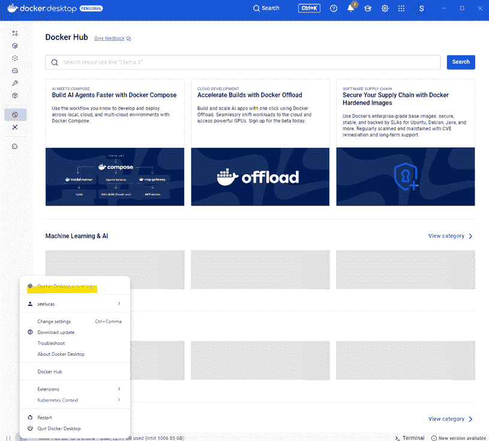

图 8：Docker Desktop 正在运行

接下来，我们需要告诉 Docker 如何构建我们的镜像，这是通过定义一个 Dockerfile 来完成的。我们的 Dockerfile 如图 9 所示。我们将其保存在顶级目录中，它提供了告诉 Docker 如何将我们的应用程序打包成可以在不同硬件上部署的镜像的指令。让我们浏览这个文件来了解它在做什么。

1.  FROM: 选择基础镜像：我们 Dockerfile 中的第一行指定了我们想要用于扩展应用程序的基础镜像。在这种情况下，我们使用的是 python:3.13-slim-bullseye 镜像，这是一个基于 Debian 的轻量级镜像，将作为我们应用程序的基础。

1.  WORKDIR：更改工作目录：在这里我们设置容器内的默认目录为/app

1.  RUN：检查系统依赖项的更新

1.  COPY：复制 requirements.txt 文件，确保 requirements.txt 是最新的，并且包含项目所需的所有库，否则当我们尝试启动镜像时，镜像将无法正确运行

1.  RUN：安装我们的 requirements.txt 文件

1.  COPY：将我们的整个项目从本地目录复制到我们在步骤 2 中创建的/app

1.  RUN：在/app/logs 创建日志目录

1.  EXPOSE：记录我们将要公开的端口是 8000

1.  ENV：设置我们的 Python 路径为/app

1.  CMD：使用 Uvicorn 运行我们的 FastAPI 应用，将我们的应用设置为 src.main:app 中定义的应用，在端口 8000 上运行我们的应用

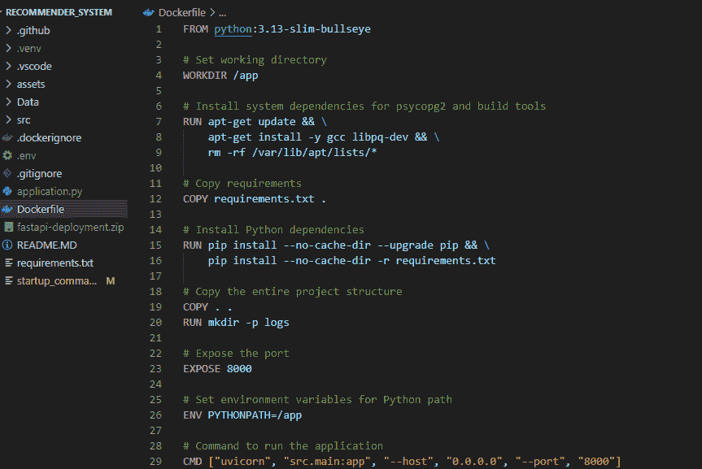

图 9：Dockerfile

定义了 Dockerfile 后，我们现在有一组指令可以提供给 Docker，将我们的应用程序容器化成一个镜像，然后我们可以将其推送到 Docker Hub。现在我们可以通过 VS Code 终端中的几个命令来完成这个操作，如下所示。每行都需要在 VS Code 终端中从项目的顶级目录单独运行。

1.  首先，我们构建我们的 Docker 镜像，这可能会花费一分钟左右。在这个例子中，我们命名我们的镜像为‘recommendersystem’

1.  接下来，我们标记我们的镜像，这里的语法是 image_name user_name/docker_hub_folder:image_name_on_dockerhub

1.  最后，我们再次将我们的镜像推送到 Dockerhub，指定 user_name/docker_hub_folder:image_name_on_dockerhub

```py
docker build -t recommendersystem .
docker tag recommendersystem seelucas/fastapi_tutorial:fastapi_on_render
docker push seelucas/fastapi_tutorial:fastapi_on_render
```

完成这些操作后，我们应该能够登录到 DockerHub，导航到我们的项目，并看到我们有一个与我们之前 3 条命令中给出的名称匹配的镜像，在这个例子中，是 fastapi_on_render。

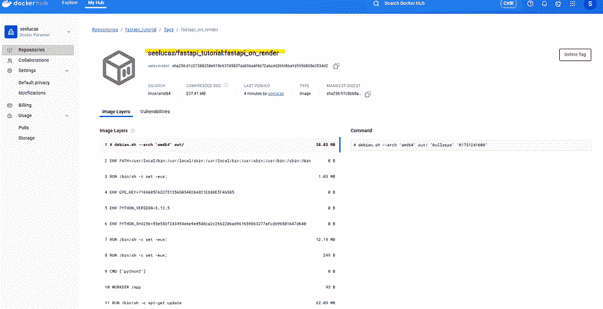

图 10：Dockerhub 上的 Docker 镜像

## 拉取 Docker 镜像到 Render

现在我们已经在 DockerHub 上有了我们的 Docker 镜像，是时候在 Render 上部署这个镜像了。这可以通过导航到我们创建数据库的相同项目，“fastapi-test”，在右上角选择“新建”，然后选择“Web 服务”来实现，因为我们的 FastAPI 应用将被部署为一个 Web 应用。

因为我们要从 Dockerhub 部署我们的镜像，所以我们指定源代码是一个现有镜像，如图 11 所示，我们将 Dockerhub 目录路径粘贴到我们想要部署的镜像的“镜像 URL”中。然后我们收到一个通知，说明这是一个私有镜像，这意味着我们需要创建一个 Dockerhub 访问令牌，然后我们可以使用它安全地从 DockerHub 将镜像拉取到 Render 中。

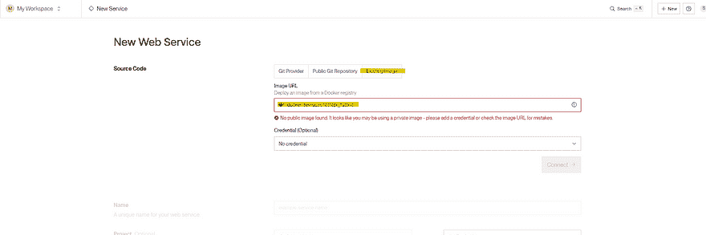

图 11：Render 上的 Docker 镜像

幸运的是，创建 DockerHub 访问令牌非常简单；我们导航到我们的 DockerHub 账户 -> 设置 → 个人访问令牌。屏幕应该看起来像图 12。我们提供访问令牌名称、过期日期和权限。由于我们要将镜像拉入 Render，我们只需要读取权限，而不是写入或删除，所以我们选择那个选项。

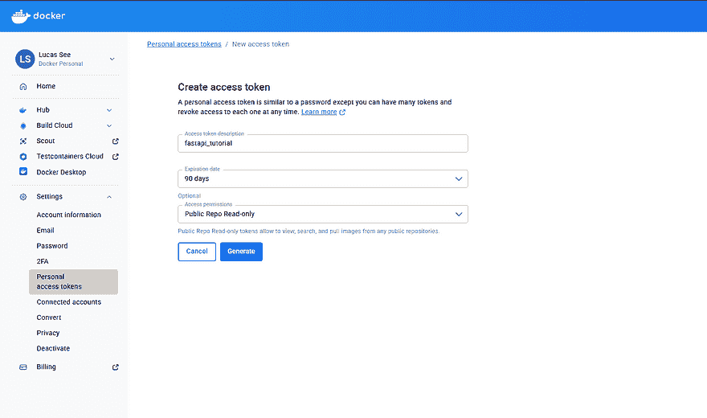

图 12：为 Dockerhub 创建个人访问令牌

最后，选择“生成”将生成我们的令牌，然后我们需要将其复制到 render 并如图 13 所示输入。

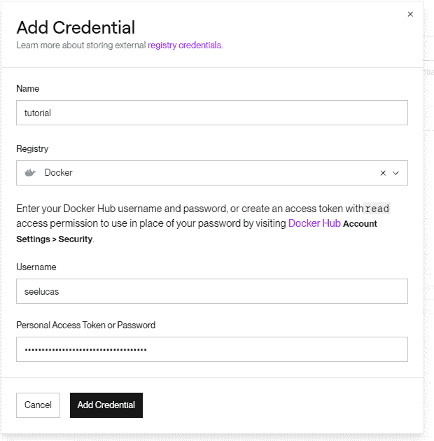

图 13：Render 上的 Docker 凭据

一旦我们选择了如上所示的“添加凭据”，它将加载一分钟以保存凭据。然后我们将返回到上一个屏幕，在那里我们可以选择用于连接 DockerHub 的凭据。在这种情况下，我们将使用我们刚刚创建的教程凭据并选择连接。然后我们将建立一个连接，我们可以使用它从 DockerHub 将 Docker 镜像拉到 Render 以进行部署。

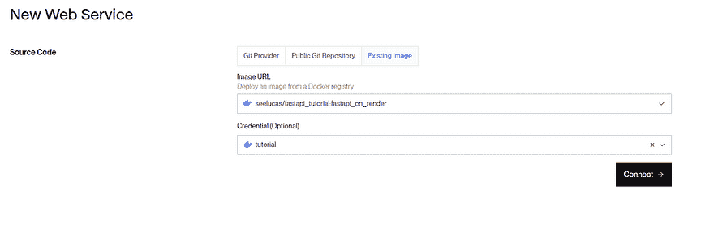

图 14：具有有效凭据的 Render Web 服务

在下一页，我们通过选择免费选项来设置我们的 Render Web 应用程序，并且非常重要的一点是在环境变量中，我们将我们的 .env 文件复制并粘贴。虽然我们在这个文件中不使用所有变量，但我们确实使用了“Internal_Database_Url”，这是 FastAPI 在我们的 main.py 文件中寻找的 URL。没有这个，我们将无法连接到我们的数据库，所以提供这个信息是至关重要的。注意：为了测试，我们之前使用了“External_Database_Url”，因为我们是从本地机器运行脚本的，这是 Render 环境的外部；然而，在这里数据库和 Web 服务器都在同一个 Render 环境中，所以我们使用 main.py 中的 Internal_Database_Url。

在输入我们的环境变量后，我们然后选择“部署 Web 服务”。

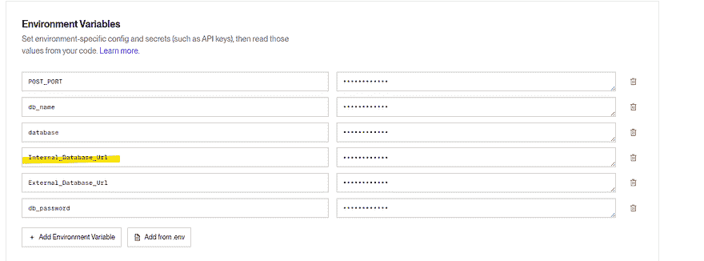

图 15：添加到 Render Web 应用的环境变量

服务将需要几分钟来部署，但随后你应该会收到如下通知，表明服务已部署，顶部有一个我们可以访问的 render 链接。

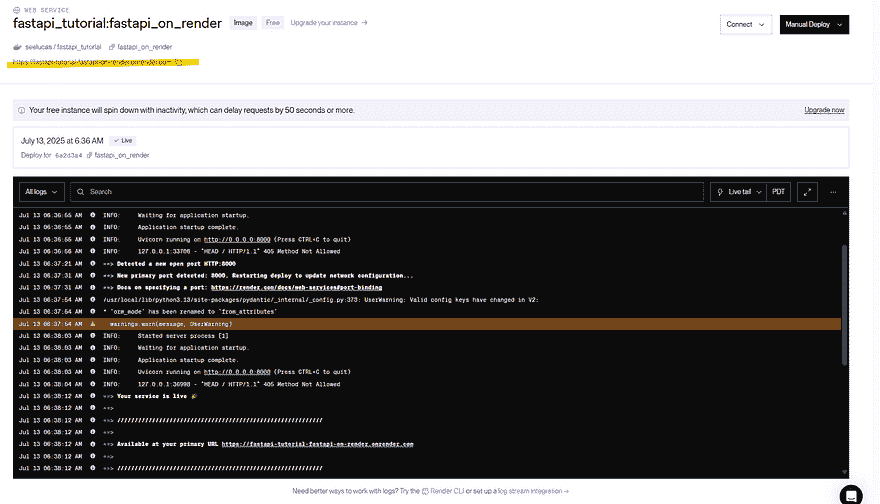

图 16：Web 应用在 Render 上部署

通过此链接导航将带我们到 Hello World 方法，如果我们将其末尾添加 /docs，我们将被带到图 17 中的 Swagger 文档。在这里，我们可以通过使用获取所有用户方法来测试和确保我们的 FastAPI Web 应用已连接到我们的数据库。下面我们可以看到这确实返回了数据。

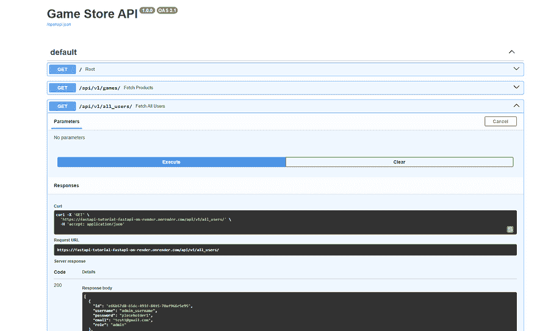

图 17：Render 上 FastAPI 的 Swagger 文档

最后，我们想要检查我们的用户推荐系统是否能够动态更新。在你之前的 API 调用中，我们可以看到数据库中有一个名为‘user_username’的用户。使用这个用户名调用获取推荐游戏的方法，我们可以看到最匹配的游戏 appid 为 B08BHHRSPK。

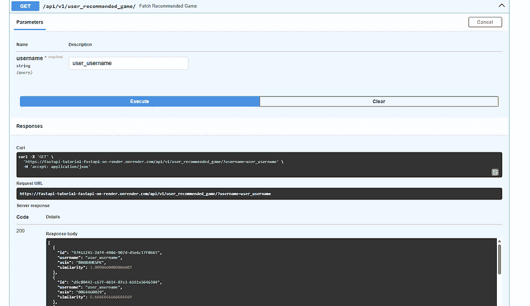

图 18：更新前的用户推荐

我们通过从我们的游戏 appid = B0BHTKGN7F 中随机选择一个来更新我们用户的喜爱游戏，这个游戏结果是《上古卷轴：天际板游》，并利用我们的 user_games POST 方法。

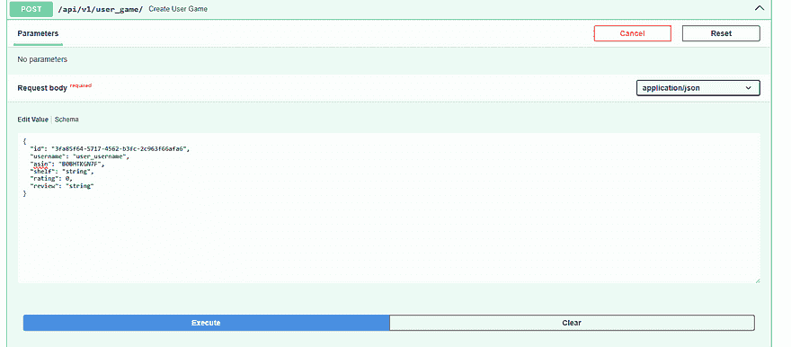

图 19：添加喜爱的桌游

将游戏添加到我们的用户游戏表中应该会自动触发推荐管道为该用户重新运行并生成新的推荐。如果我们导航到我们的控制台，我们可以看到它似乎已经发生，因为我们得到了以下所示的新用户推荐生成消息。

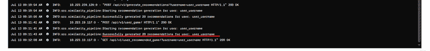

图 20：推荐管道运行的控制台图像

如果我们返回到我们的 Swagger 文档，我们可以再次尝试获取推荐方法，如图 21 所示，我们确实有一个与之前不同的推荐列表。我们的推荐管道现在随着用户添加更多数据而自动更新，并且可以在我们的本地环境之外访问。

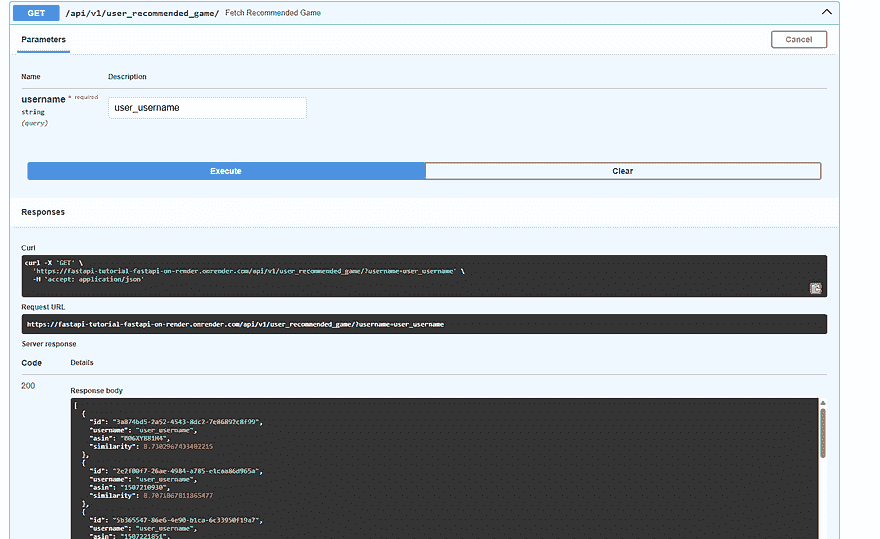

图 21：相似性管道运行后的推荐游戏

## 总结：

在这个项目中，我们展示了如何设置和部署一个利用 FastAPI 交互层与 PostgreSQL 数据库交互的推荐系统，为我们的用户生成智能桌游推荐。我们可以采取进一步的步骤来使这个系统更加健壮，比如在我们获得更多用户数据时实现混合推荐系统或启用用户标记以捕获更多特征。此外，尽管我们没有涉及，但我们确实利用了 GitHub 工作流程，在主分支有新更新时自动重建和推送我们的 Docker 镜像，并且这些代码在 .github/workflows 中可用。这大大加快了开发速度，因为我们不必在每次进行小改动时手动重建我们的 Docker 镜像。

希望您喜欢阅读，并且这有助于您使用 FastAPI 构建和部署您的项目。

领英：[`www.linkedin.com/in/lucas-see-6b439188/`](https://www.linkedin.com/in/lucas-see-6b439188/)

邮箱：[邮箱地址]

**图表**：除非另有说明，所有图像均为作者所有。

**链接：**

1.  项目 GitHub 仓库：[`github.com/pinstripezebra/recommender_system`](https://github.com/pinstripezebra/recommender_system)

1.  FastAPI 文档：[`fastapi.tiangolo.com/tutorial/`](https://fastapi.tiangolo.com/tutorial/)

1.  Docker 教程：[`www.youtube.com/watch?v=b0HMimUb4f0`](https://www.youtube.com/watch?v=b0HMimUb4f0)

1.  Docker Desktop 下载: [`www.youtube.com/watch?v=b0HMimUb4f0`](https://www.youtube.com/watch?v=b0HMimUb4f0)

1.  Docker Hub: [`hub.docker.com/`](https://hub.docker.com/)
