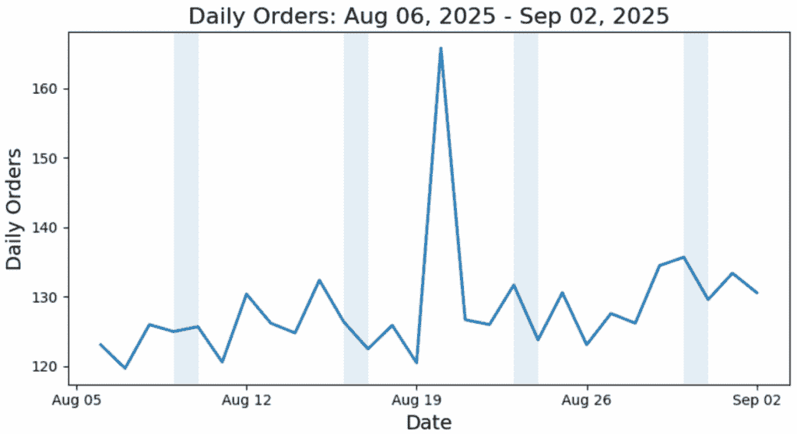
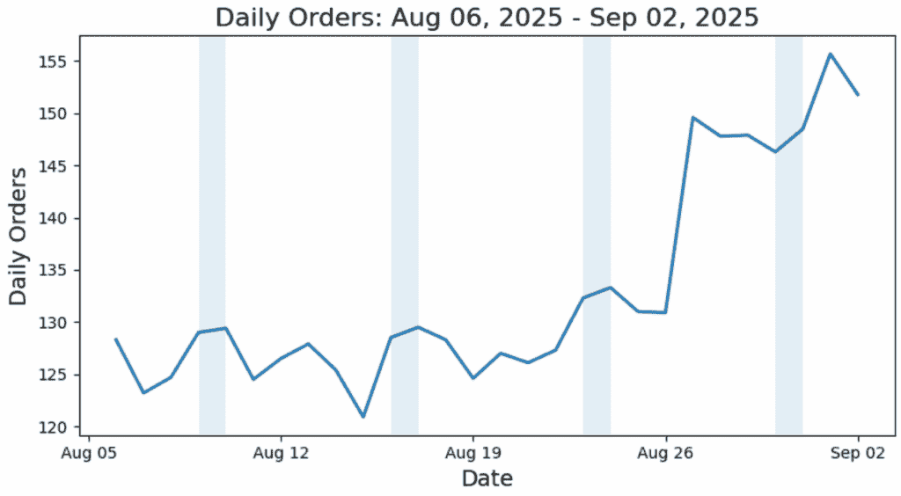
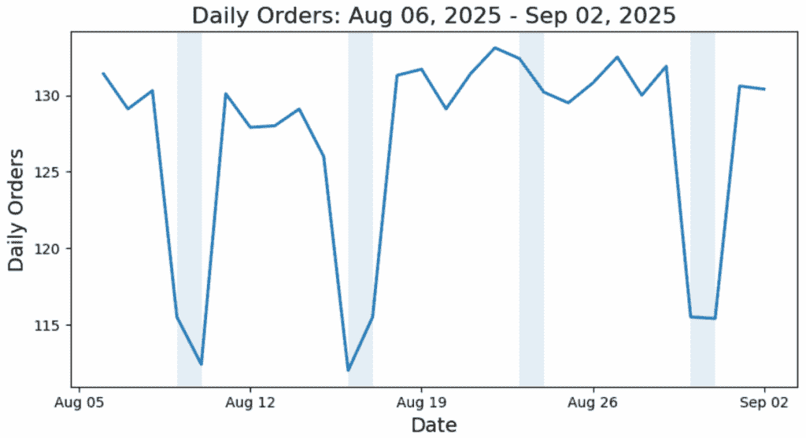
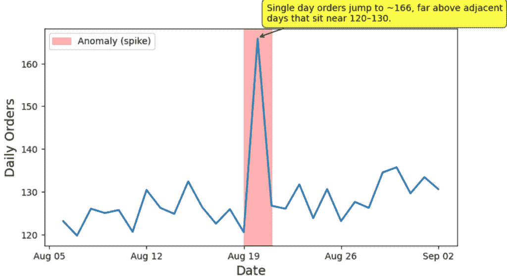
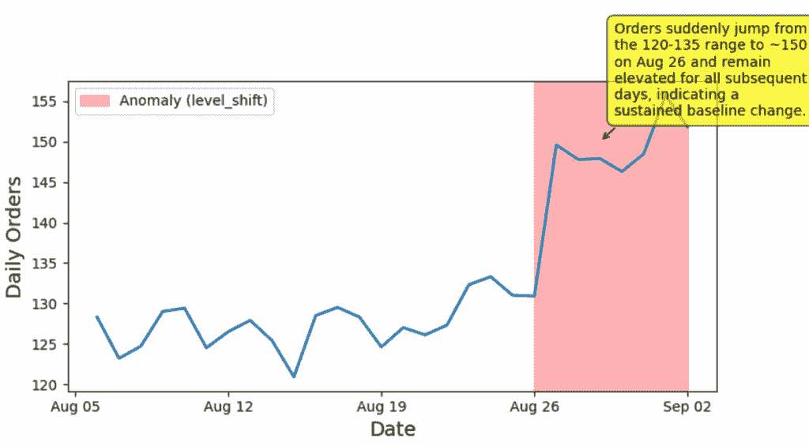
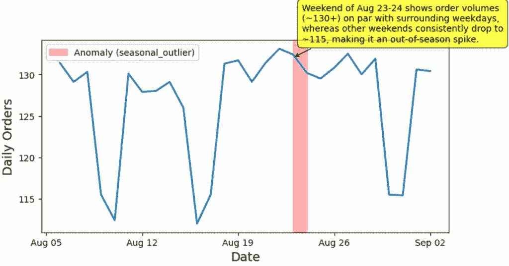

# 构建能够看、思考和整合的 LLM 应用：使用 o3 的多模态输入和结构化输出

> 原文：[`towardsdatascience.com/building-llm-apps-that-can-see-think-and-integrate-using-o3-with-multimodal-input-and-structured-output/`](https://towardsdatascience.com/building-llm-apps-that-can-see-think-and-integrate-using-o3-with-multimodal-input-and-structured-output/)

<mdspan datatext="el1758304545056" class="mdspan-comment">在构建 LLM 应用时</mdspan>，标准的“输入文本，输出文本”范式只能带你走这么远。

真实应用应该能够检查视觉信息，通过复杂问题进行推理，并产生系统实际可用的结果。

在这篇文章中，我们将通过结合三个强大的能力：**多模态输入、推理**和**结构化输出**来设计这个堆栈。

为了说明这一点，我们将通过一个实际操作示例来展示：使用**OpenAI 的 o3 模型**构建一个**时间序列异常检测系统**。具体来说，我们将展示如何将 o3 的推理能力与图像输入相结合，并输出验证过的 JSON，以便下游系统可以轻松消费。

最后，我们的应用将：

+   **查看**：分析电子商务订单量时间序列图表

+   **思考**：识别异常模式

+   **整合**：输出结构化异常报告

你将带走可以用于各种用例的实用代码，这些用例不仅限于异常检测。

让我们深入探讨。

> *想要了解 LLM 在异常检测中应用的更广泛图景？查看我的上一篇文章：**[使用 LLM 增强你的异常检测](https://towardsdatascience.com/boosting-your-anomaly-detection-with-llms/)***，其中我总结了 7 种新兴的应用模式，*不容错过*。

* * *

**1. 案例研究**

在这篇文章中，我们的目标是构建一个异常检测解决方案，用于识别电子商务订单时间序列数据中的异常模式。

对于这个案例研究，我们生成了三套*合成*的每日订单数据。这些数据集代表了大约一个月时间内每日订单的三个不同轮廓。为了使季节性明显，我们用阴影表示了周末。x 轴表示一周中的某一天。



图 1. 数据集 1，阴影区域表示周末。（图片由作者提供）



图 2. 数据集 2，阴影区域表示周末。（图片由作者提供）



图 3. 数据集 3，阴影区域表示周末。（图片由作者提供）

每个图都包含一种特定的异常类型（你能找到它们吗？）。我们稍后将会使用这些图来测试我们的异常检测解决方案，看看它是否能够准确地恢复这些异常。

**2. 我们的解决方案**

**2.1 概述**

与需要繁琐的特征工程和模型训练的传统机器学习方法不同，我们当前的方法要简单得多。它遵循以下步骤：

1.  我们准备图形以可视化电子商务订单时间序列数据。

1.  我们提示推理模型 o3，要求它仔细查看我们提供给它的时序图像，并确定是否存在异常模式。

1.  o3 模型将随后以预定义的 JSON 格式输出其发现。

就这样。简单。

当然，为了提供这个解决方案，我们需要启用 o3 模型以接受图像输入并生成结构化输出。我们很快就会看到如何做到这一点。

**2.2 设置推理模型**

如前所述，我们将使用 o3 模型，这是 OpenAI 的旗舰推理模型，可以以最先进的性能解决复杂的多步骤问题。具体来说，我们将使用 Azure OpenAI 端点来调用该模型。

确保您已经将端点、API 密钥和部署名称放入`.env`文件中，然后我们可以继续设置 LLM 客户端：

```py
import numpy as np
import pandas as pd
import matplotlib.pyplot as plt
import matplotlib.dates as mdates

from openai import AzureOpenAI
from dotenv import load_dotenv
import os

load_dotenv()

# Setup LLM client
endpoint = os.getenv("api_base")
api_key = os.getenv("o3_API_KEY")
api_version = "2025-04-01-preview"
model_name = "o3"
deployment = os.getenv("deployment_name")

LLM_client = AzureOpenAI(
    api_key=api_key,  
    api_version=api_version,
    azure_endpoint=endpoint
)
```

我们将以下说明作为 o3 模型（由 GPT-5 调整）的系统消息：

```py
instruction = f"""

[Role]
You are a meticulous data analyst.

[Task]
You will be given a line chart image related to daily e-commerce orders. 
Your task is to identify prominent anomalies in the data.

[Rules]
The anomaly kinds can be spike, drop, level_shift, or seasonal_outlier.
A level_shift is a sustained baseline change (≥ 5 consecutive days), not a single point.
A seasonal_outlier happens if a weekend/weekday behaves unlike peers in its category. 
For example, weekend orders are usually lower than the weekdays'.
Read dates/values from axes; if you can’t read exactly, snap to the nearest tick and note uncertainty in explanation.
The weekends are shaded in the figure.
"""
```

在上述说明中，我们清楚地定义了 LLM 的角色，LLM 应完成的任务以及 LLM 应遵循的规则。

为了限制案例研究的复杂性，我们故意指定了 LLM 需要识别的四种异常类型。我们还提供了这些异常类型的明确定义以消除歧义。

最后，我们注入了一些关于电子商务模式的领域知识，即周末的订单量预计会比工作日低。将领域知识纳入通常被认为是指导模型分析过程的好做法。

现在我们已经设置了我们的模型，让我们来讨论如何为 o3 模型准备图像。

**2.3 图像准备**

为了启用 o3 的多模态功能，我们需要以特定格式提供图形，即公开可访问的 Web URL 或作为 base64 编码的数据 URL。由于我们的图形是本地生成的，我们将使用第二种方法。

> ***什么是 Base64 编码？** Base64 是一种使用仅适用于通过互联网传输的文本字符（如我们的图像文件）来表示二进制数据（如我们的图像文件）的方法。它将二进制图像数据转换为字母、数字和少量符号的字符串.*
> 
> ***那么数据 URL 是什么？** 数据 URL 是一种类型的 URL，它直接在 URL 字符串中嵌入文件内容，而不是指向文件位置.*

我们可以使用以下函数来自动处理这种转换：

```py
import io
import base64

def fig_to_data_url(fig, fmt="png"):
    """
    Converts a Matplotlib figure to a base64 data URL without saving to disk.

    Args:
    -----
    fig (matplotlib.figure.Figure): The figure to convert.
    fmt (str): The format of the image ("png", "jpeg", etc.)

    Returns:
    --------
    str: The data URL representing the figure.
    """

    buf = io.BytesIO()
    fig.savefig(buf, format=fmt, bbox_inches="tight")
    buf.seek(0)

    base64_encoded_data = base64.b64encode(buf.read()).decode("utf-8")
    mime_type = f"image/{fmt.lower()}"

    return f"data:{mime_type};base64,{base64_encoded_data}"
```

实质上，我们的函数首先将 matplotlib 图形保存到内存缓冲区。然后，它将二进制 PNG 数据编码为 base64 文本，并将其包装在所需的数据 URL 格式中。

假设我们有权访问合成的每日订单数据，我们可以使用以下函数一次性生成图表并将其转换为适当的数据 URL 格式：

```py
def create_fig(df):
    """
    Create a Matplotlib figure and convert it to a base64 data URL.
    Weekends (Sat–Sun) are shaded.

    Args:
    -----
    df: dataframe contains one profile of daily order time series. 
        dataframe has "date" and "orders" columns.

    Returns:
    --------
    image_url: The data URL representing the figure.
    """

    df = df.copy()
    df['date'] = pd.to_datetime(df['date'])

    fig, ax = plt.subplots(figsize=(8, 4.5))
    ax.plot(df["date"], df["orders"], linewidth=2)
    ax.set_xlabel('Date', fontsize=14)
    ax.set_ylabel('Daily Orders', fontsize=14)

    # Weekend shading
    start = df["date"].min().normalize()
    end   = df["date"].max().normalize()
    cur = start
    while cur <= end:
        if cur.weekday() == 5:  # Saturday 00:00
            span_start = cur                                      # Sat 00:00
            span_end   = cur + pd.Timedelta(days=1)               # Mon 00:00
            ax.axvspan(span_start, span_end, alpha=0.12, zorder=0)
            cur += pd.Timedelta(days=2)                           # skip Sunday 
        else:
            cur += pd.Timedelta(days=1)

    # Title
    title = f'Daily Orders: {df["date"].min():%b %d, %Y} - {df["date"].max():%b %d, %Y}'
    ax.set_title(title, fontsize=16)

    # Format x-axis dates
    ax.xaxis.set_major_formatter(mdates.DateFormatter('%b %d')) 
    ax.xaxis.set_major_locator(mdates.WeekdayLocator(interval=1))

    plt.tight_layout()

    # Obtain url
    image_url = fig_to_data_url(fig)

    return image_url
```

图 1-3 是由上述绘图例程生成的。

**2.4 结构化输出**

在本节中，让我们讨论如何确保 o3 模型输出一致的 JSON 格式而不是自由文本格式。这被称为“结构化输出”，它是将 LLM 集成到现有自动工作流程的关键推动因素之一。

为了实现这一点，我们首先定义了管理预期输出结构的架构。我们将使用 Pydantic 模型：

```py
from pydantic import BaseModel, Field
from typing import Literal
from datetime import date

AnomalyKind = Literal["spike", "drop", "level_shift", "seasonal_outlier"]

class DateWindow(BaseModel):
    start: date = Field(description="Earliest plausible date the anomaly begins (ISO YYYY-MM-DD)")
    end: date = Field(description="Latest plausible date the anomaly ends, inclusive (ISO YYYY-MM-DD)")

class AnomalyReport(BaseModel):
    when: DateWindow = Field(
        description=(
            "Minimal window that contains the anomaly. "
            "For single-point anomalies, use the interval that covers reading uncertainty, if the tick labels are unclear"
        )
    )
    y: int = Field(description="Approx value at the anomaly’s most representative day (peak/lowest), rounded")
    kind: AnomalyKind = Field(description="The type of the anomaly")
    why: str = Field(description="One-sentence reason for why this window is unusual")
    date_confidence: Literal["low","medium","high"] = Field(
        default="medium", description="Confidence that the window localization is correct"
    )
```

我们的 Pydantic 架构试图捕捉到检测到的异常的定量和定性方面。对于每个字段，我们指定其数据类型（例如，`int` 用于数值，`Literal` 用于一组固定的选择等）。

此外，我们使用 `Field` 函数为每个键提供详细描述。这些描述尤为重要，因为它们有效地作为 o3 的内联指令，以便它理解每个组件的语义意义。

现在，我们已经涵盖了多模态输入和结构化输出，是时候将它们在一个 LLM 调用中结合起来。

**2.5 o3 模型调用**

要使用多模态输入和结构化输出与 o3 交互，我们使用 `LLM_client.beta.chat.completions.parse()` API。一些关键参数包括：

+   `model`: 部署名称；

+   `messages`: 发送到 o3 模型的消息对象；

+   `max_completion_token`: 模型在其最终响应中可以生成的最大标记数。请注意，对于像 o3 这样的推理模型，它们将内部生成推理标记来“思考”问题。当前的 `max_completion_token` 仅限制用户接收到的可见输出标记；

+   `response_format`: 定义预期 JSON 模式结构的 Pydantic 模型；

+   `reasoning_effort`: 一个控制旋钮，决定了 o3 应该为推理使用多少计算资源。可用的选项包括低、中、高。

我们可以定义一个辅助函数来与 o3 模型交互：

```py
def anomaly_detection(instruction, fig_path, 
                      response_format, prompt=None, 
                      deployment="o3", reasoning_effort="high"):

    # Compose messages
    messages=[
            { "role": "system", "content": instruction},
            { "role": "user", "content": [  
                { 
                    "type": "image_url",
                    "image_url": {
                        "url": fig_path,
                        "detail": "high"
                    }
                },
            ]} 
    ]

    # Add prompt if it is given
    if prompt is not None:
        messages[1]["content"].append({"type": "text", "text": prompt})

    # Invoke LLM API
    response = LLM_client.beta.chat.completions.parse(
        model=deployment,
        messages=messages,
        max_completion_tokens=4000,
        reasoning_effort=reasoning_effort,
        response_format=response_format
    )

    return response.choices[0].message.parsed.model_dump()
```

注意，`messages` 对象接受文本和图像内容。由于我们将仅使用图像来提示模型，因此文本提示是可选的。

我们将 `"detail": "high"` 设置为启用高分辨率图像处理。对于我们的当前案例研究，这可能是必要的，因为我们需要 o3 更好地读取细小的细节，如轴刻度标签、数据点值和微妙的视觉模式。然而，请记住，高细节处理将消耗更多标记和更高的 API 成本。

最后，通过使用 `.parsed.model_dump()`，我们将 JSON 输出转换为常规的 Python 字典。

实现到此为止。接下来，让我们看看一些结果。

* * *

**3. 结果**

在本节中，我们将之前生成的图像输入到 o3 模型中，并要求它识别潜在的异常。

**3.1 脉冲异常**

```py
# df_spike_anomaly is the dataframe of the first set of synthetic data (Figure 1)
spike_anomaly_url = create_fig(df_spike_anomaly)

# Anomaly detection
result = anomaly_detection(instruction,
                          spike_anomaly_url,
                          response_format=AnomalyReport,
                          reasoning_effort="medium")
print(result)
```

在上述调用中，`spike_anomaly_url` 是图 1 的数据 URL。结果输出如下：

```py
{
  'when': {'start': datetime.date(2025, 8, 19), 'end': datetime.date(2025, 8, 21)}, 
  'y': 166, 
  'kind': 'spike', 
  'why': 'Single day orders jump to ~166, far above adjacent days that sit near 120–130.', 
  'date_confidence': 'medium'
}
```

我们看到 o3 模型忠实地返回了与我们设计的格式完全一致的输出。现在，我们可以抓取这个结果并生成可视化：

```py
# Create image
fig, ax = plt.subplots(figsize=(8, 4.5))
df_spike_anomaly['date'] = pd.to_datetime(df_spike_anomaly['date'])
ax.plot(df_spike_anomaly["date"], df_spike_anomaly["orders"], linewidth=2)
ax.set_xlabel('Date', fontsize=14)
ax.set_ylabel('Daily Orders', fontsize=14)

# Format x-axis dates
ax.xaxis.set_major_formatter(mdates.DateFormatter('%b %d'))  
ax.xaxis.set_major_locator(mdates.WeekdayLocator(interval=1)) 

# Add anomaly overlay
start_date = pd.to_datetime(result['when']['start'])
end_date = pd.to_datetime(result['when']['end'])

# Add shaded region
ax.axvspan(start_date, end_date, alpha=0.3, color='red', label=f"Anomaly ({result['kind']})")

# Add text annotation
mid_date = start_date + (end_date - start_date) / 2  # Middle of anomaly window
ax.annotate(
    result['why'], 
    xy=(mid_date, result['y']), 
    xytext=(10, 20),  # Offset from the point
    textcoords='offset points',
    bbox=dict(boxstyle='round,pad=0.5', fc='yellow', alpha=0.7),
    arrowprops=dict(arrowstyle='->', connectionstyle='arc3,rad=0.1'),
    fontsize=10,
    wrap=True
)

# Add legend
ax.legend()

plt.xticks(rotation=0)
plt.tight_layout()
```

生成的可视化看起来是这样的：



图 4. 图 1 的异常检测结果。（图片由作者提供）

我们可以看到，o3 模型正确地识别了在这组合成数据中呈现的尖峰异常。

还不错，尤其是考虑到我们没有进行任何传统的模型训练，只是通过提示一个大型语言模型（LLM）。

**3.2 水平移动异常**

```py
# df_level_shift_anomaly is the dataframe of the 2nd set of synthetic data (Figure 2)
level_shift_anomaly_url = create_fig(df_level_shift_anomaly)

# Anomaly detection
result = anomaly_detection(instruction,
                          level_shift_anomaly_url,
                          response_format=AnomalyReport,
                          reasoning_effort="medium")
print(result)
```

结果输出如下所示：

```py
{
  'when': {'start': datetime.date(2025, 8, 26), 'end': datetime.date(2025, 9, 2)}, 
  'y': 150, 
  'kind': 'level_shift', 
  'why': 'Orders suddenly jump from the 120-135 range to ~150 on Aug 26 and remain elevated for all subsequent days, indicating a sustained baseline change.', 
  'date_confidence': 'high'
}
```

同样，我们看到模型准确地识别出图中存在“level_shift”异常：



图 5. 图 2 的异常检测结果。（图片由作者提供）

**3.3 季节性异常**

```py
# df_seasonality_anomaly is the dataframe of the 3rd set of synthetic data (Figure 3)
seasonality_anomaly_url = create_fig(df_seasonality_anomaly)

# Anomaly detection
result = anomaly_detection(instruction,
                          seasonality_anomaly_url,
                          response_format=AnomalyReport,
                          reasoning_effort="medium")
print(result)
```

结果输出如下所示：

```py
{
  'when': {'start': datetime.date(2025, 8, 23), 'end': datetime.date(2025, 8, 24)}, 
  'y': 132, 
  'kind': 'seasonal_outlier', 
  'why': 'Weekend of Aug 23-24 shows order volumes (~130+) on par with surrounding weekdays, whereas other weekends consistently drop to ~115, making it an out-of-season spike.', 
  'date_confidence': 'high'
}
```

这是一个具有挑战性的案例。尽管如此，我们的 o3 模型设法正确处理了它，实现了准确的定位和清晰的推理轨迹。相当令人印象深刻：



图 6. 图 3 的异常检测结果。（图片由作者提供）

* * *

**4. 总结**

恭喜！我们已经成功构建了一个完全通过可视化和提示工作的时间序列数据异常检测解决方案。

通过将每日订单图输入到 o3 推理模型中，并限制其输出为 JSON 模式，LLM 成功识别了三种不同的异常类型，并实现了准确的定位。所有这些都是在没有训练任何机器学习模型的情况下实现的。令人印象深刻！

如果我们退一步看，我们可以看到我们构建的解决方案展示了结合三种能力的更广泛模式：

+   **查看**：多模态输入，让模型直接消费图形。

+   **思考**：逐步推理能力，以解决复杂问题。

+   **整合**：结构化的输出，下游系统可以轻松消费（例如，生成可视化）。

多模态输入+推理+结构化输出的结合，为有用的 LLM 应用创造了一个灵活的基础。

现在，你已经准备好了构建块。你接下来想构建什么？
