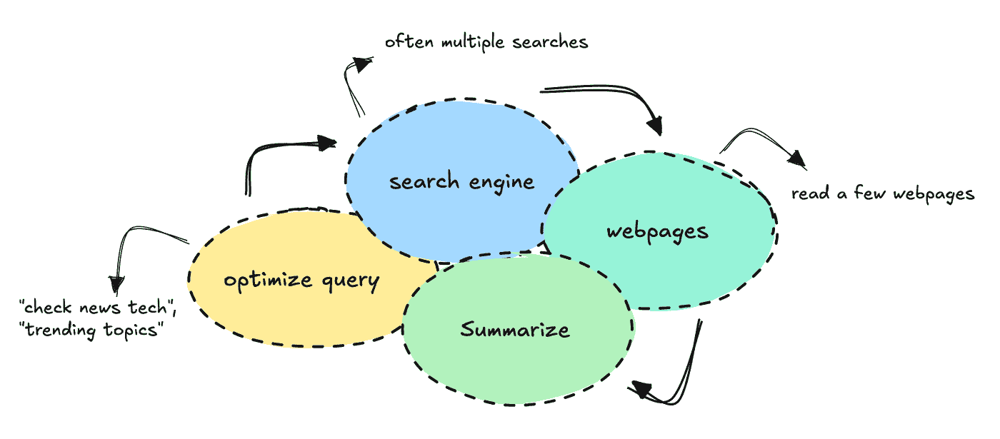
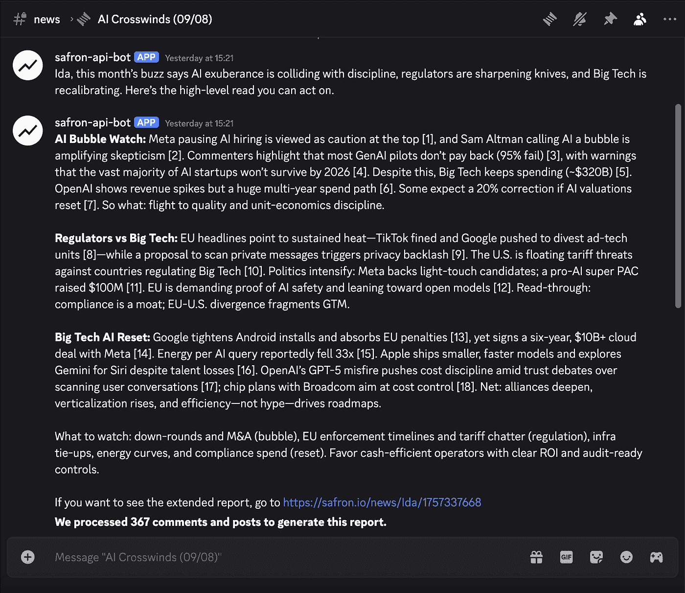
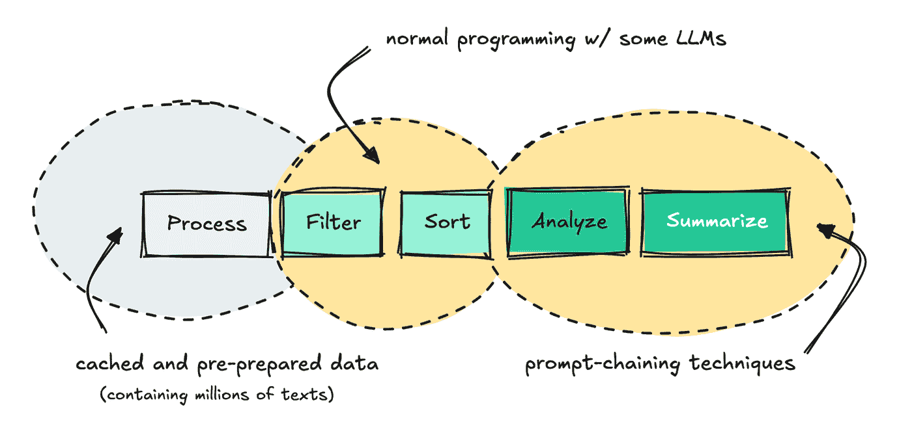
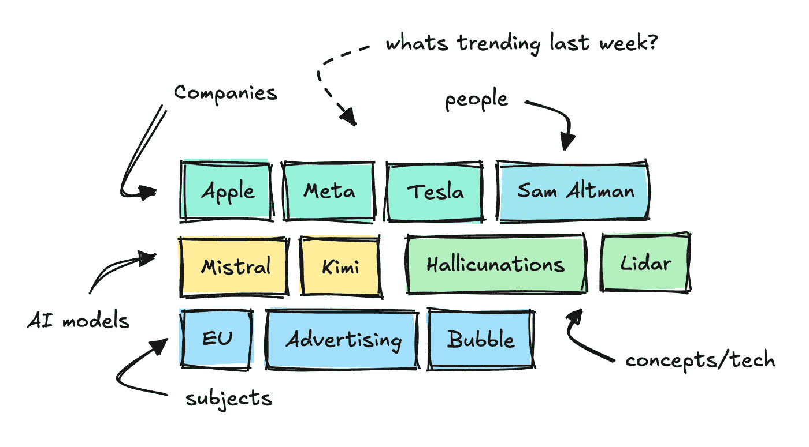
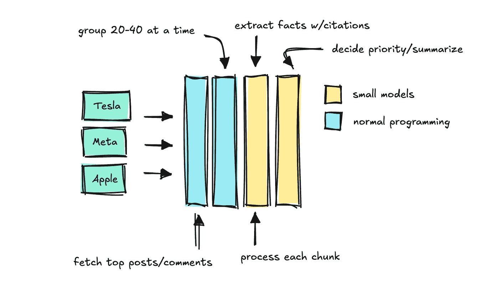
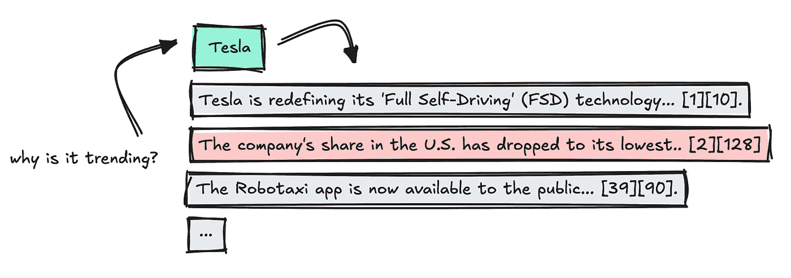
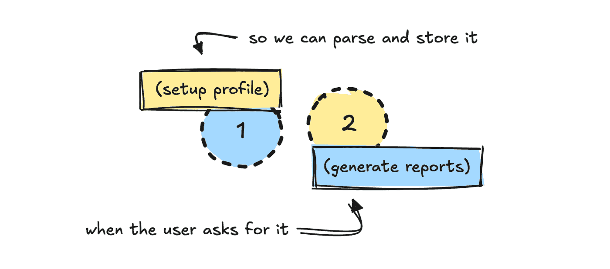
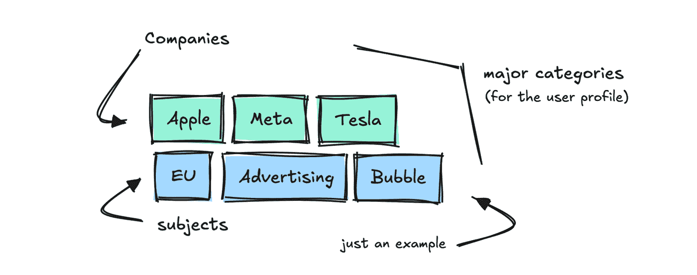
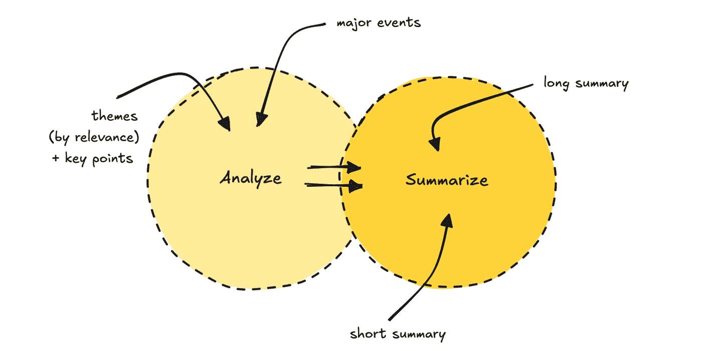
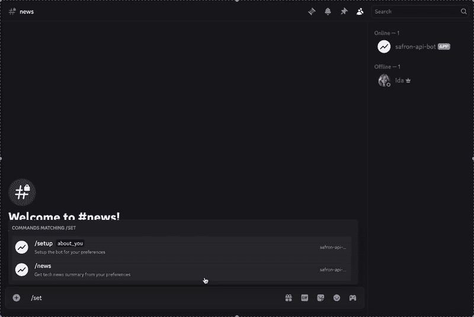

# 为科技洞察构建研究代理

> 原文：[`towardsdatascience.com/building-research-agents-for-tech-insights/`](https://towardsdatascience.com/building-research-agents-for-tech-insights/)

<mdspan datatext="el1757617275563" class="mdspan-comment">如果你曾经向 ChatGPT 提出过类似这样的问题：“请为我侦察所有科技信息，并根据你认为我会感兴趣的内容总结趋势和模式，”你就会知道你会得到一些通用的东西，它会搜索几个网站和新闻来源，然后把这些东西交给你。

这是因为 ChatGPT 是为通用用例而构建的。它应用常规搜索方法来获取信息，通常限制在几个网页上。



这篇文章将向你展示如何构建一个能够侦察所有科技信息、聚合数百万文本、根据人物角色过滤数据，并找到你可以采取行动的模式和主题的利基代理。

这个工作流程的目的是避免自己坐着滚动论坛和社交媒体。代理应该为你做这件事，抓取任何有用的东西。



我们将能够利用独特的数据源、受控的工作流程和一些提示链技术来实现这一点。



三个不同的过程，API、获取/过滤数据、总结 | 图片由作者提供

通过缓存数据，我们可以将每份报告的成本降低到几美分。

如果你不想自己启动它，可以加入这个[Discord](https://discord.gg/v6BV49DCpp)频道。如果你想自己构建，可以在[这里](https://github.com/ilsilfverskiold/ai-personalized-tech-reports-discord)找到仓库。

这篇文章重点介绍了一般架构和如何构建它，而不是像你可以在[GitHub](https://github.com/ilsilfverskiold/ai-personalized-tech-reports-discord)中找到的更小的编码细节。

### 建设笔记

如果你刚开始使用代理构建，你可能觉得这个还不够突破性。

然而，如果你想构建一个真正能工作的东西，你将需要将相当多的软件工程应用到你的 AI 应用中。即使 LLMs 现在可以独立行动，它们仍然需要指导和护栏。

对于这种有明确路径的系统，你应该构建更多结构化的“工作流程”系统。如果你有人的参与，你可以使用更动态的东西。

这个工作流程之所以效果如此之好，是因为我背后有一个非常好的数据源。没有这个数据护城河，这个工作流程就无法比 ChatGPT 做得更好。

### 准备和缓存数据

在我们能够构建一个代理之前，我们需要准备一个它可以利用的数据源。

我认为很多人在与 LLM 系统合作时犯的一个错误是认为 AI 可以完全独立地处理和汇总数据。

在某个时候，我们可能能够给他们提供足够的工具来自行构建，但在可靠性方面我们还没有达到那个阶段。

因此，当我们构建这样的系统时，我们需要数据管道像其他任何系统一样干净。

我构建的这个系统使用了我已经可以获取的数据源，这意味着我了解如何教会 LLM 如何利用它。

它每天从技术论坛和网站上摄取数千篇文章，并使用小型 NLP 模型来分解主要关键词，对它们进行分类，并分析情感。

这让我们可以看到在特定时间段内不同类别中哪些关键词正在流行。



为了构建这个代理，我添加了一个额外的端点，用于收集每个这些关键词的“事实”。

这个端点接收一个关键词和一个时间段，系统根据参与度对评论和帖子进行排序。然后它使用可以决定保留哪些“事实”的小型模型对文本进行分块处理。



我们应用最后一个 LLM 来总结哪些事实最重要，同时保持原始引用完整。



这是一种提示链过程，我构建它是为了模仿 LlamaIndex 的引用引擎。

第一次调用端点处理某个关键词时，可能需要半分钟才能完成。但由于系统缓存了结果，任何重复请求只需几毫秒。

只要模型足够小，每天在几百个关键词上运行的成本就非常低。稍后，我们可以让系统并行处理多个关键词。

你现在可能可以想象，我们可以构建一个系统来检索这些关键词和事实，并用 LLM 构建不同的报告。

### 何时使用小模型还是大模型

在继续之前，我们只需提到选择合适的模型大小很重要。

我认为这是现在每个人都在考虑的问题。

你可以使用的模型相当先进，但当我们开始将这些应用应用到越来越多的 LLM 上时，每次运行的调用次数会迅速增加，这可能会变得昂贵。

因此，当你能这么做的时候，使用小模型。

你看到我使用小型模型来分块引用和分组来源。其他非常适合小型模型的任务包括路由和将自然语言解析为结构化数据。

如果你发现模型表现不佳，你可以将任务分解成更小的问题，并使用提示链，先做一件事，然后使用那个结果来做下一件事，依此类推。

当你需要在大文本中找到模式或与人交流时，你仍然需要使用大型的 LLM。

在这个工作流程中，成本最小，因为数据已经缓存，我们为大多数任务使用较小的模型，唯一独特的大型 LLM 调用是最后的那些。

## 这个代理是如何工作的

让我们来看看代理在底层是如何工作的。我构建了这个代理以在 Discord 中运行，但这里不是重点。我们将关注代理架构。

我将这个过程分为两个部分：一个是设置，另一个是新闻。第一个过程要求用户设置他们的个人资料。



由于我已经知道如何处理数据源，我构建了一个相当广泛系统提示，帮助 LLM 将这些输入转换成我们可以稍后获取数据的东西。

```py
PROMPT_PROFILE_NOTES = """
You are tasked with defining a user persona based on the user's profile summary.
Your job is to:
1\. Pick a short personality description for the user.
2\. Select the most relevant categories (major and minor).
3\. Choose keywords the user should track, strictly following the rules below (max 6).
4\. Decide on time period (based only on what the user asks for).
5\. Decide whether the user prefers concise or detailed summaries.
Step 1\. Personality
- Write a short description of how we should think about the user.
- Examples:
- CMO for non-technical product → "non-technical, skip jargon, focus on product keywords."
- CEO → "only include highly relevant keywords, no technical overload, straight to the point."
- Developer → "technical, interested in detailed developer conversation and technical terms."
[...]
""" 
```

我还定义了我需要的输出模式：

```py
class ProfileNotesResponse(BaseModel):
 personality: str
 major_categories: List[str]
 minor_categories: List[str]
 keywords: List[str]
 time_period: str
 concise_summaries: bool
```

如果没有了解 API 及其工作方式的领域知识，LLM 不太可能自己弄清楚如何做到这一点。

*你可以尝试构建一个更广泛系统，其中 LLM 首先尝试学习它应该使用的 API 或系统，但这会使工作流程更加不可预测和昂贵。*

对于这类任务，我总是尝试使用 JSON 格式的结构化输出。这样我们可以验证结果，如果验证失败，我们会重新运行它。

这是与 LLM 在系统中工作的最简单方式，尤其是在没有人在循环中检查模型返回的内容时。

一旦 LLM 将用户个人资料转换为我们模式中定义的属性，我们将个人资料存储在某个地方。我使用了 MongoDB，但这不是必须的。

存储个性不是严格必要的，但你确实需要将用户说的话转换成可以生成数据的形式。

### 生成报告

让我们看看当用户触发报告时，在第二步会发生什么。

当用户点击`/news`命令，无论是否设置了时间段，我们首先获取我们存储的用户个人资料数据。

这为系统提供了所需上下文，以便使用与个人资料相关的类别和关键词来获取相关数据。默认时间段是每周。

从这个列表中，我们得到了选定时间段内可能对用户感兴趣的前沿和热门关键词。



没有这个数据源，构建类似的东西将会很困难。数据需要提前准备好，以便 LLM 能够正确地使用它。

在获取关键词之后，添加一个 LLM 步骤来过滤掉与用户无关的关键词是有意义的。我没有在这里这么做。

*LLM 接收到的无关信息越多，它就越难专注于真正重要的事情。你的任务是确保你给它提供的信息与用户的实际问题相关。*

接下来，我们使用之前准备好的端点，其中包含每个关键词的缓存“事实”。这为我们提供了每个关键词已经过审查和排序的信息。

我们并行运行关键词调用以加快速度，但第一个请求新关键词的人仍然需要等待一段时间。

一旦结果出来，我们合并数据，删除重复项，并解析引文，以便每个事实都能通过关键词编号链接到特定的来源。

然后我们通过提示链过程处理数据。第一个 LLM 会找到 5 到 7 个主题，并根据用户资料的相关性进行排序。它还会提取关键点。



第二次 LLM 遍历使用主题和原始数据生成两种不同的摘要长度，以及一个标题。

我们这样做是为了确保减少模型上的认知负荷。

构建报告的最后一步花费了最多的时间，因为我选择了使用像 GPT-5 这样的推理模型。

你可以用更快的工具来替换它，但我发现高级模型在最后一部分做得更好。

整个过程需要几分钟，具体取决于当天已经缓存了多少数据。

查看下面的最终结果。



如果你想要查看代码并自己构建这个机器人，你可以在[这里](https://github.com/ilsilfverskiold/ai-personalized-tech-reports-discord)找到。如果你只是想生成一份报告，你可以加入这个[频道](https://discord.gg/v6BV49DCpp)。

我有一些改进它的计划，但如果你觉得它有用，我很乐意听取你的反馈。

如果你想要一个挑战，你可以将其重建为其他东西，比如内容生成器。

### 构建代理的注意事项

你构建的每个代理都会有所不同，所以这绝对不是用 LLMs 构建的标准蓝图。但你可以看到这需要什么样的软件工程水平。

至少目前，LLMs（大型语言模型）并没有消除对优秀的软件和数据工程师的需求。

对于这个工作流程，我主要使用 LLMs 将自然语言翻译成 JSON，然后通过程序将数据传递到系统中。这是控制代理过程最简单的方法，但也不是人们通常在想到 AI 应用时想象的样子。

有时候使用更灵活的代理是理想的，尤其是在有人的情况下。

尽管如此，希望你能学到一些东西，或者从中获得灵感去自己构建一些东西。

如果你想跟随我的写作，请在这里关注我，我的[网站](https://www.ilsilfverskiold.com/)，[Substack](https://howtouseai.substack.com/)，或[LinkedIn](https://www.linkedin.com/in/ida-silfverskiold/)。

❤
