# 人工智能真的能发展出像我们一样的适应型记忆吗？

> 原文：[`towardsdatascience.com/can-ai-truly-develop-a-memory-that-adapts-like-ours/`](https://towardsdatascience.com/can-ai-truly-develop-a-memory-that-adapts-like-ours/)

## 我们今天在学些什么？

<mdspan datatext="el1749706201125" class="mdspan-comment">像 Meta 的**CoCoMix** [**(Jihoon et al., 2025)**](https://arxiv.org/abs/2502.08524)¹这样的努力，已经使概念学习成为现实，即学习单词背后的概念，而不仅仅是预测下一个标记，这使得它们非常**可控制**和**可解释**。

但一个核心问题仍然存在：即使是一个概念上出色的模型，在训练后，在实际部署期间也可能难以应对细微或事实回忆的挑战。你可以问一个看似简单的问题，比如，“在我们两百万个单词的对话中，我们是在哪里讨论皮诺曹著名的长鼻子的？”无论 LLM 在概念上多么有能力，如果答案超出了它的上下文窗口，它就无法回答这个简单的问题。

因此，问题变成了，我们能否在关键时刻——即在推理过程中——为这些智能大型语言模型配备一个**可适应**的“记忆”或性能提升？

### 1. 当前基础的难题：变压器

变压器 [**(Vaswani et al., 2017)²**](https://proceedings.neurips.cc/paper/2017/file/3f5ee243547dee91fbd053c1c4a845aa-Paper.pdf) 在现代人工智能领域已经无处不在。自从它们取得突破性成功以来，它们已经成为各个领域的首选架构。

回到 2020 年，对任何机器学习问题的默认回答通常是，“只是给它注意力”——而且出人意料的是，这通常有效，往往优于最先进的模型。视觉任务？使用变压器 [**(Dosovitskiy et al., 2020)**](https://arxiv.org/abs/2010.11929)³。时间序列预测？再次使用变压器 [**(Zerveas et al., 2021)**](https://arxiv.org/abs/2010.02803)⁴。自然语言处理？嗯，变压器实际上定义了它 **(**[**Rogers et al., 202**](https://direct.mit.edu/tacl/article/doi/10.1162/tacl_a_00349/96482/A-Primer-in-BERTology-What-We-Know-About-How-BERT)**1)⁵**。

但是，随着我们对大型模型的依赖加深，计算预算扩大，即使是这种“全能”架构也开始显示出其局限性——于是，人们开始推动进一步扩展其能力。

瓶颈？注意力的“每个人与每个人交谈”的方法。虽然很出色，但**二次方昂贵**——想象一个有一百万人的房间，每个人必须记住与每个人的每一次对话。这限制了变压器的“工作记忆”，难以处理理解大量文档所需的“长期回忆”，因为早期信息简单地**消失**。

超出上下文限制后，标准变压器面临另一个根本性的挑战：训练后的**适应性不足**。虽然它们在将大量预训练知识应用于预测下一个标记——一个复杂的推理和预测过程——方面表现出色，但这并不等同于真正的学习。就像谷歌地图——虽然它能为您找到“最短路径”，但它忘记了前方有施工，并希望您开车穿过路障。另一方面，一个人类向导会向您展示一条替代的小巷路线。

这种无法从他们当前处理的数据中“即时学习”的能力，对于需要持续适应或记忆训练集之外的新经验的任务来说，是一个关键的限制。

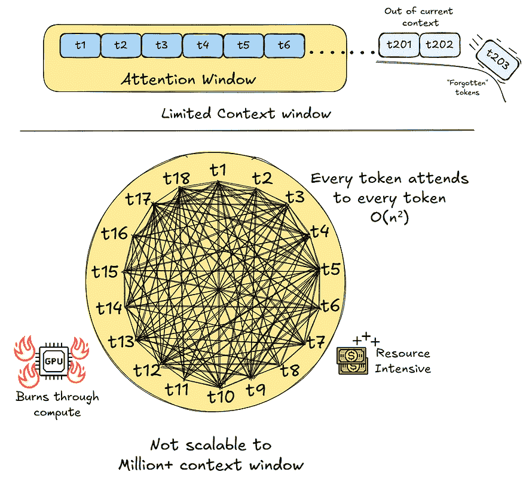

（来源：作者）

当前标准变压器中许多问题之一

* * *

### 2. 解决方案？泰坦斯！

研究人员并没有只针对一个局限，而是采取了更广阔的视角：智能系统，如人脑，如何管理和适应新情况？这不仅仅是一个庞大、始终可访问的记忆。这是一个更灵活的设置，其中不同的组件协调处理不同类型的信息和经验。

泰坦斯架构 [**(Behrouz et al., 2025)⁶**](https://arxiv.org/abs/2501.00663) 融入了这一点，不是围绕一个单一的、统一的注意力块构建，而是围绕一个由专门的记忆系统组成的合作团队，每个系统都在理解和应对当前任务中扮演着关键角色。

#### 2.1 架构组件：记忆模块

+   **短期记忆 (STM):** 这是一种敏锐、注重细节的专家。它的工作方式与您所知的注意力类似，但与被整个过去（现在 LMM 的工作）淹没不同，它的注意力（有意为之）现在集中在**即时当下**。这就像您记得刚刚别人对您说的话，足以让您做出回应。

+   **长期记忆模块 (LMM):** 这是最令人兴奋的补充。它旨在在推理过程中学习和适应——是的，就在那里，即兴！——而“适应”字面上意味着其参数发生变化！想象一下，您多年来理解一个朋友——增加经验，同时过滤掉不重要的事件。

+   **持久记忆 (PM)**：这个成员持有基础、任务特定的知识。这些是模型在其主要训练期间获得的可学习的基本洞察。这种知识在当下不是动态的，但为其他两个成员提供了基本的基础和上下文。它就像你的个性，你的气质，走路或开车的能力，这些是你不需要重新学习或改变的事情。

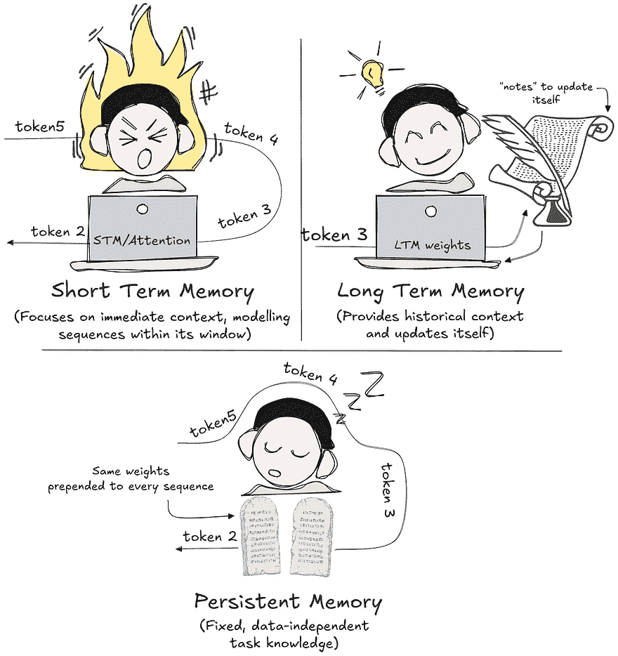

（来源：作者）

三个记忆模块：**短期记忆 (STM**)、**长期记忆模块 (LMM**) 和 **持久记忆 (PM**)。

#### 2.2 这些记忆模块是如何实现的？

那么，这三个究竟是如何真正协同工作的呢？首先，**STM** 实质上是标准的自注意力计算，这是 vanilla transformers 的一个基本组成部分。它的“记忆”是它在训练期间学习的 *KV 缓存* 和 *注意力矩阵*。

另一方面，**PM** 是一组 *可学习的参数*，它们被添加到输入序列的开头，并在训练期间学习，作为模型在推理过程中始终遵循的 *“圣杯”*。无论何时，它都为模型提供了必要的基准和上下文。

到目前为止相当容易理解——嗯？那么让我们深入创新和真正令人兴奋的部分，尽管它被实现为一个简单的 **MLP 网络**，但在测试时可以适应——**LMM 模块**：

#### 2.3 泰坦的核心：自适应长期记忆 (LMM) 模块

> 等一下…测试时的参数更新？这不是我们只在训练时做的事情吗？这不是基本上就是作弊吗？

当你听到 *测试时训练* 这个词时，你想到的是这些问题吗？这些都是有效的问题，但不是，这并不是 *作弊*。Titans 利用来自 **在线学习和元学习** 的原则，以实现针对 *记忆* 的快速、局部更新，而不是一般任务改进。它不在测试时查看外部标签来计算梯度并优化参数；相反，一切都在内部自我调整：模型仅使用它已经知道的和 **它当时看到的**。

在人类的记忆中，日常和可预测的事件往往会消失，而意外或 **令人惊讶** 的时刻往往持续存在 **(**[**Mandler, 2014**](https://www.taylorfrancis.com/books/edit/10.4324/9781315802756/affect-cognition-margaret-clark-susan-fiske?refId=9836a697-bfa5-43ac-a2c3-01a45e721da6&context=ubx)**)⁷**。这是动态测试时更新的核心思想。

#### 2.3.1 LMM 的学习方式：关联损失函数

LMM 充当**联想记忆**：它学习将“键”（提示）与“值”（信息）联系起来。对于每份数据*x[t]*（MAG & MAL 中的输入块，MAC 中的 STM（自注意力）输出）：

+   **键值提取：**系统首先使用可学习的转换(W[k]和 W[v])将*x[t]*转换为特定的键(*k[t]*)和相关的值(*v[t]*)。

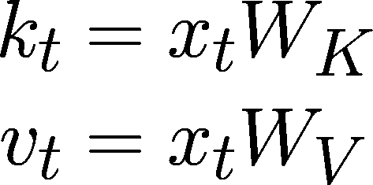

(来源：作者)

使用线性层将**x[t]**映射到**k[t]**和**v[t]**。

+   **测试 LMM:** 然后，当前状态的 LMM 被“询问”：给定这个新的键*k[t]*，你会预测什么值？让我们称它的预测为*p*[t]。

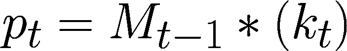

(来源：作者)

**M[t-1]**: 当前 LMM 状态；

**k[t]**: 当前块的关键

+   **计算损失：**通过 LMM 预测的错误程度来衡量：

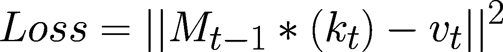

(来源：作者)

预测输出和“真实值”之间的标准**MSE 损失**

#### 2.3.2 梯度和“惊喜”信号

为了让 LMM 从这种损失中学习，我们引入了*惊喜信号*，它衡量模型在看到真实值(*v[t]*)时的“惊喜”程度。这种“惊喜”在数学上定义为**损失函数相对于 LMM 参数的梯度**。

(来源：作者)

**“惊喜”**的度量，即模型距离预测“正确”的**v[t]**有多远

大梯度意味着*x[t]*在 LMM 当前知识下是非常“惊喜”或意外的。

**基本学习步骤：**

LMM 学习最简单的方式是通过稍微调整其参数，使其朝着减少这种惊喜（即减少损失）的方向前进，就像梯度下降中的一步：

(来源：作者)

**M[t]:** 更新后的 LMM 参数；

**M[t-1]:** 之前的 LMM 参数；

**lr:** 学习率

#### 2.3.3 精炼惊喜：使用动量和遗忘进行更智能的学习

仅对即时的“惊喜”做出反应是不够的。一个好的记忆需要看到趋势，并且知道何时放弃过时、不相关的信息。

**智能学习方向(*ΔΘ^M[t]*):** 首先，LMM 计算调整其参数的最佳方向。这不仅仅基于当前的惊喜，还基于最近惊喜的“记忆”。

(来源：作者)

参数的变化基于**之前的改变**和**当前的惊喜**

+   ******ΔΘ^M[t]****:** 对 LMM 参数提出的更改。

+   ***η[t] * Δ*********Θ^M[t-1]**********:** 这是**动量**——它从前一步的学习趋势中传递过来。**η[t]** (数据相关)决定过去动量持续的时间。

+   ***θ[t] * ∇ Loss_current_surprise*:** 这是**当前惊喜**的影响。**θ[t]**(数据相关)调整其影响程度。

**最终参数更新（****Θ^M[t]****）：** LMM 随后更新其实际参数，将旧知识与新学习方向混合，并且关键的是，允许“忘记”。

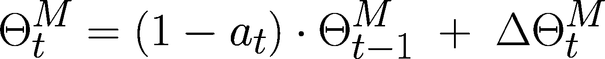

（来源：作者）

最终更新包括更新多少以及保留多少

+   ******Θ^M[t]***：*** 从*x[t]*学习后的 LMM 的**新参数**。

+   ***(1 — a[t]) * ******Θ^M[t-1]******：*** 这是保留多少**旧 LMM 状态**。*a[t]*（数据相关，介于 0 和 1 之间）是**忘记因子**—如果*a[t]*高，则更多旧状态被忘记。

+   *********ΔΘ^M[t]******：*** 上面计算出的智能学习方向。

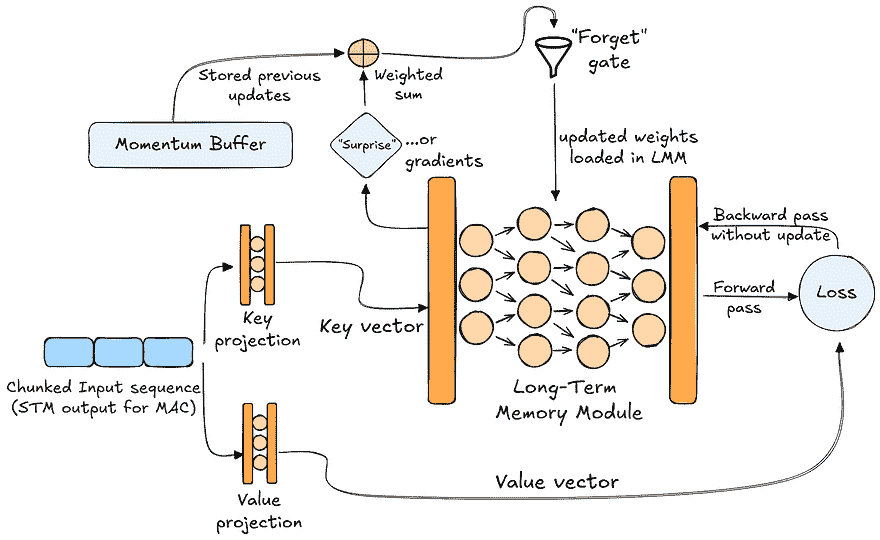

（来源：作者）

可视化整个 LMM 更新过程

**总之：**

LMM 查看当前数据的“惊喜”***(∇Loss_current_surprise)***，将其与最近的学习趋势***(动量 ***Δ*********Θ^M[t-1]************)***混合，然后更新其内部知识***(************Θ^M[t]************)***，在过程中决定保留多少旧信息或忘记多少***(***a[t]***)***。数据相关的门(*η[t], θ[t], a*[t]*)*使其能够动态适应。

#### 2.4 Titans 的架构蓝图：记忆在行动

Google 研究人员探索了三种主要方式，这些三种记忆模块可以如何排列：

#### 作为上下文的记忆（MAC）

在这个设置中，Titans 为 STM（标准自注意力块）创建了一个**增强和丰富的上下文**。

1.  非常长的输入序列被分成段或块。

1.  在处理过程中，模型将块映射到查询，并使用它从 LMM（查询通过 LMM，其输出是历史上下文）检索相关历史上下文。

1.  这些检索到的历史标记随后**连接**到静态持久记忆标记和当前段标记。

1.  整个扩展序列（持久 + 历史 + 当前）被输入到**STM（注意力）**层，该层处理这个大组合上下文中的关系。

1.  来自注意力层的输出，现在反映了考虑历史和任务知识的当前数据的深入理解，然后用作 LMM 动态参数更新过程的输入数据。

1.  使用相同的注意力结果再次查询更新的 LMM，然后将其响应与原始注意力通过门控求和或部分连接结合，以产生最终结果。

**类比：** 文本（序列）以页面（块）的形式到达。对于每一页，一个不断学习的笔记记录者（LMM）会迅速从过去的笔记中找到相关的总结，并将它们与必要的“规则手册”笔记（PM）混合。学生（STM/注意力）阅读整个内容——规则手册、相关的过去总结，以及当前页面——并根据从这种丰富语境中学到的知识，告诉笔记记录者当前页面上哪些要点对于未来的总结至关重要。

最终答案是在考虑学生的详细阅读和笔记记录者更新的记忆视角的基础上形成的。

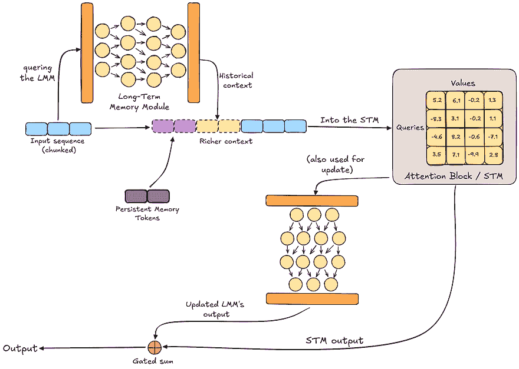

（来源：作者）

MAC 架构可视化

#### 记忆作为门（MAG）

这种设计以并行的方式不同地整合记忆，通过动态门混合 STM 和 LMM 输出的信息。

1.  输入序列（持久 + 当前）被输入到两条路径中：

    一条路径通往**STM**，在这里使用**滑动窗口注意力**实现，允许它关注每个标记周围的局部邻域。

    另一条并行路径通往**LMM 网络**。

1.  LMM 的输入用于**动态更新**其参数。它还产生相应的输出表示。

1.  STM（滑动窗口注意力）的输出和 LMM 正向传递的输出随后通过一个**门控机制**。这个门控机制学会混合或选择来自局部注意力和由 LMM 的状态/输出表示的信息。

1.  这个门控机制的输出是该标记位置的最终输出。

**类比：** 每当一页到来时，两个任务同时发生：学生（STM）专注地只关注他们面前的页面，而独立的笔记记录者（LMM）阅读当前页面，并将其与迄今为止看到的内容联系起来，默默地更新其整体理解。学生根据段落提供答案，笔记记录者根据其不断发展的整体图景提出思考。

协调器（门控机制）只是简单地混合或从他们的两个输出中选择最终的响应。

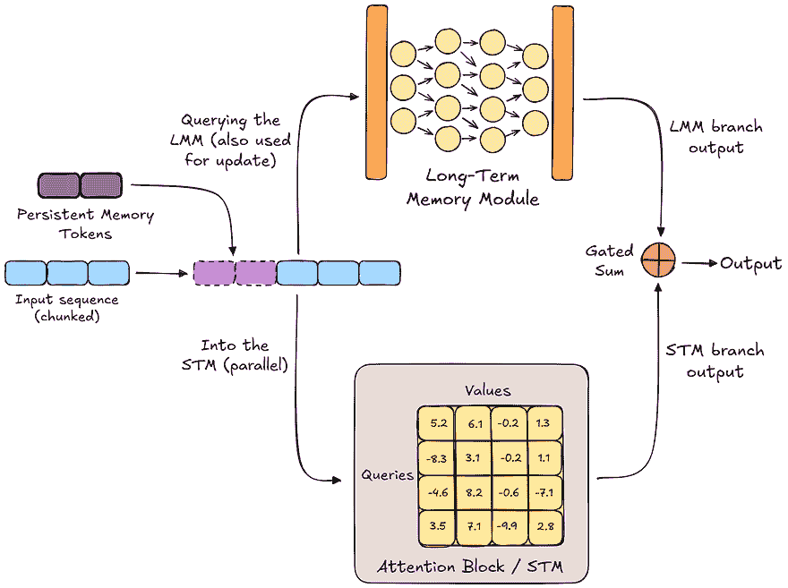

（来源：作者）

MAG 架构可视化

#### 作为一层的记忆（MAL）

在这个变体中，LMM 网络被用作初始处理层，在它达到注意力机制（STM）之前修改序列。

1.  输入序列（再次，持久和当前）首先通过**LMM 网络**作为一个独立的层。

1.  随着 LMM 网络分块处理序列，其参数**动态**更新。它还产生一个转换后的输出序列。

1.  从 LMM 层输出的这个*转换后的输出序列*随后用作后续**STM（注意力）**层的输入（滑动窗口或窗口内的全注意力）。

1.  注意力层的输出是该序列的模型最终输出。

**类比：**首先，每一页新内容都直接交给一个主要的笔记记录者（LMM）进行处理，边处理边总结，并在过程中*更新其总结风格*。然后，这个（可能不那么详细）的总结被转交给学生（STM）。学生只看到并专注于这个总结文本的局部部分，他们的答案完全基于主要笔记记录者提供的内容。

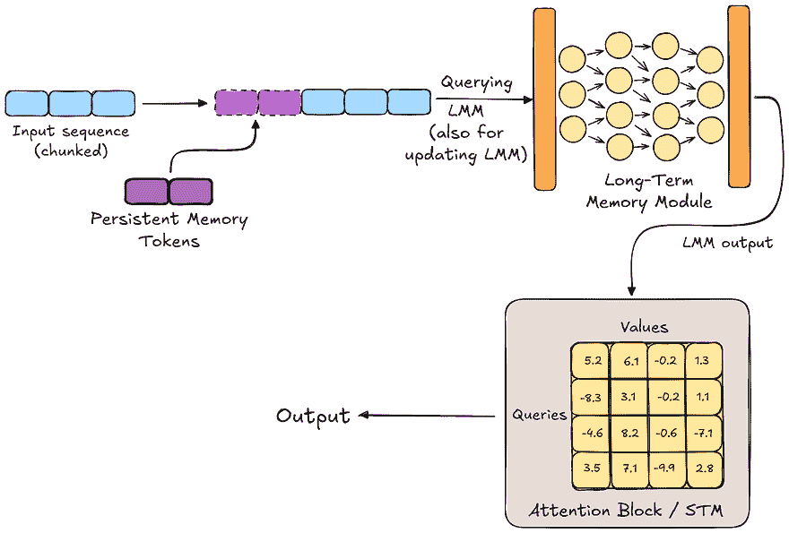

（来源：作者）

MAL 架构可视化

* * *

### 3. 我们从这一切中获得了什么？结果和发现

因此，现在我们知道了关于 Transformer 之后可能出现的下一个革命性技术的所有信息，但它会那么大吗？谷歌的研究人员真的破解了能够记住、适应和征服以前认为不可能的挑战的模型吗？让我们逐一审视这个长长的创新发现列表：

#### 语言能力：不仅仅是词汇

泰坦远不止于更准确地预测下一个单词。多亏了其动态的长期记忆模块（LMM），它展示了更深、更直观的语言和上下文理解。在与 Transformer++和几个最新的循环模型等强大基线进行评估时，泰坦始终优于它们，不仅在语言建模上，而且在常识推理任务上也如此。

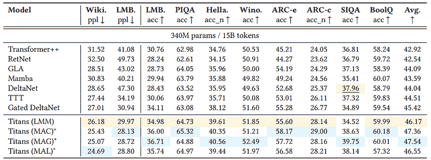

（来源：改编自[Behrouz 等人，2025](https://arxiv.org/abs/2501.00663)，表 1）

**Titans**在**常识**和**推理**任务上的性能（混合：MAC，MAG，MAL；简单：LMM）

#### 针对大量上下文的挑战

Titans 的设计在 RULER 基准测试的 S-NIAH 任务上表现出卓越的性能连续性 [**(Hsieh 等人，2024)**](https://openreview.net/forum?id=kIoBbc76Sy)**⁸**，该测试旨在评估有效上下文长度。Titans 模型（包括独立的神经网络记忆模型（LMM 作为模型））即使在 16K 标记时也保持了强大的检索率，相比之下，一些最先进的循环模型随着序列长度的增加而出现了急剧的准确率下降。

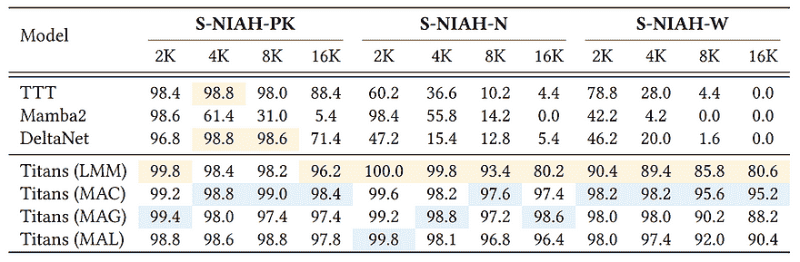

(来源：[Behrouz 等人，2025](https://arxiv.org/abs/2501.00663)，表 2)

**Titans**在**RULER**的**S-NIAH**任务上的性能（混合：MAC，MAG，MAL；简单：LMM） [**(Hsieh 等人，2024)**](https://openreview.net/forum?id=kIoBbc76Sy)**⁸**

#### 在 BABILong 中掌握复杂推理

检索一个事实是一回事。但要在大量上下文中使用多个事实进行推理呢？这才是真正的考验，这正是 BABILong 基准测试 [**(Yury Kuratov 等人，2024)**](https://proceedings.neurips.cc/paper_files/paper/2024/file/c0d62e70dbc659cc9bd44cbcf1cb652f-Paper-Datasets_and_Benchmarks_Track.pdf)⁹所要求的。Titans（特别是 MAC 架构）不仅做得很好——它甚至超过了所有人。即使是像 GPT-4 和 Llama 3.1–70B 这样的大模型，即使它们可以访问外部工具或检索系统，而 Titans 最大的模型参数量仅为 760M！

此外，Titans（MAC 混合架构）还能够在 10 百万标记时达到**70%的准确率**。为了更直观地说明这一点，这就像是整个*哈利·波特*系列中的导航和寻找拼图碎片……**十倍**。

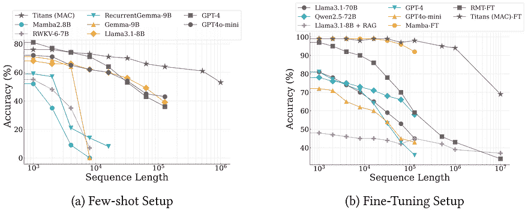

(来源：[Behrouz 等人，2025](https://arxiv.org/abs/2501.00663)，图 6)

不同 LLMs 在 BABILong 上的**准确率**与**序列长度**关系图 [**(Yury Kuratov 等人，2024)**](https://proceedings.neurips.cc/paper_files/paper/2024/file/c0d62e70dbc659cc9bd44cbcf1cb652f-Paper-Datasets_and_Benchmarks_Track.pdf)⁹

#### 记忆深度与速度

研究人员探讨了当通过堆叠更多层来加深长期记忆模块（LMM）时会发生什么。结果呢？更深层次的 LMM 显著提高了其存储和组织重要信息的能力，使其更不可能忘记关键细节，尤其是在大多数模型难以维持上下文的长期序列中。

尽管 LMMs 单独使用时能够实现跨大量输入的高效处理，具有线性时间复杂度，但更深层次的 LMMs 确实带来了一些权衡：吞吐量降低，或者说每秒处理的标记数减少。

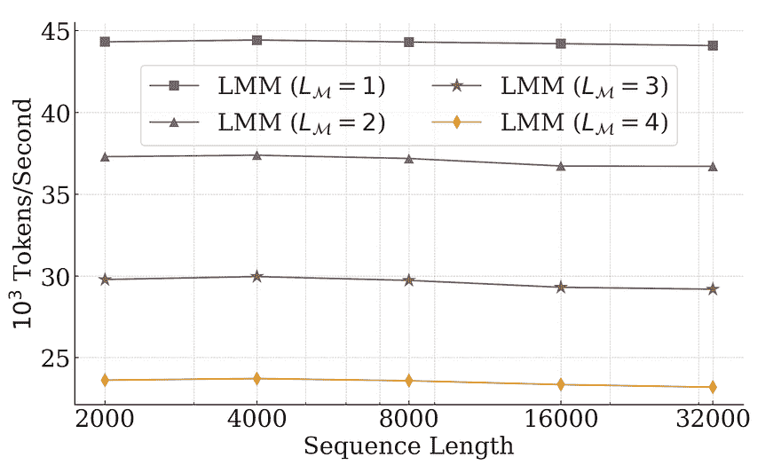

（来源：[Behrouz 等人，2025](https://arxiv.org/abs/2501.00663)，图 8）

**序列长度**与不同 LMM 深度的**吞吐量**

#### 超越语言任务

另一个令人兴奋的事实是，相同的记忆机制在传统语言任务之外也有效。在时间序列预测中，一个以混沌、变化的模式著称的领域，长期记忆模块（LMM）在与基于 Mamba（之前的 SOTA）等高度专业化的模型竞争中表现出色。

在 DNA 建模中，这是一个完全不同的任务，该架构表现出强大的结果。这种通用性并不容易获得，它表明，当处理得当，记忆不仅有用，而且在各个领域都是基础性的。

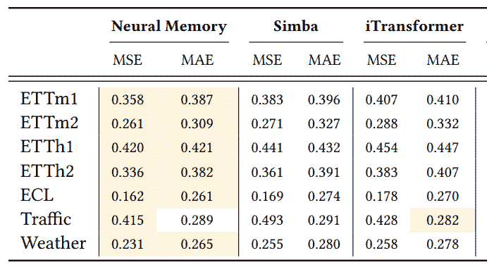

（来源：改编自[Behrouz 等人，2025](https://arxiv.org/abs/2501.00663)，表 3）

**神经记忆**（LMM 作为模型）在各种**时间序列数据集**上的表现

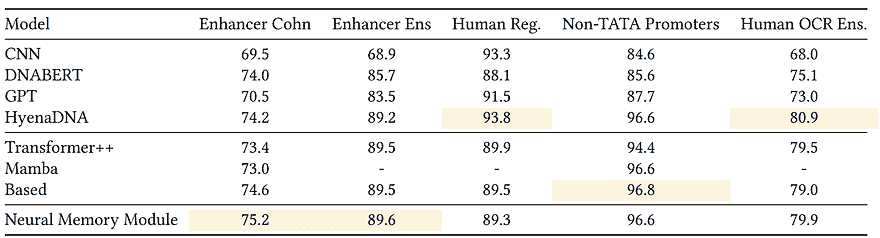

（来源：[Behrouz 等人，2025](https://arxiv.org/abs/2501.00663)，表 4）

**神经记忆模块**（LMM 作为模型）在基因组基准测试中的表现 [**(Grešová等人，2023)**](https://link.springer.com/article/10.1186/s12863-023-01123-8)¹⁰

* * *

### 4. 结论和最后思考

这就结束了我们对 Titans 的深入探讨。探索这个架构确实很有趣——看到超越扩展并深入研究记忆和学习如何在更适应、更类似人类的方式中实际工作，这是一种令人耳目一新的体验。

Google 在基础工作方面的传统继续在这里延续，从发明 Transformer 到现在重新思考 AI 在推理过程中如何学习。Titans 感觉像是那种精神的自然演变。

话虽如此，今天的 AI 领域比 2017 年时要拥挤得多。无论新想法多么出色，它们成为默认选项的道路都更加艰难。性能只是其中一部分——效率、简单性和社区吸引力比以往任何时候都更重要。

尽管如此，Titans 为这样一个未来做出了强有力的论据，即模型不仅仅是用它们已经知道的东西思考，而是随着进程真正地适应。无论这成为下一个“只是关注它”的时刻与否，这都是朝着更智能、更智能的 AI 迈进的一个有希望的步骤。

* * *

### 5. 参考文献：

**[1]** Tack, Jihoon，等人，“使用连续概念的 LLM 预训练。”（2025）*arXiv 预印本 arXiv:2502.08524*。

**[2]** Vaswani, Ashish, et al., [“注意力即一切。”](https://proceedings.neurips.cc/paper/2017/file/3f5ee243547dee91fbd053c1c4a845aa-Paper.pdf) (2017), *神经信息处理系统进展* 30.

**[3]** Dosovitskiy, Alexey, et al. [“一张图片胜过 16×16 个词：大规模图像识别中的 Transformer。”](https://arxiv.org/abs/2010.11929) (2020), *arXiv 预印本 arXiv:2010.11929*.

**[4]** Zerveas, George, et al. [“基于变换器的多元时间序列表示学习框架。”](https://arxiv.org/abs/2010.02803) (2021), *第 27 届 ACM SIGKDD 知识发现与数据挖掘会议论文集*.

**[5]** Rogers, Anna, et al., [“BERTology 入门：我们了解的 BERT 是如何工作的。”](https://direct.mit.edu/tacl/article/doi/10.1162/tacl_a_00349/96482/A-Primer-in-BERTology-What-We-Know-About-How-BERT) (2021), *计算语言学协会学报* 8: 842–866.

**[6]** Behrouz, Ali, Peilin Zhong, and Vahab Mirrokni. [“Titans：测试时间记忆学习。”](https://arxiv.org/abs/2501.00663) (2024), *arXiv 预印本 arXiv:2501.00663*.

**[7]** Mandler, George. “[*情感与认知*](https://www.taylorfrancis.com/books/edit/10.4324/9781315802756/affect-cognition-margaret-clark-susan-fiske?refId=9836a697-bfa5-43ac-a2c3-01a45e721da6&context=ubx)*” (*2014*)*. 心理学出版社, 3–36.

**[8]** Hsieh, Cheng-Ping, et al., “[RULER：你的长上下文语言模型的真实上下文大小是多少？](https://openreview.net/forum?id=kIoBbc76Sy)” In: 首届语言建模会议。2024.

**[9]** Kuratov, Yury, et al. [“Babilong：在长上下文中测试 LLM 的极限。”](https://proceedings.neurips.cc/paper_files/paper/2024/file/c0d62e70dbc659cc9bd44cbcf1cb652f-Paper-Datasets_and_Benchmarks_Track.pdf) (2024), *神经信息处理系统进展* 37: 106519–106554.

**[10]** Grešová, Katarína, et al. [“基因组基准：一组用于基因组序列分类的数据集。”](https://link.springer.com/article/10.1186/s12863-023-01123-8) (2023) *BMC 基因组数据* 24.1: 25.
