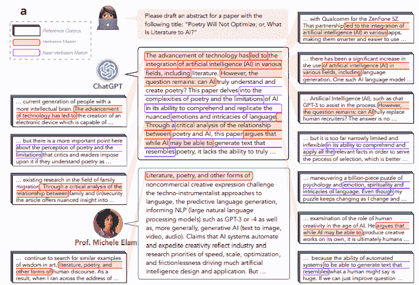
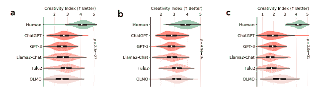
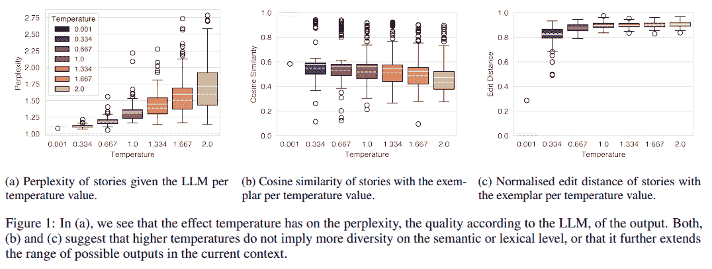
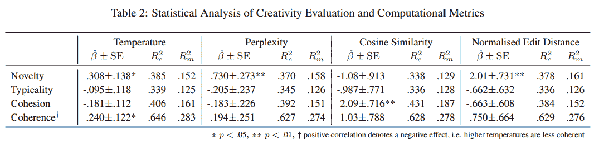
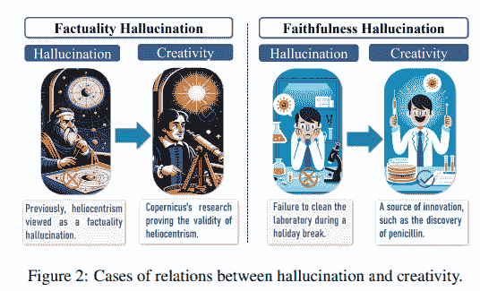
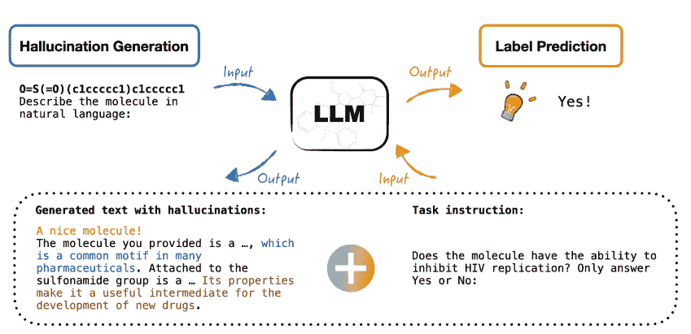

# 机器能做梦吗？关于大型语言模型的创造力

> 原文：[`towardsdatascience.com/can-machines-dream-on-the-creativity-of-large-language-models-d1d20cf51939/`](https://towardsdatascience.com/can-machines-dream-on-the-creativity-of-large-language-models-d1d20cf51939/)

### |LLM|创造力|AI|幻觉|

作者使用 DALL-E 生成的图像

> 创造力需要勇气去放弃确定性。 —— 埃里希·弗洛姆
> 
> 创造力涉及打破既定模式，以便以不同的方式看待事物。 —— 爱德华·德·波诺

[创造力](https://en.wikipedia.org/wiki/Creativity)被认为与推理能力一样，是人类独特的技能。大型语言模型 ([LLMs](https://en.wikipedia.org/wiki/Large_language_model)) 的出现以及它们模仿人类技能的能力已经开始动摇这种观点。关于 LLMs 是否具有 [推理](https://arxiv.org/abs/2501.09686) 能力的讨论很多，但关于这些模型的创造力的讨论却较少。

量化推理更容易（评估是在问题解决基准数据集上进行的），但量化创造力则更为复杂。尽管如此，创造力是我们人类活动之一：写书和剧本，创作 [诗歌](https://web.stanford.edu/class/archive/cs/cs224n/cs224n.1234/final-reports/final-report-169444285.pdf) 和艺术作品，做出 [突破性发现](https://arxiv.org/abs/2406.10833)，或制定理论都需要创造力。

> [**天才综合征：模式识别等同于智能吗？**](https://towardsdatascience.com/the-savant-syndrome-is-pattern-recognition-equivalent-to-intelligence-242aab928152)
> 
> [**对 Transformer 的挽歌？**](https://towardsdatascience.com/a-requiem-for-the-transformer-297e6f14e189)

虽然模型创造力是一个较少被探索的话题，但它并不比其他话题不重要。因此，在这篇文章中，我们将重点关注三个主要问题：

+   模型的创造力如何？

+   模型创造力依赖于什么？

+   [幻觉](https://github.com/SalvatoreRa/artificial-intelligence-articles/blob/main/articles/LLM_hallucinations.md) 能帮助提高模型的创造力吗？

* * *

***人工智能正在改变我们的世界，塑造我们的生活方式和工作方式。理解它的工作原理及其影响从未如此关键。** 如果你正在寻找对复杂人工智能主题的简单、清晰的解释，你就在正确的位置。点击 **关注** 或 **[免费订阅](https://salvatore-raieli.medium.com/subscribe)** 以获取我的最新故事和见解。*

* * *

## LLMs 有创造力吗？

> **创造性**是指利用自己的想象力形成新颖且有价值的[想法](https://en.wikipedia.org/wiki/Idea)或作品的能力。创造力的产物可能是无形的（例如，一个想法、[科学理论](https://en.wikipedia.org/wiki/Scientific_theory)、[文学作品](https://en.wikipedia.org/wiki/Literature)、[音乐作品](https://en.wikipedia.org/wiki/Musical_composition)、或[笑话](https://en.wikipedia.org/wiki/Joke)），或者是一个物理物体（例如，[发明](https://en.wikipedia.org/wiki/Invention)、菜肴或餐点、[珠宝](https://en.wikipedia.org/wiki/Jewellery)、[服装](https://en.wikipedia.org/wiki/Costume)、[绘画](https://en.wikipedia.org/wiki/Painting)）。——来源：[维基百科](https://en.wikipedia.org/wiki/Creativity)

通常，人们对什么是创造性或关于一个独特的定义没有达成一致。大多数作者同意，创造性是产生新颖、原创和有用的东西。这个新东西可以是一个产品或一个想法。更正式地说，Margaret Boden 将创造性定义为：“*提出新颖、令人惊讶和有价值的思想或作品的能力*” [1]

定义价值是一个更容易的任务。当 LLM 正确执行其功能时，其生成的代码是有价值的。**但是它是否新颖且令人惊讶？**

对于一个物体来说，新颖性指的是制造出的物品与其同类中的其他物品之间的不同。这个定义是有问题的，因为它可能只是现有物品的简单修改或新的重组。因此，要真正具有创造性，一个物体不仅必须是新的（与之前存在的不同），而且必须是有价值的（具有某种形式的效用）并且令人惊讶（不是简单的变化或重组）。**由于 LLM 的输出是文本，那么文本的创造性意味着什么？**

为了与上述定义保持一致，我们可以将[创造性文本](https://en.wikipedia.org/wiki/Creative_writing)定义为一种令人惊讶的扩展，它不是对先前文本的简单变化或重新创作。[LLMs](https://www.ibm.com/think/topics/large-language-models)在广泛的文本语料库上进行了训练，给定一个指令，它们可以在几秒钟内生成文本。为了具有创新性，输出文本必须与预训练期间看到的文本不同（新颖性），同时也必须与简单的变化不同（令人惊讶）。由于 LLM 的解码具有[随机成分](https://en.wikipedia.org/wiki/Stochastic_parrot)，LLM 可能会意外地将变化插入到生成的文本中。

将文本定义为令人惊讶是复杂的，但它是定义 LLM 创造性的焦点。Boden [2] 根据惊讶定义了三种类型的创造性：

+   **组合创造性**。寻找熟悉想法的不熟悉组合。例如，将两个以前未曾组合过的流派结合起来。

+   **探索性创造力**。在当前思维模式中找到新的、未探索的解决方案。一个例子可能是使用一种已建立的叙事风格，但在其范围内引入独特的转折（例如，从一个意想不到的角度讲述经典的爱情故事）。

+   **变革性创造力**。改变当前的思维模式。发明一种新的文本呈现方式，例如仅由脚注组成的小说或创新的编年顺序（例如，[OuLiPo](https://en.wikipedia.org/wiki/Oulipo)进行的新结构和模式研究）。

模型的[自回归](https://www.hopsworks.ai/dictionary/auto-regressive-models)性质不应导致生成任何令人惊讶的内容。即使它有一个随机成分，模型也会遵循它被训练的给定分布（预训练文本）[3]。另一方面，如果指示 LLM 可以创作关于数学定理的诗歌，用海明威的风格写定理，以及其他似乎符合惊讶定义的例子。实际上，在仔细观察下，它们显得微不足道且通常重复[4]。

最近，一篇[5]文章进一步探讨了这个问题，通过从网络上的现有文本片段中重建文本来尝试量化文本的语言创造力。人类的创造力受我们所学的影响，但作者的原文本不能仅仅归因于某些来源。如果每个由 LLM 生成的文本都可以映射到其他文本，这将是缺乏创造力的压倒性证据。

> [**你不是作家，ChatGPT – 但你听起来像一位。**](https://levelup.gitconnected.com/youre-not-a-writer-chatgpt-but-you-sound-like-one-75fa329ac3a9)

图片来源：[此处](https://arxiv.org/pdf/2410.04265)

他们表明，在所有任务中（基于独特的单词和句子组合），人类在创造力方面都高于 LLM。对于作者来说，那一点难以量化的创造力来自随机过程，或者我们不知道[整个预训练数据集](https://crfm.stanford.edu/fmti/)。

图片来源：[此处](https://arxiv.org/pdf/2410.04265)

总之，目前 LLM 没有显示出创造力。根据一些作者[6–7]的观点，创造力不仅在于所取得的成果，还在于如何实现。换句话说，创造力是一个需要：动机、感知、学习、思考和沟通[8]的过程。创造力基于了解和寻找信息，但也在于超越现状。这一最后一步需要超越模仿游戏（它们的自回归性质），探索和挑战当前的观点。这些最后一步需要自我意识、目的、自我评估和世界观模型。一些研究试图推动这些方面，但同时也意味着我们离真正的创造力还很远。

> [**人工智能距离人类智能有多远？**](https://levelup.gitconnected.com/how-far-is-ai-from-human-intelligence-6ab4b2a5ce1c)

## 哪些条件对 LLM 的创造力很重要？

正如我们上面所说的，LLM 无法实现真正的创造力，但这并不意味着我们不能提高它们生成的文本质量。我们可以描述三种策略来影响预训练 LLM 的输出：

+   对 LLM 的超参数进行调整。

+   对 LLM 进行额外的训练。

+   提示策略。

第一种策略基本上是改变模型的温度[9]：

> 温度控制生成过程中的不确定性和随机性，通过平衡候选词的概率来导致更多样化的结果。[来源](https://arxiv.org/pdf/2405.00492)

**增加随机程度并不意味着获得真正的创造力**。调整温度会影响模型在选择下一个标记（单词、短语等）时的自信程度或探索性。在低温（例如，0.1–0.5）下，模型生成确定性、专注和可预测的输出（即它选择最可能的标记，因此更接近于在训练期间看到的输出）。

在低温下，该模型重复、缺乏原创性，听起来像机器人，但更符合事实。在高温（例如，0.7–1.5）下，模型生成的文本更加多样化和不可预测（在解码过程中它采样了低概率的标记）。通常，选择高温用于创作文本或生成新想法。当温度高于 2 时，模型生成的文本混乱且无意义。

这项研究[9]分析了当模型被要求使用相同的提示但改变[温度](https://www.iguazio.com/glossary/llm-temperature/)来生成故事时会发生什么。随着温度的升高，它们在语义上变得更加多样化。

图片来源：[此处](https://arxiv.org/pdf/2405.00492)

语义差异的增加并不意味着内容上的差异或创造力的增加。随着[温度](https://www.ibm.com/think/topics/llm-temperature)的增加，这些故事可能看起来稍微更有创意，但会失去一致性。

图片来源：[此处](https://arxiv.org/pdf/2405.00492)

> 通常，温度不允许 LLM 利用嵌入空间的不同区域，但在生成有限样本时（正如任何实际应用的情况），它确实使一些新颖性成为可能。我们观察到温度与新颖性之间存在弱正相关，而与连贯性之间存在负相关，这并不令人惊讶。这表明新颖性和连贯性之间存在权衡。– [来源](https://arxiv.org/pdf/2405.00492)

作者[9]建议，温度不允许模型超越训练数据分布，但只会导致模型随机生成新的变体。这付出了一定的代价；生成的输出失去了一致性。

第二种策略意味着利用训练后策略，如指令调整或与人类偏好的对齐。然而，如 RLHF 或 DPO 等技术会减少多样性，因此往往会产生相反的效果[10]。第三种策略意味着改变提示中的指令，并且不影响超越数据分布的能力。[提示工程](https://en.wikipedia.org/wiki/Prompt_engineering)使模型更好地利用其获得的知识。

## 幻觉作为一种创造力现象

在前面的章节中，我们已经看到 LLM 并非天生具有创造力，并且没有很多替代方案来克服这一限制。

传统上，[幻觉](https://github.com/SalvatoreRa/artificial-intelligence-articles/blob/main/articles/LLM_hallucinations.md)被视为需要解决的问题，但一些作者[11-12]建议可以从另一个角度看待它们：作为创造力现象。

> 尽管幻觉并不总是有害的，但在某些情况下，它们可以刺激模型的创造力。– [来源](https://arxiv.org/pdf/2401.06792)

**[幻觉](https://github.com/SalvatoreRa/artificial-intelligence-articles/blob/main/articles/LLM_hallucinations.md)是事实错误的结果**。我们也可以将幻觉视为在创意写作中可能感兴趣的不预期的元素。或者甚至可能对需要事实性的领域（如科学研究领域）有用。在这篇论文[12]中，他们指出“幻觉”在历史上导致了科学发现。例如，[日心说](https://en.wikipedia.org/wiki/Heliocentrism)被认为是一个事实错误，而提出日心说以解决行星逆行运动在当时可能被视为一种幻觉。同样，随机事件导致了像[青霉素](https://www.acs.org/education/whatischemistry/landmarks/flemingpenicillin.html)这样的革命性发现。

图片来源：[此处](https://arxiv.org/pdf/2402.06647)

人类创造力的研究表明，创造性思维涉及[左前额叶皮层](https://en.wikipedia.org/wiki/Prefrontal_cortex)（与想象性思维有关）和[海马体](https://en.wikipedia.org/wiki/Hippocampus)（对记忆重要区域）的激活[13]。换句话说，人类的创造力可能与将学习信息与想象性元素重新组合有关。在[LLMs](https://arxiv.org/abs/2303.18223)中，幻觉可以因此向从模型中回忆的信息引入一个想象性元素。

本研究的例子[14]表明，幻觉可以在科学领域，如[药物发现](https://en.wikipedia.org/wiki/Drug_discovery)中使用。作者提供了包含分子描述的提示，然后要求 LLM 根据某种化学性质对其进行分类。他们提供了包含幻觉描述的提示（或不含它们的描述或基线）。矛盾的是，添加包含幻觉的提示似乎提高了模型在下一个任务中的性能。

图片来源：[这里](https://arxiv.org/pdf/2501.13824)

> [**网络神经科学家：比专家更聪明吗？**](https://levelup.gitconnected.com/the-cybernetic-neuroscientist-smarter-than-experts-f349d8d35ae1)
> 
> [**AI 规划或偶然发现？最佳研究想法从何而来？**](https://ai.gopubby.com/ai-planning-or-serendipity-where-do-the-best-research-ideas-come-from-f8e5e6692964)

## 离别感言

大型语言模型（LLMs）不具备创造力，它们的推理能力也备受争议。这并不意味着它们无用，但这些局限性应该被考虑。尤其是现在 LLMs 和 AI 代理将被用于完成现实世界的任务，缺乏推理和创造力是严重的局限性。一些有趣的研究提出了使用代理来帮助研究人员在药物发现和化学领域[15–17]进行研究。缺乏创造力是自动化复杂任务或整个研究过程的限制。然而，代理可以是有用的工具，并可用于自动化许多不需要创造力的任务。

* * *

## 如果你对此感兴趣：

*你可以查找我的其他文章，你还可以在**[LinkedIn](https://www.linkedin.com/in/salvatore-raieli/)**上联系或找到我。查看**[这个仓库](https://github.com/SalvatoreRa/ML-news-of-the-week)**，其中包含每周更新的 ML & AI 新闻。**我开放合作和项目**，你可以在 LinkedIn 上联系我。你还可以[免费订阅](https://salvatore-raieli.medium.com/subscribe)以获取我发布新故事的提醒。*

> [**每当 Salvatore Raieli 发布时，都会收到电子邮件。**](https://salvatore-raieli.medium.com/subscribe)

*以下是我 GitHub 仓库的链接，我在那里收集与机器学习、人工智能等相关代码和许多资源。*

> [**GitHub – SalvatoreRa/tutorial：关于机器学习、人工智能、数据科学等教程**](https://github.com/SalvatoreRa/tutorial)

*或者你可能对我的以下近期文章感兴趣：*

> [**我真的可以信任你，ChatGPT？弥合 AI 信心与人类理解**](https://levelup.gitconnected.com/can-i-really-trust-you-chatgpt-bridging-ai-confidence-and-human-understanding-6c02d770cfb8)
> 
> [**超越文本：迈向多模态 RAG 的视野**](https://levelup.gitconnected.com/beyond-text-navigating-toward-a-multimodal-rag-horizon-b5bf3285db01)
> 
> [**梦境机器：解码为什么 LLM 会幻觉现实**](https://levelup.gitconnected.com/the-dream-machine-decoding-why-llms-hallucinate-reality-fea8846a5bc5)
> 
> [**你只能缓存一次：缓存增强生成（CAG）而非 RAG**](https://levelup.gitconnected.com/you-cache-only-once-cache-augmented-generation-cag-instead-of-rag-25f19cf239f6)

## 参考文献

这里是撰写本文时我参考的主要参考文献列表，仅列出文章的第一作者姓名。

1.  Franceschelli, 2023，关于大型语言模型的创造力，[链接](https://arxiv.org/pdf/2304.00008)

1.  Boden, 2003，创造性思维，[链接](https://www.routledge.com/The-Creative-Mind-Myths-and-Mechanisms/Boden/p/book/9780415314534?srsltid=AfmBOoqoYuaUupPJBLdmBWvwt_URiG61NH7SVnFXGUayUETKPQ-KmwmH)

1.  M. Shanahan, 2022，关于大型语言模型的讨论，[链接](https://arxiv.org/abs/2212.03551)

1.  Hoel, 2022, ChatGPT 的平凡性，[链接](https://www.theintrinsicperspective.com/p/the-banality-of-chatgpt)

1.  Lu, 2024, AI 作为人类的萨利埃里：通过系统归因机器文本与网络文本来量化语言模型的语言创造力，[链接](https://arxiv.org/abs/2410.04265)

1.  Gaut, 2003，创造力和想象力，[链接](https://www.open.edu/openlearn/29/98/2998f1b4ec0caaac17d219d493f5ba2c53fdf1eb?response-content-disposition=inline%3Bfilename%3D%22reading6.pdf%22&response-content-type=application%2Fpdf&Expires=1738096740&Signature=FAPZ4jNCdANURZ3Y60sK760SGKkP9jYYfga0FHyMR5OC7n8gnQoG2fPHz1IEs9dcauY2in6p2ECSs-HjK8bDtj9pvz3v-7cNu4Eyd3BGvzn7B466JtV62D~7u1~kcV50dtXLKPK8JACG26~jNg1biDquUwpTNLYslMpKHaRN7AK8cwq4tdmf4HUdZ9zUhbnwAbi7IpTCrJdOG3BPocAk~Siiwnah3Fz5w5XS9tiFPkorlgc0lh2~L20LEtGw43bxjyq5fRm7Hfp3sc9oVO26~G3w370kSlvS0vfhx7EHOUtA19yu-9JFDq2-OFySAawusD8IuYXinSbsgc3BByM3SA__&Key-Pair-Id=K87HJKWMK329B)

1.  Floridi, 2020, GPT-3：其本质、范围、局限性和后果，[链接](https://link.springer.com/article/10.1007/s11023-020-09548-1)

1.  Rhodes, 1961，创造力分析，[链接](https://www.jstor.org/stable/20342603)

1.  Peeperkorn, 2024, 温度是大型语言模型的创造力参数吗？[链接](https://arxiv.org/abs/2405.00492)

1.  Kirk, 2024, 理解 RLHF 对 LLM 泛化和多样性的影响，[链接](https://arxiv.org/abs/2310.06452)

1.  Wang, 2024, LightHouse：关于 AGI 幻觉的调查，[链接](https://arxiv.org/pdf/2401.06792)

1.  Jiang, 2024, 从创造力视角对大型语言模型幻觉的综述，[链接](https://arxiv.org/pdf/2402.06647)

1.  Benedek, 2014, 创造还是回忆？创造性新想法产生的神经机制，[链接](https://www.sciencedirect.com/science/article/pii/S1053811913011130)

1.  Yuan, 2025, 幻觉可以改善药物发现中的大型语言模型，[链接](https://arxiv.org/abs/2501.13824)

1.  Swanson, 2024, 虚拟实验室：AI 代理设计具有实验验证的新 SARS-CoV-2 纳米抗体，[链接](https://www.biorxiv.org/content/10.1101/2024.11.11.623004v1)

1.  Kudiabor, 2024, 由“AI 科学家”驱动的虚拟实验室极大地推动了生物医学研究，[链接](https://www.nature.com/articles/d41586-024-01684-3)

1.  Caldas Ramos, 2024, 化学中大型语言模型和自主代理的综述，[链接](https://arxiv.org/abs/2407.01603)
