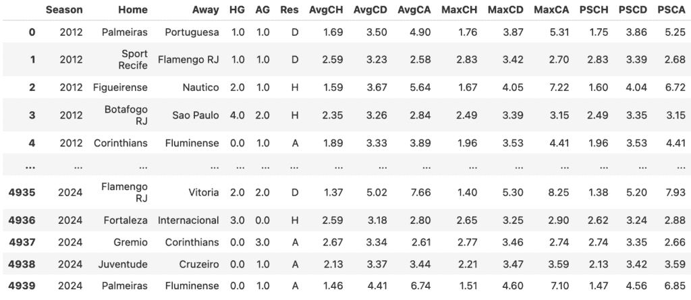
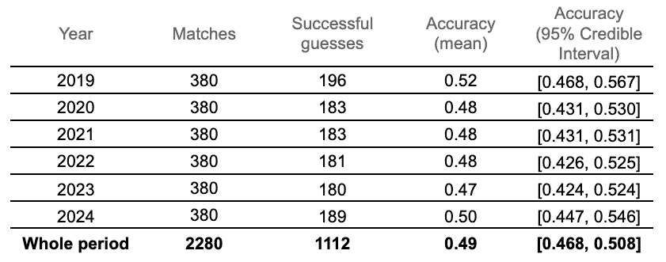
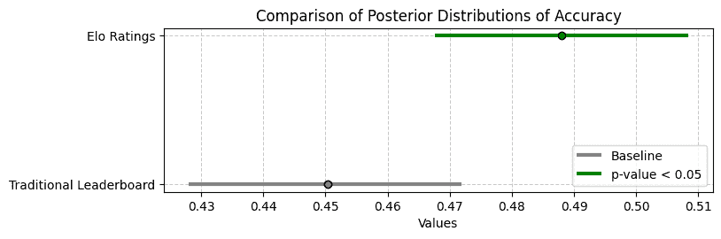
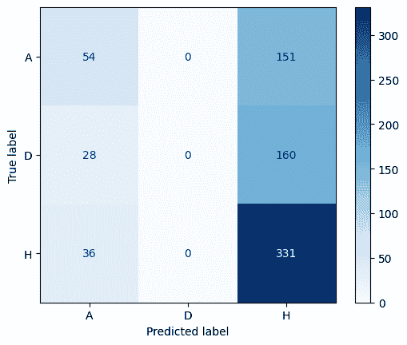
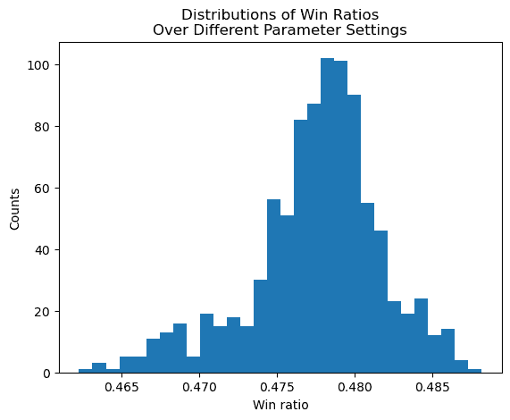

# 我们能否用棋类游戏预测足球比赛？

> 原文：[`towardsdatascience.com/can-we-use-chess-to-predict-soccer/`](https://towardsdatascience.com/can-we-use-chess-to-predict-soccer/)

## <mdspan datatext="el1749854967384" class="mdspan-comment">简介</mdspan>

没有其他方法。每个足球迷都曾无数次地就哪些球队将赢得即将到来的比赛进行过热烈的讨论。为了支持他们的猜测，大多数球迷滔滔不绝地谈论球员、教练以及从一年中的哪个时间到场地质量等一系列因素。还有一些人查看历史统计数据，提到每个球队在最近几轮的表现，或者那两支球队在上次交锋时的表现。然而，无论争论如何，每个球迷都在试图衡量同一件事：哪个球队的实力最强？

官方排名试图根据“质量”来衡量和分类球队，但它们存在一系列足球迷同样熟悉的缺陷，不能完全依赖。在这篇文章中，我们探讨了一种评估球队质量的不同方法，该方法借鉴了长期以来在棋类游戏中使用的排名系统，并随着时间的推移适应了其他运动：Elo 排名。除了从头开始实施系统外，我们还展示了 Elo 排名在预测比赛结果方面优于传统排名。

## 理论基础

### 核心思想和假设

与普遍看法相反，Elo 不是一个缩写，而是一个名字。Elo 系统是在 1967 年由 Arpad Elo 创建的，用于评估棋类选手的表现（Elo，1967）。根据 Elo 的说法，该系统基于一个简单想法：可以建立一个评分量表，其中许多单个球员的表现测量值将呈**正态分布**。

换句话说，如果我们观察一个球员在多场比赛中的表现，他的表现很可能会在一场比赛和另一场之间略有波动，但这些波动应该围绕一个平均值，即球员的真实技能水平。按照这个推理，如果两个球员的表现可以用两个正态分布来描述，那么球员 A 赢得球员 B 的概率等于从 A 的正态分布中抽取的一个随机样本大于从 B 的正态分布中抽取的一个随机样本的概率。

在其核心，Elo 创建了一个*相对分数*系统，我们使用两位玩家（在理论上，是反映他们真实技能的）评分之间的差异来估计他们各自获胜的可能性。Elo 评分的另一个有趣方面是，在确定玩家的技能水平时，系统还考虑到了并非所有胜利或失败都具有同等重要性的事实。只需想想，如果你听到曼城（甲级）对阵布罗姆利（乙级）赢得比赛的消息，你不会感到惊讶。然而，如果结果是相反的，你不仅会感到震惊，而且还会重新评估你对两支球队实力的评估。这种动态被构建在 Elo 系统的机制中，意外结果对涉及球队的评分的影响比明显结果要大得多。

### 数学实现

要实现这样一个系统，我们需要有一种方法来估计每支球队获胜的可能性，以及一种方法来更新我们对他们实力的评估。这就是为什么 Elo 设计了两个相互对话的基本组件：*更新*和*预测*函数。

暂且假设我们正处于足球赛季的中间阶段，并且不知何故拥有所有球队及其 Elo 评分的列表。评分只是一个衡量球队质量的数字，通过比较不同的评分，我们可以推断出哪支球队最强。一场新的比赛即将开始，在其开始之前，我们想要估计每支球队获胜的概率。为此，我们使用 Elo 系统的*预测*函数，该函数由以下公式给出

\[E_H = \frac{1}{1+c^{(R_A – R_H)/d}}\]

在这里，E_H 是主队的预期结果，一个介于 0 和 1 之间的数字，代表主队获胜的概率。比赛前的每支球队的评分分别由 R_H 和 R_A 表示，分别对应主队和客队。最后，*c*和*d*是自由参数，可以取任何值，但传统上设置为 10 和 400，如 Wunderlich & Memmert (2018)所述。你不必一定知道这一点，但通过设置这些值，我们暗示 400 分的差距对应于两队之间的 10 倍赔率，这意味着更强的俱乐部预计每损失一次就能赢 10 次。

在一个理想的世界里，不存在平局，例如世界杯决赛，我们也可以轻松计算出客队的预期结果：E_A = (1 — E_H)。然而，在实践中，这往往并非如此，我们很快就会解释如何考虑平局。但在这样做之前，让我们先完成对原始系统的理解。回到曼城对阵布罗姆利的例子。

几天后，你使用他们的 Elo 评级预测了胜者，比赛实际上发生了，其中一支球队获胜，我们刚刚获得了关于每支球队表现和当前实力的新信息。是时候更新他们的评级，以便我们的系统尽可能真实地反映现实。为此，我们使用*更新*函数，它传统上定义为

\[R’_H = R_H + K(S_H – E_H)\]

在这里，R’_H 是主队的最新评级，R_H 是比赛前的评级，*K* 是一个缩放因子，它决定了结果对球队评级的影响程度，S_H 是比赛结果（胜利为 1，平局为 0.5，失利为 0），而 E_H 是预期结果，即根据你之前推断的预测步骤，主队获胜的概率。客队的公式与此相同，只需将下标从“H”交换到“A”以及反之。在实践中，你会使用这个公式来重新计算曼城和布罗姆利的评级，这将然后为你对未来这些球队参加的比赛的估计提供信息。

在我们展示的所有参数中，*K* 是最重要的。根据 Elo 的原始出版物，*K* 的较高值会给近期表现赋予更多权重，而较低值则允许过去的表现对定义球队评级有更大的影响。只需想想，如果我们有一支过去所有比赛都输掉的球队，他们可能比其他人有更低的评级。当这支球队开始再次获胜时，我们公式中*K*的值越大，他们的评级回升就越快。

需要注意的一个方面是，在原始文章中，*K* 的值取决于记录在案的赛事数量。当计算新球员的评级时，Elo 使用了一个较高的*K*值，这使得他的评级可以显著变化。随着时间的推移，这个值会略微降低，直到达到一个平台期。然而，在实践中，几乎没有人修改*K*的值，正如 Elo 最初建议的那样，广泛默认的设置是*K* = 32。

### 将 Elo 应用于足球的问题

尽管该系统广受欢迎，但在应用于足球时，其原始实现存在显著的不足。首先，由于该系统是为两人零和游戏设计的，因此它没有直接考虑平局的可能性。或者更具体地说，尽管历史数据显示这种结果有 26%的概率发生，但我们无法直接从预测步骤中推断出平局的概率。其次，Elo 系统仅基于先前比赛的结果，这意味着它没有结合除最终结果以外的任何其他信息来源，即使它们可能是有用的（Hvattum & Arntzen, 2010）。第三，原始系统是为国际象棋设计的，它没有考虑哪位选手拥有黑棋或白棋，尽管在国际象棋中，白棋由于先手优势而自然地优于黑棋。在足球中，这相当于主队的自然优势：每个足球迷都知道，主场作战的球队相对于客场作战的球队具有自然优势。

已经提出了许多尝试解决这些问题的方法，其中一些已经得到广泛应用。例如，为了根据评级推导出平局的概率，随着时间的推移，测试了不同的方法，从使用历史平局频率的简单重新归一化技术（Betfair, 2022）到应用多项式逻辑回归（Wunderlich & Memmert, 2018）以及原模型的正式迭代（Szczecinski & Djebbi, 2020）。还有多种方法考虑模型中的主队优势，例如在系统的预测步骤中包含一个新参数。另一种有趣的修改是在重新计算评级时包含比赛结果之外的信息，例如两队的净胜球差。为了考虑这一点，一些作者在更新函数中包含了一个全新的项（Stankovic, 2023），而其他人则简单地修改了他们的*K*参数（eloratings.net, n.d.; Wunderlich & Memmert, 2018）。值得提及的一种解决方案是 Hvattum 和 Arntzen（2010）提出的

\[ k = k_0(1+\delta)^\lambda\]

其中，delta 表示净胜球差，使用 k_0 和 lambda 作为大于零的固定参数。

最后，读者可能会问，评分需要多长时间才能准确地反映一支球队的表现。在原始文章中，Elo 提到，良好的统计实践至少需要 30 场比赛来确定一个球员的评分具有一定的信心。这与足球系统中该系统的著名实现相一致：例如，eloratings.net 表示，评分通常在约 30 场比赛后收敛到一支球队的真正实力。其他方法往往更加系统化，尤其是在有更多数据的情况下。例如，Wunderlich 和 Memmert (2018) 将前两个赛季留给校准每个球队的 Elo 评分。然后，使用另外三个赛季来收集数据并创建一个有序逻辑模型，该模型给出主/平/客的概率。最后，在他们研究的最后五个赛季中，逻辑模型提供了为每场比赛做出预测的概率。我们从这种方法中获得了灵感，以实现我们自己的系统。

## 系统实现

### 我们的假设

我们对 Elo 系统的实现受到了 Wunderlich 和 Memmert (2018) 以及 Hvattum 和 Arntzen (2010) 的指导。首先，我们的预测函数由以下公式给出

\[E_H = \frac{1}{1+c^{(R_A – R_H – \omega)/d}}\]

其中 c = 10，d = 400，ω 是一个设置为 100 的主场优势因子。从这个算法中，我们还可以推断出

\[ E_A = 1 – E_H \]

因此，完成了 Elo 预测过程，尽管这并不是我们将评分转换为概率的方法。实际的概率计算是通过逻辑回归来完成的，我们使用 E_H 和 E_A 的公式只是为了推导出更新函数所需的变量。反过来，更新函数由以下公式给出

\[ R’_H = R_H + k_0(1+\delta)(S_H – E_H) \]

在这里，标准的 *K* 因子被一个自适应缩放因子所取代，该因子考虑了比赛中绝对的目标差异（用 δ 表示）。在这里，k_0 = 10，而 *K* 的最终值随着目标差异的增加而增加。更新客队评分的公式与之前相同，只是将下标从 “H” 改为 “A”。

在我们的实现中，评级是季节无关的，这意味着一个队伍在赛季结束时的评级会带入下一个赛季的开始。这自然导致了一个问题，因为每个赛季都会有一些我们没有评级的队伍被提升。为了应对这个挑战，我们决定在数据集的第一个赛季的第一分区的每个队伍从 1000 分开始评级，并在赛季结束时，每个新提升的队伍获得被降级的队伍的评级。这种机制比为新提升的队伍设定全新的 1000 分评级更符合现实：至少在开始时，我们预计来自低分区的队伍的表现会比留在顶级分区的队伍差。最后，我们引入了一个多项逻辑回归，它使用评级差异作为唯一的自变量来预测每场比赛中哪种结果更可能发生——因此，哪支队伍更有可能获胜。

### 数据集

我们使用的数据集最初来自[`www.football-data.co.uk/`](https://www.football-data.co.uk/)，该网站允许我们使用这些数据撰写本文，并包含有关 2012 年至 2024 年巴西足球锦标赛（Brasileirão）所有比赛的信息。



数据集截图。[图片由作者提供]

数据集的前三个赛季（2012-2014）仅用于 Elo 评级校准。接下来的四个赛季（2015-2018）用于校准输出每场比赛结果概率的逻辑函数：除了在每场比赛后持续更新 Elo 评级外，我们还创建了一个包含参与队伍评级差异和比赛结果的第二个数据集。这个数据集后来被用来拟合一个多项逻辑回归，该回归可以根据评级差异预测比赛结果。最后，最后六个赛季（2019-2024）被保留用于系统回测。在每场比赛后，评级仍然会更新，逻辑函数在赛季之间根据到那时收集的所有数据进行校准。在每场比赛中，根据两支队伍的评级差异，我们想要根据逻辑回归预测最可能的结果，并观察结果。

### 代码

#### 第 1 步：初始评级校准

一旦系统被明确定义，就到了深入代码的时候了！我们首先实现每个 Elo 系统的核心：*预测*和*更新*函数。（作为参考，你可以在[这里](https://github.com/FelipeBandeira/capstone/blob/main/5.%20Elo%20implementation.ipynb)看到完整的实现。我已经使用 AI 来记录代码，以便你更容易地跟随。）

```py
def elo_predict(c, d, omega, teams, ratings_dict):
  '''
  Calculates predicted Elo outcome (E_H and E_A)

  Inputs:
    c, d, omega: int
      Free variables for the formula
    teams: list
      Name of both teams in the match
    ratings_dict: dict
      Dictionary with the teams as keys and their Elo score as value

  Outputs:
    expected_home, expected_away: float
      The expected Elo outcome (E_H and E_A) for each team
    rating_difference: float
      The difference in ratings between both teams (used to inform the logistic regression)

  '''
  rating_home = ratings_dict[teams[0]]
  rating_away = ratings_dict[teams[1]]
  rating_difference = rating_home - rating_away

  exponent = (rating_away - rating_home - omega)/d

  expected_home = 1/(1 + c**exponent) # This is E_H in the formula
  expected_away = 1 - expected_home

  return expected_home, expected_away, rating_difference

def elo_update(k0, expected_home, expected_away, teams, goals, outcomes, ratings_dict):
  '''
  Updates Elo ratings for two teams based on the match outcome.

  Inputs:
    k0: int or float
      Base scaling factor used for the rating update
    expected_home, expected_away: float
      The expected outcomes for the home and away teams (E_H and E_A)
    teams: list
      Name of both teams in the match (home team first, away team second)
    goals: list
      Number of goals scored by each team ([home_goals, away_goals])
    outcomes: list
      Actual match outcomes for both teams ([home_outcome, away_outcome])
      Typically 1 for a win, 0.5 for a draw, and 0 for a loss
    ratings_dict: dict
      Dictionary with the teams as keys and their current Elo ratings as values

  Outputs:
    ratings_dict: dict
      Updated dictionary with new Elo ratings for the two teams involved in the match
  '''
  # Unpacks variables
  home = teams[0]
  away = teams[1]
  rating_home = ratings_dict[home]
  rating_away = ratings_dict[away]
  outcome_home = outcomes[0]
  outcome_away = outcomes[1]
  goal_diff = abs(goals[0] - goals[1])

  ratings_dict[home] = rating_home + k0*(1+goal_diff) * (outcome_home - expected_home)
  ratings_dict[away] = rating_away + k0*(1+goal_diff) * (outcome_away - expected_away)

  return ratings_dict
```

我们还创建了一个快速函数，将比赛的实际情况（赢、平或输）转换为 Elo 公式所需的格式（1、0.5 或 0）。

```py
def determine_elo_outcome(row):
  '''
  Determines outcome of a match (S_H or S_A in the formula) according to Elo's standards:
  0 for loss, 0.5 for draw, 1 for victory
  '''
  if row['Res'] == 'H':
    return [1, 0]
  elif row['Res'] == 'D':
    return [0.5, 0.5]
  else:
    return [0, 1]
```

我们还需要另一个构建块，这是一个函数，用于执行在每个赛季开始时为新晋队伍分配新评分的过程。

```py
def adjust_teams_interseason(ratings_dict, elo_calibration_df):
  '''
  Implements the process in which promoted teams take the Elo ratings
  of demoted teams in between seasons
  '''
  # Lists all teams in previous and upcoming seasons
  old_season_teams = set(ratings_dict.keys())
  new_season_teams = set(elo_calibration_df['Home'].unique())

  # If any teams were demoted/promoted
  if len(old_season_teams - new_season_teams) != 0:
    demoted_teams = list(old_season_teams - new_season_teams)
    promoted_teams = list(new_season_teams - old_season_teams)

    # Inserts new team in the dictionary and removes the old one
    for i in range(4):
      ratings_dict[promoted_teams[i]] = ratings_dict.pop(demoted_teams[i])

  return ratings_dict

def create_elo_dict(df):
  # Creates very first dictionary with initial rating of 1000 for all teams
  teams = df[df['Season'] == 2012]['Home'].unique()
  ratings_dict = {}

  for team in teams:
      ratings_dict[team] = 1000

  return ratings_dict

# Calling the function
calibration_seasons = [2012, 2013, 2014]
ratings_dict = run_elo_calibration(df, calibration_seasons)
```

最后，所有这些部分都在一个函数中汇集起来，该函数执行我们想要执行的第一大过程：在 2012–2014 赛季对评分进行初始校准。

```py
def run_elo_calibration(df, calibration_seasons, c=10, d=400, omega=100, k0=10):
  '''
  This function iteratively adjusts team ratings based on match results over multiple seasons.

  Inputs:
    df: pandas.DataFrame
      Dataset containing match data, including columns for season, teams, goals etc.
    calibration_seasons: list
      List of seasons (or years) to be used for the calibration process
    c, d: int or float, optional (default: 10 and 400)
      Free variables for the Elo prediction formula
    omega: int or float (default=100)
      Free variable representing the advantage of the home team
    k0: int or float, optional (default=10)
      Scaling factor used to determine the influence of recent matches on team ratings

  Outputs:
    ratings_dict: dict
      Dictionary with the final Elo ratings for all teams after calibration
  '''
  # Initialize Elo ratings for all teams
  ratings_dict = create_elo_dict(df)

  # Loop through the specified calibration seasons
  for season in calibration_seasons:
    # Filter data for the current season
    season_df = df[df['Season'] == season]

    # Adjust team ratings for inter-season changes
    ratings_dict = adjust_teams_interseason(ratings_dict, season_df)

    # Iterate over each match in the current season
    for index, row in season_df.iterrows():
      # Extract team names and match information
      teams = [row['Home'], row['Away']]
      goals = [row['HG'], row['AG']]

      # Determine the actual match outcomes in Elo terms
      elo_outcomes = determine_elo_outcome(row)

      # Calculate expected outcomes using the Elo prediction formula
      expected_home, expected_away, _ = elo_predict(c, d, omega, teams, ratings_dict)

      # Update the Elo ratings based on the match results
      ratings_dict = elo_update(k0, expected_home, expected_away, teams, goals, elo_outcomes, ratings_dict)

  # Return the calibrated Elo ratings
  return ratings_dict
```

运行此函数后，我们将有一个包含每个队伍及其相关 Elo 评分的字典。

#### 第 2 步：校准逻辑回归

在 2015–2018 赛季，我们将同时执行两个过程。首先，我们像以前一样在每场比赛结束时更新所有队伍的 Elo 评分。其次，我们开始收集每个比赛中的额外数据，以便在这个时期结束时训练逻辑回归。这些逻辑回归将用于后来生成每个结果的预测。在代码中，这转化为以下内容：

```py
def run_logit_calibration(df, logit_seasons, ratings_dict, c=10, d=400, omega=100, k0=10):
  '''
  Runs the logistic regression calibration process for Elo ratings.

  This function calibrates Elo ratings over multiple seasons while collecting data
  (rating differences and outcomes) to prepare for training a logistic regression.
  The logistic regression is later used to make outcome predictions based on rating differences.

  Inputs:
    df: pandas.DataFrame
      Dataset containing match data, including columns for 'Season', 'Home', 'Away', 'HG', 'AG', 'Res', etc.
    logit_seasons: list
      List of seasons (or years) to be used for the logistic regression calibration process
    ratings_dict: dict
      Initial Elo ratings dictionary with teams as keys and their ratings as values
    c, d: int or float, optional (default: 10 and 400)
      Free variables for the Elo prediction formula
    omega: int or float (default=100)
      Free variable representing the advantage of the home team
    k0: int or float, optional (default=10)
      Scaling factor used to determine the influence of recent matches on team ratings

  Outputs:
    ratings_dict: dict
      Updated Elo ratings dictionary after calibration
    logit_df: pandas.DataFrame
      DataFrame containing columns 'rating_diff' (Elo rating difference between teams)
      and 'outcome' (match results) for logistic regression analysis
  '''
  # Initializes the Elo ratings dictionary
  ratings_dict = ratings_dict

  # Initializes an empty DataFrame to store rating differences and outcomes
  logit_df = pd.DataFrame(columns=['season', 'rating_diff', 'outcome'])

  # Loops through the specified seasons for logistic calibration
  for season in logit_seasons:
    # Filters data for the current season
    season_df = df[df['Season'] == season]

    # Adjusts team ratings for inter-season changes
    ratings_dict = adjust_teams_interseason(ratings_dict, season_df)

    # Iterates over each match in the current season
    for index, row in season_df.iterrows():
      # Extracts team names and match information
      teams = [row['Home'], row['Away']]
      goals = [row['HG'], row['AG']]

      # Determines the match outcomes in Elo terms
      elo_outcomes = determine_elo_outcome(row)

      # Calculates expected outcomes and rating difference using the Elo prediction formula
      expected_home, expected_away, rating_difference = elo_predict(c, d, omega, teams, ratings_dict)

      # Updates Elo ratings based on the match results
      ratings_dict = elo_update(k0, expected_home, expected_away, teams, goals, elo_outcomes, ratings_dict)

      # Adds the rating difference and match outcome to the logit DataFrame
      logit_df.loc[len(logit_df)] = {'season': season, 'rating_diff': rating_difference, 'outcome': row['Res']}

  # Returns the updated ratings and the logistic regression dataset
  return ratings_dict, logit_df

# Calling the function
logit_seasons = [2015, 2016, 2017, 2018]
ratings_dict, logit_df = run_logit_calibration(df, logit_seasons, ratings_dict, c=10, d=400, omega=100, k0=10)
```

现在，我们不仅有一个像以前一样的带有 Elo 评分的更新字典，还额外有一个包含评分差异（我们的自变量）和比赛结果（我们的因变量）的数据集。有了这些数据，我们创建了一个函数来拟合逻辑回归，并调整了一些由 [Machine Learning Mastery](https://machinelearningmastery.com/multinomial-logistic-regression-with-python/) 提供的代码。

```py
def fit_logistic_regression(logit_df, max_past_seasons = 15, report = True):

  # Prunes the dataframe, if needed
  most_recent_seasons = sorted(logit_df['season'].unique(), reverse=True)[:max_past_seasons]
  filtered_df = logit_df[logit_df['season'].isin(most_recent_seasons)].copy()

  # Adjust outcome columns from str to int
  label_encoder = LabelEncoder()
  filtered_df['outcome_encoded'] = label_encoder.fit_transform(filtered_df['outcome'])

  # Isolates independent and dependent variables
  X = filtered_df[['rating_diff']].values
  y = filtered_df['outcome_encoded'].values
  X_train, X_test, y_train, y_test = train_test_split(X, y, test_size=0.2)

  # define the multinomial logistic regression model
  model = LogisticRegression(solver='lbfgs')

  # fit the model on the whole dataset
  model.fit(X, y)

  # report the model performance
  if report:
    # Generate predictions on the test data
    y_pred = model.predict(X_test)
    y_prob = model.predict_proba(X_test)

    # Compute key metrics
    cm = confusion_matrix(y_test, y_pred)
    recall = recall_score(y_test, y_pred, average='weighted')
    loss = log_loss(y_test, y_prob)
    balanced_acc = balanced_accuracy_score(y_test, y_pred)

    print(f'Recall (weighted): {recall}')
    print(f'Balanced accuracy: {balanced_acc}')
    print(f'Log loss: {loss}')
    print()

    # Display the confusion matrix
    disp = ConfusionMatrixDisplay(confusion_matrix=cm, display_labels=label_encoder.classes_)
    disp.plot(cmap="Blues")

  return model
```

#### 第 3 步：运行系统

对于 2019–2024 赛季，我们运行系统来评估其性能。在每个赛季开始时，我们使用最新的数据重新训练逻辑回归。在每场比赛结束时，我们记录我们的预测是否正确。

```py
def run_elo_predictions(df, logit_df, seasons, ratings_dict, plot_title,
                        c=10, d=400, omega=100, k0=10, max_past_seasons=15,
                        report_ml=False):
    '''
    Runs an Elo + logistic regression pipeline to predict match outcomes.

    This function processes matches across multiple seasons, using Elo ratings
    to estimate team strength and logistic regression to predict match outcomes.
    It logs predictions and actual outcomes for performance evaluation.

    Inputs:
      df: pandas.DataFrame
        Dataset with match data: 'Season', 'Home', 'Away', 'HG', 'AG', 'Res', etc.
      logit_df: pandas.DataFrame
        Historical data with Elo differences and match outcomes to train the model.
      seasons: list
        Seasons (or years) to include in the evaluation loop.
      ratings_dict: dict
        Current Elo ratings for all teams.
      c, d: Elo parameters
      omega: Home advantage parameter
      k0: Elo update factor
      max_past_seasons: int
        How many seasons back to include when training logistic regression
      report_ml: bool
        Whether to print model performance each season

    Outputs:
      posterior_samples (array): Samples from the posterior of prediction accuracy
      prediction_log (DataFrame): Logs model predictions vs actual outcomes
    '''
    ratings_dict = ratings_dict
    logit_df = logit_df

    prediction_log = pd.DataFrame(columns=['Season', 'Prediction', 'Actual', 'Correct'])

    for season in seasons:
        if season == seasons[-1]:
            print('\nLogistic regression performance at FINAL SEASON')
            logistic_regression = fit_logistic_regression(logit_df, max_past_seasons, report=True)
        else:
            if report_ml:
                print(f'Logistic regression performance PRE SEASON {season}')
            logistic_regression = fit_logistic_regression(logit_df, max_past_seasons, report=report_ml)

        season_df = df[df['Season'] == season]
        ratings_dict = adjust_teams_interseason(ratings_dict, season_df)

        for index, row in season_df.iterrows():
            teams = [row['Home'], row['Away']]
            goals = [row['HG'], row['AG']]
            elo_outcomes = determine_elo_outcome(row)

            expected_home, expected_away, rating_difference = elo_predict(c, d, omega, teams, ratings_dict)
            yhat = logistic_regression.predict([[rating_difference]])[0]

            prediction = 'A' if yhat == 0 else 'D' if yhat == 1 else 'H'
            actual = row['Res']
            correct = int(prediction == actual)

            prediction_log.loc[len(prediction_log)] = {
                'Season': season,
                'Prediction': prediction,
                'Actual': actual,
                'Correct': correct
            }

            # Update Elo ratings and training data
            ratings_dict = elo_update(k0, expected_home, expected_away, teams, goals, elo_outcomes, ratings_dict)
            logit_df.loc[len(logit_df)] = {'season': season, 'rating_diff': rating_difference, 'outcome': actual}

    # Analyze predictive performance using Bayesian modeling
    num_predictions = len(prediction_log)
    num_correct = prediction_log['Correct'].sum()

    return num_predictions, num_correct
```

现在，对于最后的六个赛季中的每一个，我们记录了正确的猜测数量。有了这些信息，我们可以使用贝叶斯参数估计来评估系统的准确性。

## 评估结果

如果我们考虑这样一个事实，在每一场比赛中，我们都会猜测哪支队伍会赢，这个猜测要么是正确的，要么是错误的，整个过程可以用概率为 *p* 的二项分布来描述，其中 *p* 是我们猜测正确的概率（或我们猜测的技能）。这个 *p* 由先验均匀分布 Uniform(0, 1) 定义，这意味着在运行模型之前，我们没有对其值有任何特别的信念。利用回测赛季的数据，我们使用 PyMC 来估计 *p* 的后验值，并通过其均值和 95% 置信区间来报告。为了参考，PyMC 代码如下所示。

```py
def fit_pymc(samples, success):
  '''
  Creates a PyMC model to estimate the accuracy of guesses
  made with Elo ratings over a given period of time.
  '''
  with pm.Model() as model:
    p = pm.Uniform('p', lower=0, upper=1) # Prior
    x = pm.Binomial('x', n=samples, p=p, observed=success) # Likelihood

  with model:
    inference = pm.sample(progressbar=False, chains = 4, draws = 2000)

  # Stores key variables
  mean = az.summary(inference, hdi_prob = 0.95)['mean'].values[0]
  lower = az.summary(inference, hdi_prob = 0.95)['hdi_2.5%'].values[0]
  upper = az.summary(inference, hdi_prob = 0.95)['hdi_97.5%'].values[0]

  return mean, [lower, upper]
```

结果如下所示。在每个赛季中，380 场总比赛中，我们正确猜测了大约一半的结果。代表我们系统预测能力的 *p* 值的置信区间在赛季间略有变化。然而，经过六个赛季后，有 95% 的概率，*p* 的真实值在 0.46 和 0.50 之间。



我们创建的 Elo 系统的结果。*注意，为了估计所有赛季后 p 的值，我们将数据汇总并再次运行 PyMC 模型。这隐含地意味着我们相信这是一个**完全汇总**的情况。如果你不熟悉汇总是如何工作的，不要担心。底线是，通过将所有赛季的数据加在一起，我们假设我们的系统预测能力在赛季间不会改变。*

考虑到在足球中存在三种可能的结果，我们大约一半时间猜对了结果是个好消息。这意味着我们并不是随机猜测，例如，如果随机猜测，只有大约 33%的预测会正确。

然而，一个更重要的问题出现了。**Elo 评分在预测结果方面是否比传统排名更好？**

为了回答这个问题，我们还实施了一个复制官方排行榜并猜测最佳排名队伍为每场比赛胜者的系统。然后我们运行了一个类似的 PyMC 模型来估计这种替代方法的锐度（二项分布的*p*参数）。一旦我们有了这两个后验分布，我们就从它们中抽取随机样本并比较它们的值来进行假设检验。



每个条形代表每个系统中 p 的后验均值的 95%置信区间。绿色仅表示，确实，差异在统计上具有显著性。[图片由作者提供]

上图显示了 95%置信区间，估计每种方法预测结果的好坏。我们看到，使用 Elo 评分来预测比赛的胜者确实比使用传统排行榜要好。从准确性的角度来看，两种方法之间的差异在统计上具有显著性（p 值 < 0.05），这是一个相当大的成就。

## 结论

尽管 Elo 评分并不能每次都正确地猜测出比赛的胜者，但它们确实比传统排名表现得更好。更重要的是，它们反映了这样一个事实：非常规变量可以用来衡量球队的质量，而且足球迷在评估他们感兴趣的比赛中可能的结果时，可能会从使用替代信息来源中受益。

## 参考文献

A. Elo, *提出的 USCF 评分系统：其发展、理论与应用* (1967), 国际象棋生活，22(8)，242–247。

Betfair, *[使用 Elo 方法在 R 中建模足球](https://betfair-datascientists.github.io/modelling/soccerEloTutorialR/)* (2022), Betfair 数据科学家。

Eloratings.net, *[世界足球 Elo 评分](https://www.eloratings.net/about)* (n.d.), Eloratings.net。

F. Wunderlich & D. Memmert, *[投注赔率评分系统：使用足球预测来预测足球](https://doi.org/10.1371/journal.pone.0198668)* (2018), PLOS ONE，13(6)。

F. Wunderlich, M. Weigelt, R. Rein & D. Memmert, *[观众在场如何影响足球？在 COVID-19 大流行期间没有观众参加的欧洲顶级足球比赛中主场优势依然存在](https://doi.org/10.1371/journal.pone.0248590)* (2021), PLOS ONE, 16(3).

L. M. Hvattum & H. Arntzen, *[使用 Elo 评级预测足球比赛结果](https://doi.org/10.1016/j.ijforecast.2009.10.002)* (2010), International Journal of Forecasting, 26(3), 460–470.

L. Szczecinski & A. Djebbi, *[在 Elo 评级算法中理解平局](https://doi.org/10.1515/jqas-2019-0102)* (2020), Journal of Quantitative Analysis in Sports, 16(3), 211–220.

S. Stankovic, *[Elo 评级系统](https://stanislav-stankovic.medium.com/elo-rating-system-6196cc59941e)* (2023), Medium.

## 其他注意事项

### 深入了解模型的表现

我们构建的系统并非没有缺陷。为了改进它，我们需要了解它在哪些方面做得不够好。我们可以首先关注回归模型的表现。下面的混淆矩阵显示了回归模型在我们评估的最后赛季 2024 年预测的结果。



图片由作者提供

我们可以立即注意到三个方面：

1.  回归模型对主场的胜利过于自信，预测 84%的情况下这是正确的结果，而实际上这个结果只对应我们数据的 48%。

1.  回归模型对客场的胜利缺乏信心，只有 15%的时候猜测这个结果，而实际上它在 26%的比赛中发生了。

1.  令人惊讶的是，回归模型从未预测平局是最可能的结果。

混淆矩阵还允许我们探索另一个值得跟踪的指标：加权召回率。本质上，召回率评估了一个类别（主场胜利、平局或客场胜利）的实例中有多少被正确猜测，并且我们根据每个类别在数据集中的普遍程度来加权结果。在所有预测的主场胜利、平局和客场胜利的实例中，正确猜测的数量分别是 90%、0%和 45%。当我们考虑到类别在数据集中并不均匀分布，例如主场胜利几乎比客场胜利多一倍时，加权召回率上升到 50%。这意味着，一般来说，每当模型预测一个类别时，这个预测只有 50%是正确的。毫无疑问，这样的表现是不理想的；而不是正确捕捉到潜在的行为，回归模型大多数时候猜测的是主场胜利，因为它知道这是最可能的结果。

为了尝试解决这个问题，我们尝试通过网格搜索进行超参数估计，调整了函数中的三个关键参数：每次回归训练时包含在数据集中的过去赛季数量；K 值，它影响新结果对参与队伍评分的影响程度；以及**ω**，它代表主场优势的大小。使用不同的参数组合，我们测量了胜率，这是准确性的样本版本：回归做出的正确猜测的比例。然而，这个过程的结果并不令人满意。



图片由作者提供。

无论选择哪个超参数，胜率（以及，如果我们计算了的话，估计的精确区间）的变化都很小。这很可能意味着，无论一个队伍的具体 Elo 评分是多少，它受到 omega 和 K0 的影响，系统都会达到一个稳定水平，逻辑回归可以很好地捕捉到这一点。例如，假设队伍 A 的内在质量比队伍 B 高 40%。在原始参数集下，两队之间的评分差异可能是 10 分，但使用新的参数集，它可能跳到 50 分。无论具体数字是多少，每次两队内在质量相似时，回归都会学习代表这种差异的数字。鉴于 Elo 是一个相对评分系统，系统达到稳定，参数变化不会对回归产生实质性影响。

另一个有趣的发现是，总的来说，包含长期历史数据的历史数据并不影响回归的质量。无论我们每次拟合回归时使用一年、五年还是九年的历史数据，胜率大多相似。这可能可以用每个赛季观察到的数量很多来解释：380 个。在如此大量的数据点中，回归可以理解潜在的规律，即使我们只有一整个赛季的数据来分析。

这样的结果让我们产生了两个假设。首先，我们可能已经完全探索了 Elo 评分的潜力，而做出更好的猜测可能需要将额外的变量包含在回归中。或者，也可能是在 Elo 公式中添加新的项可以提高预测能力，使评分成为现实更好的反映。然而，这两个假设都尚未得到探索。

## 重要声明

许多人因为体育博彩而接触到足球建模，最终希望构建一个能够带来快速大量利润的算法。这并非我们的动机所在，我们也不以任何方式支持博彩活动。我们希望读者能为了技术学习而接受对如此复杂运动进行建模的挑战，因为这可以作为一个[强大动力](https://pmc.ncbi.nlm.nih.gov/articles/PMC11265715/)来发展[新的数据科学技能](https://www.pymc.io/projects/examples/en/latest/case_studies/rugby_analytics.html)。（这两篇文章）
