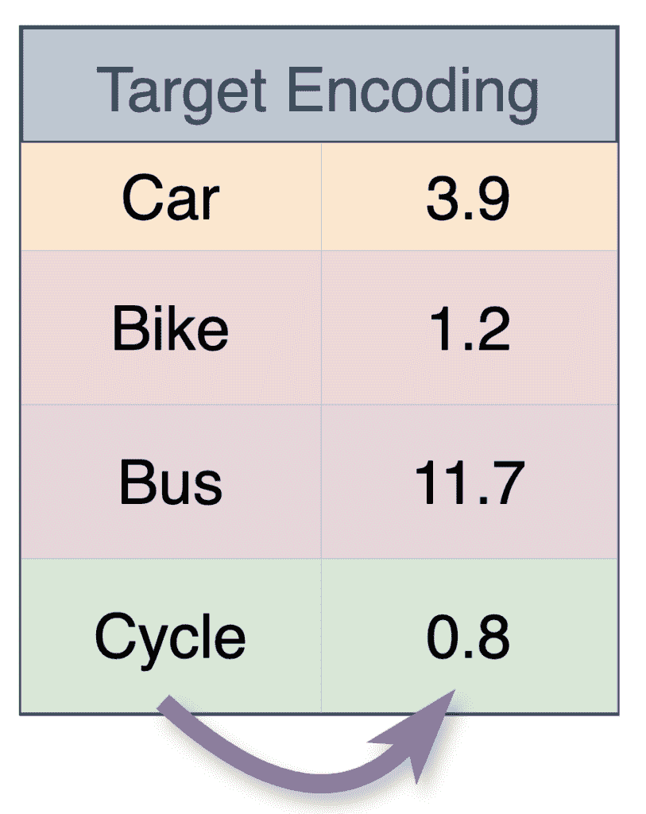
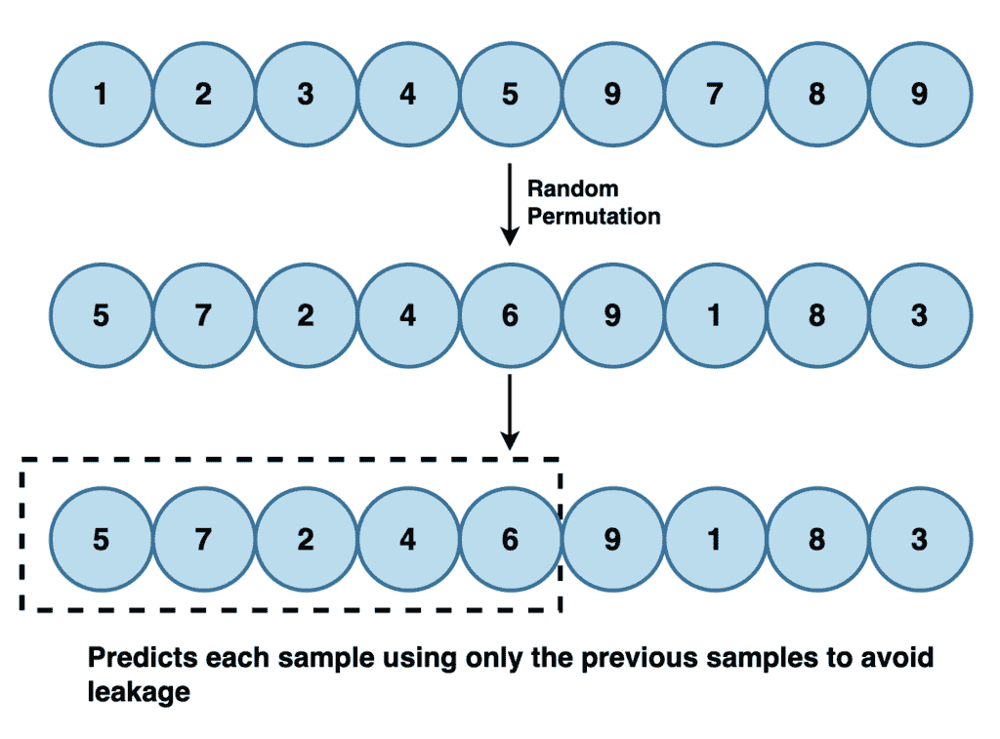
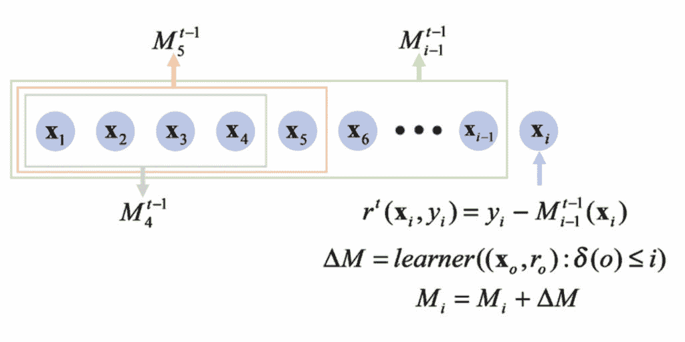
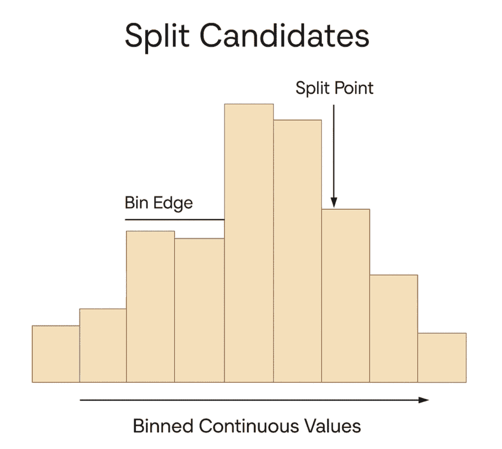
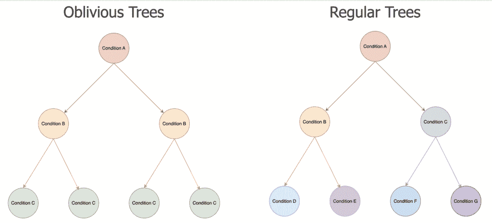

# 为什么 CatBoost 效果如此之好：魔法背后的工程

> 原文：[`towardsdatascience.com/catboost-inner-workings-and-optimizations/`](https://towardsdatascience.com/catboost-inner-workings-and-optimizations/)

<mdspan datatext="el1744219143668" class="mdspan-comment">梯度提升</mdspan>是建模表格数据的一个基石技术，因为它速度快且简单。它无需任何麻烦就能取得很好的结果。当你环顾四周时，你会看到多个选项，如 LightGBM、XGBoost 等。CatBoost 就是其中之一。在这篇文章中，我们将详细探讨这个模型，探索其内部工作原理，并了解它为何是现实世界任务的绝佳选择。

## 目标统计量

目标编码示例：使用目标变量的平均值来替换每个类别。图片由作者提供

目标编码示例：使用目标变量的平均值来替换每个类别

CatBoost 论文中一个重要的贡献是计算目标统计量的新方法。什么是目标统计量？如果你之前处理过分类变量，你会知道处理分类变量的最基本方法就是使用独热编码。从经验来看，你也知道这会引入一些问题，如稀疏性、维度诅咒、内存问题等。特别是对于高基数的分类变量。

### 贪婪目标统计量

为了避免独热编码，我们计算分类变量的目标统计量。这意味着我们计算目标变量在每个分类变量唯一值处的平均值。所以如果一个分类变量取值为——`A`、`B`、`C`，那么我们将计算所有这些值上\(\text{y}\)的平均值，并用这些值在唯一值处的平均值来替换它们。

这听起来不错，是吧？确实如此，但这种方法有其问题——即目标泄露。为了理解这一点，让我们用一个极端的例子来说明。极端例子通常是揭示方法中问题的最简单方式。考虑以下数据集：

| 分类列 | 目标列 |
| --- | --- |
| A | 0 |
| B | 1 |
| C | 0 |
| D | 1 |
| E | 0 |

贪婪目标统计量：计算每个唯一类别的目标值的平均值

现在让我们写出计算目标统计量的方程式：

\[\hat{x}^i_k = \frac{

\(\sum_{j=1}^{n} 1_{{x^i_j = x^i_k}} \cdot y_j + a p\)

}{

\(\sum_{j=1}^{n} 1_{{x^i_j = x^i_k}} + a\)

}\]

这里 \(x^i_j\) 是第 \(j\) 个样本的第 \(i\) 个分类特征的值。所以对于第 \(k\) 个样本，我们遍历所有 \(x^i\) 的样本，选择具有值 \(x^i_k\) 的样本，并取这些样本 \(y\) 的平均值。我们不是直接取平均值，而是取平滑平均值，这就是 \(a\) 和 \(p\) 项的作用。\(a\) 参数是平滑参数，\(p\) 是 \(y\) 的全局平均值。

如果我们使用上述公式计算目标统计量，我们得到：

| 分类列 | 目标列 | 目标统计量 |
| --- | --- | --- |
| A | 0 | \(\frac{ap}{1+a}\) |
| B | 1 | \(\frac{1+ap}{1+a}\) |
| C | 0 | \(\frac{ap}{1+a}\) |
| D | 1 | \(\frac{1+ap}{1+a}\) |
| E | 0 | \(\frac{ap}{1+a}\) |

带平滑的贪婪目标统计量计算

现在如果我将这个 `Target Statistic` 列作为我的训练数据，我将得到在 \( threshold = \frac{0.5+ap}{1+a}\) 处的完美分割。任何高于这个值的都将被分类为 `1`，任何低于这个值的都将被分类为 `0`。在这个点上，我得到了完美的分类，因此我在训练数据上得到了 100% 的准确率。

让我们看看测试数据。在这里，由于我们假设特征具有所有唯一值，目标统计量变为——

\[TS = \frac{0+ap}{0+a} = p\]

如果 \(threshold\) 大于 \(p\)，所有测试数据的预测都将为 \(0\)。相反，如果 \(threshold\) 小于 \(p\)，所有测试数据的预测都将为 \(1\)，导致测试集上的性能较差。

虽然我们很少看到所有分类变量值都唯一的 dataset，但我们确实看到了高基数的情况。这个极端例子展示了使用贪婪目标统计量作为编码方法的陷阱。

### 留一法目标统计量

因此，贪婪 TS 对我们来说并没有很好地工作。让我们尝试另一种方法——留一法目标统计量方法。乍一看，这似乎很有希望。但是，实际上，这也存在一些问题。让我们通过另一个极端例子来看看。这次让我们假设我们的分类变量 \(x^i\) 只有一个唯一值，即所有值都相同。考虑以下数据：

| 分类列 | 目标列 |
| --- | --- | --- |
| A | 0 |
| A | 1 |
| A | 0 |
| A | 1 |

极端案例的示例数据，其中分类特征只有一个唯一值

如果计算留一法目标统计量，我们得到：

| 分类列 | 目标列 | 目标统计量 |
| --- | --- | --- |
| A | 0 | \(\frac{n^+ -y_k + ap}{n+a}\) |
| A | 1 | \(\frac{n^+ -y_k + ap}{n+a}\) |
| A | 0 | \(\frac{n^+ -y_k + ap}{n+a}\) |
| A | 1 | \(\frac{n^+ -y_k + ap}{n+a}\) |

带平滑的留一法目标统计量计算

这里：

\(n\) 是数据中的总样本数（在我们的例子中为 4）

\(n^+\) 是数据中的正样本数（在我们的例子中为 2）

\(y_k\) 是该行目标列的值

替换上述内容，我们得到：

| 分类列 | 目标列 | 目标统计量 |
| --- | --- | --- |
| A | 0 | \(\frac{2 + ap}{4+a}\) |
| A | 1 | \(\frac{1 + ap}{4+a}\) |
| A | 0 | \(\frac{2 + ap}{4+a}\) |
| A | 1 | \(\frac{1 + ap}{4+a}\) |

替换 `n` 和 `n+` 的值

现在，如果我将这个`目标统计`列作为我的训练数据，我将在 \( threshold = \frac{1.5+ap}{4+a}\) 处获得完美的分割。任何高于这个值的将被分类为`0`，任何低于这个值的将被分类为`1`。在这个点上，我实现了完美的分类，因此我在训练数据上再次获得了 100%的准确率。

你看，问题就在这里，我的分类变量没有超过一个唯一值，它在`目标统计`中产生了不同的值，这将使训练数据表现良好，但在测试数据上却会惨败。

### 有序目标统计

有序学习的示意图：CatBoost 以随机排列的顺序处理数据，并使用早期样本来预测每个样本。图片由作者提供

CatBoost 引入了一种称为有序目标统计的技术来解决上述问题。这是 CatBoost 处理分类变量的核心原则。

这种方法，受在线学习启发，仅使用过去的数据进行预测。CatBoost 生成训练数据的随机排列（随机顺序）(\(\sigma\))。为了计算第 \(k\) 行样本的`目标统计`，CatBoost 使用从第 \(1\) 行到 \(k-1\) 行的样本。对于测试数据，它使用整个训练数据来计算统计量。

此外，CatBoost 为每棵树生成一个新的排列，而不是每次都重用相同的排列。这减少了在早期样本中可能出现的方差。

## 有序提升

这个可视化显示了 CatBoost 如何计算残差并更新模型：对于样本 \(x_i\)，模型仅使用早期数据点进行预测。[来源](https://doi.org/10.1093/fqsafe/fyae007)

CatBoost 论文引入的另一个重要创新是其使用有序提升。它建立在有序目标统计的类似原则上，CatBoost 在每个树的开始时随机排列训练数据，并按顺序进行预测。

在传统的提升方法中，当训练树 \(t\) 时，模型使用来自之前树 \(t−1\) 的预测来处理所有训练样本，包括它当前正在预测的样本。这可能导致**目标泄露**，因为模型可能在训练过程中间接使用当前样本的标签。

为了解决这个问题，CatBoost 使用有序提升，对于给定的样本，它只使用训练数据中之前行的预测来计算梯度并构建树。对于排列中的每一行 \(i\)，CatBoost 仅使用 \(i\) 之前的样本来计算叶子的输出值。模型使用这个值来获取 \(i\) 行的预测。因此，模型**不查看其标签**来预测每一行。

CatBoost 使用新的随机排列来训练每一棵树，以平均一个排列中早期样本的方差。

假设我们有 5 个数据点：`A, B, C, D, E`。CatBoost 创建这些点的**随机排列**。假设排列是：`σ = [C, A, E, B, D]`

| 步骤 | 用于训练的数据 | 预测的数据点 | 备注 |
| --- | --- | --- | --- |
| 1 | — | C | 没有先前数据 → 使用先验 |
| 2 | C | A | 仅在 C 上训练的模型 |
| 3 | C, A | E | 在 C, A 上训练的模型 |
| 4 | C, A, E | B | 在 C, A, E 上训练的模型 |
| 5 | C, A, E, B | D | 在 C, A, E, B 上训练的模型 |

表格突出显示 CatBoost 如何使用随机排列进行训练

这避免了使用当前行的实际标签来获取预测，从而防止**泄露**。

## 构建树

每次 CatBoost 构建树时，它都会创建训练数据的随机排列。它计算所有具有两个以上唯一值的分类变量的有序目标统计量。对于二元分类变量，它将值映射为零和一。

CatBoost 处理数据就像数据是按顺序到达的一样。它从一个实例的初始预测为零开始，这意味着残差最初等同于目标值。

随着训练的进行，CatBoost 使用之前落入同一叶子的样本的残差来更新每个样本的叶子输出。通过不使用当前样本的标签进行预测，CatBoost 有效地防止了数据泄露。

## 分割候选

CatBoost 将连续特征分箱以减少最佳分割的搜索空间。每个箱边和分割点代表一个潜在的决策阈值。图由作者提供

决策树的核心任务是选择最优的特征和阈值来分割节点。这涉及到评估多个特征-阈值组合，并选择给出最佳损失减少的那个。CatBoost 做的是类似的事情。它将连续变量离散化成箱，以简化对最优组合的搜索。它评估这些特征-箱组合以确定最佳分割

CatBoost 使用无记忆树，这是与其他树的关键区别，它在同一深度上所有节点使用相同的分割。

## 无记忆树

有序学习的示意图：CatBoost 以随机排列的顺序处理数据，并使用早期样本预测每个样本。图片由作者提供

与标准决策树不同，标准决策树的不同节点可以在不同的条件下（特征-阈值）分割，无记忆树在树的同一深度上所有节点应用相同的条件进行分割。在给定的深度，所有样本都评估相同的特征-阈值组合。这种对称性有几个影响：

+   速度和简单性：由于在相同深度上所有节点应用相同的条件，产生的树更简单，训练更快

+   正则化：由于所有树都被迫在树的同一深度上应用相同的条件，这会在预测上产生正则化效果

+   并行化：分割条件的统一性，使得树创建和 GPU 的使用以加速训练更容易并行化

## 结论

CatBoost 通过直接解决一个长期挑战而脱颖而出：如何在不会引起目标泄漏的情况下有效地处理分类变量。通过像**有序目标统计**、**有序提升**和**无记忆树**的使用这样的创新，它有效地平衡了鲁棒性和准确性。

如果你觉得这个深入探讨很有帮助，你可能还会喜欢另一个深入探讨[随机梯度分类器和逻辑回归之间的差异](https://shubhamgandhi.net/model-deep-dives/sgd-classifier-vs-logistic-regression/)

## 进一步阅读

+   [CatBoost：具有分类特征的未偏估计提升](https://arxiv.org/pdf/1706.09516)

+   [CatBoost：如何进行训练](https://catboost.ai/docs/en/concepts/algorithm-main-stages)

+   [CatBoost 通过使用 GPU 实现决策树上的快速梯度提升](https://catboost.ai/news/catboost-enables-fast-gradient-boosting-on-decision-trees-using-gpus)
