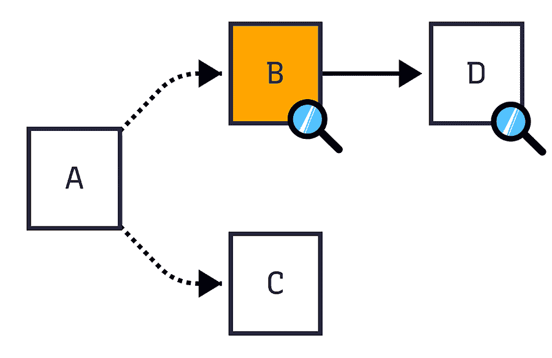
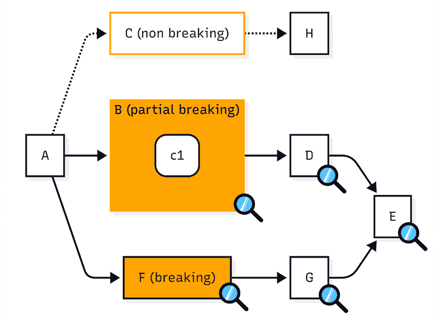
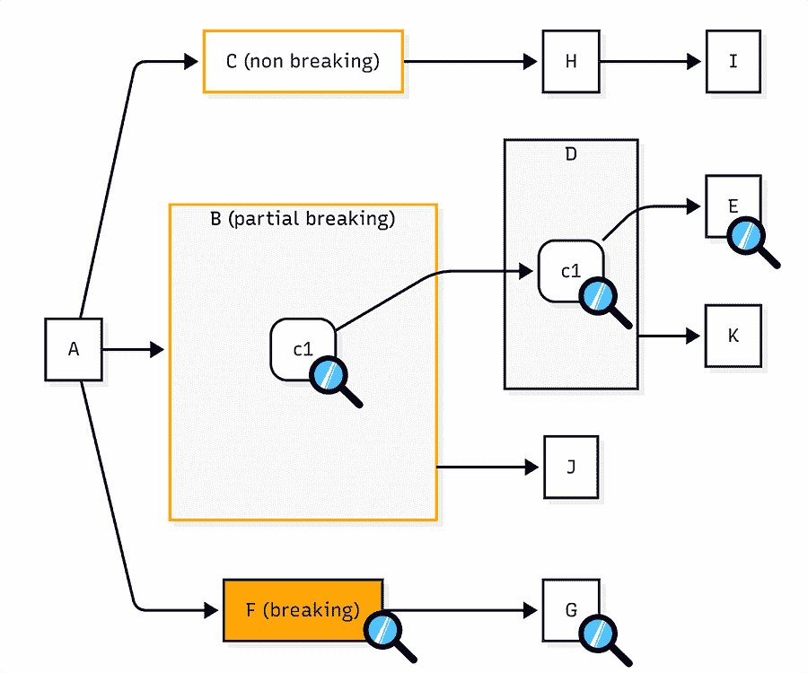

# 基于列级血缘的数据感知数据验证

> 原文：[`towardsdatascience.com/change-aware-data-validation-with-column-level-lineage/`](https://towardsdatascience.com/change-aware-data-validation-with-column-level-lineage/)

<mdspan datatext="el1751565216662" class="mdspan-comment">数据转换</mdspan>工具，如 dbt，使构建 SQL 数据管道变得简单且系统化。但即使增加了结构并明确定义了数据模型，管道仍然可能变得复杂，这使得调试问题和验证数据模型的变化变得困难。

数据转换逻辑的日益复杂引发了以下问题：

1.  **传统的代码审查流程**只关注代码更改，并排除了这些更改的数据影响。

1.  **代码更改导致的数据影响难以追踪**。在具有嵌套依赖的庞大 DAG 中，发现数据影响如何以及在哪里发生是非常耗时，或者几乎是不可能的。

Gitlab 的[dbt DAG](https://dbt.gitlabdata.com/#!/overview?g_v=1)（如上特色图片所示）是数据项目已经变成“纸牌屋”的完美例子。想象一下，试图通过整个血缘 DAG 追踪对列的简单 SQL 逻辑更改。审查数据模型更新将是一项艰巨的任务。

你将如何处理这种类型的审查？

## 数据验证是什么？

数据验证是指用于确定数据是否符合现实世界要求的过程。这意味着确保数据模型中的 SQL 逻辑通过验证数据是否正确来按预期执行。验证通常在修改数据模型后进行，例如满足新要求或作为重构的一部分。

### 一个独特的审查挑战

数据具有状态，并且直接受到用于生成它的转换的影响。这就是为什么审查数据模型变化是一个独特的挑战，因为需要审查代码和数据。

因此，数据模型更新不仅应该审查其完整性，还应该审查其上下文。换句话说，数据是正确的，并且现有数据和指标没有被无意中更改。

### 数据验证的两个极端

在大多数数据团队中，进行更改的人依赖于制度知识、直觉或以往的经验来评估影响和验证更改。

> *“我对 X 进行了更改，我认为我知道应该有什么影响。我将通过运行 Y 来检查它”*

验证方法通常分为两种极端，都不是理想的：

1.  **通过查询和一些高级检查，如行数和模式进行抽查**。这很快，但可能会错过实际的影响。关键和静默的错误可能不会被注意到。

1.  **对每个下游模型进行彻底检查**。这很慢，资源密集，随着管道的增长可能会变得昂贵。

这导致了一个无结构、难以重复且经常引入静默错误的数据审查过程。需要一种新的方法，帮助工程师执行精确和针对性的数据验证。

## 通过理解数据模型依赖关系来采取更好的方法

为了验证数据项目的更改，了解模型之间的关系以及数据如何在项目中流动非常重要。这些模型之间的依赖关系告诉我们数据是如何从一个模型传递和转换到另一个模型的。

### 分析模型之间的关系

正如我们所见，数据项目 DAG 可以非常大，但数据模型更改仅影响模型的一个子集。通过隔离这个子集并分析模型之间的关系，你可以剥去复杂性的层，并专注于实际需要验证的模型，给定特定的 SQL 逻辑更改。

数据项目中依赖关系的类型：

**模型到模型**

一个结构依赖，其中从上游模型中选择列。

```py
--- downstream_model
select
  a,
  b
from {{ ref("upstream_model") }}
```

**列到列**

一个投影依赖，它选择、重命名或转换上游列。

```py
--- downstream_model
select
  a,
  b as b2
from {{ ref("upstream_model") }}
```

**模型到列**

一个下游模型在 where、join 或其他条件子句中使用上游模型的过滤依赖。

```py
-- downstream_model
select
  a
from {{ ref("upstream_model") }}
where b > 0
```

理解模型之间的依赖关系帮助我们定义数据模型逻辑更改的影响半径。

## 识别影响半径

在对数据模型的 SQL 进行更改时，了解可能受到影响的其他模型（你必须检查的模型）非常重要。在高级别上，这是通过模型到模型的关系来完成的。这个 DAG 节点的子集被称为影响半径。

在下面的 DAG 中，影响半径包括节点 B（修改后的模型）和 D（下游模型）。在 dbt 中，这些模型可以使用修改后的+选择器来识别。



展示修改后的模型 B 和下游依赖 D 的 DAG。上游模型 A 和无关模型 C 不受影响（图片由作者提供）

识别修改后的节点和下游是一个很好的开始，通过隔离这样的更改，你会减少潜在的数据验证区域。然而，这仍然可能导致大量的下游模型。

通过分类 SQL 变更的类型可以进一步帮助你通过理解变更的严重性来优先考虑哪些模型实际上需要验证，消除已知为安全的变更的分支。

## 分类 SQL 变更

并非所有的 SQL 变更对下游数据的风险水平相同，因此应该相应地进行分类。通过这种方式对 SQL 变更进行分类，你可以为你的数据审查过程添加一个系统性的方法。

数据模型中的 SQL 变更可以归类为以下几种：

### 非破坏性更改

不影响下游模型数据（如添加新列、调整 SQL 格式或添加注释等）的变更。

```py
-- Non-breaking change: New column added
select
  id,
  category,
  created_at,
  -- new column
  now() as ingestion_time
from {{ ref('a') }}
```

### 部分破坏性变更

仅影响引用特定列的下游模型（如删除或重命名列；或修改列定义）的变更。

```py
-- Partial breaking change: `category` column renamed
select
  id,
  created_at,
  category as event_category
from {{ ref('a') }}
```

### 破坏性变更

影响所有下游模型（如过滤、排序或更改转换数据的结构或含义）的变更。

```py
-- Breaking change: Filtered to exclude data
select
  id,
  category,
  created_at
from {{ ref('a') }}
where category != 'internal'
```

## 应用分类以缩小范围

应用这些分类后，影响半径和需要验证的模型数量可以显著减少。



显示三种变更类别：非破坏性、部分破坏性和破坏性的 DAG（图片由作者提供）

在上述 DAG 中，节点 B、C 和 F 已被修改，导致可能需要验证的节点数量为 7 个（C 到 E）。然而，并非每个分支都包含实际需要验证的 SQL 变更。让我们看看每个分支：

### 节点 C：非破坏性变更

C 被归类为非破坏性变更。因此，C 和 H 都不需要检查，它们可以被消除。

### 节点 B：部分破坏性变更

由于列 B.C1 的更改，B 被归类为部分破坏性变更。因此，只有当 D 和 E 引用列 B.C1 时，才需要检查它们。

### 节点 F：破坏性变更

模型 F 的修改被归类为破坏性变更。因此，所有下游节点（G 和 E）都需要检查其影响。例如，模型 g 可能会从修改后的上游列

初始的 7 个节点已经减少到 5 个需要检查数据影响的节点（B、D、E、F、G）。现在，通过检查列级别的 SQL 变更，我们可以进一步减少这个数量。

## 通过列级血缘进一步缩小范围

破坏性和非破坏性变更容易分类，但当涉及到检查部分破坏性变更时，模型需要在列级别进行分析。

让我们更详细地看看模型 B 中的部分破坏性变更，其中列 c1 的逻辑已被修改。这种修改可能潜在地影响 4 个下游节点：D、E、K 和 J。在跟踪列的使用情况后，这个子集可以进一步减少。



*显示用于追踪列 B.c1 变更下游影响的列级血缘的 DAG*（图片由作者提供）

沿着列 B.c1 的下游，我们可以看到：

+   B.c1 → D.c1 是列到列（投影）的依赖关系。

+   D.c1 → E 形成模型到列的依赖关系。

+   D → K 是模型到模型的依赖关系。然而，由于 D.c1 在 K 中未使用，这个模型可以被消除。

因此，在这个分支中需要验证的模型是 B、D 和 E。连同变更 F 和下游 G，这个图中需要验证的总模型是 F、G、B、D 和 E，总共是 9 个可能受影响的模型中的 5 个。

## 结论

模型变更后的数据验证很困难，尤其是在大型和复杂的 DAG 中。很容易错过静默错误，而执行验证变成了一项艰巨的任务，数据模型在下游影响方面常常感觉像黑盒子。

### 一个结构化和可重复的过程

通过使用这种变更感知数据验证技术，你可以为审查过程带来结构和精确性，使其系统化和可重复。这减少了需要检查的模型数量，简化了审查过程，并通过仅验证实际需要的模型来降低成本。

## 在你继续之前…

戴夫是 [Recce](https://reccehq.com) 的资深技术倡导者，在那里我们正在构建一个工具包，以实现高级数据验证工作流程。他总是乐于讨论 SQL、数据工程或帮助团队解决数据验证挑战。在 [LinkedIn](https://www.linkedin.com/in/daveflynn81/) 上与戴夫取得联系。

本文的研究得以实现得益于我的同事陈恩路 ([Popcorny](https://github.com/popcornylu))。
