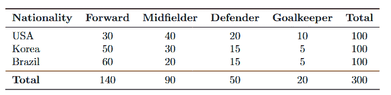
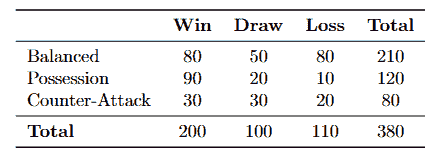
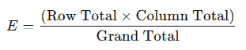
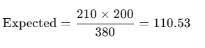
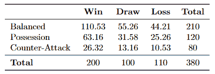
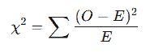
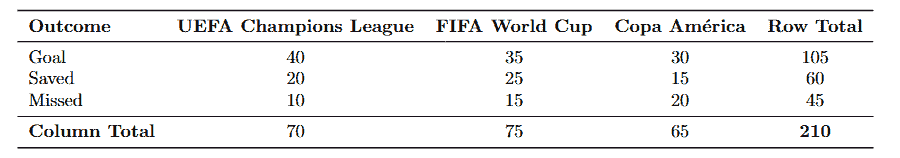
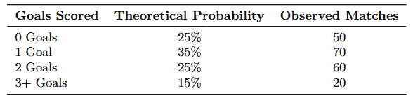
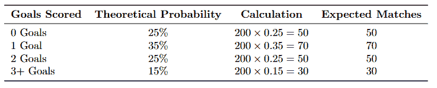

# 卡方检验：通过足球比较变化

> 原文：[`towardsdatascience.com/chi-squared-test-comparing-variations-through-soccer-e291ffe22c2f/`](https://towardsdatascience.com/chi-squared-test-comparing-variations-through-soccer-e291ffe22c2f/)


由[Joppe Spaa](https://unsplash.com/@spaablauw?utm_content=creditCopyText&utm_medium=referral&utm_source=unsplash)在[Unsplash](https://unsplash.com/photos/group-of-men-in-black-and-yellow-crew-neck-t-shirts-sitting-on-green-grass-field-eWgizGfJJ7M?utm_content=creditCopyText&utm_medium=referral&utm_source=unsplash)上的照片

> 如果你不是 Medium 的付费会员，我可以免费提供我的故事：[朋友链接](https://medium.com/@sahn1998/chi-squared-test-comparing-variations-through-soccer-e291ffe22c2f?sk=56f0bc2046e43329ccf403f14553ad01)

“卡方检验”这个术语经常被提及，但很少明确指出具体指的是哪种测试。当然，如果你是数据科学家，你应该知道其他人在指哪种测试。然而，如果你是刚开始数据科学职业生涯或学习数据科学的人，这种区别可能会让人感到困惑。

**这正是我今天写这篇文章的原因！**

我将帮助你分解不同的卡方检验类型，并提供详尽的解释，说明何时以及如何使用它们。这篇文章将是我 A/B 测试和假设检验系列的延续，如果你感兴趣，也可以去看看它们！

也…在开始详细说明之前，我想花一点时间来认可这篇文章的时间点。作为我 2024 年的最后一篇写作，我想象许多人在新年除夕、新年第一天或之后的某个时间阅读这篇文章。

> 我希望 2024 年对你来说是个美好的年份，并祝愿你未来的 2025 年充满奇迹。

到目前为止，这是一段美好的旅程，我非常期待在 2025 年撰写更多优秀的文章！话虽如此，让我们开始撰写今年的最后一篇文章！

***注意：如果你已经了解卡方检验的基本知识，请跳到第二部分！***

* * *

## 目录

1.  卡方检验

1.  分析意甲联赛的踢球风格：卡方检验的独立性

1.  点球成功率：卡方检验的同质性

1.  足球比赛中进球数：卡方检验的拟合优度

1.  摘要

* * *

## **卡方检验**

卡方检验是一种统计方法，用于帮助我们判断观察到的分类变量之间的差异（或相似性）是偶然发生的还是反映了真实、有意义的关系。这使得它成为假设检验中的基本工具，在数据科学和其他领域得到广泛应用。

*如果你还记得，分类变量是数据中的一种变量类型，它代表的是组或类别，而不是数值。*

为了确定某物是否为分类变量，我通常会问自己："这有没有有限个不同的组？" 例如，如果我们正在分析调查中的**"首选饮料选择"**，选项可能是咖啡、茶、水、苏打水或果汁这样的类别。由于我可以清楚地列出这些不同的组，我知道它是一个分类变量。

### 卡方检验的类型

有三种主要的卡方检验类型，每种类型都有其特定的用途：

+   **卡方检验独立性**用于确定在**单个总体**中两个分类变量之间是否存在显著的关联。

+   **卡方检验同质性**比较分类变量在**两个或更多不同总体**或**群体**中的分布。

+   **卡方拟合优度检验**用于确定单个分类变量的观察分布是否与理论或期望分布相匹配。

如果这看起来很令人困惑，不要担心！我将通过详细的例子分解每种测试类型，使其更清晰。

### 关键概念

卡方检验是一种假设检验方法

+   **零假设 (H₀):** 假设不存在显著的关系或差异。

+   **备择假设 (Hₐ):** 假设存在显著的关系或差异。

+   **右尾:** 卡方检验总是右尾的，因为检验统计量 (χ²) 基于平方差，这些平方差总是正的。χ² 的大值表明与零假设有显著差异，导致其被拒绝。

+   **列联表**：通常对于独立性卡方检验，你会看到某种表格，显示每个分类变量的数据（如下所示）。它总结了数据，以了解变量之间的关系。



使用足球（再次）的示例

如果这些概念看起来很复杂，不要担心！在接下来的章节中，我将通过一个具体的例子来解释卡方检验，并详细说明每种类型的卡方检验，以便您可以自信地将它们应用于自己的数据分析。

现在我们已经涵盖了基础知识，让我们用我最喜欢的主题之一——足球——来说明这个测试。对于一直关注我文章的读者来说，你们知道我喜欢用足球作为例子！


由 [Peter Glaser](https://unsplash.com/@baraida?utm_content=creditCopyText&utm_medium=referral&utm_source=unsplash) 在 [Unsplash](https://unsplash.com/photos/white-and-gray-adidas-soccerball-on-lawn-grass-qWs_Wa1JrKM?utm_content=creditCopyText&utm_medium=referral&utm_source=unsplash) 拍摄的照片

## 分析意甲联赛的踢球风格：卡方检验独立性

想象一下，你正在为 AC 米兰的主教练担任数据科学家。你和主教练被球队雇佣，因为新赛季即将到来（2025-2026）。AC 米兰以其强大的防守足球风格而闻名。然而，这种方法在近年来并不成功。

随着新赛季的临近，教练好奇是否某些**比赛风格**——如平衡、控球或反击——与意甲球队的**更好的比赛结果**（胜利、平局或失败）相关。

为了测试这一点，你分析了整个过去意甲赛季（2024-2025）的比赛结果。这些数据代表了一个**单一总体**：那个赛季在意甲进行的所有比赛。你正在检查两个分类变量之间的关系：

+   **比赛风格**：平衡，控球，反击。

+   **比赛结果**：胜利，平局，失败。

为了简化，我们假设的意甲分析数据集总结在下表中。



我们制作的意甲示例的观察数据

**读者注意**：虽然现实世界的比赛结果受多种因素影响——如球队深度、球员可用性和伤病——但我们将仅关注比赛风格进行分析！

### 定义假设

我们如何使用统计测试来确定某些比赛风格是否会影响比赛结果？嗯……记住这是一个假设检验，所以让我们定义零假设和备择假设！

+   **零假设 (Hₒ)**：比赛风格与比赛结果独立。（比赛风格和结果之间不存在关系。）

+   **备择假设 (Hₐ)**：比赛风格与比赛结果相关。（两个变量之间存在关系。）

为了测试这些假设，我们将使用**卡方检验独立性**来评估观察到的比赛结果差异是否具有统计学意义！

### 我们期望从我们的数据中得到什么？

在我们开始进行测试之前……让我们退一步，考虑一下卡方检验独立性的目的是什么。在本质上，可以说这个测试询问的是：

+   比赛风格之间的比赛结果差异仅仅是随机的吗？

+   或者这些差异是否反映了比赛风格和结果之间的有意义关系？

> 现在，让我们直观地考虑这个问题。

如果比赛风格对比赛结果没有影响，每种风格的胜利、平局和失败的数量应该与数据中的整体比例**一致**。例如，如果所有比赛中 50%的结果是胜利，我们预计每种比赛风格大约有 50%的胜利！

如果我们要计算每种比赛风格与比赛结果的相关性的预期数据……这可以简单地基于行和列的总数来计算。



这是我们根据数据预期表中每个单元格的值是什么

例如，平衡比赛风格的预期胜利次数如下所示。我们可以对每个单元格做同样的处理，以获取预期数据！



平衡比赛风格的预期胜利次数

### 这为什么重要？

好的，我们直观地讨论了我们预期数据应该是什么。但是，为什么我们关心**预期数据**而不是只看**观测数据**呢？



预期数据

嗯……预期数据对我们**卡方检验**至关重要，因为它作为比较的基础。通过计算预期值，我们本质上是在说：

+   *"如果比赛风格对比赛结果没有影响（即不存在关系），数据应该看起来是这样的。"*

当我们比较观测数据和预期数据时，任何显著的偏差都可能表明比赛风格和比赛结果之间存在关联。


观测数据

这是有道理的，对吧？如果确实没有关系，观测数据应该与预期数据紧密一致。另一方面，如果观测数据与预期数据明显不同，这表明比赛风格和比赛结果之间可能存在某种关系。

### 理解卡方检验

这种比较是卡方检验的基础，帮助我们确定差异是否具有统计学意义，或者只是随机机会。

此测试中的关键指标是**卡方统计量（χ²）**，它衡量在假设两个变量独立的情况下，**观测数据**与**预期数据**之间的偏差程度。计算卡方统计量的公式是：



我们的卡方统计量！

+   **O**是列联表中每个单元格的观测频率。

+   **E**是列联表中每个单元格的预期频率。

对于表中的每个单元格，你计算这个值，然后将它们全部加起来得到总的卡方统计量！

## 使用 Python 进行测试

现在，你可以使用 Python 来计算卡方统计量，并确定观测到的差异是否具有统计学意义！我们将显著性水平（α）设置为 0.05。

```py
import numpy as np
from scipy.stats import chi2_contingency

# Observed data
observed = np.array([
    [80, 50, 80],  # Balanced
    [90, 20, 10],  # Possession
    [30, 30, 20]   # Counter-Attack
])

# Perform Chi-Squared Test
chi2, p_value, dof, expected = chi2_contingency(observed)

# Results
print("Chi-Squared Statistic:", chi2) # 72.34
print("P-Value:", p_value) # 0.00001
print("Degrees of Freedom:", dof) # 4
print("Expected Frequencies:n", expected) # Table for expected values

# Significance level
alpha = 0.05
```

通过观察我们的数据，我们得到了一个 p 值为**0.00001**，这小于显著性水平（α=0.05）。这意味着什么？这意味着我们**拒绝零假设**。这表明在意大利足球甲级联赛中，比赛风格和比赛结果之间存在统计学上的显著关系。

因此，我们可以告诉主教练，我们可以探索采用**控球型风格**，因为它根据分析显示与更好的比赛结果（例如，更多胜利）有更强的关联！

* * *

## 在不同场景下应用卡方检验

我们刚刚讲解了卡方检验及其工作原理！幸运的是，对于所有类型的卡方检验——无论是**同质性卡方检验**还是**卡方拟合优度检验**——其基础计算与独立性卡方检验中使用的计算相同！

+   从**观测数据**开始。

+   计算期望数据。

+   计算卡方统计量。

+   评估其**统计显著性**。

很简单，对吧！！？

由于这些测试的程序在这些测试中非常相似，对于其他类型的卡方检验……我将专注于每个测试使用的场景，而不是再次详细介绍细节！

* * *


照片由[Jeffrey F Lin](https://unsplash.com/@jeffreyflin?utm_content=creditCopyText&utm_medium=referral&utm_source=unsplash)在[Unsplash](https://unsplash.com/photos/group-of-person-playing-soccer-on-field-SR5-47jmobs?utm_content=creditCopyText&utm_medium=referral&utm_source=unsplash)提供

## 点球成功率：同质性卡方检验

在一个数据科学项目中，我分析了来自各种高知名度足球锦标赛的点球成功率数据——分为**进球**、**被扑救**或**错过**——包括**欧洲冠军联赛**、**FIFA 世界杯**和**南美杯**。

这个项目的目标是调查点球成功率是否在不同锦标赛中有所不同，或者保持一致，考虑到每个事件中不同的压力和竞争水平。

> 有趣吧？

这种问题非常适合用**同质性卡方检验**来解决！记住，在这个卡方检验的变体中，你正在寻找比较的是否是**分类变量的分布**（点球成功的成功率）**在多个组或群体中是否相同**（不同的足球锦标赛）。

下面是数据，试着亲自尝试同质性卡方检验！



点球成功率的观测数据

### 答案

```py
import numpy as np
from scipy.stats import chi2_contingency

# Observed data
observed = np.array([
    [40, 35, 30],  # Goal
    [20, 25, 15],  # Saved
    [10, 15, 20]   # Missed
])

# Perform the Chi-Squared Test
chi2, p_value, dof, expected = chi2_contingency(observed)

# Print results
print("Chi-Squared Statistic:", chi2)
print("P-Value:", p_value)
print("Degrees of Freedom:", dof)
print("Expected Frequencies:n", expected)

# Chi-Squared Statistic: 7.688
# P-Value: 0.053
# Degrees of Freedom: 4
# Expected Frequencies:
 [[35.0 37.5 32.5]
  [20.0 21.43 18.57]
  [15.0 16.07 13.93]]
# Fail to reject the null hypothesis: No significant difference in success rates across tournaments.
```

* * *


照片由[My Profit Tutor](https://unsplash.com/@myprofittutor?utm_content=creditCopyText&utm_medium=referral&utm_source=unsplash)在[Unsplash](https://unsplash.com/photos/man-in-blue-and-white-stripe-shirt-holding-red-and-blue-soccer-ball-lMolBeDV0Tc?utm_content=creditCopyText&utm_medium=referral&utm_source=unsplash)提供

## 足球比赛中的进球数：卡方拟合优度检验

想象一下，你想测试足球比赛中**进球数**的分布是否与**[泊松分布](https://medium.com/p/ff8a6ddeb4a1)**一致。如果你还记得，泊松分布通常用于模拟在固定间隔内发生的事件数量（如进球），例如单场足球比赛。

> [**概率分布：泊松分布与二项分布**](https://towardsdatascience.com/probability-distributions-poisson-vs-binomial-distribution-ff8a6ddeb4a1)

根据历史联赛数据，你假设进球的概率分布如下：



观察数据与理论概率

### 观察数据与理论概率

这种问题非常适合用**卡方拟合优度检验**来解决！记住，我们使用这种变体来确定单个分类变量（在这种情况下，进球数）是否遵循特定的理论或预期分布（例如，泊松分布）。

通过比较观察数据与理论概率，我们可以确定两个分布是否一致或存在显著差异。

这意味着与我们的先前卡方检验变体不同，我们的假设将试图查看分类变量的分布是否与我们的理论分布相匹配！

+   **零假设 (H₀)**: 观察到的进球分布与理论泊松分布相匹配。

+   **备择假设 (Hₐ)**: 观察到的进球分布与理论泊松分布不匹配。

由于计算预期数据可能有点令人困惑，我将为你提供它！自己尝试一下卡方拟合优度检验吧！



预期数据

### 答案

```py
import numpy as np
from scipy.stats import chisquare

# Observed data
observed = np.array([50, 70, 60, 20])

# Expected data based on theoretical probabilities
expected = np.array([50, 70, 50, 30])

# Perform the Chi-Squared Goodness-of-Fit Test
chi2, p_value = chisquare(f_obs=observed, f_exp=expected)

# Print results
print("Chi-Squared Statistic:", chi2)
print("P-Value:", p_value)

# Chi-Squared Statistic: 1.8
# P-Value: 0.614
# Fail to reject the null hypothesis: The observed distribution matches the expected distribution.
```

* * *

## 摘要

以足球作为案例研究，我们得以看到**卡方独立性检验**如何揭示变量之间的关系，例如比赛风格和比赛结果，使教练能够更有效地制定策略。

同样，**卡方同质性检验**有助于比较不同组之间的分布，例如不同锦标赛的罚球成功率。

而**卡方拟合优度检验**？它使我们能够评估现实世界数据，如比赛中进球数，是否与理论模型（如泊松分布）一致，从而为我们提供更好的游戏模式洞察和进一步分析的可能问题。

我个人在学习这些卡方检验的不同类型时，觉得理解它们之间的区别相当复杂。我的目标是为你澄清这些，让你不会像我一样感到困惑（嗯……我希望这篇文章能为你做到这一点）。

希望你学到了一些东西！

* * *

## 与我联系！

+   **[领英](https://www.linkedin.com/in/sahn1998/)**, **[Instagram](https://www.instagram.com/sunghyunie/)** 

+   **邮箱**, **[网站](https://sunghyun-ahn.com/)**

如果你已经阅读到这里，我假设你是一位有志于成为数据科学家的人，是一位数据科学领域的教师，是一位希望磨练技艺的专业人士，或者只是不同领域的一位热切学习者！我很乐意和你聊聊任何话题！

> *对于那些对我的图片感到好奇的人：除非另有说明，所有图片均由作者（我自己）创作*
> 
> [**孙亨·安 – Medium**](https://medium.com/@sahn1998)
