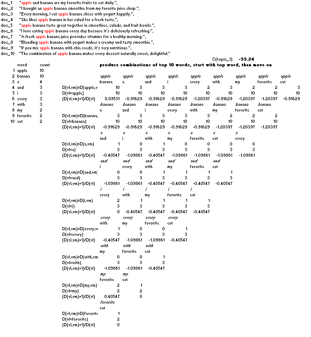
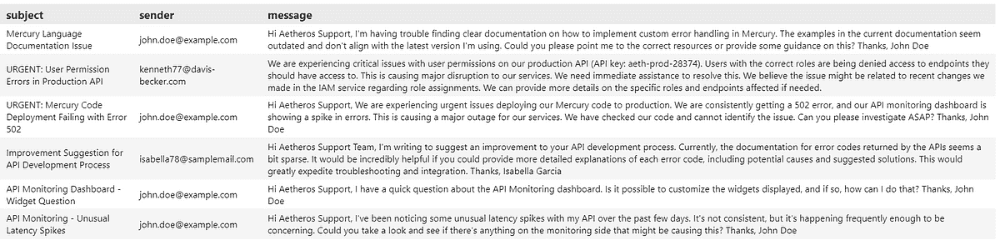
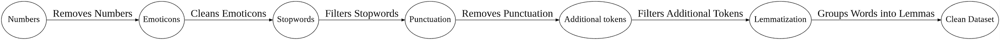
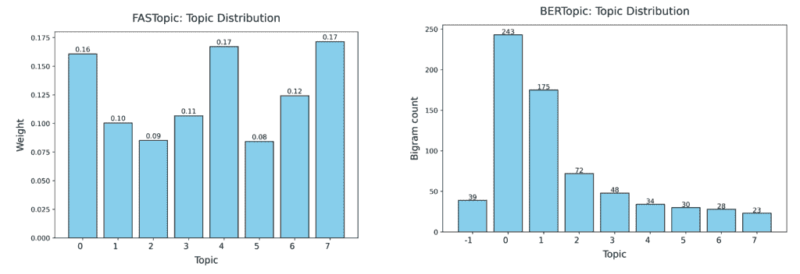
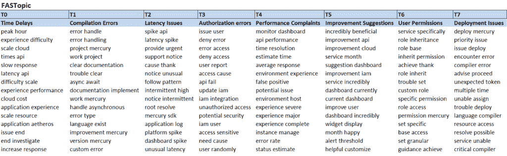
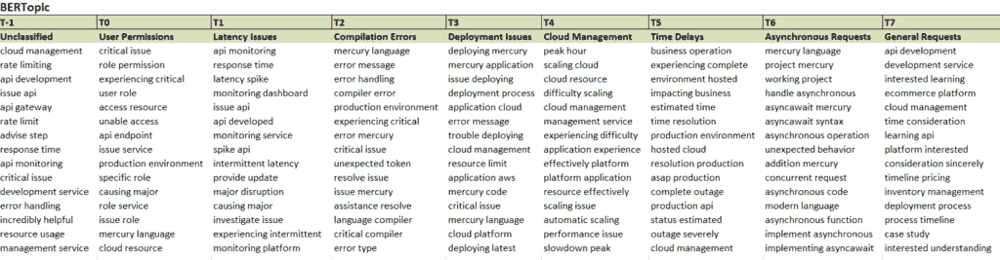
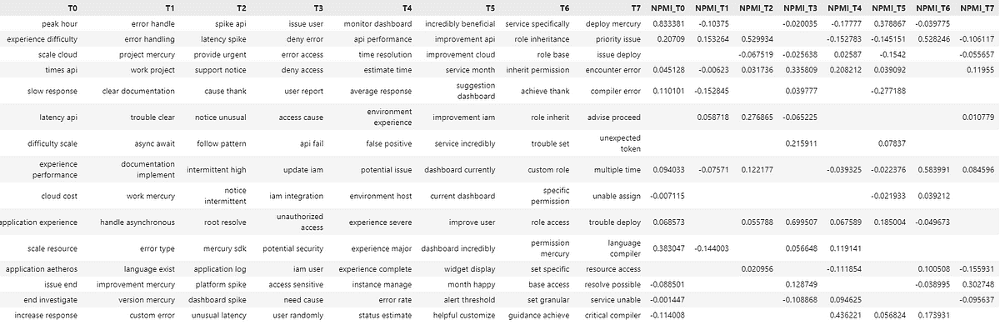
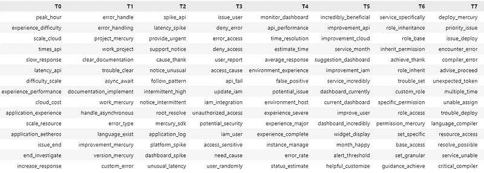
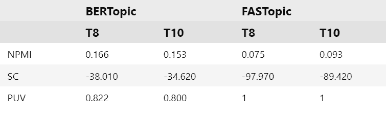
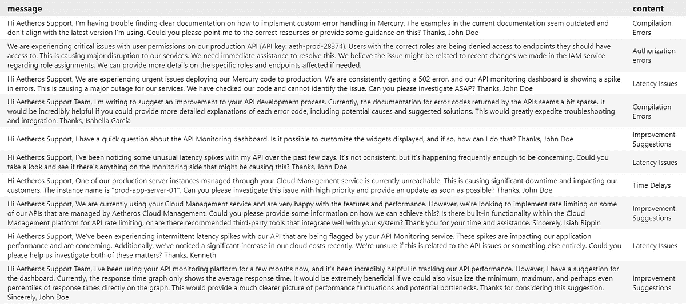

# 选择正确的：评估商业智能中的主题模型

> 原文：[`towardsdatascience.com/choose-the-right-one-evaluating-topic-models-for-business-intelligence/`](https://towardsdatascience.com/choose-the-right-one-evaluating-topic-models-for-business-intelligence/)

**<mdspan datatext="el1745524147724" class="mdspan-comment">主题模型</mdspan>**在商业中被用于对品牌相关的文本数据集（如产品和服务评论、调查以及社交媒体评论）进行分类，并跟踪客户满意度指标随时间的变化。

市场上可供选择的主题模型种类繁多：广泛使用的[BERTopic](https://pypi.org/project/bertopic/)由[Maarten Grootendorst (2022)](https://arxiv.org/pdf/2203.05794)开发，去年在[NeurIPS](https://neurips.cc/virtual/2024/poster/96416)上展示的最近[FASTopic](https://pypi.org/project/fastopic/)（[Xiaobao Wu 等人，2024](https://arxiv.org/pdf/2405.17978)），[Blei 和 Lafferty (2006)](https://arxiv.org/pdf/1602.06049.pdf)开发的[动态主题模型](https://bab2min.github.io/tomotopy/v0.13.0/en/#tomotopy.DTModel)，或者一个全新的半监督[种子泊松因子分解](https://pypi.org/project/seededPF/)模型([Prostmaier 等人，2025](https://arxiv.org/abs/2503.02741))。

对于商业用例，在客户文本上训练主题模型，我们经常得到不相同的甚至有时是相互矛盾的结果。在商业中，不完美会带来成本，因此工程师应该将提供最佳解决方案并最有效地解决问题的模型投入生产。随着市场上出现新的主题模型，使用新指标评估它们质量的方法也在不断发展。

本实用教程将专注于二元主题模型*，*与单词模型相比，它们提供更相关的信息，并识别出对商业决策更有帮助的关键品质和问题。一方面，二元模型更详细；另一方面，许多评估指标最初并非为它们的评估而设计。为了提供更多背景信息，我们将详细探讨以下内容：

+   如何**评估二元主题模型的质量**

+   如何在 Python 中准备**电子邮件分类流程**

我们的示例用例将展示如何使用二元主题模型（[BERTopic](https://pypi.org/project/bertopic/) 和 [FASTopic](https://pypi.org/project/fastopic/)）来优先处理与客户在某些主题上的电子邮件沟通，并减少响应时间。

## 1. 主题模型质量指标是什么？

评估任务应针对理想状态：

> *理想的主题模型应产生包含每个主题中单词或二元组（连续的两个单词）高度语义相关且对每个主题都是独特的主题。*

在实践中，这意味着为每个主题预测的单词在语义上与人类判断相似，并且主题之间单词的重复率很低。

*计算每个训练模型的一组指标是标准的，以便对哪个模型投入生产或用于商业决策做出合格的决定，比较模型性能指标。*

+   **一致性**指标评估主题模型发现的单词对人类来说有多合理（在各个主题中具有[相似的语义](https://www.geeksforgeeks.org/understanding-semantic-analysis-nlp/)）。

+   **主题多样性**衡量所发现的主题之间差异的程度。

双词主题模型与这些指标配合良好：

+   **NPMI** *(归一化点互信息)*使用参考语料库中估计的概率来为模型预测的每个单词（或双词）计算一个[-1:1]分数。更多详情请参阅[[1](https://arxiv.org/pdf/2401.15351)]。

参考语料库可以是内部的（训练集）或外部的（例如，外部电子邮件数据集）。一个大型、外部且可比的语料库是更好的选择，因为它可以帮助减少训练集中的偏差。因为这个指标与词频有关，**训练集和参考语料库应该以相同的方式进行预处理**（即，如果我们从训练集中删除数字和停用词，我们也应该在参考语料库中这样做）。聚合模型分数是跨主题的词的平均值。

+   **SC***(语义一致性)*不需要参考语料库。它使用与训练主题模型相同的数据集。更多详情请参阅[[2](https://aclanthology.org/D11-1024/)]。

假设我们有一个主题的前 4 个单词：*“苹果”，“香蕉”，“果汁”，“冰沙”*，这是由主题模型预测的。然后*SC*查看训练集中从左到右的所有单词组合，从第一个单词*{苹果，香蕉}*，*{苹果，果汁}*，*{苹果，冰沙}*开始，然后是第二个单词*{香蕉，果汁}*，*{香蕉，冰沙}*，然后是最后一个单词*{果汁，冰沙}*，并计算包含这两个单词的文档数量，除以包含第一个单词的文档频率。一个模型的总体 SC 分数是所有主题级别分数的平均值。

图 1. Mimno 等人（2011 年）的语义一致性说明。图由作者提供。

**PUV***(独特单词百分比)*计算模型中主题间独特单词的份额。*PUV = 1*意味着模型中的每个主题都包含独特的双词。接近 1 的值表明模型形状良好、质量高，主题之间的单词重叠小。[3].](https://aclanthology.org/2020.tacl-1.29/)

> *SC 和 NIMP 分数越接近 0，模型就越连贯（主题模型为每个主题预测的双语是语义上相似的）。PUV 越接近 1，模型就越容易解释和使用，因为主题之间的双语不重叠。*

## 2. 我们如何使用主题模型来优先处理电子邮件沟通？

在电子商务业务中，客户沟通的大部分内容现在都通过聊天机器人和个人客户区域来解决。然而，通过电子邮件与客户沟通是很常见的。许多电子邮件提供商为开发者提供了广泛的 API 灵活性，以定制他们的电子邮件平台（例如，[MailChimp](https://mailchimp.com/developer/tools/)，[SendGrid](https://github.com/sendgrid/sendgrid-python)，[Brevo](https://github.com/getbrevo/brevo-python)）。在这里，主题模型使邮件更加灵活和有效。

*在这个用例中，流程从收到的电子邮件中获取输入，并使用训练好的主题分类器对收到的电子邮件内容进行分类。结果是客户服务（CC）部门在每封电子邮件旁边看到的分类主题。主要目标是允许 CC 工作人员优先处理电子邮件类别，并减少对最敏感请求（直接影响与利润相关的关键绩效指标或 OKR）的响应时间。*

图 2. 主题模型流程图。图由作者提供。

## 3. 数据和模型设置

我们将训练**FASTopic**和**BERTopic**将电子邮件分类到 8 个和 10 个主题，并评估所有模型规格的质量。阅读我之前关于使用这些前沿主题模型进行主题建模的[TDS 教程](https://towardsdatascience.com/topic-modelling-in-business-intelligence-fastopic-and-bertopic-in-code-2d3949260a37/)。

作为训练集，我们使用在 Kaggle 上可用的合成[客户服务电子邮件](https://www.kaggle.com/datasets/rtweera/customer-care-emails)数据集，该数据集具有[GPL-3 许可证](https://www.gnu.org/licenses/gpl-3.0.html)。预过滤的数据包括 692 封收到的电子邮件，看起来像这样：

图 3. 客户服务电子邮件数据集。图由作者提供。

### 3.1. 数据预处理

按正确顺序清理文本对于主题模型在实际中有效运行至关重要，因为它最小化了每个清理操作的偏差。

**数字**通常首先被移除，然后是**表情符号**，除非在特殊情况下（如提取情感）我们不需要它们，否则会移除。之后移除一个或多个语言的[**停用词**](https://www.geeksforgeeks.org/removing-stop-words-nltk-python/)，然后是**标点符号**，这样停用词就不会被分成两个标记（*“we’ve”* -> *“we” + ‘ve”*）。在[**词形还原**](https://www.techtarget.com/searchenterpriseai/definition/lemmatization#:~:text=Lemmatization%20is%20the%20process%20of,processing%20%28NLP%29%20and%20chatbots.)之前，在清理数据中的下一步移除**额外标记**（公司名称和人物名称等），词形还原将具有相同语义的标记统一。

图 4. 主题建模的一般预处理步骤。图由作者提供

> *“Delivery”和“deliveries”， “box”和“Boxes”，或“Price”和“prices”具有相同的词根，但如果没有进行词形还原，主题模型会将它们建模为不同的因素。这就是为什么在预处理步骤的最后一步，客户电子邮件应该进行词形还原的原因。*

文本预处理是针对特定模型的：

+   ***FASTopic*** 在输入数据上工作，可以进行一些清理（如去除停用词）；清理工作可以在训练过程中进行。最简单且最有效的方法是使用[*Washer，一个用于文本数据清理的无代码应用程序*](https://washer.textminingstories.com/)，它为文本挖掘项目提供了一种无代码的数据预处理方式。

+   ***BERTopic：*** [文档](https://maartengr.github.io/BERTopic/faq.html#how-do-i-reduce-topic-outliers)建议“作为预处理步骤移除停用词是不推荐的，因为我们使用的基于 transformer 的嵌入模型需要完整的上下文来创建准确的嵌入。”因此，清理操作应包含在模型训练中。

### 3.2. 模型编译和训练

您可以在[这个仓库](https://github.com/PetrKorab/Choose-the-Right-One-Evaluating-Topic-Models-for-Business-Intelligence)中查看 FASTopic 和 BERTopic 使用二元词预处理和清理进行训练的完整代码。我之前的 TDS 教程[(1)](https://medium.com/data-science/topic-modelling-in-business-intelligence-fastopic-and-bertopic-in-code-2d3949260a37?sk=9a88660d4e4c64a1d91ad8ede730a520)[(2)](https://towardsdatascience.com/topic-modelling-in-business-intelligence-fastopic-and-bertopic-in-code-2d3949260a37/)[(3)](https://medium.com/data-science/topic-modelling-in-business-intelligence-fastopic-and-bertopic-in-code-2d3949260a37?sk=9a88660d4e4c64a1d91ad8ede730a520)和[(4)](https://medium.com/data-science/topic-modelling-with-berttopic-in-python-8a80d529de34?sk=16ca7ea6c5cdbbc92fead7f9c34c8584)[(5)](https://towardsdatascience.com/topic-modelling-with-berttopic-in-python-8a80d529de34?sk=16ca7ea6c5cdbbc92fead7f9c34c8584)详细解释了所有步骤。

我们训练这两个模型对客户电子邮件数据中的 8 个主题进行分类。简单检查主题分布显示，发送给 FASTopic 的电子邮件在主题上分布得相当均匀。BERTopic 对电子邮件的分类不均匀，将异常值（未分类的标记）保留在 T-1 中，并将大量收到的电子邮件保留在 T0 中。

图 5：主题分布，电子邮件分类。图由作者提供。

这里是两个模型带有主题标签的预测大词组：

图 6：模型的预测。图由作者提供。

由于电子邮件语料库是一个合成的 LLM 生成的数据集，因此两个模型的主题简单标记显示的主题是：

+   **相似之处**：*时间延迟，延迟问题，用户权限，部署问题，编译错误，*

+   **不同之处**：*未分类*（BERTopic 将异常值分类为 T-1），*改进建议，授权错误，性能投诉*（FASTopic），*云管理，异步请求，一般请求*（BERTopic）

对于商业目的，主题应由了解客户基础和业务优先级的公司内部人士进行标记。

## 4. 模型评估

如果八个分类主题中有三个被标记不同，那么应该部署哪个模型？现在让我们评估训练好的 BERTopic 和 FASTopic T-8 模型的一致性和多样性。

### 4.1. NPMI

我们需要一个参考语料库来为每个模型计算 NPMI。Kaggle 上的[客户 IT 支持票务数据集](https://www.kaggle.com/datasets/tobiasbueck/multilingual-customer-support-tickets)，以[Attribution 4.0 国际许可](https://creativecommons.org/licenses/by/4.0/)分发，为我们提供了与训练集相当的数据。数据被过滤到 11923 个英语电子邮件正文。

1.  *使用[*此代码*](https://github.com/PetrKorab/Choose-the-Right-One-Evaluating-Topic-Models-for-Business-Intelligence/blob/main/NPMI_eval.ipynb)计算参考语料库中每个大词组的 NPMI。*

1.  *将 FASTopic 和 Bertopic 预测的大词组及其来自参考语料库的 NPMI 分数合并。表中 NaN 值越少，指标越准确。*

图 7：NPMI 一致性评估。图由作者提供。

*3. 计算每个主题内和跨主题的平均 NPMI，为每个模型得到一个单一分数。*

### 4.2. SC

使用*SC*，我们通过计算大词组在语料库中的位置相对于其他标记来学习由主题模型预测的大词组的上下文和语义相似度。为此，我们：

1.  *创建一个文档-词矩阵（DTM），记录每个大词组在每个文档中出现的次数。*

1.  *通过在 DTM 和主题模型预测的大词组中搜索大词组共现来计算主题 SC 分数。*

1.  *平均主题 SC 到模型 SC 分数。*

### 4.3. PUV

主题多样性*PUV*指标检查模型中主题之间的大词组的重复情况。

1.  *将 FASTopic 和 BERTopic 表中预测的大词组中的空格替换为下划线，将大词组合并成标记。*

图 8：主题多样性说明。图由作者提供。

*2. 计算主题多样性，即不同标记的数量/表中标记的数量，对于两个模型。*

### 4.4. 模型比较

现在让我们总结图 9 中的连贯性和多样性评估。BERTopic 模型比 FASTopic 更连贯但更不多样。差异不是很大，但 BERTopic 在将收到的电子邮件分配到流程中时存在不均匀分布（参见图 5 中的图表）。大约 32%的分类电子邮件属于*T0*，15%属于*T-1*，这涵盖了未分类的异常值。模型每个主题至少训练 20 个标记。增加此参数会导致模型无法训练，可能是因为数据量较小。

因此，对于具有小型训练数据集的电子邮件分类，FASTopic 是更好的选择。

图 9：主题模型评估指标。图由作者提供。

最后一步是将带有主题标签的模型部署到电子邮件平台中，以对收到的电子邮件进行分类：

图 10. 主题模型分类流程，输出。图由作者提供。

## 摘要

准确性和多样性指标比较具有相似训练设置、相同数据集和清理策略的模型。我们无法将它们的绝对值与不同训练会话的结果进行比较。但它们帮助我们决定最适合我们特定用例的最佳模型。它们提供了各种模型规格的**相对比较**，并帮助我们决定哪个模型应该部署到流程中。在商业实践中，主题模型评估应该是模型部署前的最后一步。

客户服务如何从主题建模练习中受益？主题模型投入生产后，流程会将每个电子邮件的分类主题发送到客户服务使用的电子邮件平台。在人员有限的情况下，现在可以优先处理并更快地响应最敏感的业务请求（例如*“时间延迟”*和*“延迟问题”*），并动态地更改优先级。

本教程的数据和完整代码[在此](https://github.com/PetrKorab/Choose-the-Right-One-Evaluating-Topic-Models-for-Business-Intelligence)。

* * *

***Petr Korab*** 是一位拥有超过八年商业智能和 NLP 经验的 Python 工程师和[*Text Mining Stories*](https://textminingstories.com)的创始人。

***致谢****：我要感谢 Tomáš Horský（Lentiamo，布拉格）、Martin Feldkircher 和 Viktoriya Teliha（维也纳国际学院）提供的宝贵评论和建议。

### 参考文献

[1] Blei，D. M.，Lafferty，J. D. 2006\. 动态主题模型。在*第 23 届国际机器学习会议论文集*（第 113–120 页）。

[2] Dieng A.B.，Ruiz F. J. R.，Blei D. M. 2020\. 嵌入空间中的主题建模。[计算语言学协会会刊](https://aclanthology.org/2020.tacl-1.29)，8:439-453.

[3] Grootendorst，M. 2022\. Bertopic：基于类 TF-IDF 过程的神经主题建模。[计算机科学。](https://arxiv.org/abs/2203.05794)

[4] Korab，P. 商业智能中的主题建模：代码中的 FASTopic 和 BERTopic。*数据科学之路*。22.1.2025\. 可从：[链接](https://towardsdatascience.com/topic-modelling-in-business-intelligence-fastopic-and-bertopic-in-code-2d3949260a37/).

[5] Korab，P. 使用 Python 中的 BERTtopic 进行主题建模。*数据科学之路*。4.1.2024\. 可从：[链接](https://towardsdatascience.com/topic-modelling-with-berttopic-in-python-8a80d529de34/).

[6] 吴，X，阮，T.，张，D.，王，W.，吕，A. T. 2024\. [FASTopic：一种快速、自适应、稳定且可迁移的主题建模范式](https://arxiv.org/abs/2405.17978). arXiv 预印本：2405.17978.

[7] Mimno，D.，Wallach，H.，M.，Talley，E.，Leenders，M，McCallum。A. 2011\. [优化主题模型中的语义一致性。](https://aclanthology.org/D11-1024/) *2011 年自然语言处理实证方法会议论文集*.

[8] Prostmaier，B.，Vávra，J.，Grün，B.，Hofmarcher，P. 2025\. [种子泊松因子分解：利用领域知识来拟合主题模型。](https://arxiv.org/abs/2503.02741) arXiv 预印本：2405.17978.
