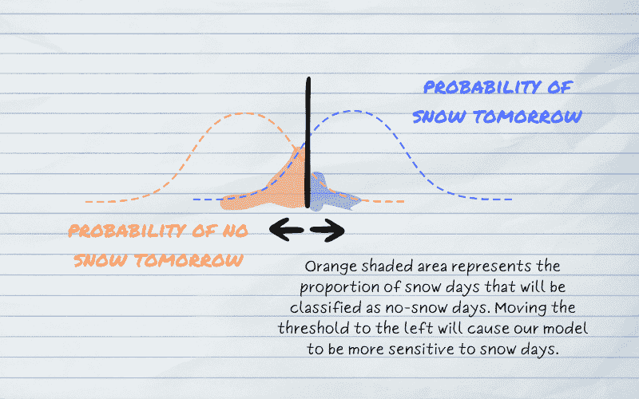
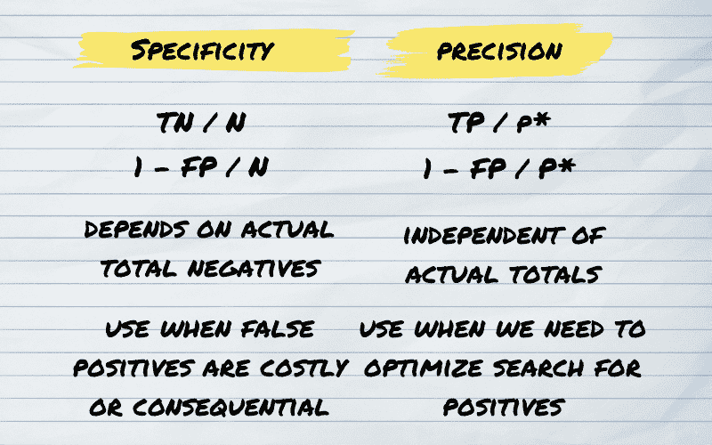
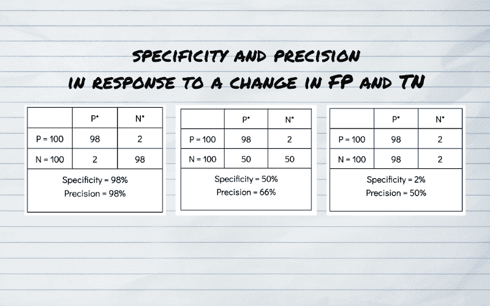

# 选择分类模型评估标准

> 原文：[`towardsdatascience.com/choosing-classification-model-evaluation-criteria-1e1c0f6f13ce/`](https://towardsdatascience.com/choosing-classification-model-evaluation-criteria-1e1c0f6f13ce/)

由 [mingwei dong](https://unsplash.com/@dongmingwei?utm_source=medium&utm_medium=referral) 在 [Unsplash](https://unsplash.com?utm_source=medium&utm_medium=referral) 拍摄的照片

评估分类模型质量的最简单方法是将我们预期的值和模型预测的值配对，并计算我们正确或错误的所有情况；即——构建一个混淆矩阵。

对于任何在机器学习中遇到分类问题的研究人员来说，混淆矩阵是一个相当熟悉的概念。它在帮助我们评估分类模型和提供改进其性能的线索方面发挥着至关重要的作用。

尽管分类任务可以产生离散输出，但这些模型往往具有一定的不确定性。

大多数模型输出都可以用类归属的概率来表示。通常，**决策阈值**允许模型将输出概率映射到离散类别是在预测步骤设置的。最常见的是，这个概率阈值设置为 0.5。

然而，根据用例以及模型捕捉正确信息的能力，这个阈值可以进行调整。我们可以分析模型在各个阈值下的表现，以实现期望的结果。

描述决策阈值设置的视觉示例。图片由作者提供。

尽管我们可以在每个阈值下检查混淆矩阵，但分析汇总信息会容易得多。此外，由于比率比整个数字更容易比较，因此有动机用我们的预期来表示实际和预测结果。例如，我们可以定义真正例率为我们预期为正的值的百分比，这些值被我们的模型预测为正。

因此，数据科学家可以访问几种分析结果的方法。目前使用最普遍的两种方法是**“特异性和灵敏度”**以及**“精确率和召回率”**。特异性和灵敏度首次于 1947 年提出[[[来源](https://doi.org/10.1016%2Fs0911-6044%2803%2900059-9)](https://www.jstor.org/stable/4586294?origin=crossref)]，主要用于临床环境中评估医学测试的性能。精确率和召回率出现得晚得多，但很快成为评估机器学习结果的强大指标[source]。其他如**“信息度和标记度”**之类的度量虽然不太为人所知，但在许多情况下仍然很有价值。

虽然现在存在许多分析混淆矩阵结果的方法，但我将总结上述两种方法，并借鉴我希望表达的观点——你选择的方法应取决于你个性化的用例以及你模型预测的后果。

*在下文中，我将根据一个 2×2 混淆矩阵来讨论指标，该矩阵试图将一些二元结果分类为阳性值和某些阴性值。*

## **灵敏度和特异性**

**灵敏度**是真正阳性率（TPR）的另一个术语。它是正确预测的阳性值总数除以实际阳性值总数。

**灵敏度 = 真阳性 / 实际阳性**

灵敏度衡量模型正确识别所有实际阳性案例中阳性案例的能力。如果我们想使模型对阳性值更*敏感*，我们将尝试增加正确预测的阳性值数量，这可能会增加预测为阳性的总体结果数量。

另一方面，特异性是真正阴性率（TNR），它是所有实际阴性值中正确预测的阴性值总数。

**灵敏度 = 真阴性 / 实际阴性** 灵敏度 = 1 – 假阳性 / 实际阴性

将灵敏度视为假阳性率的 1 减去可能是有帮助的。由于假阳性值占所有预测阳性值总数的一部分，如果我们的模型更*具体*，那么更少的阴性案例将被分类为阳性案例，并且我们的输出可能导致更少的总体阳性预测。

理想情况下，我们希望模型或测试具有高灵敏度和高特异性。然而，在现实生活中，我们可能需要权衡。如果我们的分类任务中存在一些不确定性，阈值值将影响我们的指标表现。降低决策阈值会使更多案例被分类为阳性，从而提高灵敏度（但可能会提高假阳性的比率并降低特异性）。设置更严格的决策阈值会导致实际阳性被错误分类。因此，真正阳性率将下降，我们将评估我们的模型对阳性值的不敏感性。

直观地，我们可以用这个例子来说明指标的使用。假设我要求我的幼儿为我拿一些马克笔。如果我对我的要求不是非常*具体*，他可能会带回一盒马克笔和铅笔的混合物，但如果我太具体了，他可能找不到那么多马克笔。如果我有更高的*灵敏度*，我可能只想用马克笔来画画；但如果我的灵敏度较低，我可能对用任何马克笔或铅笔画画都无所谓。

在某些情况下，如疾病检测，遗漏阳性可能具有严重后果，因此我们应该追求具有更高敏感性的模型。相反，在某些情况下，如欺诈检测，预测过多的阳性可能导致巨大成本，因此更倾向于更高的特异性。

## 精确度和召回率

召回率和敏感性是数学上等效的指标，代表真阳性案例的比率。

**召回率 = 真阳性 / 实际阳性**

这个指标背后的动机是量化模型召回实际阳性值的能力。具有更高召回率的模型在识别数据集中的实际阳性案例方面表现更好，即使它预测的总体阳性案例较少。

**精确度**衡量我们模型预测的阳性案例中有多少是**真正**的阳性。

**精确度 = 真阳性 / 预测阳性**

如果我们将决策阈值调整到包括更广泛的阳性值概率范围，我们预测的阳性案例总数将增加。随着决策阈值降低以预测更多阳性，假阳性的总数可能会增加，因此，精确度（由于真阳性与预测阳性的比率降低）会降低。

相反，如果我们通过改进我们的模型或对阳性值概率范围施加更紧的约束来限制数据集中的假阳性数量，我们可以提高精确度。

理解精确度和召回率及其权衡背后的直觉可以通过这个捕鱼类比来理解。假设我们试图捕捉在一片海藻中游动的小簇鱼。我们可以尝试不那么精确，撒一个更宽的网：这应该会捕获更多的鱼，但我们的网里也会多出一些海藻。如果我们尝试更精确，撒一个更小的网，我们可能会捕获到大部分鱼和很少的海藻；但我们也可能错过我们的鱼群，捕获到很少的鱼。

由 [yue su](https://unsplash.com/@mayear2019?utm_source=medium&utm_medium=referral) 在 [Unsplash](https://unsplash.com?utm_source=medium&utm_medium=referral) 拍摄的照片

再次强调，精确度和召回率之间通常存在权衡，实现正确的平衡取决于具体的应用场景。例如，虽然高召回率可以有利于疾病检测，因为我们希望正确识别所有患病病人，但在欺诈识别中，高精确度可能更有帮助，因为我们想确保不会因为过多的假阳性而使欺诈调查不堪重负。

## 应该使用哪一对指标？

虽然按照惯例，敏感性和特异性在临床环境中使用，而精确度和召回率在机器学习中更受欢迎，但分析中使用的指标对的选择取决于具体的应用场景。

由于敏感度和召回率在数学上是等价的，关键的区别在于特异性和精确度，以及模型打算做出的决策。

从数学上讲，特异性的分母是真实负例的数量，而精确度的分母是预测的正例数量。然而，这两个指标都与假阳性有关。**特异性依赖于实际负例的数量**；**精确度与实际案例无关**，它只关注我们的预测。

因此，**在关注正确捕获负面案例的用例中，敏感性和特异性是更好的度量指标**——特别是**当负值与风险或奖励相关时**。敏感性和特异性在临床环境中经常被使用的原因是由于遗漏真实阴性结果的相关成本：特异性低可能导致患者接受不必要的治疗。

机器学习也有相对案例。一个与假阳性率相关的惩罚的模型示例是试图预测一年后股价是会上涨还是下跌的模型。特异性低可能导致我们的客户因模型认为会增值的投资而损失金钱。

另一方面，**对于更关注最准确地识别正面案例并确保我们的正面预测准确无误的用例，可以从精确度和召回率分析中受益**。我们经常在机器学习中看到这些指标，是因为我们通常更关注找到所有正面案例并确保我们的正面预测确实是正面的。但即使是一些医学测试，如果与错误预测负值相关的成本风险不是很大，也可以从这种方法中受益。

特异性与精确度。图由作者提供。

最后，让我们来看一个平衡数据集的例子，在这个例子中，我们的敏感度和召回率都很高，但我们的 FPR 和 TNR 会有所变化。在这个例子中，特异性对 FPR 的变化反应更为显著。最引人注目的是，当我们的正面预测中有一半是正确的，但几乎所有实际负值的预测都是错误的时，特异性将几乎为零，而精确度可以保持很高。

响应假阳性变化时特异性和精确度的差异示例。图由作者提供。

因此，只要真正的阳性率保持较高，精确度对假阳性率的变化反应不会像特异性那样大。而且，特异性将独立于实际正例的数量而变化。

* * *

因此，我们的评估指标选择取决于我们的案例，更确切地说，取决于我们预测的后果。

并非所有惯例都适用于所有用途。构建有影响力的模型需要真正思考目的，而不仅仅是手段。我们不应只关注准确性，而应花些时间去思考我们的结果将如何被使用。

我非常喜欢来自 Spencer Antonio Marlen-Starr 的[相关段落](https://medium.com/@spencerantoniomarlenstarr/i-took-a-graduate-level-course-on-decision-risk-analysis-and-it-was-painfully-out-of-date-36de46a3ca28)。

> 决策者并不关心（或者至少，他不必关心）他基于的预测的准确性频率，而是关心收益或损失的影响或大小，以及在整个决策过程中，预测的整体准确率与收到的收益或因后果而遭受的惩罚的累积效应之间的相互作用。
