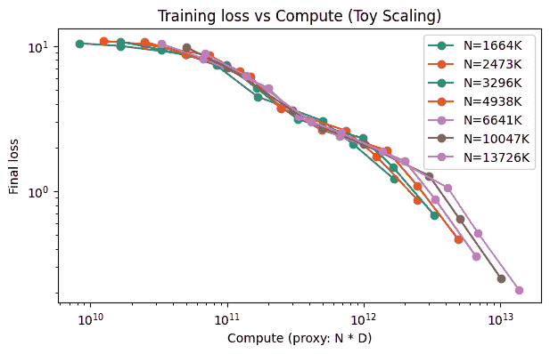
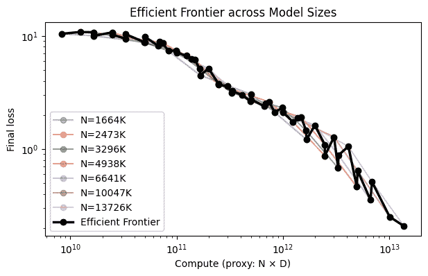

# 在固定预算下为 LLMs 选择最佳模型大小和数据集大小

> 原文：[`towardsdatascience.com/choosing-the-best-model-size-and-dataset-size-under-a-fixed-budget-for-llms/`](https://towardsdatascience.com/choosing-the-best-model-size-and-dataset-size-under-a-fixed-budget-for-llms/)

## 引言

<mdspan datatext="el1761241198699" class="mdspan-comment">在训练大型</mdspan>语言模型（LLMs）时，我们永远受预算的限制。这种限制导致了一个基本的权衡：想象一下，如果你固定一个计算预算，增加模型大小意味着你必须减少可以训练的模型大小，反之亦然。所以你是在问这个问题：

我们是否应该将更多资源分配给具有更多参数的模型，或者我们应该在更多数据上对其进行训练？

尤其是 LLMs（大型语言模型）的性能和效率在很大程度上受到这种权衡的影响。因此，找到模型参数数量和使用的标记数量之间的最佳平衡至关重要。

Transformer 的总训练计算量大致按以下比例缩放：C∝N×D，其中

+   N 是模型参数的数量。

+   D 是标记的数量。

+   C 是固定的计算预算。

很容易看出，对于固定的 C，N 和 D 成反比。

前期研究（Kaplan 等人，2020 年；Hoffmann 等人，2022 年）发现，机器学习模型的训练损失随着计算量的增加而遵循幂律：L(C)∝C^{−α}，并且*最佳*模型大小和数据集大小随着计算量的增加而缩放，对于某些正数 a 和 b，有：N_opt∝C^a，D_opt∝C^b。

在本文中，我们将使用微型 Transformer 来探索如何在固定的计算量 C 下平衡 N 和 D。

## 实验设置

我们设计了一个最小的 Transformer 模型，我们称之为“微型 Transformer”，它具有以下可配置属性，这些属性会影响模型的参数大小：

+   模型维度（d_model）

+   MLP 维度（d_mlp）

+   层数（n_layers）

我们希望训练不同配置的 transformer，这些 transformer 在 WikiText-2 数据集的标记长度为 64 的序列上进行训练。

为了研究缩放的影响，我们定义了一个从非常小（16 个隐藏单元，1 层）到相对较大（128 个隐藏单元，4 层）的模型网格，并将它们与从 5k 到 1M 的标记范围相结合。请参见下面的代码：

```py
model_configs = [
    {"d_model": 16,  "d_mlp": 64,   "n_layers": 1},  
    {"d_model": 24,  "d_mlp": 96,   "n_layers": 1},   
    {"d_model": 32,  "d_mlp": 128,  "n_layers": 2},
    {"d_model": 48,  "d_mlp": 192,  "n_layers": 2},
    {"d_model": 64,  "d_mlp": 256,  "n_layers": 3},
    {"d_model": 96,  "d_mlp": 384,  "n_layers": 3},
    {"d_model": 128, "d_mlp": 512,  "n_layers": 4},   
]
# number of tokens (D) we train on — simulated via few steps × batch × seq_len
token_budgets = [5e3, 1e4, 3e4, 5e4, 1e5, 3e5, 5e5, 1e6]  # small for demo
```

通过将计算成本近似为 C≈N×D，我们的想法是计算每个(N,D)对的损失函数，并找到在给定的 C 下使模型达到最小损失函数的(N,D)对：这就是我们寻找的平衡。

## 实施和观察

我们使用下面的代码来训练模型，直到达到固定的步数，使用不同的(N,D)对，并记录结果。

```py
 results = []
device = "cuda" if torch.cuda.is_available() else "cpu"

for cfg in model_configs:
    model = TinyTransformer(vocab_size=len(tokenizer), **cfg)
    N_params = count_params(model)
    for D in token_budgets:
        steps = int(D // (SEQ_LEN * 16))  # assuming batch_size=16
        dataloader = DataLoader(
            tokenized_dataset["train"].shuffle(seed=0),
            batch_size=16,
            collate_fn=collate_fn
        )
        avg_loss = train_one(model, dataloader, steps=steps, device=device)
        compute = N_params * D
        results.append({
            "N": N_params,
            "D": D,
            "C": compute,
            "loss": avg_loss
        })
```

然后，我们将最终损失与计算量（N×D）作图：



作者图片：训练损失与计算量

我们有以下重要的观察：

1.  **对于有限的计算预算**，在大部分可用数据上训练的小型模型比在非常少的数据上训练的大型模型表现更好。

1.  **对于大的计算预算**，当数据足够时，更大的模型会变得更好。

1.  最佳模型大小并不与计算预算线性增长。例如，计算预算加倍并不会真正导致参数数量增加到之前的两倍。

下面的图给出了模型大小上的有效前沿，即给定计算预算下损失最低的模型大小集合。



图片由作者提供：有效前沿

## “最佳”模型

为了确定“最佳”模型，我们会选择在固定预算下最小化损失的模型大小和标记数配对。

我们假设两者都遵循幂律关系：N_opt∝C^α, D_opt∝C^β，并且我们希望通过以下步骤估计未知的指数α和β：

1.  对数量取对数：log?(N_opt)=αlog?(C)+const, log?(D_opt)=βlog?(C)+const。

1.  拟合线性回归。回归线的斜率不过是幂律指数。

以下代码给出了这样的回归：

```py
# Fit log-log linear regression
a_slope, a_intercept, *_ = st.linregress(np.log(frontier.C), np.log(frontier.N))
b_slope, b_intercept, *_ = st.linregress(np.log(frontier.C), np.log(frontier.D))
```

在我们的玩具实验中，我们发现 N_opt ~C⁰.14 和 D_opt~ C⁰.86。这个结果可能并不能完全揭示整个情况，因为我们是在简化的模型和配置上进行实验的。但我们可以看到，计算的增长导致最佳模型大小的增加，但增长速度逐渐减慢。显然，剩余的预算应该归因于更多的训练标记。

此外，上述计算给出了最佳比例 N_opt/D_opt=C^-0.72 的事实。这表明，当你增加计算时，你应该添加更多的训练标记，而不是增加模型大小。

## 实践要点

从这个实验中，尽管是一个玩具案例，我们可以提取几个见解：

1.  对于固定的预算，使用中等模型并增加数据可以超越数据有限的大模型。

1.  最佳模型大小和数据大小随着计算预算的增长而增长。如果你预算较小，不要训练具有许多参数的模型。

1.  当预算增加时，首先考虑最佳比例 N_opt/D_opt，以确定你是否应该增加模型大小或添加更多训练数据。

## 结论

在这篇博客文章中，我们提供了一个关于固定计算预算下 LLMs 模型大小与数据之间权衡的研究，通过一个玩具案例。实验表明，我们可以找到最佳模型大小和标记数的配对，以在给定预算下实现最佳模型性能，使研究人员和实践者能够明智地设计 LLMs 并取得最佳结果。

## 参考文献

[1] Kaplan, J., McCandlish, S., Henighan, T., Brown, T. B., Chess, B., Child, R., Gray, S., Radford, A., Wu, J., & Amodei, D. (2020). *Scaling Laws for Neural Language Models*.

[2] Hoffmann, J., Borgeaud, S., Mensch, A., Buchatskaya, E., Cai, T., Rutherford, E., de Las Casas, D., Hendricks, L. A., Welbl, J., Clark, A., Hennigan, T., Noland, E., Millican, K., van den Driessche, G., Damoc, B., Guy, A., Osindero, S., Simonyan, K., Elsen, E., … Sifre, L. (2022). *Training Compute-Optimal Large Language Models*.
