# 经典计算机视觉和透视变换用于数独提取

> 原文：[`towardsdatascience.com/classical-computer-vision-and-perspective-transformation-for-sudoku-extraction/`](https://towardsdatascience.com/classical-computer-vision-and-perspective-transformation-for-sudoku-extraction/)

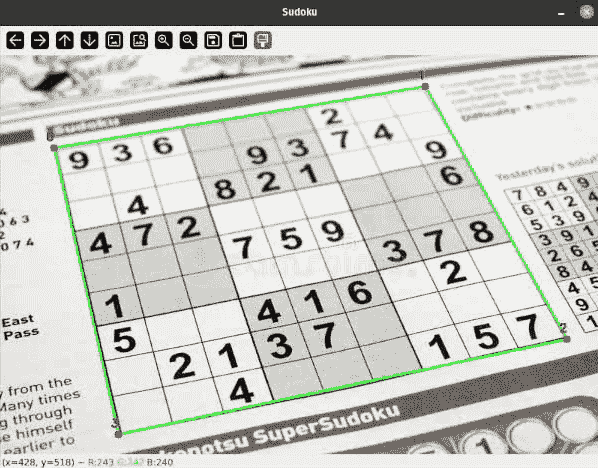

<mdspan datatext="el1759535304447" class="mdspan-comment">在当前人工智能热潮的时代</mdspan>，感觉每个人都在使用 *视觉-语言模型* 和大型 *视觉 Transformer* 来解决计算机视觉中的每一个问题。许多人将这些工具视为万能解决方案，并立即使用最新的、最闪亮的模型，而不是**理解他们想要提取的底层信号**。但很多时候，简单就是美。这是我作为一个工程师学到的重要教训之一：不要使简单问题的解决方案过于复杂。

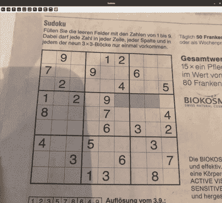

处理流程步骤动画

让我向您展示一些简单的经典计算机视觉技术的一个实际应用，用于检测平坦表面上的矩形对象，并应用透视变换来变换倾斜的矩形。类似的方法在文档扫描和提取应用中被广泛使用。

在这个过程中，您将学习一些从标准经典计算机视觉技术到如何排序多边形点和为什么这与组合分配问题相关的一些有趣的概念。

<details class="wp-block-details is-layout-flow wp-block-details-is-layout-flow"><summary>***概述***</summary>

+   检测

    +   灰度

    +   边缘检测

    +   膨胀

    +   轮廓检测

+   透视变换

    +   **变体 A：基于总和/差的简单排序**

    +   **变体 B：分配优化问题**

    +   **变体 C：带有锚点的循环排序**

    +   应用透视变换

+   结论</details>

## 检测

为了检测数独网格，我考虑了许多不同的方法，从简单的阈值、霍夫线变换或某种形式的边缘检测到训练深度学习模型进行分割或关键点检测。

让我们定义一些 ***假设*** 来界定问题范围：

1.  数独网格在具有清晰四边形边界的框架中清晰且完整地可见，与背景有强烈的对比。

1.  数独网格打印的表面需要平坦，但可以从一个角度捕捉并看起来倾斜或旋转。

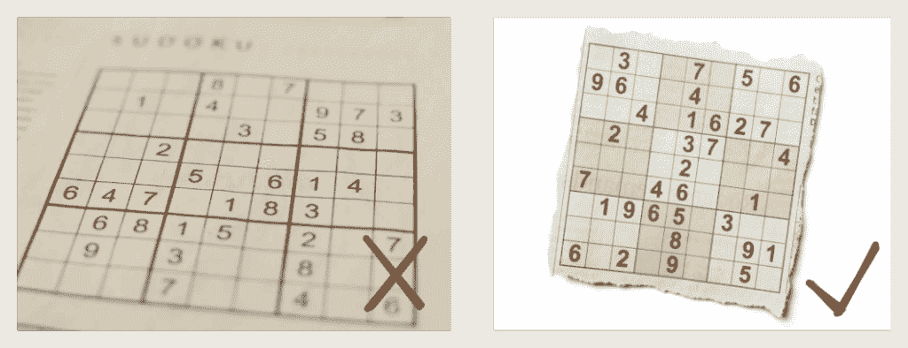

不同图像质量的示例

我将向您展示一个简单的流程，其中包含一些过滤步骤来检测我们的数独网格的边界。从高层次来看，处理流程如下：

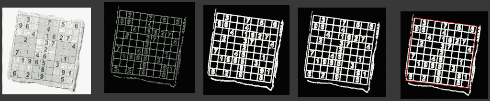

处理流程步骤的可视化

### 灰度

在这一第一步中，我们简单地将输入图像从其三个颜色通道转换为单通道灰度图像，因为我们不需要任何颜色信息来处理这些图像。

```py
def find_sudoku_grid(
    image: np.ndarray,
) -> np.ndarray | None:
    """
    Finds the largest square-like contour in an image, likely the Sudoku grid.

    Returns:
        The contour of the found grid as a numpy array, or None if not found.
    """

    gray = cv2.cvtColor(image, cv2.COLOR_BGR2GRAY)
```

### 边缘检测

在将图像转换为灰度后，我们可以使用 Canny 边缘检测算法提取边缘。为此算法选择两个阈值，以确定像素是否被接受为边缘：

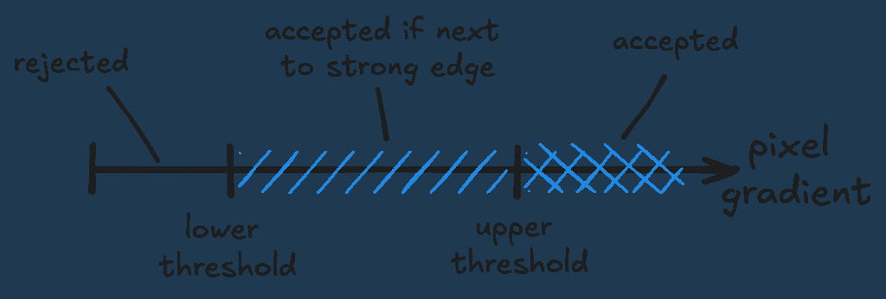

Canny 边缘检测的阈值

在我们检测数独网格的案例中，我们假设网格的边界线上有非常强的边缘。我们可以选择一个高的上限阈值来拒绝噪声出现在我们的掩码中，以及一个不太低的下限阈值，以拒绝连接到主要边界的较小噪声边缘出现在我们的掩码中。

在将图像传递给 Canny 之前，通常使用模糊过滤器来减少噪声，但在此情况下，边缘非常强而窄，因此省略了模糊。

```py
def find_sudoku_grid(
    image: np.ndarray,
    canny_threshold_1: int = 100,
    canny_threshold_2: int = 255,
) -> np.ndarray | None:
    """
    Finds the largest square-like contour in an image, likely the Sudoku grid.

    Args:
        image: The input image.
        canny_threshold_1: Lower threshold for the Canny edge detector.
        canny_threshold_2: Upper threshold for the Canny edge detector.

    Returns:
        The contour of the found grid as a numpy array, or None if not found.
    """

    ...

    canny = cv2.Canny(gray, threshold1=canny_threshold_1, threshold2=canny_threshold_2)
```

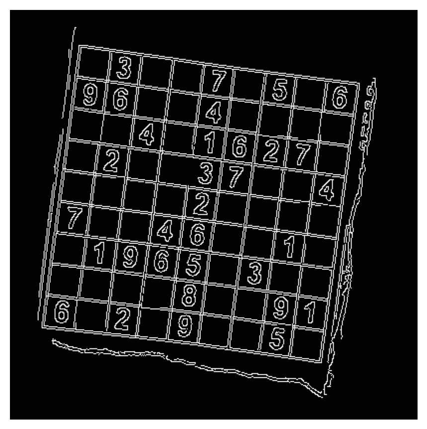

Canny 边缘后的掩码图像

### 膨胀

在这一步中，我们使用膨胀核对边缘检测掩码进行后处理，以关闭掩码中的小间隙。

```py
def find_sudoku_grid(
    image: np.ndarray,
    canny_threshold_1: int = 100,
    canny_threshold_2: int = 255,
    morph_kernel_size: int = 3,
) -> np.ndarray | None:
    """
    Finds the largest square-like contour in an image, likely the Sudoku grid.

    Args:
        image: The input image.
        canny_threshold_1: First threshold for the Canny edge detector.
        canny_threshold_2: Second threshold for the Canny edge detector.
        morph_kernel_size: Size of the morphological operation kernel.

    Returns:
        The contour of the found grid as a numpy array, or None if not found.
    """

    ...

    kernel = cv2.getStructuringElement(
        shape=cv2.MORPH_RECT, ksize=(morph_kernel_size, morph_kernel_size)
    )
    mask = cv2.morphologyEx(canny, op=cv2.MORPH_DILATE, kernel=kernel, iterations=1)
```

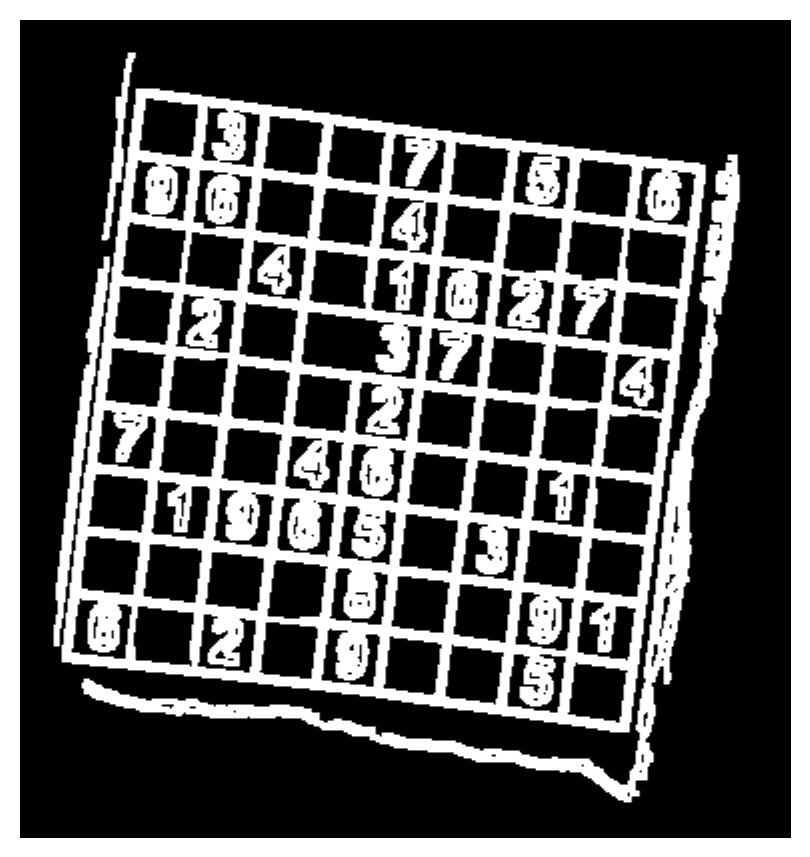

膨胀后的掩码图像

### 轮廓检测

现在二值掩码已经准备好了，我们可以运行一个轮廓检测算法来找到连贯的块，并过滤到一个具有四个点的单个轮廓。

```py
contours, _ = cv2.findContours(
    mask, mode=cv2.RETR_EXTERNAL, method=cv2.CHAIN_APPROX_SIMPLE
)
```

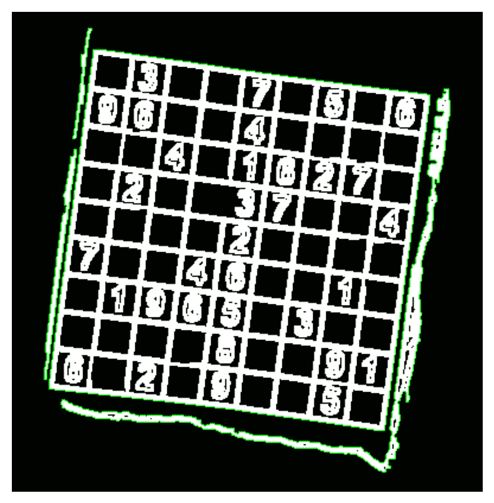

掩码图像上的检测到的轮廓

这个初始轮廓检测将返回一个包含轮廓中每个像素的轮廓列表。我们可以使用**Douglas–Peucker**算法迭代地减少轮廓中的点数，并用一个简单的多边形近似轮廓。我们可以为算法选择点之间的最小距离。

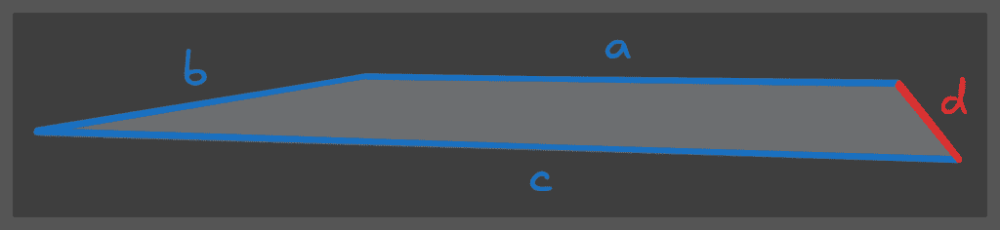

如果我们假设即使是对于一些最倾斜的矩形，最短边至少是形状周长的 10%，我们可以过滤轮廓到具有精确四个点的多边形。

```py
contour_candidates: list[np.ndarray] = []
for cnt in contours:
    # Approximate the contour to a polygon
    epsilon = 0.1 * cv2.arcLength(curve=cnt, closed=True)
    approx = cv2.approxPolyDP(curve=cnt, epsilon=epsilon, closed=True)

    # Keep only polygons with 4 vertices
    if len(approx) == 4:
        contour_candidates.append(approx)
```

最后，我们取最大的检测到的轮廓，假设是最终的数独网格。我们按面积降序排列轮廓，然后取第一个元素，对应于最大的轮廓面积。

```py
best_contour = sorted(contour_candidates, key=cv2.contourArea, reverse=True)[0]
```

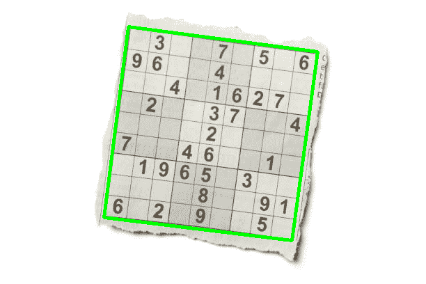

在原始图像上突出显示的过滤轮廓

### 透视变换

最后，我们需要将检测到的网格转换回其正方形。为了实现这一点，我们可以使用透视变换。变换矩阵可以通过指定 Sudoku 网格轮廓的四个点最终需要放置的位置来计算：图像的四个角。

```py
rect_dst = np.array(
    [[0, 0], [width - 1, 0], [width - 1, height - 1], [0, height - 1]],
)
```

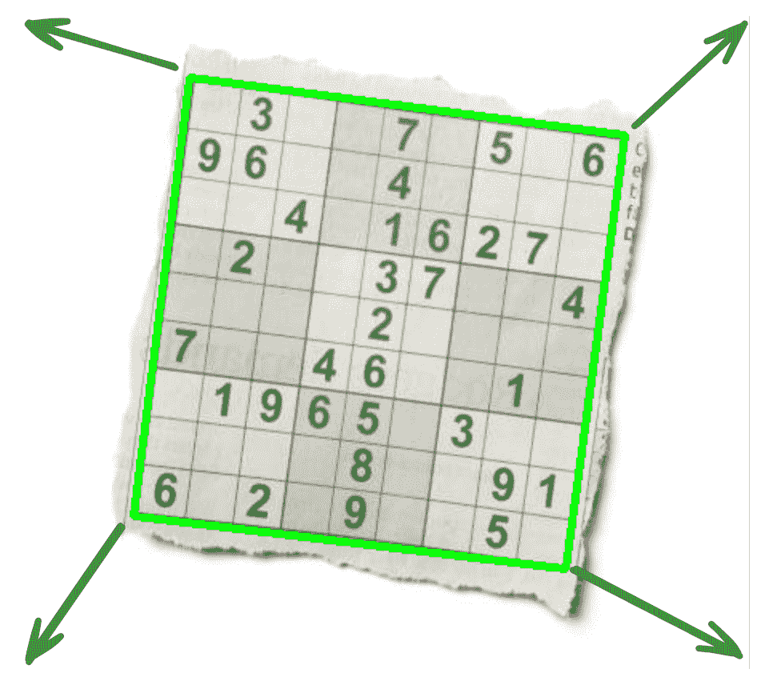

为了将轮廓点匹配到角点，首先需要对这些点进行排序，以便正确分配。让我们为我们的角点定义以下顺序：

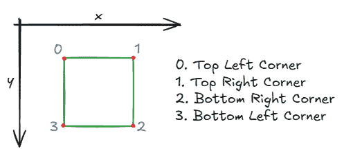

#### 变体 A：基于和/差的简单排序

为了对提取的角点进行排序并将它们分配到这些目标点，一个简单的算法可以查看每个角点的 x 和 y 坐标的 `sum` 和 `differences`。

```py
p_sum = p_x + p_y
p_diff = p_x - p_y
```

基于这些值，现在可以区分角点：

+   左上角具有最小的 x 和 y 值，因此它具有最小的和 `argmin(p_sum)`

+   右下角具有最大的和 `argmax(p_sum)`

+   右上角具有最大的差 `argmax(p_diff)`

+   左下角具有最小的差 `argmin(p_diff)`

在以下动画中，我尝试可视化旋转正方形的四个角的分配。彩色线条表示分配给每个正方形角的相应图像角。

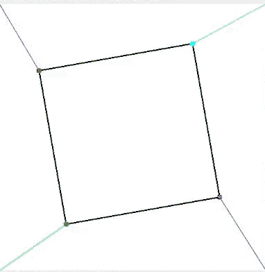

旋转正方形的动画，每个角有不同的颜色，并且线条指示分配到图像角的位置

```py
def order_points(pts: np.ndarray) -> np.ndarray:
    """
    Orders the four corner points of a contour in a consistent
    top-left, top-right, bottom-right, bottom-left sequence.

    Args:
        pts: A numpy array of shape (4, 2) representing the four corners.

    Returns:
        A numpy array of shape (4, 2) with the points ordered.
    """
    # Reshape from (4, 1, 2) to (4, 2) if needed
    pts = pts.reshape(4, 2)
    rect = np.zeros((4, 2), dtype=np.float32)

    # The top-left point will have the smallest sum, whereas
    # the bottom-right point will have the largest sum
    s = pts.sum(axis=1)
    rect[0] = pts[np.argmin(s)]
    rect[2] = pts[np.argmax(s)]

    # The top-right point will have the smallest difference,
    # whereas the bottom-left will have the largest difference
    diff = np.diff(pts, axis=1)
    rect[1] = pts[np.argmin(diff)]
    rect[3] = pts[np.argmax(diff)]

    return rect
```

这在矩形严重倾斜的情况下效果很好，如下所示。在这种情况下，你可以清楚地看到这种方法是存在缺陷的，因为同一个矩形角被分配到多个图像角。

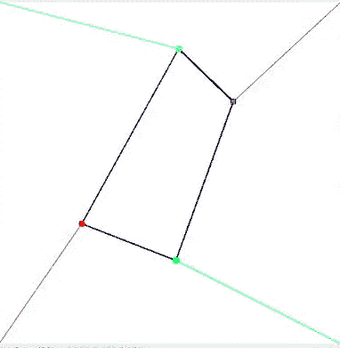

倾斜旋转的四边形的相同分配过程失败

#### 变体 B：分配优化问题

另一种方法是通过最小化每个点与其分配的角之间的距离。这可以通过使用 `pairwise_distances` 计算每个点与角之间的距离以及来自 [scipy](https://docs.scipy.org/doc/scipy/reference/generated/scipy.optimize.linear_sum_assignment.html) 的 `linear_sum_assignment` 函数来实现，该函数在最小化成本函数的同时解决分配问题。

```py
def order_points_simplified(pts: np.ndarray) -> np.ndarray:
    """
    Orders a set of points to best match a target set of corner points.

    Args:
        pts: A numpy array of shape (N, 2) representing the points to order.

    Returns:
        A numpy array of shape (N, 2) with the points ordered.
    """
    # Reshape from (N, 1, 2) to (N, 2) if needed
    pts = pts.reshape(-1, 2)

    # Calculate the distance between each point and each target corner
    D = pairwise_distances(pts, pts_corner)

    # Find the optimal one-to-one assignment
    # row_ind[i] should be matched with col_ind[i]
    row_ind, col_ind = linear_sum_assignment(D)

    # Create an empty array to hold the sorted points
    ordered_pts = np.zeros_like(pts)

    # Place each point in the correct slot based on the corner it was matched to.
    # For example, the point matched to target_corners[0] goes into ordered_pts[0].
    ordered_pts[col_ind] = pts[row_ind]

    return ordered_pts
```

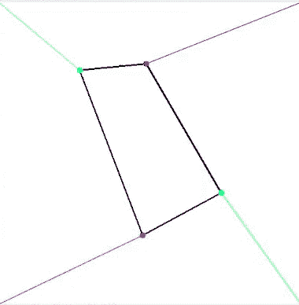

动画旋转倾斜的四边形，其角正确分配到图像角

尽管这个解决方案是可行的，但它并不理想，因为它依赖于形状点与角之间的图像距离，并且计算上更昂贵，因为必须构建一个距离矩阵。当然，在这种情况下，四个点分配是微不足道的，但这个解决方案不适合具有许多点的多边形！

### 变体 C：带有锚点的循环排序

这种第三种变体是一种非常轻量级且高效的方法来排序和分配形状点到图像角。想法是计算形状每个点的角度，基于质心位置。

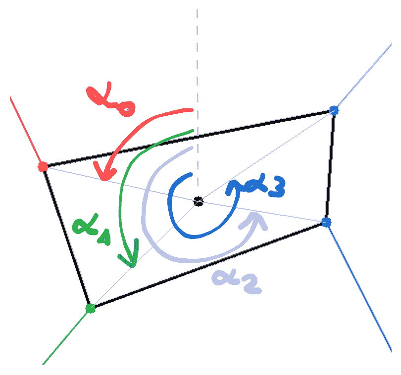

分配给每个角的角度草图

由于角度是**循环的**，我们需要选择一个锚点来保证点的绝对顺序。我们简单地选择 x 和 y 坐标和最小的点。

```py
def order_points(self, pts: np.ndarray) -> np.ndarray:
    """
    Orders points by angle around the centroid, then rotates to start from top-left.

    Args:
        pts: A numpy array of shape (4, 2).

    Returns:
        A numpy array of shape (4, 2) with points ordered."""
    pts = pts.reshape(4, 2)
    center = pts.mean(axis=0)
    angles = np.arctan2(pts[:, 1] - center[1], pts[:, 0] - center[0])
    pts_cyclic = pts[np.argsort(angles)]
    sum_of_coords = pts_cyclic.sum(axis=1)
    top_left_idx = np.argmin(sum_of_coords)
    return np.roll(pts_cyclic, -top_left_idx, axis=0)
```

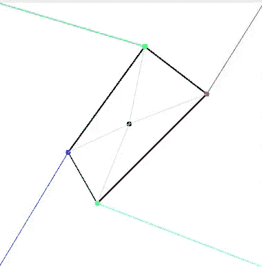

带有正确分配角度的旋转倾斜四边形动画

我们现在可以使用这个函数来排序我们的轮廓点：

```py
rect_src = order_points(grid_contour)
```

### 应用透视变换

现在我们知道了哪些点需要移动到哪个位置，我们最终可以进入最有趣的部分：创建并实际应用图像的透视变换。

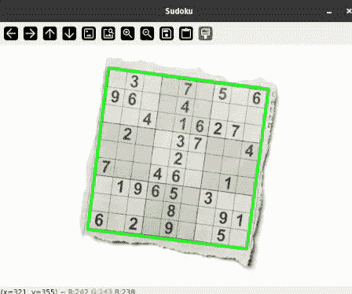

应用透视变换的动画

由于我们已经将检测到的四边形的点列表按`rect_src`排序，并且我们有了目标角点在`rect_dst`中，我们可以使用**[OpenCV](https://docs.opencv.org/4.x/da/d54/group__imgproc__transform.html#gae66ba39ba2e47dd075055c7e986ab85)**方法来计算变换矩阵：

```py
warp_mat = cv2.getPerspectiveTransform(rect_src, rect_dst)
```

结果是一个**3×3 的扭曲矩阵**，定义了如何从倾斜的 3D 透视视图转换到 2D 平视俯视图。为了得到我们数独网格的平视俯视图，我们可以将这个透视变换应用到原始图像上：

```py
warped = cv2.warpPerspective(img, warp_mat, (side_len, side_len))
```

哇，我们得到了一个完美的正方形数独网格！

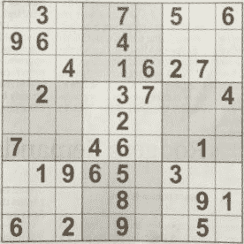

透视变换后的数独方格的最终俯视图

## 结论

在这个项目中，我们使用经典的计算机视觉技术，通过一个简单的流程从图片中提取数独网格。这些方法提供了一种简单的方式来检测数独网格的边界。当然，由于它的简单性，这种方法在推广到不同的设置和极端环境（如低光或硬阴影）时存在一些局限性。如果检测需要推广到大量不同的设置，使用基于深度学习的方案可能是有意义的。

接下来，使用透视变换来获取网格的平坦俯视图。现在，这张图片可以用于进一步处理，例如提取网格中的数字以及实际解决数独。在下一篇文章中，我们将进一步探讨这个项目中的这些自然下一步。

查看以下项目的源代码，并告诉我您对这个项目有任何问题或想法。在此之前，祝您编码愉快！

* * *

更多细节以及包括所有动画和可视化代码的完整实现，请查看我在 GitHub 上这个项目的源代码：

[`github.com/trflorian/sudoku-extraction`](https://github.com/trflorian/sudoku-extraction)

* * *

本帖中的所有可视化都是由作者创建的。
