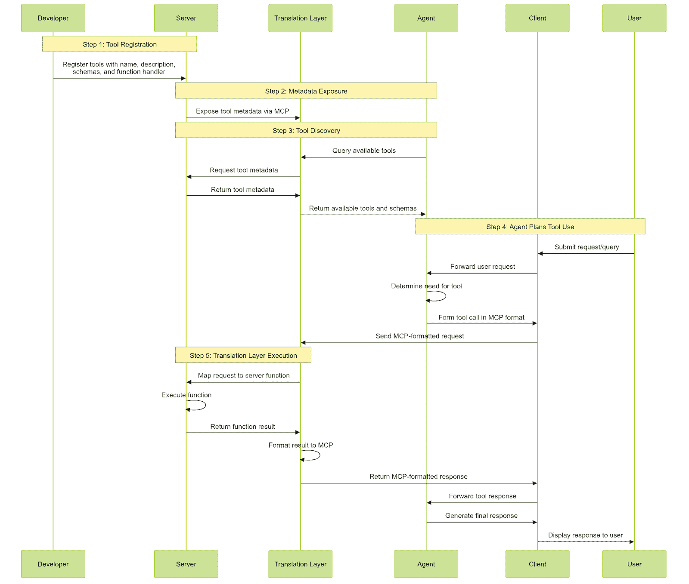

# 带有代码示例的 MCP（模型上下文协议）清晰介绍

> 原文：[`towardsdatascience.com/clear-intro-to-mcp/`](https://towardsdatascience.com/clear-intro-to-mcp/)

<mdspan datatext="el1742887159309" class="mdspan-comment">随着将 AI 代理从原型转移到生产的竞赛日益激烈，需要一种标准化的方式让代理在不同提供商之间调用工具的需求迫切。这种过渡到代理工具调用的标准化方法类似于我们看到的 REST API。在它们存在之前，开发者必须处理一堆专有协议的混乱，只是为了从不同的服务中提取数据。REST 将混乱变为有序，使系统能够以一致的方式相互通信。MCP（模型上下文协议）旨在，正如其名称所示，以标准化的方式为 AI 模型提供上下文。没有它，我们将走向工具调用的混乱，因为多个不兼容的“标准化”工具调用版本的出现仅仅是因为没有共享的方式让代理组织、共享和调用工具。MCP 为我们提供了一个共享的语言和工具调用的民主化。）

我个人非常兴奋的一点是，像 MCP 这样的工具调用标准实际上可以使 AI 系统更安全。有了对经过良好测试的工具的更容易访问，更多的公司可以避免重新发明轮子，这降低了安全风险并最小化了恶意代码的可能性。随着 AI 系统在 2025 年开始扩展，这些都是有效的问题。

当我深入研究 MCP 时，我意识到文档中存在巨大的差距。虽然有很多关于“它做什么”的高级内容，但当你真正想要了解它是如何工作时，资源就开始变得不足——尤其是对于那些非原生开发者来说。要么是高级解释，要么是深入到源代码中。

在这篇文章中，我将为更广泛的受众分解 MCP——使概念和功能清晰易懂。如果你能的话，在编码部分跟随，如果不能，它将在代码片段上方用自然语言进行详细解释。

## 理解 MCP 的类比：餐厅

让我们想象 MCP 的概念就像一家餐厅，我们拥有：

主机 = 餐厅建筑（代理运行的环境）

服务器 = 厨房（工具所在之处）

客户端 = 服务员（发送工具请求）

代理 = 顾客（决定使用什么工具）

工具 = 菜谱（执行执行的代码）

## MCP 的组成部分

**主机**这是代理操作的地方。在我们的类比中，它是餐厅建筑；在 MCP 中，是代理或 LLM 实际运行的地方。如果你在本地使用 Ollama，那么你就是主机。如果你使用 Claude 或 GPT，那么 Anthropic 或 OpenAI 就是主机。

**客户端**

这是代理发送工具调用请求的环境。可以将其想象成服务员，他接受你的订单并将其送到厨房。从实际的角度来看，它就是你的代理运行的应用程序或界面。客户端通过 MCP 将工具调用请求传递给**服务器**。

**服务器**

这是存放食谱或工具的厨房。它集中化工具，以便代理可以轻松访问。服务器可以是本地的（由用户启动）或远程的（由提供工具的公司托管）。服务器上的工具通常按功能或集成分组。例如，所有与 Slack 相关的工具都可以在“Slack 服务器”上，或者所有消息工具都可以在“消息服务器”上分组。这个决定基于架构和开发者的偏好。

**代理**

操作的“大脑”。由 LLM 提供动力，它决定调用哪些工具来完成任务。当它确定需要工具时，它会向服务器发起请求。代理不需要原生理解 MCP，因为它通过每个工具相关的元数据学习如何使用它。与每个工具相关的元数据告诉代理调用工具的协议和执行方法。但需要注意的是，平台或代理需要支持 MCP，以便自动处理工具调用。否则，开发者需要编写复杂的转换逻辑，如何从模式中解析元数据，以 MCP 格式形成工具调用请求，将请求映射到正确的函数，执行代码，并以 MCP 兼容的格式将结果返回给代理。

**工具**

这些是执行工作的函数，例如调用 API 或自定义代码。工具存在于服务器上，可以是：

+   你创建并托管在本地服务器上的自定义工具。

+   由其他人托管在远程服务器上的预制工具。

+   由其他人创建但由你托管在本地服务器上的预制代码。

## 组件如何配合在一起

1.  **服务器注册工具**每个工具都通过名称、描述、输入/输出模式、函数处理程序（运行的代码）注册到服务器。这通常涉及调用一个方法或 API 来告诉服务器“嘿，这里有一个新工具，这是你如何使用它的方法”。

1.  **服务器暴露元数据**当服务器启动或代理连接时，它通过 MCP 暴露工具元数据（模式、描述）。

1.  **代理发现工具**代理通过 MCP 查询服务器以查看可用的工具。它理解如何使用每个工具，这是从工具元数据中了解的。这通常发生在启动时或添加工具时。

1.  **代理计划工具使用**当代理确定需要工具（基于用户输入或任务上下文）时，它会以标准化的 MCP JSON 格式形成工具调用请求，包括工具名称、与工具输入模式匹配的输入参数以及任何其他元数据。客户端充当传输层，并将 MCP 格式的请求通过 HTTP 发送到服务器。

1.  **翻译层执行**

    翻译层接收代理的标准工具调用（通过 MCP），将请求映射到服务器上的相应函数，执行函数，将结果格式化回 MCP，并将其发送回代理。一个为您抽象 MCP 的框架会做所有这些，而无需开发者编写翻译层逻辑（听起来像头痛）。



图片由 Sandi Besen 提供

## 使用 MCP Brave 搜索服务器的 Re-Act 代理代码示例

为了理解应用 MCP 后 MCP 的样子，让我们使用 IBM 的 beeAI 框架，该框架原生支持 MCP 并为我们处理翻译逻辑。

如果您计划运行此代码，您将需要：

1.  克隆 [beeai 框架存储库](https://github.com/i-am-bee/beeai-framework) 以获取在此代码中使用的辅助类。

1.  创建一个 [免费 Brave 开发者账户](https://github.com/modelcontextprotocol/servers/blob/main/src/brave-search/README.md) 并获取您的 API 密钥。有免费订阅可供选择（需要信用卡）。

1.  创建一个 OpenAI 开发者账户并创建一个 API 密钥

1.  将您的 Brave API 密钥和 OpenAI 密钥添加到存储库 python 文件夹级别的 .env 文件中。

1.  确保您已安装 npm 并正确设置了路径。

### **Sample .env file**

```py
BRAVE_API_KEY= "<Your API Key Here>"
BEEAI_LOG_LEVEL=INFO
OPENAI_API_KEY= "<Your API Key Here>"
```

### **Sample mcp_agent.ipynb**

**1. 导入必要的库**

```py
import asyncio
import logging
import os
import sys
import traceback
from typing import Any
from beeai_framework.agents.react.runners.default.prompts import SystemPromptTemplate
from mcp import ClientSession, StdioServerParameters
from mcp.client.stdio import stdio_client
from beeai_framework import Tool
from beeai_framework.agents.react.agent import ReActAgent
from beeai_framework.agents.types import AgentExecutionConfig
from beeai_framework.backend.chat import ChatModel, ChatModelParameters
from beeai_framework.emitter.emitter import Emitter, EventMeta
from beeai_framework.errors import FrameworkError
from beeai_framework.logger import Logger
from beeai_framework.memory.token_memory import TokenMemory
from beeai_framework.tools.mcp_tools import MCPTool
from pathlib import Path
from beeai_framework.adapters.openai.backend.chat import OpenAIChatModel
from beeai_framework.backend.message import SystemMessa
```

**2. 加载环境变量并设置系统路径（如果需要）**

```py
import os
from dotenv import load_dotenv

# Absolute path to your .env file
# sometimes the system can have trouble locating the .env file
env_path = <Your path to your .env file>
# Load it
load_dotenv(dotenv_path=env_path)

# Get current working directory
path = <Your path to your current python directory> #...beeai-framework/python'
# Append to sys.path
sys.path.append(path) 
```

**3. 配置记录器**

```py
# Configure logging - using DEBUG instead of trace
logger = Logger("app", level=logging.DEBUG)
```

**4. 加载 helper_functions，如 process_agent_events、observer，并创建 ConsoleReader 的实例**

+   process_agent_events：处理代理事件，并根据事件类型（例如，错误、重试、更新）将消息记录到控制台。它确保每个事件都有意义的结果，以帮助跟踪代理活动。

+   observer：监听来自发射器的所有事件，并将它们路由到 process_agent_events 进行处理和显示。

+   ConsoleReader：管理控制台输入/输出，允许用户交互并以彩色编码的角色显示格式化消息。

```py
#load console reader
from examples.helpers.io import ConsoleReader
#this is a helper function that makes the assitant chat easier to read
reader = ConsoleReader()

def process_agent_events(data: dict[str, Any], event: EventMeta) -> None:
  """Process agent events and log appropriately"""

  if event.name == "error":
      reader.write("Agent 🤖 : ", FrameworkError.ensure(data["error"]).explain())
  elif event.name == "retry":
      reader.write("Agent 🤖 : ", "retrying the action...")
  elif event.name == "update":
      reader.write(f"Agent({data['update']['key']}) 🤖 : ", data["update"]["parsedValue"])
  elif event.name == "start":
      reader.write("Agent 🤖 : ", "starting new iteration")
  elif event.name == "success":
      reader.write("Agent 🤖 : ", "success")
  else:
      print(event.path)

def observer(emitter: Emitter) -> None:
  emitter.on("*.*", process_agent_events)
```

**5. 设置 Brave API 密钥和服务器参数。**

Anthropic 在 [这里](https://modelcontextprotocol.io/examples) 列出了 MCP 服务器。

```py
brave_api_key = os.environ["BRAVE_API_KEY"]

brave_server_params = StdioServerParameters(
  command="/opt/homebrew/bin/npx",  # Full path to be safe
  args=[
      "-y",
      "@modelcontextprotocol/server-brave-search"
  ],
  env={
      "BRAVE_API_KEY": brave_api_key,
        "x-subscription-token": brave_api_key
  },
)
```

**6. 创建一个勇敢的工具，该工具初始化与 MCP 服务器的连接，发现工具，并将发现的工具返回给代理，以便它决定针对特定任务调用哪个工具。**

在这种情况下，Brave MCP 服务器上有 2 个可发现工具：

+   brave_web_search：执行带分页和过滤的网页搜索

+   brave_local_search：搜索本地企业和服务

```py
async def brave_tool() -> MCPTool:
  brave_env = os.environ.copy()
  brave_server_params = StdioServerParameters(
      command="/opt/homebrew/bin/npx",
      args=["-y", "@modelcontextprotocol/server-brave-search"],
      env=brave_env
  )

  print("Starting MCP client...")
  try:
      async with stdio_client(brave_server_params) as (read, write), ClientSession(read, write) as session:
          print("Client connected, initializing...")

          await asyncio.wait_for(session.initialize(), timeout=10)
          print("Initialized! Discovering tools...")

          bravetools = await asyncio.wait_for(
              MCPTool.from_client(session, brave_server_params),
              timeout=10
          )
          print("Tools discovered!")
          return bravetools
  except asyncio.TimeoutError as e:
      print("❌ Timeout occurred during session initialization or tool discovery.")
  except Exception as e:
      print("❌ Exception occurred:", e)
      traceback.print_exc()
```

（可选）检查与 MCP 服务器之间的连接，并在将其提供给代理之前确保它返回所有可用的工具。

```py
tool = await brave_tool()
print("Discovered tools:", tool)

for tool in tool:
  print(f"Tool Name: {tool.name}")
  print(f"Description: {getattr(tool, 'description', 'No description available')}")
  print("-" * 30)
```

### *输出：*

```py
Starting MCP client...

Client connected, initializing...

Initialized! Discovering tools...

Tools discovered!

Discovered tools: [<beeai_framework.tools.mcp_tools.MCPTool object at 0x119aa6c00>, <beeai_framework.tools.mcp_tools.MCPTool object at 0x10fee3e60>]

Tool Name: brave_web_search

Description: Performs a web search using the Brave Search API, ideal for general queries, news, articles, and online content. Use this for broad information gathering, recent events, or when you need diverse web sources. Supports pagination, content filtering, and freshness controls. Maximum 20 results per request, with offset for pagination. 

------------------------------

Tool Name: brave_local_search

Description: Searches for local businesses and places using Brave's Local Search API. Best for queries related to physical locations, businesses, restaurants, services, etc. Returns detailed information including:

- Business names and addresses

- Ratings and review counts

- Phone numbers and opening hours

Use this when the query implies 'near me' or mentions specific locations. Automatically falls back to web search if no local results are found.
```

**7. 编写创建代理的函数：**

+   分配一个 LLM

+   创建 brave_tool() 函数的一个实例并将其分配给 tools 变量

+   创建一个 re-act 代理，并分配给选定的 llm、工具、内存（以便它可以进行持续的对话）

+   向 re-act 代理添加系统提示。

注意：您可能会注意到，我在系统提示中添加了一句话，即“如果您需要使用 brave_tool，您必须使用计数为 5。”这是由于我在 brave 服务器`index.ts`文件中发现的错误而采取的临时解决方案。我将向仓库贡献以修复它。

```py
async def create_agent() -> ReActAgent:
  """Create and configure the agent with tools and LLM"""
  #using openai api instead
  llm = OpenAIChatModel(model_id="gpt-4o")

  # Configure tools
  tools: list[Tool] = await brave_tool()
  #tools: list[Tool] = [await brave_tool()]

  # Create agent with memory and tools
  agent = ReActAgent(llm=llm, tools=tools, memory=TokenMemory(llm), )

  await agent.memory.add(SystemMessage(content="You are a helpful assistant. If you need to use the brave_tool you must use a count of 5."))

  return agent
```

**8. 创建主函数**

+   创建代理

+   与用户进入对话循环，并使用用户提示和一些配置设置运行代理。如果用户输入“退出”或“quit”，则结束对话。

```py
import asyncio
import traceback
import sys

# Your async main function
async def main() -> None:
  """Main application loop"""

  # Create agent
  agent = await create_agent()

  # Main interaction loop with user input
  for prompt in reader:
      # Exit condition
      if prompt.strip().lower() in {"exit", "quit"}:
          reader.write("Session ended by user. Goodbye! 👋n")
          break

      # Run agent with the prompt
      try:
          response = await agent.run(
              prompt=prompt,
              execution=AgentExecutionConfig(max_retries_per_step=3, total_max_retries=10, max_iterations=20),
          ).observe(observer)

          reader.write("Agent 🤖 : ", response.result.text)
      except Exception as e:
          reader.write("An error occurred: ", str(e))
          traceback.print_exc()
```

```py
# Run main() with error handling
try:
  await main()
except FrameworkError as e:
  traceback.print_exc()
  sys.exit(e.explain())
```

### 输出：

```py
Starting MCP client...

Client connected, initializing...

Initialized! Discovering tools...

Tools discovered!

Interactive session has started. To escape, input 'q' and submit.

Agent 🤖 : starting new iteration

Agent(thought) 🤖 : I will use the brave_local_search function to find the open hours for La Taqueria on Mission St in San Francisco.

Agent(tool_name) 🤖 : brave_local_search

Agent(tool_input) 🤖 : {'query': 'La Taqueria Mission St San Francisco'}

Agent(tool_output) 🤖 : [{"annotations": null, "text": "Error: Brave API error: 422 Unprocessable Entityn{"type":"ErrorResponse","error":{"id":"ddab2628-c96e-478f-80ee-9b5f8b1fda26","status":422,"code":"VALIDATION","detail":"Unable to validate request parameter(s)","meta":{"errors":[{"type":"greater_than_equal","loc":["query","count"],"msg":"Input should be greater than or equal to 1","input":"0","ctx":{"ge":1}}]}},"time":1742589546}", "type": "text"}]

Agent 🤖 : starting new iteration

Agent(thought) 🤖 : The function call resulted in an error. I will try again with a different approach to find the open hours for La Taqueria on Mission St in San Francisco.

Agent(tool_name) 🤖 : brave_local_search

Agent(tool_input) 🤖 : {'query': 'La Taqueria Mission St San Francisco', 'count': 5}

Agent(tool_output) 🤖 : [{"annotations": null, "text": "Title: LA TAQUERIA - Updated May 2024 - 2795 Photos & 4678 Reviews - 2889 Mission St, San Francisco, California - Mexican - Restaurant Reviews - Phone Number - YelpnDescription: LA TAQUERIA, <strong>2889 Mission St, San Francisco, CA 94110</strong>, 2795 Photos, Mon - Closed, Tue - Closed, Wed - 11:00 am - 8:45 pm, Thu - 11:00 am - 8:45 pm, Fri - 11:00 am - 8:45 pm, Sat - 11:00 am - 8:45 pm, Sun - 11:00 am - 7:45 pmnURL: https://www.yelp.com/biz/la-taqueria-san-francisco-2nnTitle: La Taqueria: Authentic Mexican Cuisine for Every TastenDescription: La Taqueria - <strong>Mexican Food Restaurant</strong> welcomes you to enjoy our delicious. La Taqueria provides a full-service experience in a fun casual atmosphere and fresh flavors where the customer always comes first!nURL: https://lataqueria.gotoeat.net/nnTitle: r/sanfrancisco on Reddit: Whats so good about La Taqueria in The Mission?nDescription: 182 votes, 208 comments. Don't get me wrong its good but I failed to see the hype. I waited in a long line and once I got my food it just tastes like…nURL: https://www.reddit.com/r/sanfrancisco/comments/1d0sf5k/whats_so_good_about_la_taqueria_in_the_mission/nnTitle: LA TAQUERIA, San Francisco - Mission District - Menu, Prices & Restaurant Reviews - TripadvisornDescription: La Taqueria still going strong. <strong>Historically the most well known Burrito home in the city and Mission District</strong>. Everything is run like a clock. The fillings are just spiced and prepared just right. Carnitas, chicken, asada, etc have true home made flavors. The Tortillas both are super good ...nURL: https://www.tripadvisor.com/Restaurant_Review-g60713-d360056-Reviews-La_Taqueria-San_Francisco_California.htmlnnTitle: La Taqueria – San Francisco - a MICHELIN Guide RestaurantnDescription: San Francisco Restaurants · La Taqueria · 4 · <strong>2889 Mission St., San Francisco, 94110, USA</strong> · $ · Mexican, Regional Cuisine · Visited · Favorite · Find bookable restaurants near me · <strong>2889 Mission St., San Francisco, 94110, USA</strong> · $ · Mexican, Regional Cuisine ·nURL: https://guide.michelin.com/us/en/california/san-francisco/restaurant/la-taqueria", "type": "text"}]

Agent 🤖 : starting new iteration

Agent(thought) 🤖 : I found the open hours for La Taqueria on Mission St in San Francisco. I will provide this information to the user.

Agent(final_answer) 🤖 : La Taqueria, located at 2889 Mission St, San Francisco, CA 94110, has the following opening hours:

- Monday: Closed

- Tuesday: Closed

- Wednesday to Saturday: 11:00 AM - 8:45 PM

- Sunday: 11:00 AM - 7:45 PM

For more details, you can visit their [Yelp page](https://www.yelp.com/biz/la-taqueria-san-francisco-2).

Agent 🤖 : success

Agent 🤖 : success

run.agent.react.finish

Agent 🤖 : La Taqueria, located at 2889 Mission St, San Francisco, CA 94110, has the following opening hours:

- Monday: Closed

- Tuesday: Closed

- Wednesday to Saturday: 11:00 AM - 8:45 PM

- Sunday: 11:00 AM - 7:45 PM

For more details, you can visit their [Yelp page](https://www.yelp.com/biz/la-taqueria-san-francisco-2).
```

## 结论、挑战以及 MCP 的发展方向

在这篇文章中，您已经看到了 MCP 如何为代理提供一种标准化的方式，以便在 MCP 服务器上发现工具，然后无需开发者指定工具调用的实现细节即可与之交互。MCP 提供的抽象级别非常强大。这意味着开发者可以专注于创建有价值的工具，而代理可以通过标准协议无缝地发现和使用它们。

我们的餐厅示例帮助我们可视化 MCP 概念（如主机、客户端、服务器、代理和工具）如何协同工作——每个都有自己的重要角色。我们使用的代码示例是在 Beeai 框架中使用了 Re-Act 代理，该代理原生支持 MCP 工具调用，调用 Brave MCP 服务器并访问两个工具，这为 MCP 在实际中如何使用提供了真实世界的理解。

没有像 MCP 这样的协议，我们面临的是一个碎片化的格局，其中每个 AI 提供商都实施他们自己的不兼容的工具调用机制——这增加了复杂性、安全漏洞和浪费的开发努力。

### **在接下来的几个月里，我们可能会看到 MCP 因以下几个原因而获得显著的关注：**

+   随着更多工具提供商采用 MCP，网络效应将加速整个行业的采用。

+   标准化协议意味着更好的测试、更少的漏洞和随着 AI 系统扩展而降低的风险。

+   能够编写一次工具并在多个代理框架中工作将大大减少开发开销。

+   小型玩家可以通过专注于构建优秀的工具来竞争，而不是重新发明复杂的代理架构。

+   组织可以更有信心地整合 AI 代理，因为他们知道它们建立在稳定、互操作的标准之上。

### **尽管如此，随着 MCP 的采用率增长，它面临着需要解决的重要挑战：**

+   如我们的代码示例所示，代理只能在连接到服务器后才能发现工具

+   代理的功能变得依赖于服务器正常运行时间和性能，这引入了额外的故障点。

+   随着协议的发展，在添加新功能的同时保持兼容性将需要治理。

+   标准化代理如何访问不同服务器上的潜在敏感工具引入了安全考虑。

+   客户-服务器架构引入了额外的延迟。

对于开发者、AI 研究人员以及构建基于代理系统的组织来说，现在理解并采用 MCP——同时注意这些挑战——将在更多 AI 解决方案开始扩展时提供显著优势。

* * *

*注意：本文和论文中表达的观点完全是作者的个人观点，并不一定反映他们各自雇主的观点或政策。*

想要建立联系吗？在[LinkedIn](https://www.linkedin.com/in/sandibesen/)上给我发个私信！我总是渴望参与有启发性的讨论，并迭代我的工作。
