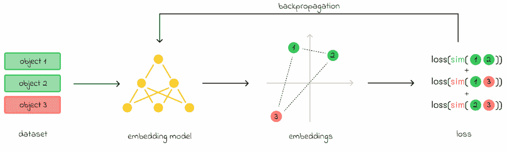
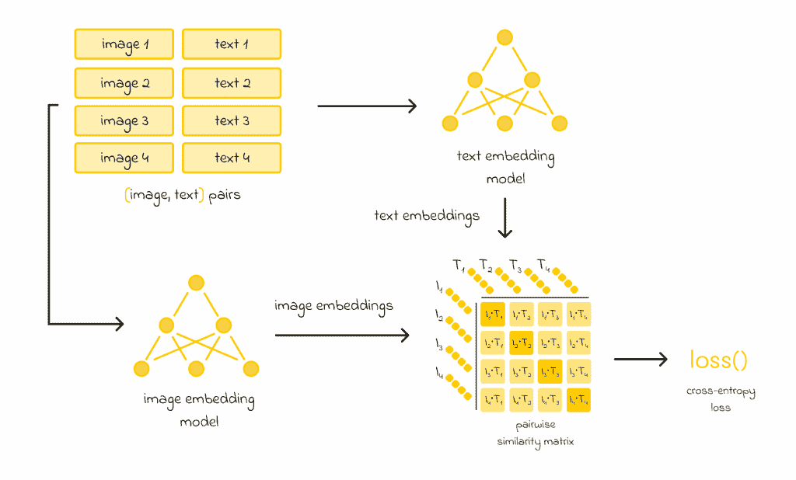
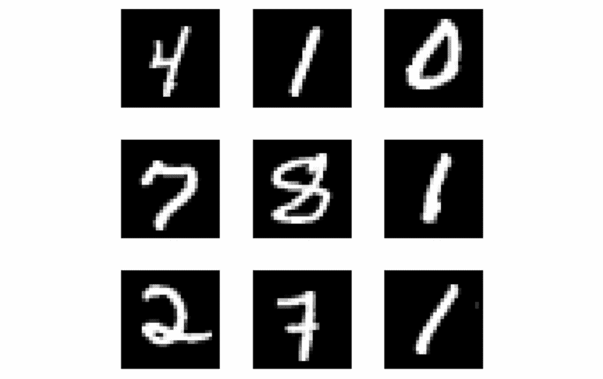

# CLIP 模型概述：开启多模态 AI 的潜能

> 原文：[`towardsdatascience.com/clip-model-overview-unlocking-the-power-of-multimodal-ai/`](https://towardsdatascience.com/clip-model-overview-unlocking-the-power-of-multimodal-ai/)

## <mdspan datatext="el1752519476977" class="mdspan-comment">简介</mdspan>

今天关于大型语言模型（LLMs）的炒作很多。工程师们经常比较并赞扬像 ChatGPT、Llama、Gemini 和 Mistral 这样的近期革命性模型，它们确实因其强大的能力而值得如此多的关注。同时，开发者们往往不会提及许多其他在机器学习行业中带来巨大成功的有影响力的模型。

在这篇文章中，我想谈谈 OpenAI 开发的最具标志性的模型之一——CLIP。2021 年发布，CLIP 可用于各种 NLP 或计算机视觉项目，并在不同任务上产生最先进的结果。虽然许多工程师认为 CLIP 只是一个嵌入模型——这是真的——但其应用范围非常广泛。

> *在这篇文章中，我们将详细介绍 CLIP 模型，包括其架构和训练过程、性能和应用程序。*

## 对比学习

在讨论 CLIP 架构之前，让我们先了解**对比学习**的含义，它在 CLIP 设计中起着至关重要的作用。

> **对比学习**是一种自监督学习方法，其目标包括教会嵌入模型产生嵌入，使得相似的样本在空间中更接近，而不相似的样本则被推得更远。

**对比学习框架**的目标是在嵌入空间中将同一类别的对象（1 和 2）彼此靠近，同时将它们与属于不同类别的对象 3 推得更远。

简而言之，在对比学习中，模型与成对的物体一起工作。在训练过程中，模型不知道在现实中它们是否相似。通过计算嵌入预测它们的距离（相似性）后，计算损失函数。基本上有两种情况：

+   **初始对象是相似的**。损失函数的值导致权重更新，以调整嵌入，使它们在下次更接近。

+   **初始对象是不相似的**。在这种情况下，模型更新其权重，以便这对嵌入之间的相似性在下次会降低。

## 架构与训练

CLIP 开发者收集了一个包含 4000 万个对（图像，文本）的巨大数据集。每个图像都提供了一个文本描述。

目标是构建有意义的嵌入表示，以便它们之间的相似性可以衡量给定文本描述与图像的相似程度。为此，作者采用了两个已经存在的模型架构：

+   文本嵌入模型

+   图像嵌入模型

初始的 4000 万个图像和文本对被分成批次。每个批次中的每个图像和文本都通过图像或文本嵌入模型传递以生成嵌入。因此，如果批次中有*n*个嵌入对，则会产生*n*个图像和文本的嵌入。

之后，构建了图像和文本嵌入之间的**余弦对数相似度矩阵**。

对角矩阵主对角线上的每个元素代表从批处理开始耦合在一起的一对图像和文本之间的相似性。由于文本描述与图像对应得很好，**主对角线上的相似性应该最大化。**

另一方面，**对角线外的元素没有相互耦合，来自不同的对。因此，它们的相似性应该最小化。**

CLIP 工作流程图。来源：[从自然语言监督中学习可迁移的视觉模型](https://arxiv.org/pdf/2103.00020)。图像由作者改编。

计算出的相似度随后传递到**交叉熵损失函数**，用于对嵌入模型进行权重更新。

## 详细信息

CLIP 的主要参数是用于编码文本和图像的嵌入模型：

+   文本使用与 BERT 架构相似的基于 Transformer 的模型进行编码。

+   对于图像，编码可以通过传统的卷积网络（ResNet）或视觉 Transformer 模型（ViT）来完成。

> *两个模型都是从零开始训练的，默认情况下生成 512 大小的嵌入。鉴于数据集大小（4 亿对）很大，通常更喜欢使用 ViT 而不是 ResNet。*

## 优点

CLIP 有几个值得注意的强项：

+   CLIP 可以用于各种任务，而不仅仅是嵌入生成（以下章节中有示例）。

+   零样本 CLIP 的性能与在 ResNet 特征上使用线性分类器的简单监督基线相当。

+   计算效率：许多计算可以并行运行。

## 应用

### 嵌入

最明显的 CLIP 应用是用于文本和图像嵌入计算。这些嵌入可以单独用于文本或图像任务，例如在[similarity search pipelines](https://towardsdatascience.com/similarity-search-knn-inverted-file-index-7cab80cc0e79/)或 RAG 系统中。

此外，如果需要将图像与其对应的文本描述关联起来，可以同时使用文本和图像。

### 图像分类

除了生成图像和文本嵌入之外，CLIP 的另一个强项是能够以零样本学习的方式解决其他任务。

例如，让我们以一个图像分类任务为例。如果我们被给了一个动物图像，目的是从动物列表中识别其类别，我们可以嵌入每个动物的名字。然后，通过找到与给定图像嵌入最相似的文字嵌入，我们可以直接识别动物类别。

CLIP 可以估计图像与类别标签之间的相似性，以便对图像进行分类。

> *关于这种识别方法，研究表明，最好使用以下提示结构嵌入每个文本（类别名称）：“一张<动物类别>的图片”。对于其他任务类型，最佳的提示可能不同。*

### OCR

OCR 代表光学字符识别，简单地说就是从图像中识别文本。OCR 任务通常由专门训练的监督模型解决。尽管如此，CLIP 令人印象深刻的性能也允许它在零样本方式下识别图像中的文本。

如果有一个包含图像中可能出现的所有文本的列表，那么，与之前的情况类似，我们可以编码所有可能的选项并选择最相似的一对。然而，在这种情况下，所有可能的单词或文本的数量通常比图像分类任务中典型的标签数量大得多。编码所有这些内容将会非常冗长且效率低下。**这就是为什么 CLIP 很少用于具有长文本序列的 OCR 任务。**

在 OCR 方面，CLIP 对于小词或符号识别来说效果更好。例如，使用 CLIP 设置一个数字识别任务很容易，因为只有 10 个类别（每个类别代表 0 到 9 之间的数字）。

一个有趣的观察是，零样本 CLIP 在著名的 MNIST 手写数字识别任务上仅实现了 88%的准确率，而其他简单模型则轻易达到 99%的准确率。需要记住的是，尽管 CLIP 具有令人印象深刻的零样本能力，但仍可能存在 CLIP 未经过训练的非常具体的图像类型。

CLIP 在识别手写数字方面的准确率仅为 88%。来源：[MNIST 数据集 | TensorFlow](https://www.tensorflow.org/datasets/catalog/mnist)

这里有一些重要的注意事项：

> *CLIP 对于一些抽象任务（如照片中计数对象、估计图像中两个对象之间的距离等）并不适用。*
> 
> *CLIP 与其他较老模型（如 ImageNet 等）相比，在标准计算机视觉任务上产生类似的零样本性能。然而，为了能够击败它们，作者声称 CLIP 必须在比现代硬件强千倍以上的硬件上训练，这在当前情况下是不切实际的。*

## 结论

在这篇文章中，我们研究了 CLIP 的架构原理。CLIP 在 4000 万（图像，文本）对上进行了训练，在许多任务上达到了最先进的性能。虽然 CLIP 在处理一些抽象的下游任务时通常失败，但它仍然具有使用零样本技术执行其他标准计算机视觉任务的卓越能力。

## 资源

+   [从自然语言监督中学习可迁移的视觉模型](https://arxiv.org/pdf/2103.00020)

+   [CLIP：连接文本和图像 | OpenAI](https://openai.com/index/clip/)

+   [MNIST 数据集 | TensorFlow](https://www.tensorflow.org/datasets/catalog/mnist)

*除非另有说明，所有图像均为作者所有。*

> [相似性搜索，第一部分：kNN 与倒排文件索引](https://towardsdatascience.com/similarity-search-knn-inverted-file-index-7cab80cc0e79/)
> 
> [相似性搜索，第一部分：kNN 与倒排文件索引](https://towardsdatascience.com/similarity-search-knn-inverted-file-index-7cab80cc0e79/)
