# 时间聚类饮食行为：预防健康的一种机器学习方法

> 原文：[`towardsdatascience.com/clustering-eating-behaviors-in-time-a-machine-learning-approach-to-preventive-health/`](https://towardsdatascience.com/clustering-eating-behaviors-in-time-a-machine-learning-approach-to-preventive-health/)

很多人都知道*我们吃什么*很重要——但如果我们吃的时间和频率也同样重要呢？

在关于间歇性禁食益处的持续科学辩论中，这个问题变得更加引人入胜。作为一名对机器学习和健康生活充满热情的人，我被一篇 2017 年的研究论文[1]所启发，该论文探讨了这一交叉点。作者介绍了一种新的距离度量，称为**修改后的动态时间规整（MDTW）**——一种旨在不仅考虑餐点的营养内容，还要考虑它们一天中的**时间**的技术。

受他们工作的[1]启发，我从头开始使用 Python 实现了 MDTW 的完整版本。我将其应用于将模拟个体聚类成**时间饮食模式**，揭示了跳餐者、零食者和夜食者等不同的行为。

虽然 MDTW 可能听起来像是一个小众的指标，但它填补了时间序列比较中的关键差距。传统的距离度量——例如欧几里得距离，甚至是经典的动态时间规整（DTW）——在应用于饮食数据时都会遇到困难。人们不会在固定的时间或以一致的频率进食。他们可能会跳过餐点，不规律地吃零食，或者深夜进食。

**MDTW 正是为了应对这种时间错位和行为变化而设计的**。通过允许灵活对齐同时惩罚营养内容和餐点时间上的不匹配，MDTW 揭示了人们在进食方式上的微妙但有意义的不同。

## 本文涵盖的内容：

1.  **MDTW 的数学基础**——直观解释。

1.  **从公式到代码**——使用动态规划在 Python 中实现 MDTW。

1.  **生成合成饮食数据**以模拟现实世界的进食行为。

1.  **构建个体进食记录之间的距离矩阵**。

1.  **使用 K-Medoids 聚类个体**并使用轮廓和肘部方法进行评估。

1.  **将聚类**以散点图和联合分布的形式可视化。

1.  **从聚类中解释时间模式**：谁在什么时候吃以及吃多少？

## 关于经典动态时间规整（DTW）的简要说明

动态时间规整（DTW）是一种经典算法，用于测量两个可能长度或时间不同的序列之间的相似度。它在语音识别、手势分析和时间序列对齐中得到广泛应用。让我们看看一个非常简单的例子，使用*fastdtw*库的传统动态时间规整算法将序列 A 对齐到序列 B（B 的平移版本）。作为输入，我们给出欧几里得距离度量。我们还放置时间序列来计算这些时间序列之间的距离和优化对齐路径。

```py
import numpy as np
import matplotlib.pyplot as plt
from fastdtw import fastdtw
from scipy.spatial.distance import euclidean
# Sample sequences (scalar values)
x = np.linspace(0, 3 * np.pi, 30)
y1 = np.sin(x)
y2 = np.sin(x+0.5)  # Shifted version
# Convert scalars to vectors (1D)
y1_vectors = [[v] for v in y1]
y2_vectors = [[v] for v in y2]
# Use absolute distance for scalars
distance, path = fastdtw(y1_vectors, y2_vectors, dist=euclidean)
#or for scalar 
# distance, path = fastdtw(y1, y2, dist=lambda x, y: np.abs(x-y))

distance, path = fastdtw(y1, y2,dist=lambda x, y: np.abs(x-y))
# Plot the alignment
plt.figure(figsize=(10, 4))
plt.plot(y1, label='Sequence A (slow)')
plt.plot(y2, label='Sequence B (shifted)')

# Draw alignment lines
for (i, j) in path:
    plt.plot([i, j], [y1[i], y2[j]], color='gray', linewidth=0.5)

plt.title(f'Dynamic Time Warping Alignment (Distance = {distance:.2f})')
plt.xlabel('Time Index')
plt.legend()
plt.tight_layout()
plt.savefig('dtw_alignment.png')
plt.show() 
```

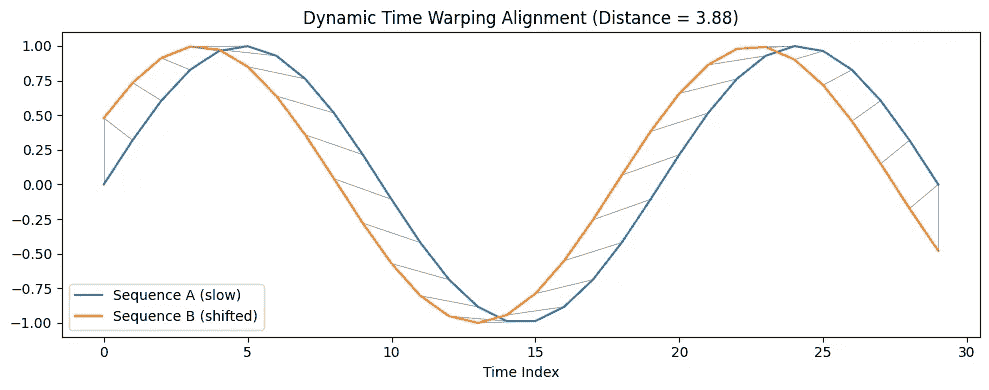

动态时间规整应用于两个时间序列的应用说明（图片由作者提供）

`fastdtw`（或任何 DTW 算法）返回的路径是一系列索引对`(i, j)`，这些索引对代表两个时间序列之间的最佳对齐。每一对表示元素`A[i]`与`B[j]`相匹配。通过计算所有这些匹配对的距离之和，算法计算出**优化累积成本**——将一个序列规整到另一个序列所需的最小总距离。

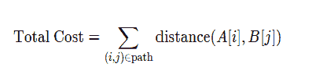

### 修改后的动态时间规整

将**动态时间规整（DTW）**应用于**饮食数据**（与正弦波或固定长度序列等简单示例相比）的关键挑战在于现实世界饮食习惯的**复杂性和可变性**。文中针对每个挑战提出的解决方案如下：

1.  不规则时间步长：MDTW 通过在距离函数中明确包含时间差异来解决这个问题。

1.  多维营养素：MDTW 支持多维向量来表示卡路里、脂肪等营养素，并使用权重矩阵来处理不同的单位和营养素的重要性，

1.  餐次数量不等：MDTW 允许**匹配空饮食事件**，适当地惩罚跳过的或未匹配的餐次。

1.  时间敏感性：MDTW 包括**时间差异惩罚**，即使营养素相似，也会对时间上相隔较远的饮食事件进行加权。

#### 饮食场合数据表示

根据文中提出的修改后的动态时间规整[1]，每个人的饮食可以被视为一系列**饮食事件**，其中每个事件具有：

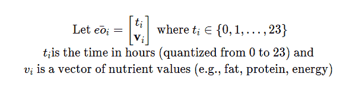

为了说明饮食记录在真实数据中的表现，我创建了仅考虑卡路里摄入量的**三个合成饮食档案**——**Skipper**、**Night Eater**和**Snacker**。假设我们从 API 以这种格式获取原始数据：

```py
skipper={
    'person_id': 'skipper_1',
    'records': [
        {'time': 12, 'nutrients': [300]},  # Skipped breakfast, large lunch
        {'time': 19, 'nutrients': [600]},  # Large dinner
    ]
}
night_eater={
    'person_id': 'night_eater_1',
    'records': [
        {'time': 9, 'nutrients': [150]},   # Light breakfast
        {'time': 14, 'nutrients': [250]},  # Small lunch
        {'time': 22, 'nutrients': [700]},  # Large late dinner
    ]
}
snacker=  {
    'person_id': 'snacker_1',
    'records': [
        {'time': 8, 'nutrients': [100]},   # Light morning snack
        {'time': 11, 'nutrients': [150]},  # Late morning snack
        {'time': 14, 'nutrients': [200]},  # Afternoon snack
        {'time': 17, 'nutrients': [100]},  # Early evening snack
        {'time': 21, 'nutrients': [200]},  # Night snack
    ]
}
raw_data = [skipper, night_eater, snacker]
```

如文中建议，营养值应通过总卡路里摄入量进行归一化。

```py
import numpy as np
import matplotlib.pyplot as plt
def create_time_series_plot(data,save_path=None):
    plt.figure(figsize=(10, 5))
    for person,record in data.items():
        #in case the nutrient vector has more than one dimension
        data=[[time, float(np.mean(np.array(value)))] for time,value in record.items()]

        time = [item[0] for item in data]
        nutrient_values = [item[1] for item in data]
        # Plot the time series
        plt.plot(time, nutrient_values, label=person, marker='o')

    plt.title('Time Series Plot for Nutrient Data')
    plt.xlabel('Time')
    plt.ylabel('Normalized Nutrient Value')
    plt.legend()
    plt.grid(True)
    if save_path:
        plt.savefig(save_path)

def prepare_person(person):

    # Check if all nutrients have same length
    nutrients_lengths = [len(record['nutrients']) for record in person["records"]]

    if len(set(nutrients_lengths)) != 1:
        raise ValueError(f"Inconsistent nutrient vector lengths for person {person['person_id']}.")

    sorted_records = sorted(person["records"], key=lambda x: x['time'])

    nutrients = np.stack([np.array(record['nutrients']) for record in sorted_records])
    total_nutrients = np.sum(nutrients, axis=0)

    # Check to avoid division by zero
    if np.any(total_nutrients == 0):
        raise ValueError(f"Zero total nutrients for person {person['person_id']}.")

    normalized_nutrients = nutrients / total_nutrients

    # Return a dictionary {time: [normalized nutrients]}
    person_dict = {
        record['time']: normalized_nutrients[i].tolist()
        for i, record in enumerate(sorted_records)
    }

    return person_dict
prepared_data = {person['person_id']: prepare_person(person) for person in raw_data}
create_time_series_plot(prepared_data)
```

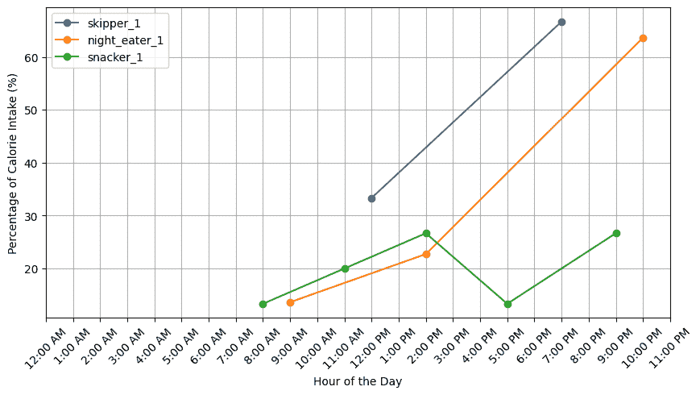

三种不同饮食档案的饮食场合图（图片由作者提供）

#### 计算成对距离

个体对之间的距离度量计算在以下公式中定义。第一项代表营养向量的欧几里得距离，而第二项考虑了时间惩罚。

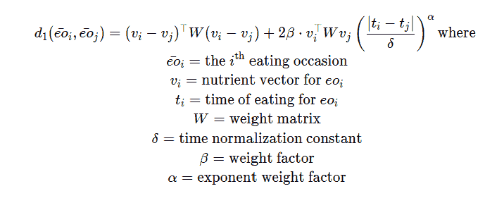

这个公式在`local_distance`函数中实现，并使用建议的值：

```py
import numpy as np

def local_distance(eo_i, eo_j,delta=23, beta=1, alpha=2):
    """
    Calculate the local distance between two events.
    Args:
        eo_i (tuple): Event i (time, nutrients).
        eo_j (tuple): Event j (time, nutrients).
        delta (float): Time scaling factor.
        beta (float): Weighting factor for time difference.
        alpha (float): Exponent for time difference scaling.
    Returns:
        float: Local distance.
    """
    ti, vi = eo_i
    tj, vj = eo_j

    vi = np.array(vi)
    vj = np.array(vj)

    if vi.shape != vj.shape:
        raise ValueError("Mismatch in feature dimensions.")
    if np.any(vi < 0) or np.any(vj < 0):
        raise ValueError("Nutrient values must be non-negative.")
    if np.any(vi>1 ) or np.any(vj>1):
        raise ValueError("Nutrient values must be in the range [0, 1].")   
    W = np.eye(len(vi))  # Assume W = identity for now
    value_diff = (vi - vj).T @ W @ (vi - vj) 
    time_diff = (np.abs(ti - tj) / delta) ** alpha
    scale = 2 * beta * (vi.T @ W @ vj)
    distance = value_diff + scale * time_diff

    return distance
```

我们为每个被比较的个体对构建一个局部距离矩阵*deo*(*i*,*j*)。这个矩阵的行数和列数对应于每个个体的饮食次数。

一旦构建了局部距离矩阵 deo(i,j)——捕捉两个个体所有饮食事件之间的成对距离——下一步是计算**全局成本矩阵**dER(i,j)。这个矩阵通过考虑每个步骤的三个可能的转换来累积最小对齐成本：匹配两个饮食事件，在第一个记录中跳过一个事件（对齐到空），或在第二个记录中跳过一个事件。

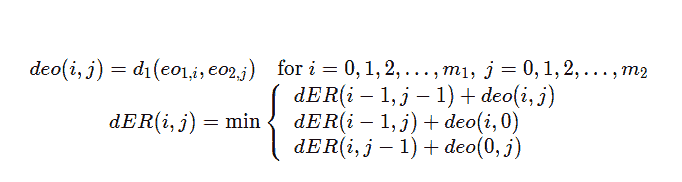

为了计算饮食事件序列之间的**整体距离**，我们构建：

使用`local_distance`填充的**局部距离矩阵**`deo`。

+   使用动态规划构建**全局成本矩阵**`dER`，最小化：

+   匹配

+   在第一个序列中跳过（与空对齐）

+   在第二个序列中跳过

这些直接实现了递归：

```py
import numpy as np

def mdtw_distance(ER1, ER2, delta=23, beta=1, alpha=2):
    """
    Calculate the modified DTW distance between two sequences of events.
    Args:
        ER1 (list): First sequence of events (time, nutrients).
        ER2 (list): Second sequence of events (time, nutrients).
        delta (float): Time scaling factor.
        beta (float): Weighting factor for time difference.
        alpha (float): Exponent for time difference scaling.

    Returns:
        float: Modified DTW distance.
    """
    m1 = len(ER1)
    m2 = len(ER2)

    # Local distance matrix including matching with empty
    deo = np.zeros((m1 + 1, m2 + 1))

    for i in range(m1 + 1):
        for j in range(m2 + 1):
            if i == 0 and j == 0:
                deo[i, j] = 0
            elif i == 0:
                tj, vj = ER2[j-1]
                deo[i, j] = np.dot(vj, vj)  
            elif j == 0:
                ti, vi = ER1[i-1]
                deo[i, j] = np.dot(vi, vi)
            else:
                deo[i, j]=local_distance(ER1[i-1], ER2[j-1], delta, beta, alpha)

    # # Global cost matrix
    dER = np.zeros((m1 + 1, m2 + 1))
    dER[0, 0] = 0

    for i in range(1, m1 + 1):
        dER[i, 0] = dER[i-1, 0] + deo[i, 0]
    for j in range(1, m2 + 1):
        dER[0, j] = dER[0, j-1] + deo[0, j]

    for i in range(1, m1 + 1):
        for j in range(1, m2 + 1):
            dER[i, j] = min(
                dER[i-1, j-1] + deo[i, j],   # Match i and j
                dER[i-1, j] + deo[i, 0],     # Match i to empty
                dER[i, j-1] + deo[0, j]      # Match j to empty
            )

    return dER[m1, m2]  # Return the final cost

ERA = list(prepared_data['skipper_1'].items())
ERB = list(prepared_data['night_eater_1'].items())
distance = mdtw_distance(ERA, ERB)
print(f"Distance between skipper_1 and night_eater_1: {distance}")
```

#### 从成对比较到距离矩阵

一旦我们定义了如何使用 MDTW 计算两个人群饮食习惯之间的距离，下一步自然就是计算整个数据集的距离。为此，我们构建一个距离矩阵，其中每个条目（i,j）代表个人 i 和个人 j 之间的 MDTW 距离。

这在下面的函数中实现：

```py
import numpy as np

def calculate_distance_matrix(prepared_data):
    """
    Calculate the distance matrix for the prepared data.

    Args:
        prepared_data (dict): Dictionary containing prepared data for each person.

    Returns:
        np.ndarray: Distance matrix.
    """
    n = len(prepared_data)
    distance_matrix = np.zeros((n, n))

    # Compute pairwise distances
    for i, (id1, records1) in enumerate(prepared_data.items()):
        for j, (id2, records2) in enumerate(prepared_data.items()):
            if i < j:  # Only upper triangle
                print(f"Calculating distance between {id1} and {id2}")
                ER1 = list(records1.items())
                ER2 = list(records2.items())

                distance_matrix[i, j] = mdtw_distance(ER1, ER2)
                distance_matrix[j, i] = distance_matrix[i, j]  # Symmetric matrix

    return distance_matrix
def plot_heatmap(matrix,people_ids,save_path=None):
    """
    Plot a heatmap of the distance matrix.  
    Args:
        matrix (np.ndarray): The distance matrix.
        title (str): The title of the plot.
        save_path (str): Path to save the plot. If None, the plot will not be saved.
    """
    plt.figure(figsize=(8, 6))
    plt.imshow(matrix, cmap='hot', interpolation='nearest')
    plt.colorbar()

    plt.xticks(ticks=range(len(matrix)), labels=people_ids)
    plt.yticks(ticks=range(len(matrix)), labels=people_ids)
    plt.xticks(rotation=45)
    plt.yticks(rotation=45)
    if save_path:
        plt.savefig(save_path)
    plt.title('Distance Matrix Heatmap')

distance_matrix = calculate_distance_matrix(prepared_data)
plot_heatmap(distance_matrix, list(prepared_data.keys()), save_path='distance_matrix.png')
```

在计算成对修改后的动态时间规整（MDTW）距离后，我们可以使用热图来**可视化个体饮食习惯之间的相似性和差异性**。矩阵中的每个单元格（i,j）代表个人 i 和个人 j 之间的 MDTW 距离——较低的值表示更相似的饮食习惯时间轮廓。

这个热图提供了一个**紧凑且可解释的饮食差异视图**，使得识别相似饮食习惯的集群更容易。

这表明`skipper_1`与`night_eater_1`的相似性比与`snacker_1`的相似性更高。原因是跳餐者和夜食者都有**更少、更大份的餐食集中在一天的较晚时间**，而零食者则在整个时间线上更均匀地分配较小的餐食。

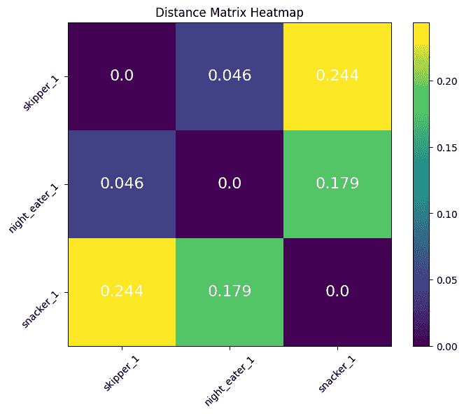

距离矩阵热图（图片由作者提供）

### **聚类时间饮食习惯**

在使用修改后的动态时间规整（MDTW）计算成对距离后，我们得到了一个反映每个个体的饮食习惯与其他个体差异性的距离矩阵。但这个矩阵本身并不能一目了然地告诉我们太多——为了揭示数据中的结构，我们需要再进一步。

在应用任何聚类算法之前，我们首先需要一个反映现实饮食习惯的数据集。由于访问大规模饮食习惯摄入数据集可能受限或受到使用限制，我生成了模拟多样化日常模式的合成饮食习惯记录。每条记录代表一个人在 24 小时周期中特定时间点的卡路里摄入量。

```py
import numpy as np

def generate_synthetic_data(num_people=5, min_meals=1, max_meals=5,min_calories=200,max_calories=800):
    """
    Generate synthetic data for a given number of people.
    Args:
        num_people (int): Number of people to generate data for.
        min_meals (int): Minimum number of meals per person.
        max_meals (int): Maximum number of meals per person.
        min_calories (int): Minimum calories per meal.
        max_calories (int): Maximum calories per meal.
    Returns:
        list: List of dictionaries containing synthetic data for each person.
    """
    data = []
    np.random.seed(42)  # For reproducibility
    for person_id in range(1, num_people + 1):
        num_meals = np.random.randint(min_meals, max_meals + 1)  # random number of meals between min and max
        meal_times = np.sort(np.random.choice(range(24), num_meals, replace=False))  # random times sorted

        raw_calories = np.random.randint(min_calories, max_calories, size=num_meals)  # random calories between min and max

        person_record = {
            'person_id': f'person_{person_id}',
            'records': [
                {'time': float(time), 'nutrients': [float(cal)]} for time, cal in zip(meal_times, raw_calories)
            ]
        }

        data.append(person_record)
    return data

raw_data=generate_synthetic_data(num_people=1000, min_meals=1, max_meals=5,min_calories=200,max_calories=800)
prepared_data = {person['person_id']: prepare_person(person) for person in raw_data}
distance_matrix = calculate_distance_matrix(prepared_data)
```

#### 选择最佳聚类数量

为了确定分组饮食习惯的适当聚类数量，我评估了两种流行的方法：**肘部方法**和**轮廓分数**。

+   **肘部方法**分析随着聚类数量增加的聚类成本（惯性）。如图所示，成本在 **4 个聚类**之前急剧下降，之后改进的速率显著放缓。这个“肘部”表明超过 4 个聚类后回报递减。

+   **轮廓分数**，它衡量每个对象在其聚类中的位置，在 **4 个聚类**（≈0.50）时显示出相对较高的分数，即使它不是绝对的最高点。

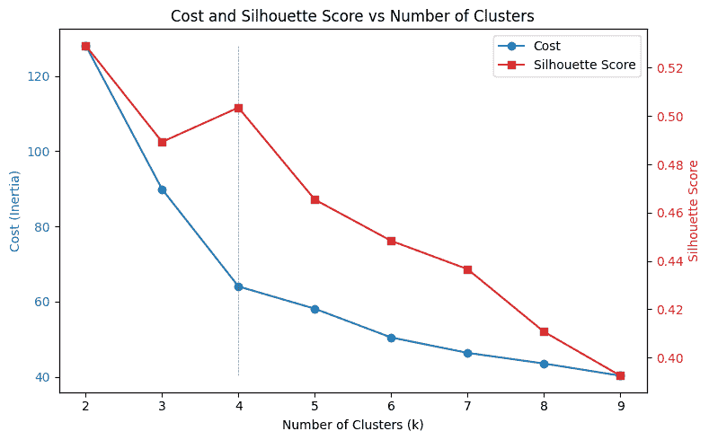

最佳聚类数量（图片由作者提供）

以下代码计算了不同 *k* 值（聚类数量）的聚类成本和轮廓分数，使用的是 **K-Medoids** 算法和由 MDTW 度量得出的预计算距离矩阵：

```py
from sklearn.metrics import silhouette_score
from sklearn_extra.cluster import KMedoids
import matplotlib.pyplot as plt

costs = []
silhouette_scores = []
for k in range(2, 10):
    model = KMedoids(n_clusters=k, metric='precomputed', random_state=42)
    labels = model.fit_predict(distance_matrix)
    costs.append(model.inertia_)
    score = silhouette_score(distance_matrix, model.labels_, metric='precomputed')
    silhouette_scores.append(score)

# Plot
ks = list(range(2, 10))
fig, ax1 = plt.subplots(figsize=(8, 5))

color1 = 'tab:blue'
ax1.set_xlabel('Number of Clusters (k)')
ax1.set_ylabel('Cost (Inertia)', color=color1)
ax1.plot(ks, costs, marker='o', color=color1, label='Cost')
ax1.tick_params(axis='y', labelcolor=color1)

# Create a second y-axis that shares the same x-axis
ax2 = ax1.twinx()
color2 = 'tab:red'
ax2.set_ylabel('Silhouette Score', color=color2)
ax2.plot(ks, silhouette_scores, marker='s', color=color2, label='Silhouette Score')
ax2.tick_params(axis='y', labelcolor=color2)

# Optional: combine legends
lines1, labels1 = ax1.get_legend_handles_labels()
lines2, labels2 = ax2.get_legend_handles_labels()
ax1.legend(lines1 + lines2, labels1 + labels2, loc='upper right')
ax1.vlines(x=4, ymin=min(costs), ymax=max(costs), color='gray', linestyle='--', linewidth=0.5)

plt.title('Cost and Silhouette Score vs Number of Clusters')
plt.tight_layout()
plt.savefig('clustering_metrics_comparison.png')
plt.show()
```

#### 解释聚类饮食习惯

一旦确定了最佳聚类数量（**k=4**），数据集中的每个个体都会被分配到这些聚类中的一个，使用的是 K-Medoids 模型。现在，我们需要了解每个聚类的特征。

为了做到这一点，我遵循了原始 MDTW 论文 [1] 中建议的方法：分析每个个体的**最大饮食习惯**，这由发生的**时间**和它所代表的**日总摄入量分数**共同定义。这提供了关于人们何时摄入最多卡路里以及在那个峰值场合摄入了多少卡路里的见解。

```py
# Kmedoids clustering with the optimal number of clusters
from sklearn_extra.cluster import KMedoids
import seaborn as sns
import pandas as pd

k=4
model = KMedoids(n_clusters=k, metric='precomputed', random_state=42)
labels = model.fit_predict(distance_matrix)

# Find the time and fraction of their largest eating occasion
def get_largest_event(record):
    total = sum(v[0] for v in record.values())
    largest_time, largest_value = max(record.items(), key=lambda x: x[1][0])
    fractional_value = largest_value[0] / total if total > 0 else 0
    return largest_time, fractional_value

# Create a largest meal data per cluster
data_per_cluster = {i: [] for i in range(k)}
for i, person_id in enumerate(prepared_data.keys()):
    cluster_id = labels[i]
    t, v = get_largest_event(prepared_data[person_id])
    data_per_cluster[cluster_id].append((t, v))

import seaborn as sns
import matplotlib.pyplot as plt
import pandas as pd

# Convert to pandas DataFrame
rows = []
for cluster_id, values in data_per_cluster.items():
    for hour, fraction in values:
        rows.append({"Hour": hour, "Fraction": fraction, "Cluster": f"Cluster {cluster_id}"})
df = pd.DataFrame(rows)
plt.figure(figsize=(10, 6))
sns.scatterplot(data=df, x="Hour", y="Fraction", hue="Cluster", palette="tab10")
plt.title("Eating Events Across Clusters")
plt.xlabel("Hour of Day")
plt.ylabel("Fraction of Daily Intake (largest meal)")
plt.grid(True)
plt.tight_layout()
plt.show()
```

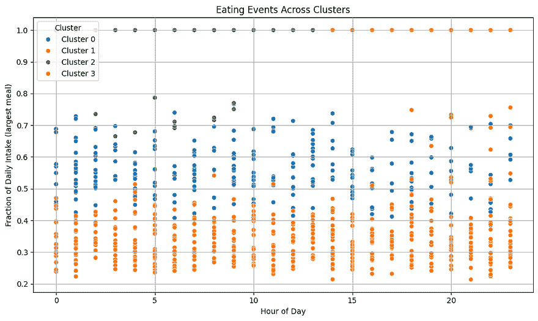

每个点代表一个人的最大饮食习惯事件（图片由作者提供）

**虽然散点图提供了广泛的概述，但通过检查它们的联合分布，可以更详细地了解每个聚类的饮食习惯。**

通过绘制最大餐食的每小时摄入量和日摄入量分数的联合直方图，我们可以使用以下代码识别特征模式：

```py
# Plot each cluster using seaborn.jointplot
for cluster_label in df['Cluster'].unique():
    cluster_data = df[df['Cluster'] == cluster_label]
    g = sns.jointplot(
        data=cluster_data,
        x="Hour",
        y="Fraction",
        kind="scatter",
        height=6,
        color=sns.color_palette("deep")[int(cluster_label.split()[-1])]
    )
    g.fig.suptitle(cluster_label, fontsize=14)
    g.set_axis_labels("Hour of Day", "Fraction of Daily Intake (largest meal)", fontsize=12)
    g.fig.tight_layout()
    g.fig.subplots_adjust(top=0.95)  # adjust title spacing
    plt.show()
```

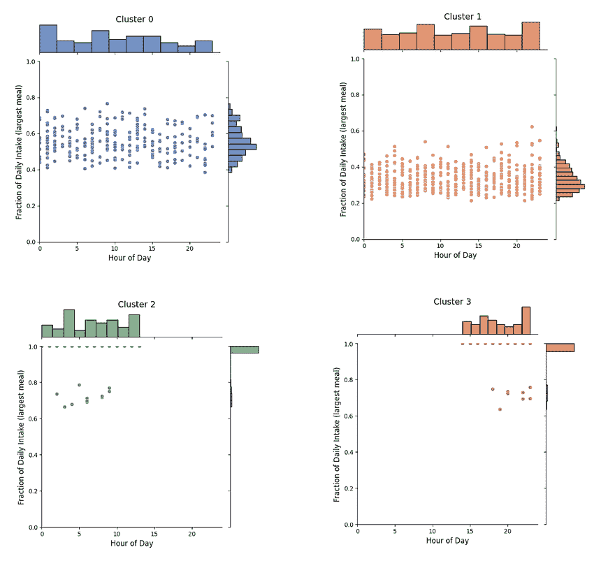

每个子图代表簇内个体时间（x 轴）和分数热量摄入（y 轴）的联合分布。较高的密度表示最大餐食的常见时间和分量。（图片由作者提供）

为了理解个体在各个簇中的分布情况，我可视化了分配给每个簇的人数。下面的条形图显示了按其时间饮食模式分组的人的频率。这有助于评估某些饮食习惯——例如跳过餐食、深夜进食或频繁小吃——在人群中的普遍程度。

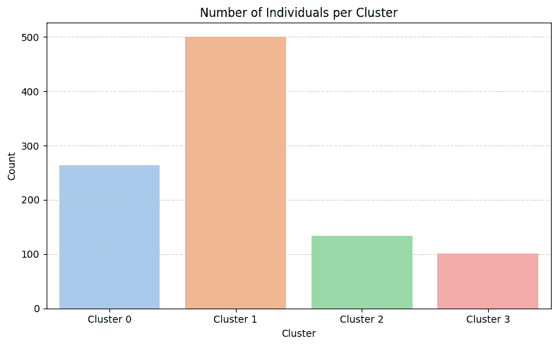

展示分配给每个饮食模式簇的人数直方图（图片由作者提供）

**基于联合分布图**，各个簇中出现了不同的时间饮食行为：

**簇 0**（灵活或不规律的进食者）揭示了最大的进食场合在**24 小时一天**和**日热量摄入的分数**上的**广泛分散**。

**簇 1**（频繁少量进食者）显示了一种**更均匀的饮食模式**，其中没有单一的进食场合超过**总日摄入量的 30%**，反映了整天频繁但分量较小的餐食。这个簇很可能是代表**“正常进食者”**的簇——那些在一天中分散摄入三个相对平衡的餐食的人。这是因为进食时间和每次进食的分数变化很小。

**簇 2**（早间大量进食者）具有一个非常**独特且一致的模式**：该组个体几乎在一天中的单次餐食中摄入了他们几乎全部的日热量摄入（接近 100%），主要在**一天早些时候（午夜到中午）**。

**簇 3**（夜间大量进食者）的特点是个人在**傍晚或夜间（下午 6 点至午夜）**的单次餐食中摄入了他们几乎全部的日热量。与簇 2 一样，这个群体表现出**单峰进食模式**和**非常高的分数摄入（约 1.0）**，表明大多数成员每天**只吃一次**，但与簇 2 不同，他们的进食窗口显著延迟。

### 结论

在这个项目中，我探讨了**修改后的动态时间规整（MDTW）**如何帮助揭示时间饮食模式——不仅关注我们吃什么，还关注**何时**和**多少**。使用**合成数据**来模拟真实的饮食习惯，我展示了 MDTW 如何根据餐食的时间和强度将个体聚类成不同的轮廓，如不规律或灵活的进食者、频繁少量进食者、早间大量进食者和夜间进食者。

虽然结果表明 MDTW 与**K-Medoids**结合可以揭示饮食习惯中的有意义模式，但这种方法并非没有挑战。由于数据集是合成的，聚类基于单次初始化，有几个注意事项值得注意：

+   簇看起来很杂乱，可能是因为合成数据缺乏强大、自然可分离的模式——尤其是如果用餐时间和卡路里分布过于均匀的话。

+   一些簇重叠得很严重，尤其是**簇 0**和**簇 1**，这使得区分真正不同的行为变得更加困难。

+   没有标记数据或预期的真实情况，评估簇的质量是困难的。一个可能的改进是将已知模式注入数据集中，以测试聚类算法是否能够可靠地恢复它们。

尽管有这些限制，这项工作展示了如何通过一个细致的距离度量——专为不规则、现实生活中的模式设计——来揭示传统工具可能忽视的见解。该方法可以扩展到**个性化健康监测**，或任何**何时发生**与**发生了什么**同样重要的领域。

我很乐意听听您对这个项目的看法——无论是反馈、问题，还是关于 MDTW 未来可能应用的点子。这确实是一个正在进行中的工作，我总是很兴奋地从他人那里学习。

如果您觉得这个有用，有改进的想法，或者想要合作，请随意在 GitHub 上打开一个问题或发送一个 Pull Request。贡献总是受欢迎的！

非常感谢您一直看到最后——这真的意义重大。

GitHub 上的代码：[`github.com/YagmurGULEC/mdtw-time-series-clustering`](https://github.com/YagmurGULEC/mdtw-time-series-clustering)

### 参考文献

[1] Khanna, Nitin, et al. “Modified dynamic time warping (MDTW) for estimating temporal dietary patterns.” *2017 IEEE Global Conference on Signal and Information Processing (GlobalSIP)*. IEEE, 2017.
