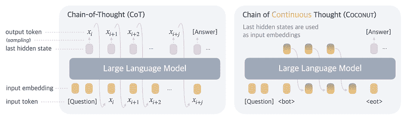
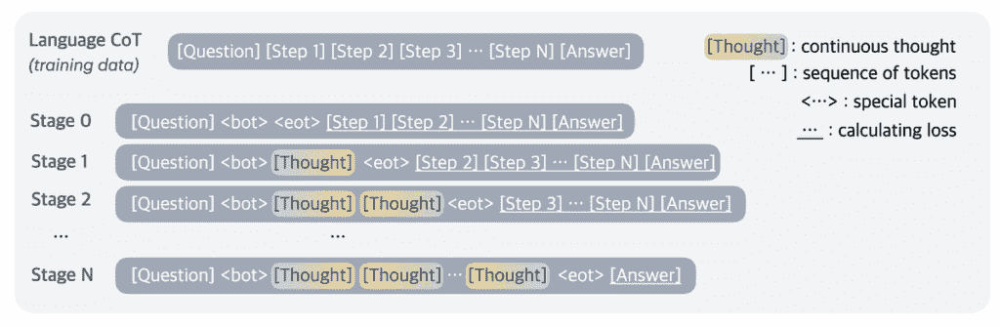
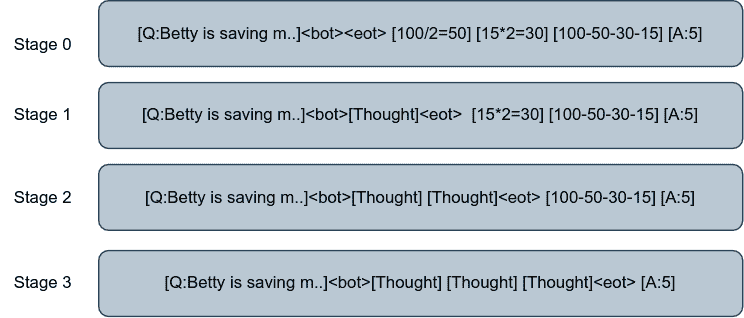
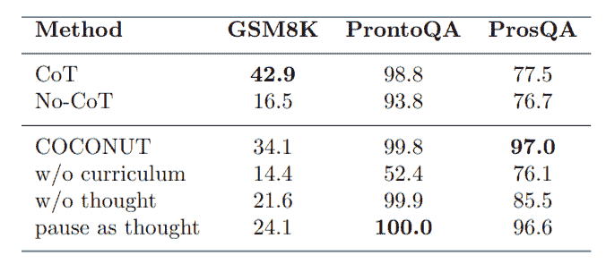
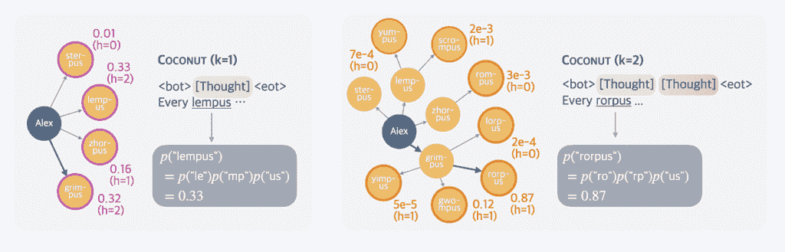

# Coconut：LLM 中潜在推理的框架

> 原文：[`towardsdatascience.com/coconut-a-framework-for-latent-reasoning-in-llms/`](https://towardsdatascience.com/coconut-a-framework-for-latent-reasoning-in-llms/)
> 
> 论文链接：[`arxiv.org/abs/2412.06769`](https://arxiv.org/abs/2412.06769)
> 
> 发布日期：2024 年 12 月 9 日

**图 1**. Coconut 的两种推理模式。在**语言模式**（左）中，模型使用输出文本标记作为下一个推理步骤的输入。在**潜在模式**（右）中，模型将其先前的隐藏状态（最后隐藏层的输出）作为输入反馈给自己。图来自[1]

<mdspan datatext="el1755021152317" class="mdspan-comment">最近，对具有推理能力的 LLM 的关注度很高，这是有充分理由的。推理增强了 LLM 解决复杂问题的能力，促进了更强的泛化，并引入了一个可解释的层，揭示了模型内部思维过程的光芒。

在 LLM 推理中的一个重要里程碑是引入了思维链推理（CoT）[2]，这证明了引导模型逐步推理可以显著提高算术和符号推理任务的表现。

尽管推理模型具有强大的功能，但它们仍然主要在自然语言的框架内运作，这可能会限制它们的有效性。大部分的标记空间都用于保持语言连贯性，而不是促进抽象推理。为了解决这一限制，Meta 发布的一篇引人入胜的论文**《在连续潜在空间中训练大型语言模型进行推理[1]**)*，提出将思维链完全从自然语言中提取出来，仅在必要时才翻译回语言。

他们的贡献可以总结为三个关键点：

1.  **连续思维链（Coconut）**：一个基于 CoT 的增强推理范式。它不是依赖于最终的文本输出，而是利用模型的最后一个嵌入层潜在表示。

1.  探索 Coconut 的能力：表明如何在潜在空间中同时编码推理的多个后续步骤。

1.  对潜在推理过程本身的更深入分析，以便我们理解 Coconut 对信息的内部表示。

* * *

## Coconut，简化版

在深入探讨连续思维链的实现细节之前，首先建立一些基础概念是很重要的。

给定一个输入序列**x = [x(1),x(2),x(3) ... x(T)]**，一个思维链 LLM**（M**），它根据先前标记的序列**x(≤t)**预测下一个标记**x(t+1)**，可以形式化地描述为：

$$M_{CoT}(x_{t+1}|x<=t) = softmax(Wx_{t})$$

其中**W**是我们 LLM 的权重矩阵，**x(t)**是步骤**t**的输入标记。

Coconut 通过移除对文本输入标记的依赖，并使用模型的最后一个隐藏状态**h(t)**作为输入来扩展这个公式。这种调整将 LLM 的预测函数修改为：

$$M_{Coconut}(x_{t+1}|x<=t) = softmax(Wh_{t})$$

$$H_{t} = Transformer(E_{t})$$

其中**E(t) = [e(x1), e(x2), … e(xt)]**代表标记嵌入的序列，**e(⋅)**表示嵌入函数。**H(t)​**捕捉了所有标记直到位置**t**的隐藏状态序列。

这种新的公式允许 Coconut 以两种不同的模式运行：**语言模式**和**潜在模式**，如图 1（左和右分别所示）。在语言模式下，模型像一个标准的 LLM 一样，处理文本标记作为输入，而在潜在模式下，它操作于内部隐藏状态。

模式切换在 Coconut 的训练过程中起着关键作用。它不仅使模型能够学习如何生成有意义的潜在表示，还促进了这些潜在思维的解码。模式转换使用两个特殊的占位符标记进行控制：`<bot>`（思维开始）和`<eot>`（思维结束）。在位置*i*插入`<bot>`，在位置*j*插入`<eot>`，信号模型在位置 i<t<j 之间的标记上以潜在模式运行（注意这里 e(xi) =`<bot>`，e(xj)= `<eot>`）。

$$E_{t}=[e_{x_{1}},e_{x_{2}},….,e_{x_{i}},h_{i},h_{i+1},..,h_{j-1},e_{x_{j}},e_{x_{j+1}},…,e_{x_{t}}]$$

**图 2**. Coconut 的训练过程，其中在每个训练阶段，移除一个语言推理步骤，并用 c 个潜在推理步骤替换。在这里，c 等于 1。图来自[1]。

受[3]的启发，Coconut 采用多阶段训练课程。在每个阶段 k，用 k 个基于语言的推理步骤替换 L 个潜在步骤，其中 L=k⋅c，c 是一个超参数，决定了多少个潜在步骤可以替代一个语言推理步骤。这种进展在图 2 中得到了可视化，其中在阶段 k=0，模型完全基于标准的 CoT 例子进行训练。

作者决定采用多阶段训练的决定是将训练过程分解成更易实现的目标，从而获得更好的结果。这种模式在[3]中已经提出并得到证实，他们证明了中间移除标记可以促进推理的更深入内化。

使用潜在思维可以通过替换推理步骤之间的标记级转换与连续的隐藏表示来实现端到端基于梯度的训练，因为这种变化使得网络完全可微分。除此之外，它还允许模型同时编码多个可能的下一步，随着推理路径的推进进行细化。关于这一机制的更深入探讨可以在*理解潜在推理*部分找到。

为了说明，让我们考察一个来自 GSM8K[4]的简单例子，这是用于训练 Coconut 的数据集之一。

> **问题**：
> 
> “贝蒂正在为一个新的钱包存钱，这个钱包需要 100 美元。贝蒂只有她需要的钱的一半。她的父母决定给她 15 美元用于这个目的，而她的祖父母给她的钱是父母的两倍。贝蒂还需要多少钱才能买到这个钱包？”
> 
> **推理步骤**：
> 
> 1. 贝蒂只有 100 / 2 = $<<100/2=50>>50。
> 
> 2. 贝蒂的祖父母给了她 15 * 2 = $<<15*2=30>>30 美元。
> 
> 3. 这意味着，贝蒂还需要 100–50–30–15 = $<<100–50–30–15=5>>5 美元。
> 
> 4. 答案：5

这个问题随后被纳入训练数据集，并在三个不同的阶段中使用：

**图 3**. Coconut 训练过程的示例。图由作者根据 GSM8k[4] 中的示例绘制。

如图 3 所示，在阶段 0，没有潜在思维，只有基于语言的推理步骤，随后是最终答案。在随后的阶段 1 和 2，一个语言推理步骤逐渐被一个潜在思维（由于 c=1）所取代，直到阶段 3，所有推理步骤都是潜在的。此过程应用于数据集中的每个训练示例。

* * *

## 关键发现与分析

三组数据集被用来评估 Coconut 的有效性。其中一组专注于数学推理（**GSM8K[4]**），另外两组则专注于逻辑推理：**ProntoQA[5]** 和 **ProsQA**。**ProsQA**（带有搜索的证明问答）是 ProntoQA 的一个修改版本，它具有随机生成的推理步骤的有向无环图（DAGs），旨在通过更复杂的规划任务挑战模型。所有模型都使用 GPT-2 作为基础模型进行微调，对于大多数数据集，c=1，除了 GSM8K，其中使用了两个潜在思维（c=2）。

下面是论文中报告的结果的简化总结：

**表 1**. 在三个数据集上的准确率结果。结果来自 [1]。

用于与 Coconut 架构进行比较的模型是：

+   **CoT**: 在训练中使用思维链推理的模型，在训练期间利用完整的推理链。

+   **无-CoT**: 没有任何推理链的模型进行训练；标准的语言建模，没有中间推理步骤。

+   **Coconut**: 本论文中提出的完整实现。

+   **无课程表**: Coconut 模型在无多阶段课程表的情况下进行训练；即没有逐步引入潜在思维。

+   **无思维**: 保留了多阶段训练的 Coconut，但没有引入潜在思维。语言推理步骤简单地分阶段移除。

+   **暂停思考[6]**：完全无潜在思维训练的模型，但在每个移除的思维位置插入特殊的 <暂停> 标记。这些标记允许模型在生成答案之前进行额外的计算步骤。先前的研究[7]报告了使用这种方法提高了性能。

仔细检查前表揭示了 Coconut 训练范式中的三个关键见解。

**首先**，潜在推理在逻辑推理任务上表现出比思维链更优越的性能，在基准测试如 ProntoQA[5] 和 ProsQA 上超过了思维链。在 ProsQA 中观察到的显著准确率提升（97.0% 对 77.5%）突出了 Coconut 在处理更复杂的推理挑战方面的有效性。不幸的是，作者没有解释 CoT 和 Coconut 之间准确率损失的原因（42.9% 对 34.9%）。这可能是因为 GSM8k 的数学性质，与 ProsQA 不同，它需要较少的推理能力。

**其次**，将 Coconut 与其非多阶段训练的对应版本进行比较，我们得到了与 [3] 中提出的相同发现：将训练过程分解成更简单、更易管理的任务可以显著提高模型性能。此外，通过比较“无课程”与“无思维”实现，很明显，逐步多阶段训练的效果实际上比单步替换语言步骤为潜在思维更为突出。这是一个有趣的发现，表明逐步训练对最终结果是多么关键。

**最后**，即使给模型提供多阶段训练和足够的计算能力，以及带有“暂停思考”模型的训练，与主要的 Coconut 实现相比，LLM 仍然有所不足。这一点在比较他们的 GSM8K 结果时更为明显，这强化了引入潜在思维仍然可以提升训练有效性的假设。

* * *

## 理解潜在推理

Coconut 的一个优点是，与基于语言的想法不同，潜在思维有能力在其考虑中考虑几个方向或输出。这导致了一个与正常链式推理不同的推理过程，使我们能够将推理过程解释为假设树搜索。每个深度层是相应潜在步骤 k 的结果，每个节点是特定选项的计算概率。这将在示例 #2 中进一步介绍。

论文中提出了两个这种现象的主要示例。我们将简要介绍这两个示例，以说明这种新思维范式所具有的潜在推理能力。

**示例 #1：**

第一个示例演示了潜在思维如何在推理树中包含多个可能的输出。为了探索这一点，使用 LLM 头解码了模型生成的连续思维，这是一个仅用于测试的过程，使我们能够探测连续思维并验证这些潜在思维是否被正确学习。

**问题**：

James 决定每周进行 3 次冲刺，每次冲刺跑 60 米。他每周跑了多少米？

> **推理步骤：**
> 
> 1. 他每周进行 3*3=9 次冲刺
> 
> 2. 因此他跑了 9*60=540
> 
> 答案：540
> 
> **替代方案：**
> 
> 1. 他每周跑了 3*60=180 米
> 
> 2. 因此他跑了 3*180=540

当我们解码模型生成的第一个潜在思维时，我们发现前三个可能的输出是：

1. “180” 概率为 0.22

2. “180” （带空格）概率为 0.20

3. “90” 概率为 0.13

这表明模型确实在考虑上述两种可行解决方案中的第一步。

**示例 #2：**

第二个示例更清楚地说明了随着思考数量的增加，如何构建树搜索，剪枝不再与推理过程相关的旧分支，并优先考虑更“合理”的节点。

**图 4.** 示例 #2 的潜在搜索树。左侧是解码第一个潜在推理步骤的结果，右侧是第二个潜在步骤的结果。图来自 [1]。

> **问题**：
> 
> “每个 grimpus 都是一个 yimpus。每个 worpus 都是一个 jelpus。每个 zhorpus 都是一个 sterpus。每个 impus 都是一个 hilpus。每个 jompus 都是一个 ...grimpus 是一个 gwompus。每个 rempus 都是一个 gorpus。亚历克斯是一个 sterpus。每个 zhorpus 都是一个 rompus。亚历克斯是 gorpus 还是 bompus？”
> 
> **推理步骤：**
> 
> 1. “亚历克斯是一个 grimpus。”
> 
> 2. “每个 grimpus 都是一个 rorpus。”
> 
> 3. “每个 rorpus 都是一个 bompus。”
> 
> 答案：“亚历克斯是一个笨蛋。”

每个选项的概率可以通过每个标记的概率相乘获得，如图 4 所示。这里我们展示了经过一次潜在思考后的搜索树状态（左侧），以及经过两次（右侧）。

我们可以从总计算概率中看到，在第一步中，最不可能的选项（0.01）是 sterpus，而第二个可能的选项是 grimpus（0.32），这是在这种情况下正确的推理第一步。当搜索树更新为来自第二次思考的信息时，sterpus 的节点被完全忽略，具有最高概率的新节点是 rorpus，这是正确的第二步推理步骤。

这证明了椰子在其推理过程中具有包含各种后续步骤的能力，随着推理的进行，优先考虑更重要的步骤（类似于第一步中的 grimpus），并忽略不那么相关的步骤（第一步中的 sterpus）。这表明椰子能够以树状方式导航多个思考，直到得出最终结论。

* * *

## 结论

在这篇文章中，我们讨论了椰子（Coconut），一种新的推理范式，它将 LLM 从语言空间中“思考”的必要性提升到利用潜在空间。我们讨论了椰子与其他推理方法相比的显著性能，涵盖了多阶段训练的重要性，并举例说明了如何理解潜在推理过程的工作原理。

在我看来，椰子解决了一个有趣的研究课题，激发了对潜在推理方法的新探索，为创建不受语言语法限制的更复杂的机器推理模型铺平了道路。

* * *

#### 参考文献

[1] S. Hao, S. Sukhbaatar, D. Su, X. Li, Z. Hu, J. Weston and Y. Tian, *训练大型语言模型在连续潜在空间中进行推理* (2024), arXiv 预印本 arXiv:2412.06769

[2] J. Wei, X. Wang, D. Schuurmans, M. Bosma, B. Ichter, F. Xia, E. Chi, Q. Le and D. Zhou, *思维链提示在大型语言模型中引发推理* (2022), arXiv 预印本 arXiv:2201.11903

[3] Y. Deng, Y. Choi and S. Shieber, *从显式 CoT 到隐式 CoT：逐步内化 CoT 步骤的学习* (2024), arXiv 预印本 arXiv:2405.14838

[4] K. Cobbe, V. Kosaraju, M. Bavarian, M. Chen, H. Jun, L. Kaiser, M. Plappert, J. Tworek, J. Hilton, R. Nakano, C. Hesse and J. Schulman, *训练验证器解决数学单词问题* (2021), arXiv 预印本 arXiv:2110.14168

[5] A. Saparov and H. He, *语言模型是贪婪的推理者：对思维链的系统形式分析* (2022), arXiv 预印本 arXiv:2210.01240

[6] S. Goyal, Z. Ji, A. S. Rawat, A. K. Menon, S. Kumar and V. Nagarajan, *思考后再说话：使用暂停标记训练语言模型* (2024), arXiv 预印本 arXiv:2310.02226

[7] J. Pfau, W. Merrill and S. R. Bowman, *一点一滴思考：Transformer 语言模型中的隐藏计算* (2024), arXiv 预印本 arXiv:2404.15758
