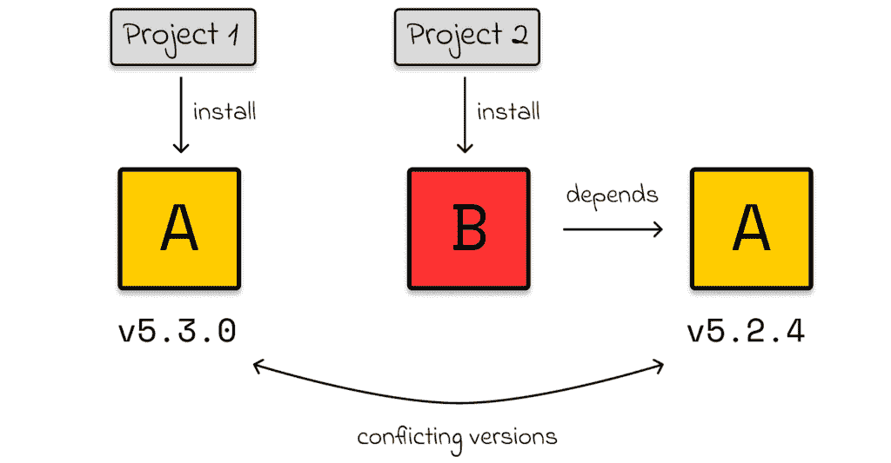
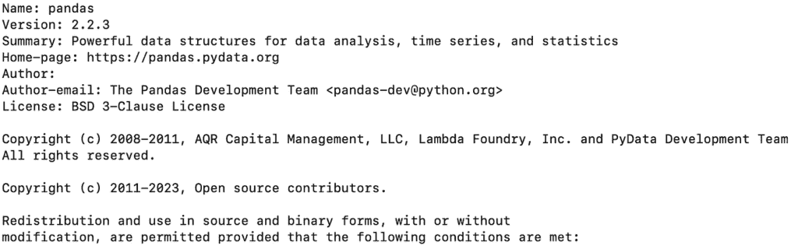

# Python 依赖项管理的全面指南

> 原文：[`towardsdatascience.com/comprehensive-guide-to-dependency-management-in-python/`](https://towardsdatascience.com/comprehensive-guide-to-dependency-management-in-python/)

# 简介

当学习 Python 时，许多初学者只关注语言及其库，而完全忽略了虚拟环境。因此，管理 Python 项目可能会变得混乱：为不同项目安装的依赖项可能存在冲突版本，导致兼容性问题。

即使在我学习 Python 的时候，也没有人强调虚拟环境的重要性，现在我觉得这非常奇怪。它们是隔离不同项目之间的极有用工具。

在这篇文章中，我将解释虚拟环境是如何工作的，提供几个示例，并分享管理它们的有用命令。

## 问题

想象一下，你笔记本电脑上有两个 Python 项目，每个项目位于不同的目录中。你意识到你需要为第一个项目安装库 A 的最新版本。稍后，你切换到第二个项目并尝试安装库 B。

这里的问题是：*库 B 依赖于库 A，但它需要与之前安装的不同版本*。



由于你没有使用任何依赖项管理工具，所有依赖项都全局安装在你的计算机上。由于库 A 的版本不兼容，当你尝试安装库 B 时，你会遇到错误。

## 解决方案

为了防止此类问题，使用虚拟环境。其想法是为每个 Python 项目分配一个单独的存储空间。每个存储空间将以隔离的方式包含特定项目的所有外部下载的依赖项。

更具体地说，如果我们为两个项目（在各自的虚拟环境中）下载相同的库 A，库 A 将被下载两次——一次为每个环境。此外，库的版本可以在环境之间有所不同，因为每个环境都是完全隔离的，并且不与其他环境交互。

现在虚拟环境使用的动机已经清楚，让我们来探讨如何在 Python 中创建它们。

## Python 中的虚拟环境

建议在项目的根目录中创建虚拟环境。在终端中使用以下命令创建环境：

```py
python -m venv <environment_name>
```

按照惯例，*<环境名称>* 通常命名为 **venv**，所以命令变为：

```py
python -m venv venv
```

因此，这个命令创建了一个名为 *venv* 的目录，其中包含虚拟环境本身。甚至可以进入该目录，但在大多数情况下，这并不很有用，因为 *venv* 目录主要包含系统脚本，这些脚本不是直接使用的。

要激活虚拟环境，使用以下命令：

```py
source venv/bin/activate
```

一旦环境被激活，我们就可以为项目安装依赖项。只要 `venv` 被激活，任何安装的依赖项都将仅属于该环境。

要停用虚拟环境，请输入：

```py
deactivate
```

一旦环境被停用，终端将返回其正常状态。例如，你可以切换到另一个项目并在那里激活其环境。

## 依赖管理

### 安装库

在安装任何依赖项之前，建议激活虚拟环境以确保安装的库属于单个项目。这有助于避免全局版本冲突。

在依赖管理中最常用的命令是 pip。与其他替代方案相比，`pip` 更直观且易于使用。

要安装一个库，请输入：

```py
pip install <library_name>
```

> *在下面的示例中，我将用 pandas（最常用的数据分析库）代替 <library_name>。*

因此，例如，如果我们想下载 pandas 的最新版本，我们应该输入：

```py
pip install pandas
```

在某些场景中，我们可能需要安装库的特定版本。`pip` 提供了一种简单的语法来实现这一点：

```py
pip install pandas==2.1.4 # install pandas of version 2.1.4
pip install pandas>=2.1.4 # install pandas of version 2.1.4 or higher
pip install pandas<2.1.4 # install pandas of version less than 2.1.4
pip install pandas>=2.1.2,<2.2.4 # installs the latest version available between 2.1.2 and 2.2.4 
```

### 查看依赖详情

如果你对你已安装的特定依赖项感兴趣，获取更多信息的简单方法是使用 `pip show` 命令：

```py
pip show pandas
```

例如，示例中的命令将输出以下信息：



**pip show** 命令的输出示例

### 删除依赖项

要从虚拟环境中删除依赖项，请使用以下命令：

```py
pip uninstall pandas
```

执行此命令后，将与指定库相关的所有文件将被删除，从而释放磁盘空间。但是，如果你再次运行导入此库的 Python 程序，你将遇到 ImportError。

## 需求文件

在管理依赖项时，创建一个包含项目中所有下载的依赖项及其版本的 `requirements.txt` 文件是一种常见的做法。以下是一个示例：

```py
fastapi==0.115.5
pydantic==2.10.1
PyYAML==6.0.2
requests==2.32.3
scikit-learn==1.5.2
scipy==1.14.1
seaborn==0.13.2
streamlit==1.40.2
torch==2.5.1
torchvision==0.20.1
tornado==6.4.2
tqdm==4.67.1
urllib3==2.2.3
uvicorn==0.32.1
yolo==0.3.2
```

理想情况下，每次你使用 `pip install` 命令时，都应该在 `requirements.txt` 文件中添加相应的行，以跟踪项目中使用的所有库。

然而，如果你忘记了这样做，还有一个替代方案：`pip freeze` 命令会输出项目中所有已安装的依赖项。尽管如此，`pip freeze` 可能相当冗长，通常包括许多其他库的名称，这些库是项目中使用的库的依赖项。

```py
pip freeze > requirements.txt
```

> *因此，将已安装的依赖项及其版本添加到 requirements.txt 文件中是一个好习惯。*

每次克隆 Python 项目时，都期望 Git 仓库中已经存在一个 requirements.txt 文件。要安装此文件中列出的所有依赖项，请使用带有 -r 标志的 `pip install` 命令，后跟 requirements 文件名。

```py
pip install -r requirements.txt
```

> *相反，每次你在 Python 项目上工作时，都应该创建一个 requirements.txt 文件，以便其他协作人员可以轻松安装必要的依赖项。*

## .gitignore

当与版本控制系统一起工作时，虚拟环境绝不应该被推送到 Git！相反，它们必须在 .gitignore 文件中提及。

> *虚拟环境往往非常大，如果存在现有的 requirements.txt 文件，则下载所有必要的依赖项应该没有问题。*

## 结论

在本文中，我们探讨了虚拟环境这一非常重要的概念。通过为不同的项目隔离下载的依赖项，它们使得管理多个 Python 项目变得更加容易。

*除非另有说明，所有图像均为作者所有。*
