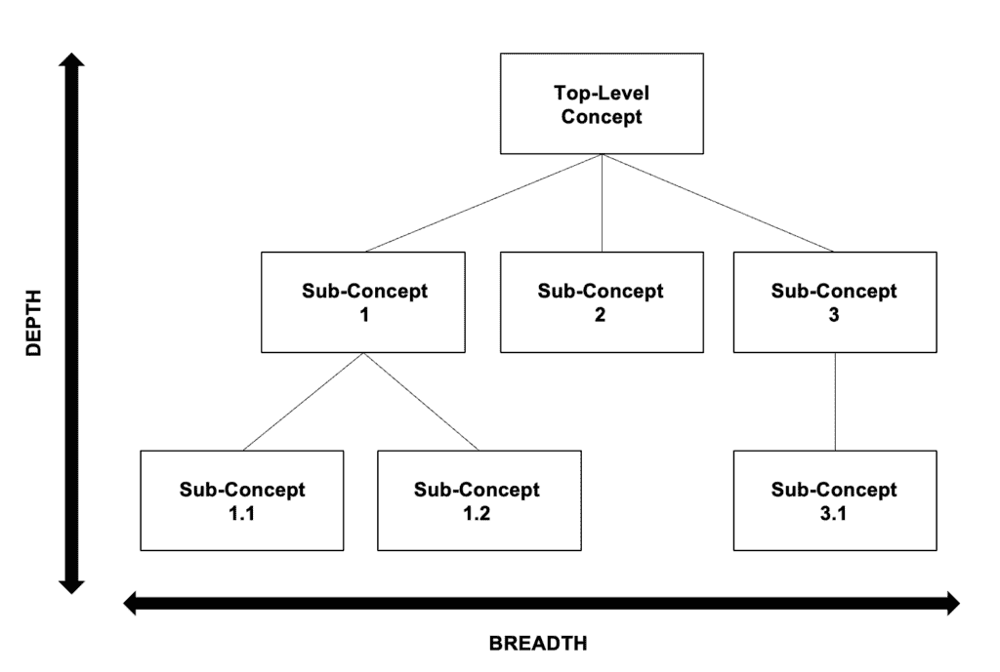
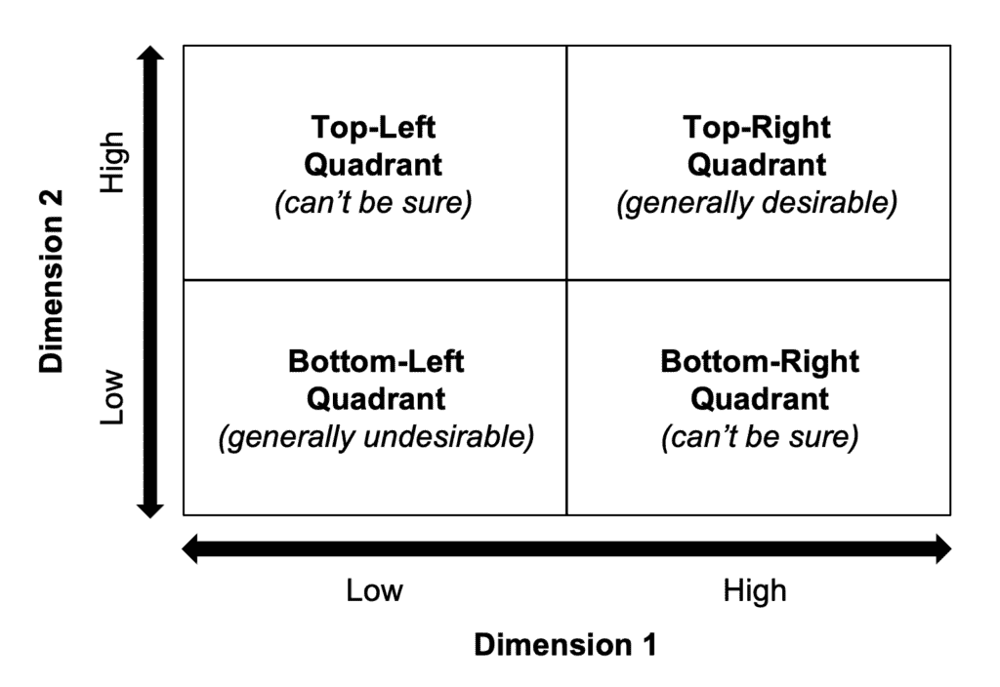
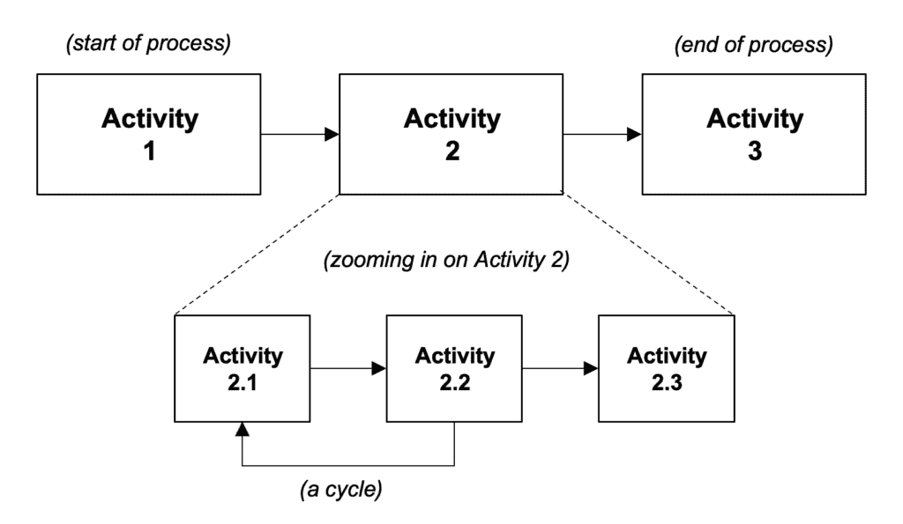
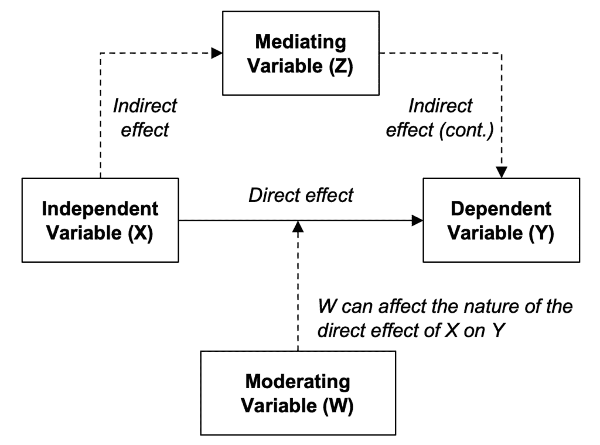

# 数据科学项目概念框架

> 原文：[`towardsdatascience.com/conceptual-frameworks-for-data-science-projects/`](https://towardsdatascience.com/conceptual-frameworks-for-data-science-projects/)

*<mdspan datatext="el1760630281297" class="mdspan-comment">概念框架</mdspan>*是表示抽象概念和组织数据的分析结构。数据科学家经常使用此类框架——有意识地或无意识地——来制定项目计划、选择平衡各种权衡的机器学习模型，并向利益相关者展示发现和建议。本文概述了常见类型的概念框架、构建自定义框架的简单三步法，以及成功实施的建议。

**注意**：以下各节中的所有图表均由本文作者创建。

## 常见框架类型

尽管概念框架的形式和大小多种多样，但在数据科学项目中，四种基本的框架类型特别突出，它们是：*层次结构*、*矩阵*、*流程图*和*关系图*。以下我们将简要介绍这些框架类型。

### 层次结构

层次框架通常以树状图的形式呈现，从根节点开始，以几个叶节点结束，如图 1 所示。例如，根节点可能代表分类学中的一个总体概念或决策树中的初始二元问题。一个节点在层次结构（或树）中的位置（或位置）为我们提供了关于其与其他节点之间关系的宝贵信息。尽管图 1 将层次结构中的项目标记为“概念”，但它们可以是任何类型的实体。实体可能是中性的（例如，概念、主题、段）或具有某种积极或消极的价（例如，收入、成本、问题、问题）。层次结构在深度和广度上可以有所不同。

图 1：层次框架的通用结构

在层次结构的视觉表示中，两个实体之间的垂直链接通常被明确绘制，可以是非方向的（简单线条）或方向的（向下或向上箭头，取决于关系的流动）。相比之下，同一层次结构中同一级别的实体之间的水平链接通常不会明确显示。同一级别的实体可能受到自然排序（例如，时间或空间）的影响，这可以通过在框架中相应地放置它们来表示。例如，在排序中较早出现的实体应放置在较晚出现的实体的左侧。如果实体没有自然排序，您仍然可以考虑以某种方式（例如，按重要性或优先级）对它们进行排序，以帮助推理。在层次结构中同一级别的实体通常也应在同一抽象级别。

在许多情况下，如果层次结构的节点是*相互排斥*和*累积穷尽*的，或者说是*MECE*（发音为“me-see”），那么这在很大程度上是有帮助的。相互排斥意味着单个节点所代表的概念之间没有重大重叠（即，没有冗余），而累积穷尽意味着框架没有遗漏任何重要的内容。MECE 层次结构可以用来将一个广泛的概念分解为子概念（或组成部分），以识别整个的关键驱动因素。

### 矩阵

矩阵是一种由*n*行和*m*列组成的表格数据结构。在表格用例上工作的数据科学家通常会利用矩阵来存储训练数据和模型权重。训练机器学习模型可以产生高维度的权重矩阵，这些矩阵捕捉了预测变量和目标之间的复杂关系。如图 2 所示的低维矩阵可以用于分析问题和传达关键见解。

图 2：二维矩阵框架的一般结构

图 2 中所示的一般二维矩阵比较了两个不同的维度。这样的矩阵自然产生四个象限。按照惯例，左下象限（两个维度都是“低”）通常是矩阵中不受欢迎的区域，而右上象限（两个维度都是“高”）则代表理想的区域。例如，市场研究公司 Gartner 使用二维矩阵来分析各个行业领域的竞争格局，并将矩阵右上区域（市场领导者所在区域）称为“魔力象限”。

矩阵的维度可能代表连续、有序或分类数据类型。理想情况下，这些维度（或轴）应以某种方式对整体框架目标很重要（例如，在特定背景中的关键子概念、问题或驱动因素）。这些维度之间的交互应特别引起兴趣，因为这是矩阵能够很好地捕捉的洞察来源。

通常，MECE 原则也适用于维度的选择——它们应该共同覆盖正在研究的问题的重要子概念或驱动因素，并避免冗余。否则，观察交互与观察单个维度将没有区别。如果分析交互并不重要，那么层次框架可能更合适。在矩阵框架及其层次对应物之间进行转换可能是直接的。例如，要将图 2 中的矩阵转换为层次结构，创建一个定义整体背景的根节点，让它的子节点是维度 1 和 2，并让它们各自的子节点是“高”和“低”。

### 流程图

流程定义了一系列逻辑上有序的活动序列，这些活动相互作用以实现一个总目标。例如，Dataiku 和 KNIME 等工具允许用户将数据科学管道作为流程构建，从数据摄取一直到最后建模和报告生成。图 3 描述了一个通用过程框架。

图 3：过程框架的通用结构

图 3 中的实体被标记为活动，但它们可以是步骤、阶段、操作等。该过程从一项活动（活动 1）开始，以一项活动（活动 3）结束，并在其中包含一个或多个活动（活动 2）。一些输入通常在开始时输入到过程中，并在一系列活动中转换，以产生输出。请注意，输入和输出也可以在过程中的中间步骤中进入和离开。

与层次结构和矩阵一样，MECE 原则在制定过程的各项活动时可能很重要。如果有两个活动有显著的概念重叠，可以考虑将它们合并为一个单独的活动，或者将它们拆分成一组更细粒度的独立活动。例如，图 9 中的中间活动可能是这种分析的结果；活动 2 可能是合并一些重叠活动的结果，而活动 2.1-2.3 可能是合并活动的一个特殊子集的细粒度分解。如果一个活动或过程的一个更大部分重复，则可以将其表示为一个循环，其中一项活动转换到之前已经发生过的另一项活动。

从一项活动到另一项活动的转换应该有意义的转换过程输入（例如，通过增加、减少、组合或其他方式改变输入）以达到预期的输出。如果一个转换没有改变输入，那么转换两侧的两个活动可能是冗余的，应该合并或以不同的方式拆分，如上所述。

### 关联图

关联图将焦点从单个概念（或实体）转移到它们之间的关系上。与知识图谱或因果关系的方框和箭头“路径图”（如图 4 所示）一起工作的数据科学家将熟悉这种框架类型。

图 4：路径图的通用结构

关联通常可以是一般函数，将两个不同的概念联系起来。以下四种类型的关联尤为常见：

+   **交易性的：** 一种关系可以表示实体之间的一笔或多笔交易。这些交易可能涉及有形物品（例如，买卖的产品）或无形物品（例如，信息、金钱）。交易关系可以包含方向性；交易可以从 A 流向 B，从 B 流向 A，或者双向流动，每种情况对实体都有不同的意义（例如，它们可能是接收者、发送者或两者都是）。

+   **因果性的：** 如果 A 至少在部分上对 B 的发生或状态负责（或反之亦然），那么实体 A 和 B 可能存在因果关系。因果关系的性质可能不同。如果 A 的存在足以完全导致 B，那么 A 的作用就强大（尽管 A 可能不是唯一能够完全导致 B 的实体）。如果 A 是导致 B 所必需的，那么 A 的作用也强大（尽管 A 可能无法单独做到这一点）。此外，如果 A 导致 B，并不意味着 B 也会导致 A；方向性的概念对于指定因果关系来说非常重要。

+   **基于相似性的：** 实体可能因为以某种方式相似或不相似而相互关联。例如，实体 A 和 B 可能因为它们倾向于出现在同一地点或同时发生（如果其中一个实体发生往往排除另一个实体的发生，则它们是不相似的）。*相关性*的概念是数学形式化通常用于构建可测量的、基于相似性的关系的概念。请注意，仅仅因为两个实体相关，并不意味着它们必然有因果关系（尽管如果它们有因果关系，那么它们也会相关）。

+   **基于成员资格的：** 实体可以通过成为同一组、社区或类别的成员而相互关联。例如，人们可以通过居住在同一个社区而相互关联，杂货可以属于同一产品类别，一组子概念可能是一个更广泛概念的一部分。实际上，可以应用分层框架来深入探讨考虑中的实体成员资格的逐级更深层级。

## 如何构建你自己的框架

以下三个步骤的过程可以用来构建一个自定义框架：

1.  定义框架的目标。

1.  确定合适的构建模块（即框架类型和维度）。

1.  以有效的方式将构建模块组合起来，以回答框架的目标。

### 第 1 步：定义目标

在定义框架的目标时，问自己：框架将在什么背景下使用？框架应该实现什么？现有的框架可以被重用——可能需要一些小的修改——或者是否需要构建一个新的框架来满足你的特定需求？

框架的建设应该与一个更高的目标相关联，例如项目的交付、决策的制定或某些文档的创建。一旦正确理解了背景，就应该仔细考虑框架在具体方面应该实现什么。框架是否旨在作为决策工具？框架是否旨在结构化报告或演示中的论点流程？

虽然你需要一个框架，但这并不意味着你必须自己构建它。在许多情况下，现有的概念框架可以不经重大修改而重复使用。投入一些努力来维护一个坚实、最新的相关现有框架概述，可以避免“重新发明轮子”的下游成本。重复使用现有框架的好处不仅在于不必从头开始；如果框架存在了一段时间，其主要特性以及其优势和局限性可能已经在不同的环境中得到很好的记录和测试。例如，*Towards Data Science*平台是了解与数据科学项目相关的概念框架的好资源。

### 第 2 步：识别框架类型和维度

在明确了框架的目标之后，是时候更具体地考虑框架本身的构建了。这里的难点之一是，概念框架本质上不像物理框架那样有形（例如工厂中的模具）。当框架及其对象是有形的，我们更容易直觉到形式和功能——框架及其目的——之间的联系。一个好的概念框架的标志是它能够将看似无形的主张或决策转化为更具体的东西，而实现这一目标的关键是表示。

从广义上讲，有两个方面决定了概念框架的表示：框架的**类型**和框架的**维度**。你可能会首先注意到框架类型，因为它决定了框架整体的外观。前几节介绍了四种常见的框架类型。框架维度决定了框架可以具体表示什么（例如，在粒度和顺序方面）。通过调整维度，相同的框架类型可以重复使用，以生成广泛的不同见解。以下是一些常见的框架维度类别：

+   **类别**：这些维度由一组有限的离散类别组成，可以完全描述维度。这些类别不需要有序（例如，一组产品、客户细分、性别）。

+   **序数**：这些维度是有序的，这意味着你可以分析某物相对于其他事物是“小于”、“大于”、“等于”等等（例如，负/正，低/中/高）。

+   **连续性**：这样的维度可以将序数维度的概念提升到一个更精细的水平。连续性意味着维度是数值的，可以包括小数（例如，1.23，-2.718，3.14159）。

### 第 3 步：整合所有内容

一旦确定了框架类型和尺寸，它们可以组合起来创建一个定制的框架。通常，识别和组合步骤并不是明确分开的，因为你很少会单独进行其中之一。但是，框架类型及其尺寸——基本构建块——并不一定相互绑定。某些组合可能比其他组合更有意义，你通常可以在多次迭代中以多种方式混合和匹配构建块，直到框架感觉合适。能够发现并利用这种组合灵活性是一项至关重要的技能，你应该从框架构建之旅的开始就着手培养。

此外，还有四种广泛的“分析路径”，捕捉框架与其目标之间的联系：

+   **描述性**：通过收集和组织过去的信息（例如，使用图表和表格等视觉元素或书面摘要）来接近框架的目标。这样做可以让我们更好地描述和分析过去发生的事情，但这并不一定告诉我们为什么发生了某事，或者它是否还会发生。

+   **诊断性**：通过深入数据，挖掘线索和相关性，并试图在原因和结果之间找到合理的联系，将过去事件的描述性信息进一步深入一步，以了解为什么发生了某事。与描述性路径一样，重点是过去。

+   **预测性**：与前两者不同，它询问和回答关于未来的问题。重点是依靠一系列通常量化的技术来做出关于未来的明智猜测，这些技术从简单的（例如，基本概率理论、线性模型）到更复杂的（例如，神经网络）。 

+   **规范性**：不仅预测未来事件，还建议如何处理它们。重点是弄清楚如何在未来实现某些事情——或者是否应该发生——推理的基础可以是定量的（例如，基于统计数据或模拟建模）或定性的（例如，基于个人经验）。

因此，框架类型和尺寸可以以不同的方式组合，以产生适合描述性、诊断性、预测性和规范性用例的定制框架。

## 高级技巧

本节提供了五个构建良好概念框架的建议。这些建议绝对不是你应该考虑的所有点的详尽列表，但代表了一组基本事项，需要牢记在心。

### 小贴士 1：关注目标和受众

构建框架的过程大致包括三个步骤，即定义目标，然后相应地识别和组合构建块（框架类型和维度）。虽然第一步将强调框架的战略目标和目标受众，但后两个步骤的重点转向框架构建块的细节。你越深入框架的机制，就越难保持对原始目标的可见性。为了保持对整体图景的可见性，在框架构建过程中不时退一步，并提醒自己战略目标和目标受众可能会有所帮助。也可能有助于推迟部分分析，直到必要的数据可用，并在可能的情况下从同事和框架的目标受众那里寻求定期反馈。

### 小贴士 2：尽可能保持简单

为了转述一句常被归功于阿尔伯特·爱因斯坦的名言——他是上个世纪最杰出的概念框架构建者之一——我们可以这样说，一个框架应该尽可能简单，但不能过于简单。由于这个过程本质上涉及尝试不同的框架类型和维度的组合，有时可能会诱使人们将越来越多的部分拼接在一起。然而，牺牲简单性可能会在实践中有可能降低框架的更广泛价值。复杂的框架可能难以理解、应用、评估和构建——你可能需要验证几个假设和先决条件，并在框架内调整许多不同的杠杆。

### 小贴士 3：使其 MECE

确保框架是 MECE 的具有一些重要的优势。从理论角度来看，成为 MECE 意味着子概念遵循一致的、累加的部分-整体逻辑；你期望子概念“累加”起来形成更大的概念。关键的是，这种逻辑允许你在整个分析过程中用子概念替换更大的概念（反之亦然）。MECE 的累加逻辑还允许你以严谨的方式比较不同的概念；而不是说两个概念是相似的，你可以通过识别它们共有的子概念来精确地说明它们相似的程度。从实际角度来看，成为 MECE 意味着你可以“分而治之”地高效解决大问题，并且某些子问题的解决方案可能是可重用的。有时，甚至可以在不解决所有子问题的情况下找到更大问题的解决方案（例如，如果更大问题可以表示为子问题的析取）。在归纳解决更大问题时绕过子问题也是有效的（例如，在数学归纳法中）。

### 小贴士 4：使其灵活

基本上，概念框架应该设计得能够满足其总体目标，因此你可能想知道为什么灵活性是一个重要的考虑因素。在实践中，至少有两种情况，灵活性可以大有帮助。在第一种情况下，你可能正在处理一个移动的目标，目标的全范围的一些部分会不时（甚至略微）发生变化；如果没有在框架中融入一些灵活性，对这种范围变化的响应可能会很痛苦。在第二种情况下，你的框架可能需要经历几次迭代，在框架的发展过程中，不同的框架类型和维度被添加、修改和删除；灵活的设计使得促进框架形状和内容的这种变更变得容易得多。模块化、可扩展性、鲁棒性、可扩展性和可移植性——虽然通常与软件工程和架构相关——也是构建灵活概念框架的相关设计考虑因素。

### 小贴士 5：迭代构建

如果你能一次就提出一个完美的框架，那当然很好，但这种情况很少发生。有几个因素可能会使第一次迭代更像是一个草稿，需要至少再进行几次迭代。总体目标——尤其是构建框架时的操作影响——一开始可能并不完全清楚。然而，经过几次迭代后，你可能会开始了解哪些框架类型和维度是有效的，哪些不是。虽然给定迭代后的输出可能远非完美，但如果它以最小的努力和复杂性解决了总体目标，它仍然可以被视为一个*最小可行产品*（MVP）。MVP 可以通过实际数据和真实用户进行测试，以了解其优势和劣势。每个后续迭代都可以通过添加、删除或更改前一个迭代的功能来产生一个改进的 MVP。

最后，这里有一个视频，分享了一些关于构建和使用概念框架的更多好建议：

## The Wrap

概念框架帮助我们将抽象的想法转化为具体、可感知的产品，其他人可以看到、使用和欣赏。这对数据科学家或所谓的“知识工作者”来说尤为重要，他们的工作涉及收集、分析和从数据中得出结论。如果你正在阅读这篇文章，你很可能是一位知识工作者。用著名的管理大师彼得·德鲁克的话来说，“是数据使知识工作者能够完成他们的工作，”但能够有意义地组织这些数据的能力才是做好工作的关键——简而言之，这就是为什么正确使用概念框架可以帮助成功设计和交付数据科学项目的原因。
