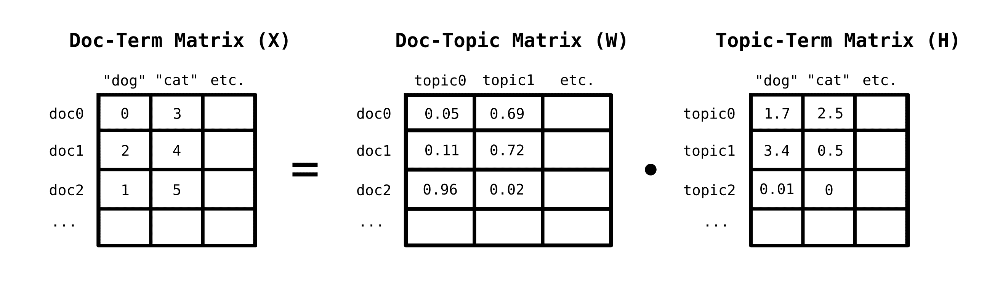
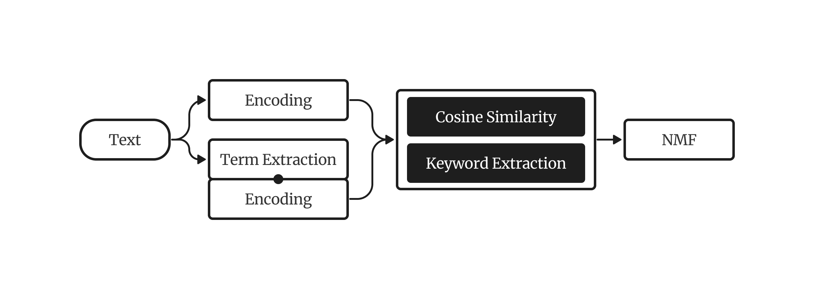
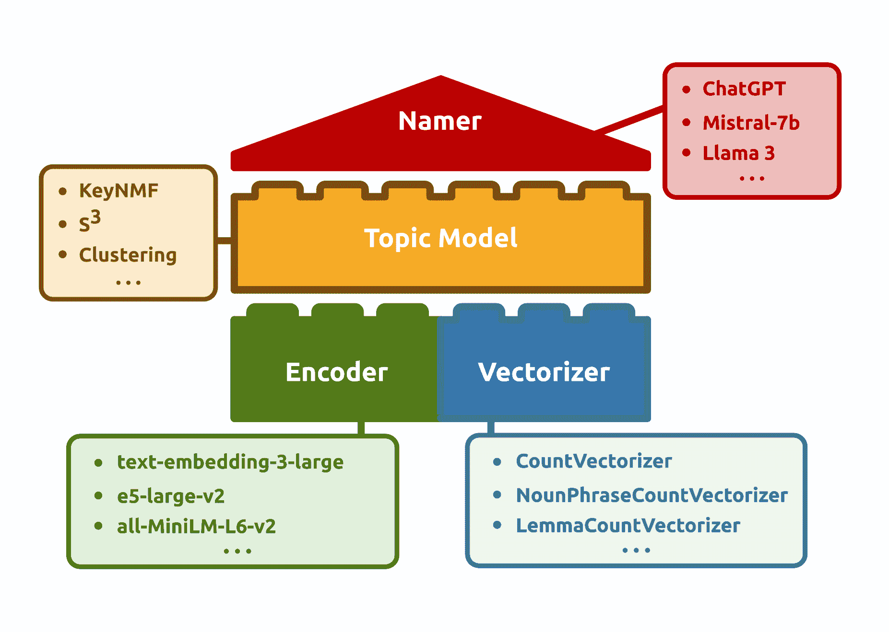
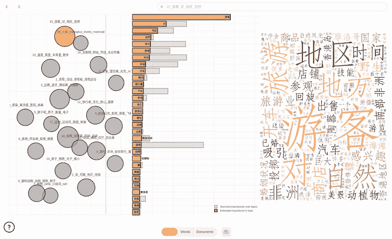

# 基于 KeyNMF 的中文语料库上下文主题建模

> 原文：[`towardsdatascience.com/contextual-topic-modelling-in-chinese-corpora-with-keynmf-9a1d02f02648/`](https://towardsdatascience.com/contextual-topic-modelling-in-chinese-corpora-with-keynmf-9a1d02f02648/)

在我们关于欧洲华人社区媒体话语动态的[最近论文](https://arxiv.org/abs/2410.12791)中，我们的团队已经触及到当应用于中文数据时，主题建模方法质量普遍存在的不满。在这篇文章中，我将向您介绍我们新颖的主题建模方法 KeyNMF，以及如何最有效地将其应用于中文文本数据。

## 基于矩阵分解的主题建模

在深入实际之前，我想简要介绍一下主题建模理论，并说明我们论文中引入的进步。

主题建模是自然语言处理的一个分支，它以无监督的方式在文本语料库中揭示潜在的主题信息，然后将这些信息以人类可解释的方式呈现给用户（通常每个主题有 10 个关键词）。

有许多方法可以用数学术语来形式化这个任务，但主题发现的一个相当流行的概念化是矩阵分解。这是一种相当自然和直观的方式来处理这个问题，您很快就会看到原因。主题建模作为矩阵分解背后的主要洞察是以下内容：经常一起出现的单词很可能属于同一潜在结构。换句话说：那些出现高度相关的术语是同一主题的一部分。

您可以通过首先构建文档的词袋矩阵来在一个语料库中发现主题。词袋矩阵以以下方式表示文档：每一行对应一个文档，而每一列对应模型词汇表中的一个独特单词。矩阵中的值是单词在给定文档中出现的次数。



非负矩阵分解的示意图

这个矩阵可以分解为*主题-词矩阵*的线性组合，该矩阵表示一个单词对于给定主题的重要性，以及*文档-主题矩阵*，该矩阵表示一个给定主题对于给定文档的重要性。这种分解的方法是非负矩阵分解，其中我们将一个非负矩阵分解为两个其他严格非负矩阵，而不是允许任意有符号的值。

NMF 并不是唯一可以用来分解词袋矩阵的方法。一种具有高度历史意义的方法，潜在语义分析，利用截断奇异值分解来完成这个目的。然而，NMF 通常是一个更好的选择，因为：

1.  发现的潜在因子与其他分解方法的质量不同。NMF 通常在数据中发现**局部化模式**或**部分**，这些更容易解释。

1.  **非负**的主题-术语和文档-主题关系比有符号的更容易解释。

尽管使用仅 BoW 矩阵的 NMF 可能很有吸引力且简单，但它确实有其缺点：

1.  NMF 通常最小化误差矩阵的 Frobenius 范数。这涉及到结果变量的**高斯性**假设，这显然是错误的，因为我们正在对词频进行建模。

1.  BoW 表示仅仅是**词频**。这意味着单词将不会在上下文中被解释，并且句法信息将被忽略。

## KeyNMF

为了解决这些限制，并在新基于 transformer 的语言表示的帮助下，我们可以显著提高 NMF 的适用性。

KeyNMF 背后的关键直觉是，文档中的大多数词在**语义上不显著**，我们可以通过突出显示前 N 个最相关的术语来获得文档中主题信息的概览。我们将通过使用 sentence-transformer 模型的**上下文嵌入**来选择这些术语。



KeyNMF 模型的关键概述

KeyNMF 算法包括以下步骤：

1.  使用 sentence-transformer 对每个文档以及文档中的所有单词进行嵌入。

1.  计算词嵌入与文档嵌入的余弦相似度。

1.  对于每份文档，保留与文档具有最高正余弦相似度的前 N 个词。

1.  将余弦相似度排列成一个**关键词矩阵**，其中每一行是一个文档，每一列是一个关键词，值是单词与文档的余弦相似度。

1.  使用 NMF 分解关键词矩阵。

这种公式以多种方式帮助我们。a) 我们显著减少了模型的词汇量，因此参数更少，从而实现更快的模型拟合；b) 我们得到了连续分布，这对于 NMF 的假设来说是一个更好的拟合；c) 我们将上下文信息纳入我们的主题模型。

## 使用 KeyNMF 进行中文主题建模

现在你已经了解了 KeyNMF 的工作原理，让我们动手在一个实际场景中应用这个模型。

### 准备和数据

首先，让我们安装在这个演示中将要使用的包：

```py
pip install turftopic[jieba] datasets sentence_transformers topicwizard
```

然后，让我们获取一些公开可用的数据。我选择了[SIB200](https://huggingface.co/datasets/Davlan/sib200)语料库，因为它在 CC-BY-SA 4.0 开源许可下免费提供。以下代码将为我们获取语料库。

```py
from datasets import load_dataset

# Loads the dataset
ds = load_dataset("Davlan/sib200", "zho_Hans", split="all")
corpus = ds["text"]
```

### 构建中文主题模型

将语言模型应用于中文存在许多棘手的问题，因为这些系统大多数都是在英语数据上开发和测试的。当涉及到 KeyNMF 时，有两个方面需要考虑。



Turftopic 中主题建模管道的元素

首先，我们需要弄清楚如何对中文文本进行分词。幸运的是，包含我们的 KeyNMF 实现（以及其他功能）的[Turftopic](https://github.com/x-tabdeveloping/turftopic)库预先包装了中文分词工具。通常，您会使用 sklearn 中的 CountVectorizer 对象从文本中提取单词。我们添加了一个 ChineseCountVectorizer 对象，它在后台使用 Jieba 分词器，并有一个可选的中文停用词列表。

```py
from turftopic.vectorizers.chinese import ChineseCountVectorizer

vectorizer = ChineseCountVectorizer(stop_words="chinese")
```

然后，我们需要一个中文嵌入模型来生成文档和单词表示。我们将使用 paraphrase-multilingual-MiniLM-L12-v2 模型，因为它相当紧凑且快速，并且专门训练用于多语言检索环境。

```py
from sentence_transformers import SentenceTransformer

encoder = SentenceTransformer("paraphrase-multilingual-MiniLM-L12-v2")
```

然后，我们可以构建一个完全的中文 KeyNMF 模型！我将使用 20 个主题和 N=25（每个文档将提取最多 15 个关键词）初始化模型

```py
from turftopic import KeyNMF

model = KeyNMF(
    n_components=20,
    top_n=25,
    vectorizer=vectorizer,
    encoder=encoder,
    random_state=42, # Setting seed so that our results are reproducible
)
```

然后，我们可以将模型拟合到语料库中，看看我们得到什么结果！

```py
document_topic_matrix = model.fit_transform(corpus)
model.print_topics()
```

```py
┏━━━━━━━━━━┳━━━━━━━━━━━━━━━━━━━━━━━━━━━━━━━━━━━━━━━━━━━━━━━━━━━━━━━━━━━━━━━━━━━━━━━━━━━━━━━━━━━━━━━━━━━━━━┓
┃ Topic ID ┃ Highest Ranking                                                                              ┃
┡━━━━━━━━━━╇━━━━━━━━━━━━━━━━━━━━━━━━━━━━━━━━━━━━━━━━━━━━━━━━━━━━━━━━━━━━━━━━━━━━━━━━━━━━━━━━━━━━━━━━━━━━━━┩
│        0 │ 旅行, 非洲, 徒步旅行, 漫步, 活动, 通常, 发展中国家, 进行, 远足, 徒步                         │
├──────────┼──────────────────────────────────────────────────────────────────────────────────────────────┤
│        1 │ 滑雪, 活动, 滑雪板, 滑雪运动, 雪板, 白雪, 地形, 高山, 旅游, 滑雪者                           │
├──────────┼──────────────────────────────────────────────────────────────────────────────────────────────┤
│        2 │ 会, 可能, 他们, 地球, 影响, 北加州, 并, 它们, 到达, 船                                       │
├──────────┼──────────────────────────────────────────────────────────────────────────────────────────────┤
│        3 │ 比赛, 选手, 锦标赛, 大回转, 超级, 男子, 成绩, 获胜, 阿根廷, 获得                             │
├──────────┼──────────────────────────────────────────────────────────────────────────────────────────────┤
│        4 │ 航空公司, 航班, 旅客, 飞机, 加拿大航空公司, 机场, 达美航空公司, 票价, 德国汉莎航空公司, 行李 │
├──────────┼──────────────────────────────────────────────────────────────────────────────────────────────┤
│        5 │ 原子核, 质子, 能量, 电子, 氢原子, 有点像, 原子弹, 氢离子, 行星, 粒子                         │
├──────────┼──────────────────────────────────────────────────────────────────────────────────────────────┤
│        6 │ 疾病, 传染病, 疫情, 细菌, 研究, 病毒, 病原体, 蚊子, 感染者, 真菌                             │
├──────────┼──────────────────────────────────────────────────────────────────────────────────────────────┤
│        7 │ 细胞, cella, 小房间, cell, 生物体, 显微镜, 单位, 生物, 最小, 科学家                          │
├──────────┼──────────────────────────────────────────────────────────────────────────────────────────────┤
│        8 │ 卫星, 望远镜, 太空, 火箭, 地球, 飞机, 科学家, 卫星电话, 电话, 巨型                           │
├──────────┼──────────────────────────────────────────────────────────────────────────────────────────────┤
│        9 │ 猫科动物, 动物, 猎物, 狮子, 狮群, 啮齿动物, 鸟类, 狼群, 行为, 吃                             │
├──────────┼──────────────────────────────────────────────────────────────────────────────────────────────┤
│       10 │ 感染, 禽流感, 医院, 病毒, 鸟类, 土耳其, 病人, h5n1, 家禽, 医护人员                           │
├──────────┼──────────────────────────────────────────────────────────────────────────────────────────────┤
│       11 │ 抗议, 酒店, 白厅, 抗议者, 人群, 警察, 保守党, 广场, 委员会, 政府                             │
├──────────┼──────────────────────────────────────────────────────────────────────────────────────────────┤
│       12 │ 旅行者, 文化, 耐心, 国家, 目的地, 适应, 人们, 水, 旅行社, 国外                               │
├──────────┼──────────────────────────────────────────────────────────────────────────────────────────────┤
│       13 │ 速度, 英里, 半英里, 跑步, 公里, 跑, 耐力, 月球, 变焦镜头, 镜头                               │
├──────────┼──────────────────────────────────────────────────────────────────────────────────────────────┤
│       14 │ 原子, 物质, 光子, 微小, 粒子, 宇宙, 辐射, 组成, 亿, 而光                                     │
├──────────┼──────────────────────────────────────────────────────────────────────────────────────────────┤
│       15 │ 游客, 对, 地区, 自然, 地方, 旅游, 时间, 非洲, 开车, 商店                                     │
├──────────┼──────────────────────────────────────────────────────────────────────────────────────────────┤
│       16 │ 互联网, 网站, 节目, 大众传播, 电台, 传播, toginetradio, 广播剧, 广播, 内容                   │
├──────────┼──────────────────────────────────────────────────────────────────────────────────────────────┤
│       17 │ 运动, 运动员, 美国, 体操, 协会, 支持, 奥委会, 奥运会, 发现, 安全                             │
├──────────┼──────────────────────────────────────────────────────────────────────────────────────────────┤
│       18 │ 火车, metroplus, metro, metrorail, 车厢, 开普敦, 通勤, 绕城, 城内, 三等舱                    │
├──────────┼──────────────────────────────────────────────────────────────────────────────────────────────┤
│       19 │ 投票, 投票箱, 信封, 选民, 投票者, 法国, 候选人, 签名, 透明, 箱内                             │
└──────────┴──────────────────────────────────────────────────────────────────────────────────────────────┘
```

如您所见，我们已经在我们的语料库中获得了合理的概述！您可以看到，主题相当明显，其中一些与科学主题有关，例如天文学（8）、化学（5）或动物行为（9），而其他则倾向于休闲（例如 0、1、12）或政治（19、11）。

### 可视化

为了进一步帮助理解结果，我们可以使用 topicwizard 库来可视化调查主题模型的参数。

由于 topicwizard 使用词云，我们需要告诉库它应该使用与中文兼容的字体。我从[ChineseWordCloud](https://github.com/shangjingbo1226/ChineseWordCloud)存储库中取了一个字体，我们将下载并将其传递给 topicwizard。

```py
import urllib.request
import topicwizard

urllib.request.urlretrieve(
    "https://github.com/shangjingbo1226/ChineseWordCloud/raw/refs/heads/master/fonts/STFangSong.ttf",
    "./STFangSong.ttf",
)
topicwizard.visualize(
    corpus=corpus, model=model, wordcloud_font_path="./STFangSong.ttf"
)
```

这将在笔记本或浏览器中打开 topicwizard 网络应用，您可以使用它交互式地调查您的主题模型：



使用 topicwizard 调查您语料库中主题、文档和单词之间的关系

## 结论

在这篇文章中，我们探讨了 KeyNMF 是什么，它是如何工作的，它是由什么激发的，以及它是如何用于在中文文本中发现高质量主题的，以及如何可视化和解释您的结果。我希望这篇教程将对那些想要探索中文文本数据的人有所帮助。

关于模型的信息以及如何改进您的结果，我鼓励您查看我们的[文档](https://x-tabdeveloping.github.io/turftopic/)。如果您有任何问题或遇到问题，请随时在 Github 上提交[问题](https://github.com/x-tabdeveloping/turftopic/issues)，或在评论中联系我 :)。

文章中展示的所有图表均由作者制作。
