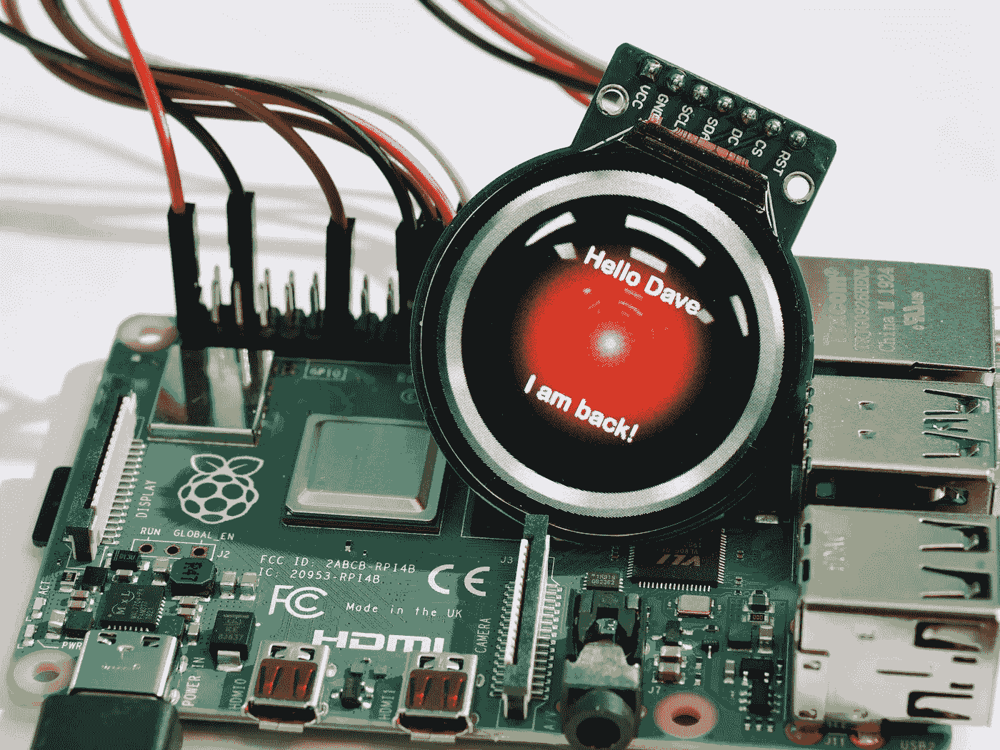
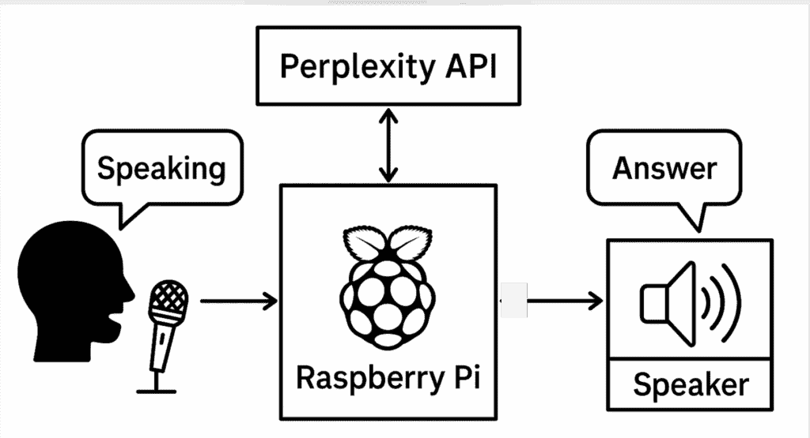

# 使用 Perplexity 打造定制语音助手

> 原文：[`towardsdatascience.com/crafting-a-custom-voice-assistant-with-perplexity/`](https://towardsdatascience.com/crafting-a-custom-voice-assistant-with-perplexity/)

<mdspan datatext="el1756487214005" class="mdspan-comment">谷歌助手</mdspan>、Alexa 和 Siri 是日常使用中占主导地位的语音助手。这些助手几乎在每家每户都变得无处不在，执行着从智能家居、记笔记、食谱指导和回答简单问题等任务。然而，当涉及到回答问题时，在 LLM 的时代，从这些语音助手那里获得简洁且基于上下文的答案可能会很棘手，甚至可能不存在。例如，如果你问谷歌助手在 8 月 22 日杰克逊霍尔关于[杰罗姆·鲍威尔的演讲](https://www.federalreserve.gov/newsevents/speech/files/powell20250822.pdf)市场是如何反应的，它将简单地回答它不知道答案，并给出一些你可以浏览的链接。这是如果你有基于屏幕的谷歌助手的话。

你经常只是想要关于当前事件的快速答案，或者你想要知道苹果树在俄亥俄州是否能度过冬天，而像谷歌和 Siri 这样的语音助手往往无法提供令人满意的答案。这让我对构建自己的语音助手产生了兴趣，一个基于其网络搜索给出简单、单一句子答案的助手。


图片由[Aerps.com](https://unsplash.com/@almoya?utm_source=medium&utm_medium=referral)在[Unsplash](https://unsplash.com/?utm_source=medium&utm_medium=referral)提供

在众多由大型语言模型（LLM）驱动的搜索引擎中，我已经热情地使用了 Perplexity 超过一年，并且除了简单的搜索之外，我所有的搜索都使用它，而简单的搜索我仍然会回到 Google 或 Bing。除了其实时网络索引，这使得它能够提供最新、准确、有来源的答案之外，Perplexity 还允许用户通过强大的 API 访问其功能。利用这一功能并将其与简单的树莓派集成，我打算创建一个语音助手，它将：

+   响应唤醒词并准备好回答我的问题

+   用简单、简洁的句子回答我的问题

+   回到被动监听，而不出售我的数据或给我不必要的广告

## 语音助手的硬件



图片由[Axel Richter](https://unsplash.com/@trisolarian?utm_source=medium&utm_medium=referral)在[Unsplash](https://unsplash.com/?utm_source=medium&utm_medium=referral)提供

要构建我们的语音助手，需要一些关键的硬件组件。项目的核心是一个[**Raspberry Pi 5**](https://www.raspberrypi.com/products/raspberry-pi-5/)，它作为我们应用程序的中心处理器。对于助手的音频输入，我选择了一个简单的[**USB 鹅颈麦克风**](https://www.amazon.com/dp/B01MQ2AA0X?ref_=ppx_hzsearch_conn_dt_b_fed_asin_title_5)。这种麦克风是全向的，使其能够从房间的不同部分听到唤醒词，并且其即插即用的特性简化了设置。对于助手的输出，一个紧凑的[**USB 供电扬声器**](https://www.amazon.com/dp/B075M7FHM1?ref_=ppx_hzsearch_conn_dt_b_fed_asin_title_2&th=1)提供了音频输出。这种扬声器的关键优势是它使用一根 USB 线为电源和音频信号供电，这最大限度地减少了线缆杂乱。



展示自定义语音助手功能性的块图（图片由作者提供）

使用现成的 USB 外设的方法使得硬件组装变得简单，使我们能够专注于软件。

## 准备环境

为了使用自定义查询查询 Perplexity，并且为了给语音助手一个唤醒词，我们需要生成几个 API 密钥。为了生成 Perplexity API 密钥，可以注册 Perplexity 账户，进入设置菜单，选择 API 选项卡，然后点击“生成 API 密钥”以创建并复制个人密钥用于应用程序。通常，访问 API 密钥生成需要付费计划或支付方式，因此在继续之前请确保账户符合条件。

提供唤醒词定制的平台包括 PicoVoice Porcupine、Sensory TrulyHandsfree 和 Snowboy，其中 PicoVoice Porcupine 提供了一个简单的在线控制台，用于在桌面、移动和嵌入式设备上生成、测试和部署定制的唤醒词。新用户可以通过注册免费的 Picovoice 控制台账户，导航到 Porcupine 页面，选择所需的语言，输入定制的唤醒词，然后点击“训练”来生成并下载特定平台的模型文件（.ppn）以供使用。在最终确定之前，务必测试唤醒词的性能，因为这确保了可靠的检测和最小化误报。我将训练并使用的唤醒词是“Hey Krishna”。

## 编写助手代码

该项目的完整 Python 脚本可在我的 GitHub[仓库](https://github.com/dpakapd/perplexity_assistant)上找到。在本节中，让我们看看代码的关键组件，以了解助手是如何工作的。

脚本被组织成几个核心函数，这些函数处理助手的感官和智能，所有这些都由一个中央循环管理。

### 配置和初始化

脚本的前一部分是设置部分。它处理加载必要的 API 密钥、模型文件，并初始化我们将使用的服务的客户端。

```py
# --- 1\. Configuration ---
load_dotenv()
PICOVOICE_ACCESS_KEY = os.environ.get("PICOVOICE_ACCESS_KEY")
PERPLEXITY_API_KEY = os.environ.get("PERPLEXITY_API_KEY")
KEYWORD_PATHS = ["Krishna_raspberry-pi.ppn"] # My wake word pat
MODEL_NAME = "sonar"
```

此部分使用`dotenv`库安全地从`.env`文件加载您的秘密 API 密钥，这是一种最佳实践，可以将它们从源代码中排除。它还定义了关键变量，如自定义唤醒词文件的路径和我们要查询的特定 Perplexity 模型。

### 唤醒词检测

为了使助手真正实现免提操作，它需要在不使用大量系统资源的情况下持续监听特定的唤醒词。这由`main`函数中的`while True:`循环处理，该循环使用 PicoVoice Porcupine 引擎。

```py
# This is the main loop that runs continuously
while True:
    # Read a small chunk of raw audio data from the microphone
    pcm = audio_stream.read(porcupine.frame_length)
    pcm = struct.unpack_from("h" * porcupine.frame_length, pcm)

    # Feed the audio chunk into the Porcupine engine for analysis
    keyword_index = porcupine.process(pcm)

    if keyword_index >= 0:
        # Wake word was detected, proceed to handle the command...
        print("Wake word detected!")
```

这个循环是助手“被动监听”状态的核心。它持续从麦克风流中读取小的原始音频帧。然后，每个帧都会传递给`porcupine.process()`函数。这是一个高度高效的、**离线**过程，用于分析音频以检测您自定义唤醒词（“Krishna”）的特定声学模式。如果检测到模式，`porcupine.process()`返回一个非负数，脚本随后进入监听完整命令的活跃阶段。

### 语音转文本 — 将用户问题转换为文本

在检测到唤醒词之后，助手需要监听并理解用户的问题。这一过程由语音转文本（STT）组件处理。

```py
# --- This logic is inside the main 'if keyword_index >= 0:' block ---

print("Listening for command...")
frames = []
# Record audio from the stream for a fixed duration (~10 seconds)
for _ in range(0, int(porcupine.sample_rate / porcupine.frame_length * 10)):
    frames.append(audio_stream.read(porcupine.frame_length))

# Convert the raw audio frames into an object the library can use
audio_data = sr.AudioData(b"".join(frames), porcupine.sample_rate, 2)

try:
    # Send the audio data to Google's service for transcription
    command = recognizer.recognize_google(audio_data)
    print(f"You (command): {command}")
except sr.UnknownValueError:
    speak_text("Sorry, I didn't catch that.") 
```

一旦检测到唤醒词，代码会主动从麦克风记录大约 10 秒的音频，捕捉用户的语音命令。然后，它将原始音频数据打包，并使用`speech_recognition`库将其发送到谷歌的语音识别服务。该服务处理音频并返回转录的文本，然后存储在`command`变量中。

### 从 Perplexity 获取答案

一旦用户的命令被转换为文本，它就会被发送到 Perplexity API 以获取智能且最新的答案。

```py
# --- This logic runs if a command was successfully transcribed ---

if command:
    # Define the instructions and context for the AI
    messages = [{"role": "system", "content": "You are an AI assistant. You are located in Twinsburg, Ohio. All answers must be relevant to Cleveland, Ohio unless asked for differently by the user.  You MUST answer all questions in a single and VERY concise sentence."}]
    messages.append({"role": "user", "content": command})

    # Send the request to the Perplexity API
    response = perplexity_client.chat.completions.create(
        model=MODEL_NAME, 
        messages=messages
    )
    assistant_response_text = response.choices[0].message.content.strip()
    speak_text(assistant_response_text) 
```

此代码块是操作的“大脑”。它首先构建一个`messages`列表，其中包含一个关键的**系统提示**。这个提示为 AI 提供了个性和规则，例如以单句回答并意识到其位于俄亥俄州的位置。然后，用户的命令被添加到这个列表中，整个包被发送到 Perplexity API。脚本随后从 AI 的响应中提取文本，并将其传递给`speak_text`函数以大声朗读。

### 文本转语音 — 将困惑度响应转换为语音

`speak_text`函数赋予了助手声音。

```py
def speak_text(text_to_speak, lang='en'):
    # Define a function that converts text to speech, default language is English

    print(f"Assistant (speaking): {text_to_speak}")
    # Print the text for reference so the user can see what is being spoken

    try:
        pygame.mixer.init()
        # Initialize the Pygame mixer module for audio playback

        tts = gTTS(text=text_to_speak, lang=lang, slow=False)
        # Create a Google Text-to-Speech (gTTS) object with the provided text and language
        # 'slow=False' makes the speech sound more natural (not slow-paced)

        mp3_filename = "response_audio.mp3"
        # Set the filename where the generated speech will be saved

        tts.save(mp3_filename)
        # Save the generated speech as an MP3 file

        pygame.mixer.music.load(mp3_filename)
        # Load the MP3 file into Pygame's music player for playback

        pygame.mixer.music.play()
        # Start playing the speech audio

        while pygame.mixer.music.get_busy():
            pygame.time.Clock().tick(10)
        # Keep the program running (by checking if playback is ongoing)
        # This prevents the script from ending before the speech finishes
        # The clock.tick(10) ensures it checks 10 times per second

        pygame.mixer.quit()
        # Quit the Pygame mixer once playback is complete to free resources

        os.remove(mp3_filename)
        # Delete the temporary MP3 file after playback to clean up

    except Exception as e:
        print(f"Error in Text-to-Speech: {e}")
        # Catch and display any errors that occur during the speech generation or playback
```

此函数接收一个文本字符串，将其打印出来以供参考，然后使用 gTTS（Google Text-to-Speech）库生成一个临时的 MP3 音频文件。它通过 pygame 库使用系统的扬声器播放文件，等待播放完成，然后删除该文件。过程中包含错误处理，以捕获可能出现的任何问题。

## 测试助手

下面是定制语音助手功能的演示。为了比较其性能与谷歌助手的性能，我也向谷歌助手和定制助手提出了相同的问题。

如您所见，谷歌提供的是指向答案的链接，而不是提供用户想要的简要总结。定制助手更进一步，提供总结，并且更加有帮助和信息丰富。

## 结论

在这篇文章中，我们探讨了在 Raspberry Pi 上构建一个完全功能性的、免提语音助手的流程。通过结合自定义唤醒词和 Python 的 Perplexity API，我们创建了一个简单的语音助手设备，它有助于快速获取信息。

这种基于 LLM（大型语言模型）的方法的关键优势在于其能够直接、综合地回答复杂和当前的问题——这是一个谷歌助手等助手通常只是提供一系列搜索链接而无法胜任的任务。我们的助手不仅仅是一个搜索引擎的语音界面，它作为一个真正的答案引擎，解析实时网络结果，给出单一、简洁的回应。语音助手的未来在于这种更深、更智能的集成，而自己构建则是探索这一领域的最佳方式。
