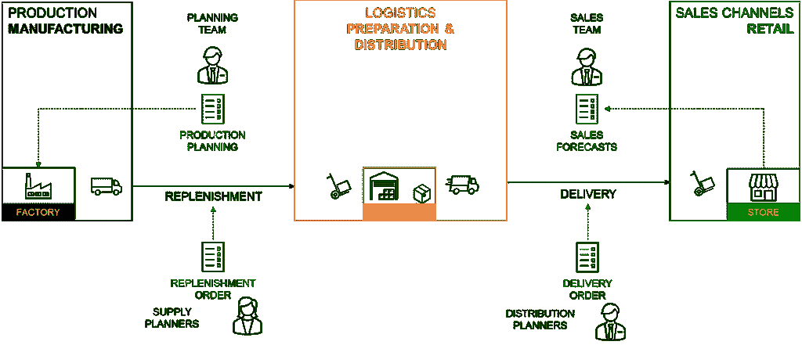
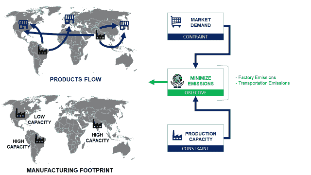
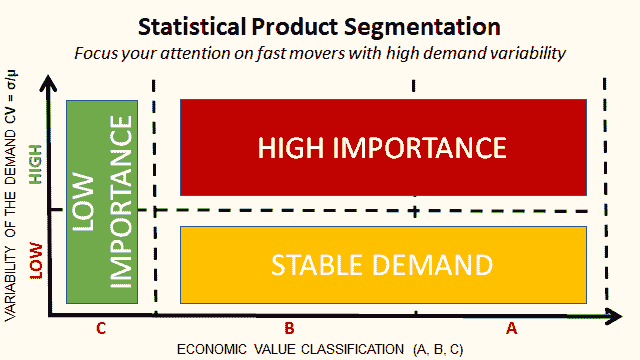
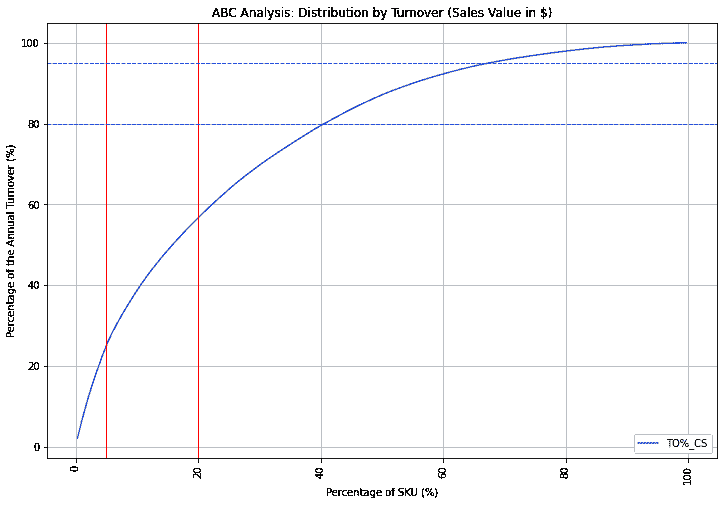
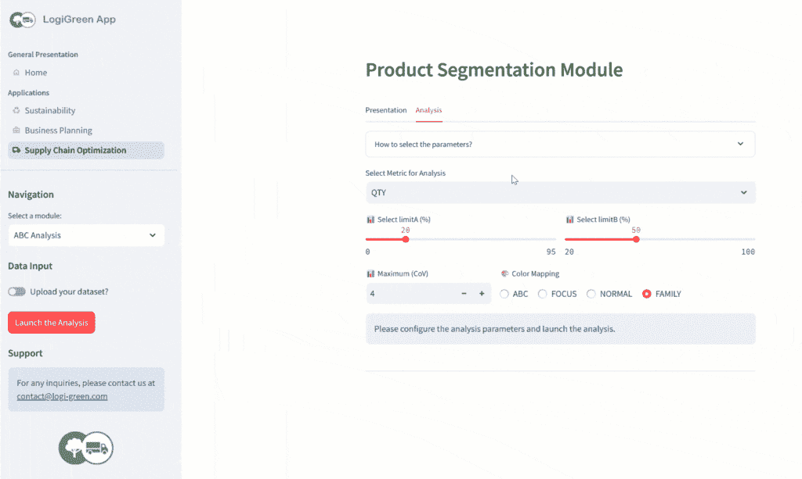
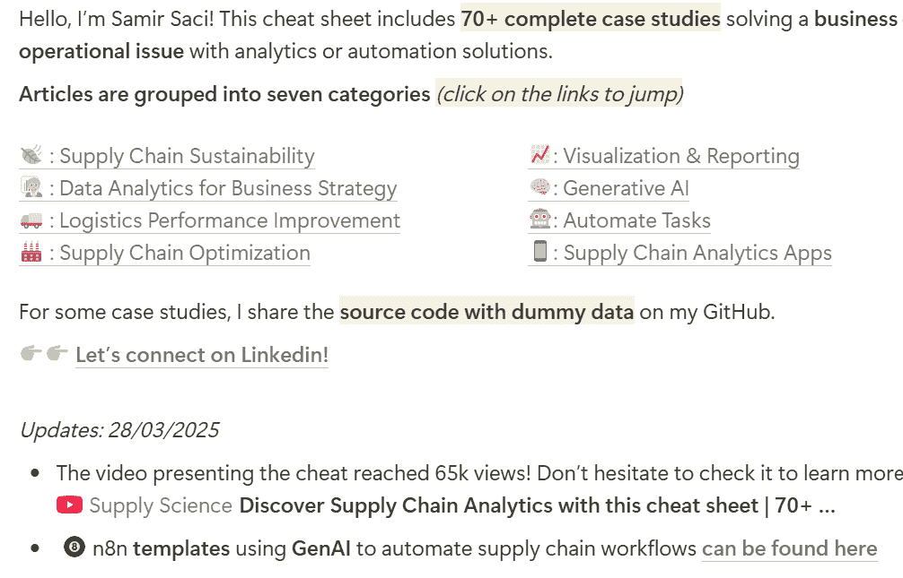

# 创建你的供应链分析投资组合，以获得你的梦想工作

> 原文：[`towardsdatascience.com/create-your-supply-chain-analytics-portfolio-to-land-your-dream-job/`](https://towardsdatascience.com/create-your-supply-chain-analytics-portfolio-to-land-your-dream-job/)

供应链的压力前所未有地大。

从气候驱动的中断到地缘政治的变动，企业必须适应不断上升的成本、新的贸易壁垒和日益增长的可持续性需求。

在这个供应链面临不确定性的新世界中，**供应链分析是保持弹性运营的关键**。

> Samir，你能给我建议如何通过实际项目来构建供应链分析投资组合吗？

自从我在 2020 年 8 月 5 日在《Towards Data Science》上发表第一篇文章以来，我经常收到读者在[LinkedIn](http://www.linkedin.com/in/samir-saci)或[YouTube](https://www.youtube.com/@SupplyScience)上的这个问题。

在这篇文章中，我将分享我的观点——在行业九年的经验之后——如果我是作为一名初级数据科学家开始，我会如何使用我的[供应链分析速查表](https://bit.ly/supply-chain-cheat)来构建一个投资组合。

## 供应链分析速查表

### 什么是供应链分析？

让我们从定义我们使用的术语开始。

[供应链分析](https://www.youtube.com/watch?v=3d7C4pShykI)指的是一套工具和方法，用于从价值链中所有流程的数据中提取洞察。

供应链系统 — (图片由 Samir Saci 提供)

例如，一家零售公司可能会使用：

+   一个 ERP 系统来管理采购、财务和销售

+   一个[仓库管理系统](https://www.youtube.com/shorts/MW1QRJs3iuE)来管理其分销中心

+   一个运输管理系统来管理进出货运

4 种供应链分析类型以回答问题 — (图片由作者提供)

作为物流行业的供应链解决方案经理和数据科学家，我已在国际项目中使用分析来设计和优化供应链解决方案。

我已经在《Towards Data Science》上发表了超过 75 篇文章，分享了这些方法和工具。

我将它们整理成了这份简洁而全面的[供应链分析速查表](https://bit.ly/supply-chain-cheat)。

包含 70 多个案例研究的供应链分析速查表截图：[链接](https://bit.ly/supply-chain-cheat) – (图片由 Samir Saci 提供)

### 供应链分析速查表里有什么内容？

无论你想降低分销成本、最小化公司的环境影响，还是最大化盈利能力，你在这里都能找到你问题的答案。

> 分析如何帮助提高盈利能力？

###### **数据分析提升商业盈利能力**

[速查表](https://bit.ly/supply-chain-cheat)的第一部分是关于**商业战略的数据分析**。

商业战略中的数据分析——（图片由萨米尔·萨奇提供）

这包括如何使用数据来支持商业高管在他们的战略决策中做出决策的实用案例研究。

例如，系列文章“[用 Python 进行商业规划](https://towardsdatascience.com/business-planning-with-python-inventory-and-cash-flow-management-4f9beb7ecbec/)”是基于我朋友管理的真实商业案例。

商业规划用 Python 文章中使用的示例——（图片由萨米尔·萨奇提供）

> “我们必须拒绝订单，因为我们没有足够的现金来支付供应商的库存补充。”

我基于这个洞察力构建了一个模拟模型，帮助他了解其价值链中的弱点，并揭示增长机会。

他们展示了如何为小型、中型和大型企业主增加价值。

> 优化供应链操作怎么样？

###### 物流操作供应链分析

经过多年的**设计**、**监控**和**优化**供应链解决方案，我汇编了许多专注于仓储和运输操作的案例研究。

物流操作优化部分——（图片由萨米尔·萨奇提供）

在本节中，大多数案例研究都是基于我在亚洲或欧洲进行的实际再造项目。

> 国家经理：“萨米尔，如果我们想与零售公司 XXX 续签合同，我们需要将仓储成本降低 15%。”

他们专注于优化仓库中特定的流程（订单准备、[增值服务](https://www.youtube.com/shorts/BUVT18F5cJo)）或[运输操作](https://youtu.be/lhDBTlsGDVc?si=alHFyL8r4e_TVJ-3)（路线、调度）。

> 前往最近的仓库并询问：“你们有什么问题？”你可以确信他们会为你找到一些。

这是如何开始的：

1.  审查案例研究以了解问题陈述和解决方案。

1.  从我的 GitHub 仓库中提取源代码。

1.  在你的公司中搜索类似的问题

1.  修改代码以构建解决你特定问题的解决方案

代码通常是一个简单的 Python 脚本或 Jupyter 笔记本，可以轻松修改。

> 如果你想产生更大的影响呢？关注流程优化。

#### 供应链优化中的数据分析

我所进行的再造项目的主要驱动因素是成本。

价值链上的业务指标示例——（图片由 Samir Saci 提供）

通常，客户跟踪物流成本，即营业额中用于物流运营的百分比。

因此，我们需要找到解决方案（作为第三方物流服务提供商）来降低这个百分比，同时不影响我们的盈利能力。

> 如果我们从夏洛特的一个仓库向美国东海岸发货怎么办？

上一节中提出的解决方案过于本地化。我们需要退一步考虑流程优化。

供应链优化示例——（图片由作者提供）

这些案例研究侧重于使用以下方法优化商品流

+   补货规则和预测算法以优化库存

+   线性/非线性规划以最低成本匹配供需

+   用于特定流程诊断和改进的统计工具

对于一些案例研究，我已经在我的初创公司开发的网络应用程序中部署了模型，[LogiGreen](https://bit.ly/try-logigreen-app)。

[LogiGreen 应用程序公开可用](https://bit.ly/try-logigreen-app)——（图片由 Samir Saci 提供）

演示版本对公众开放，您可以测试这些模型；[更多信息请点击这里。](https://bit.ly/try-logigreen-app)

> 那么，可持续性呢？

如果您想支持您公司的绿色转型，我有一些例子可以给您。

#### 供应链可持续性分析

由于我的第一个项目专注于可持续性，我确信绿色转型与供应链优化相似。

可持续供应链优化——（图片由 Samir Saci 提供）

因此，您可以通过这种方法找到**17 个优化解决方案的示例**，以最小化 CO2 排放或资源使用。

清单表中的供应链可持续性部分——（图片由 Samir Saci 提供）

我还决定用生命周期评估、**CO2 排放计算**或**ESG 报告**的统计分析来覆盖可持续性的报告方面。

如果您需要支持开始可持续性项目，您将得到帮助。

> 现在轮到您来构建了！

如果您需要查看清单表的更详细演示，请查看这个简短的 YouTube 教程。

在下一节中，我将分享如果我是初级工程师——或者正在过渡到分析领域的人——寻找工作或自由职业项目时，我会如何构建投资组合。

## 开始构建您的分析投资组合

假设**我是一个初级数据科学家**，希望加入一家主要零售商的供应链分析团队。

我想开始一个项目，展示我如何使用我的技能帮助零售商提高服务并降低成本。

### 建议 1：从简单的项目开始

对于大多数公司来说，供应链部门的数据成熟度非常低。

这意味着实现高级（且复杂）的算法可能非常具有挑战性。

因此，我会专注于：

+   提供业务价值（可见性、见解、诊断）

+   产品的流畅用户体验或分析

因此，我会选择**ABC 分析和产品细分**这个主题。

我的文章《使用 Python 进行产品细分》 – (图片由作者提供)

本文提供了多个分析示例，根据产品的需求变化和贡献的营业额来细分产品。

使用 Python 生成的帕累托图 – (图片由 Samir Saci 提供)

文章包含一个链接到 GitHub 仓库，其中包含一个包含所有必要代码的 Jupyter Notebook。

### 建议 2：增加业务价值

我的文章总是使用通用的虚拟数据来喂养算法和生成的可视化。

你可以通过将其适应你针对的行业来丰富这些数据。

+   时尚零售商通常有季节性和复杂的主数据

+   美容产品类别是影响你的预测引擎结果的关键需求驱动因素

在跳入代码之前，展示你能够掌握这个案例研究并将其适应到你解决问题的愿景中。

### 建议 3：代码重构和打包

我的 GitHub 代码主要是 Jupyter Notebook 或独立的 Python 脚本。

这是我们初级数据科学家展示他可以将代码打包成 API 或围绕它构建 Web 应用程序的绝佳机会。

事实上，目前数据科学家被期望以产品化的形式发布他们的模型。

考虑学习脚本打包、Docker 容器化和 API 开发。

### 建议 4：改进 UI 并添加见解

记住，你的技能将通过你设计和部署的分析产品的影響力来评判。

因此，不要犹豫去改进我在我的速查表中共享的模型的结果和见解。

这是一个询问供应链运营同事这些工具如何支持他们的绝佳机会。

+   他们跟踪哪些关键绩效指标？

+   他们缺乏哪些见解来试点他们的运营？

> 从这里开始，这个案例研究就属于你自己来定制了。

如果你遵循这些步骤，你的投资组合将不会是我的 GitHub 仓库的副本，而是你技能和如何影响企业的反映。

这正是我在构建[LogiGreen Apps](https://bit.ly/try-logigreen-app)演示版本时所做的事情。

ABC 分析模块的屏幕截图：[链接](https://bit.ly/try-logigreen-app) – (图片由 Samir Saci 提供)

演示版本可供你测试模型并获得灵感：[更多信息在这里](https://bit.ly/try-logigreen-app)

我期待看到你的版本！

## 结论

我希望这个关于[速查表](https://bit.ly/supply-chain-cheat)的简要介绍能帮助你明确如何开始构建你的分析组合。

分析速查表的更新部分 – (图片由萨米尔·萨奇提供)

不要犹豫，将这个速查表加入书签，因为每次发布新内容时我都会更新它。

我想将这篇文章和[YouTube 视频](https://youtu.be/z91QjL2IlrA)作为一个收集你们反馈或问题的论坛。

不要犹豫，在视频的评论区提问！

如果你使用了某些项目的案例研究，我很乐意了解更多关于结果的信息。

### 关于我

让我们在[领英](https://www.linkedin.com/in/samir-saci/)和[Twitter](https://twitter.com/Samir_Saci_)上建立联系；我是一名使用数据分析来改善[物流](https://towardsdatascience.com/tag/logistics/)运营并降低成本的供应链工程师。

如需咨询或获取关于分析和可持续供应链转型的建议，请通过[Logigreen Consulting](https://www.logi-green.com/)联系我。

[**萨米尔·萨奇 | 数据科学 & 生产力**]

*一个专注于数据科学、个人生产力、自动化、运筹学以及可持续性的技术博客* — samirsaci.com](https://samirsaci.com/)
