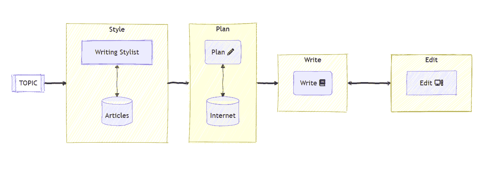
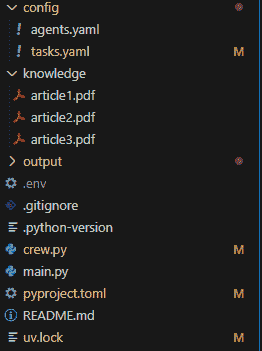
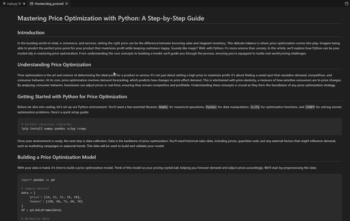

# 使用 CrewAI 创建用于撰写博客文章的 AI 代理

> 原文：[`towardsdatascience.com/creating-an-ai-agent-to-write-blog-posts-with-crewai/`](https://towardsdatascience.com/creating-an-ai-agent-to-write-blog-posts-with-crewai/)

## **<mdspan datatext="el1743790161212" class="mdspan-comment">简介</mdspan>**

我热爱写作。如果你关注我或我的博客，你可能会注意到这一点。因此，我一直在不断产出新的内容，谈论数据科学和人工智能。

我是在几年前发现这个热情的，当时我刚开始我的数据科学之路，学习和提升我的技能。当时，我听到该领域的一些经验丰富的专业人士说，一个好的学习技巧是练习新技能并在某处写下来，教授你所学的任何东西。

此外，我刚刚搬到美国，这里没有人认识我。所以我必须从某个地方开始，在这个竞争激烈的市场中塑造我的专业形象。我记得我跟我表兄谈过，他也在科技行业，他告诉我：“写关于你经历的文章。告诉人们你在做什么。”所以我做了。

我从未停止过。

快进到 2025 年，现在我几乎有两百篇已发表的文章，其中许多发表在《Towards Data Science》上，还有一本出版的书和良好的受众。

写作在数据科学领域对我帮助很大。

最近，我对自然语言处理和大型语言模型主题产生了浓厚的兴趣。了解这些现代模型的工作原理非常迷人。

这个兴趣引导我尝试了代理式 AI。因此，我学习了**CrewAI**，这是一个简单且开源的包，它以有趣且简单的方式帮助我们以少量代码构建 AI 代理。我决定通过创建一个代理团队来撰写博客文章来测试它，并看看结果如何。

在这篇文章中，我们将学习如何创建这些代理，并使它们共同工作以生成一篇简单的博客文章。

让我们这样做。

## **什么是团队？**

一个**团队**是由两个或更多个代理组成的组合，每个代理都执行一项任务以实现最终目标。

在这个案例研究中，我们将创建一个团队，它将共同努力撰写一篇关于我们提供的特定主题的小型博客文章。



*代理团队的流程。图片由作者提供*

流程是这样的：

1.  我们为代理选择一个特定的主题来撰写。

1.  一旦团队启动，它将前往知识库，阅读我之前写的一些文章，并尝试模仿我的写作风格。然后，它生成一系列指南并将其传递给下一个代理。

1.  接下来，规划代理接管并搜索互联网寻找关于该主题的优秀内容。它创建一个内容计划并将其发送给下一个代理。

1.  写作代理接收写作计划并根据收到的上下文和信息执行它。

1.  最后，内容被传递到最后一个代理，即编辑，他审查内容并返回最终文档作为输出。

在以下部分，我们将看到如何创建它。

## **代码**

CrewAI 是一个优秀的 Python 包，因为它简化了我们的代码。所以，让我们先安装两个需要的包。

`pip install crewai crewai-tools`

接下来，如果你想的话，可以遵循他们 *快速入门* 页面上的说明，只需在终端上输入几个命令，就可以为你创建一个完整的项目结构。基本上，它将安装一些依赖项，生成 CrewAI 项目建议的文件夹结构，以及生成一些.yaml 和.py 文件。

我个人更喜欢自己创建它们，但由你决定。页面列在参考文献部分。

### 文件夹结构

那么，让我们开始吧。

我们将创建以下文件夹：

+   知识

+   config

以及以下文件：

+   在 **config** 文件夹中：创建文件 `agents.yaml` 和 `tasks.yaml`

+   在 **知识** 文件夹中，我将添加我的写作风格文件。

+   在项目 **根目录**：创建 `crew.py` 和 `main.py`。



文件夹结构。图片由作者提供。

确保创建提到的文件夹名称，因为 CrewAI 在**config**文件夹中寻找代理和任务，在**知识**文件夹中寻找知识库。

接下来，让我们设置我们的代理。

### 代理

代理由以下部分组成：

+   **代理名称**：`writer_style`

+   **角色**：LLMs 是好的角色扮演者，所以在这里你可以告诉它们扮演哪个角色。

+   **目标**：告诉模型该代理的目标是什么。

+   **背景故事**：描述这个代理背后的故事，它是谁，它做什么。

```py
writer_style:
  role: >
    Writing Style Analyst
  goal: >
    Thoroughly read the knowledge base and learn the characteristics of the crew, 
    such as tone, style, vocabulary, mood, and grammar.
  backstory: >
    You are an experienced ghost writer who can mimic any writing style.
    You know how to identify the tone and style of the original writer and mimic 
    their writing style.
    Your work is the basis for the Content Writer to write an article on this topic.
```

我不会用所有为这个团队创建的代理来烦扰你。我相信你已经明白了。它是一组提示，解释每个代理将要做什么。所有代理的指令都存储在 agents.yaml 文件中。

想象一下，如果你是一个经理，雇佣人们来组建一个团队。想想你需要哪些类型的专业人士，以及需要哪些技能。

我们需要 4 位专业人士，他们将共同努力实现最终目标：生成书面内容：(1)一位 *作家风格师*，(2)一位 *策划者*，(3)一位 *作家*，以及(4)一位 *编辑*。

如果你想查看它们的设置，只需检查 GitHub 仓库中的完整代码即可。

### 任务

现在，回到经理雇佣人们的类比，一旦我们“雇佣”了整个团队，就是时候分配任务了。我们知道我们想要写一篇博客文章，我们有 4 个代理，但每个代理将做什么。

好吧，这将在`tasks.yaml`文件中进行配置。

为了说明，让我给你看看作家代理的代码。再一次，这些是提示中需要的部分：

+   **任务名称**：`write`

+   **描述**：描述就像告诉专业人士你希望如何执行这项任务，就像我们会告诉新员工如何执行他们的新工作一样。给出精确的指令以获得最佳结果。

+   **预期输出**：这是我们希望看到的结果。请注意，我给出了关于博客文章大小、段落数量和其他有助于我的代理提供预期输出的信息的指令。

+   **执行代理**：在这里，我们指明将执行此任务的代理，使用在`agents.yaml`文件中设置的相同名称。

+   **输出文件**：现在总是适用的，但如果需要，这就是要使用的参数。我们请求一个 Markdown 文件作为输出。

```py
write:
  description: >
    1\. Use the content plan to craft a compelling blog post on {topic}.
    2\. Incorporate SEO keywords naturally.
    3\. Sections/Subtitles are properly named in an engaging manner. Make sure 
    to add Introduction, Problem Statement, Code, Before You Go, References.
    4\. Add a summarizing conclusion - This is the "Before You Go" section.
    5\. Proofread for grammatical errors and alignment with the writer's style.
    6\. Use analogies to make the article more engaging and complex concepts easier
    to understand.
  expected_output: >
    A well-written blog post in markdown format, ready for publication.
    The article must be within a 7 to 12 minutes read.
    Each section must have at least 3 paragraphs.
    When writing code, you will write a snippet of code and explain what it does. 
    Be careful to not add a huge snippet at a time. Break it in reasonable chunks.
    In the examples, create a sample dataset for the code.
    In the Before You Go section, you will write a conclusion that is engaging
    and factually accurate.
  agent: content_writer
  output_file: blog_post.md
```

在定义了代理和任务之后，是时候创建我们的船员流程了。

### 编写船员代码

现在我们将创建文件`crew.py`，我们将把之前展示的流程转换为 Python 代码。

我们首先导入所需的模块。

```py
#Imports
import os
from crewai import Agent, Task, Process, Crew, LLM
from crewai.project import CrewBase, agent, crew, task
from crewai.knowledge.source.pdf_knowledge_source import PDFKnowledgeSource
from crewai_tools import SerperDevTool
```

我们将使用基本的`Agent`、`Task`、`Crew`、`Process`和`LLM`来创建我们的流程。`PDFKnowledgeSource`将帮助第一个代理学习我的写作风格，而 SerperDevTool 是用于搜索互联网的工具。对于这个，请确保您已经从[`serper.dev/signup`](https://serper.dev/signup)获取了 API 密钥。

软件开发中的一个最佳实践是将您的 API 密钥和配置设置与代码分开。我们将使用`.env`文件来做这件事，提供一个安全的地方来存储这些值。以下是将其加载到我们环境中的命令。

```py
from dotenv import load_dotenv
load_dotenv()
```

然后，我们将使用`PDFKnowledgeSource`来显示船员在哪里搜索作者的写作风格。默认情况下，该工具查看您项目的知识文件夹，因此名称相同的重要性。

```py
# Knowledge sources

pdfs = PDFKnowledgeSource(
    file_paths=['article1.pdf',
                'article2.pdf',
                'article3.pdf'
                ]
)
```

现在我们可以设置我们想要为船员使用的 LLM。它可以任何之一。我测试了很多，我最喜欢的是`qwen-qwq-32b`和`gpt-4o`。如果你选择 OpenAI 的，你将需要一个 API 密钥。对于 Qwen-QWQ，只需取消注释代码并注释掉 OpenAI 的行即可。你需要从 Groq 获取一个 API 密钥。

```py
# LLMs

llm = LLM(
    # model="groq/qwen-qwq-32b",
    # api_key= os.environ.get("GROQ_API_KEY"),
    model= "gpt-4o",
    api_key= os.environ.get("OPENAI_API_KEY"),
    temperature=0.4
)
```

现在我们必须创建一个**船员基础**，显示 CrewAI 可以找到代理和任务配置文件的位置。

```py
# Creating the crew: base shows where the agents and tasks are defined

@CrewBase
class BlogWriter():
    """Crew to write a blog post"""
    agents_config = "config/agents.yaml"
    tasks_config = "config/tasks.yaml"
```

### 代理函数

我们现在准备好为每个代理创建代码。它们由一个装饰器`@agent`组成，以表明下面的函数是一个代理。然后我们使用类 Agent，并在配置文件中指定代理的名称，详细程度，1 表示低，2 表示高。您也可以使用布尔值，例如 true 或 false。

最后，我们指定代理是否使用任何工具，以及它将使用什么模型。

```py
# Configuring the agents
    @agent
    def writer_style(self) -> Agent:
        return Agent(
                config=self.agents_config['writer_style'],
                verbose=1,
                knowledge_sources=[pdfs]
                )

    @agent
    def planner(self) -> Agent:
        return Agent(
        config=self.agents_config['planner'],
        verbose=True,
        tools=[SerperDevTool()],
        llm=llm
        )

    @agent
    def content_writer(self) -> Agent:
        return Agent(
        config=self.agents_config['content_writer'],
        verbose=1
        )

    @agent
    def editor(self) -> Agent:
        return Agent(
        config=self.agents_config['editor'],
        verbose=1
        )
```

### 任务函数

下一步是创建任务。与代理类似，我们将创建一个函数并用`@task`装饰它。我们使用类 Task 继承 CrewAI 的功能，然后指向从我们的`tasks.yaml`文件中用于每个创建的任务。如果预期任何输出文件，请使用`output_file`参数。

```py
# Configuring the tasks    

    @task
    def style(self) -> Task:
        return Task(
        config=self.tasks_config['mystyle'],
        )

    @task
    def plan(self) -> Task:
        return Task(
        config=self.tasks_config['plan'],
        )

    @task
    def write(self) -> Task:
        return Task(
        config=self.tasks_config['write'],
        output_file='output/blog_post.md' # This is the file that will be contain the final blog post.
        )

    @task
    def edit(self) -> Task:
        return Task(
        config=self.tasks_config['edit']
        )
```

### 船员

为了将一切整合在一起，我们现在创建一个函数，并用`@crew`装饰器装饰它。这个函数将按执行顺序排列代理和任务，因为这里选择的过程是最简单的：顺序。换句话说，从开始到结束，一切都在顺序中运行。

```py
@crew

    def crew(self) -> Crew:
        """Creates the Blog Post crew"""

        return Crew(
            agents= [self.writer_style(), self.planner(), self.content_writer(), self.editor(), self.illustrator()],
            tasks= [self.style(), self.plan(), self.write(), self.edit(), self.illustrate()],
            process=Process.sequential,
            verbose=True
        )
```

### 运行团队

运行团队非常简单。我们创建一个`main.py`文件，并导入由 Crew Base 创建的`BlogWriter`。然后我们只需使用`crew().kickoff(inputs)`函数来运行它，传递一个包含要用于生成博客文章的输入的字典。

```py
# Script to run the blog writer project

# Warning control
import warnings
warnings.filterwarnings('ignore')
from crew import BlogWriter

def write_blog_post(topic: str):
    # Instantiate the crew
    my_writer = BlogWriter()
    # Run
    result = (my_writer
              .crew()
              .kickoff(inputs = {
                  'topic': topic
                  })
    )

    return result

if __name__ == "__main__":

    write_blog_post("Price Optimization with Python")
```

就在这里。结果是 LLM 创建的不错的博客文章。见下文。



生成的博客文章。GIF 由作者制作。

真是太棒了！

## **在离开之前**

在你离开之前，要知道这篇博客文章是由我 100%创作的。我创建的这个团队是一个我想做的实验，为了更多地了解如何创建 AI 代理并使它们协同工作。而且，就像我说的，我喜欢写作，所以这会是我能够阅读和评估质量的东西。

我的观点是，这个团队还没有做得很好。他们能够成功完成任务，但他们给了我一个非常肤浅的文章和代码。我不会发布这个，但至少它可以作为一个起点，也许吧。

从这里，我鼓励你更多地了解 CrewAI。我参加了他们的免费课程，João de Moura（该包的创建者）向我们展示了如何创建不同类型的团队。这真的很有趣。

### GitHub 仓库

[`github.com/gurezende/Crew_Writer`](https://github.com/gurezende/Crew_Writer)

### 关于我

如果你想了解更多关于我的工作，或者关注我的博客（真的是我！），以下是我的联系人和作品集。

[`gustavorsantos.me`](https://gustavorsantos.me)

## **参考文献**

快速入门 CrewAI)

CrewAI 文档)

GROQ)

OpenAI)

CrewAI 免费课程)
