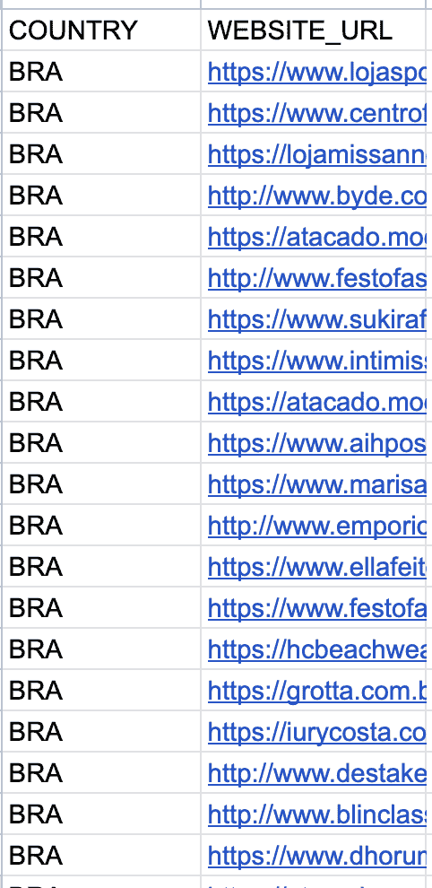
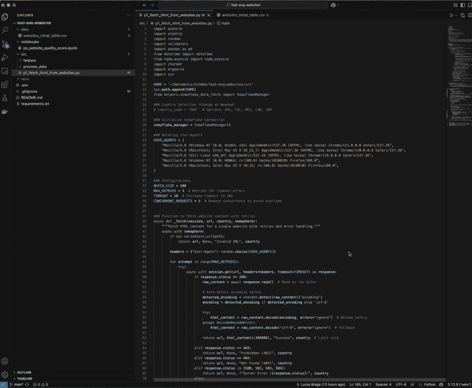
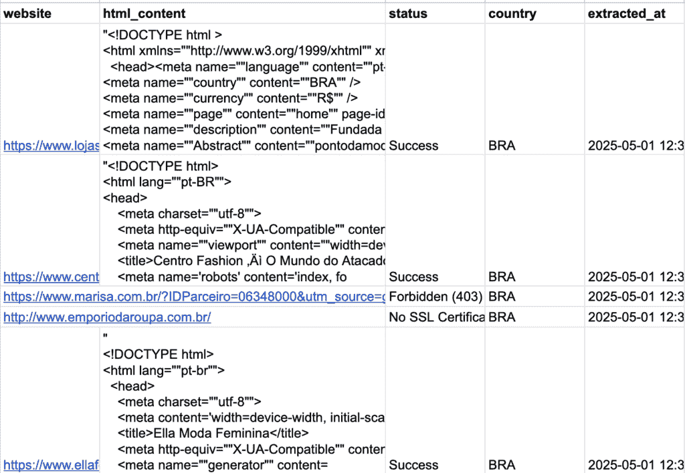
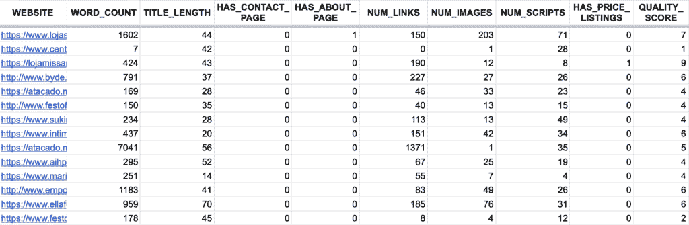

# 按规模进行网站特征工程：PySpark、Python & Snowflake

> 原文：[`towardsdatascience.com/creative-website-feature-engineering-using-pyspark-python-snowflake/`](https://towardsdatascience.com/creative-website-feature-engineering-using-pyspark-python-snowflake/)

## <mdspan datatext="el1746163832240" class="mdspan-comment">引言</mdspan>和问题

想象一下，你面对的是一个包含数千家遍布多个国家的商家的数据库，每家商家都有自己的网站。你的目标是什么？在新的商业提案中识别出最佳的合作伙伴。在规模上手动浏览每个网站是不可能的，因此你需要一种自动化的方式来评估每个商家的在线存在“有多好”。这就是**网站质量评分**：一个数值特征（0-10），它捕捉了网站的专业性、内容深度、可导航性和可见的产品列表及价格等关键方面。通过将此评分集成到你的机器学习管道中，你将获得一个强大的信号，帮助你的模型区分最高质量的商家，并显著提高选择准确性。

**目录**

+   引言和问题

+   技术实现

    +   法律与伦理考量

    +   开始使用

    +   使用 Python 获取 HTML 脚本

    +   在 Pyspark 中分配质量评分脚本

+   结论

    +   免责声明

## 技术实现

### 法律与伦理考量

**成为网络的好公民**。

+   这个爬虫只计算单词、链接、图片、脚本和简单的“联系/关于/价格”标志，它**不**提取或存储任何私人或敏感数据。

+   **负责任地限制**：使用适度的并发性（例如 CONCURRENT_REQUESTS ≤ 10），在批次之间插入小的暂停，并避免对同一域名进行连续打击。

+   **保留策略**：一旦你计算了你的特征或评分，在合理的时间窗口内（例如 7-14 天后）清除原始 HTML。

+   对于非常大的运行，或者如果你计划共享提取的 HTML，请考虑联系网站所有者获取许可或通知他们你的使用情况。

### 开始使用

这是你克隆存储库后的文件夹结构 [`github.com/lucasbraga461/feat-eng-websites/`](https://github.com/lucasbraga461/feat-eng-websites/) :

**代码块 1**. GitHub 存储库文件夹结构

```py
├── src
│   ├── helpers
│   │   └── snowflake_data_fetch.py
│   ├── p1_fetch_html_from_websites.py
│   └── process_data
│       ├── s1_gather_initial_table.sql
│       └── s2_create_table_with_website_feature.sql
├── notebooks
│   └── ps_website_quality_score.ipynb
├── data
│   └── websites_initial_table.csv
├── README.md
├── requirements.txt
└── venv
└── .gitignore
└── .env
```

你的数据集理想情况下应该在 Snowflake 中，以下是如何准备它的一个想法，如果它来自不同的表，请参考 src/process_data/s1_gather_initial_table.sql，以下是其片段：

**代码块 2**. s1_gather_initial_table.sql

```py
CREATE OR REPLACE TABLE DATABASE.SCHEMA.WEBSITES_INITIAL_TABLE AS
(
SELECT
   DISTINCT COUNTRY, WEBSITE_URL
FROM DATABASE.SCHEMA.COUNTRY_ARG_DATASET
WHERE WEBSITE_URL IS NOT NULL
) UNION ALL (

SELECT
   DISTINCT COUNTRY, WEBSITE_URL
FROM DATABASE.SCHEMA.COUNTRY_BRA_DATASET
WHERE WEBSITE_URL IS NOT NULL
) UNION ALL (
[...]
SELECT
   DISTINCT COUNTRY, WEBSITE_URL
FROM DATABASE.SCHEMA.COUNTRY_JAM_DATASET
WHERE WEBSITE_URL IS NOT NULL
)
;
```

这就是初始表应该看起来像的：



**图 1**. 初始表

### 使用 Python 获取 HTML 脚本

数据准备就绪后，这就是你如何调用它的方法，比如说你的数据在 Snowflake 中：

**代码块 3**. p1_fetch_html_from_websites.py 使用 Snowflake 数据集

```py
cd ~/Document/GitHub/feat-eng-websites
python3 src/p1_fetch_html_from_websites.py -c BRA --use_snowflake
```

+   Python 脚本期望 Snowflake 表位于 DATABASE.SCHEMA.WEBSITES_INITIAL_TABLE，你可以根据你的用例在代码中进行调整。

这将在您的浏览器中打开一个窗口，要求您对 Snowflake 进行身份验证。一旦您进行身份验证，它将从指定的表中提取数据，并继续获取网站内容。

如果您选择从 CSV 文件中提取这些数据，则不要使用末尾的标志，并按以下方式调用：

**代码块 4**. 使用 CSV 数据集的 p1_fetch_html_from_websites.py

```py
cd ~/Document/GitHub/feat-eng-websites
python3 src/p1_fetch_html_from_websites.py -c BRA
```

**GIF 1**. 运行 p1_fetch_html_from_websites.py



这就是为什么与更基本的方法相比，此脚本在抓取网站内容方面非常强大，请参见表 1：

**表 1**. 与基本实现相比，此抓取 HTML 脚本的优点

| **技术** | **基本方法** | **此脚本** p1_fetch_html_from_websites.py |
| --- | --- | --- |
| **HTTP 抓取** | 逐个调用阻塞 requests.get() | 使用 asyncio + aiohttp 进行异步 I/O，以并行发出多个请求并重叠网络等待时间 |
| **用户代理** | 所有请求使用单个默认 UA 头 | 通过一系列真实的浏览器 UA 字符串进行轮换，以规避基本的机器人检测和限制 |
| **批处理** | 一次性加载和处理整个 URL 列表 | 通过 BATCH_SIZE 分割成块，以便您可以检查点、限制内存使用并在运行过程中恢复 |
| **重试与超时** | 依赖库默认设置或在服务器慢/无响应时崩溃 | 显式设置 MAX_RETRIES 和 TIMEOUT 以重试短暂失败并限制每个请求的等待时间 |
| **并发限制** | 顺序或无限制的并行调用（存在超载风险） | 使用 CONCURRENT_REQUESTS + aiohttp.TCPConnector + asyncio.Semaphore 来限制最大并发连接数 |
| **事件循环** | 重复使用单个循环，重启时可能会遇到“绑定到不同循环”的错误 | 每个批次创建一个新的 asyncio 事件循环，以避免循环/信号量绑定错误并确保隔离 |

通常情况下，将原始 HTML 存储在合适的数据库（如 Snowflake、BigQuery、Redshift、Postgres 等）中，而不是 CSV 文件中会更好。单页的 HTML 内容很容易超过电子表格的限制（例如，Google Sheets 每个单元格最多只能容纳 50,000 个字符），而管理数百页内容会使 CSV 文件膨胀并减慢速度。虽然我们在这里提供了 CSV 选项以供快速演示或最小化设置，但大规模抓取和特征工程在可扩展的数据仓库（如 Snowflake）中运行时，其可靠性和性能要远高于在 CSV 文件中。

一旦您运行了 BRA、ARG 和 JAM，您的数据文件夹将看起来像这样

**代码块 5**. 运行后为 ARG、BRA 和 JAM 创建的文件夹结构

```py
├── data
│   ├── website_scraped_data_ARG.csv
│   ├── website_scraped_data_BRA.csv
│   ├── website_scraped_data_JAM.csv
│   └── websites_initial_table.csv
```

参考图 2 以可视化第一个脚本生成的输出，即可视化 table website_scraped_data_BRA。请注意，其中一列是 html_content，这是一个非常大的字段，因为它包含了整个网站的 HTML 内容。



**图 2**. 使用第一个 Python 脚本生成的 table website_scraped_data_BRA 示例

### 在 Pyspark 中分配质量评分脚本

由于每个页面的 HTML 可能很大，而且你可能会有数百或数千个页面，因此你无法有效地处理或存储所有这些原始文本到平面文件中。相反，我们通过 Snowpark（Snowflake 的 PySpark 引擎）将任务交给 Spark 进行可扩展的特征提取。请参阅 notebooks/ps_website_quality_score.ipynb 以获取一个可运行的示例：只需在 Snowflake 中选择 Python 内核并导入内置的 Snowpark 库来启动你的 Spark 会话（参见代码块 6）。

**代码块 6**. 运行 ARG、BRA 和 JAM 后的文件夹结构

```py
import pandas as pd
from bs4 import BeautifulSoup
import re
from tqdm import tqdm

import snowflake.snowpark as snowpark
from snowflake.snowpark.functions import col, lit, udf
from snowflake.snowpark.context import get_active_session
session = get_active_session()
```

每个市场都有自己的语言和不同的惯例，因此我们将所有这些规则打包成一个简单的国家特定配置。对于每个国家，我们定义联系/关于关键词和表示“良好”商家网站的价模式正则表达式，然后将脚本指向相应的 Snowflake 输入和输出表。这使得特征提取器完全数据驱动，对于每个地区只需更改配置即可重用相同的代码。

**代码块 7**. 配置文件

```py
country_configs = {
   "ARG": {
       "name": "Argentina",
       "contact_keywords": ["contacto", "contáctenos", "observaciones"],
       "about_keywords": ["acerca de", "sobre nosotros", "quiénes somos"],
       "price_patterns": [r'ARS\s?\d+', r'\$\s?\d+', r'\d+\.\d{2}\s?\$'],
       "input_table": "DATABASE.SCHEMA.WEBSITE_SCRAPED_DATA_ARG",
       "output_table": "DATABASE.SCHEMA.WEBSITE_QUALITY_SCORES_ARG"
   },
   "BRA": {
       "name": "Brazil",
       "contact_keywords": ["contato", "fale conosco", "entre em contato"],
       "about_keywords": ["sobre", "quem somos", "informações"],
       "price_patterns": [r'R\$\s?\d+', r'\d+\.\d{2}\s?R\$'],
       "input_table": "DATABASE.SCHEMA.WEBSITE_SCRAPED_DATA_BRA",
       "output_table": "DATABASE.SCHEMA.WEBSITE_QUALITY_SCORES_BRA"
   },
[...]
```

在我们可以在 Snowflake 内部注册和使用我们的 Python 爬虫逻辑之前，我们首先通过运行代码块 8 中的 DDL 创建一个 **阶段**，一个持久存储区域。这将在你的 DATABASE.SCHEMA 下创建一个名为 @STAGE_WEBSITES 的命名位置，我们将上传 UDF 包（包括 BeautifulSoup 和 lxml 等依赖项）。一旦阶段存在，我们就在那里部署 extract_features_udf，使其对任何 Snowflake 会话都可用于 HTML 解析和特征提取。最后，我们设置 country_code 变量以启动特定国家的管道，然后根据需要循环其他国家代码。

**代码块 8**. 创建一个阶段文件夹以保存创建的 UDF

```py
-- CREATE STAGE DATABASE.SCHEMA.STAGE_WEBSITES;

country_code = "BRA"
```

在此代码部分，请参阅代码块 9，我们将定义一个名为“extract_features_udf”的 UDF 函数，该函数将从 HTML 内容中提取信息，以下是此部分代码的功能：

+   定义名为“extract_features_udf”的 Snowpark UDF，它位于之前创建的 Snowflake 阶段文件夹中

+   使用著名的 BeautifulSoup 库解析原始 HTML

+   提取文本特征：

    +   总字数

    +   页面标题长度

    +   “联系”和“关于”页面的标志。

+   提取结构特征：

    +   <a> 链接的数量

    +    图像的数量

    +   <script> 标签的数量

+   通过在文本中寻找任何价格模式来检测产品列表

+   返回包含所有这些计数/标志的字典，如果 HTML 为空或发生任何错误，则为零

**代码块 9**. 提取 HTML 内容的函数

```py
@udf(name="extract_features_udf",
    is_permanent=True,
    replace=True,
    stage_location="@STAGE_WEBSITES",
    packages=["beautifulsoup4", "lxml"])
def extract_features(html_content: str, CONTACT_KEYWORDS: str, ABOUT_KEYWORDS: str, PRICE_PATTERNS: list) -> dict:
   """Extracts text, structure, and product-related features from HTML."""
   if not html_content:
       return {
           "word_count": 0, "title_length": 0, "has_contact_page": 0,
           "has_about_page": 0, "num_links": 0, "num_images": 0,
           "num_scripts": 0, "has_price_listings": 0
       }

   try:
       soup = BeautifulSoup(html_content, 'lxml')
       # soup = BeautifulSoup(html_content[:MAX_HTML_SIZE], 'lxml')

       # Text Features
       text = soup.get_text(" ", strip=True)
       word_count = len(text.split())

       title = soup.title.string.strip() if soup.title and soup.title.string else ""
       has_contact = bool(re.search(CONTACT_KEYWORDS, text, re.I))
       has_about = bool(re.search(ABOUT_KEYWORDS, text, re.I))

       # Structural Features
       num_links = len(soup.find_all("a"))
       num_images = len(soup.find_all("img"))
       num_scripts = len(soup.find_all("script"))

       # Product Listings Detection
       # price_patterns = [r'€\s?\d+', r'\d+\.\d{2}\s?€', r'\$\s?\d+', r'\d+\.\d{2}\s?\$']
       has_price = any(re.search(pattern, text, re.I) for pattern in PRICE_PATTERNS)

       return {
           "word_count": word_count, "title_length": len(title), "has_contact_page": int(has_contact),
           "has_about_page": int(has_about), "num_links": num_links, "num_images": num_images,
           "num_scripts": num_scripts, "has_price_listings": int(has_price)
       }

   except Exception:
       return {"word_count": 0, "title_length": 0, "has_contact_page": 0,
               "has_about_page": 0, "num_links": 0, "num_images": 0,
               "num_scripts": 0, "has_price_listings": 0}
```

pyspark 笔记本中的最后部分“处理和生成输出表”执行四个主要任务：

首先，它将 UDF extract_features_udf 应用到原始 HTML 上，生成一个包含每个页面的小型计数/标志字典的单一 **features** 列，参见代码块 10。

**代码块 10**. 将 UDF 应用到每一行

```py
df_processed = df.with_column(
    "features", 
    extract_features(col("HTML_CONTENT"))
)
```

其次，它将 features 字典中的每个键转换为 DataFrame 中的单独列（因此你得到单独的 word_count、num_links 等），参见代码块 11。

**代码块 11**. 将该字典展开为实际列

```py
df_final = df_processed.select(
    col("WEBSITE"),
    col("features")["word_count"].alias("word_count"),
    ...,
    col("features")["has_price_listings"].alias("has_price_listings")
)
```

第三，根据我定义的业务规则，它通过为每个特征分配分数（例如，单词计数阈值、是否存在联系/关于页面、产品列表）来构建一个 0-10 分的评分，请参阅代码块 12。

**代码块 12**. 计算单个质量评分

```py
df_final = df_final.with_column(
    "quality_score",
    ( (col("word_count") > 300).cast("int")*2
      + (col("word_count") > 100).cast("int")
      + (col("title_length") > 10).cast("int")
      + col("has_contact_page")
      + col("has_about_page")
      + (col("num_links") > 10).cast("int")
      + (col("num_images") > 5).cast("int")
      + col("has_price_listings")*3
    )
)
```

最后，它将最终表写回到 Snowflake（替换任何现有表），这样你就可以稍后查询或连接这些质量评分。

**代码块 13**. 将输出表写入 Snowflake

```py
df_final.write.mode("overwrite").save_as_table(OUTPUT_TABLE)
```



**图** 3. 最终表，DATABASE.SCHEMA.WEBSITE_QUALITY_SCORES_BRA 的输出

## 结论

一旦计算并存储，网站质量评分就成为了几乎任何预测模型的直接输入，无论你是训练逻辑回归、随机森林还是深度神经网络。作为你最强的特征之一，它量化了商家的在线成熟度和可靠性，补充了其他数据，如销售量或客户评价。通过将这个从网络中提取的信号与你的现有指标相结合，你将能够更有效地对合作伙伴进行排名、筛选和推荐，并最终推动更好的业务成果。

GitHub 仓库实现：

+   [`github.com/lucasbraga461/feat-eng-websites/`](https://github.com/lucasbraga461/feat-eng-websites/)

### 免责声明

本文中的截图和图表（例如，Snowflake 查询结果）均由作者创建。所有数字都不是来自真实业务数据，而是为了说明目的而手动生成的。同样，所有 SQL 脚本都是手工制作的示例；它们**不是**从任何实际环境中提取的，而是设计得与使用**Snowflake**的公司可能遇到的情况非常相似。
