# 目标检测模型的定制训练流程

> 原文：[`towardsdatascience.com/custom-training-pipeline-for-object-detection-models/`](https://towardsdatascience.com/custom-training-pipeline-for-object-detection-models/)

如果你想要从头开始编写整个目标检测训练流程，以便理解每个步骤并能够自定义它，那会怎样？这正是我着手要做的事情。我检查了几个著名的对象检测流程，并设计了一个最适合我需求和任务的流程。感谢[Ultralytics](https://github.com/ultralytics/ultralytics)、[YOLOx](https://github.com/Megvii-BaseDetection/YOLOX)、[DAMO-YOLO](https://github.com/tinyvision/DAMO-YOLO)、[RT-DETR](https://github.com/lyuwenyu/RT-DETR)和[D-FINE](https://github.com/Peterande/D-FINE)仓库，我利用它们来深入了解各种设计细节。最终，我在自定义流程中实现了[SoTA 实时目标检测模型 D-FINE](https://paperswithcode.com/sota/real-time-object-detection-on-coco?p=d-fine-redefine-regression-task-in-detrs-as)。

## 计划

+   数据集，增强和转换：

    +   Mosaic（带有仿射变换）

    +   Mixup 和 Cutout

    +   其他带有边界框的增强

    +   Letterbox 与简单调整大小

+   训练：

    +   优化器

    +   调度器

    +   EMA

    +   批量累积

    +   AMP

    +   梯度裁剪

    +   记录

+   指标：

    +   mAPs 来自 TorchMetrics / cocotools

    +   如何计算精确度，召回率和 IoU？

+   为您的案例选择一个合适的解决方案

+   实验

+   注意数据预处理

+   从哪里开始

## 数据集

数据集处理通常是您开始工作的第一件事。在目标检测中，您需要加载您的图像和注释。注释通常以 COCO 格式存储为 json 文件或 YOLO 格式，每个图像都有一个 txt 文件。让我们看看 YOLO 格式：每一行都是这样的结构：`class_id`，`x_center`，`y_center`，`width`，`height`，其中 bbox 值在 0 和 1 之间归一化。

当你有了你的图像和 txt 文件后，你可以编写你的数据集类，这里没有太多技巧。加载所有内容，转换（包括增强）并在训练过程中返回。我更喜欢通过为每个分割创建一个 CSV 文件来分割数据，然后在 Dataloader 类中读取它，而不是将文件物理移动到 train/val/test 文件夹中。这是帮助我的用例的定制化示例。

## 增强

首先，在增强图像进行目标检测时，对边界框应用相同的转换至关重要。为了舒适地做到这一点，我使用了[Albumentations](https://albumentations.ai)库。例如：

```py
    def _init_augs(self, cfg) -> None:
        if self.keep_ratio:
            resize = [
                A.LongestMaxSize(max_size=max(self.target_h, self.target_w)),
                A.PadIfNeeded(
                    min_height=self.target_h,
                    min_width=self.target_w,
                    border_mode=cv2.BORDER_CONSTANT,
                    fill=(114, 114, 114),
                ),
            ]

        else:
            resize = [A.Resize(self.target_h, self.target_w)]
        norm = [
            A.Normalize(mean=self.norm[0], std=self.norm[1]),
            ToTensorV2(),
        ]

        if self.mode == "train":
            augs = [
                A.RandomBrightnessContrast(p=cfg.train.augs.brightness),
                A.RandomGamma(p=cfg.train.augs.gamma),
                A.Blur(p=cfg.train.augs.blur),
                A.GaussNoise(p=cfg.train.augs.noise, std_range=(0.1, 0.2)),
                A.ToGray(p=cfg.train.augs.to_gray),
                A.Affine(
                    rotate=[90, 90],
                    p=cfg.train.augs.rotate_90,
                    fit_output=True,
                ),
                A.HorizontalFlip(p=cfg.train.augs.left_right_flip),
                A.VerticalFlip(p=cfg.train.augs.up_down_flip),
            ]

            self.transform = A.Compose(
                augs + resize + norm,
                bbox_params=A.BboxParams(format="pascal_voc", label_fields=["class_labels"]),
            )

        elif self.mode in ["val", "test", "bench"]:
            self.mosaic_prob = 0
            self.transform = A.Compose(
                resize + norm,
                bbox_params=A.BboxParams(format="pascal_voc", label_fields=["class_labels"]),
            )
```

其次，有许多有趣且非平凡的增强：

+   [Mosaic](https://arxiv.org/pdf/2004.10934)。想法很简单，让我们取几幅图像（例如 4 幅），并将它们堆叠成一个网格（2×2）。然后让我们进行一些仿射变换，并将其输入到模型中。

+   [MixUp](https://arxiv.org/pdf/1905.04899)。最初用于图像分类（它的工作效果令人惊讶）。想法——让我们取两张图片，以一定比例的透明度将它们叠加在一起。在分类模型中，这通常意味着如果一张图片是 20%透明的，另一张是 80%，那么模型应该预测类别 1 为 80%，类别 2 为 20%。在目标检测中，我们只是将更多的目标放入一张图片中。

+   **Cutout**。Cutout 涉及通过用黑色像素替换图像的一部分来帮助模型学习更鲁棒的特征。

我看到马赛克通常在第一个大约 90%的 epoch 中应用概率为 1.0。然后，通常关闭，并使用较轻的增强。同样的想法也适用于 mixup，但我看到它被使用的频率要低得多（对于最受欢迎的检测框架 Ultralytics，默认是关闭的。对于另一个框架，我看到 P=0.15）。Cutout 似乎使用得较少。

你可以在这些两篇文章中了解更多关于这些增强的信息：[1](https://arxiv.org/pdf/2004.10934)，[2](https://arxiv.org/pdf/1905.04899)。

只开启马赛克的效果就相当不错（没有马赛克的较暗版本 mAP 为 0.89，而开启马赛克为 0.92，在一个真实数据集上测试）

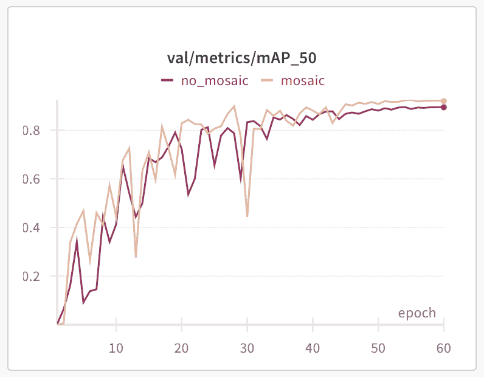

作者在自定义数据集上的指标，记录在 Wandb 中

## 信箱模式或简单调整大小？

在训练过程中，你通常将输入图像调整到正方形。模型通常使用 640×640，并在 COCO 数据集上进行基准测试。而且有两种主要的方法可以达到这个目标：

+   简单地调整到目标大小。

+   信箱模式：将最长边调整到目标大小（例如，640），保留宽高比，并将较短的边填充到目标尺寸。

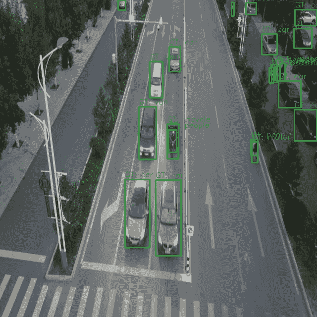

从[VisDrone](https://github.com/VisDrone/VisDrone-Dataset)数据集中采样带有真实边界框的图像，使用简单调整大小函数进行预处理

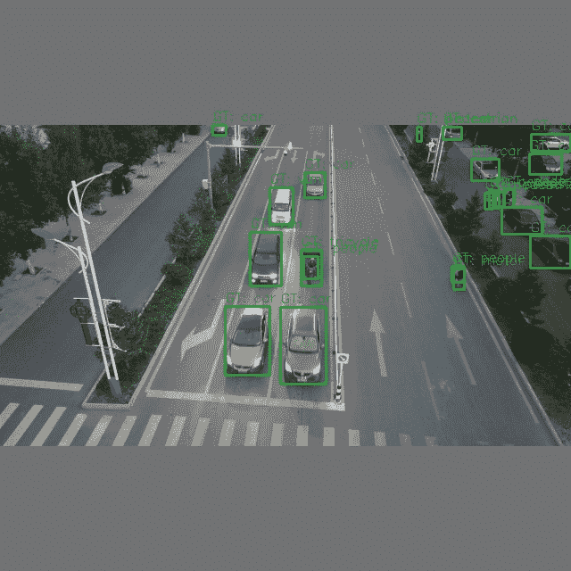

从[VisDrone](https://github.com/VisDrone/VisDrone-Dataset)数据集中采样带有真实边界框的图像，使用信箱模式进行预处理

两种方法都有优点和缺点。让我们先讨论它们，然后我会分享我进行的比较这些方法的多次实验结果。

简单调整大小：

+   计算应用于整个图像，没有无用的填充。

+   “动态”宽高比可能充当正则化的一种形式。

+   推理预处理与训练预处理完美匹配（排除增强）。

+   杀死了真实几何。调整大小扭曲可能会影响图像中的空间关系。尽管认为固定的宽高比很重要可能是人类的偏见。

信箱模式：

+   保留真实宽高比。

+   在推理过程中，如果你不损失精度（某些模型可能会退化），你可以剪掉填充并不在正方形图像上运行。

+   可以在更大的图像尺寸上训练，然后通过裁剪填充进行推理，以获得与简单缩放相同的推理延迟。例如，640×640 与 832×480。第二个将保持纵横比，物体将出现+-相同的大小。

+   计算资源的一部分被浪费在灰色填充上。

+   物体会变小。

如何测试它并决定使用哪一个？

使用以下参数从头开始训练：

+   简单缩放，640×640

+   保持纵横比，最大边长 640，并添加填充（作为基线）

+   保持纵横比，更大的图像尺寸（例如最大边长 832），然后添加填充。然后推理 3 个模型。当保持纵横比时——在推理过程中裁剪填充。比较延迟和指标。

上面的示例图像裁剪填充后的示例（640×384）：

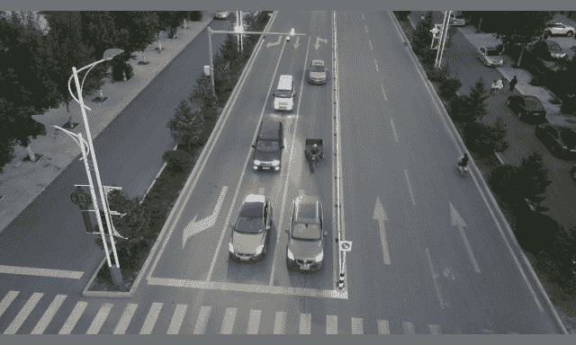

从[VisDrone](https://github.com/VisDrone/VisDrone-Dataset)数据集采样

当你保持比例并通过裁剪灰色填充进行推理时，会发生以下情况：

```py
params                  |   F1 score  |  latency (ms).   |
------------------------+-------------+------------------|
ratio kept, 832         |    0.633    |        33.5      |
no ratio, 640x640       |    0.617    |        33.4      |
```

如上图所示，在更大的尺寸（832）下保持纵横比进行训练，与简单的 640×640 缩放相比，实现了更高的 F1 分数（0.633），而延迟保持相似。请注意，如果推理过程中移除填充，某些模型可能会退化，这破坏了整个技巧的目的，也许 letterbox 也不例外。

这是什么意思：

从头开始训练：

+   在相同的图像尺寸下，简单的缩放比 letterbox 有更高的精度。

+   对于 letterbox，如果你在推理过程中**裁剪填充且模型没有失去精度**——你可以使用更大的图像尺寸进行训练和推理以匹配延迟，并获得略高的指标（如上面的示例所示）。

使用预训练权重初始化的训练：

+   如果你微调——使用与预训练模型相同的策略，如果数据集没有太大差异，应该会给你带来最佳结果。

对于 D-FINE，我在推理过程中裁剪填充时看到较低的指标。此外，模型是在简单的缩放上预训练的。对于 YOLO，letterbox 通常是一个不错的选择。

## 训练

每个机器学习工程师都应该知道如何实现训练循环。尽管 PyTorch 做了很多繁重的工作，但你可能会因为可用的设计选择数量而感到不知所措。以下是一些需要考虑的关键组件：

+   [优化器](https://pytorch.org/docs/stable/optim.html)——从 Adam/AdamW/SGD 开始。

+   [调度器](https://pytorch.org/docs/stable/optim.html#how-to-adjust-learning-rate)——对于 Adams，固定学习率可能可以，但请查看 StepLR、CosineAnnealingLR 或 OneCycleLR。

+   [EMA](https://arxiv.org/abs/1806.04498)。这是一种很好的技术，可以使训练更加平滑，有时可以达到更高的指标。在每个批次之后，你通过计算主模型权重的指数移动平均来更新一个次要模型（通常称为 EMA 模型）。

+   [批积累](https://lightning.ai/docs/pytorch/stable/advanced/training_tricks.html#accumulate-gradients)在你的 vRAM 非常有限时很有用。训练基于 transformer 的对象检测模型意味着在某些情况下，即使是中等大小的模型，你只能将 4 张图像放入 vRAM 中。通过在执行优化器步骤之前累积多个批次的梯度，你实际上模拟了一个更大的批次大小，而不会超过你的内存限制。另一个用例是，当你的数据集中有很多负样本（没有目标对象的图像）且批次大小较小时，你可能会遇到不稳定的训练。批积累也可以在这里提供帮助。

+   [AMP](https://pytorch.org/docs/stable/notes/amp_examples.html)在适用的情况下自动使用半精度。它减少了 vRAM 的使用，并使训练更快（如果你有支持它的 GPU）。我看到 vRAM 使用量减少了 40%，并且至少训练速度提高了 15%。

+   [梯度裁剪](https://pytorch.org/docs/stable/generated/torch.nn.utils.clip_grad_norm_.html)。通常，当你使用 AMP 时，训练可能会变得不稳定。这也可能发生在较高的学习率下。当你的梯度太大时，训练将失败。梯度裁剪将确保梯度永远不会超过某个特定值。

+   记录日志。尝试使用[Hydra](https://hydra.cc/docs/intro/)进行配置，以及类似[Weights and Biases](https://wandb.ai/site/)或[Clear ML](https://clear.ml)的实验跟踪工具。同时，也要在本地记录一切。保存你的最佳权重和指标，这样在进行了多次实验之后，你总能找到你需要的所有关于模型的信息。

```py
    def train(self) -> None:
        best_metric = 0
        cur_iter = 0
        ema_iter = 0
        one_epoch_time = None

        def optimizer_step(step_scheduler: bool):
            """
            Clip grads, optimizer step, scheduler step, zero grad, EMA model update
            """
            nonlocal ema_iter
            if self.amp_enabled:
                if self.clip_max_norm:
                    self.scaler.unscale_(self.optimizer)

torch.nn.utils.clip_grad_norm_(self.model.parameters(), self.clip_max_norm)
                self.scaler.step(self.optimizer)
                self.scaler.update()

            else:
                if self.clip_max_norm:

torch.nn.utils.clip_grad_norm_(self.model.parameters(), self.clip_max_norm)
                self.optimizer.step()

            if step_scheduler:
                self.scheduler.step()
            self.optimizer.zero_grad()

            if self.ema_model:
                ema_iter += 1
                self.ema_model.update(ema_iter, self.model)

        for epoch in range(1, self.epochs + 1):
            epoch_start_time = time.time()
            self.model.train()
            self.loss_fn.train()
            losses = []

            with tqdm(self.train_loader, unit="batch") as tepoch:
                for batch_idx, (inputs, targets, _) in enumerate(tepoch):
                    tepoch.set_description(f"Epoch {epoch}/{self.epochs}")
                    if inputs is None:
                        continue
                    cur_iter += 1

                    inputs = inputs.to(self.device)
                    targets = [
                        {
                            k: (v.to(self.device) if (v is not None and hasattr(v, "to")) else v)
                            for k, v in t.items()
                        }
                        for t in targets
                    ]

                    lr = self.optimizer.param_groups[0]["lr"]

                    if self.amp_enabled:
                        with autocast(self.device, cache_enabled=True):
                            output = self.model(inputs, targets=targets)
                        with autocast(self.device, enabled=False):
                            loss_dict = self.loss_fn(output, targets)
                        loss = sum(loss_dict.values()) / self.b_accum_steps
                        self.scaler.scale(loss).backward()

                    else:
                        output = self.model(inputs, targets=targets)
                        loss_dict = self.loss_fn(output, targets)
                        loss = sum(loss_dict.values()) / self.b_accum_steps
                        loss.backward()

                    if (batch_idx + 1) % self.b_accum_steps == 0:
                        optimizer_step(step_scheduler=True)

                    losses.append(loss.item())

                    tepoch.set_postfix(
                        loss=np.mean(losses) * self.b_accum_steps,
                        eta=calculate_remaining_time(
                            one_epoch_time,
                            epoch_start_time,
                            epoch,
                            self.epochs,
                            cur_iter,
                            len(self.train_loader),
                        ),
                        vram=f"{get_vram_usage()}%",
                    )

            # Final update for any leftover gradients from an incomplete accumulation step
            if (batch_idx + 1) % self.b_accum_steps != 0:
                optimizer_step(step_scheduler=False)

            wandb.log({"lr": lr, "epoch": epoch})

            metrics = self.evaluate(
                val_loader=self.val_loader,
                conf_thresh=self.conf_thresh,
                iou_thresh=self.iou_thresh,
                path_to_save=None,
            )

            best_metric = self.save_model(metrics, best_metric)
            save_metrics(
                {}, metrics, np.mean(losses) * self.b_accum_steps, epoch, path_to_save=None
            )

            if (
                epoch >= self.epochs - self.no_mosaic_epochs
                and self.train_loader.dataset.mosaic_prob
            ):
                self.train_loader.dataset.close_mosaic()

            if epoch == self.ignore_background_epochs:
                self.train_loader.dataset.ignore_background = False
                logger.info("Including background images")

            one_epoch_time = time.time() - epoch_start_time
```

## 指标

对于对象检测，每个人都使用 mAP，并且我们衡量这些指标的方法已经标准化。使用[pycocotools](https://github.com/cocodataset/cocoapi/tree/master/PythonAPI/pycocotools)或[faster-coco-eval](https://github.com/MiXaiLL76/faster_coco_eval)或[TorchMetrics](https://lightning.ai/docs/torchmetrics/stable/)进行 mAP。但 mAP 意味着我们检查模型在所有置信度水平上的整体表现。mAP0.5 意味着 IoU 阈值是 0.5（低于这个值的所有预测都被认为是错误的）。我个人并不完全喜欢这个指标，因为在生产中我们总是使用 1 个置信度阈值。那么为什么不在设置阈值后计算指标呢？这就是为什么我也总是计算混淆矩阵，并根据它计算精确度、召回率、F1 分数和 IoU。

但逻辑也可能很复杂。以下是我使用的方法：

+   1 个 GT（地面真实）对象等于 1 个预测对象，如果 IoU 大于阈值，则它是 TP。如果没有对 GT 对象进行预测，则是 FN。如果没有 GT 对预测，则是 FP。

+   1 个 GT 应该只被匹配 1 次预测。如果有 2 个预测针对 1 个 GT，那么我计算 1 个 TP 和 1 个 FP。

+   类别 ID 也应该匹配。如果模型预测的是 class_0，而 GT 是 class_1，这意味着 FP 增加 1，FN 增加 1。

在训练期间，我根据与任务相关的指标选择最佳模型。我通常考虑 mAP50 和 F1 分数的平均值。

## 模型和损失

我在这里没有讨论模型架构和损失函数。它们通常是一起使用的，你可以选择你喜欢的任何模型并将其集成到你的流程中，包括上面所有内容。我就是这样用 DAMO-YOLO 和 D-FINE 做的，结果很棒。

### 为你的情况选择一个合适的解决方案

许多人使用 Ultralytics，然而它有 GPLv3 许可证，除非你的代码是开源的，否则你不能将其用于商业项目。因此，人们通常会考虑 Apache 2 和 MIT 许可的模型。查看[D-FINE](https://github.com/Peterande/D-FINE)、[RT-DETR2](https://github.com/lyuwenyu/RT-DETR)或一些 YOLO 模型，如[Yolov9](https://github.com/MultimediaTechLab/YOLO)。

如果你想在流程中自定义某些内容？当你从头开始构建一切时，你应该有完全的控制权。否则，尝试选择一个代码库较小的项目，因为一个大的项目可能会使隔离和修改单个组件变得困难。

如果你不需要任何自定义，并且你的使用受到 Ultralytics 许可证的允许——这是一个很好的仓库，因为它支持多个任务（分类、检测、实例分割、关键点、方向包围盒），模型效率高且得分良好。再次强调，如果你不是做非常具体的事情，你可能不需要自定义训练流程。

## 实验

让我分享一些我使用 D-FINE 模型和自定义训练流程得到的结果，并与 Ultralytics YOLO11 模型在[VisDrone-DET2019 数据集](https://paperswithcode.com/dataset/visdrone)上的结果进行比较。

从零开始训练：

```py
model                     |  mAP 0.50\.   |    F1-score  |  Latency (ms)  |
--------------------------+--------------+--------------+-------------------------|
YOLO11m TRT               |     0.417    |     0.568    |       15.6     |
YOLO11m TRT dynamic       |     -        |     0.568    |       13.3     |
YOLO11m OV                |      -       |     0.568    |      122.4     |
D-FINEm TRT               |    0.457     |     0.622    |       16.6     |
D-FINEm OV                |    0.457     |     0.622    |       115.3    |
```

从 COCO 预训练：

```py
model          |    mAP 0.50   |   F1-score  |
---------------+---------------|-------------|
YOLO11m        |     0.456     |    0.600    |
D-FINEm        |     0.506     |    0.649    |
```

延迟是在 RTX 3060 上使用 TensorRT（TRT），静态图像大小 640×640 的情况下测量的，包括`cv2.imread.`的时间。OpenVINO（OV）在 i5 14000f（无 iGPU）上。动态意味着在推理期间，灰色填充被裁剪以加快推理速度。它与 YOLO11 TensorRT 版本一起工作。更多关于裁剪灰色填充的细节请参阅（*Letterbox 或简单调整大小*部分）。

一个令人失望的结果是英特尔 N100 CPU 上带有 iGPU（$150 miniPC）的延迟：

```py
model            | Latency (ms) |
-----------------+--------------|
YOLO11m          |       188    |
D-FINEm          |       272    |
D-FINEs          |       11     |
```

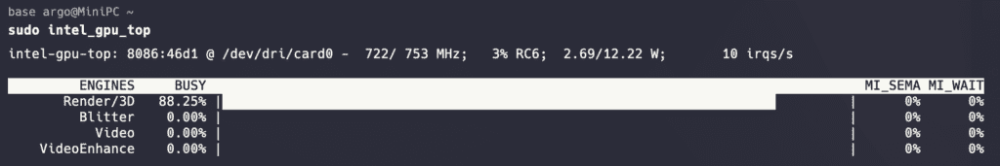

作者在 n100 机器上模型推理期间的 iGPU 使用截图

在这里，传统的卷积神经网络明显更快，这可能是由于 OpenVINO 对 GPU 的优化。

总体来说，我进行了超过 30 次实验，包括不同的数据集（包括现实世界的数据集）、模型和参数，我可以肯定地说 D-FINE 得到了更好的指标。这在 COCO 上也是合理的，因为它比所有 YOLO 模型都要高。

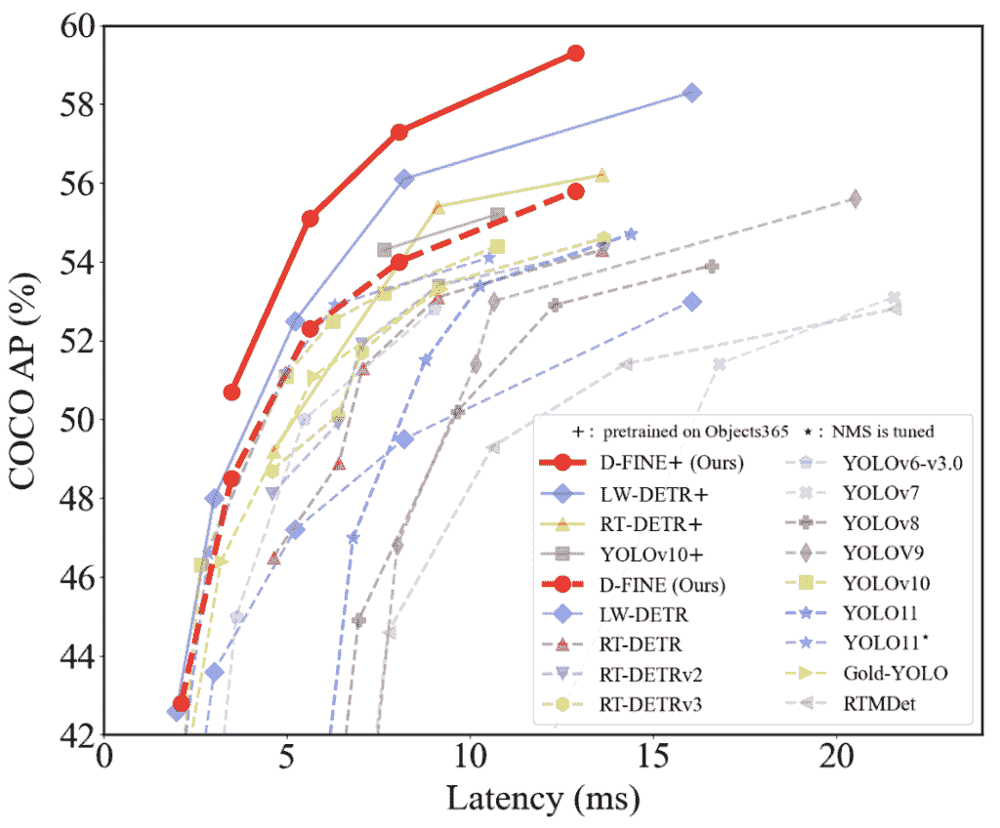

[D-FINE 论文](https://arxiv.org/pdf/2410.13842)与其他目标检测模型的比较

VisDrone 实验：

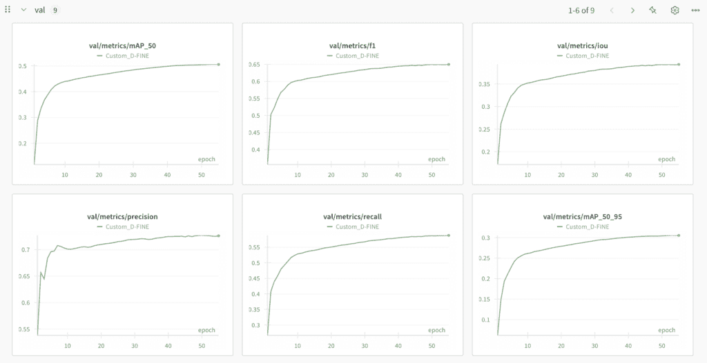

作者在 WandB 中记录的指标，D-FINE 模型

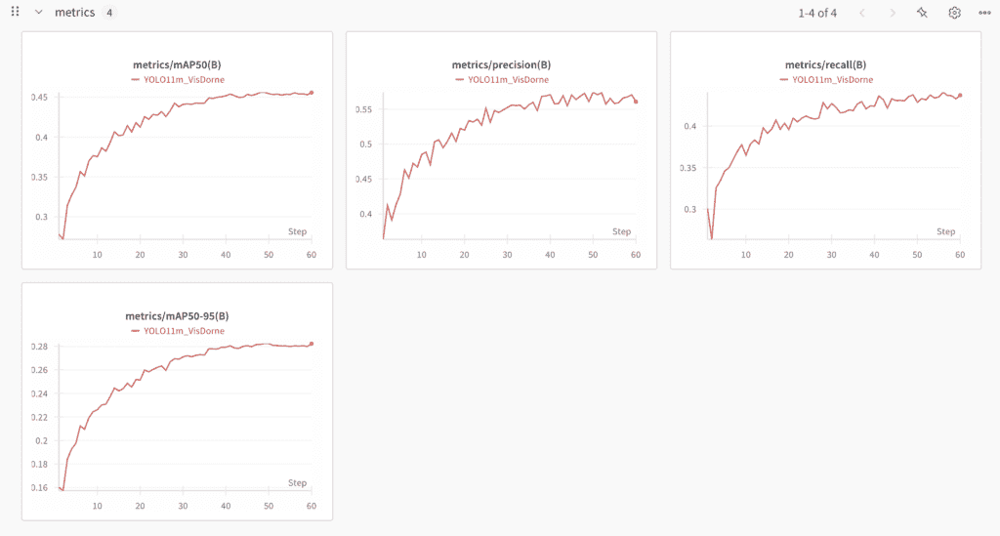

作者在 WandB 上记录的指标，YOLO11 模型

D-FINE 模型预测示例（绿色 – GT，蓝色 – 预测）：

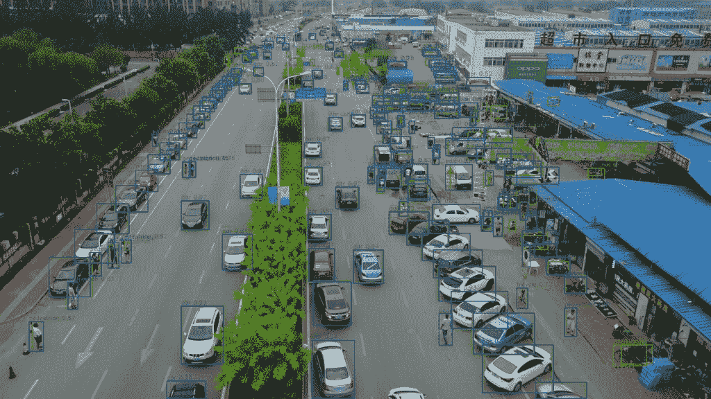

从 [VisDrone](https://github.com/VisDrone/VisDrone-Dataset) 数据集中采样

## 最终结果

了解所有细节后，让我们看看在 i12400F 和 RTX 3060 上使用 VisDrone 数据集时，两个模型的最佳设置下的最终比较：

```py
model                              |   F1-score    |   Latency (ms)    |
-----------------------------------+---------------+-------------------|
YOLO11m TRT dynamic                |      0.600    |        13.3       |
YOLO11m OV                         |      0.600    |       122.4       |
D-FINEs TRT                        |      0.629    |        12.3       |
D-FINEs OV                         |      0.629    |        57.4       |
```

如上图所示，我能够使用更小的 D-FINE 模型，在速度和精度上都优于 YOLO11。在速度和精度上击败最广泛使用的实时目标检测模型 Ultralytics，这是一项相当大的成就，不是吗？在几个其他真实世界数据集上也观察到了相同的模式。

我还尝试了 YOLOv12，在我写这篇文章的时候它已经发布了。它的表现与 YOLO11 相似，甚至实现了略低的指标（mAP 0.456 vs 0.452）。看起来 YOLO 模型在过去几年里已经遇到了瓶颈。D-FINE 是对目标检测模型的一个很好的更新。

最后，让我们直观地看看 YOLO11m 和 D-FINEs 之间的差异。YOLO11m，置信度 0.25，nms iou 0.5，延迟 13.3ms：

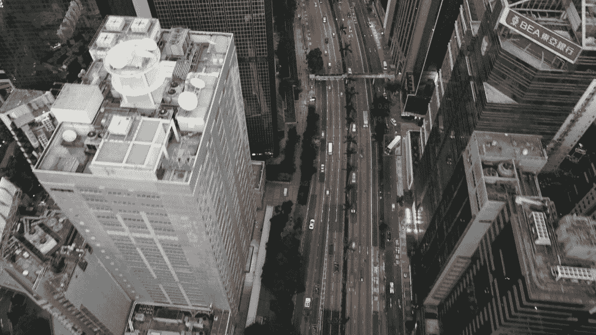

从 [VisDrone](https://github.com/VisDrone/VisDrone-Dataset) 数据集中采样

D-FINEs，置信度 0.5，无 nms，延迟 12.3ms：

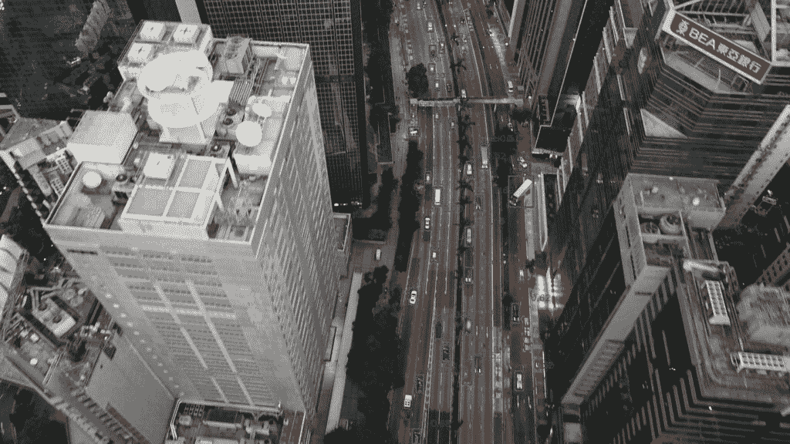

从 [VisDrone](https://github.com/VisDrone/VisDrone-Dataset) 数据集中采样

D-FINE 模型的精确度和召回率都更高。它还更快。这里还有 D-FINE 的“m”版本：

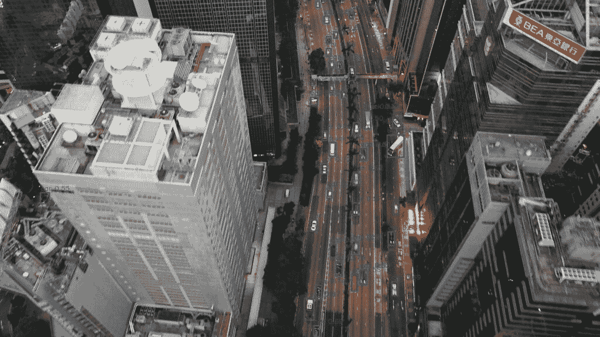

从 [VisDrone](https://github.com/VisDrone/VisDrone-Dataset) 数据集中采样

难道左边的那辆车也被检测到了吗？

## 注意数据预处理

这一部分可能稍微超出了文章的范围，但我想至少简要提及一下，因为一些部分可以自动化并用于流程中。作为一个计算机视觉工程师，我肯定看到的是，当工程师不花时间与数据打交道时，他们不会得到好的模型。你可以拥有所有最先进的模型，并且一切做得正确，但垃圾输入 – 垃圾输出。所以，我总是非常关注如何处理任务以及如何收集、过滤、验证和注释数据。不要认为注释团队会做得完全正确。动手检查数据集的一部分，以确保注释是好的，收集的图像具有代表性。

一些快速的想法：

+   从验证/测试集中移除重复和近重复样本。模型不应该在同一个样本上验证两次，而且你肯定不希望有数据泄露，比如训练集和验证集中出现两张相同的图片。

+   检查您的对象可以有多小。所有您肉眼看不到的东西都不应该被标注。同时，记住增强会使对象看起来更小（例如，马赛克或缩放）。相应地配置这些增强，以免在图像上出现无法使用的小对象。

+   当您已经有一个特定任务的模型并且需要更多数据时——尝试使用您的模型来预标注新图像。检查模型失败的情况并收集更多类似的情况。

## 从哪里开始

我在这条流水线上投入了大量的工作，并且我已经准备好与所有想要尝试它的人分享。它使用了底层的 SoTA D-FINE 模型，并添加了一些原始仓库中缺少的功能（马赛克增强、批量累积、调度器、更多指标、预处理图像和评估预测的可视化、导出和推理代码、更好的日志记录、统一和简化的配置文件）。

这是[我的仓库](https://github.com/ArgoHA/custom_d_fine)的链接。这是[原始 D-FINE 仓库](https://github.com/Peterande/D-FINE)，我在那里也有贡献。如果您需要任何帮助，请通过[LinkedIn](https://linkedin.com/in/argo-saakyan/)联系我。感谢您抽出时间！

## 引用和致谢

[DroneVis](https://github.com/VisDrone/VisDrone-Dataset)

```py
@article{zhu2021detection,
  title={Detection and tracking meet drones challenge},
  author={Zhu, Pengfei and Wen, Longyin and Du, Dawei and Bian, Xiao and Fan, Heng and Hu, Qinghua and Ling, Haibin},
  journal={IEEE Transactions on Pattern Analysis and Machine Intelligence},
  volume={44},
  number={11},
  pages={7380--7399},
  year={2021},
  publisher={IEEE}
}
```

[D-FINE](https://arxiv.org/abs/2410.13842)

```py
@misc{peng2024dfine,
      title={D-FINE: Redefine Regression Task in DETRs as Fine-grained Distribution Refinement},
      author={Yansong Peng and Hebei Li and Peixi Wu and Yueyi Zhang and Xiaoyan Sun and Feng Wu},
      year={2024},
      eprint={2410.13842},
      archivePrefix={arXiv},
      primaryClass={cs.CV}
}
```
