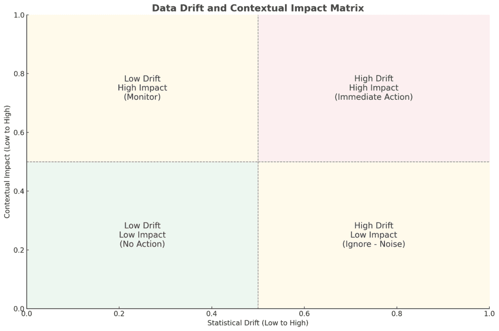
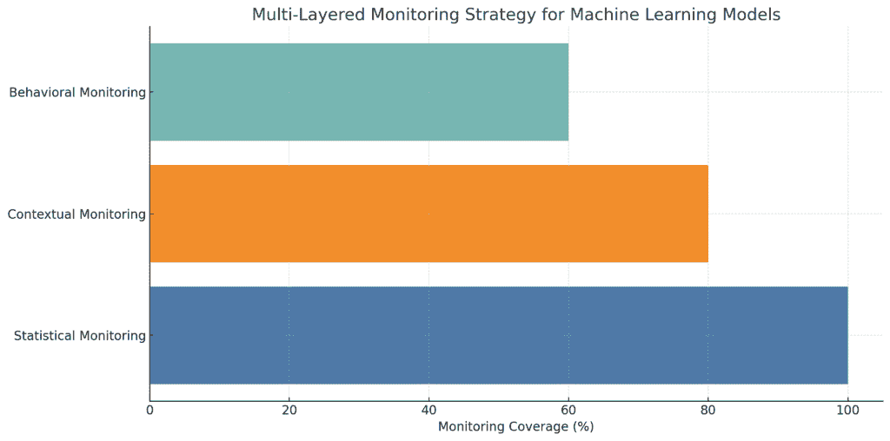

# 数据漂移不是真正的问题：你的监控策略是

> 原文：[`towardsdatascience.com/data-drift-is-not-the-actual-problem-your-monitoring-strategy-is/`](https://towardsdatascience.com/data-drift-is-not-the-actual-problem-your-monitoring-strategy-is/)

<mdspan datatext="el1748908747536" class="mdspan-comment">机器学习</mdspan>是一种通过消耗数据、学习模式和预测来提高准确性的方法。然而，即使是最优秀的模型，如果没有坚实的基础，这些预测在现实世界中也可能崩溃。使用机器学习系统的公司往往会问同一个问题：出了什么问题？

标准的答案通常是“数据漂移”。如果你的客户、交易或图像的属性因为输入数据的分布而发生变化，那么模型对世界的理解就会变得过时。然而，数据漂移本身并不是一个真正的问题，而是一个症状。我认为真正的担忧是，大多数组织在未理解数据的情况下监控数据。

## 数据漂移作为根本原因的神话

在我的经验中，大多数机器学习团队都是在模型性能下降后才被教导寻找数据漂移。统计漂移检测是行业对不稳定性的自动反应。然而，尽管统计漂移可以表明数据已经发生变化，但它很少解释这种变化的意义或它是否重要。

我倾向于给出的一个例子是[Google Cloud 的 Vertex AI](https://cloud.google.com/vertex-ai/docs/model-monitoring/overview)，它提供了一个现成的漂移检测系统。它可以跟踪特征分布，看到它们偏离正常分布，甚至当漂移超过预定义的阈值时自动重新训练。如果你只担心统计一致性，这是理想的。然而，在大多数企业中，这并不足够。

我参与的一家电子商务公司整合了一个产品推荐模型。在假日季节，顾客往往会从日常需求转向购买礼物。我所看到的是，模型的输入数据改变了产品类别、价格范围和购买频率，这些都发生了漂移。传统的漂移检测系统可能会引发警报，但这是一种正常行为，并不构成问题。将其视为问题可能会导致不必要的重新训练，甚至可能导致模型发生误导性的变化。

## 为什么传统的监控失败

我曾与各种组织合作，它们在统计阈值上构建监控管道。他们使用人口稳定性指数（PSI）、Kullback-Leibler 散度（KL 散度）或卡方检验等指标来检测数据分布的变化。这些指标是准确的，但却是天真无知的；它们不理解上下文。

以[AWS SageMaker 的模型监控器](https://aws.amazon.com/sagemaker/model-monitor/)为例，这是一个现实世界的例子。它具有通过比较实时数据与参考集来自动发现输入特征变化的工具。你可以在 CloudWatch 中设置警报，以监控特征 PSI 达到设定限制时的情况。然而，这只是一个有用的起点，但它并没有说明这些变化是否重要。

想象一下，你正在使用一个贷款审批模型来开展业务。如果营销团队推出了一项针对更大贷款的促销活动，并且利率更优，模型监控器会注意到贷款金额特征并不准确。然而，这是故意的，因为重新训练可能会覆盖业务中的基本变化。关键问题是，如果没有业务层的知识，统计监控可能会导致错误的行为。

数据漂移和上下文影响矩阵 **（图片由作者提供）**

## 上下文监控方法

如果仅仅通过漂移检测无法解决实际问题，那么该怎么办呢？一个优秀的监控系统应该超越统计数据，反映模型应该带来的业务成果。这需要一种三层方法：

### 1. 统计监控：基础

统计监控应该是你的第一道防线。PSI、KL 散度或卡方等指标可以用来识别特征分布的快速变化。然而，它们必须被视为信号而不是警报。

我的营销团队推出了一系列针对基于订阅的流媒体服务新用户的促销活动。在活动期间，“用户年龄”、“注册来源”和“设备类型”的特征分布都经历了重大的漂移。然而，监控仪表板并没有引发重新训练，而是将这些变化放在了活动性能指标旁边，这表明这些变化是预期的且时间有限的。

### 2. 上下文监控：业务感知洞察

上下文监控将技术信号与业务意义对齐。它回答了一个比“有什么漂移了吗？”更深的问题。它问的是，“漂移是否影响了我们关心的东西？”

Google Cloud 的 Vertex AI 提供了这个桥梁。除了基本的漂移监控外，它还允许用户通过用户人口统计或业务维度来配置*切片*和分割预测。通过监控模型在切片（例如，客户层级或产品类别的转化率）上的性能，团队不仅可以看到漂移发生了，还可以看到它在哪里以及如何影响业务成果。

例如，在一个电子商务应用中，一个预测客户流失的模型可能会在“参与频率”上看到漂移的峰值。但如果这个峰值与高价值客户的稳定留存相关，那么就没有立即重新训练的必要。上下文监控鼓励更慢、更谨慎地解释漂移，以适应业务优先级。

### 3. 行为监控：结果驱动的漂移

除了输入之外，你的模型的输出也应该被监控以发现异常。这是为了跟踪模型的预测以及它们产生的结果。例如，在一个正在实施信用风险模型的金融机构中，监控不仅应该检测用户收入或贷款金额特征的变化，还应该跟踪模型随时间发布的贷款的批准率、违约率和盈利能力。

如果某个地区的批准贷款的默认率激增，即使模型的特征分布没有发生漂移，这也是一个大问题。

多层监控策略用于机器学习模型 **(图片由作者提供)**

## 构建弹性监控管道

一个良好的监控系统不是一个视觉仪表板或漂移指标的清单。它是在机器学习架构内嵌入的系统，能够区分无害的变化和运营威胁。它必须帮助团队通过多个视角来解释变化：数学的、商业的和行为上的。这里的弹性不仅仅意味着正常运行时间；它意味着知道发生了什么变化，为什么，以及这是否有意义。

### 设计多层监控

#### 统计层

在这一层，目标是尽可能早地检测信号变化，但将其视为检查的提示，而不是立即采取行动。广泛使用的指标包括人口稳定性指数（PSI）、KL 散度以及卡方检验。它们会在特征分布显著偏离其训练基线时发出警报。但常常被忽视的是这些指标是如何应用以及它们在哪里失效的。

在可扩展的生产设置中，统计漂移是在滑动窗口上监控的，例如，以过去 24 小时为基准的 7 天滚动基线，而不是静态的训练快照。这防止了模型对长期过去的季节性或特定群体模式做出反应而导致的警报疲劳。特征也应该按稳定性类别分组：例如，模型的“年龄”特征会缓慢漂移，而“推荐来源”可能会每天波动。通过相应地标记特征，团队可以按类别调整漂移阈值，而不是全局调整，这是一个微妙的变化，可以显著减少误报。

我参与过的最有效的部署更进一步：它们不仅记录 PSI 值，还记录解释漂移发生位置的底层百分位数。这有助于更快地进行调试，并帮助确定这种偏差是否影响敏感用户群体或只是异常值。

#### 上下文层

当统计层询问“发生了什么变化？”时，上下文层则询问“为什么这很重要？”这一层不会孤立地看待漂移。相反，它会将输入分布的变化与业务关键绩效指标（KPI）的波动进行交叉参考。

例如，在一个我帮助扩展的电子商务推荐系统中，一个模型在周末期间显示“用户会话时长”的漂移。从统计上看，这是显著的。然而，与转换率和购物车价值相比，这种漂移是无害的；它反映了周末的随意浏览行为，而不是脱钩。通过将每个关键特征与其影响最大的业务指标（例如，会话时长→转换）联系起来，上下文监控解决了这个问题。只有当两个指标同时偏离时，漂移警报才被视为关键。

这一层通常还涉及细分级别的切片，它不是在全局总和中观察漂移，而是在高价值细分中观察。当我们将这种方法应用于订阅业务时，我们发现注册设备类型的漂移对整体没有影响，但在容易流失的群体中，它与流失率高度相关。这种差异在原始 PSI 中是不可见的，只有在切片感知的上下文模型中才能看到。

#### 行为层

即使输入数据看似没有变化，模型的预测也可能开始偏离现实世界的成果。这就是行为层的作用所在。这一层不仅跟踪模型输出的内容，还跟踪这些输出的表现。

这是弹性管道中最被忽视但最关键的部分。我见过一个案例，一个欺诈检测模型通过了所有的离线指标和特征分布检查，但实时欺诈损失开始上升。经过深入调查，对抗性模式已经足够改变用户行为，以至于让模型困惑，而早期层没有捕捉到这一点。

有效的方法是跟踪模型的成果指标、欺诈率、交易速度、批准率，并将它们与预先设定的行为基准进行比较。在另一次部署中，我们不仅监控了流失模型的预测与未来用户行为，还监控了营销活动提升。当预测的流失者收到优惠但仍未转化时，我们将这种行为标记为“预测不匹配”，这告诉我们模型与当前用户心理不一致，这是一种大多数系统都会错过的无声漂移。

行为层是评估模型的地方，不是根据它们的外观，而是根据它们在压力下的行为。

## 监控实施

### 实施条件警报

并非所有漂移都是问题，并非所有警报都是可操作的。复杂的监控管道嵌入条件警报逻辑，以决定何时漂移越过阈值进入风险。

在一家区域零售连锁店使用的某个定价模型中，我们发现由于供应商促销，品类级别的价格漂移是完全可以预料的。然而，用户细分漂移（尤其是对于高消费的重复客户）表明了利润的不稳定性。因此，警报系统被配置为仅在漂移与转换利润率或投资回报率下降同时发生时触发。

条件警报系统需要了解特征敏感性、业务影响阈值和可接受的波动范围，通常表示为移动平均值。不具上下文敏感性的警报会被忽略；那些过度调整的警报会错过真实问题。艺术在于将业务直觉编码到监控逻辑中，而不仅仅是阈值。

### 定期验证监控逻辑

就像您的模型代码一样，您的监控逻辑随着时间的推移会变得过时。曾经有效的漂移警报可能会后来变成噪音，尤其是在引入了新用户、地区或定价计划之后。这就是为什么成熟的团队不仅会定期审查模型准确性，还会审查监控系统本身。

在我合作的一个数字支付平台上，我们注意到一个跟踪交易时间的功能警报激增。结果发现，激增与一个我们尚未建模的时间区的新用户群相关。模型和数据都很好，但监控配置不好。解决方案不是重新训练；而是重新调整我们的上下文监控逻辑，使其针对每个用户组的收入，而不是全局指标。

验证意味着提出像这样的问题：您的警报阈值是否仍然与业务风险相关联？您的特征是否仍然具有语义有效性？是否有任何管道以静默的方式更新，从而影响了漂移行为？

监控逻辑，就像数据管道一样，必须被视为活软件，需要接受测试和改进。

### 版本化您的监控配置

机器学习操作中最大的错误之一是将监控阈值和逻辑视为事后之想。实际上，这些配置与模型权重或预处理代码一样关键。

在稳健的系统中，监控逻辑以版本控制的代码形式存储：YAML 或 JSON 配置，这些配置定义了阈值、切片维度、KPI 映射和警报通道。这些配置与模型版本一起提交，在拉取请求中进行审查，并通过 CI/CD 管道部署。当漂移警报触发时，触发它们的监控逻辑是可见的，可以进行审计、追踪或回滚。

这种纪律防止了我们管理的客户细分系统中出现重大故障。一个对漂移阈值的好意配置更改无声地增加了敏感性，导致重复的重新训练触发。由于配置是版本化的并经过审查，我们能够在不到一个小时的时间内识别出更改、理解其意图并将其撤销。

将监控逻辑视为您的基础设施合同的一部分。如果它不可重复，则不可靠。

## 结论

我认为数据漂移不是一个问题。它是一个信号。但它太经常被误解，导致不必要的恐慌，甚至更糟糕的是，产生虚假的安全感。仅仅监控不仅仅是统计阈值。它还意味着了解数据变化对您业务的影响。

监控的未来是特定于上下文的。它需要能够区分噪声和信号、检测漂移并理解其重要性的系统。如果你的模型监控系统能不能回答“这种漂移是否重要？”这个问题，那么它就不是真正的监控。
