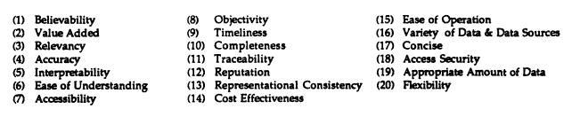

# 数据没有护城河！

> 原文：[`towardsdatascience.com/data-has-no-moat/`](https://towardsdatascience.com/data-has-no-moat/)

<mdspan datatext="el1750794355470" class="mdspan-comment">自从人工智能和数据驱动项目早期</mdspan>，数据及其质量就被认为是项目成功的关键。有些人甚至会说，项目过去有一个单一的故障点：数据！

众所周知的*“垃圾输入，垃圾输出”*可能是第一个席卷数据行业的表达（其次是“数据是新石油”）。我们都知道，如果数据没有良好的结构、清洁和验证，任何分析和潜在应用的结果注定是不准确且危险错误的。

因此，多年来，许多研究和研究人员专注于定义数据质量的支柱以及可以用来评估它的指标。

[1991 年的研究论文](https://web.mit.edu/smadnick/www/wp2/1991-06.pdf)确定了 20 个不同的数据质量维度，所有这些维度都与当时的主要关注点和数据使用非常一致——结构化数据库。快进到[2020 年，关于数据质量维度（DDQ）的研究论文](https://www.dama-nl.org/wp-content/uploads/2020/09/DDQ-Dimensions-of-Data-Quality-Research-Paper-version-1.2-d.d.-3-Sept-2020.pdf?utm_content=218971815&utm_medium=social&utm_source=linkedin&hss_channel=lcp-75424487)，它确定了惊人的数据质量维度数量（大约 65 个！！），这不仅反映了数据质量定义应不断演变，也反映了数据本身的使用方式。

数据质量维度：通过设计实现质量数据，1991 年王

尽管如此，随着深度学习热潮的兴起，数据质量不再重要的想法仍然留在最懂技术的工程师们的心中。相信模型和工程本身就足以提供强大解决方案的愿望已经存在了很长时间。对我们来说很高兴，*热情的数据从业者*，[2021/2022 年标志着**数据为中心的人工智能**](https://www.youtube.com/watch?v=TU6u_T-s68Y)的兴起！这个概念并不远离经典的*“垃圾输入，垃圾输出”*，强化了在人工智能开发中，如果我们将数据视为需要调整的方程式元素，我们将比仅调整模型获得更好的性能和结果（啊！毕竟，不仅仅是超参数调整）。

*那么，我们为什么又能听到数据没有护城河的谣言？！*

大型语言模型（LLMs）模仿人类推理的能力让我们感到震惊。因为它们是在与 GPU 的计算能力相结合的巨大语料库上训练的，LLMs 不仅能够生成优质内容，而且实际上能够模仿我们的语气和思维方式。由于它们做得如此出色，并且往往只需要最少的上下文，这导致许多人得出大胆的结论：

> *“数据没有护城河。”*
> 
> *“我们不再需要专有数据来区分。”*
> 
> *“只需使用更好的模型。”*

## 数据质量能否与 LLMs 和 AI 代理抗衡？

在我看来——绝对是！事实上，尽管在 LLMs 和 AI 代理时代，数据似乎不再具有区分性，但数据仍然是至关重要的。我甚至挑战性地提出，随着能力和责任感的增强，它们对优质数据的依赖性变得更加关键！

*那么，为什么数据质量仍然很重要？*

从最明显的地方开始，垃圾输入，垃圾输出。如果模型和代理无法区分好与坏，那么它们无论多么聪明都没有关系。如果将不良数据或低质量输入输入到模型中，你将得到错误的答案和误导性的结果。LLMs 是生成模型，这意味着它们最终只是简单地复制它们遇到的模式。更令人担忧的是，我们曾经依赖的验证机制在许多用例中不再存在，这可能导致误导性的结果。

此外，这些模型缺乏对现实世界的认知，与其他之前主导的生成模型类似。如果某些内容过时或甚至存在偏见，它们根本不会识别出来，除非经过训练才能做到这一点，而这需要从高质量、经过验证且精心挑选的数据开始。

更具体地说，当涉及到 AI 代理时，它们通常依赖于记忆或文档检索工具来跨活动工作，优质数据的重要性就更加明显。如果它们的知识基于不可靠的信息，它们将无法做出良好的决策。你可能会得到一个答案或结果，但这并不意味着它是有用的！

## 为什么数据仍然是一道护城河？

虽然计算基础设施、存储容量以及专业知识的障碍被提及为在由 AI 代理和基于 LLM 的应用程序主导的未来保持竞争力的相关因素，但[数据可访问性仍然是最常被引用的至关重要的竞争力因素](https://academic.oup.com/icc/advance-article/doi/10.1093/icc/dtae042/7942098)。以下是原因：

1.  **访问即权力** 在数据受限或专有的领域，例如医疗保健、律师、企业工作流程或甚至用户交互数据，只有那些有权访问数据的人才能构建 AI 代理。没有它，开发的应用程序将像盲人一样飞行。

1.  **公共网络将不足以**

    公共数据免费且丰富的情况正在逐渐消失，不是因为它们不再可用，而是因为其质量正在迅速下降。高质量的公共数据集已经被算法生成数据大量挖掘，而剩下的一些要么在付费墙后，要么受到 API 限制的保护。

    此外，主要平台越来越多地关闭访问权限，以利于货币化。

1.  **数据中毒是新的攻击向量** 随着基础模型的采用率增长，攻击从模型代码转向模型本身的训练和微调。为什么？这样做更容易，也更难检测！

    我们正进入一个时代，对手不需要破坏系统，他们只需要污染数据。从细微的错误信息到恶意标签，数据中毒攻击已成为一个现实，对于正在考虑采用人工智能代理的组织来说，需要做好准备。控制数据来源、管道和完整性现在是构建可信人工智能的基本要求。

## 可信人工智能的数据策略是什么？

为了保持创新的前沿，我们必须重新思考如何处理数据。数据不再只是流程中的一个元素，而是人工智能的核心基础设施。构建和部署人工智能不仅关乎代码和算法，还关乎数据生命周期：如何收集、过滤和清理，保护，最重要的是，使用。*那么，我们可以采用哪些策略来更好地利用数据呢？*

1.  **数据管理作为核心基础设施**

    将数据视为与云基础设施或安全性同等重要和优先级。这意味着集中治理，实施访问控制，并确保数据流可追溯和可审计。为 AI 准备的组织设计系统，其中数据是有意管理输入，而不是事后考虑。

1.  **主动数据质量机制**

    您的数据质量定义了您的代理的可靠性和性能！建立管道，自动检测异常或偏离记录，强制执行标签标准，并监控漂移或污染。数据工程是未来的基础，也是人工智能的基础。数据不仅需要收集，更重要的是，需要精心管理！

1.  **合成数据用于填补空白并保护隐私**

    当真实数据有限、有偏见或涉及隐私敏感时，[合成数据提供了一个强大的替代方案](https://www.annualreviews.org/content/journals/10.1146/annurev-statistics-040720-031848)。从模拟到生成模型，合成数据允许你创建高质量的数据库来训练模型。这是解锁那些真实数据昂贵或受限的场景的关键。

1.  **防御性设计以对抗数据中毒**

    人工智能中的安全性现在始于数据层。实施如源验证、版本控制和实时验证等措施，以防止中毒和细微的操作。这不仅适用于数据源，也适用于任何进入系统的提示。这对于从用户输入或外部数据源学习的系统尤为重要。

1.  **数据反馈循环**

    在您的 AI 系统中，数据不应被视为不可变的。它应该能够随着时间的推移而演变和适应！反馈循环对于在数据方面创造一种演变的感觉是强制性的。当与强大的质量过滤器配对时，这些循环使基于 AI 的解决方案随着时间的推移变得更智能、更一致。

总结来说，数据是护城河，也是人工智能解决方案防御性的未来。以数据为中心的人工智能比以往任何时候都更重要，即使炒作的声音与此相反。那么，人工智能是否应该完全围绕炒作展开？*只有真正实现生产的系统才能超越这些炒作。
