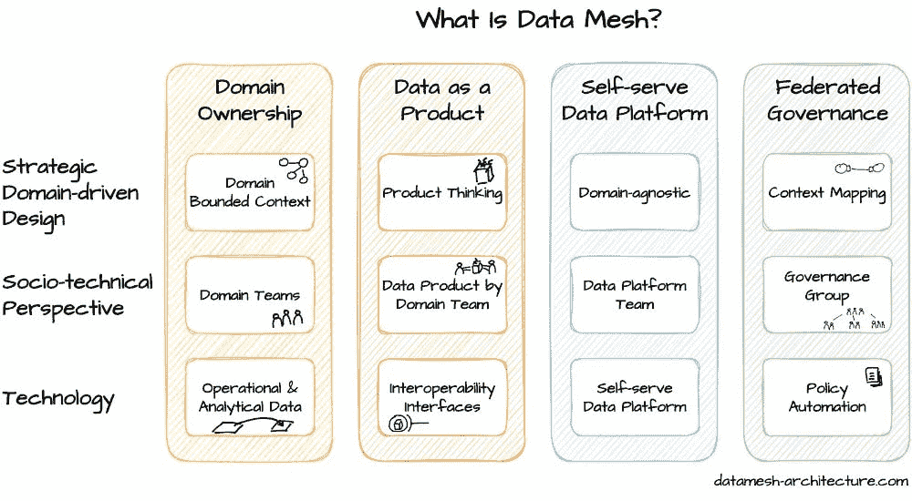

# 数据网格日记：早期采用者的现实情况

> 原文：[`towardsdatascience.com/data-mesh-diaries-realities-from-early-adopters/`](https://towardsdatascience.com/data-mesh-diaries-realities-from-early-adopters/)

**<mdspan datatext="el1755113159493" class="mdspan-comment">数据网格已经在**> 过去几年中逐渐进入人们的视野**，随着组织试图寻找替代集中式数据架构的方案。

我有幸亲眼目睹了早期采用者团队如何应对这一范式转变。我将强调一些早期采用者参加网格派对时面临的现实情况。

在过去几个月里，我整理了与数据网格实践者几次对话的见解，看看我们的观点是否一致。本文重点介绍了我在实际实施中看到的主要观察结果。

## 什么是数据网格？

为了让这些早期采用者的见解与您产生共鸣，我确实期望您对数据网格及其与不同架构方法的不同之处有中级到高级的知识水平。但为了完整性，我将基于我认为的关键点给出一个总结。

Zhamak Dhegani，她在 2019 年提出了这个术语并撰写了第一篇论文¹，对“集中式、单体数据架构”的**持续限制**感到沮丧——尤其是**数据湖**和**企业数据仓库**。第一篇白皮书就是源于她在客户那里经历的这些挫折。

她来自强大的软件工程背景，她认为许多问题已经在软件架构中得到很好的解决，但并未被应用到数据领域。简而言之，Zhamak 创建数据网格是为了**以现代组织扩展软件交付的方式扩展数据实践**。

从那时起，她和其他人撰写了关于它的书籍，并且有几家公司围绕这个主题成立。

我想指出，数据网格的构建块并不是新概念，但新的是将这些基本原理结合起来，并将其应用于历史上称为“BI”的空间。

关于数据网格的资料很多，但它实际上借鉴了几个基本原理，并将它们打包在一个大伞下。四个主要原则在此可见：

图片来自 datamesh-architecture.com

## 早期采用者的现实情况

在这里，我将详细阐述我在参与的项目或行业同仁中看到的数据网格的主要**早期采用者现实情况**。在此阶段，我将避免给出解决方案，而只是对观察结果进行一些评论。

### 建设中的飞行

无论您是早期采用者领域团队还是赋能团队的一部分，在早期阶段，数据网格感觉就像在飞行中构建飞机。公司无法暂停运营，因此团队必须平衡**短期需求与长期架构目标**。

由作者生成的图像 AI

而不是享受飞行娱乐和轻松的巡航高度饮料，你将需要自己为每个人供水，同时修补机翼。

面对这样重大的决策，这需要大量的人力和工具投资，组织通常会需要选择以下这些选项之一：

**(a) 先买后建，然后推广** OR **(b) 等待完全一致后再投资**

这两个选项都不会被选中，第一个的价格标签太高，而且永远不会完全一致，因此你只剩下 1 个逻辑选项，秘密选项**c)** **即使飞机还没有完全建成也要飞**

### 对数据产品是什么没有明确的共识

我个人花费了无数小时讨论什么是数据产品以及它不是什么。如果你正在实施数据网格，你很可能也会这样。

“什么是数据产品”，“有哪些类型的数据产品”，“何时是可重用的与面向消费者的”。由于我们对传统数据架构的经验，这些细微差别往往会出现。例如，网格如何与奖牌架构、数据仓库和维度建模相关联？数据产品可以是原始数据、仓库或数据集市吗？或者它只是所有这些，只是围绕它绘制了领域边界？如果数据集被跨领域使用，我们应该为每个来源创建一个数据产品吗？

我参加了一个联合领域驱动设计和数据网格现场会议²，不同的演讲者也对这个问题有不同的看法。所以让我们面对现实，我们无法完全达成一致。

### 获得业务领导层的支持

数据网格不能仅仅（但通常如此）是 IT 为 IT 的倡议。过渡到数据网格不仅仅是一个技术变革——它是一种文化转变。没有**高层管理支持**，最好是业务方面的支持，该倡议很可能会遇到阻力。与公司战略的强一致是克服不可避免的障碍所必需的。它不应被视为仅针对 IT 的战略。

你可能会发现自己处于几种情况，需要放弃“但这确实是组织的战略方向”或类似的说法。无论是预算、政治还是社会障碍。

由作者生成的图像 AI

### 早期采用者的成长之痛

首批采用数据网格的团队将面临重大的痛点。这些可能是任何大型转型项目中的典型成长之痛，无论是集成挑战、平台错误还是数据网格特定的——比如像在其他观察到的现实中提到的，弄清楚数据产品是什么。

使这些先驱的采用尽可能顺利将增加长期成功的可能性。这很可能会导致对早期采用者团队授予一些豁免权，否则他们就会回到他们幸福的影子 IT 状态。

### 将会暴露现有的流程差距

尽管数据网格的意图是确保未来的可扩展性和效率，但它很可能会首先识别现有的**数据处理、安全和合规**方面的差距。通常，早期采用者被指派去解决这些问题，有时甚至要为**预先存在的缺陷**承担责任。

使能团队应该承担负担并记住最终目标。

### 绿色领域几乎不可能

由于其本质，数据网格适合于大型、复杂的环境，其中多个团队需要协作。然而，**现有的 IT 政策和治理框架**可能并不总是支持去中心化。团队很可能无法从零开始，针对适合目的的流程进行定制，他们可能会被有时过时和陈旧的规则和流程所束缚。

例如，在我涉足的大约 80%的项目中，数据采集仍然由中央团队管理，而不是由领域团队拥有，至少在开始时是这样的。这有多种原因，但不仅限于此。

+   技术技能位于 IT 部门，而不是业务领域。

+   辩证一个较小的专用团队连接到多个来源并使它们可用更容易被证明（法律部门更满意）。

+   在标准化数据提取方式方面仍然有很多好处，尤其是在供应商管理和源数据历史化方面。

### 没有一种简单的方法来定义领域和所有权

在数据网格中定义领域和所有权并不像在组织结构图上画线那么简单。它需要处理重叠的责任、演变的业务能力和与当前团队不完美映射的遗留系统。没有一种适合所有情况的模式——在一个组织中有效的方法可能在另一个组织中失效。

话虽如此，将其紧密映射到组织结构图上无疑是迄今为止最简单的解决方案，它解决了所有权问题，并且似乎仍然是这个问题的常见应用。

## 最后的想法

就像任何重大的组织转型一样，早期采用阶段可能会决定旅程的成功或失败。现实是，目前看来，数据网格似乎并无不同。这是一场在绘制蓝图的同时驾驶飞机的平衡游戏，说服领导层目的地值得努力，并在过程中应对所有权和流程差距的混乱现实。

[1] Dehghani, Z. (2019) *如何从单体数据湖过渡到分布式数据网格*，*martinfowler.com*。可在以下链接获取：[`martinfowler.com/articles/data-monolith-to-mesh.html`](https://martinfowler.com/articles/data-monolith-to-mesh.html)（访问日期：2025 年 8 月 13 日）。

[2] Data Mesh Live. (2025, June 4–6). *Data Mesh Live* [会议]. 比利时安特卫普。来自 [`datameshlive.com/`](https://datameshlive.com/?utm_source=chatgpt.com) 的检索
