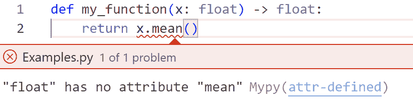

# 数据科学：从学校到工作，第二部分

> 原文：[`towardsdatascience.com/data-science-from-school-to-work-part-ii/`](https://towardsdatascience.com/data-science-from-school-to-work-part-ii/)

在我之前的一篇文章中，我强调了在 Python 开发中有效项目管理的重要性。现在，让我们将焦点转移到代码本身，探讨如何编写干净、易于维护的代码——这是专业和协作环境中的一项基本实践。

+   **可读性与可维护性**：结构良好的代码更容易阅读、理解和修改。其他开发者——甚至是你未来的自己——可以快速掌握逻辑，而无需费力去解析混乱的代码。

+   **调试与故障排除**：具有清晰变量名和结构化函数的代码更容易高效地识别和修复错误。

+   **可扩展性与可重用性**：模块化、组织良好的代码可以在不同的项目中重用，允许无缝扩展而不会破坏现有功能。

因此，当你着手你的下一个 Python 项目时，请记住：

优秀的代码一半是干净的代码。

* * *

## 引言

Python 是最受欢迎且多才多艺的编程语言之一，因其简洁、易理解以及庞大的社区而受到赞赏。无论是网站开发、数据分析、人工智能还是任务自动化——Python 提供了强大且灵活的工具，适用于广泛的领域。

然而，Python 项目的效率和可维护性在很大程度上取决于开发者使用的实践。代码结构不良、缺乏约定或甚至缺乏文档，都可能迅速将一个有潜力的项目变成维护和开发密集型的谜题。正是这一点区分了学生代码和专业代码。

本文旨在介绍编写高质量 Python 代码的最重要最佳实践。遵循这些推荐，开发者可以创建既功能性强又易于阅读、性能优良且易于第三方维护的脚本和应用程序。

在项目一开始就采用这些最佳实践不仅确保了团队内更好的协作，而且使你的代码能够随着未来需求的发展而演进。无论你是初学者还是有经验的开发者，本指南旨在支持你在所有 Python 开发中的工作。

* * *

## 代码结构化

Python 代码的良好结构至关重要。主要有两种项目布局：**扁平布局**和**src 布局**。

**扁平布局**将源代码直接放置在项目根目录中，没有额外的文件夹。这种方法简化了结构，非常适合小型脚本、快速原型和不需要复杂打包的项目。然而，在运行测试或脚本时可能会出现意外的导入问题。

```py
📂 my_project/
├── 📂 my_project/                  # Directly in the root
│   ├── 🐍 __init__.py
│   ├── 🐍 main.py                   # Main entry point (if needed)
│   ├── 🐍 module1.py             # Example module
│   └── 🐍 utils.py
├── 📂 tests/                            # Unit tests
│   ├── 🐍 test_module1.py
│   ├── 🐍 test_utils.py
│   └── ...
├── 📄 .gitignore                      # Git ignored files
├── 📄 pyproject.toml              # Project configuration (Poetry, setuptools)
├── 📄 uv.lock                         # UV file
├── 📄 README.md               # Main project documentation
├── 📄 LICENSE                     # Project license
├── 📄 Makefile                       # Automates common tasks
├── 📄 DockerFile                   # Automates common tasks
├── 📂 .github/                        # GitHub Actions workflows (CI/CD)
│   ├── 📂 actions/               
│   └── 📂 workflows/
```

另一方面，**src 布局**（src 是 source 的缩写）在专门的`src/`目录内组织源代码，防止意外从工作目录导入，并确保源文件与其他项目组件（如测试或配置文件）之间的清晰分离。这种布局对于大型项目、库和现成应用程序来说非常理想，因为它强制执行适当的包安装并避免导入冲突。

```py
📂 my-project/
├── 📂 src/                              # Main source code
│   ├── 📂 my_project/            # Main package
│   │   ├── 🐍 __init__.py        # Makes the folder a package
│   │   ├── 🐍 main.py             # Main entry point (if needed)
│   │   ├── 🐍 module1.py       # Example module
│   │   └── ...
│   │   ├── 📂 utils/                  # Utility functions
│   │   │   ├── 🐍 __init__.py     
│   │   │   ├── 🐍 data_utils.py  # data functions
│   │   │   ├── 🐍 io_utils.py      # Input/output functions
│   │   │   └── ...
├── 📂 tests/                             # Unit tests
│   ├── 🐍 test_module1.py     
│   ├── 🐍 test_module2.py     
│   ├── 🐍 conftest.py              # Pytest configurations
│   └── ...
├── 📂 docs/                            # Documentation
│   ├── 📄 index.md                
│   ├── 📄 architecture.md         
│   ├── 📄 installation.md         
│   └── ...                     
├── 📂 notebooks/                   # Jupyter Notebooks for exploration
│   ├── 📄 exploration.ipynb       
│   └── ...                     
├── 📂 scripts/                         # Standalone scripts (ETL, data processing)
│   ├── 🐍 run_pipeline.py         
│   ├── 🐍 clean_data.py           
│   └── ...                     
├── 📂 data/                            # Raw or processed data (if applicable)
│   ├── 📂 raw/                    
│   ├── 📂 processed/
│   └── ....                                 
├── 📄 .gitignore                      # Git ignored files
├── 📄 pyproject.toml              # Project configuration (Poetry, setuptools)
├── 📄 uv.lock                         # UV file
├── 📄 README.md               # Main project documentation
├── 🐍 setup.py                       # Installation script (if applicable)
├── 📄 LICENSE                     # Project license
├── 📄 Makefile                       # Automates common tasks
├── 📄 DockerFile                   # To create Docker image
├── 📂 .github/                        # GitHub Actions workflows (CI/CD)
│   ├── 📂 actions/               
│   └── 📂 workflows/
```

选择这些布局取决于项目的复杂性和长期目标。对于生产质量的代码，通常推荐使用`src/`布局，而对于简单或短期项目，平面布局则效果良好。

你可以想象不同的模板，这些模板更适合你的用例。保持你项目的模块化非常重要。不要犹豫去创建子目录，并将具有相似功能的脚本分组在一起，将具有不同用途的脚本分开。良好的代码结构确保了可读性、可维护性、可扩展性和可重用性，并有助于高效地识别和纠正错误。

> [Cookiecutter](https://www.cookiecutter.io/) 是一个开源工具，可以从模板生成预配置的项目结构。它特别有用，可以通过从一开始就应用良好的实践来确保项目的连贯性和组织性，尤其是在 Python 中。可以使用 UV [工具](https://github.com/fpgmaas/cookiecutter-uv)来启动平面布局和 src 布局。

* * *

## SOLID 原则

SOLID 编程是基于五个基本原则的软件开发方法，这些原则旨在提高代码质量、可维护性和可扩展性。这些原则提供了一个清晰的框架来开发健壮、灵活的系统。通过遵循 SOLID 原则，可以降低复杂依赖的风险，使测试更容易，并确保应用程序在面对变化时更容易进化。无论你是在处理单个项目还是大型应用程序，掌握 SOLID 都是采用面向对象编程最佳实践的重要一步。

### **S — 单一职责原则 (SRP)**

单一职责原则意味着一个类/函数只能管理一件事情。这意味着它只有一个改变的理由。这使得代码更易于维护和阅读。具有多个职责的类/函数难以理解，并且往往是错误的一个来源。

**示例：**

```py
# Violates SRP
class MLPipeline:
    def __init__(self, df: pd.DataFrame, target_column: str):
        self.df = df
        self.target_column = target_column
        self.scaler = StandardScaler()
        self.model = RandomForestClassifier()

    def preprocess_data(self):
        self.df.fillna(self.df.mean(), inplace=True)  # Handle missing values
        X = self.df.drop(columns=[self.target_column])
        y = self.df[self.target_column]
        X_scaled = self.scaler.fit_transform(X)  # Feature scaling
        return X_scaled, y

    def train_model(self):
        X, y = self.preprocess_data()  # Data preprocessing inside model training
        self.model.fit(X, y)
        print("Model training complete.")
```

在这里，MLPipeline 类有两个职责：处理数据和训练模型。

```py
# Follows SRP
class DataPreprocessor:
    def __init__(self):
        self.scaler = StandardScaler()

    def preprocess(self, df: pd.DataFrame, target_column: str):
        df = df.copy()
        df.fillna(df.mean(), inplace=True)  # Handle missing values
        X = df.drop(columns=[target_column])

# Follows SRP
class DataPreprocessor:
    def __init__(self):
        self.scaler = StandardScaler()

    def preprocess(self, df: pd.DataFrame, target_column: str):
        df = df.copy()
        df.fillna(df.mean(), inplace=True)  # Handle missing values
        X = df.drop(columns=[target_column])
        y = df[target_column]
        X_scaled = self.scaler.fit_transform(X)  # Feature scaling
        return X_scaled, y

class ModelTrainer:
    def __init__(self, model):
        self.model = model

    def train(self, X, y):
        self.model.fit(X, y)
        print("Model training complete.")
```

### **O — 开放/关闭原则 (OCP)**

开放/关闭原则意味着一个类/函数必须对扩展开放，但对修改关闭。这使得在不破坏现有代码的情况下添加功能成为可能。

考虑到这个原则进行开发并不容易，但对于主要开发者来说，一个良好的指标是在项目开发过程中合并请求中看到越来越多的添加（+）和越来越少删除（-）。

### **L — 里氏替换原则（Liskov Substitution Principle, LSP）**

里氏替换原则指出，子类可以在不改变程序行为的情况下替换其父类，确保子类满足基类定义的期望。这限制了意外错误的风险。

**示例：**

```py
# Violates LSP
class Rectangle:
    def __init__(self, width, height):
        self.width = width
        self.height = height

    def area(self):
        return self.width * self.height

class Square(Rectangle):
    def __init__(self, side):
        super().__init__(side, side)
# Changing the width of a square violates the idea of a square.
```

为了尊重里氏替换原则（LSP），最好避免这种层次结构并使用独立的类：

```py
class Shape:
    def area(self):
        raise NotImplementedError

class Rectangle(Shape):
    def __init__(self, width, height):
        self.width = width
        self.height = height

    def area(self):
        return self.width * self.height

class Square(Shape):
    def __init__(self, side):
        self.side = side

    def area(self):
        return self.side * self.side
```

### **I — 接口隔离原则（Interface Segregation Principle, ISP）**

接口分离原则指出，应该构建几个小的类，而不是一个在某些情况下无法使用的方法的类。这减少了不必要的依赖。

**示例：**

```py
# Violates ISP
class Animal:
    def fly(self):
        raise NotImplementedError

    def swim(self):
        raise NotImplementedError
```

最好将类 `Animal` 分割成几个类：

```py
# Follows ISP
class CanFly:
    def fly(self):
        raise NotImplementedError

class CanSwim:
    def swim(self):
        raise NotImplementedError

class Bird(CanFly):
    def fly(self):
        print("Flying")

class Fish(CanSwim):
    def swim(self):
        print("Swimming")
```

### D — 依赖倒置原则（DIP）

依赖倒置原则（Dependency Inversion Principle）意味着一个类必须依赖于抽象类，而不是具体类。这减少了类之间的连接，使得代码更加模块化。

**示例：**

```py
# Violates DIP
class Database:
    def connect(self):
        print("Connecting to database")

class UserService:
    def __init__(self):
        self.db = Database()

    def get_users(self):
        self.db.connect()
        print("Getting users")
```

在这里，UserService 的属性 db 依赖于类 Database。为了尊重依赖倒置原则（DIP），db 必须依赖于一个抽象类。

```py
# Follows DIP
class DatabaseInterface:
    def connect(self):
        raise NotImplementedError

class MySQLDatabase(DatabaseInterface):
    def connect(self):
        print("Connecting to MySQL database")

class UserService:
    def __init__(self, db: DatabaseInterface):
        self.db = db

    def get_users(self):
        self.db.connect()
        print("Getting users")

# We can easily change the used database.
db = MySQLDatabase()
service = UserService(db)
service.get_users()
```

* * *

## **PEP 标准**

PEP（Python 增强提案）是技术性和信息性文档，描述了新功能、语言改进或 Python 社区的指南。其中，定义 Python 代码风格规范的 PEP 8 在促进项目可读性和一致性方面发挥着基本作用。

采用 PEP 标准，特别是 PEP 8，不仅确保代码对其他开发者可理解，而且符合社区设定的标准。这促进了协作、重读和长期维护。

在本文中，我介绍了 PEP 标准最重要的方面，包括：

+   样式规范（PEP 8）：缩进、变量名和导入组织。

+   编码文档的最佳实践（PEP 257）。

+   编写类型化、可维护代码的建议（PEP 484 和 PEP 563）。

理解和应用这些标准对于充分利用 Python 生态系统并贡献专业质量的项目至关重要。

* * *

### **PEP 8**

[本文档](https://peps.python.org/pep-0008/)是关于编码规范的，以标准化代码，并且关于 PEP 8 的文档有很多。在此帖子中，我不会展示所有建议，只展示我在审查代码时认为至关重要的那些。

#### **命名规范**

变量、函数和模块名应使用小写字母，并使用下划线分隔单词。这种排版约定称为 snake_case。

```py
 my_variable
my_new_function()
my_module
```

常量以大写字母书写，并放置在脚本的开头（导入之后）：

```py
 LIGHT_SPEED
MY_CONSTANT
```

最后，类名和异常使用驼峰式格式（每个单词的开头字母大写）。异常必须在末尾包含 Error。

```py
 MyGreatClass
MyGreatError
```

记得给你的变量命名**要有意义**！不要使用像 v1、v2、func1、i、toto 这样的变量名...

对于循环和索引，允许使用单字符变量名：

```py
my_list = [1, 3, 5, 7, 9, 11]
for i in range(len(my_liste)):
    print(my_list[i])
```

更“Pythonic”的编写方式，相较于之前的例子，去掉了 i 索引：

```py
my_list = [1, 3, 5, 7, 9, 11]
for element in my_list:
    print(element )
```

### 空格管理

建议在操作符（+、-、*、/、//、%、==、!=、>、not、in、and、or 等）前后都加一个空格：

```py
# recommended code:
my_variable = 3 + 7
my_text = "mouse"
my_text == my_variable

# not recommended code:
my_variable=3+7
my_text="mouse"
my_text== ma_variable
```

你不能在操作符周围添加多个空格。另一方面，方括号、花括号或括号内部没有空格：

```py
# recommended code:
my_list[1]
my_dict{"key"}
my_function(argument)

# not recommended code:
my_list[ 1 ]
my_dict{ "key" }
my_function( argument )
```

在“:”和“,”字符后面建议加一个空格，但前面不加：

```py
# recommended code:
my_list = [1, 2, 3]
my_dict = {"key1": "value1", "key2": "value2"}
my_function(argument1, argument2)

# not recommended code:
my_list = [1 , 2 , 3]
my_dict = {"key1":"value1", "key2":"value2"}
my_function(argument1 , argument2)
```

然而，在索引列表时，我们不在“:”后面加空格：

```py
my_list = [1, 3, 5, 7, 9, 1]

# recommended code:
my_list[1:3]
my_list[1:4:2]
my_list[::2]

# not recommended code:
my_list[1 : 3]
my_list[1: 4:2 ]
my_list[ : :2]
```

**行长度**

为了可读性，我们建议编写不超过 80 个字符的代码行。然而，在某些情况下，这个规则可以被打破，特别是如果你正在处理 Dash 项目，遵守这个建议可能很复杂

可以使用`\`字符来截断过长的行。

例如：

```py
my_variable = 3
if my_variable > 1 and my_variable < 10 \
    and my_variable % 2 == 1 and my_variable % 3 == 0:
    print(f"My variable is equal to {my_variable }")
```

在括号内，你可以不使用`\`字符就返回到行首。这可以在定义或使用函数或方法时指定其参数很有用：

```py
def my_function(argument_1, argument_2,
                argument_3, argument_4):
    return argument_1 + argument_2
```

也可以通过在逗号后跳一行来创建多行列表或字典：

```py
my_list = [1, 2, 3,
          4, 5, 6,
          7, 8, 9]
my_dict = {"key1": 13,
          "key2": 42,
          "key2": -10}
```

### **空行**

在脚本中，空行有助于在视觉上分隔代码的不同部分。建议在函数或类的定义前留两个空行，在方法的定义（在类中）前留一个空行。你还可以在函数体中留一个空行来分隔函数的逻辑部分，但应尽量少用。

### **注释**

注释始终以#符号开头，后跟一个空格。它们清楚地解释了代码的目的，并且必须与代码同步，即如果代码被修改，注释也必须修改（如果适用）。注释与它们所注释的代码处于相同的缩进级别。注释是完整的句子，以大写字母开头（除非第一个单词是变量，此时不使用大写字母）并以句号结尾。我强烈建议用英语写注释，并且注释使用的语言和变量命名的语言之间要保持一致。最后，应尽可能避免在同一行上跟随代码的注释，并且应至少用两个空格与代码分开。

**辅助工具**

[Ruff](https://docs.astral.sh/ruff/)是一个用 Rust 编写的 Python 代码的代码分析工具和格式化工具。它结合了**flake8**分析器和**black**、**isort**格式化的优点，同时运行更快。

Ruff 在 VS Code 编辑器上有一个扩展。

要检查你的代码，你可以输入：

```py
ruff check my_modul.py
```

但是，也可以用以下命令进行纠正：

```py
ruff format my_modul.py
```

### **PEP 20**

[PEP 20: Python 的禅](https://peps.python.org/pep-0020/)是一组以诗的形式写成的 19 条原则。它们更多的是一种编码方式，而不是实际的指南。

> 美丽优于丑陋。
> 
> 明确优于隐含。
> 
> 简单优于复杂。
> 
> 复杂优于复杂。
> 
> 平坦优于嵌套。
> 
> 稀疏优于密集。
> 
> 可读性很重要。
> 
> 特殊情况并不足以打破规则。
> 
> 尽管实用性胜过纯粹性。
> 
> 错误不应该默默通过。
> 
> 除非明确禁止。
> 
> 面对歧义时，拒绝猜测的诱惑。
> 
> 应该只有一个——最好是只有一个——明显的做法。
> 
> 虽然一开始可能不明显，除非你是荷兰人。
> 
> 现在比从未好。
> 
> 虽然永远比现在更合适。
> 
> 如果实现起来难以解释，那是个坏主意。
> 
> 如果实现起来易于解释，那可能是个好主意。
> 
> 命名空间是一个非常好的想法——让我们做更多这样的！

### **PEP 257**

[PEP 257](https://peps.python.org/pep-0257/)的目标是标准化文档字符串的使用。

**什么是文档字符串？**

文档字符串是一个字符串，出现在函数、类或方法定义之后的第一个指令。文档字符串成为该对象的`__doc__`特殊属性的输出。

```py
def my_function():
    """This is a doctring."""
    pass
```

我们还有：

```py
>>> my_function.__doc__
>>> 'This is a doctring.'
```

我们总是用三重双引号`"""`写文档字符串。

### **单行文档字符串**

用于简单函数或方法，它必须在一行内，开头或结尾没有空白行。关闭引号与打开引号在同一行上，文档字符串前后没有空白行。

```py
def add(a, b):
    """Return the sum of a and b."""
    return a + b
```

单行文档字符串绝对不能重新整合函数/方法参数。不要这样做：

```py
def my_function(a, b):
    """ my_function(a, b) -> list"""
```

### **多行文档字符串**

第一行应该是被文档化的对象的摘要。之后是一个空行，然后是更详细或对参数的解释或澄清。

```py
def divide(a, b):
    """Divide a byb.

    Returns the result of the division. Raises a ValueError if b equals 0.
    """
    if b == 0:
        raise ValueError("Only Chuck Norris can divide by 0") return a / b
```

### **完整的文档字符串**

一个完整的文档字符串由几个部分组成（在这种情况下，基于 numpydoc 标准）。

1.  简短描述：总结主要功能。

1.  参数：描述参数的类型、名称和角色。

1.  返回值：指定返回值的类型和角色。

1.  抛出：记录函数抛出的异常。

1.  备注（可选）：提供额外的解释。

1.  示例（可选）：包含带有预期结果或异常的说明性使用示例。

```py
def calculate_mean(numbers: list[float]) -> float:
    """
    Calculate the mean of a list of numbers.

    Parameters
    ----------
    numbers : list of float
        A list of numerical values for which the mean is to be calculated.

    Returns
    -------
    float
        The mean of the input numbers.

    Raises
    ------
    ValueError
        If the input list is empty.

    Notes
    -----
    The mean is calculated as the sum of all elements divided by the number of elements.

    Examples
    --------
    Calculate the mean of a list of numbers:
    >>> calculate_mean([1.0, 2.0, 3.0, 4.0])
    2.5"""
```

#### **帮助你工具**

VsCode 的[autoDocstring](https://marketplace.visualstudio.com/items?itemName=njpwerner.autodocstring)扩展允许你自动创建文档字符串模板。

### **PEP 484**

在某些编程语言中，在声明变量时必须进行类型注解。在 Python 中，类型注解是可选的，但强烈推荐。[PEP 484](https://peps.python.org/pep-0484/)为 Python 引入了类型注解系统，注解变量的类型、函数参数和返回值。本 PEP 为提高代码可读性、促进静态分析和减少错误提供了基础。

### **什么是类型注解？**

类型注解包括显式声明变量的类型（如 float、string 等）。`typing`模块提供了定义通用类型的标准工具，例如 Sequence、List、Union、Any 等。

要对函数属性进行类型注解，我们使用“:”表示函数参数，使用“->”表示返回值的类型。

这里是一个无类型函数的列表：

```py
def show_message(message):
    print(f"Message : {message}")

def addition(a, b):
    return a + b

def is_even(n):
    return n % 2 == 0

def list_square(numbers):
      return [x**2 for x in numbers]

def reverse_dictionary(d):
    return {v: k for k, v in d.items()}

def add_element(ensemble, element):
    ensemble.add(element)
  return ensemble
```

现在看看它们应该如何呈现：

```py
from typing import List, Tuple, Dict, Set, Any

def show_message(message: str) -> None:
    print(f"Message : {message}")

def addition(a: int, b: int) -> int:
    return a + b

def is_even(n: int) -> bool:
    return n % 2 == 0

def list_square(numbers: List[int]) -> List[int]:
    return [x**2 for x in numbers]

def reverse_dictionary(d: Dict[str, int]) -> Dict[int, str]:
    return {v: k for k, v in d.items()}

def add_element(ensemble: Set[int], element: int) -> Set[int]:
    ensemble.add(element)
    return ensemble
```

#### **帮助您的工具**

[MyPy 扩展](https://marketplace.visualstudio.com/items?itemName=ms-python.mypy-type-checker)会自动检查变量的使用是否与声明的类型相符。例如，对于以下函数：

```py
def my_function(x: float) -> float:
    return x.mean()
```

编辑器会指出浮点数没有“mean”属性。



作者提供的图片

这种好处是双重的：您将知道声明的类型是否正确，以及该变量的使用是否与其类型相符。

在上述示例中，x 必须是具有 mean()方法（例如 np.array）的类型。

* * *

## **结论**

在本文中，我们探讨了创建干净的 Python 生产代码最重要的原则。一个稳固的架构、遵循 SOLID 原则以及遵守 PEP 建议（至少是这里讨论的四个）对于确保代码质量至关重要。对美好代码的追求并非（仅仅是）矫揉造作。它标准化了开发实践，使得团队合作和维护变得更加容易。没有什么比花费数小时（甚至数天）逆向工程程序、在最终修复错误之前解读糟糕的代码更令人沮丧的了。通过应用这些最佳实践，您确保您的代码保持清晰、可扩展，并且任何开发者在未来都能轻松地与之合作。

* * *

## **参考文献**

1\. [src 布局与扁平布局](https://packaging.python.org/en/latest/discussions/src-layout-vs-flat-layout/)

2\. [SOLID 原则](https://realpython.com/solid-principles-python/)

3\. [Python 增强提案索引](https://peps.python.org/pep-0000/)
