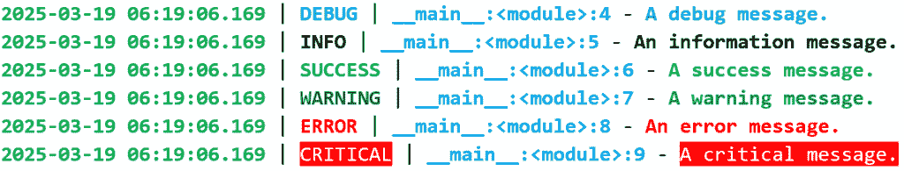
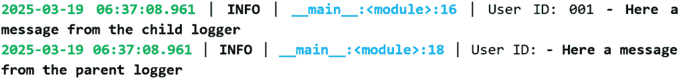
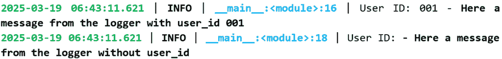
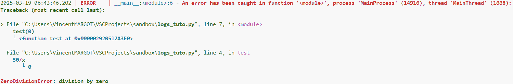

# 数据科学：从学校到工作，第三部分

> 原文：[`towardsdatascience.com/data-science-from-school-to-work-part-iii/`](https://towardsdatascience.com/data-science-from-school-to-work-part-iii/)

## **简介**

编写代码是关于解决问题的，但并非每个问题都是可预测的。在现实世界中，你的软件可能会遇到意外情况：缺失的文件、无效的用户输入、网络超时，甚至硬件故障。这就是为什么处理错误不仅仅是锦上添花；它是构建健壮和可靠的生产应用程序的关键部分。

想象一个电子商务网站。一位客户下订单，但在结账过程中，数据库连接出现问题。如果没有适当的错误处理，这个问题可能会导致应用程序崩溃，让客户感到沮丧，交易不完整。更糟糕的是，它可能会创建不一致的数据，导致后续更大的问题。因此，错误处理是任何想要为生产编写代码的 Python 开发人员的基本技能。

然而，良好的错误处理也与良好的日志记录系统密不可分。当代码在生产环境中运行时，很少有机会访问控制台。所以你的打印信息没有人能看到。为了确保你可以监控你的应用程序并调查任何事件，你需要设置一个日志系统。这就是[loguru](https://loguru.readthedocs.io/en/stable/api/logger.html)包发挥作用的地方，我将在本文中介绍它。

* * *

## **I – 如何处理 Python 错误？**

在这部分，我将介绍 Python 中错误处理的最佳实践，从 try-except 块和`raise`的使用到`finally`语句。这些概念将帮助你编写更干净、更易于维护的代码，适用于生产环境。

### **try-except 块**

try-except 块是处理 Python 中错误的主要工具。它允许你在代码执行过程中捕获潜在的错误，防止程序崩溃。

```py
def divide(a, b):
  try:
    return a / b
  except ZeroDivisionError:
    print(f"Only Chuck Norris can divide by 0!")
```

在这个简单的函数中，try-except 块允许拦截由除以 0 引起的错误。try 块中的代码被执行，如果发生错误，except 块会检查它是否是`ZeroDivisionError`并打印一条消息。但只捕获这种类型的错误。例如，如果*b*是一个字符串，就会发生错误。为了避免这种情况，你可以添加一个`TypeError`。因此，测试所有可能的错误是很重要的。

函数变为：

```py
def divide(a, b):
    try:
        return a / b
    except ZeroDivisionError:
        print(f"Only Chuck Norris can divide by 0!")
    except TypeError:
        print("Do not compare apples and orange!")
```

### **引发异常**

你可以使用`raise`语句手动引发异常。如果你想要报告用户定义的错误或对你的代码施加特定的限制，这很有用。

```py
def divide(a, b):
    if b == 0:
        raise ValueError("Only Chuck Norris can divide by 0!")
    return a / b

try:
    result = divide(10, 0)
except ValueError as e:
    print(f"Error: {e}")
except TypeError:
    print("Do not compare apples and orange!")
```

在这个例子中，如果除数是零，会触发`ValueError`异常。这样，你可以明确控制错误条件。在打印函数中，消息将是“*错误：只有 Chuck Norris 才能除以 0!*”。

### **一些最常见的异常**

**ValueError**：值的类型正确，但其值无效。

```py
try:
    number = math.sqrt(-10)
except ValueError:
  print("It's too complex to be real!")
```

**KeyError**：尝试访问字典中不存在的键。

```py
data = {"name": "Alice"}
try:
    age = data["age"]
except KeyError:
    print("Never ask a lady her age!")
```

**IndexError**：尝试访问列表中不存在的索引。

```py
items = [1, 2, 3]
try:
    print(items[3])
except IndexError:
    print("You forget that indexing starts at 0, don't you?")
```

**TypeError**：对不兼容的类型执行操作。

```py
try:
    result = "text" + 5
except TypeError:
    print("Do not compare apples and orange!")
```

**FileNotFoundError**：尝试打开一个不存在的文件。

```py
try:
    with open("notexisting_file.txt", "r") as file:
        content = file.read()
except FileNotFoundError:
    print("Are you sure of your path?")
```

**自定义错误**：你可以触发预定义的异常，也可以定义自己的异常类：

```py
class CustomError(Exception):
    pass

try:
    raise CustomError("This is a custom error")
except CustomError as e:
    print(f"Catched error: {e}")
```

### **使用** ***finally*** **语句清理**

无论是否发生错误，`finally` 块都会执行。它通常用于执行清理操作，例如关闭数据库连接或释放资源。

```py
import sqlite3

try:
    conn = sqlite3.connect("users_db.db")  # Connect to a database
    cursor = conn.cursor()
    cursor.execute("SELECT * FROM users")  # Execute a query
    results = cursor.fetchall()  # Get result of the query
    print(results)
except sqlite3.DatabaseError as e:
    print("Database error:", e)
finally:
    print("Closing the database connection.")
    if 'conn' in locals():
        conn.close()  # Ensures the connection is closed
```

### **错误处理的最佳实践**

1.  **捕获特定的异常**：避免使用未指定异常的通用 `except` 块，因为它可能会掩盖意外的错误。最好指定异常：

```py
# Bad practice
try:
    result = 10 / 0
except Exception as e:
    print(f"Error: {e}")

# Good practice
try:
    result = 10 / 0
except ZeroDivisionError as e: 
    print(f"Error: {e}")
```

1.  **提供明确的消息**：在抛出或处理异常时添加清晰且描述性的消息。

1.  **避免无声的失败**：如果你捕获到一个异常，确保它被记录或重新抛出，以免被忽略。

```py
import logging

logging.basicConfig(level=logging.ERROR)

try:
    result = 10 / 0
except ZeroDivisionError:
    logging.error("Division by zero detected.")
```

1.  **使用** `else` **和** `finally` **块**：只有当 `try` 块中没有抛出异常时，`else` 块才会运行。

```py
try:
    result = 10 / 2
except ZeroDivisionError:
    logging.error("Division by zero detected.")
else:
    logging.info(f"Success: {result}")
finally:
    logging.info("End of processing.")
```

* * *

## **II – 如何处理 Python 日志？**

良好的错误处理是一回事，但如果没有人知道错误已经发生，那么整个目的就失去了。正如引言中解释的那样，在生产环境中运行程序时，很少会咨询或看到监控器。没有人会看到打印输出。因此，良好的错误处理必须伴随着良好的日志系统。

### **什么是日志？**

日志是程序在执行过程中生成的消息记录，用于跟踪其执行期间发生的事件。这些消息可能包含有关错误、警告、成功操作、过程里程碑或其他相关事件的信息。日志对于调试、跟踪性能和监控应用程序的健康状况至关重要。它们允许开发者了解程序中正在发生的事情，而无需中断其执行，这使得解决问题和持续改进软件变得更加容易。

### **loguru 包**

Python 已经有一个本地的日志包：logging。但我们更喜欢 loguru 包，它使用起来更简单，配置也更容易。事实上，完整的输出格式已经预先配置。

```py
from loguru import logger
logger.debug("A pretty debug message!")
```


图片来自作者。

所有重要的元素都直接包含在消息中：

+   时间戳

+   日志级别，表示消息的严重性。

+   文件位置、模块和行号。在这个例子中，文件位置是 __main__，因为它是从命令行直接执行的。由于日志不在类或函数中，模块是 <module>。

+   消息。

### **不同的日志级别**

有几个日志级别需要考虑显示的消息的重要性（在打印中可能更复杂）。每个级别都有一个名称和关联的数字：

+   **TRACE**（5）：用于记录程序执行路径的详细信息，以供诊断目的使用。

+   **DEBUG**（10）：由开发人员用于记录调试目的的消息。

+   **INFO**（20）：用于记录描述正常程序操作的信息消息。

+   **SUCCESS**（25）：类似于 INFO，但用于指示操作的成功。

+   **WARNING**（30）：用于指示可能需要进一步调查的不寻常事件。

+   **ERROR**（40）：用于记录影响特定操作的错误条件。

+   **CRITICAL**（50）：用于记录阻止主功能工作的错误条件。

该软件包根据使用的级别自然处理不同的格式。

```py
from loguru import logger

logger.trace("A trace message.")
logger.debug("A debug message.")
logger.info("An information message.")
logger.success("A success message.")
logger.warning("A warning message.")
logger.error("An error message.")
logger.critical("A critical message.")
```



图片来自作者。

由于 loguru 使用的默认最小级别是调试，因此未显示跟踪消息。因此，它忽略了所有低于此级别的消息。

可以使用`level`方法定义新的日志级别，并与`log`方法一起使用。

```py
logger.level("FATAL", no=60, color="<red>", icon="!!!")
logger.log("FATAL", "A FATAL event has just occurred.")
```

+   名称：日志级别的名称。

+   无：对应的严重程度值（必须是整数）。

+   颜色：颜色标记。

+   图标：级别图标。

### **日志配置**

通过使用`remove`命令删除旧配置并使用`add`函数生成具有新配置的新记录器，可以重新创建记录器。

+   **[必填项] sink**：指定由记录器创建的每个数据集的目标。默认情况下，此值设置为`sys.stderr`（对应于标准错误输出）。我们还可以将所有输出存储在“.log”文件中（除非你有日志收集器）。

+   **级别**：设置记录器的最小日志级别。

+   **格式**：用于定义日志的自定义格式。为了在终端中保持日志的颜色，必须指定此选项（见下例）。

+   **过滤器**：用于确定是否记录日志。

+   **着色**：接受布尔值，用于确定是否激活终端着色。

+   **序列化**：如果设置为`True`，则日志将以 JSON 格式显示。

+   **回溯**：确定异常跟踪是否应超出错误记录的点，以方便故障排除。

+   **诊断**：确定是否应在异常跟踪中显示变量值。在生产环境中，此选项必须设置为`False`，以防止敏感信息泄露。

+   **队列**：如果此选项被激活，则日志数据记录将被放置在队列中，以避免多个进程连接到同一目标时的冲突。

+   **捕获**：当连接到指定的接收器服务器时发生意外错误，您可以通过将此选项设置为`True`来检测它。错误将在标准错误中显示。

```py
import sys
from loguru import logger

logger_format = (
    "{time:YYYY-MM-DD HH:mm:ss.SSS} | "
    "{level: <8} | "
    "{name}:{function}:{line}"
)
logger.remove()
logger.add(sys.stderr, format=logger_format) 
```

**注意**：

文件中的颜色消失了。这是因为存在特殊字符（称为**ansi**代码），它们在终端中显示颜色，但这种格式在文件中不存在。

**添加上下文到日志**

对于复杂的应用程序，向日志中添加更多信息以启用排序和便于故障排除可能很有用。

例如，如果用户更改数据库，除了更改信息外，包含用户 ID 可能很有用。

在开始记录上下文数据之前，您需要确保在自定义格式中包含`{extra}`指令。此变量是一个 Python 字典，包含每个日志条目的上下文数据（如果适用）。

这里是一个添加额外`user_id`的自定义示例。在此格式中，颜色。

```py
import sys
from loguru import logger

logger_format = (
    "<green>{time:YYYY-MM-DD HH:mm:ss.SSS}</green> | "
    "<level>{level: <8}</level> | "
    "<cyan>{name}</cyan>:<cyan>{function}</cyan>:<cyan>{line}</cyan> | "
    "User ID: {extra[user_id]} - <level>{message}</level>"
)
logger.configure(extra={"user_id": ""})  # Default value
logger.remove()
logger.add(sys.stderr, format=logger_format)
```

现在可以使用 bind 方法创建一个继承自父日志记录器的子日志记录器。

```py
childLogger = logger.bind(user_id="001")
childLogger.info("Here a message from the child logger")

logger.info("Here a message from the parent logger")
```



作者提供的图片。

另一种方法是使用 with 块中的 contextualize 方法。

```py
with logger.contextualize(user_id="001"):
    logger.info("Here a message from the logger with user_id 001")

logger.info("Here a message from the logger without user_id")
```



作者提供的图片。

除了 with 块之外，您还可以使用**装饰器**。然后前面的代码变为

```py
@logger.contextualize(user_id="001")
def child_logger():
    logger.info("Here a message from the logger with user_id 001")

child_logger()

logger.info("Here a message from the logger without user_id")
```

### **捕获方法**

当错误发生时，可以使用捕获方法自动记录错误。

```py
def test(x):
    50/x

with logger.catch():
    test(0)
```



作者提供的图片。

但将此方法用作装饰器会更简单。这会导致以下代码

```py
@logger.catch()
def test(x):
    50/x

test(0)
```

### **日志文件**

生产应用程序旨在持续且不间断地运行。在某些情况下，预测文件的行为很重要，否则在发生错误时您将不得不查阅日志的页面。

下面是文件可以被修改的不同条件：

+   **轮转**：指定一个条件，根据该条件关闭当前日志文件并创建一个新文件。这个条件可以是一个 int、一个 datetime 或一个 str。推荐使用 str，因为它更容易阅读。

+   **保留时间**：指定每个日志文件在从文件系统中删除之前应保留多长时间。

+   **压缩**：如果此选项被激活，则日志文件将转换为指定的压缩格式。

+   **延迟**：如果此选项设置为 True，则新日志文件的创建将延迟到第一条日志消息被推送。

+   **模式**、**缓冲**、**编码**：传递给 Python 函数 open 的参数，用于确定 Python 如何打开日志文件。

**注意**：

通常，在生产应用程序的情况下，将设置一个日志收集器以直接检索应用程序的输出。**因此，不需要创建日志文件**。

* * *

## **结论**

Python 中的错误处理是编写专业和可靠代码的重要步骤。通过结合 try-except 块、raise 语句和 finally 块，你可以可预测地处理错误，同时保持代码的可读性和可维护性。

此外，一个良好的日志系统可以提高监控和调试应用程序的能力。Loguru 提供了一个简单灵活的日志消息包，因此可以轻松集成到你的代码库中。

总结来说，将有效的错误处理与全面的日志系统相结合，可以显著提高 Python 应用程序的可靠性、可维护性和调试能力。

* * *

## **参考文献**

1 – Python 中的错误处理：[官方 Python 文档关于异常](https://docs.python.org/3/tutorial/errors.html)

2 – loguru 文档：[`loguru.readthedocs.io/en/stable/`](https://loguru.readthedocs.io/en/stable/)

3 – 关于 loguru 的指南：[`betterstack.com/community/guides/logging/loguru/`](https://betterstack.com/community/guides/logging/loguru/)
