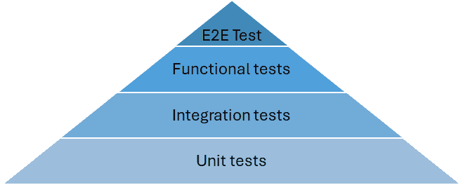
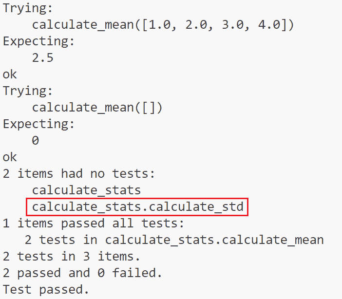
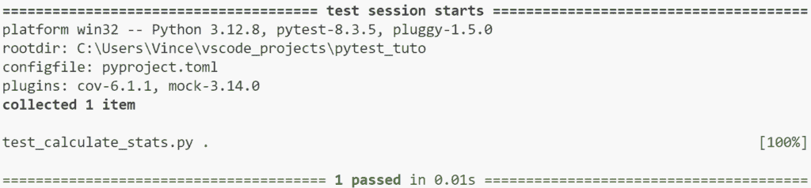
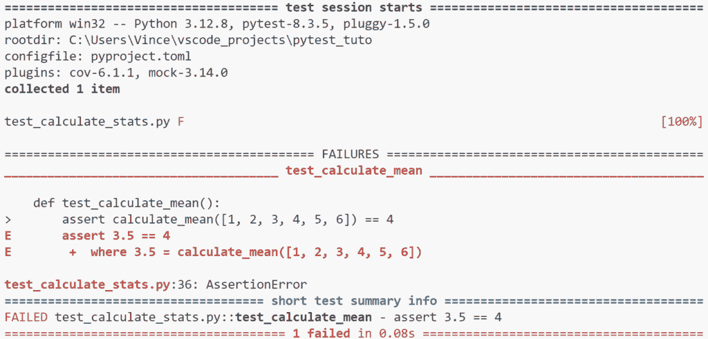
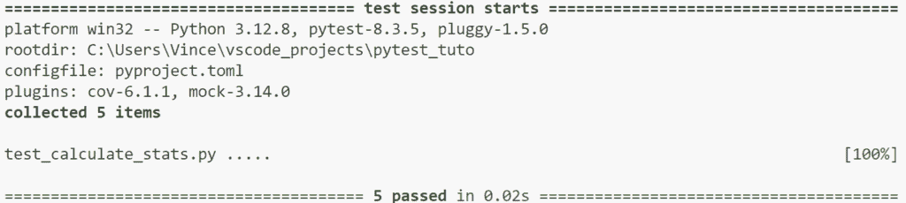
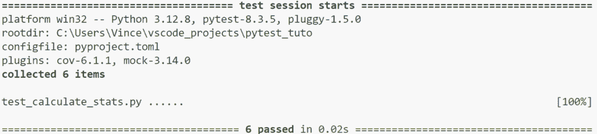
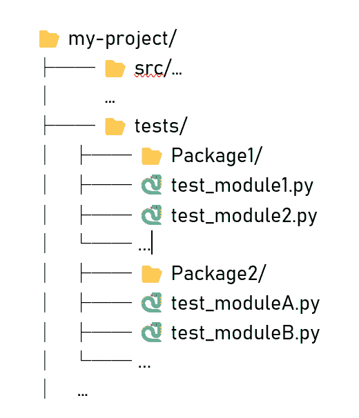
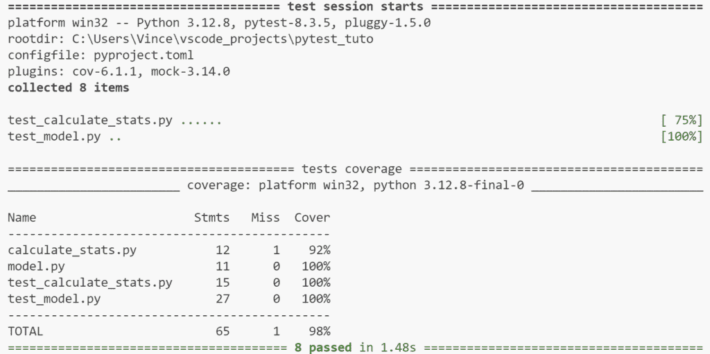
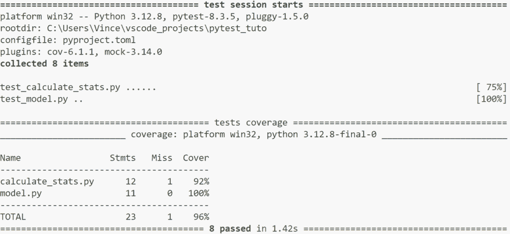

# 数据科学：从学校到工作，第四部分

> 原文：[`towardsdatascience.com/data-science-from-school-to-work-part-iv/`](https://towardsdatascience.com/data-science-from-school-to-work-part-iv/)

## <mdspan datatext="el1745436793378" class="mdspan-comment">简介</mdspan>

让我们从大多数人都感兴趣的简单例子开始。如果你想检查你的汽车转向灯是否正常工作，你坐在车里，打开点火开关，测试转向信号灯，看看前后灯是否工作。但如果灯不亮，很难判断原因。可能是灯泡坏了，电池没电了，转向信号开关可能故障。简而言之，有很多东西需要检查。这正是测试的目的。必须测试函数的每个部分，如转向灯，以找出哪里出了问题。测试灯泡、测试电池、测试控制单元和指示器之间的通信等等。

为了测试所有这些，存在不同类型的测试，通常以金字塔的形式呈现，从最快到最慢，从最隔离到最集成。这个测试金字塔可能因项目的具体要求而有所不同（数据库连接测试、认证测试等）。



测试金字塔 | 图片来自作者。

### 金字塔的底部：单元测试

单元测试是测试金字塔的基础，无论项目类型（和语言）如何。它们的目的在于测试代码单元，例如方法或函数。为了真正将单元测试视为单元测试，它必须遵守一个基本规则：单元测试不得依赖于测试单元外的功能。它们的优势在于速度快且可自动化。

**示例**：考虑一个从可迭代对象中提取偶数的函数。为了测试这个函数，我们需要创建几种不同类型的整数可迭代对象并检查输出。但我们也需要检查空可迭代对象、非整数类型的元素等情况下的行为。

### 中级水平：集成和功能测试

在单元测试之上的是集成测试。它们的目的在于检测单元测试无法检测到的错误。这些测试会检查添加新功能时，将其集成到应用程序中是否会导致问题。功能测试与此类似，但目的是测试一个精确的功能（例如认证过程）。

在一个项目中，尤其是在团队环境中，许多功能是由不同的开发者开发的。集成/功能测试确保所有这些功能能够良好地协同工作。它们也是自动运行的，这使得它们快速且可靠。

**示例**：考虑一个显示银行余额的应用程序。当执行取款操作时，余额会发生变化。集成测试将检查在余额初始化为 1000 欧元的情况下，进行 500 欧元的取款后，余额变为 500 欧元。

### 金字塔的顶端：端到端测试

端到端（E2E）测试是金字塔顶端的测试。它们验证应用程序从端到端是否按预期工作，即从用户界面到数据库或外部服务。它们通常设置起来既长又复杂，但不需要很多测试。

**示例**：考虑一个基于新数据的预测应用程序。这可能非常复杂，涉及数据检索、变量转换、学习等。端到端测试的目的是检查给定的新数据选择后，预测是否符合预期。

* * *

## 带有 Doctest 的单元测试

使用`docstring`是一种快速简单的创建单元测试的方法。让我们以一个包含两个函数的脚本`calculate_stats.py`为例：`calculate_mean()`具有完整的文档字符串，这在[Python 最佳实践](https://towardsdatascience.com/data-science-from-school-to-work-part-ii/)中有所介绍，以及具有常规文档字符串的函数`calculate_std()`。

```py
import math
from typing import List

def calculate_mean(numbers: List[float]) -> float:
    """
    Calculate the mean of a list of numbers.

    Parameters
    ----------
    numbers : list of float
        A list of numerical values for which the mean is to be calculated.

    Returns
    -------
    float
        The mean of the input numbers.

    Raises
    ------
    ValueError
        If the input list is empty.

    Notes
    -----
    The mean is calculated as the sum of all elements divided by the number of elements.

    Examples
    --------
    >>> calculate_mean([1.0, 2.0, 3.0, 4.0])
    2.5
    >>> calculate_mean([])
    0
    """

    if len(numbers) > 0:
        return sum(numbers) / len(numbers)
    else:
        return 0

def calculate_std(numbers: List[float]) -> float:
    """
    Calculate the standard deviation of a list of numbers.

    Parameters
    ----------
    numbers : list of float
        A list of numerical values for which the mean is to be calculated.

    Returns
    -------
    float
        The std of the input numbers.
    """

    if len(numbers) > 0:
        m = calculate_mean(numbers)
        gap = [abs(x - m)**2 for x in numbers]
        return math.sqrt(sum(gap) / (len(numbers) - 1))
    else:
        return 0
```

测试包含在函数`calculate_mean()`文档字符串的“示例”部分中。Doctest 遵循终端布局：每行开始处的三个箭头表示要执行的命令和下面预期的结果。要运行测试，只需输入以下命令

```py
 python -m doctests calculate_stats.py -v
```

或者如果你使用[uv](https://towardsdatascience.com/data-scientist-from-school-to-work-part-i/)（我鼓励使用）

```py
uv run python -m doctest calculate_stats.py -v
```

`-v`参数允许显示以下输出：



如您所见，有两个测试且没有失败，`doctest`具有智能，可以指出所有没有测试的方法（如`calculate_std()`）。

* * *

## 使用 Pytest 的单元测试

使用`doctest`很有趣，但很快就会变得有限。为了真正全面的测试过程，我们使用特定的框架。有两个主要的测试框架：`unittest`和`pytest`。后者通常被认为更简单、更直观。

要安装包，只需输入以下命令：

```py
pip install pytest (in your virtual environment)
```

或者

```py
uv add pytest
```

### 1 – 编写你的第一个测试

让我们以`calculate_stats.py`脚本为例，为`calculate_mean()`函数编写测试。为此，我们创建一个包含以下行的脚本`test_calculate_stats.py`：

```py
from calculate_stats import calculate_mean

def test_calculate_mean():
    assert calculate_mean([1, 2, 3, 4, 5, 6]) == 3.5
```

测试基于断言命令。此指令使用以下语法：

> assert expression1 [, expression2]

expression1 是要测试的条件，而可选的 expression2 是在条件未验证时显示的错误消息。

Python 解释器将每个断言语句转换为：

```py
if __debug__:
    if not expression1:
        raise AssertionError(expression2)
```

### 2 – 运行测试

要运行测试，我们使用以下命令：

```py
pytest (in your virtual environment)
```

或者

```py
uv run pytest
```

结果如下：



### 3 – 分析输出

`pytest`的一个巨大优点是其反馈的质量。对于每个测试，你都会得到：

+   成功的标志是一个绿色点（.）

+   F 表示失败；

+   E 表示错误；

+   s 表示跳过的测试（使用装饰器`@pytest.mark.skip(reason="message")`）。

在失败的情况下，pytest 提供了：

+   失败测试的确切名称；

+   有问题的代码行；

+   预期和获取的值；

+   一个完整的跟踪以方便调试。

例如，如果我们将 == 3.5 替换为 == 4，我们将得到以下输出：



### 4 – 使用参数化

为了正确测试一个函数，你需要彻底测试它。换句话说，用不同类型的输入和输出测试它。问题是很快你就会得到一系列越来越长的 assert 和 test 函数，这不容易阅读。

为了克服这个问题并在单个单元测试中测试多个数据集，我们使用 `parametrize`。想法是创建一个包含所有要测试的数据集的列表，然后使用 `@pytest.mark.parametrize` 装饰器。最后一个测试可以如下所示

```py
from calculate_stats import calculate_mean
import pytest

testdata = [
    ([1, 2, 3, 4, 5, 6], 3.5),
    ([], 0),
    ([1.2, 3.8, -1], 4 / 3),
]

@pytest.mark.parametrize("numbers, expected", testdata)
def test_calculate_mean(numbers, expected):
    assert calculate_mean(numbers) == expected
```

如果你想添加一个测试集，只需向 testdata 添加一个元组即可。

还建议创建另一种类型的测试来检查是否引发了错误，使用 `pytest.raises(Exception)` 的上下文：

```py
testdata_fail = [
    1,
    "a",
]

@pytest.mark.parametrize("numbers", testdata_fail)
def test_calculate_mean_fail(numbers):
    with pytest.raises(Exception):
        calculate_mean(numbers)
```

在此情况下，如果函数返回一个包含 *testdata_fail* 数据的错误，测试将成功。



### 5 – 使用模拟

如介绍中所述，单元测试的目的是测试单个代码单元，并且最重要的是它不能依赖于外部组件。这就是 **mocks** 发挥作用的地方。

Mocks 模拟常量、函数甚至类的行为。为了创建和使用 mocks，我们将使用 `pytest-mock` 包。要安装它：

```py
pip install pytest-mock (in your virtual environment)
```

或者

```py
uv add pytest-mock
```

#### a) 模拟函数

为了说明 mock 的使用，让我们以我们的 `test_calculate_stats.py` 脚本为例，并实现 `calculate_std()` 函数的测试。问题是它依赖于 `calculate_mean()` 函数。因此，我们将使用 `mocker.patch` 方法来模拟其行为。

`calculate_std()` 函数的测试编写如下

```py
def test_calculate_std(mocker):
    mocker.patch("calculate_stats.calculate_mean", return_value=0)

    assert calculate_std([2, 2]) == 2
    assert calculate_std([2, -2]) == 2
```

执行 pytest 命令会产生



**解释**：

`mocker.patch("calculate_stats.calculate_mean", return_value=0)` 这行代码将 `0` 赋值给 `calculate_stats.py` 中的 `calculate_mean()` 函数的返回值。由于我们通过总是返回 `0` 来模拟 `calculate_mean()` 的行为，因此对序列 [2, 2] 的标准差计算被扭曲了。如果序列的平均值确实是 `0`，则计算是正确的，如第二个断言所示。

#### b) 模拟类

以类似的方式，你可以模拟类的行为并模拟其方法和/或属性。为此，你需要实现一个 `Mock` 类，其中包含要修改的方法/属性。

考虑一个函数，`need_pruning()`，它测试是否应该根据其叶子中的最小点数修剪决策树：

```py
from sklearn.tree import BaseDecisionTree

def need_pruning(tree: BaseDecisionTree, max_point_per_node: int) -> bool:
    # Get the number of samples in each node
    n_samples_per_node = tree.tree_.n_node_samples

    # Identify which nodes are leaves.
    is_leaves = (tree.tree_.children_left == -1) & (tree.tree_.children_right == -1)

    # Get the number of samples in leaf nodes
    n_samples_leaf_nodes = n_samples_per_node[is_leaves]
    return any(n_samples_leaf_nodes < max_point_per_node)
```

测试这个函数可能很复杂，因为它依赖于`scikit-learn`包中的`DecisionTree`类。更重要的是，在测试函数之前，你需要数据来训练一个`DecisionTree`。

为了克服所有这些困难，我们需要模拟`DecisionTree`的`tree_`对象的属性。

```py
from model import need_pruning
from sklearn.tree import DecisionTreeRegressor
import numpy as np

class MockTree:
    # Mock tree with two leaves with 5 points each.
    @property
    def n_node_samples(self):
        return np.array([20, 10, 10, 5, 5])

    @property
    def children_left(self):
        return np.array([1, 3, 4, -1, -1])

    @property
    def children_right(self):
        return np.array([2, -1, -1, -1, -1])

def test_need_pruning(mocker):
    new_model = DecisionTreeRegressor()
    new_model.tree_ = MockTree()

    assert need_pruning(new_model, 6)
    assert not need_pruning(new_model, 2)
```

**说明**：

`MockTree`类可以用来模拟`tree_`对象的`n_node_samples`、`children_left`和`children_right`属性。在测试中，我们创建一个`DecisionTreeRegressor`对象，其`tree_`属性被`MockTree`替换。这控制了`need_pruning()`函数所需的`n_node_samples`、`children_left`和`children_right`属性。

### 4 – 使用固定配置

让我们通过添加一个函数`get_predictions()`来完成前面的例子，以检索每个树叶中感兴趣变量的平均值：

```py
def get_predictions(tree: BaseDecisionTree) -> np.ndarray:
    # Identify which nodes are leaves.
    is_leaves = (tree.tree_.children_left == -1) & (tree.tree_.children_right == -1)

    # Get the target mean in the leaves
    values = tree.tree_.value.flatten()[is_leaves]
    return values
```

测试这个函数的一种方法是将`test_need_pruning()`测试的前两行重复一遍。但一个更简单的解决方案是使用`pytest.fixture`装饰器创建一个固定配置。

为了测试这个新功能，我们需要之前创建的`MockTree`。但是，为了避免代码重复，我们使用一个固定配置。然后测试脚本变为：

```py
from model import need_pruning, get_predictions
from sklearn.tree import DecisionTreeRegressor
import numpy as np
import pytest

class MockTree:
    @property
    def n_node_samples(self):
        return np.array([20, 10, 10, 5, 5])

    @property
    def children_left(self):
        return np.array([1, 3, 4, -1, -1])

    @property
    def children_right(self):
        return np.array([2, -1, -1, -1, -1])

    @property
    def value(self):
        return np.array([[[5]], [[-2]], [[-8]], [[3]], [[-3]]])

@pytest.fixture
def tree_regressor():
    model = DecisionTreeRegressor()
    model.tree_ = MockTree()
    return model

def test_nedd_pruning(tree_regressor):
    assert need_pruning(tree_regressor, 6)
    assert not need_pruning(tree_regressor, 2)

def test_get_predictions(tree_regressor):
    assert all(get_predictions(tree_regressor) == np.array([3, -3]))
```

在我们的例子中，固定配置允许我们拥有一个`DecisionTreeRegressor`对象，其`tree_`属性就是我们的`MockTree`。

固定配置的优势在于它为具有相同上下文或数据集的一组测试提供了一个固定的开发环境。这可以用于：

+   准备对象；

+   启动或停止服务；

+   使用数据集初始化数据库；

+   为 Web 项目创建测试客户端；

+   配置模拟对象。

### 5 – 组织测试目录

`pytest`将对所有以 test_ 或 _test 结尾的文件运行测试。使用这种方法，你可以简单地使用`pytest`命令来运行项目中的所有测试。

与 Python 项目的其余部分一样，测试目录必须是有结构的。我们建议：

+   按包分解你的测试

+   每个脚本测试不超过一个模块



图片来自作者

然而，你也可以通过指定.py 脚本的路径来仅运行脚本的测试。

```py
pytest .\test\Package1\tests_module1.py  (in your virtual environment)
```

或者

```py
uv run pytest .\test\Package1\tests_module1.py
```

### 6 – 分析你的测试覆盖率

一旦编写了测试，查看测试覆盖率率就值得了。为此，我们安装以下两个包：`coverage`和`pytest-cov`并运行覆盖率度量。

```py
pip install pytest-cov, coverage (in your virtual environment)
pytest --cov=your_main_directory 
```

或者

```py
uv add pytest-mock, coverage
uv run pytest --cov=your_main_directory
```

工具随后通过计数测试的行数来度量覆盖率。以下输出是得到的。



`calculate_stats.py`脚本获得的 92%来自计算平均偏差平方的行：

```py
gap = [abs(x - m)**2 for x in numbers]
```

为了防止某些脚本被分析，你可以在项目根目录的`.coveragerc`配置文件中指定排除项。例如，要排除两个测试文件，写入

```py
[run]
omit = .\test_*.py
```

我们得到



最后，对于更大的项目，您可以通过输入以下命令来管理覆盖率分析的 html 报告

```py
pytest --cov=your_main_directory --cov-report html  (in your virtual environment)
```

或者

```py
uv run pytest --cov=your_main_directory --cov-report html
```

### 7 – 一些有用的包

+   `pytest-xdist`: 通过使用多个 CPU 加速测试执行。

+   `pytest-randomly`: 随机混合测试项的顺序。减少测试之间意外依赖的风险。

+   `pytest-instafail`: 立即显示失败和错误，而不是等待所有测试完成。

+   `pytest-tldr`: 默认的 pytest 输出很啰嗦。此插件将输出限制为仅失败的测试的痕迹。

+   `pytest-mlp`: 允许您通过比较图像来测试 Matplotlib 的结果。

+   `pytest-timeout`: 结束耗时过长的测试，这可能是由于无限循环造成的。

+   `freezegun`: 允许使用装饰器 `@freeze_time()` 模拟 datetime 模块。

特别感谢 [Banias Baabe](https://www.linkedin.com/in/banias/?originalSubdomain=de) 提供了这个列表。

* * *

## 集成和功能测试

现在单元测试已经编写完成，大部分工作已经完成。加油，我们几乎成功了！

作为提醒，单元测试旨在在不与另一个函数交互的情况下测试代码单元。这样我们就知道每个函数/方法都做了它被开发时应该做的事情。现在是时候测试它们如何协同工作了！

### 1 – 集成测试

集成测试用于检查不同代码单元的组合、它们的交互以及子系统如何组合成通用系统。

我们编写集成测试的方式与编写单元测试的方式没有区别。为了说明这一点，我们创建了一个非常简单的 `FastApi` 应用程序，用于在“数据库”中获取或设置登录/密码对。为了简化示例，数据库只是一个名为 users 的 `dict`。我们创建了一个包含以下代码的 `main.py` 脚本

```py
from fastapi import FastAPI, HTTPException

app = FastAPI()

users = {"user_admin": {"Login": "admin", "Password": "admin123"}}

@app.get("/users/{user_id}")
async def read_user(user_id: str):
    if user_id not in users:
        raise HTTPException(status_code=404, detail="Users not found")
    return users[user_id]

@app.post("/users/{user_id}")
async def create_user(user_id: str, user: dict):
    if user_id in users:
        raise HTTPException(status_code=400, detail="User already exists")
    users[user_id] = user
    return user
```

要测试此应用程序，您必须使用 `httpx` 和 `fastapi.testclient` 包向您的端点发送请求并验证响应。测试脚本如下：

```py
from fastapi.testclient import TestClient
from main import app

client = TestClient(app)

def test_read_user():
    response = client.get("/users/user_admin")
    assert response.status_code == 200
    assert response.json() == {"Login": "admin", "Password": "admin123"}

def test_read_user_not_found():
    response = client.get("/users/new_user")
    assert response.status_code == 404
    assert response.json() == {"detail": "User not found"}

def test_create_user():
    new_user = {"Login": "admin2", "Password": "123admin"}
    response = client.post("/users/new_user", json=new_user)
    assert response.status_code == 200
    assert response.json() == new_user

def test_create_user_already_exists():
    new_user = {"Login": "duplicate_admin", "Password": "admin123"}
    response = client.post("/users/user_admin", json=new_user)
    assert response.status_code == 400
    assert response.json() == {"detail": "User already exists"} 
```

在这个例子中，测试依赖于在 `main.py` 脚本中创建的应用程序。因此，这些不是单元测试。我们测试不同的场景以检查应用程序是否运行良好。

集成测试确定独立开发的代码单元在链接在一起时是否正确工作。要实现集成测试，我们需要：

+   编写包含场景的功能

+   添加断言以检查测试用例

### 2 – 功能测试

功能测试确保应用程序的功能符合规范。它们与集成测试和单元测试不同，因为您不需要了解代码就可以执行它们。实际上，对功能规范的良好了解就足够了。

项目经理可以编写应用程序的所有规范，开发者可以编写测试来测试这些规范。

在我们之前关于 FastApi 应用程序的例子中，一个规格是能够添加新用户并检查该新用户是否在数据库中。因此，我们使用这个测试来测试“添加用户”的功能。

```py
from fastapi.testclient import TestClient
from main import app

client = TestClient(app)

def test_add_user():
    new_user = {"Login": "new_user", "Password": "new_password"}
    response = client.post("/users/new_user", json=new_user)
    assert response.status_code == 200
    assert response.json() == new_user

    # Check if the user was added to the database
    response = client.get("/users/new_user")
    assert response.status_code == 200
    assert response.json() == new_user 
```

## 端到端测试

结束在即！端到端（E2E）测试专注于模拟现实世界场景，涵盖从简单到复杂的各种流程。本质上，它们可以被视为具有多个步骤的功能测试。

然而，E2E 测试执行起来最耗时，因为它们需要构建、部署和启动浏览器来与应用程序交互。

当 E2E 测试失败时，由于测试范围广泛，涵盖了整个应用程序，因此识别问题可能具有挑战性。因此，你现在可以理解为什么测试金字塔被设计成这样。

由于其广泛的范围和涉及整个应用程序的事实，E2E 测试也是最难编写和维护的。

理解 E2E 测试不是替代其他测试方法，而是一种补充方法至关重要。E2E 测试应用于验证应用程序的特定方面，例如按钮功能、表单提交和工作流程完整性。

理想情况下，测试应尽可能早地检测到错误，接近金字塔的底部。E2E 测试旨在验证整体工作流程和关键交互是否正确运行，提供最后一层保障。

在我们上一个例子中，如果用户数据库连接到身份验证服务，E2E 测试将包括创建新用户、选择用户名和密码，然后通过图形界面测试使用该新用户的身份验证。

* * *

## 结论

总结来说，平衡的测试策略对于任何生产项目都是必不可少的。通过实施单元测试、集成测试、功能测试和 E2E 测试的系统，你可以确保你的应用程序符合规格。并且，通过遵循最佳实践和使用正确的测试工具，你可以编写更可靠、可维护和高效的代码，并向用户交付高质量的软件。最后，这也简化了未来的开发，并确保新功能不会破坏代码。

* * *

## **参考文献**

1 – pytest 文档 [`docs.pytest.org/en/stable/`](https://docs.pytest.org/en/stable/)

2 – 一篇有趣的博客 [`realpython.com/python-testing/`](https://realpython.com/python-testing/) 和 [`realpython.com/pytest-python-testing/`](https://realpython.com/pytest-python-testing/)
