# 数据科学：从学校到工作，第五部分

> 原文：[`towardsdatascience.com/data-science-from-school-to-work-part-v/`](https://towardsdatascience.com/data-science-from-school-to-work-part-v/)
> 
> *先让它工作，然后让它变得美观，然后如果你真的、真的必须，再让它变得快速。90%的时间，如果你让它变得美观，它已经足够快了。所以，实际上，只需让它变得美观！* ([来源](https://henrikwarne.com/2021/04/16/more-good-programming-quotes-part-5/))
> 
> — *乔·阿姆斯特朗*（Erlang 编程语言的共同设计者。）

<mdspan datatext="el1750880886773" class="mdspan-comment">这是本系列“数据科学：从学校到工作”的最后一篇关于 Python 的文章。</mdspan> 从一开始，你已经学习了如何[使用 UV 管理你的 Python 项目](https://towardsdatascience.com/data-scientist-from-school-to-work-part-i/)，[如何使用 PEP 和 SOLID 原则编写干净的代码](https://towardsdatascience.com/data-science-from-school-to-work-part-ii/)，[如何处理错误并使用 loguru 记录你的代码](https://towardsdatascience.com/data-science-from-school-to-work-part-iii/)，以及[如何编写测试](https://towardsdatascience.com/data-science-from-school-to-work-part-iv/).

现在你已经处于创建工作、生产就绪代码的位置。但代码永远不会完美，总是可以改进。创建代码的最后一步（可选，但强烈推荐）是优化。

要优化你的代码，你需要能够跟踪其中的情况。为此，我们使用称为**分析器**的工具。它们生成代码的配置文件。这意味着一组统计信息，描述了程序各个部分执行频率和持续时间。它们使你能够识别瓶颈和消耗过多资源的代码部分。换句话说，它们显示了你的代码应该在哪里进行优化。

现在，Python 中存在如此多的分析器，Pycharm 中的默认分析器被称为[yappi](https://pypi.org/project/yappi/)，意为“另一个 Python 分析器”。

因此，本文并不是所有现有分析器的详尽列表。在本文中，我介绍了一个工具，用于分析我们想要分析代码的各个方面：内存、时间和 CPU/GPU 消耗。其他包将提及一些参考，但不会详细说明。

* * *

## I – 内存分析器

内存分析是监控和评估程序运行时内存利用率的技巧。这种方法帮助开发者找到内存泄漏、优化内存利用，并理解程序内存消耗模式。内存分析对于防止应用程序使用比必要的更多内存，从而造成性能缓慢或崩溃至关重要。

### 1/ 内存分析器

`memory_profiler`是一个易于使用的 Python 模块，旨在分析脚本的内存使用情况。它依赖于`psutil`模块。要安装此包，只需输入以下命令：

```py
pip install memory_profiler # (in your virtual environment)
# or if you use uv (what I encourage)
uv add memory_profiler
```

#### 分析可执行文件

这个包的一个优点是它不仅限于 Pythonic 使用。它安装了 `mprof` 命令，允许监控任何可执行文件的活动。

例如，你可以通过运行此命令来监控 `ollama` 等应用程序的内存消耗：

```py
mprof run ollama run gemma3:4b
# or with uv
uv run mprof run ollama run gemma3:4b
```

要查看结果，你必须首先安装 `matplotlib`。然后，你可以通过运行以下命令来绘制你的可执行文件记录的内存配置文件：

```py
mprof plot
# or with uv
uv run mprof plot
```

图形看起来如下所示：

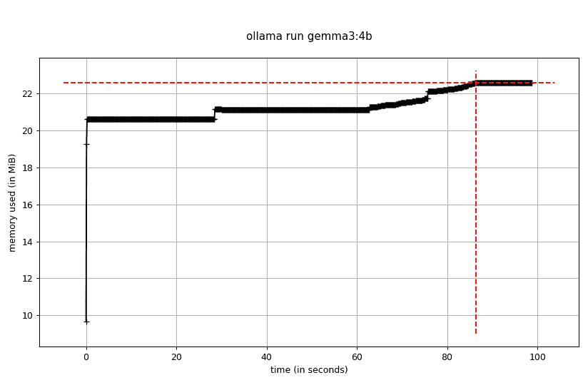

监控可执行文件 ollama 运行 gemma3:4b 后的命令 mprof plot 的输出（作者提供）。

#### 分析 Python 代码

让我们回到我们为什么会在这里的原因，即对 Python 代码的监控。

`memory_profiler` 使用简单的装饰器 `@profile` 以按行模式工作。首先，你装饰感兴趣的函数，然后运行脚本。输出将直接写入终端。考虑以下 `monitoring.py` 脚本：

```py
@profile
def my_func():
    a = [1] * (10 ** 6)
    b = [2] * (2 * 10 ** 7)
    del b
    return a

if __name__ == '__main__':
    my_func()
```

重要的是要注意，在脚本开头不需要导入包 `from memory_profiler import profile`。在这种情况下，你必须向 Python 解释器指定一些特定的参数。

```py
python-m memory_profiler monitoring.py # with a space between python and -m
# or
uv run -m memory_profiler monitoring.py
```

你将得到以下按行详细输出的结果：

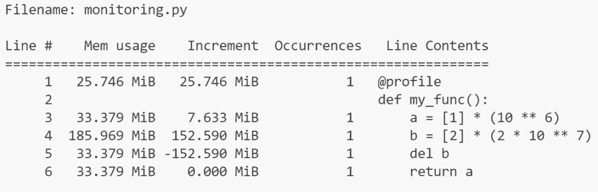

命令 -m memory_profiler monitoring.py 的输出（作者提供）

输出是一个包含五列的表格。

+   行号：被分析代码的行号

+   内存使用：执行该行后 Python 解释器的内存使用情况。

+   增量：与上一行相比的内存使用变化。

+   出现次数：该行被执行的次数。

+   行内容：实际的源代码。

此输出非常详细，允许对特定函数进行非常精细的监控。

> **重要**：不幸的是，这个包不再积极维护。创建者正在寻找替代品。

### 2/ tracemalloc

`tracemalloc` 是 Python 中的一个内置模块，用于跟踪内存分配和释放。Tracemalloc 提供了一个易于使用的接口来捕获和分析内存使用快照，使其成为任何 Python 开发者的宝贵工具。

它提供了以下详细信息：

+   通过提供跟踪回溯来显示每个对象是如何被分配的。

+   通过文件和行号提供内存分配统计信息，包括总体大小、计数和内存块的平均大小。

+   允许你比较两个快照以识别潜在的内存泄漏。

包 `tracemalloc` 可能有助于识别代码中的内存泄漏。

个人而言，我发现它比本文中介绍的其它包设置起来不太直观。以下是一些进一步了解的链接：

+   由 [Arsène Tripard](https://www.linkedin.com/in/ars%C3%A8ne-tripard-50a535146/) 撰写的文章，详细介绍了如何识别内存泄漏：[链接](https://data-ai.theodo.com/en/technical-blog/how-data-ml-engineers-can-uncover-memory-leaks-before-they-hit-production)

+   一篇来自博客 [CoderzColumn](https://coderzcolumn.com/) 的详细文章，描述了如何使用此包：[链接](https://coderzcolumn.com/tutorials/python/tracemalloc-how-to-trace-memory-usage-in-python-code)

* * *

## II – 时间分析器

时间分析是测量程序不同部分所花费时间的进程。通过识别性能瓶颈，你可以将优化努力集中在代码中将对性能产生最大影响的部分。

### 1/ line-profiler

`line-profiler` 包与 `memory-profiler` 非常相似，但它的用途不同。它被设计用来通过测量这些函数中每行的执行时间来分析特定的函数。为了有效地使用 LineProfiler，你需要明确指定你想要它分析的函数，只需在这些函数上方添加 `@profile` 装饰器即可。

要安装它，只需输入：

```py
pip install line_profiler # (in your virtual environment)
# or
uv add line_profiler
```

考虑以下名为 `monitoring.py` 的脚本

```py
@profile
def create_list(lst_len: int):
    arr = []
    for i in range(0, lst_len):
        arr.append(i)

def print_statement(idx: int):
    if idx == 0:
        print("Starting array creation!")
    elif idx == 1:
        print("Array created successfully!")
    else:
        raise ValueError("Invalid index provided!")

@profile
def main():
    print_statement(0)
    create_list(400000)
    print_statement(1)

if __name__ == "__main__":
    main()
```

要测量 `main()` 和 `create_list()` 函数的执行时间，我们添加了 `@profile` 装饰器。

获取此脚本的执行时间分析的最简单方法是使用 `kernprof` 脚本。

```py
kernprof -lv monitoring.py # (in your virtual environment)
# or
uv run kernprof -lv monitoring.py
```

它将创建一个名为 `your_script.py.lprof` 的二进制文件。参数 `-v` 允许直接在终端显示输出。

否则，你可以稍后像这样查看结果：

```py
python-m line_profiler monitoring.py.lprof # (in your virtual environment)
# or
uv run python -m line_profiler monitoring.py.lprof
```

它提供了以下信息：

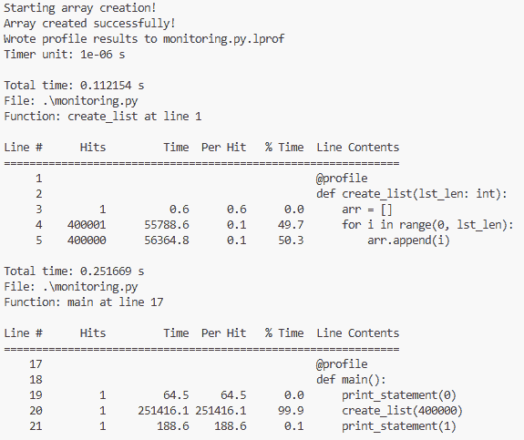

命令 kernprof -lv monitoring.py 的输出（作者提供）

有两个表格，一个按分析函数分类。每个表格包含以下信息

+   行号：文件中的行号。

+   击中次数：该行被执行的次数。

+   时间：执行该行所花费的总时间，以**计时器单位**计。在表格前面的头部信息中，你会看到一行“计时器单位：”，给出转换为秒的转换因子。在不同的系统上可能不同。

+   每次击中：执行该行一次的平均时间，以计时器单位计。

+   % 时间：该行相对于记录的函数中花费的总时间的百分比。

+   行内容：实际的源代码。

### 1/ cProfile

Python 内置了两个内置分析器：

+   [`cProfile`](https://docs.python.org/3/library/profile.html#module-cProfile)：一个具有合理开销的 C 扩展，使其适合分析长时间运行的程序。它对大多数用户推荐。

+   [`profile`](https://docs.python.org/3/library/profile.html#module-profile)：一个纯 Python 模块，其接口被 `cProfile` 模块模仿，但会给分析程序增加显著的开销。当你需要扩展或自定义分析功能时，它可能是一个有价值的工具。

基本语法是`cProfile.run(statement, filename=None, sort=-1)`。`filename`参数可以传递以保存输出。`sort`参数可以用来指定输出如何打印。默认情况下，它设置为-1（无值）。

例如，如果您修改监控脚本如下：

```py
import cProfile

def create_list(lst_len: int):
    arr = []
    for i in range(0, lst_len):
        arr.append(i)

def print_statement(idx: int):
    if idx == 0:
        print("Starting array creation!")
    elif idx == 1:
        print("Array created successfully!")
    else:
        raise ValueError("Invalid index provided!")

def main():
    print_statement(0)
    create_list(400000)
    print_statement(1)

if __name__ == "__main__":
    cProfile.run("main()") 
```

我们有以下输出：

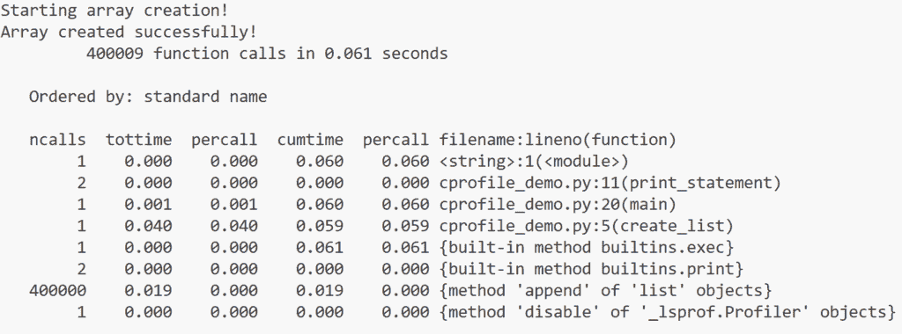

首先，我们有脚本输出：`print_statement(0)`和`print_statement(1)`。

然后，我们有分析器输出：第一行显示函数调用次数和运行时间。第二行是排序参数的提醒。并且，分析器提供了一个包含六列的表格：

1.  ncalls：显示调用次数

1.  tottime：给定函数所花费的总时间。请注意，调用子函数所花费的时间不包括在内。

1.  percall：总时间 / 调用次数。（余数被省略）

1.  cumtime：与 tottime 不同，这包括在这个函数及其所有被高级函数调用的子函数中花费的时间。对于递归函数来说，它最有用且准确。

1.  percall：cumtime 之后的 percall 是 cumtime 除以原始调用次数的商。原始调用次数包括所有未通过递归包含的调用。

1.  filename：方法的名称。

表格的第一行和最后一行来自 cProfile。其他行是关于脚本的。

您可以使用`Profile()`类自定义输出。首先，您必须初始化 Profile 类的实例，并使用`enable()`和`disable()`方法分别开始和结束收集分析数据。然后，可以使用`pstats`模块来操作分析器对象收集的结果。

要按累积时间排序输出，而不是按标准名称，可以将之前的代码重写如下：

```py
import cProfile, pstats

# ... 
# Same as before

if __name__ == "__main__":
    profiler = cProfile.Profile()
    profiler.enable()
    main()
    profiler.disable()
    stats = pstats.Stats(profiler).sort_stats('cumtime')
    stats.print_stats() 
```

输出结果如下：

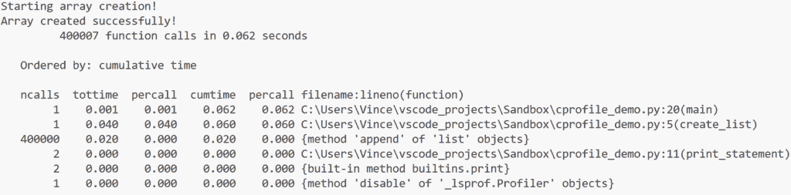

如您所见，现在表格是按`cumtime`排序的。而前一个表格中的 cProfile 的两行数据并未包含在这个表格中。

#### 使用 Snakeviz 可视化分析。

输出非常容易分析。但如果分析代码太大，可能会变得难以阅读。

另一种分析输出的方法是可视化数据而不是读取它。为此，我们使用`Snakeviz`包。要安装它，只需输入：

```py
pip install snakeviz # (in your virtual environment)
# or
uv add snakeviz
```

然后将`stats.print_stats()`替换为`stats.dump_stats("profile.prof")`以保存分析数据。现在，您可以通过输入以下命令来可视化分析：

```py
snakeviz profile.prof
```

它启动一个文件浏览器界面，您可以从其中选择两种数据可视化：Icicle 和 Sunburst。

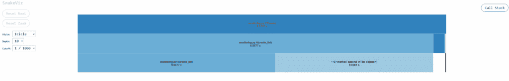

回归脚本分析的 Icicle 可视化（作者提供）。

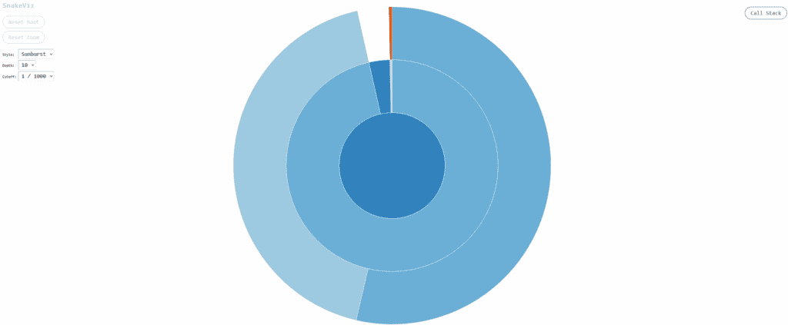

回归脚本分析的 Sunburst 可视化（作者提供）。

它比 `print_stats()` 输出更容易阅读，因为你可以通过将鼠标移到每个元素上与之交互。例如，你可以获取关于函数 `create_list()` 的更多详细信息。

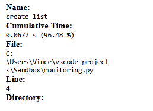

关于函数 `evaluate_model()` 的时间消耗详情（作者提供）。

#### 使用 gprof2dot 创建调用图

调用图是程序中函数或方法之间关系的视觉表示，显示了哪些函数调用其他函数以及每个函数或方法花费的时间。它可以看作是代码的地图。

```py
pip install gprof2dot # (in your virtual environment)
# or
uv add gprof2dot
```

然后通过输入以下命令执行：

```py
python-m cProfile -o monitoring.pstats .\monitoring.py # (in your virtual environment)
# or
uv run python-m cProfile -o monitoring.pstats .\monitoring.py 
```

它将创建一个名为 `monitoring.pstats` 的文件，可以使用以下命令将其转换为调用图：

```py
gprof2dot -f pstats monitoring.pstats | dot -Tpng -o monitoring.png # (in your virtual environment)
# or
uv run gprof2dot -f pstats monitoring.pstats | dot -Tpng -o monitoring.png
```

然后将调用图保存到名为 `monitoring.png` 的 png 文件中。

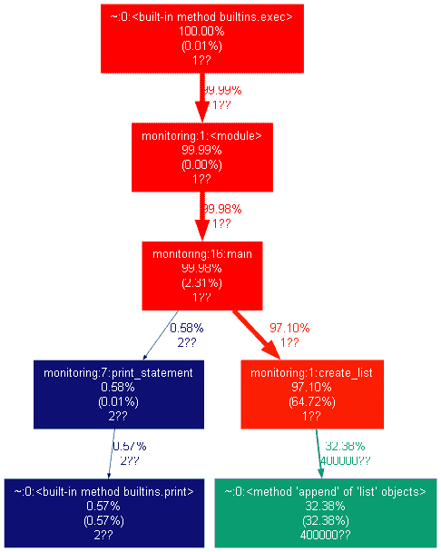

监控.py 脚本的调用图（作者提供）。

### 2/ 其他有趣的包

#### a/ PyCallGraph

[PyCallGraph](https://github.com/Lewiscowles1986/py-call-graph) 是一个创建调用图可视化的 Python 模块。要使用它，你必须：

+   安装 [Graphviz](https://graphviz.org/) 应用程序。

+   使用 `pip` 或 `uv` 安装包 [python-call-graph](https://github.com/Lewiscowles1986/py-call-graph)。

要创建代码的调用图，请像这样在 PyCallGraph 上下文中运行它：

```py
from pycallgraph import PyCallGraph
from pycallgraph.output import GraphvizOutput

with PyCallGraph(output=GraphvizOutput()):
    # code you want to profile
```

然后，你将得到一个默认命名为 `pycallgraph.png` 的代码调用图 png 文件。

我已经为前面的示例创建了调用图：

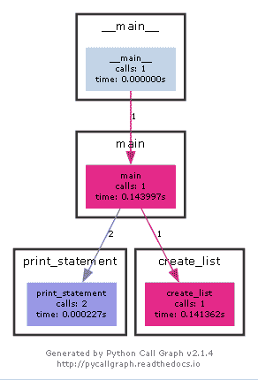

PyCallGraph 的监控.py 脚本调用图。

在每个框中，你都有函数的名称、花费的时间和调用次数。就像 snakeviz 一样，如果你的代码有多个依赖项，图表可能会非常复杂。但颜色表示瓶颈。在复杂的代码中，研究它以查看依赖关系和关系是非常有趣的。

#### b/ PyInstrument

[PyInstrument](https://pypi.org/project/pyinstrument/3.0.0b3/) 也是一个非常容易使用的 Python 性能分析器。你可以通过以下方式将分析器添加到你的脚本中：

```py
from pyinstrument import Profiler

profiler = Profiler()
profiler.start()

# code you want to profile

profiler.stop()
print(profiler.output_text(unicode=True, color=True))
```

输出给出

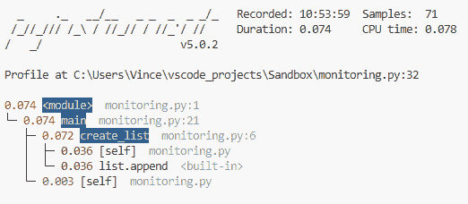

它比 cProfile 更详细，但同时也更易读。你的函数会被突出显示并按时间排序。

但 PyInstrument 的真正优势在于其 html 输出。要获取此 html 输出，只需在终端中输入：

```py
pyinstrument --html .\monitoring.py
# or
uv run pyinstrument --html .\monitoring.py
```

它启动一个文件浏览器界面，你可以从中选择两种数据可视化：调用栈和时序。

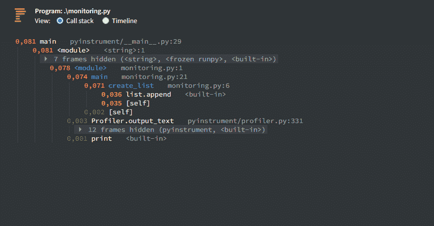

监控.py 脚本的调用栈表示（作者提供）。

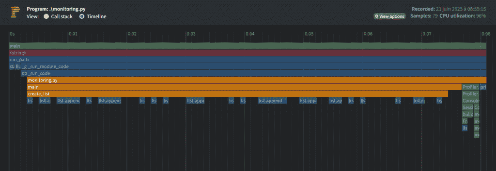

监控.py 脚本的时序表示（作者提供）。

在这里，配置文件更详细，你有许多选项可以进行筛选。

* * *

## CPU/GPU 性能分析器

CPU 和 GPU 性能分析是分析程序在中央处理器（CPU）和图形处理器（GPU）上的利用率和性能的过程。通过测量这些处理单元上代码不同部分的资源消耗量，开发者可以识别性能瓶颈，了解代码的执行位置，并优化应用程序以实现更好的性能和效率。

据我所知，只有一个软件包可以分析 GPU 功耗。

### 1/ Scalene

[Scalene](https://github.com/plasma-umass/scalene) 是一个专为 Python 设计的高性能 CPU、GPU 和内存性能分析器。它是一个开源软件包，提供详细的洞察。它设计得既快又准确，易于使用，是开发者优化代码的绝佳工具。

+   **CPU/GPU 性能分析：** Scalene 提供了关于 CPU/GPU 利用的详细信息，包括代码不同部分所花费的时间。它可以帮助您识别性能瓶颈，并优化代码以获得更好的执行时间。

+   **内存性能分析：** Scalene 跟踪内存分配和释放，帮助您了解代码如何使用内存。这对于识别内存泄漏或优化内存密集型应用程序特别有用。

+   **逐行性能分析：** Scalene 提供逐行性能分析，这为您提供了代码中每行所花费时间的详细分解。这个特性对于定位性能问题非常有价值。

+   **可视化：** Scalene 包含一个图形界面，用于可视化性能分析结果，这使得理解和导航数据更加容易。

为了突出 Scalene 的所有优势，我开发了以下函数，目的是消耗内存 `memory_waster()`，CPU `cpu_waster()` 和 GPU `gpu_convolution()`。所有这些都在脚本 `scalene_tuto.py` 中。

```py
import random
import copy
import math
import cupy as cp
import numpy as np

def memory_waster():
    """Wastes memory but in a controlled way"""
    memory_hogs = []

    # Create moderately sized redundant data structures
    for i in range(100):
        garbage_data = []
        for j in range(1000):
            waste = f"Useless string #{j} repeated " * 10
            garbage_data.append(waste)
            garbage_data.append(
                {
                    "id": j,
                    "data": waste,
                    "numbers": [random.random() for _ in range(50)],
                    "range_data": list(range(100)),
                }
            )
        memory_hogs.append(garbage_data)

    for iteration in range(4):
        print(f"Creating copy #{iteration}...")
        memory_copy = copy.deepcopy(memory_hogs)
        memory_hogs.extend(memory_copy)

    return memory_hogs

def cpu_waster():
    meaningless_result = 0

    for i in range(10000):
        for j in range(10000):
            temp = (i**2 + j**2) * random.random()
            temp = temp / (random.random() + 0.01)
            temp = abs(temp**0.5)
            meaningless_result += temp

            # Some trigonometric operations
            angle = random.random() * math.pi
            temp += math.sin(angle) * math.cos(angle)

        if i % 100 == 0:
            random_mess = [random.randint(1, 1000) for _ in range(1000)]  # Smaller list
            random_mess.sort()
            random_mess.reverse()
            random_mess.sort()

    return meaningless_result

def gpu_convolution():
    image_size = 128
    kernel_size = 64

    image = np.random.random((image_size, image_size)).astype(np.float32)
    kernel = np.random.random((kernel_size, kernel_size)).astype(np.float32)

    image_gpu = cp.asarray(image)
    kernel_gpu = cp.asarray(kernel)

    result = cp.zeros_like(image_gpu)

    for y in range(kernel_size // 2, image_size - kernel_size // 2):
        for x in range(kernel_size // 2, image_size - kernel_size // 2):
            pixel_value = 0
            for ky in range(kernel_size):
                for kx in range(kernel_size):
                    iy = y + ky - kernel_size // 2
                    ix = x + kx - kernel_size // 2
                    pixel_value += image_gpu[iy, ix] * kernel_gpu[ky, kx]
            result[y, x] = pixel_value

    result_cpu = cp.asnumpy(result)
    cp.cuda.Stream.null.synchronize()

    return result_cpu

def main():
    print("\n1/ Wasting some memory (controlled)...")
    _ = memory_waster()

    print("\n2/ Wasting CPU cycles (controlled)...")
    _ = cpu_waster()

    print("\n3/ Wasting GPU cycles (controlled)...")
    _ = gpu_convolution()

if __name__ == "__main__":
    main()
```

对于 GPU 函数，您必须根据您的 CUDA 版本安装 `cupy`（使用 `nvcc --version` 获取版本信息）

```py
pip install cupy-cuda12x # (in your virtual environment)
# or
uv add install cupy-cuda12x
```

关于安装 cupy 的更多详细信息，请参阅[文档](https://docs.cupy.dev/en/stable/install.html)。

要运行 Scalene，请使用以下命令

```py
scalene scalene_tuto.py
# or
uv run scalene scalene_tuto.py
```

它默认分析 CPU、GPU 和内存。如果您只想选择一个或一些选项，请使用标志 `--cpu`、`--gpu` 和 `--memory`。

Scalene 提供了行级和函数级性能分析。它有两个接口：命令行界面（CLI）和网页界面。

> **重要提示：** 使用 Ubuntu 和 WSL 结合 Scalene 会更好。否则，性能分析器无法检索内存消耗信息。

#### a) 命令行界面

默认情况下，Scalene 的输出是网页界面。要获取 CLI，请添加标志 `--cli`。

```py
scalene scalene_tuto.py --cli
# or
uv run scalene scalene_tuto.py --cli
```

您有以下结果：

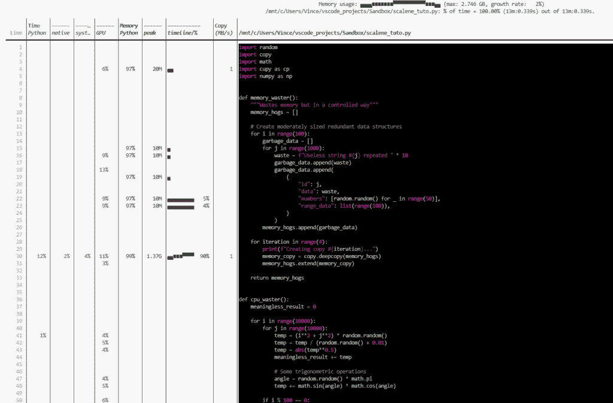

Scalene 在终端的输出（作者提供）。

*默认情况下，代码以深色模式显示。所以如果你像我一样在浅色模式下工作，结果可能不太美观。*

可视化分为三种不同的颜色，每种颜色代表不同的分析指标。

+   蓝色部分代表 CPU 分析，它提供了执行 Python 代码、本地代码（如 C 或 C++）和系统相关任务（如 I/O 操作）所花费时间的分解。

+   绿色部分专门用于内存分析，显示了 Python 代码分配的内存百分比，以及随时间推移的整体内存使用情况和峰值值。

+   黄色部分专注于 GPU 分析，显示了 GPU 的运行时间和 GPU 与 CPU 之间复制的数据量，以 mb/s 为单位。值得注意的是，GPU 分析目前仅限于 NVIDIA GPU。

#### b) 网页界面。

网页界面分为三个部分。

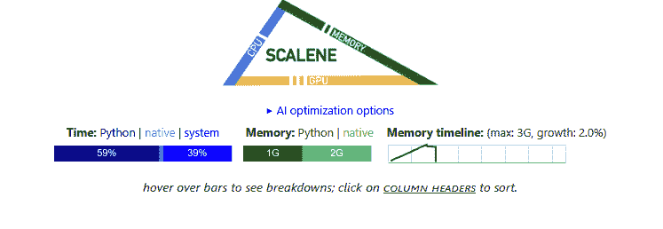

分析的大图

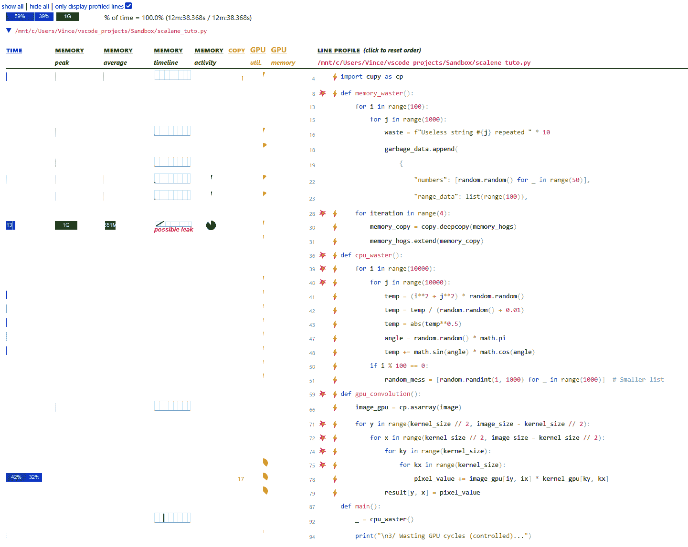

按行详细

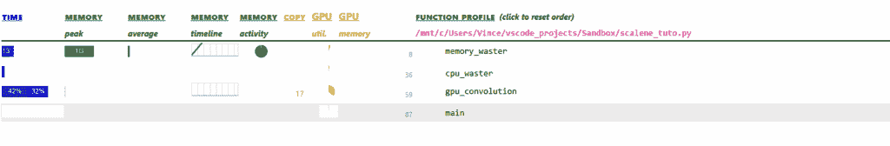

浏览器中的 Scalene 界面（作者提供）。

颜色代码与命令行界面相同。但增加了一些图标：

+   💥: 可优化代码区域（在函数分析部分显示性能指示）。

+   ⚡: 可优化代码行。

#### c) AI 建议

Scalene 的一个巨大优势是能够使用 AI 来改善你已识别的缓慢和/或过度消耗。它目前支持 OpenAI API、Amazon BedRock、Azure OpenAI 和 ollama 在本地。

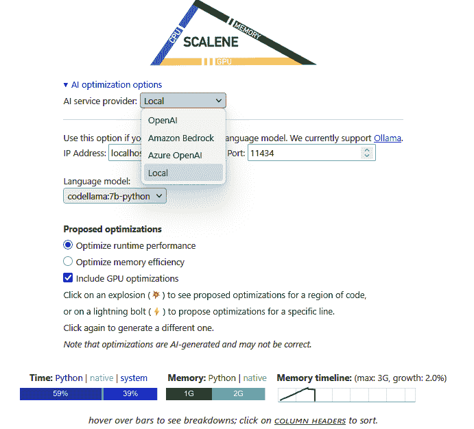

Scalene AI 优化选项菜单（作者提供）。

在选择你的工具后，如果你想优化代码的一部分或只是一行，只需点击💥或⚡。

我使用 ollama 的`codellama:7b-python`来优化`gpu_convolution()`函数。不幸的是，正如界面中提到的：

> *请注意，这些优化是由 AI 生成的，可能不正确。*

所建议的优化都没有成功。但代码库本身不利于优化，因为它被人为地复杂化了。只需删除不必要的行以节省时间和内存。此外，我使用了一个小型模型，这可能是原因之一。

尽管我的测试结果并不明确，但我认为这个选项可能很有趣，并且肯定会继续改进。

* * *

## 结论

现在，我们对我们开发中的资源消耗不太关心，而且这些优化不足很快就会积累起来，使代码变慢，对于生产来说太慢，有时甚至需要购买更强大的硬件。

当涉及到识别需要优化的区域时，代码分析工具是必不可少的。

内存分析器和行分析器的组合提供了一个非常好的初始分析：易于设置，报告易于理解。

如 cProfile 和 Scalene 之类的工具功能全面且具有图形表示，但需要更多时间进行分析。最后，Scalene 提供的 AI 优化选项是一项真正的资产，即使在我的情况下，所使用的模型不足以提供任何相关内容。

* * *

对 Python 和数据分析感兴趣？

关注我获取更多教程和见解！

+   在[走向数据科学](https://towardsdatascience.com/author/vmargot/)上阅读更多内容

+   在[LinkedIn](https://fr.linkedin.com/in/vincent-margot-ph-d-31904087)上与我联系
