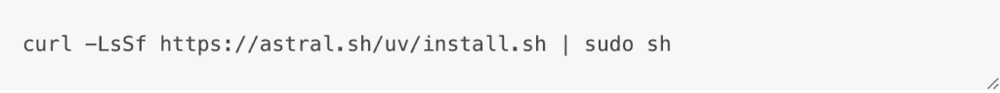
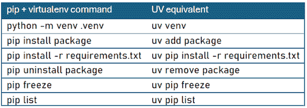

# 数据科学家：从学校到工作，第一部分

> 原文：[`towardsdatascience.com/data-scientist-from-school-to-work-part-i/`](https://towardsdatascience.com/data-scientist-from-school-to-work-part-i/)

现在，数据科学项目不再仅仅停留在概念验证阶段；每个项目都有在生产环境中使用的目标。因此，交付高质量的代码变得尤为重要。我作为一名数据科学家已经工作了十多年，我注意到初级数据科学家通常在开发方面水平较弱，这是可以理解的，因为要成为一名数据科学家，你需要掌握数学、统计学、算法学、开发技能，并对运营开发有所了解。在这个系列文章中，我想分享一些关于如何管理专业的 Python 数据科学项目的技巧和最佳实践。从 Python 到 Docker，再到 Git，我将介绍我每天使用的工具。

* * *

前几天，一位同事告诉我他因为对 Python 的不正确操作而不得不重新安装 Linux。他恢复了一个他想要定制的旧项目。由于安装和卸载包以及更改版本，他的基于 Linux 的 Python 环境不再可用：这是一个本可以轻易避免的事件，只需设置虚拟环境即可。但它显示了管理这些环境的重要性。幸运的是，现在有一个出色的工具可以做到这一点：[**uv**](https://github.com/astral-sh/uv)。

这两个字母的起源并不清楚。根据 Zanie Blue（其中一位创造者）的说法：

“我们考虑了大量的名字——在如今这个时代，没有冲突地选择一个名字真的很困难，所以每个名字都是权衡的结果。uv 是在 PyPI 上给我们的，以 Astral 为主题（即紫外或通用），而且**简短**且易于输入。”

现在，让我们更详细地了解一下这个出色的工具。

* * *

### **简介**

UV 是一个现代、简约的 Python 项目和包管理器。它完全用 Rust 开发，旨在简化依赖关系管理、虚拟环境创建和项目管理。UV 旨在限制常见的 Python 项目问题，如依赖冲突和环境管理。它旨在提供比传统的 pip + virtualenv 组合或 Conda 管理器等工具更流畅、更直观的体验。据称，它的速度比传统处理程序快 10 到 100 倍。

无论是为了小型个人项目还是开发用于生产的 Python 应用程序，UV 都是包管理的一个强大且高效的解决方案。

* * *

### **开始使用 UV**

#### **安装**

如果你在使用 Windows，我建议在 shell 中使用以下命令来安装 UV：

```py
winget install --id=astral-sh.uv  -e
```

如果你使用的是 Mac 或 Linux，请使用以下命令：



要验证正确安装，只需在终端中输入以下命令：

```py
uv version
```

#### **创建新的 Python 项目**

使用 UV，您可以通过指定 Python 版本来创建新项目。要开始新项目，只需在终端中输入：

```py
uv init --python x:xx project_name
```

`*``python x:xx`*必须替换为所需的版本（例如，`*``python 3.12`*）。如果您没有指定的 Python 版本，UV 将负责此操作并下载正确的版本以启动项目。

此命令创建并自动初始化一个名为`project_name*.*`的 Git 仓库。它包含几个文件：

+   一个`.gitignore`文件。它列出了在 git 版本控制中要忽略的仓库元素（它是基本的，应该为准备部署的项目重写）。

+   一个`.python-version`文件。它指示项目中使用的 Python 版本。

+   `README.md`文件。它用于描述项目并解释如何使用它。

+   一个`hello.py`文件。

+   `pyproject.toml`文件。此文件包含有关用于构建项目的所有工具的信息。

+   `uv.lock`文件。当您使用 UV 运行脚本时，用于创建虚拟环境（它可以与`requierements.txt`进行比较）。

#### **包安装**

要安装下一个环境中的新包，您必须使用：

```py
uv add package_name
```

当第一次使用`add`命令时，UV 会在当前工作目录中创建一个新的虚拟环境并安装指定的依赖项。会出现一个`.venv/`目录。在随后的运行中，UV 将使用现有的虚拟环境，仅安装或更新请求的新包。此外，UV 拥有强大的依赖解析器。在执行`add`命令时，UV 会分析整个依赖图，以找到满足所有要求（包版本和 Python 版本）的兼容包版本集。最后，在每次`add`命令之后，UV 都会更新`pyproject.toml`和`uv.lock`文件。

要卸载一个包，请输入以下命令：

```py
uv remove package_name
```

非常重要的是要从环境中清理未使用的包。您必须尽可能保持依赖文件最小化。如果一个包不再使用，它必须被删除。

#### **运行 Python 脚本**

现在，您的仓库已初始化，您的包已安装，您的代码准备进行测试。您可以使用通常的方式激活创建的虚拟环境，但使用 UV 的`run`命令会更高效：

```py
uv run hello.py
```

使用运行命令可以保证脚本将在项目的虚拟环境中执行。

***

### **管理 Python 版本**

通常建议使用不同的 Python 版本。如前所述，您可能正在处理一个需要旧 Python 版本的老项目。而且，更新版本通常会非常困难。

```py
uv python list
```

在任何时间，都可以更改项目的 Python 版本。为此，您需要修改`pyproject.toml`文件中的`requires-python`行。

例如：`requires-python = “>=3.9”`

然后，您必须使用以下命令同步您的环境：

```py
uv sync
```

命令首先检查现有的 Python 安装。如果找不到请求的版本，UV 将下载并安装它。UV 还在项目目录中创建一个新的虚拟环境，替换旧的虚拟环境。

但新环境没有所需的包。因此，在 sync 命令之后，你必须输入：

```py
uv pip install -e .
```

* * *

### **从 virtualenv 切换到 uv**

如果你有一个使用 pip 和 virtualenv 初始化的 Python 项目，并希望使用 UV，那么操作将非常简单。如果没有*requirements*文件，你需要激活你的虚拟环境，然后检索包及其安装版本。

```py
pip freeze > requirements.txt
```

然后，你必须使用 UV 初始化项目并安装依赖项：

```py
uv init .
uv pip install -r requirements.txt
```



pip + virtualenv 与 UV 之间的对应表，图片由作者提供。

* * *

### **使用工具**

UV 提供了通过*uv tool*命令使用**工具**的可能性。工具是提供命令界面的 Python 包，例如*ruff*、*pytests*、*mypy*等。要安装一个工具，输入以下命令行：

```py
uv tool install tool_name
```

但是，即使没有安装，也可以使用工具：

```py
uv tool run tool_name
```

为了方便，创建了一个别名：*uvx*，它等同于*uv tool run*。因此，要运行一个工具，只需输入：

```py
uvx tool_name
```

* * *

### **结论**

UV 是一个强大且高效的 Python 包管理器，旨在提供快速的依赖解析和安装。它显著优于传统的工具如*pip*或*conda*，使其成为管理 Python 项目的绝佳选择。

无论你是在处理小脚本还是大型项目，我建议你养成使用 UV 的习惯。相信我，尝试一下就意味着接受它。

* * *

### **参考文献**

1 — UV 文档：[`docs.astral.sh/uv/`](https://docs.astral.sh/uv/)

2 — UV GitHub 仓库：[`github.com/astral-sh/uv`](https://github.com/astral-sh/uv)

3 — 一篇优秀的 datacamp 文章：[`www.datacamp.com/tutorial/python-uv`](https://www.datacamp.com/tutorial/python-uv)
