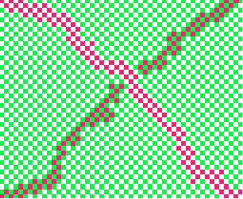
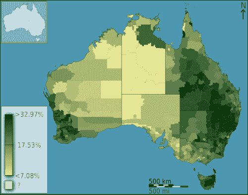
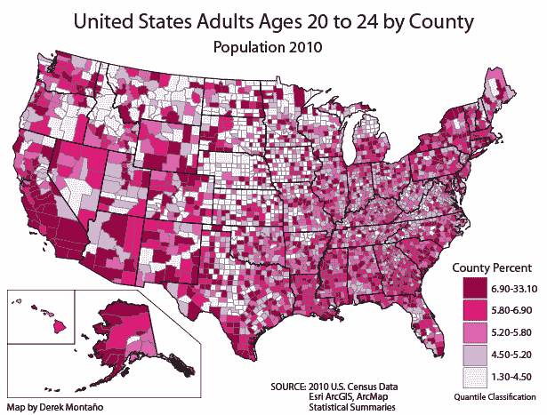
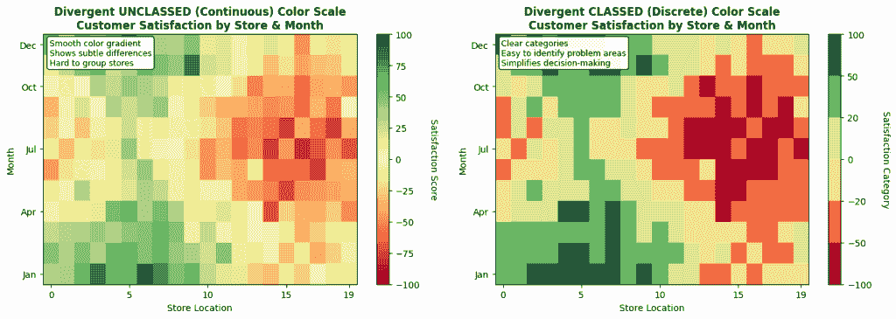
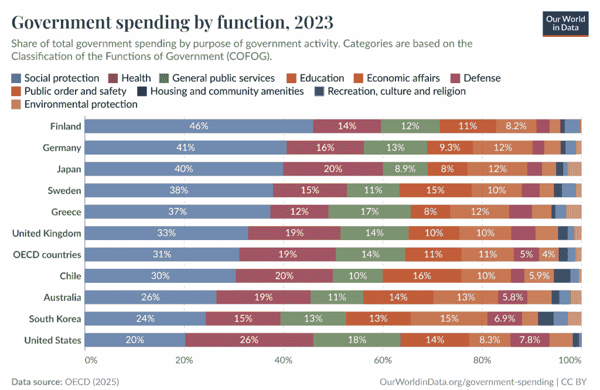

# 数据可视化解释（第三部分）：颜色的作用

> 原文：[`towardsdatascience.com/data-visualization-explained-part-3-the-role-of-color/`](https://towardsdatascience.com/data-visualization-explained-part-3-the-role-of-color/)

*这是我的数据可视化系列中的第三篇文章。请参阅[第一部分：“数据可视化解释：它是什么以及为什么它很重要”](https://towardsdatascience.com/data-visualization-explained-what-it-is-and-why-it-matters/)和[第二部分：“数据可视化解释：视觉变量的介绍”](https://towardsdatascience.com/data-visualization-explained-part-2-an-introduction-to-visual-variables/)*。

<mdspan datatext="el1759866028213" class="mdspan-comment">下面图片中你看到了多少种颜色？</mdspan>

大多数人看到四种：白色、绿色和两种不同色调的粉红色。实际上，这两种色调是完全相同的；图片中只有三种颜色。

这个流行的视觉错觉说明了在设计数据可视化时需要考虑的一个重要事实：不恰当的颜色组合可能会欺骗人的眼睛。要全面地处理颜色，我需要深入研究人眼的生理细节，了解我们实际上是如何“看到”颜色的。

然而，鉴于这不是一篇眼科文章，我将专注于构建清晰数据可视化所需的基本颜色使用原则。

## 颜色色调与颜色明度的区别

当我在[上一篇文章](https://towardsdatascience.com/data-visualization-explained-part-2-an-introduction-to-visual-variables/)中介绍视觉编码通道时，我展示了与颜色相关的两个不同通道：色调和明度。让我们正式讨论这些内容。

**颜色色调**是你听到“颜色”这个词时通常想到的东西。红色、绿色、蓝色、粉色、黄色等都是不同的*色调*。另一方面，**颜色明度**指的是单个色调的“亮度”。下面的图片展示了彩虹颜色的不同明度，显示了相同的色调在亮度和饱和度上可以有很大的变化：

图片由[Wikimedia Commons](https://commons.wikimedia.org/wiki/File:RGB_color_wheel_72.svg)提供

虽然这两种都可以是有效的视觉编码（[请参阅本系列中的上一篇文章，其中详细讨论了视觉编码](https://towardsdatascience.com/data-visualization-explained-part-2-an-introduction-to-visual-variables/)），但颜色明度相对于色调有一个显著的优点：**即使可视化以灰度打印，人们仍然可以感知到它**。

## 颜色刻度类型

如果你想要使用颜色作为视觉编码，你需要首先选择一个颜色刻度。在这样做的时候，你需要考虑以下几个特性：

+   如果你的数据是名义的，那么你可以使用一个分类颜色刻度，它完全依赖于颜色色调。

+   对于定量数据，你还需要做出两个额外的决定：1）你的尺度将是顺序的还是分离的（即是否使用一种或两种色调），2）你的尺度将是连续的还是分成类别的。

因此，我们有五种颜色尺度可供选择，以下将逐一讨论：1）顺序和无类别，2）顺序和类别，3）分离和无类别，4）分离和类别，以及 5）分类 [1]。

顺序尺度（一种色调）用于可视化从低到高的数值。分离尺度在数值从负到正变化或设计者希望强调尺度两端颜色之间的差异时非常有用。

当然，这些只是一般规则。不同的尺度类型根据特定的可视化效果而有所不同，有时可能不止一种尺度适用。

### 顺序和无类别

下面的地图使用顺序的、无类别的颜色尺度来展示在 2011 年人口普查时自称为英国国教的澳大利亚人的比例。我们可以看到，从浅到深，绿色这一单色值的强度在增加。由于只有一种颜色，因此没有差异，并且由于尺度是连续的，所以没有类别。

[图片由 Toby Hudson 在维基共享资源提供](https://commons.wikimedia.org/wiki/User:99of9)

### 顺序和类别

与上面的可视化相比，我们可以看到下面的美国地图有离散的类别，这些类别会改变颜色值。它仍然是顺序的，因为只使用了粉红色调。随着一个县内 20 多岁成年人的百分比增加，颜色值也随之增加。

这项可视化中一个值得注意的元素是类别的非均匀性。（注意最大类别的宽度。）这并不总是好的做法，特别是如果没有给出原因。[图片由 Derek Montaño 在维基共享资源提供](https://commons.wikimedia.org/wiki/File:Choropleth_Map.png)。

### 分离的、类别的和无类别的

分离尺度相对较难理解，所以让我们通过一个比较示例来同时考虑这两种类型。这样做，我们还将看到类别的和无类别尺度的不同优势。

下面的两个图表是用 Python 和模拟数据生成的。数据包括以下视觉表示（即视觉编码通道）：

+   x 轴由表示商店位置的数字组成。

+   y 轴代表一年的月份。

+   颜色代表通过虚构商店每月调查收集到的“客户满意度评分”。

这些可视化的分类与未分类方面与上面的顺序尺度类似。在左边的（未分类）尺度中，代表所有数值的全集，而在右边的（分类）尺度中，颜色代表分组后的值桶。左边的可视化提供了更高的精度，但右边的更容易理解和应用。

这些尺度的发散方面更为复杂。让我们来分解一下：

+   这里使用的发散尺度有两种颜色：红色和绿色（正如我们将在文章后面看到的，这并不是世界上最易获取的颜色）。

+   中性、白色颜色（或分类尺度中的两种浅色）代表数据中的逻辑“中间点”，在这种情况下是值*0*。

+   这个中间点至关重要，因为它使得一个发散的尺度自然地适用于数据。如果数值只是在一个方向上移动而没有一个有意义的中心，使用超过一种颜色就没什么意义了。

### 分类

最后，也是可能最直接的，颜色尺度类型是分类的。下面的图表，展示了各国政府资金分配情况，提供了一个清晰的例子。

图片由[我们的世界数据](https://ourworldindata.org/grapher/government-spending-by-function)提供

如果你一直关注本章讨论的原则，你可能会注意到这并不是一个特别设计良好的数据可视化。它传达了基本观点，但颜色太多，导致最终设计混乱。

话虽如此，这是一个有效的分类尺度使用，正确地将这种尺度类型应用于名义数据（具有明显、无序类别的数据）。**在数据可视化中常见的错误之一——也是你应该小心避免的是——当你的数据显示出明显的数值增加或减少时，使用具有几种不同色调的分类尺度。**在这些情况下，根据你的具体数据，参考上面讨论的某种颜色尺度。

这总结了你在进行有效数据可视化时必须了解的颜色尺度的基本知识。为了总结，让我们看看一些关于如何使用颜色的一些额外技巧。

## （不要）过度使用颜色

在可视化中不需要使用颜色时使用颜色可能会很有诱惑力。例如，很常见的是看到带有清晰的 x 轴标签的条形图，用以区分不同颜色的条形，尽管条形本身已经通过标签区分开来。

这并不是*错误*的，但可能是多余的。如果只有几个类别并且它们与其他可视化相关联，那么当然可以使用颜色提供额外的视觉提示。然而，如果可视化没有颜色也能正常工作，那么就别强迫它了。

通常情况下，应避免任何不必要的编码（表示），除非它们为观众提供一些额外的解释便利。这要么是浪费的，因为那个编码通道本可以用于其他变量，要么是令人困惑的，因为观众需要自行判断额外的编码是否描绘了超出他们理解范围的内容。

## 使调色板易于访问

**这一点虽然简短，但极其重要。**不要假设你能够区分可视化中的颜色，其他人也能做到。数据可视化应该对所有观众都易于访问，包括各种类型色盲的人[2]。

例如，考虑上面关于发散色阶的章节中的 Python 可视化。你认为红绿色盲的人能够正确解读它吗？不太可能。

幸运的是，我们不需要做太多额外的工作来确保我们的可视化易于访问。有无数在线工具[3, 4, 5]，它们可以自动检查你选择的调色板的易访问性。其中一些甚至可以帮助你生成它们。利用这些工具，尽可能使你的可视化易于访问。

## 最后的想法

恭喜！随着本系列文章的第三篇，你已经学到了设计引人入胜的数据可视化所必需的基本原则。在接下来的文章中，我们将最终开始设计和构建我们自己的可视化！直到那时。

## 参考文献

[1] [`blog.datawrapper.de/which-color-scale-to-use-in-data-vis/`](https://blog.datawrapper.de/which-color-scale-to-use-in-data-vis/)

[2] [`www.nei.nih.gov/learn-about-eye-health/eye-conditions-and-diseases/color-blindness/types-color-vision-deficiency`](https://www.nei.nih.gov/learn-about-eye-health/eye-conditions-and-diseases/color-blindness/types-color-vision-deficiency)

[3] [`coolors.co/contrast-checker/112a46-acc8e5`](https://coolors.co/contrast-checker/112a46-acc8e5)

[4] [`webaim.org/resources/contrastchecker/`](https://webaim.org/resources/contrastchecker/)

[5] [`accessibleweb.com/color-contrast-checker/`](https://accessibleweb.com/color-contrast-checker/)
