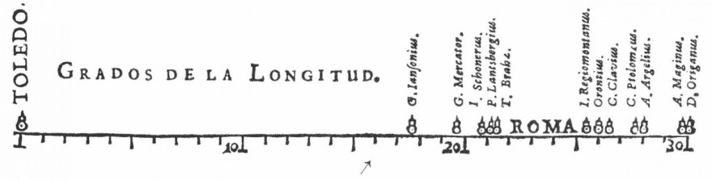
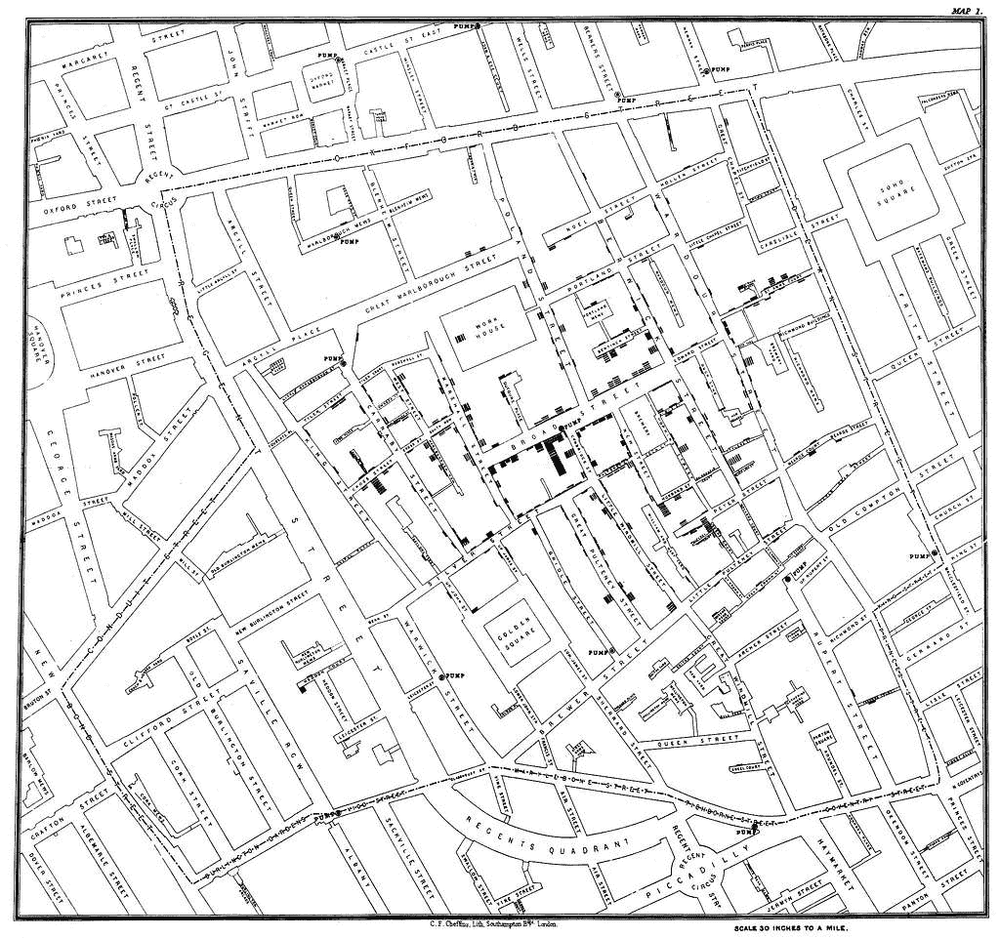

# 数据可视化解释：它是什么以及为什么它很重要

> 原文：[`towardsdatascience.com/data-visualization-explained-what-it-is-and-why-it-matters/`](https://towardsdatascience.com/data-visualization-explained-what-it-is-and-why-it-matters/)

<mdspan datatext="el1758324859574" class="mdspan-comment">人工智能和机器学习</mdspan>在数据科学领域目前吸引了所有的炒作，但我认为它们都是次要的，并且经常被忽视的一个重要领域。

在处理数据时，有两个基本步骤：

1.  处理和分析数据以提取有意义的见解。

1.  ***将这些见解传达给他人。***

第二点至关重要，但往往被忽视。世界上最先进的算法或有益的见解，如果没有人能够理解它，那么它就是无用的。作为一名数据科学家，你必须学会向他人传达你的见解。这有不止一个原因，明显的一个是，如果正确的人理解了数据，整个世界都将受益。然而，还有一个同样重要的原因：在向他人描述我们的发现时，我们往往会发现错误、更深入的知识或进一步探索的领域。

在这篇文章中，我们将探讨一个强大而有效的工具，它可以帮助实现上述的第二步：**数据可视化**。这是系列文章的第一篇，将绝对初学者带入数据可视化的领域。这篇文章是通用的，轻松的，旨在作为整个领域的介绍。在随后的文章中，我将深入探讨更技术性的方面，最终通过教你如何构建自己的数据可视化来结束这一系列文章。

拥有这些知识，你将能够以新的、令人兴奋的方式处理你的数据。

> ***“图片的最大价值在于它迫使我们注意到我们从未预料到看到的东西。” – 约翰·图基***

## 什么是数据可视化？

许多人通过一个受限的视角看待数据可视化，只将标准图表，如条形图、折线图等，归类为真正的数据可视化。从这个角度来看，数据可视化直到 18 世纪中叶才出现。（以下我们将看到一些例子。）

然而，我们最好拓宽我们的视野。数据的视觉转换绝不限于我们的传统观念。它们已经存在了数千年。例如，这里有*世界图像* [1]，世界上已知最古老的地图，作为古巴比伦城市的遗物被发现：

图片来源：[维基媒体共享](https://commons.wikimedia.org/wiki/File:The_Babylonian_map_of_the_world,_from_Sippar,_Mesopotamia..JPG)

这张地图将巴比伦置于中心，很可能是一个用于可视化我们现在正式称为地理空间数据的极其有用的工具。它是世界上最早的数据可视化之一。

有许多来自各种古代文明的类似图表和图像——洞穴壁画、日历、石雕，甚至是埃及象形文字——这些都是最初形式难以理解的数据的有效视觉表示。将这些例子视为数据可视化，引导我们到一个重要的原则：

**数据可视化在其核心上，不过是将一些数据——无论是数值的、文本的还是其他任何形式的数据——应用一种转换来视觉化表示**。

这个基础原则导致了一些相关话题，主要涉及进行这些转换的最有效方法，其中“有效”可以松散地理解为“诚实、易于理解且信息丰富”。

## 数据可视化的早期例子

现在我们已经扩大了关于什么是数据可视化的视野，让我们来看看一些现代的例子。下面是 1644 年由 Michael Florent Van Langren [2]开发的图表。这是我们认为是传统统计数据的最早图形表示之一，描绘了罗马和托莱多之间经度的差异估计。

这张地图描绘了罗马和托莱多城市之间经度差异的 12 个估计值。

让我们考虑一个更复杂的例子——一个直接突出图基上述引言的例子。

下面是 1854 年伦敦 Soho 区的地图 [3]。它是由 John Snow 设计的，目的是确定当时使城镇衰弱的霍乱爆发是否有任何模式：

1854 年伦敦 Soho 区霍乱爆发期间的死亡地图。图片来源：[Picryl 公共领域](https://picryl.com/media/snow-cholera-map-1-cbadea)

将目光转向地图的中心，我们可以看到一个异常大量的死亡人数靠近 Broad 街上的水龙头。调查确定这个水龙头被污染，是疾病传播的主要原因。

这个例子恰好突出了我们上面提到的约翰·图基的原则：**数据可视化最有效的用途之一是快速看到在数据最初形式中难以找到的洞察力**。

## 精确性和灵活性

数据可视化是一个广泛而深入的主题，可以从许多不同的角度来探讨。尽管如此，无论你从事的是哪种具体形式的数据可视化，都应该牢记两个原则：**精确性**和**灵活性**。

一个好的数据可视化不会试图完成定义不明确的工作，比如显示数据集的*本质*或总结关于数据集的*所有重要内容*。这样的陈述是主观的，基本上是不可能实现的。

相反，一个好的数据可视化以一种让用户更容易理解的方式突出显示相关数据的一个特定和明确定义的方面。你在开始设计可视化之前，应该始终明确你想要表达的数据内容。

为了内化这个原则，回想一下数据可视化的初衷是有帮助的：以清晰和有用的方式展示数据集的见解。**我们希望使数据更容易理解**。精确性确保我们达到这个目标。试图做太多的事情可能会让观众更加困惑。生产一个以更清晰的方式涵盖更少数据的作品要好得多。质量比数量更重要。

看一下下面的数据表，其中包含美国不同城市的信息。

| 姓名 | 城市 | 收入 | 职业 |
| --- | --- | --- | --- |
| Sarah Mitchell | Denver, CO | $72,500 | 营销经理 |
| Jamal Rodriguez | Houston, TX | $58,300 | 电工 |
| Priya Desai | Seattle, WA | $91,200 | 软件工程师 |
| Thomas Nguyen | Chicago, IL | $64,800 | 护士 |

以下哪个是上述数据的更好可视化选择？

1.  一个试图使用条形图简化数据表中信息的数据可视化，其中一个轴上有名字，另一个轴上有薪水，用颜色区分城市，并在条上使用纹理（虚线、斜线等）来区分职业。

1.  与上面的相同可视化，但这次排除了专业。换句话说，一个基于名字和薪水的条形图，根据位置给条上色。

很有诱惑力选择第一个，但事实是，它试图做太多。展示有限、有针对性的信息比让听众困惑要好。

除了要精确外，保持灵活性也很重要。没有完美的数据可视化。总是有改进的空间，而且数据可视化通常随着每次修订而变得更好。当然，在某个时候，数据可视化必须与他人分享并发挥作用。

这导致了一个困境——修订到什么程度才算足够？这个问题没有明确的答案。修订可视化的过程必须谨慎进行。向太多的人寻求建议可能会得到一堆半成品、相互矛盾的意见。另一方面，不进行任何修订就发布可视化的初稿可能会导致结果不尽如人意。

虽然没有完美的解决方案，但有一些指导方针你可以遵循：

+   确定有 2-3 个人对你的可视化作品提供反馈。

+   务必确保你的名单包括以下人员：

    +   一个精通设计数据可视化的审稿人

    +   对用于开发可视化的数据有深入了解的审稿人（例如，政治科学家对选举数据）

    +   是可视化目标受众之一的审稿人

+   与**这些人**进行 2-3 轮反馈和修订。这将确保可视化改进的持续性和逻辑性。

## 最后的想法和展望

在许多方面，数据可视化类似于写作。即使是最多产和最有才华的作者也有编辑，他们的书籍在获得出版批准之前都要经过广泛的修订。为什么？简单的原因是好的写作在很大程度上取决于受众，而精心策划的修订确保了书籍最终读者的最佳体验。同样的想法也适用于数据可视化。

通过遵循这些指南，你可以确保你开发出的数据可视化是稳健的，基于最佳实践，正确地展示了手头的数据，并且对目标受众来说是可理解的。

它们是有效数据可视化的关键，也是未来文章中将要讨论的高级可视化技术的基石。在此之前。

## 参考文献

[1] [`commons.wikimedia.org/wiki/File:The_Babylonian_map_of_the_world,_from_Sippar,_Mesopotamia..JPG`](https://commons.wikimedia.org/wiki/File:The_Babylonian_map_of_the_world,_from_Sippar,_Mesopotamia..JPG)

[2] *《定量信息的视觉展示》*，爱德华·图费

[3] [`picryl.com/media/snow-cholera-map-1-cbadea`](https://picryl.com/media/snow-cholera-map-1-cbadea)
