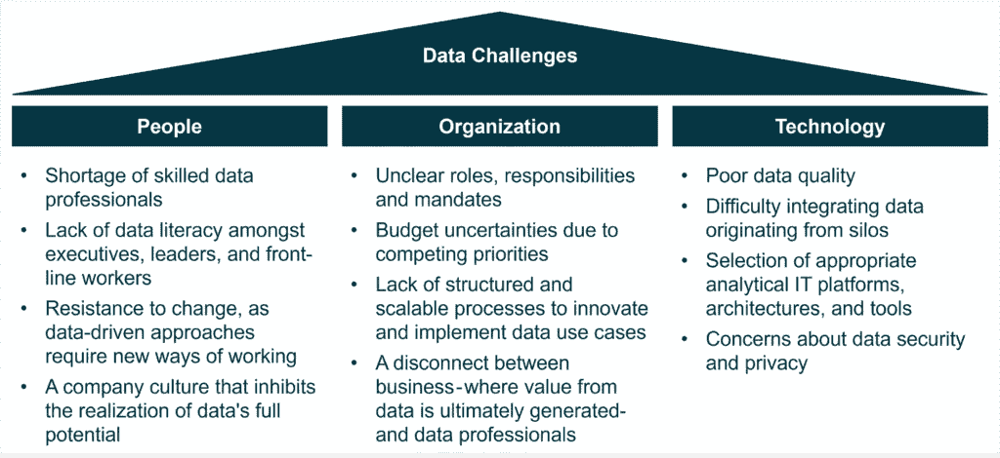
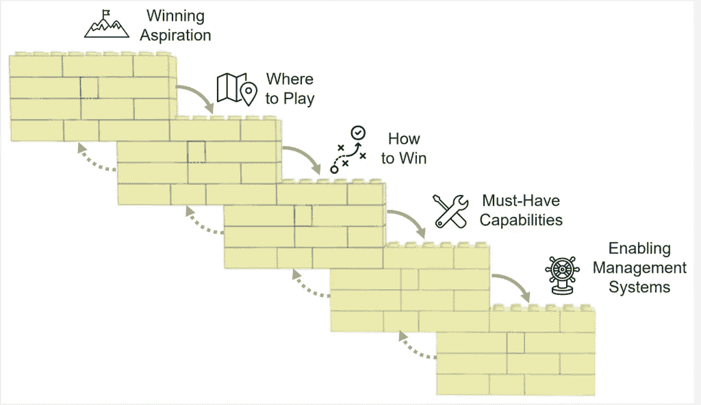
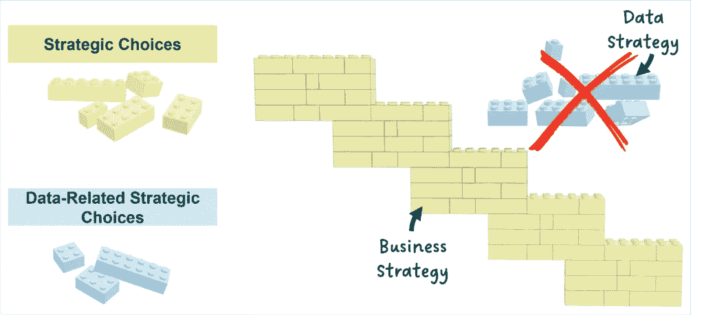
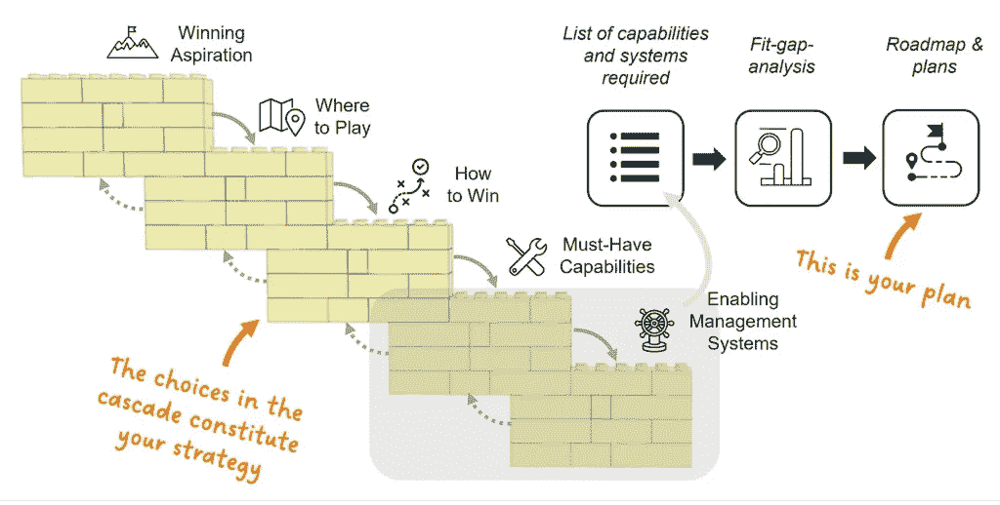
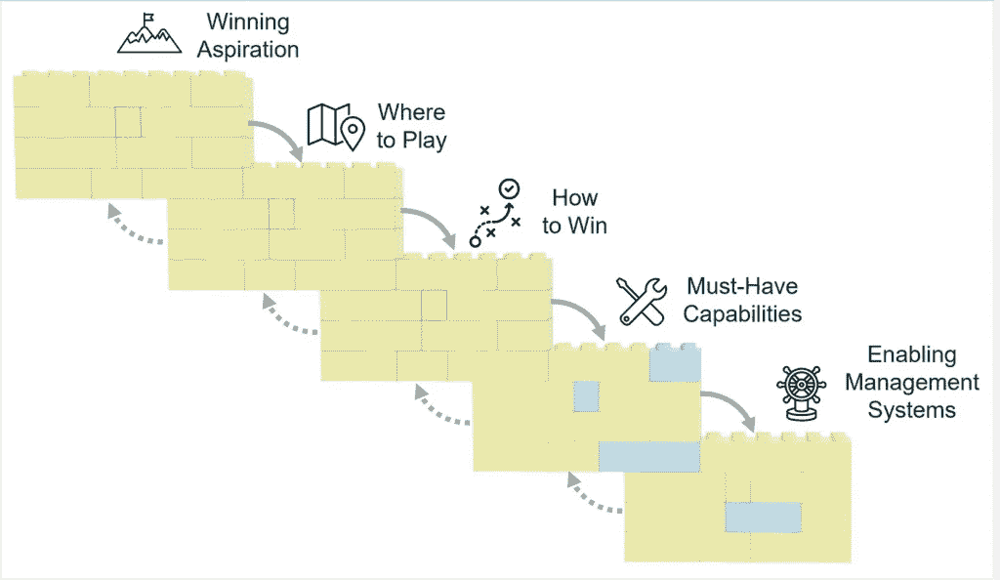
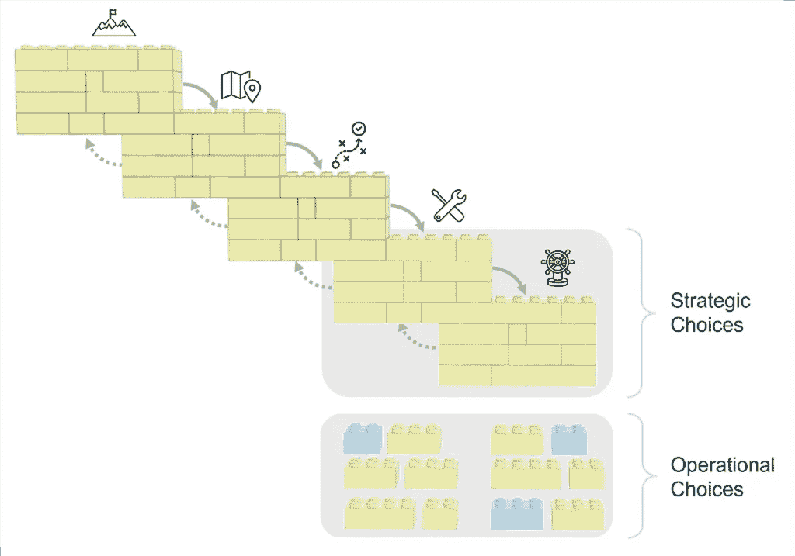
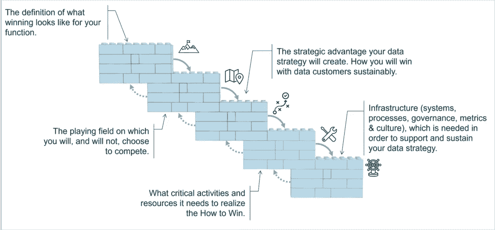

# 数据与商业战略

> 原文：[`towardsdatascience.com/data-vs-business-strategy/`](https://towardsdatascience.com/data-vs-business-strategy/)

*似乎有一个共识，即利用数据、分析和人工智能来创建数据驱动型组织需要明确的战略方法。然而，在实践上，这种战略方法应该是什么样子，却缺乏清晰性和共识。*

*本文简要概述了我认为成为数据驱动型企业所需进行的战略工作。它总结了最近撰写的一篇*[*详细深入分析*](https://medium.com/towards-data-science/how-most-organizations-get-data-strategy-wrong-and-how-to-fix-it-b8afa59f1533)*，这是该系列*[*揭秘数据战略*](https://contributor.insightmediagroup.io/tagged/demystify-data-strategy)*的第四部分。*

*[*我是 Jens*](https://jens-linden.de/)*，一位具有近二十年实施数据和人工智能用例经验的企业数据专家。我帮助各行业的领导者设计战略，培养能够释放数据和算法全部潜力的文化。

## 目录

1 成为数据驱动型企业的挑战

2 数据战略的问题

3 理解商业战略

4 常见的数据战略误区

5 设计数据驱动型组织的战略

6 结论

参考文献

## 1. 成为数据驱动型企业的挑战

商业界目前正忙于人工智能（AI）的发展——从领先技术公司之间构建更先进模型的竞赛，到普通企业利用人工智能降低成本、创造新的收入来源或减轻风险的机会。

尽管时间将揭示人工智能的利弊全貌，但让我们超越炒作，关注组织如何利用今天的数据来优化或扩展其现有的商业模式。

数据可以通过各种方式被利用，包括：

+   **控制**：创建静态报告以进行监控和监督

+   **自动化**：自动化任务和决策，以应对复杂的商业挑战

+   **决策制定**：生成支持复杂商业问题决策的见解

+   **创新**：创造见解，提出并回答关于客户、竞争对手、技术和行业的问题

数据的潜力几乎覆盖了每个行业，包括医疗保健、金融、零售、制造、能源和公用事业、软件开发、媒体和公共部门。此外，数据驱动的机会存在于组织的整个价值链以及大多数支持功能中。

尽管有巨大的潜力，许多组织在识别和释放数据、分析和人工智能的价值方面仍然面临挑战。没有简单的食谱或普遍的计划可以成为数据驱动型企业。这是一个复杂的挑战。

首先，为公司提供价值的用例高度特定于其环境。其次，不仅用例是独特的，而且塑造组织成为数据驱动旅程的人、挑战和外部条件也是独特的。

组织在试图利用数据时面临的常见挑战包括**人员**、**组织**和**技术**。

图 1：常见的数据挑战可以分为三个类别。

成为数据驱动的复杂性得到了广泛认可，许多组织认识到需要一种战略方法来管理这种复杂性。因此，“*数据战略*”这个术语已经引起了极大的关注。

但数据战略究竟是什么？它解决了哪些问题，又没有解决哪些问题？

## 2. 数据战略的问题

我认为在这些问题上，无论是在数据社区还是在商业专业人士中，都没有普遍的共识。此外，我断言，许多现有的数据战略解释都包含根本性的误解[1](https://medium.com/towards-data-science/how-most-organizations-get-data-strategy-wrong-and-how-to-fix-it-b8afa59f1533#586b)。

我在*数据领域*工作了大约 20 年——最初作为行业和咨询公司的数据科学家，后来作为数据战略家帮助组织应对他们在成为数据驱动型组织过程中面临的许多挑战。认识到对数据战略缺乏共同理解，我觉得有效地引导组织需要更深入地掌握商业战略。

通过我对商业战略设计的探索，我得出以下结论：

1.  **商业战略本身被广泛误解**——尽管存在既定的定义。即使没有数据方面，缺乏“*战略素养*”也阻止了许多公司取得更大的成功——包括利用数据。

1.  **数据战略经常被误解**——它的使用和解释经常与既定的定义和著名的战略框架相矛盾。

在我看来，这种缺乏共同理解造成了严重的问题。它阻碍了数据专业人士——像我这样的人——与高管之间的集中讨论，最终成为寻求释放数据价值的组织道路上的另一个障碍。

然而，我相信这个问题是可以解决的。我的建议是采用一个既定的商业战略框架，并将其应用于设计数据驱动型组织。通过这样做，我们可以为商业领导者和数据专业人士创造一个共同的语言和共享的理解。

我的雄心不是要贬低那些成功应用自己方法的尊敬的同事。对于复杂问题没有单一的解决方案。我的目标更多的是为商业和数据专业人士的清晰性和共同语言做出贡献——最终提高设计数据驱动型组织的有效性。

本文是对我最近发布的[详细操作手册的总结[1]](https://medium.com/towards-data-science/how-most-organizations-get-data-strategy-wrong-and-how-to-fix-it-b8afa59f1533)，提供了一个简洁而专注的概述。

## 3. 理解商业战略

商业战略关乎做出深思熟虑的选择——关于公司的雄心、它服务的客户、它提供的产品或服务，以及它相对于竞争对手如何提供卓越价值的选择。它还包括关于优先考虑哪些活动和需要哪些系统来衡量成功和进步的选择。每个公司都会做出这些选择——要么是通过战略设计过程的自觉和明确，要么是通过无意识和隐性的方式。

> 战略被定义为一系列**整合**和**相互加强**的选择，这些选择共同形成了一个令人信服的逻辑，即公司如何在市场上获胜。获胜意味着创造可持续的竞争优势，并相对于竞争提供卓越的价值。

这个战略的定义与由全球公认的商业思想家、CEO 顾问、前 Monitor 顾问和 Rotman 商学院荣誉教授[Roger Martin [3]](https://rogerlmartin.com/)开发的[Playing to Win 框架[2]](https://rogerlmartin.com/lets-read/playing-to-win)相一致。

我个人认为 Playing to Win 是最强大的战略框架之一。我选择 Playing to Win，因为它被广泛认为是有效战略设计的标准。此外，它还附带一个全面的资源生态系统，包括文献[[2](https://rogerlmartin.com/lets-read/playing-to-win)，[4](https://rogerlmartin.com/archive/medium-posts/-in-thought-pillars,strategy)]，[结构化流程[4a]](https://rogermartin.medium.com/the-strategic-choice-structuring-process-5e116b12ae1f)，[模板和培训计划[5]](https://www.ideou.com/blogs/inspiration/how-to-make-your-strategy-real)——所有这些都有助于任何类型战略的设计和实施。

上述战略定义的一个关键方面是*整合*——构成成功战略的选择必须形成一个统一的整体。它们必须逻辑上相互一致并相互加强，从而形成一个合理的、难以复制的理论，即如何超越竞争对手。

为了说明这个概念，我倾向于使用乐高积木的类比——正如乐高积木相互连接形成坚固的结构，战略选择也必须紧密相连，以创造稳固的竞争逻辑。

“玩赢”框架将战略选择组织成五个关键构建块，在所谓的策略选择级联中可视化：

图 2：策略选择级联有助于在策略设计过程中构建你需要回答的战略选择。将选择视为乐高积木。

级联图表明，组织需要做出以下选择：

1.  **获胜愿景**：对组织来说，获胜意味着什么。

1.  **在哪里竞争**：为哪些客户服务以及提供哪些产品或服务。

1.  **如何获胜**：在所选市场中的获胜方法。

1.  **能力**：需要的核心活动和资源。

1.  **管理系统**：构建和维护这些能力所需的系统、流程、规范、文化和指标。

这些选择不是一个松散连接的列表，而必须仔细整合，形成一个连贯而有说服力的整体——这就是你的策略。

另一个策略的关键特征是它**是单一的**[4b](https://rogermartin.medium.com/strategy-is-singular-4876ac92a824)。这意味着一个在某个地理区域销售单一产品的公司需要一个业务策略。然而，一个组织也可能有额外的职能策略。如果一个职能有自己的预算，[它需要策略来指导其投资选择[6]](https://hbr.org/2019/07/the-one-thing-you-need-to-know-about-managing-functions)。这导致了人力资源、信息技术或市场营销策略等策略的发展。

## 4. 常见的数据策略误解

一个持续的误解是，需要一个单独的数据/分析/BI/AI 策略来定义这些元素如何创造价值和竞争优势。然而，我们刚刚确定一个有效的业务策略是单一的：有一个连贯的战略选择集，决定了组织如何创造竞争优势并相对于竞争对手提供更优质的价值。

引入一个单独的策略，定义组织如何通过数据、分析和人工智能赢得胜利，同时还有一个定义如何以其他方式赢得胜利的业务策略——这既不必要也不可取。用 1986 年幻想动作冒险电影《高人》中的话来说：[*“只能有一个。”* [7]](https://www.linkedin.com/posts/jens-linden_datastrategy-analytics-ai-activity-7289530100855783424-Xa2m/)

图 3：常见数据策略误解的说明：数据策略不应定义组织如何与业务策略一起使用数据创造价值和竞争优势。

以这种功能失调的形式提出数据策略很可能会激怒业务专业人士和主管——尤其是那些对策略有深刻理解的人。同样的原则也适用于**数字策略**——将其视为一个独立的实体，而不是将其嵌入到业务策略中，会导致类似的错位。

对于数据战略的另一种典型误解，你只需询问 ChatGPT（这里我使用了 o3-mini-high 版本），它很好地平均了互联网提供的信息：“数据战略是一个全面的计划，概述了组织如何收集、管理、分析和利用数据作为战略资产来推动决策并实现其商业目标。”

将计划与战略混淆是一种众所周知的误解——即使在数据背景下也是如此。[罗杰·马丁](https://rogerlmartin.com/)，"赢在游戏"框架的创始人，投入了大量的时间和精力来解释[计划和战略之间的区别 [8](https://www.youtube.com/watch?v=iuYlGRnC7J8), 4c-f]。

从本质上讲，计划关注确定性——它们概述了具有时间表、可交付成果、预算和责任的项目。另一方面，战略是关于不确定性的——它由代表组织如何赢得胜利的赌注的选择组成。[规划补充战略](https://rogermartin.medium.com/strategy-vs-planning-complements-not-substitutes-ea08e56809d6)但不取代它。它应作为激活战略的手段自然地跟随战略设计。

图 4：计划与战略：计划遵循您的战略工作。

## 5. 设计数据驱动组织的战略

那么，为了设计一个数据驱动的组织，需要什么样的战略工作呢？答案是直接的：如果数据、分析和人工智能有助于提高公司的竞争力，相关的选择就必须嵌入到您的商业战略中。与任何提供竞争优势的方法一样，与数据相关的战略选择不应孤立存在，而应作为单一商业战略的有机组成部分。

图 5：与数据相关的战略选择是您商业战略的一部分。

在[战略设计过程 [4a]](https://medium.com/@rogermartin/the-strategic-choice-structuring-process-5e116b12ae1f)中，组织必须确定数据可以创造竞争优势的地方。这定义了组织的*战略数据需求*。

然而，并非每个组织都能通过数据、分析或人工智能来区分自己 [[9](https://medium.com/towards-data-science/the-root-cause-of-why-organizations-fail-with-data-ai-0095a73cf5ab)]。对于一些人来说，与数据相关的努力可能仅限于运营层面，专注于财务报告、流程效率或其他标准实践，这些实践竞争对手也在遵循。在这种情况下，您的组织拥有“仅仅”*运营数据需求*。

图 6：能力和系统方面的运营选择补充了少数战略选择。

无论数据扮演的是战略角色还是运营角色——或者两者都是——许多组织都需要一个专门的数据、分析、BI、洞察和/或人工智能职能。为了有效运作，[这个职能需要一个策略[6]](https://hbr.org/2019/07/the-one-thing-you-need-to-know-about-managing-functions)。根据其范围和重点，你可能会选择称之为你的[‘数据策略’[10]](https://contributor.insightmediagroup.io/the-data-strategy-choice-cascade-9f2742b81bda)。

图 7：数据策略选择级联。

想要了解更多细节？我邀请读者深入了解[我的数据策略手册[1]](https://medium.com/towards-data-science/how-most-organizations-get-data-strategy-wrong-and-how-to-fix-it-b8afa59f1533)，其中包含详细的过程、最佳实践和行业案例。

## 6. 结论

策略是业务成功的关键。不幸的是，严格而有效的业务策略设计似乎已经失传。这是组织试图应用功能失调的数据策略变体，以良好的意图帮助组织实现数据驱动的一个原因。

然而，一个精心设计的商业策略是独一无二的，它定义了一个组织如何在市场上获胜。如果一个公司借助数据和人工智能获胜，这些战略选择仅仅是商业策略的一部分，形成了一个有说服力的逻辑，说明了组织如何可持续地超越竞争对手。

因此，组织必须发展策略和数据素养作为设计数据驱动型组织的基础要素。此外，必须摒弃功能失调的数据策略方法，为共享语言和相互理解创造空间。

通过利用现有的和已建立的策略框架，组织可以超越围绕数据策略的常见误解，并确保数据、分析和人工智能真正成为业务成功的推动者。

## 参考文献

[1] Jens Linden，[How Most Organizations Get Data & AI Strategy Wrong — and How to Fix It](https://medium.com/towards-data-science/how-most-organizations-get-data-strategy-wrong-and-how-to-fix-it-b8afa59f1533)（2025），发表在[Towards Data Science](https://contributor.insightmediagroup.io/)上的文章

[2] A. G. Lafley 和 Roger L. Martin，[Playing to Win](https://rogerlmartin.com/lets-read/playing-to-win)（2013），由哈佛商业评论出版社出版的书籍

[3] [Roger Martin 的网站](https://rogerlmartin.com/)(2024)

[4] Roger Martin，[Playing to Win/ Practitioner Insights](https://rogerlmartin.com/archive/medium-posts/-in-thought-pillars,strategy)（2024），包含文章列表的网站

[4a] Roger Martin, [战略选择结构化过程](https://medium.com/@rogermartin/the-strategic-choice-structuring-process-5e116b12ae1f) (2024), 来自“玩到赢实践洞察”系列的 Medium 文章 [‘Playing to Win Practitioner Insights’](https://rogerlmartin.com/archive/medium-posts)

[4b] Roger Martin, [战略是唯一的](https://rogermartin.medium.com/strategy-is-singular-4876ac92a824) (2023), 来自“玩到赢实践洞察”系列的 Medium 文章 [‘Playing to Win Practitioner Insights’](https://rogerlmartin.com/archive/medium-posts)

[4c] Roger Martin, [五大致命战略迷思](https://rogermartin.medium.com/the-five-deadliest-strategy-myths-7331995f68fd), 来自“玩到赢实践洞察”系列的 Medium 文章 [‘Playing to Win Practitioner Insights’](https://rogerlmartin.com/archive/medium-posts)

[4d] Roger Martin, [为什么规划比战略更重要？](https://rogermartin.medium.com/why-planning-over-strategy-88555015af3c) (2022), 来自“玩到赢实践洞察”系列的 Medium 文章 [‘Playing to Win Practitioner Insights’](https://rogerlmartin.com/archive/medium-posts)

[4e] Roger Martin, [战略与规划：补充而非替代](https://rogermartin.medium.com/strategy-vs-planning-complements-not-substitutes-ea08e56809d6) (2024), 来自“玩到赢实践洞察”系列的 Medium 文章 [‘Playing to Win Practitioner Insights’](https://rogerlmartin.com/archive/medium-posts)

[4f] Roger Martin, [从战略到规划](https://rogermartin.medium.com/from-strategy-to-planning-7555234d6cc8) (2021), 来自“玩到赢实践洞察”系列的 Medium 文章 [‘Playing to Win Practitioner Insights’](https://rogerlmartin.com/archive/medium-posts)

[5] Jennifer Riel, [如何让你的战略变得真实](https://www.ideou.com/blogs/inspiration/how-to-make-your-strategy-real) (2024), IDEOU 博客条目

[6] Roger Martin, Jennifer Riel, [关于管理职能你需要知道的一件事](https://hbr.org/2019/07/the-one-thing-you-need-to-know-about-managing-functions) (2019), 发表在《哈佛商业评论》的文章

[7] Jens Linden, [数据战略的转折点——只有一个选择！](https://www.linkedin.com/posts/jens-linden_datastrategy-analytics-ai-activity-7289530100855783424-Xa2m) (2025), LinkedIn 博客条目

[8] Roger Martin, [计划并非战略](https://www.youtube.com/watch?v=iuYlGRnC7J8) (2022), 视频

[9] Jens Linden, [组织在数据与 AI 上失败的根本原因](https://medium.com/towards-data-science/the-root-cause-of-why-organizations-fail-with-data-ai-0095a73cf5ab) (2024), 在[Toward Data Science](https://contributor.insightmediagroup.io/)上发表的 Medium 文章

[10] Jens Linden, [数据战略选择级联](https://contributor.insightmediagroup.io/the-data-strategy-choice-cascade-9f2742b81bda) (2024), 在[Towards Data Science](https://contributor.insightmediagroup.io/)上发表的 Medium 文章
